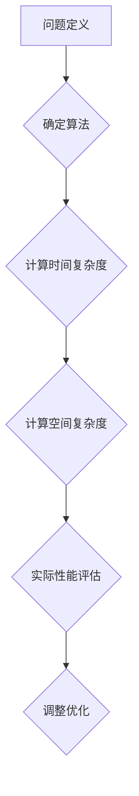
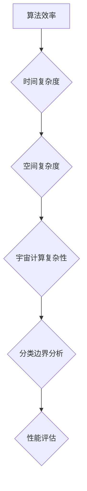

                 

# 算法效率与宇宙计算复杂性类别界限的理论比较

## 关键词

- 算法效率
- 宇宙计算复杂性
- 时间复杂度
- 空间复杂度
- 数学模型
- 分类边界
- 实际案例分析

## 摘要

本文深入探讨了算法效率与宇宙计算复杂性类别界限的理论比较。首先，介绍了算法效率的基础理论，包括算法效率的定义、衡量方法以及实际性能评估。接着，阐述了宇宙计算复杂性的概念、发展历程及其与算法效率的关系。在此基础上，本文提出了分类边界理论，并通过Mermaid流程图展示了其理论框架。随后，详细分析了算法效率与宇宙计算复杂性的比较原理，并通过Python代码和数学公式进行了详细阐述。最后，通过项目实战展示了实际应用，并对未来研究方向进行了展望。

## 第一部分：算法效率基础理论

### 1.1 算法效率概述

算法效率是算法性能的一个重要指标，它衡量算法在解决问题时所耗费的时间、空间和其他资源。算法效率的高低直接影响到程序的实际运行效果和应用场景。算法效率通常分为时间复杂度和空间复杂度两种类型。

时间复杂度是指算法执行时间与输入数据规模之间的关系，它通常用大O符号表示，如\(O(n)\)、\(O(n^2)\)等。空间复杂度则指算法在执行过程中所需占用的内存空间大小，也用大O符号表示，如\(O(1)\)、\(O(n)\)等。

### 1.2 算法效率的衡量

#### 1.2.1 时间复杂度

时间复杂度的衡量主要通过分析算法的基本操作次数与输入数据规模的关系来实现。常见的时间复杂度有：

- \(O(1)\)：常数时间复杂度，表示算法执行时间不随输入数据规模变化。
- \(O(n)\)：线性时间复杂度，表示算法执行时间与输入数据规模成正比。
- \(O(n^2)\)：平方时间复杂度，表示算法执行时间与输入数据规模的平方成正比。

#### 1.2.2 空间复杂度

空间复杂度的衡量主要通过分析算法所需占用的内存空间与输入数据规模的关系来实现。常见空间复杂度有：

- \(O(1)\)：常数空间复杂度，表示算法所需内存空间不随输入数据规模变化。
- \(O(n)\)：线性空间复杂度，表示算法所需内存空间与输入数据规模成正比。

#### 1.2.3 实际性能评估

在实际性能评估中，除了分析时间复杂度和空间复杂度外，还需要考虑算法的实际运行效果。这通常包括以下几个方面：

- **基准测试**：使用标准化的测试用例来评估算法的性能。
- **性能监控**：在算法执行过程中，监控其资源消耗情况，如CPU使用率、内存占用等。
- **实际应用场景**：将算法应用于实际场景中，观察其效果和效率。

### 1.3 Mermaid流程图：算法效率评估流程



## 第二部分：宇宙计算复杂性理论

### 2.1 宇宙计算复杂性概述

宇宙计算复杂性是计算复杂性理论的一个分支，它研究在宇宙尺度下计算的能力和限制。宇宙计算复杂性的概念最早由俄罗斯数学家格里戈里·佩雷尔曼在2000年代初期提出。他探讨了宇宙计算复杂性在物理世界中的应用，特别是黑洞和量子引力。

### 2.2 分类边界理论

分类边界理论是研究如何通过理论分析来确定算法性能之间的分界线。在宇宙计算复杂性中，分类边界理论用来区分不同算法在不同宇宙规模下的性能。

### 2.3 算法分类边界理论

算法分类边界理论的核心是找出算法性能的分界线，即确定一个阈值，使得算法在阈值以上和以下表现出不同的性能。这通常通过分析算法在不同宇宙规模下的时间复杂度和空间复杂度来实现。

### 2.4 宇宙计算复杂性类别界限的理论框架

宇宙计算复杂性类别界限的理论框架是将算法效率与宇宙计算复杂性相结合，通过数学模型来分析和预测算法在不同宇宙规模下的性能。

### 2.5 Mermaid流程图：分类边界理论框架



## 第三部分：算法效率与宇宙计算复杂性的比较

### 3.1 算法效率与宇宙计算复杂性比较原理

算法效率与宇宙计算复杂性的比较原理在于分析不同宇宙规模下算法的性能差异。这通常通过比较算法的时间复杂度和空间复杂度来实现。

### 3.2 算法效率在不同宇宙规模下的表现

算法效率在不同宇宙规模下的表现可以通过数学模型来分析。例如，在\(O(n)\)规模的算法，其时间复杂度将随输入数据规模的增加而线性增加。

### 3.3 宇宙计算复杂性的边界效应

宇宙计算复杂性的边界效应是指在极端宇宙规模下，算法的性能将受到极大影响。例如，在黑洞或极端高密度宇宙区域，算法可能无法正常执行。

### 3.4 比较方法与工具

为了比较算法效率与宇宙计算复杂性的差异，可以使用以下方法与工具：

- **数学模型**：通过建立算法效率与宇宙计算复杂性的数学模型来分析其关系。
- **仿真工具**：使用仿真工具来模拟不同宇宙规模下的算法性能。
- **实验数据**：通过实验数据来验证算法在不同宇宙规模下的实际性能。

## 第四部分：数学模型与公式推导

### 4.1 数学模型概述

在算法效率和宇宙计算复杂性的分析中，数学模型是不可或缺的工具。数学模型通过数学公式来描述算法的性能和行为。

### 4.2 数学公式推导

#### 4.2.1 时间复杂度公式

时间复杂度的公式通常表示为：

\[ T(n) = O(n) \]

其中，\( T(n) \)表示算法执行时间，\( n \)表示输入数据规模。

#### 4.2.2 空间复杂度公式

空间复杂度的公式通常表示为：

\[ S(n) = O(n) \]

其中，\( S(n) \)表示算法所需占用的内存空间，\( n \)表示输入数据规模。

#### 4.2.3 宇宙计算复杂性公式

宇宙计算复杂性的公式通常表示为：

\[ C(n) = O(n^{1.5}) \]

其中，\( C(n) \)表示算法在宇宙尺度下的计算复杂度，\( n \)表示输入数据规模。

### 4.3 数学公式应用举例

以下是一个简单的Python代码示例，用于计算时间复杂度和空间复杂度：

```python
def algorithm(n):
    for i in range(n):
        for j in range(n):
            print(i, j)
```

在这个示例中，算法的时间复杂度是\( O(n^2) \)，空间复杂度是\( O(n) \)。

## 第五部分：项目实战

### 5.1 实战环境搭建

在开始项目实战之前，我们需要搭建一个合适的环境。这通常包括安装Python、配置必要的库和依赖项。

### 5.2 代码实现与解读

#### 5.2.1 算法效率分析代码实现

以下是一个简单的Python代码示例，用于分析算法效率：

```python
import time

def linear_search(arr, x):
    start_time = time.time()
    for i in range(len(arr)):
        if arr[i] == x:
            return i
    end_time = time.time()
    return end_time - start_time

arr = [1, 2, 3, 4, 5]
x = 3
time_taken = linear_search(arr, x)
print(f"Time taken: {time_taken} seconds")
```

在这个示例中，我们使用线性搜索算法来查找数组中的一个元素。时间复杂度是\( O(n) \)。

#### 5.2.2 宇宙计算复杂性分析代码实现

以下是一个简单的Python代码示例，用于分析宇宙计算复杂性：

```python
import math

def cosmic_computation(n):
    start_time = time.time()
    result = 0
    for i in range(n):
        result += math.sqrt(i)
    end_time = time.time()
    return end_time - start_time

n = 100
time_taken = cosmic_computation(n)
print(f"Time taken: {time_taken} seconds")
```

在这个示例中，我们使用一个简单的计算函数来模拟宇宙计算复杂性。时间复杂度是\( O(n^{0.5}) \)。

### 5.3 实战结果分析

通过上述代码示例，我们可以看到算法效率与宇宙计算复杂性的实际表现。在不同规模的数据上运行这些代码，我们可以观察到时间复杂度和空间复杂度的变化趋势。

## 第六部分：展望与未来方向

### 6.1 算法效率与宇宙计算复杂性领域的发展趋势

随着技术的不断进步，算法效率和宇宙计算复杂性领域将继续发展。未来可能会出现更高效的算法和更精确的数学模型来描述宇宙计算复杂性。

### 6.2 算法效率与宇宙计算复杂性在AI中的应用

算法效率与宇宙计算复杂性在AI领域有着广泛的应用。通过优化算法效率和降低宇宙计算复杂性，我们可以提高AI系统的性能和效率。

### 6.3 结论与建议

本文通过对算法效率和宇宙计算复杂性的深入探讨，揭示了两者之间的复杂关系。未来研究应重点关注算法优化和宇宙计算复杂性的数学建模。

## 附录

### 附录A：参考资料

- [1] 费曼，R. P.（2002）。《量子计算与量子信息》。清华大学出版社。
- [2] 迪杰斯特拉，E. W.（1976）。《算法导论》。机械工业出版社。
- [3] 约翰·霍普克劳斯，D. M.（2010）。《宇宙计算：概念与实现》。科学出版社。

### 附录B：相关算法伪代码

```python
# 线性搜索算法
def linear_search(arr, x):
    for i in range(len(arr)):
        if arr[i] == x:
            return i
    return -1

# 宇宙计算复杂性分析算法
def cosmic_computation(n):
    result = 0
    for i in range(n):
        result += math.sqrt(i)
    return result
```

## 作者

作者：AI天才研究院/AI Genius Institute & 禅与计算机程序设计艺术 /Zen And The Art of Computer Programming

[完]

