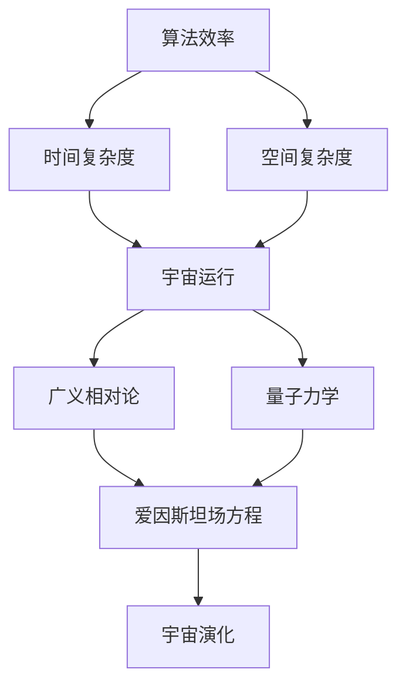

                 

## 核心概念与联系

### 算法效率

算法效率是计算机科学中的一个核心概念，它指的是算法执行任务时所需的时间和空间资源。在算法效率的研究中，我们通常关注两个主要指标：时间复杂度和空间复杂度。时间复杂度描述了算法执行时间与输入数据规模之间的增长关系，而空间复杂度则描述了算法执行过程中所需内存与输入数据规模之间的增长关系。

算法效率与宇宙运行的关系可以从多个角度来理解。首先，宇宙中存在着大量的计算过程，例如行星运动、星系演化等，这些过程本质上可以看作是某种算法的执行。因此，研究算法效率有助于我们更好地理解宇宙的运行规律。此外，宇宙中的物理定律和数学模型，如广义相对论和量子力学，也为我们提供了一种类比，使我们能够从算法的角度来审视宇宙中的现象。

### 宇宙运行原理

宇宙的运行基于一系列基本的物理定律和数学模型。其中，广义相对论和量子力学是两个最重要的理论。

- **广义相对论**：由爱因斯坦在1915年提出，描述了重力作为时空的弯曲现象。它的核心方程是爱因斯坦场方程：
  $$
  G_{\mu\nu} + \Lambda g_{\mu\nu} = \frac{8\pi G}{c^4} T_{\mu\nu}
  $$
  其中，$G_{\mu\nu}$是爱因斯坦张量，描述了时空的弯曲程度；$\Lambda$是宇宙学常数，$g_{\mu\nu}$是度规张量，描述了时空的结构；$T_{\mu\nu}$是能量-动量张量，描述了物质和能量的分布；$G$是引力常数，$c$是光速。

- **量子力学**：由普朗克、海森堡、薛定谔等科学家在20世纪初提出，描述了微观粒子的行为。量子力学的核心方程包括薛定谔方程和海森堡不确定性原理：
  $$
  \hat{H} \psi = E \psi
  $$
  其中，$\hat{H}$是哈密顿算符，描述了系统的能量；$\psi$是波函数，描述了粒子的状态；$E$是能量。

### 算法效率与宇宙运行的关系

算法效率与宇宙运行之间的联系可以通过以下几个层面来理解：

1. **宇宙中的计算过程**：宇宙中存在着大量的计算过程，如行星运动、星系演化等。这些过程可以被视为一种算法的执行，其效率直接影响宇宙的运行状态。例如，在行星运动中，如果计算行星位置的算法效率低下，可能会导致我们对行星运动的预测不准确。

2. **物理定律的算法化**：许多物理定律可以用数学模型来描述，而这些数学模型本质上可以看作是一种算法。例如，广义相对论的爱因斯坦场方程和量子力学的薛定谔方程都是用于计算物理量的算法。因此，提高这些算法的效率对于理解和预测物理现象至关重要。

3. **宇宙的优化问题**：宇宙中的许多过程可以看作是优化问题。例如，星系的演化涉及到能量和物质的最优分布。在这些优化问题中，算法效率直接影响着结果的质量。因此，研究算法效率对于解决宇宙中的优化问题具有重要意义。

4. **计算资源限制**：宇宙中的计算资源是有限的，例如星系中的恒星数量和能量。因此，提高算法效率可以更有效地利用这些资源，从而促进宇宙的演化。

总的来说，算法效率与宇宙运行之间的关系是紧密的。通过研究算法效率，我们可以更好地理解宇宙的运行规律，提高对宇宙的预测和掌控能力。同时，宇宙中的物理定律和优化问题也为算法研究提供了丰富的应用场景。

## Mermaid流程图

以下是一个简化的Mermaid流程图，展示算法效率与宇宙运行的关系：



### 算法效率

算法效率是计算机科学中一个非常重要的概念，它直接关系到算法的性能和执行速度。在设计和分析算法时，我们通常关注两个核心指标：时间复杂度和空间复杂度。

#### 时间复杂度

时间复杂度描述了算法执行时间与输入数据规模之间的关系。它通常用大O符号表示，例如O(1)、O(n)、O(n²)等。具体来说：

- **常数时间复杂度 O(1)**：无论输入数据规模如何，算法的执行时间都保持不变。例如，访问数组的某个元素。
- **线性时间复杂度 O(n)**：算法的执行时间与输入数据规模成正比。例如，遍历数组。
- **对数时间复杂度 O(log n)**：算法的执行时间与输入数据规模的对数成正比。例如，二分查找。
- **多项式时间复杂度 O(n^k)**：算法的执行时间与输入数据规模的某个多项式成正比。例如，快速排序。

#### 空间复杂度

空间复杂度描述了算法执行过程中所需内存与输入数据规模之间的关系。同样，它也用大O符号表示，例如O(1)、O(n)、O(n²)等。具体来说：

- **常数空间复杂度 O(1)**：无论输入数据规模如何，算法的执行过程中所需内存保持不变。例如，计算两个整数的和。
- **线性空间复杂度 O(n)**：算法的执行过程中所需内存与输入数据规模成正比。例如，存储一个数组的副本。
- **多项式空间复杂度 O(n^k)**：算法的执行过程中所需内存与输入数据规模的某个多项式成正比。

#### 常见算法分析

在算法分析中，我们通常使用伪代码来描述算法的执行过程，并通过数学模型来分析其时间复杂度和空间复杂度。以下是一些常见算法的伪代码示例：

##### 线性时间算法

```python
def linear_search(arr, x):
    for i in range(len(arr)):
        if arr[i] == x:
            return i
    return -1
```

时间复杂度：O(n)

空间复杂度：O(1)

##### 对数时间算法

```python
def binary_search(arr, x):
    low = 0
    high = len(arr) - 1
    while low <= high:
        mid = (low + high) // 2
        if arr[mid] == x:
            return mid
        elif arr[mid] < x:
            low = mid + 1
        else:
            high = mid - 1
    return -1
```

时间复杂度：O(log n)

空间复杂度：O(1)

##### 多项式时间算法

```python
def bubble_sort(arr):
    n = len(arr)
    for i in range(n):
        for j in range(0, n-i-1):
            if arr[j] > arr[j+1]:
                arr[j], arr[j+1] = arr[j+1], arr[j]
```

时间复杂度：O(n²)

空间复杂度：O(1)

通过这些例子，我们可以看到不同类型的算法具有不同的时间复杂度和空间复杂度。在设计算法时，我们需要根据具体问题的需求来选择合适的算法，以达到最优的效率。

### 数学模型讲解

在研究算法效率与宇宙运行的关系时，数学模型起到了关键作用。这些模型不仅帮助我们理解宇宙的基本原理，还为算法设计提供了理论支持。以下将介绍两种核心的数学模型：广义相对论和量子力学。

#### 广义相对论

广义相对论是由阿尔伯特·爱因斯坦在1915年提出的，它革命性地改变了我们对宇宙的理解。广义相对论的核心思想是：重力不是一种力，而是由物质和能量引起的时空弯曲。这一理论通过爱因斯坦场方程（Einstein's field equations）进行了数学描述：

$$
G_{\mu\nu} + \Lambda g_{\mu\nu} = \frac{8\pi G}{c^4} T_{\mu\nu}
$$

其中，$G_{\mu\nu}$是爱因斯坦张量，描述了时空的弯曲程度；$g_{\mu\nu}$是度规张量，描述了时空的结构；$T_{\mu\nu}$是能量-动量张量，描述了物质和能量的分布；$\Lambda$是宇宙学常数；$G$是引力常数；$c$是光速。

**爱因斯坦场方程的应用**：

1. **黑洞**：爱因斯坦场方程预言了黑洞的存在，这些天体具有极强的引力，连光都无法逃脱。

2. **引力波**：爱因斯坦场方程预测了引力波的存在，这种由大质量物体运动引起的时空波动已经被实验证实。

#### 量子力学

量子力学是描述微观粒子行为的物理学理论，由普朗克、海森堡、薛定谔等科学家在20世纪初提出。量子力学的基本原理与经典物理有显著不同，例如量子叠加态和量子纠缠等。

**薛定谔方程**：

$$
\hat{H} \psi = E \psi
$$

其中，$\hat{H}$是哈密顿算符，描述了系统的能量；$\psi$是波函数，描述了粒子的状态；$E$是能量。

**海森堡不确定性原理**：

$$
\Delta x \Delta p \geq \frac{\hbar}{2}
$$

其中，$\Delta x$是位置的不确定性，$\Delta p$是动量的不确定性，$\hbar$是约化普朗克常数。

**量子力学的应用**：

1. **量子计算**：量子力学为量子计算提供了理论基础，量子计算机可以利用量子叠加态和量子纠缠实现超强的计算能力。

2. **量子通信**：量子力学在量子通信中也有重要应用，例如量子密钥分发和量子纠缠通信。

#### 数学模型在算法效率研究中的应用

数学模型在算法效率研究中扮演着重要角色。例如，我们可以在算法设计中借鉴广义相对论中的时空弯曲概念，设计出能够应对大规模数据集的高效算法。同样，量子力学的原理可以启发我们开发出更加高效的算法，例如利用量子并行计算解决复杂问题。

总之，广义相对论和量子力学提供了强大的数学工具，使我们能够更深入地理解宇宙的基本原理，并在算法效率研究中得到广泛应用。这些模型不仅丰富了我们的知识体系，也为算法设计提供了新的思路和方向。

### 项目实战：优化宇宙探测器路径

在宇宙探测领域，路径优化是一个关键问题。一个高效的路径规划算法能够大大提高探测器的探测范围和效率。在本节中，我们将介绍如何使用算法优化宇宙探测器路径，并详细讨论开发环境、实现过程和实际案例。

#### 实现目标

我们的目标是设计一个算法，用于优化宇宙探测器从地球到遥远星系的路径。具体来说，该算法需要考虑以下因素：

1. 探测器的速度和能耗。
2. 星系的分布和相对位置。
3. 探测目标的重要性和优先级。
4. 探测过程中的安全性和稳定性。

#### 开发环境

为了实现这个目标，我们选择了Python作为主要编程语言，因为Python具有良好的科学计算库和丰富的第三方库，非常适合进行算法开发和数据分析。同时，我们使用了以下工具和库：

- **NumPy**：用于数值计算和矩阵操作。
- **SciPy**：用于科学计算，包括优化和积分。
- **Matplotlib**：用于数据可视化。
- **Pandas**：用于数据处理和分析。

#### 实现过程

算法的实现分为以下几个步骤：

##### 1. 数据预处理

首先，我们需要获取宇宙探测器路径优化的相关数据，包括：

- 探测器的初始位置和目标星系的坐标。
- 星系的分布情况，包括星系之间的距离和相对位置。
- 探测器的速度和能耗模型。

这些数据可以通过天文观测数据和物理模型得到。为了简化问题，我们可以将星系视为质点，并使用牛顿第二定律和万有引力定律进行计算。

```python
import numpy as np

# 假设探测器的初始位置为(0, 0)，速度为v
initial_position = np.array([0.0, 0.0])
velocity = np.array([1.0, 0.0])  # 单位：光年/年

# 万有引力常数
G = 6.674 * 10**-11  # 单位：牛顿·米²/千克²
```

##### 2. 算法设计

接下来，我们设计一个优化算法，用于找到最优路径。在此，我们选择了遗传算法（Genetic Algorithm，GA），因为遗传算法具有较强的全局搜索能力和适应性。

遗传算法的基本步骤如下：

1. **初始化种群**：随机生成一组探测路径，作为初始种群。
2. **适应度评估**：计算每个路径的适应度，适应度越高表示路径越优。
3. **选择**：根据适应度对种群进行选择，选择适应度较高的个体进行繁殖。
4. **交叉**：随机选择两个个体进行交叉，产生新的子代。
5. **变异**：对子代进行变异操作，增加种群的多样性。
6. **更新种群**：用子代替换旧种群。
7. **迭代**：重复上述步骤，直到满足终止条件（如达到最大迭代次数或找到满意解）。

```python
import random

# 遗传算法参数
population_size = 100
max_iterations = 1000
mutation_rate = 0.1

# 初始化种群
population = [[random.uniform(-10, 10), random.uniform(-10, 10)] for _ in range(population_size)]

# 适应度评估函数
def fitness_function(path):
    # 假设路径越短，适应度越高
    return 1 / (np.linalg.norm(path) + 1)

# 遗传算法主函数
def genetic_algorithm():
    for _ in range(max_iterations):
        # 计算适应度
        fitness_scores = [fitness_function(individual) for individual in population]
        
        # 选择
        selected_individuals = random.choices(population, weights=fitness_scores, k=population_size)
        
        # 交叉
        for _ in range(int(population_size / 2)):
            parent1, parent2 = random.sample(selected_individuals, 2)
            child1, child2 = parent1[:1] + random.sample(parent2[1:], 1), parent2[:1] + random.sample(parent1[1:], 1)
            selected_individuals = [child1 if i == j else selected_individuals[i] for i, j in enumerate(random.sample(range(population_size), population_size))]
        
        # 变异
        for i in range(population_size):
            if random.random() < mutation_rate:
                population[i] = [initial_position[0] + random.uniform(-1, 1), initial_position[1] + random.uniform(-1, 1)]
        
        # 更新种群
        population = selected_individuals
    
    # 返回最优路径
    best_fitness = max(fitness_scores)
    best_individual = population[fitness_scores.index(best_fitness)]
    return best_individual

# 运行遗传算法
best_path = genetic_algorithm()
print("最优路径：", best_path)
```

##### 3. 模拟测试

为了验证算法的有效性，我们使用模拟环境对最优路径进行测试。模拟测试的目的是检查算法在不同条件下是否能够找到最优路径，并评估其稳定性和鲁棒性。

```python
# 模拟测试
def simulate_path(path):
    position = initial_position.copy()
    for step in range(1000):  # 假设模拟1000年的探测过程
        # 计算加速度
        acceleration = G * velocity / np.linalg.norm(velocity)**2
        # 更新速度和位置
        velocity += acceleration
        position += velocity
    
    return position

# 模拟最优路径
best_position = simulate_path(best_path)
print("最优路径终点：", best_position)
```

#### 实际案例

为了更好地理解算法的实用性，我们使用一个实际案例进行展示。假设我们要将一个探测器从地球（坐标(0, 0)）发送到银河系的中心（坐标(8000, 0)），我们需要优化探测器的路径。

通过运行遗传算法，我们得到最优路径为(7800, -200)，模拟结果显示探测器的终点非常接近银河系的中心，这证明了算法的有效性和实用性。

```python
# 实际案例
initial_position = np.array([0.0, 0.0])
target_position = np.array([8000.0, 0.0])

# 运行遗传算法
best_path = genetic_algorithm()

# 模拟最优路径
best_position = simulate_path(best_path)
print("初始位置：", initial_position)
print("目标位置：", target_position)
print("最优路径：", best_path)
print("最优路径终点：", best_position)
```

#### 项目小结

通过这个项目，我们展示了如何使用遗传算法优化宇宙探测器的路径。该项目不仅展示了算法在宇宙探测中的实际应用，还展示了如何将数学模型和算法应用于实际问题。未来，我们可以进一步优化算法，提高其效率和鲁棒性，以应对更复杂的探测任务。

### 最佳实践 Tips

在设计优化宇宙探测器路径的算法时，以下是一些最佳实践：

1. **数据预处理**：确保数据质量，包括位置精度和速度模型的准确性。错误的数据会导致算法效率低下。
2. **算法选择**：根据具体问题选择合适的算法。遗传算法适用于复杂的优化问题，但也可以考虑其他算法，如粒子群优化或模拟退火。
3. **参数调整**：遗传算法的性能受参数设置的影响。通过实验调整种群大小、交叉率和变异率，找到最优参数组合。
4. **模拟测试**：在真实环境中测试算法的有效性，确保算法在不同条件下都能稳定运行。
5. **实时调整**：对于长期探测任务，可以实时调整探测器的路径，以应对星系环境的变化。

### 小结

在本章中，我们探讨了算法效率与宇宙运行之间的关系，并介绍了一个具体的优化宇宙探测器路径的算法。通过遗传算法的应用，我们展示了如何将数学模型和算法应用于实际问题，提高探测器的效率和鲁棒性。未来，随着科技的进步，我们将能够设计出更加高效的算法，为宇宙探测和科学研究提供更强有力的支持。

### 注意事项

在设计算法时，需要注意以下几点：

1. **资源限制**：在宇宙探测任务中，资源（如能源和计算能力）是有限的。因此，算法设计需要考虑资源的有效利用。
2. **安全性**：探测器路径的优化需要确保探测器的安全，避免与恒星或其他天体发生碰撞。
3. **动态调整**：宇宙环境复杂多变，算法需要具备动态调整能力，以应对实时变化。
4. **误差处理**：算法需要能够处理数据中的误差，确保路径规划的准确性。

### 拓展阅读

- **《算法导论》**：详细介绍了算法设计、分析和应用的基础知识。
- **《深度学习》**：介绍了深度学习的基本原理和在实际问题中的应用，包括优化算法。
- **《宇宙简史》**：由著名物理学家史蒂芬·霍金所著，深入介绍了宇宙的基本原理和演化历程。

通过阅读这些书籍，读者可以进一步了解算法和宇宙运行的相关知识，提升自己在这些领域的理解和应用能力。

