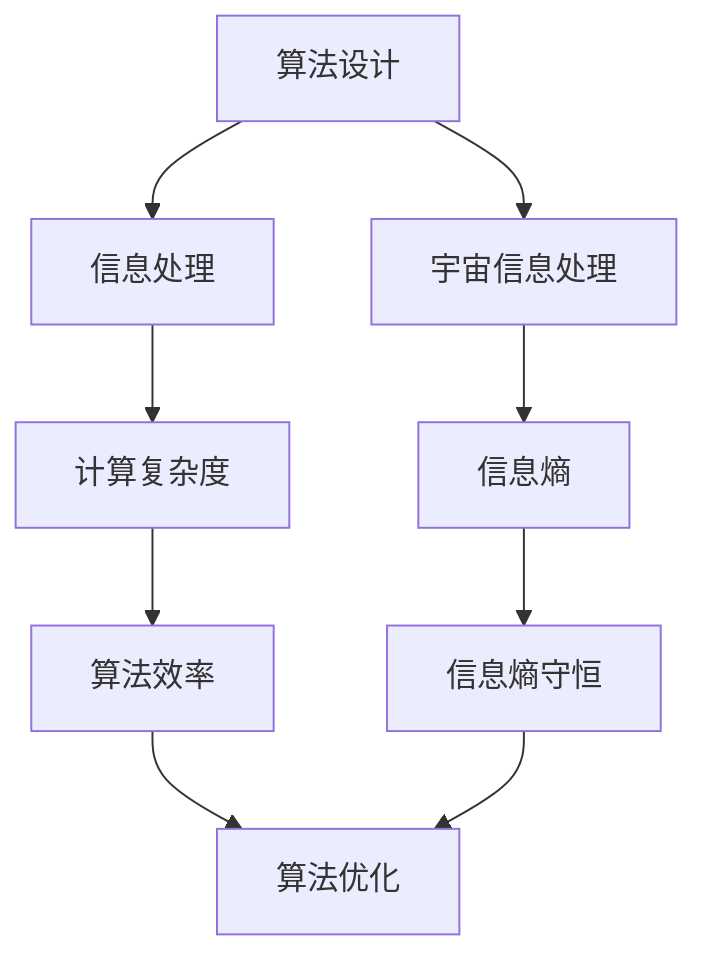

                 

### 1. 引言

在计算机科学和宇宙学这两个看似迥异的领域中，一个深刻的相似性正逐渐被揭示——信息熵守恒原理。算法设计，作为计算机科学的核心，与宇宙中的信息处理过程有着惊人的相似性。本文旨在通过将算法设计与宇宙信息熵守恒原理进行类比，探讨这一深层次的联系，并展示其在算法优化和复杂性分析中的应用。

### 1.1 背景介绍

算法设计是计算机科学的重要组成部分，它涉及到如何有效地解决问题。算法的效率不仅取决于算法本身的复杂性，还取决于对问题本质的理解。信息熵守恒原理，则源于热力学第二定律，指出在一个封闭系统中，总信息熵不会减少。

这两个领域看似毫无关联，但实际上，它们都涉及信息处理和信息流动。在算法设计中，信息以数据的形式存在，而宇宙中的信息则体现在能量、物质和信息的相互转换中。

### 1.2 核心概念与联系

为了更好地理解这一类比，我们可以借助Mermaid流程图来展示算法设计与宇宙信息熵守恒之间的核心概念关系：



### 1.3 核心算法原理讲解

算法设计的基本原理可以通过以下Python源代码来阐述：

```python
def algorithm(problem):
    # 分解问题
    subproblems = decompose(problem)
    # 解决子问题
    solutions = [algorithm(subproblem) for subproblem in subproblems]
    # 合并子解决方案
    return merge(solutions)

def decompose(problem):
    # 根据问题性质进行分解
    return [subproblem for subproblem in problem]

def merge(solutions):
    # 合并子问题的解
    return combined_solution
```

在上述代码中，我们首先将问题分解为更小的子问题，然后分别解决这些子问题，最后将这些子问题的解合并起来以得到原始问题的解。这个过程与宇宙中的分治算法有相似之处，其中信息在子系统中被处理和转换，最终在整个系统中整合。

### 1.4 数学模型和数学公式

算法效率可以通过计算复杂度来衡量，其基本公式如下：

$$
T(n) = \sum_{i=1}^{k} a_i T(n/b_i) + f(n)
$$

其中，$T(n)$ 是算法的时间复杂度，$a_i$ 和 $b_i$ 是子问题的规模因子和分解次数，$f(n)$ 是合并子问题解的时间复杂度。

### 1.5 举例说明

为了更好地理解上述原理，我们可以通过一个简单的例子来说明：二分查找算法。

```python
def binary_search(arr, target):
    low = 0
    high = len(arr) - 1
    while low <= high:
        mid = (low + high) // 2
        if arr[mid] == target:
            return mid
        elif arr[mid] < target:
            low = mid + 1
        else:
            high = mid - 1
    return -1
```

在这个例子中，我们通过不断将搜索区间一分为二，最终找到目标元素。这个过程类似于宇宙中的信息处理，其中信息（能量、物质）在系统中的流动和转换遵循一定的守恒定律。

### 1.6 小结

通过将算法设计与宇宙信息熵守恒原理进行类比，我们可以更好地理解算法设计的本质。信息熵守恒原理不仅为我们提供了一种衡量算法效率的新方法，还揭示了宇宙中普遍存在的信息处理规律。在接下来的部分中，我们将进一步探讨信息熵守恒原理在算法优化中的应用，并分析这种类比如何帮助我们更好地设计高效的算法。

---

作者：AI天才研究院/AI Genius Institute & 禅与计算机程序设计艺术 /Zen And The Art of Computer Programming

关键词：算法设计、信息熵守恒、宇宙信息处理、计算复杂度、算法优化

摘要：本文通过将算法设计与宇宙信息熵守恒原理进行类比，探讨了这一深层次的联系，并展示其在算法优化和复杂性分析中的应用。通过具体实例和数学模型，本文旨在帮助读者更好地理解算法设计的本质，以及如何利用宇宙信息熵守恒原理来提高算法效率。

