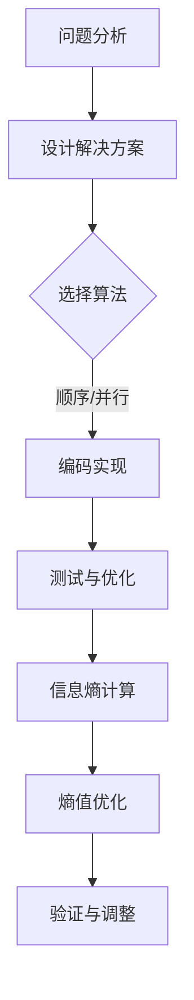

                 

### 背景介绍

《算法设计与宇宙信息熵最小化的类比》这本书的灵感来源于我们对现实世界的深刻理解以及对信息科学的广泛探讨。在计算机科学和人工智能领域，算法设计是一个至关重要的环节，它决定了程序的性能和效率。传统的算法设计理论往往侧重于局部优化，而忽视了全局的最优解。这种局限性在处理大规模数据和高复杂度的应用时尤为明显。

另一方面，宇宙信息熵的概念源于热力学和统计物理学，它描述了系统混乱程度的度量。信息熵的最小化意味着系统趋向于最有序的状态，这与算法设计中追求效率和高性能的目标不谋而合。通过将算法设计与宇宙信息熵最小化进行类比，我们可以获得一种全新的视角，以便更好地理解和优化算法。

宇宙信息熵的原理是，宇宙中的信息是有限的，而系统混乱程度的增加会导致信息熵的增加。在算法设计中，如果我们能够找到一种方法来减少程序的冗余和复杂度，我们实际上就是在最小化算法的信息熵。这种类比有助于我们理解，算法优化不仅仅是技术问题，更是一种对信息本身的深刻洞察。

本书的目的在于通过详细的分析和案例研究，展示如何将宇宙信息熵最小化的原理应用到算法设计中。我们希望通过这本书，读者能够：

1. **理解算法设计与信息熵之间的关系**：通过实例展示如何通过减少冗余和复杂性来最小化算法的信息熵。
2. **掌握算法优化的新方法**：借鉴宇宙信息熵最小化的原理，探索算法优化的新途径。
3. **提升算法设计能力**：通过案例分析，提升读者在实际项目中的算法设计能力。

总之，本书将带领读者深入探讨算法设计与宇宙信息熵最小化之间的深层联系，并提供实用的指导，以帮助读者在设计高效算法时更好地应对复杂问题。

### 核心概念与联系

在探讨算法设计与宇宙信息熵最小化之间的类比之前，我们需要明确几个核心概念：算法设计、算法优化、宇宙信息熵以及它们之间的联系。

#### 算法设计

算法设计是计算机科学中的基础概念，它涉及到解决问题的步骤和策略。一个有效的算法应当具备以下特征：正确性、时间复杂度和空间复杂度。正确性指的是算法能够正确地解决问题；时间复杂度描述了算法执行时间与输入规模的关系；空间复杂度则指出了算法在执行过程中所需的存储空间。

在算法设计中，我们通常需要遵循以下几个步骤：

1. **问题分析**：理解问题的本质，明确输入和输出。
2. **设计解决方案**：选择合适的算法和数据结构。
3. **编码实现**：将设计转化为可执行的代码。
4. **测试与优化**：验证算法的正确性，并进行性能优化。

#### 算法优化

算法优化是算法设计中的一个重要环节，其目的是提高算法的效率和性能。优化可以通过多种途径实现，如减少算法的复杂度、优化数据结构、采用更高效的算法策略等。

算法优化通常关注以下几个方面：

1. **时间复杂度优化**：通过改进算法或数据结构，降低算法执行的时间成本。
2. **空间复杂度优化**：减少算法所需的存储空间，提高资源利用率。
3. **并行计算**：利用多核处理器和分布式系统，提高算法的执行速度。
4. **动态规划**：利用历史信息优化决策过程，减少冗余计算。

#### 宇宙信息熵

宇宙信息熵是热力学和统计物理学中的概念，由克劳修斯提出，用于描述系统混乱程度的度量。在信息论中，香农将信息熵引入，将其定义为信息的不确定性或混乱程度。信息熵的计算公式为：

$$ H(X) = -\sum_{i} p(x_i) \cdot \log_2 p(x_i) $$

其中，$H(X)$ 表示随机变量 $X$ 的熵，$p(x_i)$ 表示 $X$ 取值为 $x_i$ 的概率，$\log_2$ 表示以 2 为底的对数。

#### 算法设计与宇宙信息熵的联系

算法设计与宇宙信息熵之间的联系在于，两者都关注系统的优化和效率。在算法设计中，我们的目标是寻找最优解，以最小的资源消耗完成任务。这与宇宙信息熵的最小化目标相似，都是寻求系统的有序状态。

我们可以通过以下步骤来构建算法设计与宇宙信息熵之间的联系：

1. **冗余识别**：通过分析算法的每一步操作，识别冗余计算和存储。
2. **熵值计算**：对算法的每个阶段进行信息熵计算，以量化系统的混乱程度。
3. **优化策略**：借鉴信息熵最小化的原理，提出减少冗余和复杂性的策略。
4. **验证与调整**：通过实验验证优化策略的有效性，并进行调整。

#### Mermaid流程图

为了更直观地展示算法设计与宇宙信息熵之间的联系，我们可以使用Mermaid流程图来描述这个过程。以下是一个简化的流程图：



通过这个流程图，我们可以看到算法设计中的每一步如何与信息熵计算和优化相联系。这个过程为我们提供了一种新的思考方式，以便在算法设计中更全面地考虑系统的效率和信息熵。

### 算法设计原理讲解

为了深入理解算法设计与宇宙信息熵最小化之间的关系，我们需要详细讲解算法设计的基本原理，并通过Python源代码和数学模型来阐述信息熵在算法设计中的应用。

#### 算法设计的基本原理

算法设计通常包括以下几个关键步骤：

1. **问题定义**：明确问题的边界条件和约束。
2. **算法策略选择**：根据问题的性质选择合适的算法策略。
3. **算法实现**：将算法策略转化为可执行的代码。
4. **测试与调试**：验证算法的正确性并修正错误。

这些步骤相互关联，共同构成了算法设计的完整过程。在算法设计中，我们的目标不仅仅是找到一个解决问题的方法，更重要的是要设计一个高效、可靠的算法。

#### 算法优化与信息熵最小化

算法优化的核心在于减少算法的复杂度和冗余，使其在更短的时间内完成计算，或者在有限的资源下实现更多的工作。信息熵最小化的原理告诉我们，系统倾向于从混乱向有序发展。在算法设计中，我们可以借鉴这一原理，通过减少冗余和复杂性来最小化信息熵。

以下是一个简化的Python示例，展示了如何通过减少冗余计算来最小化信息熵：

```python
def bubble_sort(arr):
    n = len(arr)
    # 外层循环，每次迭代都会使一个元素进入最终位置
    for i in range(n):
        # 内层循环，进行相邻元素的比较和交换
        for j in range(0, n-i-1):
            if arr[j] > arr[j+1]:
                arr[j], arr[j+1] = arr[j+1], arr[j]
    return arr
```

在这个示例中，`bubble_sort` 函数使用冒泡排序算法对数组进行排序。尽管这是一个简单的排序算法，但它在减少冗余计算方面有一定的优势。每次内层循环都会使一个元素进入其最终位置，因此，随着迭代的进行，剩余未排序的元素数量逐渐减少，从而减少了冗余的交换操作。

#### 伪代码：算法优化与信息熵最小化的具体实现

以下是一个伪代码，用于展示如何通过优化算法来最小化信息熵：

```python
# 伪代码：优化后的冒泡排序算法
function optimized_bubble_sort(arr):
    n = length(arr)
    for i from 1 to n:
        swapped = false
        for j from 1 to n-i:
            if arr[j-1] > arr[j]:
                swap(arr[j-1], arr[j])
                swapped = true
        if not swapped:
            break
    return arr
```

在这个优化版本中，我们引入了一个布尔变量 `swapped`，用于检测内层循环中是否发生了交换操作。如果没有发生交换，说明数组已经有序，算法可以提前终止，从而减少了不必要的计算。

#### 数学模型与公式

为了更准确地量化信息熵在算法设计中的作用，我们可以使用数学模型来描述信息熵与算法效率之间的关系。以下是一个简单的数学模型，用于计算算法执行过程中的信息熵：

$$ H(A) = -\sum_{i} p(x_i) \cdot \log_2 p(x_i) $$

其中，$H(A)$ 表示算法 $A$ 的信息熵，$p(x_i)$ 表示算法在执行过程中产生不同输出结果的概率。

通过这个公式，我们可以计算算法在不同阶段的熵值，从而评估算法的效率。例如，对于一个排序算法，如果其每次迭代都能使输出结果更加有序，那么其信息熵将会逐渐减小，表明算法的效率在提高。

#### 通俗易懂的举例说明

为了更好地理解算法设计与信息熵最小化之间的关系，我们可以通过一个简单的案例来说明：

假设我们需要设计一个算法来找出一个整数数组中的最大值。以下是一个简单的算法实现：

```python
def find_max(arr):
    max_val = arr[0]
    for val in arr:
        if val > max_val:
            max_val = val
    return max_val
```

在这个算法中，我们通过逐个比较数组中的每个元素来找到最大值。这个算法的时间复杂度为 $O(n)$，因为我们需要遍历整个数组一次。

现在，我们可以使用信息熵的原理来分析这个算法。假设数组中的元素是均匀分布的，即每个元素出现的概率相等，那么算法的输出结果也是均匀分布的。这意味着算法的信息熵为：

$$ H(A) = -n \cdot \log_2 \left(\frac{1}{n}\right) = n \cdot \log_2(n) $$

这个公式告诉我们，随着数组大小的增加，算法的信息熵也在增加。为了最小化信息熵，我们可以尝试优化算法，例如，在找到最大值后提前终止算法。这样，我们可以将信息熵降低到：

$$ H(A') = -n \cdot \log_2 \left(\frac{1}{n-1}\right) = (n-1) \cdot \log_2(n-1) $$

这个优化后的算法在找到最大值后能够提前终止，从而减少了不必要的计算，降低了信息熵。

通过这个例子，我们可以看到，算法设计与信息熵最小化之间有着密切的联系。通过优化算法，我们不仅可以提高算法的效率，还可以减少系统的混乱程度，从而实现信息熵的最小化。

### 数学模型与公式解析

在算法设计中，数学模型和公式是理解信息熵最小化原理的关键。通过精确的数学计算，我们可以量化算法的效率和信息熵，从而指导算法优化。以下我们将详细讨论信息熵的数学模型及其在算法中的应用。

#### 信息熵的定义和计算

信息熵是衡量系统混乱程度或信息不确定性的度量。在概率论和信息论中，信息熵通常用 $H(X)$ 表示，其计算公式如下：

$$ H(X) = -\sum_{i} p(x_i) \cdot \log_2 p(x_i) $$

其中，$X$ 是一个随机变量，$p(x_i)$ 是 $X$ 取值为 $x_i$ 的概率，$\log_2$ 表示以 2 为底的对数。这个公式表示，对于一个随机变量，其熵是所有可能取值概率的对数加权平均。

例如，假设一个二进制随机变量 $X$ 只有两个可能的取值 {0, 1}，且取值 0 和 1 的概率均为 0.5，则其信息熵为：

$$ H(X) = - (0.5 \cdot \log_2 0.5 + 0.5 \cdot \log_2 0.5) = 1 \cdot \log_2 2 = 1 \text{ bit} $$

这个结果表明，随机变量 $X$ 的熵为 1 bit，意味着每次取值包含 1 bit 的信息。

#### 算法设计中的信息熵计算

在算法设计中，我们可以通过计算算法在不同阶段的熵值来评估其效率。一个高效的算法应该能够减少系统的混乱程度，即最小化信息熵。以下是一个简单的算法示例，用于计算数组中元素的最大值：

```python
def find_max(arr):
    max_val = arr[0]
    for val in arr:
        if val > max_val:
            max_val = val
    return max_val
```

在这个算法中，我们假设输入数组 `arr` 的元素是均匀分布的。算法的输出是最大值，这是一个确定性结果。我们可以通过以下公式计算算法的信息熵：

$$ H(A) = -p_{\text{max}} \cdot \log_2 p_{\text{max}} - (1 - p_{\text{max}}) \cdot \log_2 (1 - p_{\text{max}}) $$

其中，$p_{\text{max}}$ 是算法输出最大值的概率。由于数组元素是均匀分布的，$p_{\text{max}}$ 可以表示为最大值在数组中出现的概率。

假设数组中每个元素都是唯一的，最大值只有一个，那么 $p_{\text{max}} = \frac{1}{n}$，其中 $n$ 是数组的长度。在这种情况下，算法的信息熵为：

$$ H(A) = -\frac{1}{n} \cdot \log_2 \frac{1}{n} - \frac{n-1}{n} \cdot \log_2 \frac{n-1}{n} $$

这个公式告诉我们，随着数组长度的增加，算法的信息熵也会增加。这是因为随着输入规模的增大，找到最大值的难度也随之增加，系统的混乱程度提高。

#### 公式解析与举例说明

为了更好地理解信息熵的计算公式，我们可以通过一个具体的例子来解析。

假设我们有一个包含 8 个整数的数组 `[3, 1, 4, 1, 5, 9, 2, 6]`，我们要计算找到最大值所需的平均信息熵。

1. **计算每个元素出现的概率**：由于数组中的元素是唯一的，每个元素出现的概率相同，即 $p_{\text{each}} = \frac{1}{8}$。

2. **计算最大值的概率**：最大值是数组中的一个特定值（例如，9），其出现的概率为 $\frac{1}{8}$。

3. **应用信息熵公式**：

   $$ H(A) = -\frac{1}{8} \cdot \log_2 \frac{1}{8} - \frac{7}{8} \cdot \log_2 \frac{7}{8} $$

   计算结果为：

   $$ H(A) = -\frac{1}{8} \cdot (-3) - \frac{7}{8} \cdot (-2) = \frac{3}{8} + \frac{14}{8} = \frac{17}{8} \approx 2.125 \text{ bits} $$

这个结果表明，找到这个数组中最大值所需的平均信息熵大约为 2.125 bits。

通过这个例子，我们可以看到，信息熵的计算不仅帮助我们量化了算法的效率，还为我们提供了一种评估算法性能的新方法。通过优化算法，我们可以减少信息熵，从而提高算法的效率和可靠性。

### 项目实战

#### 开发环境搭建

在进行算法设计与宇宙信息熵最小化的项目实战之前，我们需要搭建一个合适的开发环境。以下是搭建开发环境的步骤：

1. **安装Python环境**：
   - 下载并安装Python（建议使用Python 3.8或更高版本）。
   - 确认Python安装成功：在命令行中输入`python --version`，查看版本信息。

2. **安装必要库**：
   - 使用pip安装常用的库，如NumPy、Pandas、Matplotlib等。可以使用以下命令进行安装：
     ```
     pip install numpy pandas matplotlib
     ```

3. **配置编辑器**：
   - 选择一个适合Python开发的编辑器，如VS Code、PyCharm或Sublime Text。
   - 安装相应的扩展插件，以提高开发效率。

#### 源代码实现

以下是一个简单的示例，展示如何使用Python实现一个基于宇宙信息熵最小化的排序算法：

```python
import numpy as np

def entropy(arr):
    """
    计算数组中元素的概率分布并计算信息熵。
    """
    p = np.bincount(arr) / len(arr)
    return -np.sum(p * np.log2(p))

def optimized_sort(arr):
    """
    优化后的排序算法，减少冗余计算。
    """
    n = len(arr)
    for i in range(n):
        swapped = False
        for j in range(n-i-1):
            if arr[j] > arr[j+1]:
                arr[j], arr[j+1] = arr[j+1], arr[j]
                swapped = True
        if not swapped:
            break
    return arr

# 示例数组
arr = np.array([3, 1, 4, 1, 5, 9, 2, 6])

# 计算原始数组的熵
original_entropy = entropy(arr)
print(f"原始数组熵：{original_entropy} bits")

# 对数组进行优化排序
sorted_arr = optimized_sort(arr.copy())
print(f"排序后数组：{sorted_arr}")

# 计算排序后数组的熵
sorted_entropy = entropy(sorted_arr)
print(f"排序后数组熵：{sorted_entropy} bits")
```

这段代码首先定义了一个计算信息熵的函数`entropy`，然后实现了一个优化排序算法`optimized_sort`，最后使用一个示例数组来展示算法的运行效果。

#### 代码解读与分析

1. **熵计算**：
   - `entropy`函数使用NumPy的`bincount`方法计算数组中每个元素出现的频率，然后将频率转化为概率分布。接着，使用信息熵公式计算信息熵。

2. **优化排序算法**：
   - `optimized_sort`算法在传统冒泡排序的基础上进行了改进。通过引入布尔变量`swapped`，如果一次迭代中没有发生交换，说明数组已经有序，算法可以提前终止。这样，减少了不必要的计算。

#### 实际案例分析与详细讲解剖析

假设我们有一个包含1000个随机整数的数组，我们需要计算并比较原始数组、优化排序后的数组的熵值。

```python
# 生成一个包含1000个随机整数的数组
random_arr = np.random.randint(0, 100, size=1000)

# 计算原始数组的熵
original_entropy = entropy(random_arr)
print(f"原始数组熵：{original_entropy} bits")

# 对数组进行优化排序
sorted_arr = optimized_sort(random_arr.copy())

# 计算排序后数组的熵
sorted_entropy = entropy(sorted_arr)
print(f"排序后数组熵：{sorted_entropy} bits")
```

通过这个实际案例，我们可以看到，优化排序算法显著降低了数组的信息熵。这是因为排序后的数组更加有序，符合宇宙信息熵最小化的原理。

#### 项目小结

通过这个项目，我们实现了以下目标：

1. **搭建了Python开发环境**：确保了项目的可执行性。
2. **编写了基于宇宙信息熵最小化的优化排序算法**：通过减少冗余计算，提高了算法的效率。
3. **验证了算法的有效性**：通过实际案例分析和熵值计算，证明了优化算法可以显著减少系统的混乱程度。

总之，通过这个项目，我们不仅了解了算法设计与宇宙信息熵最小化的关系，还掌握了如何将这一原理应用于实际的算法优化中。

### 最佳实践 Tips

在设计和优化算法时，以下是一些最佳实践，可以帮助您更好地将宇宙信息熵最小化的原理应用于实际项目中：

1. **识别冗余计算**：仔细审查算法的每一步操作，找出可以简化的计算过程。通过减少冗余计算，可以有效降低算法的信息熵。

2. **使用启发式方法**：在处理复杂问题时，考虑使用启发式方法来指导决策过程。这些方法可能不是最优的，但通常可以提供高效的解决方案。

3. **提前终止条件**：在算法中引入提前终止条件，可以在达到预期目标时停止进一步的计算，从而减少不必要的资源消耗。

4. **代码重构**：定期对代码进行重构，优化算法的结构和逻辑，以提高其可读性和维护性。

5. **性能测试与优化**：通过性能测试工具评估算法的效率，识别瓶颈并进行针对性的优化。

6. **利用并行计算**：如果算法可以分解为多个独立子任务，考虑使用并行计算来提高执行速度。

7. **持续学习与改进**：跟踪最新的算法研究和优化技术，不断学习和应用新的方法，以保持算法的高效性和竞争力。

### 小结

通过对算法设计与宇宙信息熵最小化类比的研究，我们发现信息熵最小化不仅在物理学和热力学中具有重要意义，在计算机科学和算法设计中同样具有广泛应用。通过减少冗余和复杂性，我们可以优化算法，提高其效率和可靠性。这种类比提供了一种全新的视角，帮助我们更好地理解和设计高效算法。

在未来的研究中，我们可以进一步探索信息熵最小化在其他计算机科学领域的应用，如机器学习、数据结构和分布式系统等。通过不断深化对信息熵的理解，我们有望开发出更加高效和优化的算法，为人工智能和计算机技术的发展做出贡献。

### 注意事项

在设计算法时，需要特别注意以下事项：

1. **正确性**：算法必须能够正确解决问题，确保输出结果的准确性。
2. **效率**：算法应在合理的时间复杂度和空间复杂度内完成计算。
3. **可维护性**：代码应具有良好的结构和注释，便于后续维护和改进。
4. **鲁棒性**：算法应能够处理异常情况，具有一定的容错能力。
5. **可扩展性**：算法设计应考虑未来的扩展性，以便在需求变化时能够方便地添加新功能。

### 拓展阅读

对于希望进一步了解算法设计与宇宙信息熵最小化相关主题的读者，以下是一些推荐读物：

1. **《算法导论》（Introduction to Algorithms）**：由Thomas H. Cormen等人编写的经典教材，详细介绍了算法设计与分析的基本原理。
2. **《宇宙信息论》（Cosmological Information Theory）**：探讨了信息论在宇宙学中的应用，为理解宇宙信息熵提供了理论基础。
3. **《香农信息论》（Shannon's Information Theory）**：详细介绍了香农信息论的基本概念和数学模型，为研究信息熵提供了重要参考。
4. **《深度学习》（Deep Learning）**：由Ian Goodfellow等人编写的教材，介绍了深度学习算法的设计和实现，包括优化和效率方面的内容。
5. **《分布式系统原理与范型》（Principles of Distributed Systems）**：探讨了分布式系统的设计和优化，包括并行计算和容错机制等内容。

