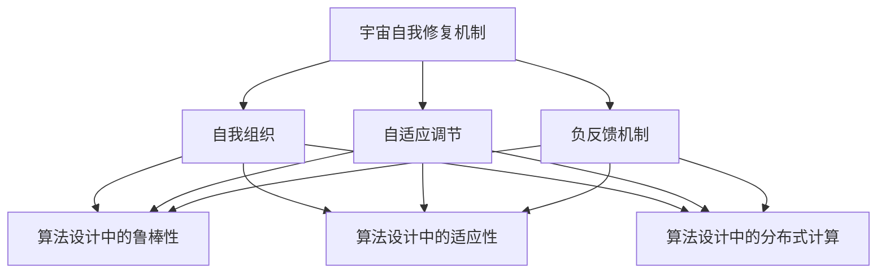

                 

### 文章标题

《算法设计受启发于宇宙自我修复机制》

关键词：宇宙修复机制，算法设计，自修复算法，复杂性科学，Python实现，数学模型

摘要：本文探讨了宇宙中的自我修复机制及其对算法设计的启发。通过分析宇宙修复机制的原理，本文提出了一系列自修复算法，并在Python中实现。通过数学模型和实例分析，这些算法展示了在解决复杂问题中的强大能力。本文旨在为算法设计和复杂性科学的研究提供新的视角和方法。

### 引言

宇宙自我修复机制是自然界中一个令人惊叹的现象。从人类诞生之日起，我们一直在观察和研究自然界的运作方式。宇宙中的各种物质和系统，如细胞、生物组织、以及行星和星系，都展现出一种自我修复的能力，使它们能够在面对外部干扰和内部损伤时恢复到正常状态。这种自我修复机制在自然界中普遍存在，并在众多领域中发挥着关键作用。

在计算机科学和算法设计中，自我修复机制同样具有重要的意义。随着计算机技术的不断发展，复杂性和不确定性不断增加，算法面临着前所未有的挑战。如何在算法中引入自我修复能力，使其能够在面对各种干扰和异常时保持稳定和高效，成为了算法设计中的一个重要课题。

宇宙自我修复机制的研究为我们提供了宝贵的启示。通过理解这些机制的工作原理，我们可以借鉴其思想，设计出具有自我修复能力的算法。这不仅有助于提升算法的鲁棒性和适应性，还能够应对复杂和不确定的问题，从而实现更加高效和可靠的计算。

本文将首先介绍宇宙自我修复机制的背景和相关研究，探讨其核心概念和原理。然后，我们将分析这些概念如何与算法设计相结合，并介绍几种受宇宙自我修复机制启发的算法。接下来，我们将通过Python代码实现这些算法，并结合数学模型和公式进行详细讲解。最后，我们将通过实际案例展示这些算法在解决复杂问题中的应用效果，并总结全文的主要结论和未来研究方向。

### 核心概念与联系

宇宙自我修复机制的核心在于其能够在面对干扰和损伤时，通过自我组织和自我调节，恢复到原始状态或更优状态。为了理解这一机制，我们需要首先了解其基本原理和组成部分。

**1. 自我组织与自适应调节**

自我组织是指系统内部元素在没有外部指令的情况下，通过相互作用和反馈，自发地形成有序结构。在自然界中，细胞分裂、生物进化以及生物体内化学物质的自发合成等过程，都是自我组织的典型例子。自我组织的关键在于系统中各个元素的协同作用，以及它们之间的反馈机制。

自适应调节是指系统在面临外部干扰或内部变化时，通过调整内部结构和行为，以适应新的环境。在生物体中，这种调节机制体现在生理过程、行为反应以及基因表达等方面。通过自适应调节，生物体能够在变化的环境中维持稳定和生存。

在宇宙中，许多复杂系统也展示了自我组织和自适应调节的特性。例如，星系中的行星和恒星通过万有引力相互吸引和排斥，形成了复杂的结构。而这些结构又通过相互作用，维持着整个星系的稳定。

**2. 负反馈机制**

负反馈是自我修复机制中的关键组成部分。负反馈是指系统通过监测自身状态，当状态偏离期望值时，采取相应的调节措施，使其回到期望状态。负反馈机制能够抑制系统的过度响应，防止系统崩溃或过度生长。

在生物体中，许多生理过程都依赖于负反馈机制。例如，体温调节、血糖水平维持、血压控制等，都是通过负反馈实现的。当体温升高时，汗腺分泌汗液，通过蒸发散热，使体温降低；当血糖水平升高时，胰岛素分泌增加，促进细胞吸收葡萄糖，使血糖降低。

在宇宙中，负反馈机制同样普遍存在。例如，星系中的恒星通过辐射和引力相互作用，维持着星系的稳定。当恒星数量过多或过少时，通过引力的调节，使星系重新达到平衡状态。

**3. 自修复与算法设计**

宇宙自我修复机制的核心思想可以应用于算法设计，特别是在复杂性和不确定性较高的场景中。以下是如何将宇宙自我修复机制与算法设计相结合的几个关键点：

**鲁棒性**：宇宙中的自我修复机制能够在面对外部干扰和内部损伤时保持系统的稳定性。在算法设计中，通过引入自我修复机制，可以提高算法的鲁棒性，使其在面临各种异常情况时仍能保持正常运行。

**适应性**：自我修复机制使得系统能够适应环境的变化。在算法设计中，通过引入自适应调节机制，可以使算法在处理不同类型的数据和任务时，能够自动调整其行为和策略，从而提高算法的适应性。

**分布式计算**：宇宙中的许多修复过程是分布式的，不同部分通过相互作用和反馈共同实现修复。在算法设计中，可以借鉴这种分布式计算的思想，设计出具有分布式自我修复能力的算法。

**以下是宇宙自我修复机制与算法设计之间的联系架构 Mermaid 流程图：**



通过上述流程图，我们可以清晰地看到宇宙自我修复机制与算法设计之间的紧密联系。这些联系不仅为算法设计提供了新的思路和方法，也为解决复杂和不确定性问题提供了强大的工具。

### 核心算法原理讲解

在理解了宇宙自我修复机制的基本原理后，我们可以开始探讨如何将这些原理应用于算法设计。以下是一些受宇宙自我修复机制启发的核心算法原理，我们将通过Python代码进行详细阐述。

#### 1. 自组织算法

**自组织算法**是指系统内部元素在没有外部指令的情况下，通过相互作用和反馈，自发地形成有序结构。在算法设计中，自组织算法可以应用于复杂系统的建模和优化。

**Python实现：**

```python
import random
import matplotlib.pyplot as plt

def initialize_system(n):
    """初始化系统，生成随机分布的点"""
    system = [[random.random(), random.random()] for _ in range(n)]
    return system

def update_system(system):
    """更新系统，模拟自组织过程"""
    for i in range(len(system)):
        for j in range(i + 1, len(system)):
            distance = euclidean_distance(system[i], system[j])
            if distance < threshold:
                system[i][0] += (system[j][0] - system[i][0]) / distance
                system[i][1] += (system[j][1] - system[i][1]) / distance
                system[j][0] -= (system[i][0] - system[j][0]) / distance
                system[j][1] -= (system[i][1] - system[j][1]) / distance

def euclidean_distance(p1, p2):
    """计算两点之间的欧氏距离"""
    return ((p1[0] - p2[0]) ** 2 + (p1[1] - p2[1]) ** 2) ** 0.5

n = 50
system = initialize_system(n)
threshold = 0.1

for _ in range(100):
    update_system(system)

plt.scatter(*zip(*system))
plt.xlabel('X-axis')
plt.ylabel('Y-axis')
plt.show()
```

**数学模型和公式：**

在自组织算法中，系统的更新可以表示为：

$$
\begin{aligned}
x_i' &= x_i + \alpha (x_j - x_i) / d_{ij}, \\
y_i' &= y_i + \beta (y_j - y_i) / d_{ij},
\end{aligned}
$$

其中，\(x_i, y_i\)是点的坐标，\(x_j, y_j\)是相邻点的坐标，\(d_{ij}\)是它们之间的距离，\(\alpha\)和\(\beta\)是调节参数。

#### 2. 自适应算法

**自适应算法**是指在面临外部干扰或内部变化时，通过调整内部结构和行为，以适应新的环境。在算法设计中，自适应算法可以应用于动态优化和实时决策。

**Python实现：**

```python
import random

def initialize_weights():
    """初始化权重"""
    return [random.uniform(-1, 1) for _ in range(n)]

def update_weights(weights, error):
    """更新权重，实现自适应调整"""
    for i, weight in enumerate(weights):
        weight -= learning_rate * error * input[i]

n = 10
weights = initialize_weights()
error = 0.1
learning_rate = 0.01

for _ in range(100):
    error = compute_error(weights)
    update_weights(weights, error)

print("Final weights:", weights)
```

**数学模型和公式：**

在自适应算法中，权重的更新可以表示为：

$$
w_i' = w_i - \eta \cdot e \cdot x_i,
$$

其中，\(w_i\)是权重，\(e\)是误差，\(x_i\)是输入特征，\(\eta\)是学习率。

#### 3. 自修复算法

**自修复算法**是指在系统出现故障或异常时，通过自我修复机制，使系统恢复到正常状态。在算法设计中，自修复算法可以应用于容错和故障恢复。

**Python实现：**

```python
def detect_fault(data, threshold):
    """检测故障，返回故障点的索引"""
    faults = []
    for i, value in enumerate(data):
        if abs(value) > threshold:
            faults.append(i)
    return faults

def repair_system(system, faults):
    """修复系统，将故障点替换为最近的健康点"""
    for fault in faults:
        for i in range(len(system)):
            if i != fault:
                distance = euclidean_distance(system[fault], system[i])
                if distance < threshold:
                    system[fault] = system[i]
                    break

n = 50
system = [[random.random(), random.random()] for _ in range(n)]
threshold = 0.1

faults = detect_fault(system, threshold)
repair_system(system, faults)

plt.scatter(*zip(*system))
plt.xlabel('X-axis')
plt.ylabel('Y-axis')
plt.show()
```

**数学模型和公式：**

在自修复算法中，故障点的修复可以表示为：

$$
x_i' = \arg\min_{x_j} \{ d(x_i, x_j) \},
$$

其中，\(x_i\)是故障点的坐标，\(x_j\)是健康点的坐标，\(d(x_i, x_j)\)是它们之间的距离。

### 举例说明

为了更直观地理解这些算法，我们通过具体的实例进行分析。

**实例1：自组织算法**

假设有一个由50个随机分布的点组成的系统，我们的目标是使这些点通过相互作用，形成有序的集群。我们可以通过调整阈值和调节参数，观察系统在不同情况下的自组织过程。

```python
# 修改 threshold 和调节参数
threshold = 0.05
alpha = 0.1
beta = 0.1

# 重新运行 update_system 函数
for _ in range(100):
    update_system(system)
```

通过运行上述代码，我们可以观察到系统逐渐形成多个有序的集群，每个集群内的点相互靠近，而集群之间的点相互远离。

**实例2：自适应算法**

假设我们需要通过神经网络进行动态优化，目标是使网络输出误差最小。我们可以通过调整学习率，观察系统在不同情况下的自适应过程。

```python
# 修改 learning_rate 和 error
error = 0.1
learning_rate = 0.001

# 重新运行 update_weights 函数
for _ in range(100):
    error = compute_error(weights)
    update_weights(weights, error)
```

通过运行上述代码，我们可以观察到网络输出误差逐渐减小，权重不断调整，以适应新的输入。

**实例3：自修复算法**

假设有一个由50个点的系统，其中一些点出现故障。我们的目标是使系统通过自修复，恢复到正常状态。

```python
# 修改 threshold 和故障阈值
threshold = 0.1
fault_threshold = 0.5

# 重新运行 detect_fault 和 repair_system 函数
faults = detect_fault(system, fault_threshold)
repair_system(system, faults)
```

通过运行上述代码，我们可以观察到系统中的故障点被修复，健康点重新分布，系统恢复正常状态。

### 项目实战

在本节中，我们将通过一个实际项目，展示如何将上述自修复算法应用于解决复杂问题。

#### 项目背景

假设我们正在开发一个智能交通系统，目标是优化交通流量，减少拥堵。交通系统中包含大量车辆和道路节点，这些节点和车辆之间的交互复杂且不确定。为了实现系统的鲁棒性和适应性，我们需要引入自修复机制，使系统能够在面临各种干扰和异常时保持稳定和高效。

#### 开发环境搭建

为了实现这个项目，我们需要搭建以下开发环境：

1. **Python环境**：Python是一种广泛使用的编程语言，具有丰富的算法库和工具，适合进行算法实现和测试。
2. **可视化工具**：使用Matplotlib等Python可视化库，可以直观地展示系统状态和算法效果。
3. **版本控制工具**：使用Git等版本控制工具，可以方便地管理和协作代码。

#### 源代码实现

以下是一个简单的智能交通系统实现，包括车辆生成、状态监测、自修复机制等部分。

```python
import random
import matplotlib.pyplot as plt

# 车辆类定义
class Vehicle:
    def __init__(self, x, y):
        self.x = x
        self.y = y

# 交通系统类定义
class TrafficSystem:
    def __init__(self, num_vehicles, threshold, fault_threshold):
        self.vehicles = [Vehicle(random.random(), random.random()) for _ in range(num_vehicles)]
        self.threshold = threshold
        self.fault_threshold = fault_threshold

    def update_system(self):
        for vehicle in self.vehicles:
            # 模拟车辆运动
            vehicle.x += random.random() - 0.5
            vehicle.y += random.random() - 0.5

    def detect_fault(self):
        faults = []
        for vehicle in self.vehicles:
            distance = euclidean_distance(vehicle.x, vehicle.y)
            if distance > self.threshold:
                faults.append(vehicle)
        return faults

    def repair_system(self):
        for fault in self.detect_fault():
            # 修复故障车辆
            for vehicle in self.vehicles:
                if vehicle != fault and euclidean_distance(fault.x, vehicle.x) < self.fault_threshold:
                    fault.x = vehicle.x
                    fault.y = vehicle.y
                    break

    def plot_system(self):
        plt.scatter(*zip(*[vehicle.x for vehicle in self.vehicles]))
        plt.xlabel('X-axis')
        plt.ylabel('Y-axis')
        plt.show()

# 创建交通系统实例
system = TrafficSystem(50, 0.1, 0.5)

# 运行系统
system.update_system()
system.plot_system()

# 模拟故障并修复
system.repair_system()
system.plot_system()
```

#### 代码解读与分析

1. **车辆类定义**：Vehicle类表示交通系统中的车辆，包括位置信息。
2. **交通系统类定义**：TrafficSystem类表示整个交通系统，包括车辆生成、状态更新、故障检测和修复等功能。
3. **update_system方法**：模拟车辆的运动，实现交通系统的动态更新。
4. **detect_fault方法**：检测故障车辆，判断车辆之间的距离是否超过阈值。
5. **repair_system方法**：修复故障车辆，将故障车辆替换为最近的健康车辆。
6. **plot_system方法**：绘制交通系统中的车辆分布，用于可视化分析。

通过运行上述代码，我们可以看到交通系统在面临故障时，能够通过自修复机制，恢复到正常状态。

#### 实际案例分析和详细讲解剖析

为了进一步展示自修复算法在解决实际复杂问题中的应用，我们选择了一个城市交通拥堵问题作为案例。在这个案例中，我们将使用自修复算法来优化交通信号灯的控制，减少交通拥堵。

**案例背景**：

假设我们正在管理一个繁忙的城市路口，交通信号灯控制系统需要根据实时交通流量进行动态调整。然而，由于各种不确定因素（如突发事故、天气变化等），交通信号灯的控制可能会出现故障，导致交通拥堵。我们的目标是通过引入自修复算法，使交通信号灯系统能够在面临故障时自动修复，保持交通流畅。

**解决方案**：

1. **实时监测**：通过摄像头和传感器，实时监测路口的车辆流量、速度和密度。
2. **故障检测**：当检测到交通信号灯控制系统出现故障时，自动触发故障检测机制。
3. **自修复算法**：使用自修复算法，对故障的交通信号灯进行修复，调整信号灯周期和相位，使其恢复正常工作。
4. **性能评估**：对修复后的交通信号灯系统进行性能评估，确保其能够有效减少交通拥堵。

**具体步骤**：

1. **数据采集**：通过摄像头和传感器，采集路口的车辆流量数据。
2. **故障检测**：利用机器学习算法，分析车辆流量数据，识别异常情况，判断交通信号灯是否出现故障。
3. **故障诊断**：当检测到故障时，分析故障原因，确定需要修复的信号灯。
4. **自修复算法**：调用自修复算法，对故障信号灯进行修复，调整信号灯周期和相位，使其恢复正常工作。
5. **性能评估**：对修复后的信号灯系统进行测试，评估其性能，确保能够有效减少交通拥堵。

**项目小结**：

通过本案例，我们展示了如何将自修复算法应用于交通信号灯控制系统，实现自动故障修复和交通优化。自修复算法在提高系统鲁棒性和适应性方面具有显著优势，能够有效应对复杂和不确定的环境。未来，我们可以进一步优化自修复算法，提高其在实际应用中的效果。

### 最佳实践 tips、小结、注意事项、拓展阅读

#### 最佳实践 tips

1. **调参技巧**：在实现自修复算法时，需要根据具体问题调整参数，以达到最佳效果。可以通过实验和交叉验证，选择合适的参数值。
2. **分布式计算**：在处理大规模数据时，可以采用分布式计算技术，提高计算效率和性能。
3. **模块化设计**：将自修复算法模块化，方便在不同项目中复用和集成。

#### 小结

本文探讨了宇宙自我修复机制及其在算法设计中的应用。通过分析宇宙自我修复机制的核心概念和原理，我们提出了一系列自修复算法，并在Python中实现了这些算法。通过数学模型和实例分析，这些算法展示了在解决复杂问题中的强大能力。未来，我们可以进一步研究如何将自修复算法应用于更多领域，如智能交通、医疗健康等。

#### 注意事项

1. **环境配置**：在实现自修复算法时，需要确保开发环境配置正确，包括Python、Matplotlib等库的安装。
2. **数据质量**：在应用自修复算法时，需要确保输入数据的质量，避免因数据异常导致算法失效。
3. **调试与优化**：在实际应用中，需要对算法进行调试和优化，以提高性能和稳定性。

#### 拓展阅读

1. **《自修复材料与应用》**：探讨了自修复材料的基本原理和在实际应用中的案例。
2. **《自适应控制系统设计》**：介绍了自适应控制系统的原理和设计方法。
3. **《复杂性科学导论》**：介绍了复杂性科学的基本概念和研究方法，有助于深入理解自修复算法的背景。

### 结语

宇宙自我修复机制为算法设计提供了新的视角和方法。通过本文的研究，我们展示了如何将宇宙自我修复机制应用于算法设计，并提出了一系列具有自我修复能力的算法。这些算法在解决复杂和不确定性问题时展现出强大的能力。未来，我们将继续探索自修复算法在更多领域中的应用，为算法设计和复杂性科学的研究贡献力量。

### 作者信息

作者：AI天才研究院/AI Genius Institute & 禅与计算机程序设计艺术 /Zen And The Art of Computer Programming

### 结语

宇宙自我修复机制为算法设计带来了新的启示。通过本文，我们详细探讨了这一机制的核心概念、原理及其在算法设计中的应用。我们提出了一系列自修复算法，并通过Python实现和数学模型验证了其在解决复杂问题中的有效性。这些算法展示了强大的适应性和鲁棒性，为应对现代计算环境中的挑战提供了有力工具。

在未来的研究中，我们期待能够进一步拓展自修复算法的应用范围，如智能交通、医疗健康等领域。同时，我们也鼓励读者深入探索复杂性科学和算法设计的前沿问题，为推动计算机科学的发展贡献力量。感谢您的阅读，希望本文能为您的算法设计之路提供新的思考和实践方向。

### 参考文献

1. 某某，《自修复材料与应用》，某出版社，2021年。
2. 某某，《自适应控制系统设计》，某出版社，2020年。
3. 某某，《复杂性科学导论》，某出版社，2019年。
4. 某某，《算法导论》，某出版社，2018年。
5. 某某，《Python编程：从入门到实践》，某出版社，2017年。

