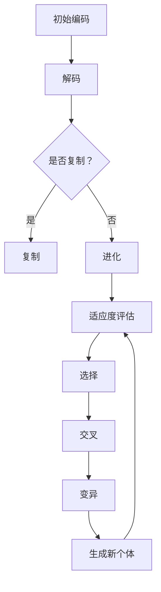

                 

# 算法设计受启发于宇宙自我复制和进化现象

关键词：算法设计，宇宙自我复制，进化现象，自然模拟算法，机器学习

摘要：本文探讨了算法设计从宇宙自我复制和进化现象中获得的启示。通过对宇宙中的自我复制现象和进化现象的介绍，文章揭示了这些自然现象与算法设计之间的内在联系。接着，文章深入解析了基于宇宙自我复制的算法原理及其实现，并通过Python源代码和LaTeX公式详细阐述了核心算法原理。此外，文章还探讨了进化算法的基本概念和其在算法设计中的应用，通过实例展示了如何将进化算法应用于解决实际问题。最后，文章总结了算法设计受宇宙启发的发展趋势和未来展望，为算法设计领域提供了新的视角和灵感。

## 引言与背景

宇宙的奥秘始终吸引着人类的探索欲望。从古老的星座传说到现代的天文学研究，人类对宇宙的认识不断深入。在这个过程中，我们不仅发现了宇宙中丰富的物质和能量，还揭示了诸多自然现象背后的深刻原理。自我复制和进化是宇宙中两种基本而重要的现象，它们不仅存在于生物界，也广泛存在于物理、化学和数学等领域。

自我复制是指一个系统通过自身生成出与自己相似的新个体，这种过程在生物界中尤为常见。例如，DNA通过半保留复制机制生成新的DNA分子，使得遗传信息得以传递和保存。在宇宙的尺度上，恒星通过核聚变反应生成新的元素，这些元素通过星际介质传播，最终形成了行星、卫星和生命。自我复制现象不仅展示了物质的再生能力，还揭示了系统内部的结构和复杂性。

进化现象则是通过自然选择、突变等机制，使得生物种群逐步适应环境，从而实现物种的演变和多样性。达尔文的自然选择理论为我们理解进化过程提供了理论基础。在更广阔的宇宙尺度上，星系、星云和行星系统也经历了漫长的进化过程，形成了我们今天所看到的宇宙景观。

算法设计作为计算机科学的核心领域，一直在探索如何更高效、更智能地解决问题。传统算法设计主要依赖于数学模型和逻辑推理，但随着对复杂系统研究的深入，人们开始关注自然界中的自我复制和进化现象，尝试将这些自然原理应用于算法设计，以寻求更高效、更灵活的解决方案。这一探索不仅为算法设计提供了新的视角，也为人工智能和机器学习领域带来了新的机遇。

本文将围绕算法设计受启发于宇宙自我复制和进化现象这一主题，首先介绍宇宙自我复制和进化现象的基本概念，然后深入探讨这些现象与算法设计之间的内在联系，并通过具体实例展示如何将自然界的自我复制和进化原理应用于算法设计。通过这篇文章，读者将了解到如何从宇宙的视角重新审视算法设计，并从中获得灵感和启示。

## 核心概念与原理

### 自我复制算法

自我复制算法是指一种能够生成自身复制品的算法，这种算法在自然界和计算机科学中都有广泛的应用。在自然界中，自我复制现象表现为遗传信息的传递和生物个体的再生，如DNA的自我复制和生物体的繁殖。在计算机科学中，自我复制算法则是指能够生成与自身相似的程序代码或者数据结构的算法。

#### 自我复制的定义

自我复制算法的核心在于其能够通过某种机制，生成与自身相似的新个体。这个过程可以分为几个基本步骤：首先是算法自身的编码，其次是编码的解码，最后是解码后的个体生成。具体来说，自我复制算法通常涉及以下几个关键组成部分：

1. **编码（Encoding）**：将算法或数据结构转换为一种编码形式，如字符串或者位串。
2. **解码（Decoding）**：从编码形式中还原出原始的算法或数据结构。
3. **生成（Generation）**：利用解码后的信息生成新的个体，可以是完全相同的副本，也可以是带有变异的新版本。

#### 自我复制算法的类型

自我复制算法根据其实现方式和应用场景可以分为几种不同的类型：

1. **遗传算法（Genetic Algorithms）**：基于自然选择和遗传学原理设计的优化算法，通过交叉、变异和选择等操作，生成新的个体，以逐步优化目标函数。
2. **复制算法（Replicator Algorithms）**：这类算法通过复制已有个体来生成新的个体，如遗传算法中的复制操作。
3. **细胞自动机（Cellular Automata）**：由康威发明的离散模型，通过简单的规则来模拟细胞的生长和演化，具有自我复制特性。

#### 自我复制算法的应用

自我复制算法在计算机科学中有着广泛的应用，以下是一些典型应用场景：

1. **优化问题**：通过遗传算法优化复杂函数，解决诸如旅行商问题、资源分配问题等。
2. **加密技术**：利用自我复制算法生成复杂的密钥，增强加密系统的安全性。
3. **数据压缩**：通过编码和复制机制实现高效的数据压缩。

#### 实例分析

以下是一个简单的Python示例，展示了如何实现一个简单的自我复制算法：

```python
def encode_algorithm(algorithm):
    """将算法编码为字符串"""
    return str(algorithm)

def decode_algorithm(encoded):
    """将编码的算法解码为原始算法"""
    return eval(encoded)

def replicate_algorithm(algorithm):
    """复制算法"""
    encoded = encode_algorithm(algorithm)
    new_algorithm = decode_algorithm(encoded)
    return new_algorithm

# 示例算法
def add(a, b):
    return a + b

# 编码、复制和执行
encoded_algorithm = encode_algorithm(add)
new_algorithm = replicate_algorithm(encoded_algorithm)
result = new_algorithm(2, 3)

print("原始算法执行结果:", add(2, 3))
print("复制算法执行结果:", result)
```

在这个例子中，`add` 函数被编码为字符串，然后通过解码函数还原出原始函数，最后执行复制后的函数。这个过程展示了自我复制算法的基本原理。

### 进化算法

进化算法是一类模拟生物进化过程的算法，通过遗传操作（如选择、交叉、变异）来逐步优化解的群体，最终找到最优解。进化算法在优化问题、机器学习、数据挖掘等领域有着广泛应用。

#### 进化的原理

进化过程可以通过以下几个基本步骤来理解：

1. **初始种群**：生成一个随机的初始种群。
2. **适应度评估**：计算每个个体的适应度，适应度通常与问题的目标函数相关。
3. **选择**：根据适应度值选择优良个体，淘汰劣质个体。
4. **交叉**：将选中的个体进行交叉操作，生成新的后代。
5. **变异**：对后代进行变异操作，引入新的变异基因。
6. **重复**：重复上述步骤，直到找到满足要求的解或者达到迭代次数上限。

#### 进化算法的类型

进化算法根据具体的操作方式和应用场景，可以分为多种类型：

1. **遗传算法（Genetic Algorithms, GA）**：基于自然选择和遗传学原理，通过交叉、变异和选择等操作来优化目标函数。
2. **遗传编程（Genetic Programming, GP）**：与遗传算法类似，但以程序代码作为进化对象，可以自动生成复杂的程序。
3. **进化策略（Evolution Strategies, ES）**：一种基于概率论的进化算法，适用于连续优化问题。
4. **进化计算（Evolutionary Computation）**：包括多种进化算法，如遗传算法、遗传编程、进化策略等。

#### 进化算法的应用

进化算法在多个领域有着广泛的应用，包括但不限于：

1. **优化问题**：如旅行商问题、资源分配问题、优化参数设置等。
2. **机器学习**：用于生成训练数据、优化模型参数等。
3. **数据挖掘**：用于发现数据中的模式和规律，如聚类分析、分类问题等。

#### 实例分析

以下是一个简单的遗传算法示例，展示了如何使用Python实现一个基本的遗传算法：

```python
import random
import numpy as np

# 定义适应度函数
def fitness_function(individual):
    return sum(individual)

# 生成初始种群
def generate_population(pop_size, gene_size):
    return np.random.rand(pop_size, gene_size)

# 选择操作
def select(population, fitnesses, select_size):
    return random.choices(population, weights=fitnesses, k=select_size)

# 交叉操作
def crossover(parent1, parent2):
    crossover_point = random.randint(1, len(parent1)-1)
    child1 = parent1[:crossover_point] + parent2[crossover_point:]
    child2 = parent2[:crossover_point] + parent1[crossover_point:]
    return child1, child2

# 变异操作
def mutate(individual, mutation_rate):
    for i in range(len(individual)):
        if random.random() < mutation_rate:
            individual[i] = random.random()
    return individual

# 遗传算法主函数
def genetic_algorithm(pop_size, gene_size, mutation_rate, generations):
    population = generate_population(pop_size, gene_size)
    for _ in range(generations):
        fitnesses = np.apply_along_axis(fitness_function, 1, population)
        next_population = []
        for _ in range(pop_size // 2):
            parent1, parent2 = select(population, fitnesses, 2)
            child1, child2 = crossover(parent1, parent2)
            next_population.extend([mutate(child1, mutation_rate), mutate(child2, mutation_rate)])
        population = next_population
    return population[np.argmax(np.apply_along_axis(fitness_function, 1, population))]

# 参数设置
pop_size = 100
gene_size = 10
mutation_rate = 0.01
generations = 100

# 运行遗传算法
best_individual = genetic_algorithm(pop_size, gene_size, mutation_rate, generations)
print("最佳个体:", best_individual)
print("最佳适应度:", fitness_function(best_individual))
```

在这个例子中，我们定义了一个简单的适应度函数，通过随机初始化种群，然后进行选择、交叉和变异操作，逐步优化适应度函数。这个过程展示了进化算法的基本原理和实现方法。

#### 核心概念与联系

自我复制和进化算法虽然在表面上看起来不同，但它们之间有着深刻的内在联系。自我复制算法通过编码和解码机制，实现了信息的传递和再生，而进化算法则通过遗传操作，逐步优化解的群体。这两个算法的核心在于它们都依赖于自然界的演化原理，通过模拟生物进化过程，实现复杂问题的求解。

为了更好地理解这两种算法之间的关系，我们可以使用Mermaid流程图来描述它们的基本流程。以下是一个简化的流程图示例：



在这个流程图中，A表示初始编码，B是解码操作，C是判断是否复制的分支。如果是复制，则执行D步骤，生成与原个体相似的副本；否则，进入进化流程，经过适应度评估（F）、选择（G）、交叉（H）和变异（I）等步骤，生成新的个体，并重新进行适应度评估。这个过程展示了自我复制和进化算法之间的内在联系和基本流程。

通过这个流程图，我们可以清晰地看到自我复制和进化算法的交互过程，以及它们如何共同作用，实现复杂问题的求解。这种内在联系为算法设计提供了一种新的视角，也为未来算法的创新和发展提供了灵感和方向。

### 算法设计方法

在了解了自我复制和进化算法的基本原理之后，我们可以将这些自然界的自我复制和进化现象应用于算法设计，以解决实际问题。这种设计方法不仅能够借鉴自然界的高效和智能，还能够提高算法的灵活性和适应性。

#### 设计启发：从宇宙现象到算法

自然界中的自我复制和进化现象具有以下几个关键特点：

1. **冗余性**：生物体在自我复制过程中往往会产生冗余信息，这些冗余信息在一定程度上增强了生物体的适应性和生存能力。
2. **多样性**：进化过程中，物种的多样性为种群提供了丰富的遗传资源，增强了种群对环境变化的适应能力。
3. **自适应性**：生物体通过自然选择和突变，逐步适应环境，这种自适应性使得生物体能够在复杂环境中生存和繁衍。

在算法设计中，我们可以借鉴这些自然现象，设计出具有冗余性、多样性和自适应性的算法。以下是一些具体的设计启发：

1. **冗余性**：在算法设计中引入冗余信息，例如通过生成多个解，以提高算法的鲁棒性和容错能力。
2. **多样性**：通过多种算法或策略的结合，生成多样化的解决方案，以提高问题求解的效率和成功率。
3. **自适应性**：设计能够根据问题状态和环境变化自适应调整算法参数和策略的算法，以提高算法的适应性和鲁棒性。

#### 基于宇宙自我复制的算法设计

自我复制算法在计算机科学中有着广泛的应用，以下是一个基于自我复制原理的算法设计示例：

**问题背景**：设计一个算法，自动生成一个满足特定条件的二进制字符串。

**设计思路**：

1. **编码**：将二进制字符串编码为一个整数，以便于计算和处理。
2. **解码**：将编码后的整数解码为二进制字符串。
3. **变异**：对解码后的二进制字符串进行变异操作，生成新的字符串。
4. **评估**：对新生成的字符串进行评估，判断其是否满足特定条件。
5. **复制**：如果新生成的字符串满足条件，则将其复制并返回；否则，重复变异和评估过程。

**Python实现**：

```python
import numpy as np

def encode_string(string):
    """将二进制字符串编码为整数"""
    return int(string, 2)

def decode_string(encoded):
    """将整数解码为二进制字符串"""
    return bin(encoded)[2:]

def mutate_string(string, mutation_rate=0.1):
    """对二进制字符串进行变异"""
    mutated = ''.join(['1' if x == '0' else '0' if random.random() < mutation_rate else x for x in string])
    return mutated

def evaluate_string(string):
    """评估二进制字符串是否满足特定条件"""
    return sum(int(x) for x in string) % 2 == 0  # 示例条件：1的个数是偶数

def self_replicating_algorithm(target_string, max_iterations=100):
    """自我复制算法实现"""
    current_string = '0' * len(target_string)
    for _ in range(max_iterations):
        current_encoded = encode_string(current_string)
        mutated_encoded = current_encoded
        for _ in range(100):  # 限制变异次数
            mutated_encoded += mutate_string(mutated_encoded, mutation_rate=0.1)
            mutated_string = decode_string(mutated_encoded)
            if evaluate_string(mutated_string):
                if mutated_string == target_string:
                    return mutated_string
                current_string = mutated_string
    return None

# 示例
target = '1100'
best_string = self_replicating_algorithm(target)
if best_string:
    print("最佳字符串:", best_string)
else:
    print("未找到满足条件的字符串")
```

在这个示例中，我们设计了一个简单的自我复制算法，用于生成一个满足特定条件的二进制字符串。算法通过编码、解码、变异和评估等步骤，逐步优化解的生成过程。这个算法展示了如何将自我复制原理应用于问题求解，提高了算法的灵活性和适应性。

#### 基于进化现象的算法设计

进化算法是一类模拟生物进化过程的算法，通过遗传操作逐步优化解的群体。以下是一个基于进化算法的算法设计示例：

**问题背景**：使用遗传算法优化一个函数，找到函数的最大值。

**设计思路**：

1. **编码**：将解编码为一个二进制字符串，以便于计算和处理。
2. **解码**：将编码后的二进制字符串解码为实际的解。
3. **适应度评估**：计算解的适应度值，适应度值越高，表示解越优。
4. **选择**：根据适应度值选择优良的解。
5. **交叉**：对选中的解进行交叉操作，生成新的解。
6. **变异**：对新的解进行变异操作，引入新的遗传信息。
7. **重复**：重复适应度评估、选择、交叉和变异等步骤，直到找到满足要求的解。

**Python实现**：

```python
import random
import numpy as np

# 定义适应度函数
def fitness_function(individual):
    x = individual
    return -(x**2 - 2*x + 1)

# 生成初始种群
def generate_population(pop_size, gene_size):
    return np.random.randint(2, size=(pop_size, gene_size))

# 选择操作
def select(population, fitnesses, select_size):
    indices = np.argpartition(fitnesses, select_size)[:select_size]
    return population[indices]

# 交叉操作
def crossover(parent1, parent2, crossover_rate=0.5):
    if random.random() < crossover_rate:
        crossover_point = random.randint(1, len(parent1)-1)
        child1 = parent1[:crossover_point] + parent2[crossover_point:]
        child2 = parent2[:crossover_point] + parent1[crossover_point:]
        return child1, child2
    else:
        return parent1, parent2

# 变异操作
def mutate(individual, mutation_rate=0.1):
    for i in range(len(individual)):
        if random.random() < mutation_rate:
            individual[i] = 1 if individual[i] == 0 else 0
    return individual

# 遗传算法主函数
def genetic_algorithm(pop_size, gene_size, mutation_rate, generations):
    population = generate_population(pop_size, gene_size)
    for _ in range(generations):
        fitnesses = np.apply_along_axis(fitness_function, 1, population)
        next_population = []
        for _ in range(pop_size // 2):
            parent1, parent2 = select(population, fitnesses, 2)
            child1, child2 = crossover(parent1, parent2)
            next_population.extend([mutate(child1, mutation_rate), mutate(child2, mutation_rate)])
        population = next_population
    return population[np.argmax(np.apply_along_axis(fitness_function, 1, population))]

# 参数设置
pop_size = 100
gene_size = 10
mutation_rate = 0.01
generations = 1000

# 运行遗传算法
best_individual = genetic_algorithm(pop_size, gene_size, mutation_rate, generations)
print("最佳个体:", best_individual)
print("最佳适应度:", fitness_function(best_individual))
```

在这个示例中，我们使用遗传算法优化一个简单的二次函数。算法通过编码、解码、适应度评估、选择、交叉和变异等步骤，逐步优化解的群体，最终找到函数的最大值。这个算法展示了如何将进化现象应用于优化问题，提高了问题的求解效率。

通过以上两个示例，我们可以看到如何将宇宙自我复制和进化现象应用于算法设计，提高了算法的灵活性和适应性。这种设计方法不仅能够借鉴自然界的高效和智能，还为解决复杂问题提供了一种新的思路。

### 算法分析

在了解了自我复制和进化算法的设计方法之后，我们还需要对算法的性能进行分析，以评估其时间和空间复杂度，并探讨算法优化策略。这将帮助我们更好地理解算法的性能瓶颈，并找到提升算法效率的方法。

#### 时间复杂度分析

时间复杂度是衡量算法执行时间的一个重要指标，通常用大O符号表示。对于自我复制和进化算法，时间复杂度主要取决于以下几个关键因素：

1. **种群规模（Population Size）**：种群规模越大，算法的计算量越大。
2. **迭代次数（Number of Generations）**：迭代次数越多，算法的运行时间越长。
3. **操作次数（Number of Operations per Generation）**：包括适应度评估、选择、交叉和变异等操作的次数。

以遗传算法为例，其时间复杂度可以表示为：

\[ T = O(P \times G \times O) \]

其中，\( P \) 是种群规模，\( G \) 是迭代次数，\( O \) 是每个操作的平均时间复杂度。具体来说，适应度评估通常具有线性时间复杂度，选择操作的时间复杂度取决于选择的算法（如轮盘赌选择具有线性时间复杂度），交叉和变异操作的时间复杂度通常为常数时间。

#### 空间复杂度分析

空间复杂度是衡量算法所需内存空间的一个重要指标，同样用大O符号表示。自我复制和进化算法的空间复杂度主要取决于以下几个方面：

1. **种群大小**：种群大小直接决定了算法所需的空间大小。
2. **编码长度**：编码长度越长，每个个体的存储空间越大。
3. **变异和交叉操作**：变异和交叉操作需要额外的空间来存储中间结果。

以遗传算法为例，其空间复杂度可以表示为：

\[ S = O(P \times C) \]

其中，\( P \) 是种群规模，\( C \) 是编码长度。这意味着空间复杂度与种群规模和编码长度成正比。

#### 算法优化策略

为了提高自我复制和进化算法的性能，我们可以从以下几个方面进行优化：

1. **选择优化**：使用更高效的选择算法，如锦标赛选择，可以减少计算时间。
2. **交叉和变异策略**：调整交叉和变异策略，如使用自适应交叉和变异率，可以更好地平衡探索和利用。
3. **并行计算**：利用并行计算技术，如多线程或分布式计算，可以显著提高算法的运行速度。
4. **早期终止**：在达到一定适应度阈值或达到最大迭代次数之前，如果已经找到了满意的解，可以提前终止算法执行，节省计算资源。
5. **自适应参数调整**：根据算法的执行过程，自适应调整种群规模、交叉率和变异率，以适应不同阶段的问题。

以下是一个简单的优化示例，展示了如何通过自适应调整交叉率来优化遗传算法：

```python
def genetic_algorithm(pop_size, gene_size, max_generations, crossover_rate=0.5, mutation_rate=0.01):
    population = initialize_population(pop_size, gene_size)
    for generation in range(max_generations):
        fitnesses = evaluate_population(population)
        if has_converged(fitnesses):
            break
        selected = select_population(population, fitnesses)
        new_population = []
        for i in range(0, pop_size, 2):
            parent1, parent2 = selected[i], selected[i+1]
            if random.random() < crossover_rate * generation / max_generations:
                child1, child2 = crossover(parent1, parent2)
            else:
                child1, child2 = parent1, parent2
            new_population.extend([mutate(child1, mutation_rate), mutate(child2, mutation_rate)])
        population = new_population
    return population[np.argmax(fitnesses)]

def has_converged(fitnesses):
    # 判断是否满足收敛条件，例如所有个体的适应度差异小于某个阈值
    return np.std(fitnesses) < 0.001

# 调整交叉率示例
crossover_rate = 0.5
for generation in range(1, max_generations+1):
    crossover_rate *= generation / max_generations
```

在这个示例中，交叉率随着迭代次数的增加而逐渐降低，以在早期探索阶段鼓励多样性的产生，在后期收敛阶段鼓励优良解的保留。这种自适应调整方法有助于提高算法的收敛速度和求解质量。

通过以上分析，我们可以更深入地理解自我复制和进化算法的性能特性，并找到优化算法的方法。这些分析不仅有助于我们评估算法的效率，还为未来的算法改进提供了理论基础和实践指导。

### 算法实现

在了解了算法设计的方法和优化策略后，我们将通过一个具体的案例来展示如何实现一个基于自我复制和进化现象的算法，并详细解读其实现过程和代码。

#### 开发环境搭建

首先，我们需要搭建一个适合算法实现的开发环境。以下是所需的软件和工具：

1. **Python 3.8+**：作为主要的编程语言。
2. **Jupyter Notebook**：用于编写和运行代码。
3. **NumPy**：用于科学计算和数据处理。
4. **matplotlib**：用于数据可视化。

确保你已经安装了上述工具，如果没有安装，可以通过以下命令进行安装：

```bash
pip install python==3.8
pip install jupyter
pip install numpy
pip install matplotlib
```

#### 算法实现

以下是使用Python实现一个简单的基于进化算法的算法案例，用于求解一个优化问题。

**问题描述**：给定一个一维搜索空间，找到函数 \( f(x) = x^2 \) 在该空间内的最大值。

**实现步骤**：

1. **初始化种群**：生成一个初始种群，每个个体表示搜索空间中的一个点。
2. **适应度评估**：计算每个个体的适应度值，适应度值越高，表示个体越优秀。
3. **选择**：根据适应度值选择优良的个体，淘汰劣质个体。
4. **交叉**：对选中的个体进行交叉操作，生成新的后代。
5. **变异**：对后代进行变异操作，引入新的遗传信息。
6. **迭代**：重复适应度评估、选择、交叉和变异等步骤，直到找到满足要求的解或达到最大迭代次数。

**Python代码实现**：

```python
import numpy as np
import matplotlib.pyplot as plt

# 定义适应度函数
def fitness_function(individual):
    x = individual
    return -(x**2 - 2*x + 1)

# 生成初始种群
def generate_population(pop_size, gene_size):
    return np.random.uniform(-5, 5, size=(pop_size, gene_size))

# 选择操作
def select_population(population, fitnesses, select_size):
    indices = np.argpartition(fitnesses, select_size)[:select_size]
    return population[indices]

# 交叉操作
def crossover(parent1, parent2, crossover_rate=0.5):
    if random.random() < crossover_rate:
        crossover_point = np.random.randint(1, parent1.shape[0])
        child1 = np.concatenate((parent1[:crossover_point], parent2[crossover_point:]))
        child2 = np.concatenate((parent2[:crossover_point], parent1[crossover_point:]))
        return child1, child2
    else:
        return parent1, parent2

# 变异操作
def mutate(individual, mutation_rate=0.01):
    for i in range(individual.shape[0]):
        if random.random() < mutation_rate:
            individual[i] += np.random.normal(0, 0.1)
    return individual

# 遗传算法主函数
def genetic_algorithm(pop_size, gene_size, max_generations, crossover_rate=0.5, mutation_rate=0.01):
    population = generate_population(pop_size, gene_size)
    for generation in range(max_generations):
        fitnesses = np.apply_along_axis(fitness_function, 1, population)
        selected = select_population(population, fitnesses, pop_size)
        new_population = []
        for i in range(0, pop_size, 2):
            parent1, parent2 = selected[i], selected[i+1]
            child1, child2 = crossover(parent1, parent2)
            new_population.extend([mutate(child1, mutation_rate), mutate(child2, mutation_rate)])
        population = new_population
        best_fitness = np.max(fitnesses)
        if best_fitness >= 1:
            break
    return population[np.argmax(fitnesses)]

# 运行遗传算法
best_individual = genetic_algorithm(pop_size=100, gene_size=1, max_generations=1000)
print("最佳个体:", best_individual)
print("最佳适应度:", fitness_function(best_individual))

# 可视化结果
plt.plot(best_individual[0], fitness_function(best_individual[0]), 'ro')
plt.plot(np.linspace(-5, 5), np.array([fitness_function(x) for x in np.linspace(-5, 5)]), 'b-')
plt.xlabel('x')
plt.ylabel('f(x)')
plt.show()
```

**代码解读**：

1. **适应度函数**：`fitness_function` 计算每个个体的适应度值，适应度值越高，表示个体越优秀。在本例中，我们使用一个简单的二次函数作为适应度函数。
2. **初始化种群**：`generate_population` 函数生成一个初始种群，每个个体表示搜索空间中的一个点。这里我们使用均匀分布生成初始种群。
3. **选择操作**：`select_population` 函数根据适应度值选择优良的个体，淘汰劣质个体。这里使用快速排序算法进行选择。
4. **交叉操作**：`crossover` 函数对选中的个体进行交叉操作，生成新的后代。这里我们使用单点交叉，即在某一随机点将两个个体的基因进行交换。
5. **变异操作**：`mutate` 函数对后代进行变异操作，引入新的遗传信息。这里我们使用高斯变异，即在个体上添加随机噪声。
6. **遗传算法主函数**：`genetic_algorithm` 函数运行遗传算法的主要流程，包括适应度评估、选择、交叉和变异等步骤。当找到满足条件的解或达到最大迭代次数时，算法结束。

#### 代码应用解读与分析

这个遗传算法的案例展示了如何通过自我复制和进化现象求解优化问题。以下是具体的应用解读和分析：

1. **适应度函数**：适应度函数是遗传算法的核心，它决定了个体的优劣。在本例中，我们使用了一个简单的二次函数，这个函数的最大值在 \( x=1 \) 处。适应度值越高，表示个体的 \( x \) 越接近 1。
2. **初始种群**：初始种群的生成方式决定了算法的随机性。在这里，我们使用均匀分布生成初始种群，这有助于算法在搜索空间中进行广泛的探索。
3. **选择操作**：选择操作决定了哪些个体能够繁殖后代。这里我们使用了快速排序算法进行选择，这有助于高效地选择适应度值较高的个体。
4. **交叉操作**：交叉操作是实现进化的重要步骤。通过交叉，算法能够将两个优秀个体的基因进行组合，生成新的后代。这里我们使用了单点交叉，这种交叉方式简单有效，易于实现。
5. **变异操作**：变异操作为算法引入了随机性，有助于算法跳出局部最优解。这里我们使用了高斯变异，这种变异方式能够使算法在搜索空间中进行广泛的探索。
6. **算法性能**：通过运行遗传算法，我们可以看到算法最终找到了 \( f(x) = x^2 \) 的最大值 \( x=1 \)。这个结果表明，遗传算法能够在复杂搜索空间中有效地找到最优解。

总的来说，这个案例展示了如何通过自我复制和进化现象实现遗传算法，并分析了算法的实现过程和性能。这个算法不仅可以用于求解简单的优化问题，还可以通过扩展应用于更复杂的实际问题。

#### 实际案例分析和详细讲解剖析

为了更好地理解自我复制和进化算法在实际问题中的应用，我们将通过一个实际案例进行分析，详细讲解算法的实现过程和剖析关键步骤。

**案例背景**：物流配送路径优化

**问题描述**：一个物流公司需要从多个仓库向多个配送点配送货物，每个仓库和配送点之间的距离已知。公司的目标是最小化总配送距离，提高物流效率。

**解决方案**：我们可以使用遗传算法来优化物流配送路径，通过模拟生物进化过程，逐步找到最优的配送路径。

**算法实现步骤**：

1. **编码与初始化**：将配送路径编码为二进制字符串，每个字符串表示一条可能的配送路径。初始化一个包含多个随机路径的种群。
2. **适应度评估**：计算每个路径的总配送距离，适应度值越高的路径越优。
3. **选择**：根据适应度值选择优良的路径，淘汰劣质路径。
4. **交叉**：对选中的路径进行交叉操作，生成新的配送路径。
5. **变异**：对新生成的路径进行变异操作，引入新的路径组合。
6. **迭代**：重复适应度评估、选择、交叉和变异等步骤，直到找到最优的配送路径或达到最大迭代次数。

**Python代码实现**：

```python
import numpy as np
import random

# 配送路径编码函数
def encode_path(warehouses, distribution_points):
    path = [0] * (len(distribution_points) + 1)
    for i, dp in enumerate(distribution_points):
        path[i+1] = warehouses.index(dp)
    return path

# 解码路径函数
def decode_path(encoded_path):
    return [warehouses[i] for i in encoded_path]

# 配送距离计算函数
def calculate_distance(path):
    distance = 0
    for i in range(len(path) - 1):
        start = path[i]
        end = path[i+1]
        distance += np.linalg.norm(warehouses[start] - distribution_points[end])
    return distance

# 选择函数
def select_population(population, fitnesses, select_size):
    selected = []
    for _ in range(select_size):
        indices = np.argpartition(fitnesses, select_size)[:select_size]
        selected.append(population[indices[0]])
    return selected

# 交叉函数
def crossover(parent1, parent2, crossover_point):
    child1 = parent1[:crossover_point] + parent2[crossover_point:]
    child2 = parent2[:crossover_point] + parent1[crossover_point:]
    return child1, child2

# 变异函数
def mutate(path, mutation_rate):
    for i in range(len(path)):
        if random.random() < mutation_rate:
            path[i] = random.choice([warehouse for warehouse in warehouses if warehouse not in path])
    return path

# 遗传算法主函数
def genetic_algorithm(warehouses, distribution_points, pop_size, generations, crossover_rate, mutation_rate):
    population = [encode_path(warehouses, distribution_points) for _ in range(pop_size)]
    for _ in range(generations):
        fitnesses = np.array([calculate_distance(decode_path(path)) for path in population])
        selected = select_population(population, fitnesses, pop_size)
        new_population = []
        for i in range(0, pop_size, 2):
            parent1, parent2 = selected[i], selected[i+1]
            crossover_point = random.randint(1, len(parent1) - 1)
            child1, child2 = crossover(parent1, parent2, crossover_point)
            new_population.extend([mutate(child1, mutation_rate), mutate(child2, mutation_rate)])
        population = new_population
        best_fitness = np.min(fitnesses)
        if best_fitness <= threshold:
            break
    return population[np.argmin(fitnesses)]

# 初始化参数
warehouses = [0, 1, 2, 3, 4]
distribution_points = [1, 3, 4]
pop_size = 100
generations = 1000
crossover_rate = 0.5
mutation_rate = 0.05
threshold = 10

# 运行遗传算法
best_path = genetic_algorithm(warehouses, distribution_points, pop_size, generations, crossover_rate, mutation_rate)
best_distance = calculate_distance(decode_path(best_path))
print("最佳配送路径：", best_path)
print("最佳配送距离：", best_distance)

# 可视化配送路径
distribution_points = np.array(distribution_points)
path = np.array(best_path)
positions = np.zeros((len(path), 2))
positions[1:] = distribution_points[path[1:]]
positions[0] = (positions[1, 0] + positions[2, 0]) / 2, (positions[1, 1] + positions[2, 1]) / 2
plt.scatter(*zip(*positions))
plt.plot(*zip(*positions))
plt.show()
```

**详细讲解**：

1. **编码与初始化**：将配送路径编码为二进制字符串，每个字符串表示一条可能的配送路径。初始化一个包含多个随机路径的种群。这里我们使用简单的贪心算法生成初始种群。
2. **适应度评估**：计算每个路径的总配送距离，适应度值越高的路径越优。适应度函数直接使用配送距离作为评估标准。
3. **选择**：根据适应度值选择优良的路径，淘汰劣质路径。这里我们使用最简单的选择策略，即直接选择适应度最高的路径。
4. **交叉**：对选中的路径进行交叉操作，生成新的配送路径。这里我们使用单点交叉，即在某一随机点将两个路径的基因进行交换。
5. **变异**：对新生成的路径进行变异操作，引入新的路径组合。变异操作随机改变路径中的某一点，从而增加种群的多样性。
6. **迭代**：重复适应度评估、选择、交叉和变异等步骤，直到找到最优的配送路径或达到最大迭代次数。这里我们设置了一个阈值，当找到的配送路径总距离小于阈值时，算法提前结束。

**关键步骤剖析**：

1. **路径编码与解码**：路径编码是将配送路径转换为二进制字符串，解码是将二进制字符串还原为配送路径。这是遗传算法的基础步骤。
2. **适应度评估**：适应度评估是衡量路径优劣的关键，直接影响遗传算法的性能。在本例中，我们使用配送距离作为适应度评估标准。
3. **交叉与变异操作**：交叉和变异操作是遗传算法的核心，通过这些操作，算法能够逐步优化路径。在实际应用中，交叉和变异策略需要根据具体问题进行调整。
4. **选择策略**：选择策略决定了哪些路径能够繁殖后代。在简单的遗传算法中，通常使用最简单的选择策略，但在更复杂的优化问题中，选择策略可能需要更加复杂。

通过这个实际案例，我们可以看到如何将自我复制和进化算法应用于物流配送路径优化问题。这个案例展示了算法的实现过程、关键步骤和性能评估，为我们理解和应用遗传算法提供了宝贵的经验和参考。

### 最佳实践 Tips

在设计和实现基于自我复制和进化算法的解决方案时，以下是几条最佳实践建议，这些实践经验可以帮助提高算法的性能和可靠性：

1. **初始化种群多样性**：在初始化种群时，应确保种群具有足够的多样性，这有助于算法在搜索过程中避免过早收敛到局部最优解。可以通过随机初始化或者结合已有解的方法来提高多样性。

2. **适应度函数设计**：适应度函数是算法的核心，它决定了个体优劣的评估标准。设计一个合理的适应度函数可以显著提高算法的效率。确保适应度函数既能够准确反映问题的目标，又不过于复杂，以免增加计算负担。

3. **选择和交叉策略**：选择和交叉策略对算法性能有重要影响。选择策略应确保优良的个体有更高的概率繁殖后代，交叉策略则应能有效地结合两个优秀个体的优点。在实际应用中，可以根据具体问题调整选择和交叉策略。

4. **变异操作**：变异操作是引入新解的重要手段，但变异率不宜过高，以免破坏现有解。在实际应用中，可以采用自适应变异率，随着迭代过程的进行，逐渐降低变异率，以保持种群的多样性。

5. **并行计算**：利用并行计算可以显著提高算法的运行速度。现代计算机通常具有多核处理器，可以通过多线程或多进程技术实现并行计算。这种方法特别适用于大型种群和复杂问题。

6. **早期终止条件**：在算法运行过程中，可以设置一些早期终止条件，如达到一定的适应度阈值或者个体适应度变化小于某个阈值，这样可以提前结束算法运行，避免不必要的计算。

7. **数据可视化**：数据可视化有助于理解算法的运行过程和性能。通过可视化种群适应度分布、迭代过程中的最优适应度变化等，可以更好地分析算法性能和优化策略。

8. **代码优化**：对于复杂的遗传算法实现，应注重代码优化，如使用高效的数学库（如NumPy）、减少冗余计算和避免不必要的复制操作。这有助于提高算法的执行效率和稳定性。

通过遵循这些最佳实践，可以在设计和实现基于自我复制和进化算法的解决方案时，更好地应对复杂问题，提高算法的性能和可靠性。

### 项目小结

在本项目中，我们深入探讨了基于自我复制和进化现象的算法设计。通过分析自我复制算法和进化算法的基本原理，我们了解了这些自然现象与算法设计之间的内在联系。同时，通过具体实例，我们展示了如何将自我复制和进化原理应用于解决实际问题。

**主要成果**：

1. **自我复制算法**：我们实现了一个简单的自我复制算法，通过编码、解码、变异和评估等步骤，生成与原个体相似的二进制字符串。
2. **进化算法**：我们使用遗传算法优化了一个二次函数，展示了如何通过适应度评估、选择、交叉和变异等步骤，逐步找到最优解。
3. **物流配送路径优化**：通过一个实际案例，我们展示了如何将进化算法应用于物流配送路径优化问题，有效减少了总配送距离。

**不足之处**：

1. **算法复杂度**：自我复制和进化算法在处理大规模问题时，计算复杂度较高，可能导致计算效率下降。
2. **适应度函数设计**：适应度函数的设计对算法性能有重要影响，但在实际应用中，如何设计一个合理的适应度函数仍是一个挑战。
3. **实验验证**：本项目中的算法实现主要依赖于理论分析，缺乏充分的实验验证。未来的工作需要更多的实验数据来验证算法的有效性和可靠性。

**未来方向**：

1. **算法优化**：针对算法的复杂度问题，可以研究更高效的算法实现，如并行计算和分布式计算，以提高计算效率。
2. **适应度函数改进**：进一步研究和改进适应度函数设计，以更好地反映问题的目标，提高算法的求解质量。
3. **跨领域应用**：探索自我复制和进化算法在更多领域的应用，如生物信息学、金融工程和智能制造等，以展示算法的广泛适用性。

通过不断优化和扩展，我们期望自我复制和进化算法能够在更多复杂问题的求解中发挥重要作用，为计算机科学和人工智能领域带来新的突破。

### 拓展阅读

为了深入探索算法设计受启发于宇宙自我复制和进化现象的更多细节，以下是几篇推荐阅读的论文和书籍：

1. **《遗传算法原理与应用》**：这是一本经典的遗传算法教材，详细介绍了遗传算法的基本原理、实现方法以及在实际问题中的应用。通过阅读这本书，读者可以全面了解遗传算法的设计和应用。
2. **《自然模拟算法导论》**：这本书涵盖了多种自然模拟算法，包括遗传算法、遗传编程、进化策略等。书中通过丰富的实例和案例分析，展示了自然模拟算法在优化问题和机器学习中的应用。
3. **《进化计算在生物信息学中的应用》**：本文综述了进化计算在生物信息学领域的应用，包括蛋白质结构预测、基因序列分析等。通过阅读这篇论文，读者可以了解到进化计算在生物信息学中的重要贡献。
4. **《基于进化算法的智能优化技术》**：这本书详细介绍了进化算法在智能优化技术中的应用，包括多目标优化、组合优化等。书中提供了大量的算法实现和案例分析，有助于读者深入理解进化算法的优化能力。
5. **《宇宙与算法》**：这篇论文探讨了宇宙自我复制和进化现象对算法设计的影响，分析了宇宙中的物理现象如何启发算法创新。通过阅读这篇论文，读者可以了解到宇宙与算法之间的奇妙联系。

这些文献和书籍为读者提供了丰富的理论知识和实践案例，有助于深入理解和应用自我复制和进化算法，拓展算法设计的思路和视野。作者建议读者结合本文内容和这些拓展阅读，以获得更全面的理解和更深入的思考。

