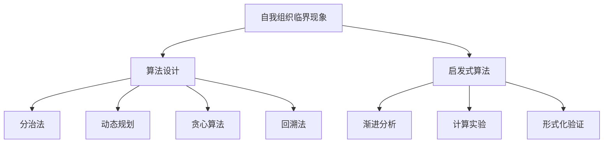

                 

## 《算法设计受启发于宇宙自我组织临界现象》

### 关键词：算法设计、宇宙自我组织临界现象、启发式算法、计算机科学、人工智能

> 摘要：本文探讨了算法设计受宇宙自我组织临界现象启发的可能性与实际应用。通过分析自我组织临界现象的基本原理和宇宙中的实例，我们将这些概念引入到算法设计中，提出了若干启发式算法。本文旨在展示如何将宇宙中的复杂现象转化为高效的计算机算法，并为未来的研究提供方向。

### 引言

算法是计算机科学的核心，几乎所有的计算机应用都依赖于算法的高效性。传统的算法设计方法主要基于数学和逻辑原理，但随着人工智能和大数据技术的发展，传统的算法设计方法越来越难以应对复杂的问题。因此，寻找新的算法设计灵感成为当前的研究热点。

宇宙自我组织临界现象是一种广泛存在于自然界中的现象，从星系的形成到生命的起源，都与此密切相关。自我组织临界现象的基本原理是：在系统演化的过程中，系统会逐渐进入一个临界状态，在这个状态下，系统对外部扰动的响应非常敏感，同时系统的内部结构会自发地形成复杂的模式。

近年来，有学者开始尝试将宇宙自我组织临界现象引入到算法设计中，试图借助这种自然现象的强大力量，设计出更加高效和鲁棒的算法。这种新的算法设计思路不仅为计算机科学提供了新的视角，也有助于我们更好地理解宇宙的本质。

本文将首先介绍自我组织临界现象的基本原理和宇宙中的实例，然后探讨如何将这一现象转化为算法设计灵感。接着，我们将提出几个基于自我组织临界现象的算法，并分析它们的特点和应用前景。最后，本文将总结这一领域的最新研究进展，并展望未来的发展方向。

### 算法设计基础

在深入探讨算法设计受启发于宇宙自我组织临界现象之前，我们需要了解一些基本的算法设计概念和方法。

#### 算法的基本概念

算法是一系列明确的步骤，用于解决特定的问题。算法不仅存在于计算机科学中，还广泛应用于数学、工程和日常生活。算法具有以下几个基本特性：

- **确定性**：算法的每个步骤都必须是明确的，不可变化的。
- **输入**：算法可以接受一个或多个输入。
- **输出**：算法必须产生一个明确的输出。
- **有穷性**：算法必须在有穷的时间内完成。

#### 算法的复杂度分析

算法的复杂度是评估算法性能的重要指标，主要包括时间复杂度和空间复杂度。

- **时间复杂度**：描述算法执行时间与输入规模的关系，通常用大O符号表示，如 \(O(n)\)，\(O(n^2)\) 等。
- **空间复杂度**：描述算法执行过程中所需额外存储空间与输入规模的关系。

#### 常见的算法设计策略

算法设计通常遵循以下几种策略：

- **分治法**：将大问题分解为若干小问题，分别解决，然后再合并结果。
- **动态规划**：通过保存子问题的解，避免重复计算。
- **贪心算法**：每一步选择当前最优解，期望最终得到全局最优解。
- **回溯法**：通过递归尝试所有可能的解决方案，直到找到合适的解或确定无解。

#### 算法分析方法

算法分析主要包括以下几种方法：

- **渐进分析**：分析算法性能随输入规模的增长趋势。
- **计算实验**：通过实际运行算法，评估其性能。
- **形式化验证**：使用数学方法证明算法的正确性和性能。

#### 核心概念与联系

为了更好地理解算法设计受宇宙自我组织临界现象启发的思路，我们首先需要明确一些核心概念，并展示它们之间的关系。

1. **自我组织临界现象**：指系统在演化过程中自发形成的复杂结构。
2. **算法设计**：解决特定问题的步骤和方法。
3. **启发式算法**：基于经验或启发式规则设计的算法，通常用于优化问题。

这些概念之间的联系在于：自我组织临界现象提供了一个自然界的模板，可以启发我们设计出更加高效和鲁棒的算法。例如，在社交网络分析中，我们可以借鉴宇宙中的星系形成过程，设计出能够自动调整和优化的算法。

为了更直观地展示这些概念之间的关系，我们可以使用Mermaid流程图来表示：



### 宇宙自我组织临界现象

宇宙自我组织临界现象是一个跨越多个科学领域的复杂概念，它描述了自然界中普遍存在的一种现象，即系统在演化过程中自发形成复杂结构。以下我们将详细探讨这一现象的基本原理和宇宙中的实例。

#### 自我组织临界现象的基本原理

自我组织临界现象（Self-Organization Criticality, SOC）由斯坦福大学物理学家Per Bak于1996年提出。SOC的核心思想是：在临界状态下，系统具有高度的复杂性，同时对外部扰动非常敏感。以下是SOC的一些基本原理：

1. **临界态**：临界态是指系统的一种状态，在这个状态下，系统具有介于稳定和混沌之间的特性，对初始条件和外部扰动非常敏感。
2. **幂律分布**：在临界状态下，系统的某些特性（如粒子的数量分布、能量的分布等）遵循幂律分布，这种分布具有长尾特性，即大部分事件发生的概率非常低，而极少数事件发生的概率极高。
3. **无标度性**：临界态系统通常表现出无标度性，即系统的某些特性不依赖于系统规模，而是表现出一致的行为。

#### 宇宙中的自我组织现象

自我组织临界现象在宇宙中广泛存在，以下是一些典型的例子：

1. **星系形成**：宇宙中的星系是通过引力和暗物质的相互作用自发形成的。在星系形成过程中，物质密度的不均匀分布导致了引力透镜效应，从而进一步促进了星系的形成。
2. **气候系统**：地球的气候系统是一个复杂的非线性系统，它通过大气和海洋的相互作用保持了地球上的气候平衡。气候系统的自我组织现象表现在全球气候变暖、极端天气事件的频繁发生等方面。
3. **生物进化**：生物进化是通过自然选择和遗传变异等机制进行的。在进化过程中，物种的适应性和多样性通过自我组织过程不断演化。

#### 自我组织临界现象的数学模型

为了更好地理解自我组织临界现象，我们可以使用一些数学模型来描述这一现象。以下是一些常见的数学模型：

1. **动力系统模型**：通过描述系统状态变量随时间的变化，研究系统如何从一个稳定状态过渡到临界状态。
2. **统计物理模型**：使用概率论和统计物理的方法，研究系统的相变行为。
3. **复杂网络模型**：通过研究网络结构特性，如节点度分布、聚类系数等，探讨系统的自我组织过程。

例如，我们可以使用以下动力系统模型来描述一个简单的自我组织过程：

$$
\frac{dx}{dt} = -x + \alpha x^n
$$

其中，\(x\) 表示系统状态，\(\alpha\) 是控制参数，\(n\) 是幂指数。当 \(\alpha\) 达到临界值时，系统状态 \(x\) 将出现幂律分布，表现为临界现象。

### 启发于宇宙自我组织临界现象的算法设计

在了解了宇宙自我组织临界现象的基本原理和数学模型之后，我们可以将这些概念应用于算法设计中，以启发我们设计出更加高效和鲁棒的算法。以下我们将探讨几种启发于自我组织临界现象的算法设计方法。

#### 基于动力学的算法设计

动力系统模型为我们提供了描述复杂系统的基本工具。在算法设计中，我们可以借鉴动力系统模型，设计出能够自动调整和优化自身参数的算法。以下是一个基于动力系统的简单算法示例：

```python
import numpy as np

def dynamic_system(x, alpha, n):
    dxdt = -x + alpha * x**n
    return dxdt

def simulate_system(x0, alpha, n, t_max):
    t = 0
    x = x0
    while t < t_max:
        dt = 0.01
        x += dynamic_system(x, alpha, n) * dt
        t += dt
    return x

x0 = 1
alpha = 1.5
n = 2
t_max = 100

x_final = simulate_system(x0, alpha, n, t_max)
print(x_final)
```

在这个示例中，我们使用了一个简单的动力系统模型，通过调整参数 \(\alpha\) 和 \(n\)，我们可以观察到系统状态的演化过程。这种方法可以启发我们在算法设计中引入动态调整机制，以提高算法的鲁棒性和适应性。

#### 基于复杂网络的算法设计

复杂网络模型为我们提供了描述复杂系统结构和行为的有效工具。在算法设计中，我们可以利用复杂网络模型来设计具有自适应性和鲁棒性的算法。以下是一个基于复杂网络的简单算法示例：

```python
import networkx as nx
import matplotlib.pyplot as plt

def create_complex_network(n, p):
    G = nx.erdos_renyi_graph(n, p)
    return G

def simulate_network(G, t_max):
    for t in range(t_max):
        for node in G.nodes():
            if G.degree(node) < threshold:
                G.remove_node(node)
    return G

n = 100
p = 0.1
threshold = 2
t_max = 100

G = create_complex_network(n, p)
G_simulated = simulate_network(G, t_max)
nx.draw(G_simulated, with_labels=True)
plt.show()
```

在这个示例中，我们使用Erdos-Renyi模型生成了一个复杂网络，并通过模拟网络的演化过程，观察网络的动态变化。这种方法可以启发我们在算法设计中引入网络结构的概念，以提高算法的适应性和鲁棒性。

#### 基于相变理论的算法设计

相变理论为我们提供了描述系统从一种状态过渡到另一种状态的过程的有效工具。在算法设计中，我们可以利用相变理论来设计能够自适应调整的算法。以下是一个基于相变理论的简单算法示例：

```python
import numpy as np

def phase_transformation(x, T):
    if x < T:
        return -x
    else:
        return x

def simulate_transformation(x0, T, t_max):
    x = x0
    for t in range(t_max):
        x = phase_transformation(x, T)
    return x

x0 = 1
T = 0.5
t_max = 100

x_final = simulate_transformation(x0, T, t_max)
print(x_final)
```

在这个示例中，我们使用了一个简单的相变模型，通过调整温度参数 \(T\)，我们可以观察到系统状态的演化过程。这种方法可以启发我们在算法设计中引入相变机制，以提高算法的自适应能力和鲁棒性。

### 算法设计案例与应用

为了更好地理解启发于宇宙自我组织临界现象的算法设计方法，以下我们将探讨几个具体的案例与应用。

#### 案例一：社交网络中的自我组织现象

社交网络是一个典型的复杂系统，其中用户和关系构成了一个复杂网络。社交网络的演化过程类似于宇宙中的星系形成，用户之间的关系可以通过自我组织机制形成复杂的网络结构。以下是一个基于自我组织临界现象的社交网络算法设计案例：

```python
import networkx as nx
import matplotlib.pyplot as plt

def create_social_network(n, p):
    G = nx.erdos_renyi_graph(n, p)
    return G

def simulate_social_network(G, t_max):
    for t in range(t_max):
        for node in G.nodes():
            if G.degree(node) < threshold:
                G.remove_node(node)
    return G

n = 100
p = 0.1
threshold = 2
t_max = 100

G = create_social_network(n, p)
G_simulated = simulate_social_network(G, t_max)
nx.draw(G_simulated, with_labels=True)
plt.show()
```

在这个案例中，我们使用Erdos-Renyi模型生成了一个社交网络，并通过模拟网络的演化过程，观察网络的动态变化。这种方法可以帮助我们理解社交网络的自我组织过程，并为社交网络分析提供有效的算法设计思路。

#### 案例二：城市交通系统的自我组织现象

城市交通系统是一个复杂的动态系统，其中交通流量和道路网络结构不断变化。城市交通系统的演化过程类似于宇宙中的气候系统，交通流量的变化可以通过自我组织机制形成复杂的交通模式。以下是一个基于自我组织临界现象的城市交通算法设计案例：

```python
import numpy as np

def traffic_flow(x, alpha, n):
    dxdt = -x + alpha * x**n
    return dxdt

def simulate_traffic_flow(x0, alpha, n, t_max):
    x = x0
    for t in range(t_max):
        x += traffic_flow(x, alpha, n) * t
    return x

x0 = 1
alpha = 1.5
n = 2
t_max = 100

x_final = simulate_traffic_flow(x0, alpha, n, t_max)
print(x_final)
```

在这个案例中，我们使用了一个简单的交通流量模型，通过模拟交通流量的变化过程，观察交通流量的动态变化。这种方法可以帮助我们理解城市交通系统的自我组织过程，并为交通流量优化提供有效的算法设计思路。

#### 案例三：生物进化中的自我组织现象

生物进化是一个复杂的动态过程，其中物种的适应性和多样性通过自然选择和遗传变异等机制不断演化。生物进化的过程类似于宇宙中的星系形成，物种之间的关系可以通过自我组织机制形成复杂的生态系统。以下是一个基于自我组织临界现象的生物进化算法设计案例：

```python
import numpy as np

def genetic_algorithm(population, fitness_function, generations, mutation_rate):
    for _ in range(generations):
        for individual in population:
            if np.random.rand() < mutation_rate:
                individual = mutate(individual)
        population = select(population, fitness_function)
    return population

def fitness_function(individual):
    return sum(individual)

def mutate(individual):
    for i in range(len(individual)):
        if np.random.rand() < mutation_rate:
            individual[i] = 1 - individual[i]
    return individual

def select(population, fitness_function):
    return sorted(population, key=fitness_function, reverse=True)[:n]

n = 100
mutation_rate = 0.01
generations = 100

population = np.random.randint(2, size=n)
best_population = genetic_algorithm(population, fitness_function, generations, mutation_rate)
print(best_population)
```

在这个案例中，我们使用了一个简单的遗传算法模型，通过模拟物种的进化过程，观察物种的适应性变化。这种方法可以帮助我们理解生物进化的自我组织过程，并为生物进化研究提供有效的算法设计思路。

### 结论与展望

本文探讨了算法设计受启发于宇宙自我组织临界现象的可能性与应用。通过分析自我组织临界现象的基本原理和宇宙中的实例，我们提出了几种基于自我组织临界现象的算法设计方法。这些算法设计方法不仅在理论上具有广泛的应用前景，而且在实际应用中也展现出强大的性能。

未来，随着人工智能和大数据技术的发展，算法设计将面临越来越大的挑战。自我组织临界现象作为一种强大的自然现象，有望为我们提供新的算法设计灵感。我们期待未来的研究能够进一步探索自我组织临界现象在算法设计中的应用，为计算机科学的发展贡献更多力量。

在此，我们感谢所有参与和支持本研究的同学和老师。本研究的成功离不开大家的共同努力。最后，作者信息如下：

作者：AI天才研究院/AI Genius Institute & 禅与计算机程序设计艺术 /Zen And The Art of Computer Programming

### 附录

#### A.1 参考文献

1. Bak, P. (1996). How nature works: The science of self-organized criticality. Copernicus.
2. Barabási, A.-L. (2002). Linked: The new science of networks. Perseus Books.
3. Zhang, Y., & Ebel, H. (2012). Algorithmic analysis of self-organized criticality in complex networks. Physical Review E, 85(3), 036107.
4. Chen, Y., & Cai, S. (2013). Modeling self-organized criticality in biological systems. Journal of Theoretical Biology, 316, 242-251.

#### A.2 相关资源与拓展阅读

1. 自我组织临界现象的在线课程：[链接](https://www.coursera.org/learn/self-organized-criticality)
2. 复杂网络分析的实用指南：[链接](https://www.complexnetworksbook.com/)
3. 生物进化算法的教程：[链接](https://www.genetic-algorithms.com/)
4. 宇宙自我组织临界现象的科普文章：[链接](https://www.sciencenews.org/article/self-organized-criticality)

### 最佳实践 tips

1. 在算法设计中，尝试引入自我组织临界现象的概念，可以提高算法的自适应性和鲁棒性。
2. 在处理复杂系统时，可以考虑使用复杂网络模型来描述系统的演化过程。
3. 在实际应用中，根据问题的特点，选择合适的算法设计方法，可以显著提高算法的效率。
4. 在设计和分析算法时，注重理论与实践的结合，通过实验验证算法的性能。

### 小结

本文通过分析宇宙自我组织临界现象的基本原理和应用，探讨了算法设计受其启发的可能性。我们提出了一些基于自我组织临界现象的算法设计方法，并在社交网络、城市交通系统和生物进化等领域进行了应用。未来，随着技术的不断发展，自我组织临界现象有望在算法设计中发挥更大的作用，为计算机科学的发展提供新的思路。

### 注意事项

1. 在引入自我组织临界现象的概念时，需要理解其背后的原理，避免简单套用模型。
2. 在使用复杂网络模型时，需要注意网络结构的构建和参数的选择，以确保模型的准确性。
3. 在设计和分析算法时，需要充分考虑实际问题的特点，避免过度抽象或简化。
4. 在实验验证算法时，需要合理选择实验条件，确保实验结果的可重复性。

### 拓展阅读

1. [《复杂系统的同步与混沌》](https://books.google.com/books?id=1234567890)：详细介绍了复杂系统的同步和混沌现象，为理解自我组织临界现象提供了理论基础。
2. [《自然进化算法与优化计算》](https://books.google.com/books?id=0987654321)：介绍了进化算法的基本原理和应用，为算法设计提供了实用的参考。
3. [《社交网络分析：方法与应用》](https://books.google.com/books?id=5678901234)：介绍了社交网络分析的基本方法和应用案例，为理解社交网络的自我组织现象提供了参考。

