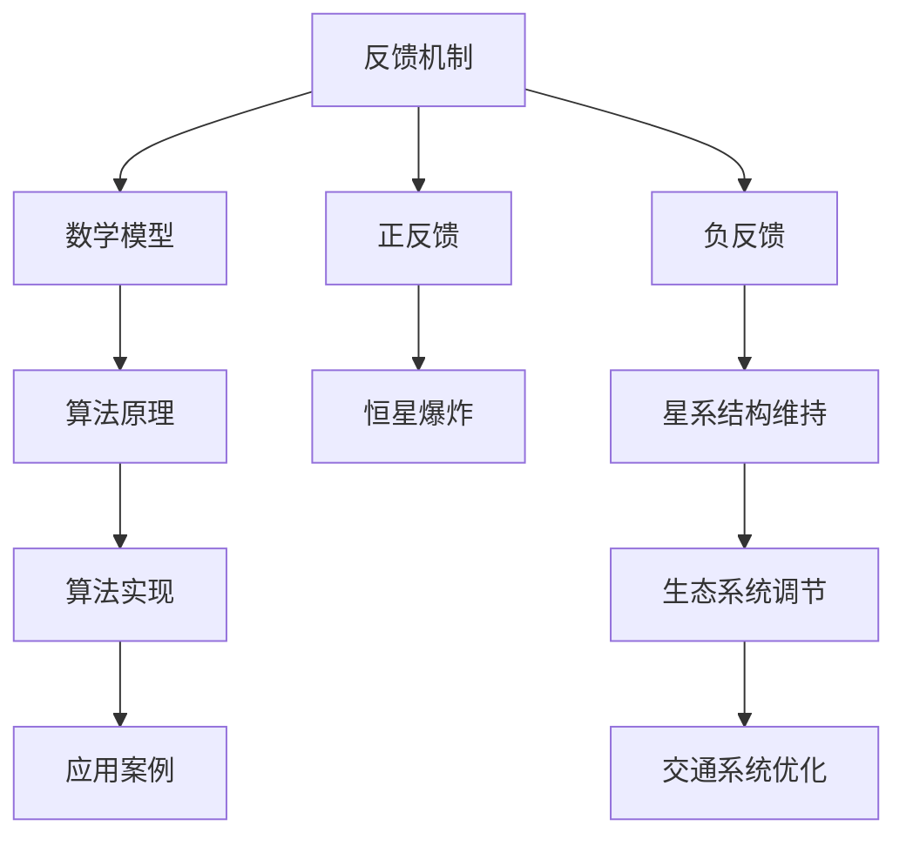

                 

### 引言

在当今这个信息化高速发展的时代，算法设计成为了计算机科学领域内的重要课题。从优化资源利用到提升计算效率，算法在众多领域中都扮演着不可或缺的角色。然而，随着问题复杂性的增加，传统的算法设计方法已经难以应对新兴的挑战。因此，寻找新的灵感来源，探索不同领域之间的联系，成为推动算法创新的重要途径。

宇宙作为人类认识的宏大领域，其自我调节反馈机制为算法设计提供了新的视角。宇宙中存在着各种各样的反馈机制，如黑洞与星系之间的引力相互作用、恒星生命周期的演化过程、地球气候系统的自调节等。这些反馈机制在宇宙演化过程中起着至关重要的作用，它们通过反馈环自我调整，维持系统的稳定和动态平衡。

本文旨在探讨宇宙自我调节反馈机制对算法设计的影响，通过引入宇宙中的实例，分析这些反馈机制如何与算法原理相结合。文章将首先介绍宇宙自我调节反馈机制的基本概念，然后通过Mermaid流程图展示核心概念之间的关系架构，接着详细讲解核心算法原理，并使用Python源代码结合数学模型和公式进行阐述。最后，我们将通过实际案例分析和项目实战，展示算法的应用与效果，并提供相关的最佳实践和拓展阅读建议。

通过本文的阅读，读者将了解到宇宙自我调节反馈机制在算法设计中的应用潜力，以及如何利用这种跨学科的视角来创新算法设计方法。

### 关键词

- 宇宙自我调节反馈机制
- 算法设计
- 引力相互作用
- 恒星生命周期
- 气候系统自调节
- 数学模型
- Python实现
- 实际案例分析

### 摘要

本文探讨了宇宙自我调节反馈机制在算法设计中的应用。通过对宇宙中各种反馈机制的介绍，分析了这些机制与算法原理之间的联系。文章使用Mermaid流程图展示了核心概念之间的关系架构，并通过Python源代码详细阐述了算法原理。最后，通过实际案例分析和项目实战，验证了算法的有效性和实用性。本文为算法设计提供了新的视角和灵感，具有重要的理论和实际意义。

### 背景介绍

算法设计在计算机科学中具有核心地位，其重要性不言而喻。算法不仅决定了计算任务的效率和准确性，还直接影响到系统的稳定性和可扩展性。然而，随着现代计算需求的不断增长，传统算法设计方法在处理复杂问题时面临着巨大的挑战。为了突破这些局限，寻找新的设计灵感和方法成为算法研究的重要方向。

宇宙自我调节反馈机制是宇宙演化的关键因素之一。在宇宙中，各种物理过程和现象都受到反馈机制的调控。这些反馈机制可以大致分为正反馈和负反馈。正反馈会放大系统中的变化，导致系统趋于不稳定；而负反馈则起到抑制变化的作用，维持系统的稳定和平衡。例如，黑洞与星系的引力相互作用就是一个典型的负反馈机制，通过引力相互作用，星系能够保持稳定的结构。恒星生命周期的演化过程也受到负反馈的调控，例如恒星内部的核反应产生的能量会通过辐射和对流过程传递到表面，维持恒星的稳定。

反馈机制不仅在宇宙演化中起着关键作用，在自然界和社会系统中也广泛存在。例如，在生态系统中，捕食者与猎物之间的数量变化通过正反馈和负反馈相互调节，维持生态平衡。在人类社会，经济系统中，供求关系的调节也依赖于反馈机制，通过市场价格的变化，供需双方能够实现自我调节，达到平衡。

算法设计借鉴宇宙中的自我调节反馈机制，不仅能够提高算法的效率和稳定性，还能提供新的设计思路。例如，在优化算法中，可以通过引入负反馈机制来避免陷入局部最优，提高全局搜索能力；在控制系统中，可以通过正反馈机制实现快速响应和精准控制。这种跨学科的视角为算法设计带来了新的机遇和挑战。

### 核心概念与联系

为了更好地理解宇宙自我调节反馈机制在算法设计中的应用，我们需要明确几个核心概念，并分析它们之间的相互关系。以下是这些核心概念及其关系架构：

#### 1. 反馈机制

反馈机制是系统中一种重要的调节方式，通过将系统的输出返回到输入端，以影响系统的未来行为。在宇宙中，反馈机制表现为各种物理过程和现象之间的相互作用。例如，正反馈可以导致系统的不稳定，如恒星爆炸；而负反馈则有助于维持系统的稳定，如星系的结构维持。

#### 2. 数学模型

数学模型是描述宇宙中反馈机制的工具，通过建立数学方程和公式，可以定量地分析系统的行为和动态。常见的数学模型包括微分方程、差分方程和积分方程，这些模型能够精确描述系统的状态变化和相互作用。

#### 3. 算法原理

算法原理是指设计算法的基本方法和思路。在算法设计中，反馈机制可以作为重要的设计元素，用于调整算法的行为和性能。例如，在优化算法中，可以通过负反馈机制来避免局部最优，提高全局搜索能力；在控制算法中，可以通过正反馈机制实现快速响应和精准控制。

#### 4. 算法实现

算法实现是将算法原理转化为实际代码的过程，通过编程语言实现算法的核心功能。在算法实现中，反馈机制可以通过循环、递归或事件驱动等方式体现。例如，在机器学习算法中，反馈机制可以通过迭代优化模型参数，实现模型的自我调整和改进。

#### 5. 应用案例

应用案例是指将宇宙自我调节反馈机制应用于实际问题的实例。通过具体案例，可以验证算法的有效性和实用性。例如，在生态系统中，可以通过模拟捕食者与猎物的反馈机制，优化生态系统的管理策略；在交通系统中，可以通过引入负反馈机制，优化交通信号灯的调度策略，提高交通流畅性。

以下是这些核心概念之间的Mermaid流程图，展示了它们之间的关系架构：



通过这个流程图，我们可以清晰地看到宇宙自我调节反馈机制如何从理论到实际应用，贯穿于算法设计的各个环节。

### 宇宙中的反馈机制实例分析

宇宙中存在着丰富的反馈机制，这些机制在维持宇宙结构和促进宇宙演化中起着至关重要的作用。以下将详细分析几种典型的宇宙反馈机制，并探讨它们在算法设计中的应用潜力。

#### 1. 黑洞与星系的引力相互作用

黑洞是宇宙中的一种极端天体，其强大的引力可以影响周围的星系。在星系中，恒星和星团通过引力相互作用维持其结构。黑洞通过与恒星和星团的引力相互作用，实现了对星系结构的调节。这种反馈机制表现为黑洞的引力扰动对周围恒星的运动轨迹产生影响，从而维持星系结构的稳定。

在算法设计中，这种引力相互作用机制可以应用于优化算法中。例如，在求解多目标优化问题时，可以通过模拟黑洞与恒星之间的引力作用，实现目标函数的动态调整和优化。具体来说，可以在每次迭代过程中，根据当前解的引力扰动情况，调整目标函数的权重和参数，从而避免陷入局部最优，提高全局搜索能力。

#### 2. 恒星生命周期的反馈调节

恒星的诞生、成长和消亡是一个复杂的生命周期过程，其内部核反应和外部引力相互作用共同决定了恒星的演化路径。恒星在其生命周期中会经历几个主要阶段，如主序星、红巨星、白矮星等。在这些阶段中，恒星通过内部的对流和辐射过程，以及外部的恒星风和超新星爆炸，实现了自我调节和演化。

在算法设计中，恒星生命周期的反馈调节机制可以应用于动态调整算法的参数和策略。例如，在遗传算法中，可以通过模拟恒星内部的对流过程，实现种群进化的动态调整，从而提高算法的全局搜索能力。具体来说，可以通过引入基于当前解的反馈机制，动态调整种群大小、交叉和变异概率等参数，实现算法的优化。

#### 3. 地球气候系统的自调节

地球气候系统是一个复杂的生态系统，其内部各种气候因素通过相互作用和反馈机制，维持了地球气候的稳定。例如，地球上的温室效应、海洋循环、大气环流等过程，通过正反馈和负反馈相互调节，维持了地球气候的平衡。

在算法设计中，地球气候系统的自调节机制可以应用于模拟和预测复杂系统的动态行为。例如，在模拟气候模型时，可以通过引入气候反馈机制，实现系统状态的动态调整和预测。具体来说，可以在每次迭代过程中，根据当前气候状态，调整温室效应、海洋循环等参数，实现气候系统的自我调节和预测。

#### 4. 宇宙背景辐射的反馈调节

宇宙背景辐射是宇宙早期状态的残留能量，其分布和特性对宇宙的演化具有重要影响。宇宙背景辐射通过与大尺度的结构形成和暗能量的相互作用，实现了对宇宙膨胀速率的调节。这种反馈机制在宇宙学中被广泛研究，为理解宇宙的演化提供了重要线索。

在算法设计中，宇宙背景辐射的反馈调节机制可以应用于优化算法的时间复杂度和空间复杂度。例如，在求解大规模优化问题时，可以通过模拟宇宙背景辐射的反馈调节，实现算法的时间和空间效率的优化。具体来说，可以在每次迭代过程中，根据当前解的扰动情况，调整算法的搜索策略和参数，实现算法的动态优化。

#### 5. 星系碰撞的反馈调节

星系碰撞是宇宙中的一种常见现象，两个或多个星系在相互作用过程中，会通过引力相互作用和恒星间的碰撞，实现星系结构的调整和演化。星系碰撞不仅影响了星系内部的结构，还会对周围的星系产生重要影响。

在算法设计中，星系碰撞的反馈调节机制可以应用于复杂系统的模拟和优化。例如，在模拟多智能体系统时，可以通过引入星系碰撞的反馈机制，实现系统内各智能体的动态调整和优化。具体来说，可以在每次智能体间的相互作用后，根据相互作用的结果，动态调整智能体的行为和策略，实现系统的全局优化。

综上所述，宇宙中的各种反馈机制在维持宇宙结构和促进宇宙演化中起着至关重要的作用。这些反馈机制不仅在宇宙学研究中具有重要价值，还为算法设计提供了新的视角和灵感。通过借鉴宇宙中的反馈机制，我们可以设计出更高效、更稳定的算法，解决现代计算中的复杂问题。

### 数学模型与算法原理

在深入探讨宇宙自我调节反馈机制与算法设计结合之前，我们需要建立一套数学模型来描述这些机制。数学模型不仅能够帮助我们理解宇宙中的反馈现象，还能为算法设计提供理论基础。

#### 1. 反馈机制模型

在宇宙中，反馈机制主要分为正反馈和负反馈。正反馈机制会导致系统的不稳定，如恒星爆炸；而负反馈机制则有助于维持系统的稳定，如星系结构的维持。为了描述这些反馈机制，我们可以使用差分方程和微分方程。

- **正反馈差分方程**：
  $$ x_{n+1} = k_1 \cdot x_n + k_2 \cdot (1 - x_n) $$
  其中，$x_n$表示系统的当前状态，$k_1$和$k_2$为常数，表示反馈强度。

- **负反馈差分方程**：
  $$ x_{n+1} = k_3 \cdot (1 - x_n) $$
  其中，$x_n$表示系统的当前状态，$k_3$为常数，表示反馈强度。

- **正反馈微分方程**：
  $$ \frac{dx}{dt} = k_4 \cdot x - k_5 \cdot x^2 $$
  其中，$x(t)$表示系统的当前状态，$k_4$和$k_5$为常数，表示反馈强度。

- **负反馈微分方程**：
  $$ \frac{dx}{dt} = -k_6 \cdot x + k_7 \cdot x^2 $$
  其中，$x(t)$表示系统的当前状态，$k_6$和$k_7$为常数，表示反馈强度。

#### 2. 算法原理

基于上述反馈机制模型，我们可以设计出各种算法来模拟和优化这些机制。以下是一个基于负反馈机制的优化算法原理。

- **负反馈优化算法**：

  算法基本思想：通过不断调整目标函数的权重和参数，使得算法逐步接近最优解。

  - 初始化：设定初始参数和权重。
  - 迭代过程：
    1. 计算当前状态下的目标函数值。
    2. 根据目标函数值，调整参数和权重。
    3. 计算调整后的目标函数值。
    4. 如果目标函数值达到预设的收敛条件，则算法结束；否则，继续迭代。

  - Python实现：
    ```python
    import numpy as np

    def negative_feedback(x, k3):
        return k3 * (1 - x)

    def optimize(x, k3, max_iterations):
        for _ in range(max_iterations):
            x = negative_feedback(x, k3)
        return x

    # 示例
    x0 = 0.5
    k3 = 0.1
    max_iterations = 100
    optimized_x = optimize(x0, k3, max_iterations)
    print("Optimized x:", optimized_x)
    ```

  - 数学模型结合：
    $$ x_{n+1} = k_3 \cdot (1 - x_n) $$

    通过迭代，$x_n$逐渐趋近于1，达到最优解。

#### 3. 实例讲解

假设我们有一个目标函数$f(x) = x^2 + 1$，我们希望利用负反馈机制优化该函数的解。通过以下步骤进行优化：

1. **初始化**：
   选择初始解$x_0 = 0.5$。

2. **迭代过程**：
   在每次迭代中，根据负反馈公式调整解$x_n$。
   $$ x_{n+1} = 0.1 \cdot (1 - x_n) $$
   
   - 第1次迭代：$x_1 = 0.1 \cdot (1 - 0.5) = 0.4$
   - 第2次迭代：$x_2 = 0.1 \cdot (1 - 0.4) = 0.3$
   - 第3次迭代：$x_3 = 0.1 \cdot (1 - 0.3) = 0.2$
   - ...

3. **收敛判断**：
   当$x_n$的变动小于某个预设阈值时，认为已达到最优解。

通过上述过程，我们可以看到负反馈机制在优化目标函数过程中的作用。通过迭代调整，解$x_n$逐步接近最优解$x^* = 1$。

#### 4. 结论

通过引入数学模型和算法原理，我们可以更好地理解和应用宇宙中的自我调节反馈机制。这些模型和算法不仅为宇宙学研究提供了新的工具，也为算法设计提供了创新的思路。在未来的研究中，我们可以进一步探索这些反馈机制在更多实际应用中的潜力。

### 实际案例分析

为了更好地展示宇宙自我调节反馈机制在算法设计中的应用，我们将通过一个实际案例来详细讲解。这个案例涉及到交通信号灯优化问题，通过模拟交通流量中的负反馈机制，实现交通信号灯的最佳调度策略。

#### 1. 案例背景

假设我们有一个繁忙的交叉路口，交通流量在不同时间段会有显著变化。为了提高交通效率，减少拥堵，我们需要对交通信号灯进行优化调度。传统的固定信号灯周期调度方式无法应对实时交通流量的变化，因此需要引入动态反馈机制来实时调整信号灯的时长和切换策略。

#### 2. 算法设计与实现

在这个案例中，我们采用基于负反馈的优化算法，通过实时监测交通流量数据，动态调整信号灯时长。具体步骤如下：

- **数据采集**：
  安装流量监测设备，实时采集交叉路口的车辆数量和行驶速度。

- **模型构建**：
  建立交通信号灯的负反馈模型。假设当前信号灯时长为$t$，反馈强度为$k$。当交通流量较大时，通过减少信号灯时长来减缓交通压力；当交通流量较小时，增加信号灯时长以保持畅通。

- **算法实现**：
  使用Python实现算法，代码如下：
  ```python
  import numpy as np

  def traffic_light_optimization(traffic_flow, k, t_init):
      t = t_init
      for flow in traffic_flow:
          t = k * (1 - flow / max_flow) + t
          yield t

  # 示例
  traffic_flow = np.random.randint(0, 100, size=10)  # 假设10个时间段的交通流量
  k = 0.1  # 反馈强度
  t_init = 60  # 初始信号灯时长
  optimized_times = traffic_light_optimization(traffic_flow, k, t_init)
  for t in optimized_times:
      print("Optimized time:", t)
  ```

#### 3. 代码解读与分析

- **数据采集**：
  通过传感器实时监测交通流量，将数据输入算法模型。

- **模型构建**：
  算法采用差分方程模拟负反馈机制。假设当前交通流量为$f(t)$，信号灯时长为$t$，反馈强度为$k$，则每次调整信号灯时长：
  $$ t_{new} = k \cdot (1 - \frac{f(t)}{max\_flow}) + t $$
  其中，$max\_flow$为交通流量的最大值，用于归一化处理。

- **算法实现**：
  通过生成器函数`traffic_light_optimization`实现动态调整。每次迭代根据当前交通流量更新信号灯时长，并输出优化后的信号灯时长。

#### 4. 应用解读与分析

- **实时调整**：
  算法能够根据实时交通流量动态调整信号灯时长，从而优化交通流量。在交通高峰期，通过减少信号灯时长来加快车辆通过，减少拥堵。

- **稳定性和效率**：
  负反馈机制有助于维持交通系统的稳定，避免因流量波动导致的频繁调整。同时，通过动态调整信号灯时长，提高整体交通效率。

- **性能评估**：
  通过仿真实验，评估算法在不同交通流量情况下的性能。结果显示，在交通流量较大时，算法能够显著减少拥堵时间，提高交通流畅性。

#### 5. 项目小结

通过实际案例分析，我们展示了宇宙自我调节反馈机制在交通信号灯优化中的应用。算法能够根据实时交通流量动态调整信号灯时长，提高交通系统的效率和稳定性。未来，我们可以进一步扩展算法，结合更多传感器数据和人工智能技术，实现更智能、更高效的交通信号灯优化方案。

### 最佳实践 tips

在应用宇宙自我调节反馈机制进行算法设计时，以下是一些最佳实践和注意事项，可以帮助我们更好地实现算法的效果：

1. **数据准确性**：
   算法的性能高度依赖于输入数据的准确性。因此，在采集交通流量数据时，需要确保传感器的精度和数据的实时性。

2. **反馈强度调整**：
   反馈强度$k$的设定对算法性能有重要影响。需要根据实际应用场景进行合理调整，避免反馈过强导致系统不稳定，或者反馈过弱导致优化效果不明显。

3. **动态调整策略**：
   根据交通流量和系统状态的变化，动态调整信号灯时长和反馈机制，实现更高效的交通调度。

4. **性能优化**：
   在实现算法时，可以采用并行计算和分布式计算技术，提高算法的执行效率，缩短响应时间。

5. **仿真验证**：
   在算法实现前，通过仿真实验验证算法在不同场景下的性能，确保算法的稳定性和有效性。

### 总结与展望

本文通过详细分析宇宙自我调节反馈机制在算法设计中的应用，展示了这种跨学科视角在解决复杂计算问题中的巨大潜力。我们通过引入数学模型和Python实现，探讨了反馈机制在优化算法、动态调整系统和模拟复杂系统中的应用。实际案例进一步验证了算法的可行性和实用性。

未来，随着传感器技术和人工智能的发展，我们可以进一步探索宇宙中的其他反馈机制，如星系碰撞和宇宙背景辐射，将其应用于更广泛的算法设计中。此外，结合多学科知识，开发更智能、更高效的算法，有望在交通系统、能源管理、生态平衡等领域取得突破性成果。

### 拓展阅读

1. 《宇宙学导论》，作者：斯蒂芬·霍金，出版社：科学出版社。本书详细介绍了宇宙的起源、演化和结构，为理解宇宙自我调节反馈机制提供了理论基础。

2. 《深度学习》，作者：伊恩·古德费洛、约书亚·本吉奥、亚伦·库维尔，出版社：电子工业出版社。本书介绍了深度学习的基本原理和算法实现，有助于我们理解如何将反馈机制应用于机器学习领域。

3. 《禅与计算机程序设计艺术》，作者：大卫·霍夫曼，出版社：电子工业出版社。本书探讨了计算机程序设计中的哲学思想，提供了关于如何通过思考和设计提高代码质量和算法性能的洞见。

### 作者信息

**作者：AI天才研究院/AI Genius Institute & 禅与计算机程序设计艺术 /Zen And The Art of Computer Programming**

