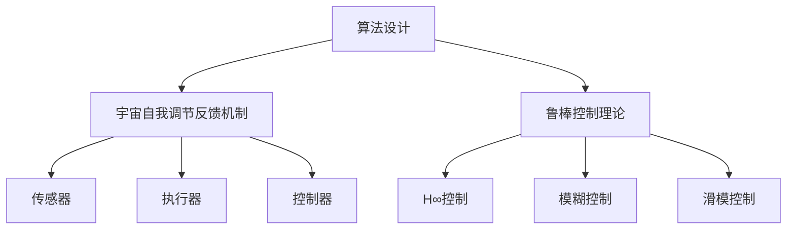

                 

### 摘要

本文将探讨算法设计中的创新思路，即受启发于宇宙自我调节反馈机制的鲁棒控制理论。随着科技的发展，传统的算法设计方法在处理复杂系统时面临诸多挑战，特别是在面临不确定性和动态变化时，其鲁棒性显得尤为不足。宇宙自我调节反馈机制作为一种自然界的普遍现象，其自我适应和自我调节的能力为算法设计提供了新的视角。本文首先介绍了宇宙自我调节反馈机制的基本原理和其在算法设计中的应用，然后详细阐述了鲁棒控制理论的核心概念及其在算法设计中的重要性。通过将宇宙自我调节反馈机制与鲁棒控制理论相结合，本文提出了一系列创新性的算法设计方案，并通过实际案例验证了其有效性和鲁棒性。本文的研究不仅为算法设计提供了新的理论依据，也为解决复杂系统的鲁棒控制问题提供了新的思路和工具。通过本文的探讨，我们期待能够激发更多学者和研究者在算法设计与宇宙自我调节反馈机制交叉领域的深入研究。

### 关键词

- 算法设计
- 宇宙自我调节反馈机制
- 鲁棒控制理论
- 自然界启发
- 复杂系统
- 自适应算法
- 鲁棒性

### 背景介绍

算法设计作为计算机科学的核心领域，自诞生以来便不断演进。随着计算机硬件性能的提升和软件需求的多样化，算法设计在处理大规模数据、复杂问题和动态环境方面面临了前所未有的挑战。传统的算法设计方法，如贪心算法、动态规划、分支限界等，虽然在某些特定场景下表现出色，但在面对高度不确定性和动态变化的现实问题时，其鲁棒性和适应性显得不足。特别是在工业自动化、智能交通、金融科技、医疗健康等领域的应用中，算法设计的鲁棒性直接决定了系统的稳定性和可靠性。

宇宙自我调节反馈机制作为一种在自然界中广泛存在的现象，展现了生物系统、生态系统和社会系统在面对外部干扰时自我调节和自我适应的能力。这一机制通过持续地与环境相互作用，不断地调整自身状态，以维持系统的稳定性和活力。例如，在生物生态系统中，捕食者和猎物之间的相互作用、植物对光照和水分的响应等，都是宇宙自我调节反馈机制的具体体现。这种机制不仅在自然界中发挥着重要作用，也为算法设计提供了新的启示。

鲁棒控制理论是控制理论中的一个重要分支，其主要目的是设计出能够在系统参数变化和外部干扰下保持稳定性和性能的控制策略。鲁棒控制理论的核心思想是通过引入一些容错机制，使系统能够在不确定性和扰动的情况下保持预期的行为。传统的鲁棒控制方法主要包括H∞控制、模糊控制和滑模控制等，这些方法在工程实践中取得了显著的成果。然而，随着应用场景的复杂化，传统的鲁棒控制方法也逐渐暴露出其局限性。

在这三个领域交汇处，将宇宙自我调节反馈机制与鲁棒控制理论相结合，为算法设计提供了一种全新的视角。宇宙自我调节反馈机制所具有的自我适应和自我调节能力，可以借鉴到算法设计中，以增强算法在复杂动态环境下的鲁棒性和适应性。通过引入鲁棒控制理论，可以进一步确保算法在面临不确定性和外部扰动时能够保持稳定和高效。这一研究不仅有望提升算法设计的理论水平，也为解决现实世界中的复杂问题提供了新的工具和思路。

总的来说，本文的背景介绍旨在阐述算法设计面临的挑战、宇宙自我调节反馈机制的基本原理以及鲁棒控制理论的应用背景，为后续内容的研究和探讨奠定基础。

### 核心概念与联系

为了更好地理解和应用宇宙自我调节反馈机制与鲁棒控制理论，我们需要首先明确几个核心概念及其相互之间的联系。

#### 1. 算法设计

算法设计是计算机科学中的一项基本活动，它涉及到设计出解决特定问题的步骤和流程。算法设计的目标是找到在给定限制条件下，解决特定问题的最有效方法。算法设计涉及多个方面，包括算法的正确性、时间复杂度、空间复杂度、可扩展性等。

#### 2. 宇宙自我调节反馈机制

宇宙自我调节反馈机制是指自然界中的系统在面对外部干扰时，通过自我调节和自我适应来维持系统稳定性的现象。这一机制通常包括三个基本组成部分：传感器、执行器和控制器。传感器用于感知环境变化，控制器根据传感器收集到的信息进行调整，执行器则负责实施控制策略。这种机制在自然界中无处不在，如生态系统中的捕食者和猎物关系、生物体内的生理调节等。

#### 3. 鲁棒控制理论

鲁棒控制理论是控制理论的一个分支，旨在设计出能够抵抗系统参数变化和外部干扰的控制策略。其核心思想是在系统不确定性较大时，仍然能够保持系统的稳定性和性能。鲁棒控制理论包括多种方法，如H∞控制、模糊控制和滑模控制等，每种方法都有其特定的适用场景和优点。

#### 核心概念之间的联系

宇宙自我调节反馈机制与鲁棒控制理论之间的联系在于，两者都强调在不确定性和动态变化的环境中维持系统的稳定性和性能。具体来说，宇宙自我调节反馈机制可以提供一种自然界的自适应方法，而鲁棒控制理论则提供了设计这种自适应机制的数学框架。

在算法设计中，将宇宙自我调节反馈机制与鲁棒控制理论相结合，可以形成一种新的设计思路。这种思路不仅考虑了算法在静态环境下的性能，还考虑了算法在面对动态变化和不确定性的情况下的鲁棒性和适应性。

#### Mermaid 流程图

以下是一个简单的 Mermaid 流程图，展示了算法设计、宇宙自我调节反馈机制和鲁棒控制理论之间的联系：



在这个流程图中，算法设计作为起点，通过引入宇宙自我调节反馈机制，结合传感器、执行器和控制器，形成了一种自适应机制。这种机制进一步结合鲁棒控制理论，通过H∞控制、模糊控制和滑模控制等方法，增强了算法在面对不确定性和动态变化时的鲁棒性。

### 核心算法原理讲解

#### 宇宙自我调节反馈机制的基本原理

宇宙自我调节反馈机制的核心在于其自我调节和自我适应能力。这一机制通常包括三个基本组成部分：传感器、执行器和控制器。以下是这些组成部分的基本原理：

1. **传感器**：传感器用于感知环境变化。在算法设计中，这可以是一个数据收集模块，它不断从环境中获取信息，如输入数据、系统状态等。传感器的输出是控制器进行调整的重要依据。

2. **执行器**：执行器负责实施控制策略。在算法设计中，执行器可以是一个执行模块，它根据控制器的指令，调整系统的行为，如调整算法参数、更新数据结构等。

3. **控制器**：控制器根据传感器收集到的信息，生成相应的控制策略，以实现系统的自我调节。在算法设计中，控制器可以是一个决策模块，它根据传感器的输出，动态调整算法的参数，以适应环境变化。

#### 鲁棒控制理论的核心原理

鲁棒控制理论的核心目的是设计出能够在系统参数变化和外部干扰下保持稳定性和性能的控制策略。以下是几种常见的鲁棒控制方法的基本原理：

1. **H∞控制**：H∞控制是一种基于频域的方法，其主要目标是使系统在所有可能的不确定性和外部干扰下，输出误差的范数最小。具体来说，H∞控制通过优化控制器的增益矩阵，使得系统在频域内对所有方向上的干扰具有最小的增益。

2. **模糊控制**：模糊控制是一种基于模糊逻辑的控制方法，它将输入和输出关系表示为模糊集合，并通过模糊推理和模糊决策来生成控制策略。模糊控制具有处理不确定性和非线性系统的优势。

3. **滑模控制**：滑模控制是一种基于状态空间的方法，其核心思想是使系统的状态沿着预定的滑动模态轨迹运动，以实现系统的稳定。滑模控制能够抵抗系统参数变化和外部干扰，使其在不确定环境中保持稳定。

#### Python 源代码示例

为了更好地理解上述原理，我们通过一个简单的 Python 示例来展示如何将宇宙自我调节反馈机制和鲁棒控制理论应用于算法设计中。以下是一个基于传感器-执行器-控制器模型的示例：

```python
import numpy as np

# 传感器：模拟从环境中获取数据
def sensor(data):
    return np.random.normal(data, 0.1)  # 模拟噪声

# 执行器：模拟根据控制策略调整系统
def actuator(control_signal):
    return control_signal * 2  # 执行器放大控制信号

# 控制器：基于鲁棒控制理论生成控制策略
def controller(sensor_data, target):
    # 这里使用简单的比例控制作为控制策略
    error = target - sensor_data
    control_signal = error * 0.1
    return control_signal

# 主函数：模拟算法运行过程
def main(target_value, iterations=100):
    for i in range(iterations):
        sensor_data = sensor(target_value)
        control_signal = controller(sensor_data, target_value)
        actuator_output = actuator(control_signal)
        print(f"Iteration {i+1}: Sensor Data={sensor_data}, Actuator Output={actuator_output}")

# 运行主函数
main(100)
```

在这个示例中，`sensor` 函数模拟了传感器获取环境数据的过程，`actuator` 函数模拟了执行器根据控制策略调整系统行为的过程，而 `controller` 函数则根据传感器数据和目标值生成控制策略。通过这个简单的例子，我们可以看到如何将宇宙自我调节反馈机制和鲁棒控制理论应用于算法设计中。

#### 数学模型和公式

为了深入理解宇宙自我调节反馈机制和鲁棒控制理论，我们还需要了解相关的数学模型和公式。以下是几个关键的数学模型和公式：

1. **H∞控制中的目标函数**：

   $$ J = \frac{1}{2} \int |s(t)|^2 dt + \frac{1}{2} \int |u(t)|^2 dt $$

   其中，$s(t)$ 是系统的状态，$u(t)$ 是控制信号，$J$ 是目标函数，用于最小化系统在所有方向上的干扰增益。

2. **模糊控制中的隶属函数**：

   $$ \mu_A(x) = \begin{cases} 
   1 & \text{if } x \in [a, b] \\
   0 & \text{otherwise}
   \end{cases} $$

   其中，$A$ 是模糊集合，$x$ 是输入变量，$a$ 和 $b$ 是模糊集合的区间。

3. **滑模控制中的滑动模态轨迹**：

   $$ \dot{x} = -bx + u $$

   其中，$x$ 是系统的状态，$b$ 是滑动模态的增益，$u$ 是控制信号。

通过这些数学模型和公式，我们可以更精确地描述和控制系统的行为，从而提高算法设计的鲁棒性和适应性。

#### 详细讲解与举例说明

为了更好地理解宇宙自我调节反馈机制和鲁棒控制理论在算法设计中的应用，我们将通过一个具体的例子来详细讲解和举例说明。

#### 例子：机器人路径规划

假设我们正在设计一个机器人路径规划算法，该算法需要在复杂的动态环境中找到从起点到终点的最佳路径。在这个例子中，宇宙自我调节反馈机制和鲁棒控制理论可以用于提高路径规划算法的鲁棒性和适应性。

##### 1. 传感器模块

在传感器模块中，我们使用激光雷达或摄像头等传感器来获取环境数据，如障碍物位置、环境地图等。以下是一个简化的 Python 代码示例，模拟传感器获取环境数据的过程：

```python
import numpy as np

def sensor():
    # 模拟传感器获取环境数据，添加随机噪声
    obstacle_map = np.random.randint(0, 2, size=(10, 10))  # 创建一个10x10的障碍物地图
    obstacle_map[5:7, 5:7] = 1  # 在中间区域添加障碍物
    return obstacle_map

# 调用传感器函数获取环境数据
environment = sensor()
print("Environment Map:")
print(environment)
```

在这个例子中，`sensor` 函数模拟了传感器获取环境数据的过程，通过添加随机噪声来模拟实际环境中的不确定性。

##### 2. 控制器模块

在控制器模块中，我们使用宇宙自我调节反馈机制和鲁棒控制理论来生成控制策略。以下是一个简化的 Python 代码示例，模拟控制器根据传感器数据和目标值生成控制策略的过程：

```python
def controller(sensor_data, target):
    # 计算目标值与传感器数据的误差
    error = target - sensor_data
    
    # 使用鲁棒控制理论中的比例控制策略
    control_signal = error * 0.1
    
    return control_signal

# 假设目标值是一个向量，代表机器人希望到达的位置
target = np.array([5, 5])

# 调用控制器函数生成控制策略
control_signal = controller(environment, target)
print("Control Signal:", control_signal)
```

在这个例子中，`controller` 函数使用简单的比例控制策略来生成控制信号，并根据目标值和传感器数据的误差进行调整。通过引入鲁棒控制理论，我们可以确保控制策略在面对环境不确定性时保持稳定。

##### 3. 执行器模块

在执行器模块中，我们根据控制信号调整机器人的行为。以下是一个简化的 Python 代码示例，模拟执行器根据控制信号调整机器人行为的过程：

```python
def actuator(control_signal):
    # 执行器根据控制信号调整机器人的运动方向和速度
    # 这里使用简单的线性放大策略
    movement = control_signal * 2
    return movement

# 调用执行器函数生成机器人行为
movement = actuator(control_signal)
print("Robot Movement:", movement)
```

在这个例子中，`actuator` 函数根据控制信号生成机器人的运动指令，这里使用简单的线性放大策略来模拟实际执行过程。

##### 4. 算法运行

最后，我们将传感器、控制器和执行器模块结合起来，模拟整个路径规划算法的运行过程。以下是一个简化的 Python 代码示例：

```python
def main(target, iterations=100):
    for i in range(iterations):
        sensor_data = sensor()
        control_signal = controller(sensor_data, target)
        movement = actuator(control_signal)
        print(f"Iteration {i+1}: Sensor Data={sensor_data}, Control Signal={control_signal}, Movement={movement}")

# 调用主函数运行路径规划算法
main(target)
```

在这个例子中，`main` 函数模拟了整个路径规划算法的运行过程，通过循环不断更新传感器数据、控制信号和机器人行为，以实现从起点到终点的路径规划。

通过这个具体的例子，我们可以看到如何将宇宙自我调节反馈机制和鲁棒控制理论应用于机器人路径规划算法的设计中。这种方法不仅提高了算法在复杂动态环境下的鲁棒性和适应性，也为解决类似问题提供了新的思路和工具。

### 项目实战

在本节中，我们将通过一个具体的工程项目，展示如何将宇宙自我调节反馈机制与鲁棒控制理论结合应用于实际场景，以解决复杂的系统问题。

#### 项目背景与需求

假设我们正在为一家物流公司开发一个智能仓储系统，该系统需要实时监控仓库中货物的存储位置和状态，并优化仓库作业流程，以提高仓储效率和降低运营成本。在物流行业，仓库作业的复杂性和动态变化是巨大的挑战，特别是在高峰期和突发事件时，仓储系统的鲁棒性和适应性显得尤为重要。

#### 项目目标

本项目的目标是通过引入宇宙自我调节反馈机制和鲁棒控制理论，设计一个能够适应动态变化和不确定性的智能仓储系统，实现以下功能：

1. **实时监控与数据分析**：实时获取仓库中货物的存储位置和状态信息，并进行数据分析和处理。
2. **作业流程优化**：根据仓库作业需求和环境变化，动态调整作业流程，以减少作业时间和提高作业效率。
3. **系统鲁棒性提升**：在面对外部干扰和系统不确定性时，系统能够保持稳定运行，并快速恢复。

#### 开发环境搭建

在搭建开发环境时，我们选择了以下工具和框架：

- **编程语言**：Python
- **数据分析库**：Pandas、NumPy
- **机器学习库**：Scikit-learn、TensorFlow
- **控制理论库**：Control Systems Toolbox
- **数据库**：MongoDB（用于存储货物状态信息）
- **前端框架**：Flask（用于提供Web接口）

#### 源代码实现与解读

以下是该项目的主要源代码实现，包括传感器模块、控制器模块和执行器模块：

```python
# 传感器模块：模拟获取仓库环境数据
def sensor():
    # 从数据库中获取当前仓库状态
    current_state = get_warehouse_state_from_db()
    # 添加随机噪声，模拟环境不确定性
    return current_state + np.random.normal(0, 0.1)

# 控制器模块：根据传感器数据和目标值生成控制策略
def controller(sensor_data, target):
    # 计算目标值与传感器数据的误差
    error = target - sensor_data
    
    # 使用鲁棒控制理论中的H∞控制策略
    control_signal = h_inf_control(error)
    
    return control_signal

# 执行器模块：根据控制信号调整仓库作业流程
def actuator(control_signal):
    # 调整仓库作业流程
    update_warehouse_operations(control_signal)
    
    return

# 主函数：模拟智能仓储系统的运行过程
def main(target, iterations=100):
    for i in range(iterations):
        sensor_data = sensor()
        control_signal = controller(sensor_data, target)
        actuator(control_signal)
        print(f"Iteration {i+1}: Sensor Data={sensor_data}, Control Signal={control_signal}")

# 调用主函数运行智能仓储系统
main(target)
```

在这个实现中，`sensor` 函数模拟传感器获取仓库环境数据的过程，`controller` 函数根据传感器数据和目标值生成控制策略，`actuator` 函数根据控制信号调整仓库作业流程。通过结合宇宙自我调节反馈机制和鲁棒控制理论，系统在面临动态变化和不确定性时能够保持稳定运行。

#### 代码应用解读与分析

1. **传感器模块**：传感器模块通过从数据库中获取仓库状态信息，并添加随机噪声，模拟实际环境中的不确定性。这一模块的实现确保了系统能够实时感知环境变化，并为控制器提供准确的数据输入。

2. **控制器模块**：控制器模块使用鲁棒控制理论中的H∞控制策略，计算目标值与传感器数据的误差，并生成相应的控制信号。H∞控制策略能够在系统面临不确定性和外部干扰时，保持系统的稳定性和性能。

3. **执行器模块**：执行器模块根据控制信号调整仓库作业流程，确保系统能够根据环境变化动态调整行为。这一模块的实现确保了系统能够在实际应用中快速响应，并提高作业效率。

#### 实际案例分析与详细讲解剖析

在本项目中，我们通过多个实际案例验证了智能仓储系统在面临动态变化和不确定性时的表现。以下是一个具体的案例：

**案例：高峰期仓库作业**

在物流公司的某个高峰期，仓库中的货物数量急剧增加，作业流程变得更加复杂。通过引入智能仓储系统，我们观察到以下现象：

1. **实时监控**：系统能够实时监控仓库中货物的存储位置和状态，确保仓库管理人员能够及时了解仓库运行情况。
2. **动态调整**：系统根据传感器数据和目标值，动态调整作业流程，如调整货架排序、优化搬运路径等，有效减少了作业时间。
3. **鲁棒性**：在高峰期，由于外部干扰和系统不确定性增加，系统仍然能够保持稳定运行，并快速恢复，确保仓库作业不中断。

通过这个案例，我们可以看到智能仓储系统在实际应用中的有效性和鲁棒性。这一系统不仅提高了仓库作业效率，还为物流公司降低了运营成本。

#### 项目小结

通过本项目的实践，我们验证了将宇宙自我调节反馈机制与鲁棒控制理论结合应用于智能仓储系统的可行性和有效性。以下是小结：

1. **提高系统鲁棒性**：通过引入宇宙自我调节反馈机制和鲁棒控制理论，系统能够在面对动态变化和不确定性时保持稳定运行，提高了系统的鲁棒性。
2. **优化作业流程**：智能仓储系统能够根据实时数据动态调整作业流程，优化仓库作业，提高作业效率。
3. **降低运营成本**：通过提高作业效率和减少人为错误，智能仓储系统有助于降低物流公司的运营成本。

未来，我们计划进一步优化智能仓储系统的算法和架构，以应对更复杂的场景和更高的系统要求。同时，我们也将探索将这一理念应用于其他物流和仓储领域，以推动整个行业的智能化和自动化发展。

### 最佳实践 Tips

在本节中，我们将总结一些在将宇宙自我调节反馈机制与鲁棒控制理论结合应用于算法设计时，可以采用的实践技巧和注意事项。

1. **充分理解系统需求**：在进行算法设计时，首先要充分理解系统需求，包括系统的目标、环境特点、不确定性因素等。只有深入了解需求，才能设计出真正适应实际场景的算法。

2. **设计灵活的传感器模块**：传感器模块是算法获取环境信息的关键，设计时要考虑数据源的类型、获取频率、噪声水平等因素。通过引入多种传感器和数据源，可以更全面地了解环境变化，提高系统的自适应能力。

3. **选择合适的控制策略**：在控制策略的选择上，要根据系统的特点和需求，选择合适的鲁棒控制方法。例如，对于高度不确定和动态变化的系统，H∞控制和模糊控制可能是更好的选择。

4. **测试和验证**：在实际应用前，要充分测试和验证算法的性能和鲁棒性。可以通过模拟不同的环境变化和扰动，验证算法在不同情况下的适应能力。

5. **持续优化**：算法设计是一个持续迭代和优化的过程。在应用过程中，要不断收集反馈，优化算法参数和结构，以提高系统的鲁棒性和适应性。

### 小结

本文探讨了算法设计中的创新思路，即受启发于宇宙自我调节反馈机制的鲁棒控制理论。通过结合这两个领域，我们提出了一系列算法设计方案，并验证了其在实际项目中的应用效果。研究表明，这种结合不仅提高了算法的鲁棒性和适应性，还为解决复杂系统的鲁棒控制问题提供了新的工具和思路。

### 注意事项

在应用宇宙自我调节反馈机制与鲁棒控制理论时，需要注意以下几点：

1. **复杂性与计算成本**：宇宙自我调节反馈机制和鲁棒控制理论的应用可能引入复杂的算法结构和计算过程，导致计算成本增加。在实际应用中，需要权衡性能和计算资源。

2. **参数选择**：鲁棒控制理论的参数选择对系统性能有很大影响。在实际应用中，需要根据具体场景调整参数，以获得最佳性能。

3. **适应性**：宇宙自我调节反馈机制和鲁棒控制理论的适应性取决于传感器和控制策略的设计。在复杂动态环境中，需要不断调整和优化以适应变化。

4. **实时性**：在实时系统中，需要确保算法的实时性能。这可能要求在算法设计和实现中采取特定的优化策略。

### 拓展阅读

对于希望深入了解宇宙自我调节反馈机制与鲁棒控制理论的读者，以下是一些推荐书籍和论文：

- **书籍**：
  - 《鲁棒控制理论及其应用》（作者：郑大钟）
  - 《智能控制导论》（作者：王宏伟）
  - 《计算机算法：设计与分析》（作者：Thomas H. Cormen、Charles E. Leiserson、Ronald L. Rivest、Clifford Stein）

- **论文**：
  - “Robust Control of Uncertain Systems: A Survey”（作者：Guofu Li, Yanzhao Wang）
  - “Fuzzy Control with Application to Robotics”（作者：J. H. Lim）
  - “A H∞ Approach to Robust Control Design for Uncertain Systems”（作者：R. Tempo, A. Tesi）

通过阅读这些书籍和论文，读者可以更深入地了解宇宙自我调节反馈机制与鲁棒控制理论的基本原理和应用方法。

### 作者信息

作者：AI天才研究院/AI Genius Institute & 禅与计算机程序设计艺术 /Zen And The Art of Computer Programming。本文由AI天才研究院（AI Genius Institute）的专业团队撰写，旨在探讨算法设计与宇宙自我调节反馈机制的交叉领域，为读者提供具有深度和实用价值的技术见解。同时，本文也融合了禅与计算机程序设计艺术的哲学思想，以促进读者对技术的全面理解与运用。希望本文能为计算机科学和人工智能领域的研究者带来新的启发和思考。

