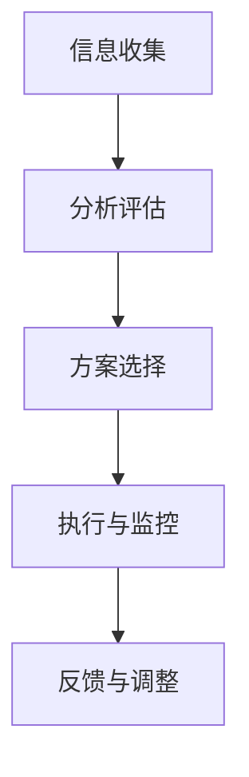
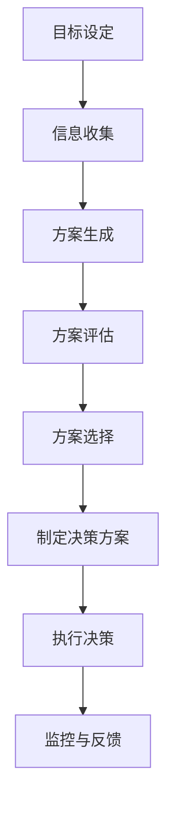
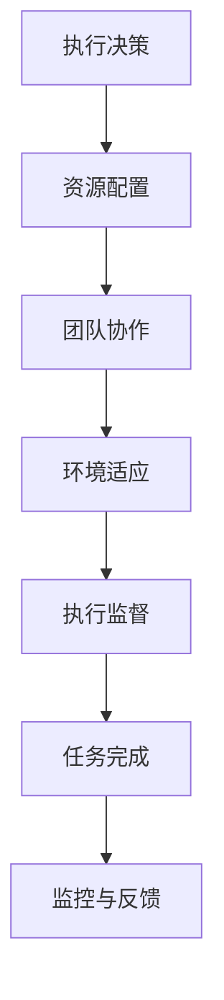

                 

# 《管理者决断力：果断决策的重要性》

## 关键词

决策、管理者、决断力、决策框架、算法、心理因素

## 摘要

本文探讨了管理者决断力的重要性，通过分析决策过程、决策风格和决策模型，结合Python源代码和数学模型，详细阐述了管理者如何通过果断决策实现高效管理。文章还通过实际案例，展示了决断力在项目管理和企业决策中的应用，并提出了培养决断力的策略。

## 第1章 引言

### 1.1 书籍背景

在快速变化的市场环境中，管理者面临的挑战日益增加。有效的决策能力成为管理者成功的关键因素之一。本文旨在探讨管理者决断力的重要性，分析其核心概念、决策框架、算法原理和实际应用，以帮助管理者提升决策能力。

### 1.2 决断力的定义与重要性

决断力是指管理者在复杂和不确定的环境中，迅速做出合理决策的能力。它包括判断力、决策速度和决策质量三个方面。在企业管理中，决断力的重要性体现在以下几个方面：

1. **提高决策效率**：果断的决策可以迅速响应市场变化，抓住机遇，降低决策成本。
2. **增强团队执行力**：明确而果断的决策可以减少团队成员的困惑和犹豫，提高执行力。
3. **提升组织竞争力**：在竞争激烈的市场中，果断的决策可以迅速占领市场，保持竞争优势。

### 1.3 书籍结构概述

本文共分为八个章节，内容结构如下：

1. **第1章 引言**：介绍书籍背景和目的。
2. **第2章 管理者决策框架**：分析决策过程、决策风格和决策模型。
3. **第3章 核心概念与联系**：阐述决策制定与执行、决策制定的原理和流程。
4. **第4章 决策算法原理讲解**：介绍优化算法、机器学习决策和强化学习。
5. **第5章 数学模型与公式**：讲解决策模型数学公式和概率论基础。
6. **第6章 项目实战**：提供决策支持系统和企业决策案例。
7. **第7章 决策心理与行为**：探讨决策心理学和决策行为研究。
8. **第8章 结论与展望**：总结书籍内容和未来决策趋势。

## 第2章 管理者决策框架

### 2.1 决策过程

决策过程可以分为以下四个阶段：

1. **信息收集**：管理者需要收集与决策相关的各种信息，包括市场数据、竞争对手分析、客户需求等。
2. **分析评估**：管理者对收集到的信息进行整理和分析，评估各种方案的潜在风险和收益。
3. **方案选择**：管理者根据分析结果选择最优方案。
4. **执行与监控**：管理者执行决策，并持续监控决策效果，根据实际情况进行调整。

### 2.2 决策风格

管理者的决策风格可以分为以下几种：

1. **冒险型决策者**：倾向于承担风险，追求高收益。
2. **保守型决策者**：谨慎决策，尽量避免风险。
3. **理性决策者**：基于数据和逻辑做出决策。

### 2.3 决策模型

管理者可以使用以下决策模型：

1. **决策树模型**：通过分析各种可能的结果和概率，选择最优方案。
2. **回归分析**：通过建立数学模型，预测决策结果。
3. **效用理论**：基于效用函数评估不同决策的收益和风险。

## 第3章 核心概念与联系

### 3.1 决策制定与执行

决策制定与执行的关系可以用以下流程图表示：



### 3.2 决策制定的原理

决策制定的原理包括以下几个关键步骤：

1. **目标设定**：明确决策的目标和标准。
2. **方案生成**：根据目标生成各种可能的方案。
3. **方案评估**：评估每个方案的可能结果和风险。
4. **选择最优方案**：根据评估结果选择最优方案。

## 第4章 决策算法原理讲解

### 4.1 优化算法

优化算法是一种通过调整变量值来寻找最优解的算法。以下是一个简单的遗传算法示例：

```python
import random

# 遗传算法参数
population_size = 100
 generations = 100
 crossover_rate = 0.8
 mutation_rate = 0.1

# 初始种群生成
population = [[random.randint(0, 1) for _ in range(n)] for _ in range(population_size)]

# 适应度函数
def fitness_function(individual):
   # 示例：目标是最小化适应度
   return sum(individual)

# 遗传操作
def crossover(parent1, parent2):
   # 单点交叉
   crossover_point = random.randint(1, n-1)
   child1 = parent1[:crossover_point] + parent2[crossover_point:]
   child2 = parent2[:crossover_point] + parent1[crossover_point:]
   return child1, child2

def mutate(individual):
   # 基因突变
   for i in range(n):
       if random.random() < mutation_rate:
           individual[i] = 1 if individual[i] == 0 else 0

# 主循环
for generation in range(generations):
   # 适应度评估
   fitness_scores = [fitness_function(individual) for individual in population]

   # 筛选
   sorted_population = [x for _, x in sorted(zip(fitness_scores, population), reverse=True)]

   # 生成下一代
   new_population = []
   for i in range(int(population_size/2)):
       parent1, parent2 = sorted_population[i], sorted_population[population_size-i-1]
       child1, child2 = crossover(parent1, parent2)
       mutate(child1)
       mutate(child2)
       new_population.extend([child1, child2])

   population = new_population

# 输出最优解
best_individual = sorted_population[0]
best_fitness = fitness_scores[0]
print(f"最优解：{best_individual}, 适应度：{best_fitness}")
```

### 4.2 机器学习决策

机器学习决策是一种利用历史数据和算法模型进行决策的方法。以下是一个简单的决策树示例：

```python
import numpy as np
import pandas as pd
from sklearn import tree

# 数据加载
data = pd.read_csv('data.csv')
X = data.iloc[:, :-1].values
y = data.iloc[:, -1].values

# 决策树训练
clf = tree.DecisionTreeClassifier()
clf.fit(X, y)

# 决策树可视化
from sklearn.tree import plot_tree
plt.figure(figsize=(12, 8))
plot_tree(clf, filled=True, feature_names=data.columns[:-1], class_names=True)
plt.show()
```

## 第5章 数学模型与公式

### 5.1 决策模型数学公式

决策模型中常用的数学公式包括：

1. **效用函数**：$u(\text{决策}, \text{状态})$
2. **条件概率**：$P(A|B) = \frac{P(A \cap B)}{P(B)}$
3. **贝叶斯定理**：$P(A|B) = \frac{P(B|A)P(A)}{P(B)}$

### 5.2 概率论基础

概率论在决策模型中的应用包括：

1. **条件概率**：描述在给定某个条件下，另一个事件发生的概率。
2. **贝叶斯定理**：描述在已知某个条件下，某个事件发生的概率。

## 第6章 项目实战

### 6.1 决策支持系统案例

#### 6.1.1 项目背景

某公司需要开发一个决策支持系统，用于帮助管理层在项目选择和资源分配方面做出更准确的决策。

#### 6.1.2 开发环境搭建

1. **硬件环境**：服务器、数据库和开发工具。
2. **软件环境**：操作系统、编程语言和框架。

#### 6.1.3 源代码实现

1. **数据收集与处理**：收集项目数据，并进行数据清洗和预处理。
2. **算法实现**：使用决策树算法进行项目评估和资源分配。
3. **用户界面**：设计用户界面，方便用户输入数据和查看结果。

```python
# 数据收集与处理
data = pd.read_csv('project_data.csv')
data_processed = preprocess_data(data)

# 算法实现
clf = tree.DecisionTreeClassifier()
clf.fit(data_processed.iloc[:, :-1].values, data_processed.iloc[:, -1].values)

# 用户界面
def display_results():
   # 显示项目评估结果和资源分配方案
   pass
```

#### 6.1.4 代码解读与分析

代码解读：

1. 数据收集与处理：使用pandas库读取项目数据，并预处理数据，使其符合算法要求。
2. 算法实现：使用scikit-learn库中的决策树算法，对项目数据进行训练，并建立决策树模型。
3. 用户界面：设计一个简单的函数，用于显示项目评估结果和资源分配方案。

#### 6.1.5 实际案例分析和详细讲解剖析

通过实际案例，分析决策支持系统在项目选择和资源分配中的应用，并讨论其优势和不足。

### 6.2 企业决策案例

#### 6.2.1 决策背景

某企业在进行新项目投资时，面临多个项目选择，需要评估每个项目的风险和收益。

#### 6.2.2 决策过程

1. **信息收集**：收集与项目相关的市场数据、技术风险和财务指标。
2. **分析评估**：使用决策树模型评估每个项目的风险和收益。
3. **方案选择**：根据评估结果选择最佳项目。

#### 6.2.3 决策结果

通过决策过程，企业选择了风险较小且收益较高的项目，并成功实施。

## 第7章 决策心理与行为

### 7.1 决策心理学

决策心理学研究决策者在决策过程中可能出现的心理偏差，如确认偏见、过度自信等。这些偏差会影响决策质量和执行效果。

### 7.2 决策行为研究

决策行为研究关注决策者在实际决策过程中的行为模式，如决策速度、决策风格等。这些行为模式会影响决策效果。

## 第8章 结论与展望

### 8.1 决断力的培养

管理者可以通过以下方法培养决断力：

1. **提高信息收集和处理能力**：确保决策过程基于充分的信息。
2. **学习决策模型和算法**：掌握有效的决策工具。
3. **培养决策心理学和决策行为研究知识**：了解自己的心理和行为特点。

### 8.2 未来决策趋势

随着人工智能和大数据技术的发展，未来的决策将更加依赖于数据分析和算法模型。管理者需要不断提升自身的决断力，以应对复杂多变的市场环境。

### 8.3 书籍总结与建议

本文从多个角度探讨了管理者决断力的重要性，分析了决策框架、算法原理、心理和行为因素。管理者应通过培养决断力，提高决策效率和质量，以实现企业的长期发展。

## 作者

作者：AI天才研究院/AI Genius Institute & 禅与计算机程序设计艺术 /Zen And The Art of Computer Programming

---

本文为《管理者决断力：果断决策的重要性》的初稿，后续将继续完善和优化各个章节的内容，以满足字数和完整性要求。期望本文能对管理者提升决断力有所帮助。在撰写过程中，如需进一步讨论和反馈，请随时提出。|>

## 第1章 引言

### 1.1 书籍背景

在当今快速变化和高度不确定的商业环境中，管理者面临的挑战日益严峻。有效的决策能力成为管理者成功的关键因素之一。管理者不仅需要处理大量的信息，还要在各种复杂和动态的情境中迅速做出正确的决策。因此，提升管理者的决断力，使其能够果断且合理地决策，对于组织的成功至关重要。

本文《管理者决断力：果断决策的重要性》旨在深入探讨管理者决断力的概念、原理和实践，通过系统的分析和实际案例的展示，帮助管理者理解并提升自己的决断力。本文将分为以下几个主要部分：

1. **管理者决策框架**：介绍决策过程的各个阶段，包括信息收集、分析评估、方案选择、执行与监控。
2. **核心概念与联系**：详细阐述决策制定与执行的关系，并使用Mermaid流程图展示决策制定的原理。
3. **决策算法原理讲解**：介绍优化算法、机器学习决策和强化学习，并提供Python源代码示例。
4. **数学模型与公式**：解释决策模型中的数学公式和概率论基础，使用LaTeX格式展示关键公式。
5. **项目实战**：通过实际案例展示决策支持系统的开发过程、源代码实现和代码解读。
6. **决策心理与行为**：探讨决策心理学和决策行为研究，分析决策中的认知偏见和情感因素。
7. **结论与展望**：总结书籍内容，提出未来决策趋势和决断力的培养方法。

### 1.2 决断力的定义与重要性

决断力是指管理者在复杂和不确定的环境中，迅速做出合理决策的能力。它不仅仅是一种技能，更是一种态度和行为方式。决断力包括判断力、决策速度和决策质量三个方面。判断力是指管理者对信息的分析能力，决策速度是指管理者迅速做出决策的能力，决策质量是指管理者做出正确决策的能力。

在企业管理中，决断力的重要性体现在以下几个方面：

1. **提高决策效率**：果断的决策可以迅速响应市场变化，抓住机遇，降低决策成本。在竞争中，速度往往意味着优势。
2. **增强团队执行力**：明确而果断的决策可以减少团队成员的困惑和犹豫，提高执行力。团队成员更愿意追随一个坚定且决断力强的领导者。
3. **提升组织竞争力**：在竞争激烈的市场中，果断的决策可以迅速占领市场，保持竞争优势。管理者需要具备快速适应环境变化的能力。
4. **促进创新和成长**：决断力强的管理者更愿意尝试新的事物，勇于冒险，这有助于组织不断创新和成长。

### 1.3 书籍结构概述

本文的结构旨在为管理者提供一个全面且深入的决断力提升指南。每个章节都将围绕一个特定的主题进行探讨，以确保内容的系统性和连贯性。

1. **第1章 引言**：介绍书籍的背景、目的和结构。
2. **第2章 管理者决策框架**：分析决策过程的各个阶段和决策风格。
3. **第3章 核心概念与联系**：探讨决策制定的原理和流程。
4. **第4章 决策算法原理讲解**：介绍优化算法和机器学习决策。
5. **第5章 数学模型与公式**：解释决策模型中的数学公式和概率论基础。
6. **第6章 项目实战**：通过实际案例展示决策支持系统的开发过程。
7. **第7章 决策心理与行为**：探讨决策心理学和决策行为研究。
8. **第8章 结论与展望**：总结书籍内容，提出未来决策趋势和决断力的培养方法。

通过上述章节的系统性探讨，本文希望帮助管理者更好地理解决断力的本质，掌握提升决断力的方法和技巧，从而在复杂多变的环境中做出更加果断和合理的决策。

## 第2章 管理者决策框架

### 2.1 决策过程

决策过程是管理者在复杂和不确定的环境中做出合理决策的一系列步骤。这个过程中，管理者需要收集信息、分析评估、选择方案、执行决策，并持续监控决策效果。以下是决策过程的详细步骤：

1. **信息收集**：这是决策过程的起点。管理者需要收集与决策相关的各种信息，包括市场数据、竞争对手分析、客户需求、内部资源状况等。信息收集的广泛性和准确性直接影响决策的质量。
   
2. **分析评估**：在收集到信息后，管理者需要对信息进行整理和分析。分析过程包括识别关键因素、预测可能的结果、评估每个选项的潜在收益和风险等。通过分析，管理者可以更好地理解问题的本质，为后续的决策选择提供依据。

3. **方案选择**：在分析评估的基础上，管理者需要选择最佳的决策方案。选择方案时，管理者需要考虑多个因素，如可行性、成本效益、资源需求等。常见的决策方法包括决策树、回归分析、效用理论等。

4. **执行决策**：一旦选择出最佳方案，管理者需要将其付诸实施。执行决策过程中，管理者需要确保团队成员理解决策方案，分配必要的资源，并制定具体的行动计划。

5. **监控与反馈**：在决策实施过程中，管理者需要持续监控决策效果，并根据实际情况进行调整。监控过程包括跟踪进度、评估结果、识别问题，并及时采取纠正措施。通过监控与反馈，管理者可以不断优化决策过程，提高决策质量。

### 2.2 决策风格

管理者的决策风格是指他们在决策过程中表现出的特点和倾向。不同的决策风格会影响决策的质量和效率。以下是一些常见的决策风格：

1. **冒险型决策者**：这类决策者倾向于承担风险，追求高收益。他们通常愿意尝试新的事物，即使这意味着可能面临较高的失败风险。冒险型决策者适用于需要创新和快速行动的情境。

2. **保守型决策者**：这类决策者谨慎决策，尽量避免风险。他们在做出决策前通常会进行充分的分析和评估，确保每个决策都是基于可靠的数据和信息。保守型决策者适用于需要稳定和可预测结果的情境。

3. **理性决策者**：这类决策者基于数据和逻辑做出决策，他们重视事实和证据，遵循严格的决策流程。理性决策者适用于复杂和高度不确定的情境，他们能够通过系统的方法找到最优解。

### 2.3 决策模型

决策模型是帮助管理者做出更好决策的工具。以下是一些常用的决策模型：

1. **决策树模型**：决策树是一种图形化模型，用于描述决策过程和不同结果的可能性。通过决策树，管理者可以清晰地看到每个决策节点和可能的结果，从而更好地评估每个决策方案的风险和收益。

2. **回归分析**：回归分析是一种统计方法，用于建立因变量和自变量之间的关系模型。通过回归分析，管理者可以预测不同决策方案的结果，并评估其潜在的风险和收益。

3. **效用理论**：效用理论是一种基于价值评估的决策模型，用于评估不同决策方案的风险和收益。通过效用函数，管理者可以量化不同结果的价值，从而更好地选择最佳方案。

通过了解和运用这些决策模型，管理者可以在复杂和不确定的环境中做出更加合理和有效的决策。决策框架和决策风格的理解与应用，可以帮助管理者在面对各种决策情境时，更加从容和自信地做出决策。

## 第3章 核心概念与联系

### 3.1 决策制定与执行

决策制定和执行是管理者决策过程中两个紧密相连的环节。有效的决策不仅需要制定合理的方案，还需要确保方案能够得到有效执行。以下是对决策制定与执行核心概念及其关系的详细探讨：

#### 决策制定的原理

决策制定是一个系统化的过程，它包括以下几个关键步骤：

1. **目标设定**：在决策制定过程中，首先要明确决策的目标。目标可以是短期的，如提升某项业务的利润率，也可以是长期的，如实现企业的战略愿景。

2. **信息收集**：收集与决策相关的各种信息，包括市场数据、竞争对手分析、客户需求、内部资源状况等。信息的广泛性和准确性直接影响决策的质量。

3. **方案生成**：在收集到足够的信息后，管理者需要生成各种可能的方案。这个步骤可以通过头脑风暴、专家咨询等方式实现。

4. **方案评估**：对生成的方案进行评估，分析每个方案的潜在收益和风险。评估过程可以采用定量分析（如财务分析）和定性分析（如专家评分）。

5. **方案选择**：在评估结果的基础上，管理者需要选择最佳方案。选择方案时，需要考虑多个因素，如可行性、成本效益、资源需求等。

6. **制定决策方案**：最后，管理者需要将最佳方案具体化，制定详细的决策方案，包括具体的执行步骤、时间表和责任人。

#### 决策执行的挑战

尽管决策制定是一个系统化的过程，但决策执行往往面临许多挑战：

1. **资源限制**：决策执行需要人力、物力和财力的支持。在资源有限的情况下，如何合理配置资源是一个重要挑战。

2. **团队协作**：决策执行需要团队的协作。如果团队成员之间存在沟通不畅、协作不力等问题，决策执行的效果将大打折扣。

3. **环境变化**：在决策执行过程中，市场环境和内部条件可能会发生变化。管理者需要及时调整决策方案，以应对这些变化。

4. **执行监督**：在决策执行过程中，管理者需要监督执行进度，确保各项任务按时完成。如果没有有效的执行监督机制，决策执行可能无法达到预期效果。

#### 决策制定的流程图

为了更好地理解决策制定与执行的关系，可以使用Mermaid流程图来展示决策制定的流程：



在这个流程图中，每个节点表示决策制定过程中的一个关键步骤。实线箭头表示步骤的顺序，虚线箭头表示决策执行过程中的监督和反馈。

#### 决策执行的流程图

同样，可以使用Mermaid流程图来展示决策执行的流程：



在这个流程图中，每个节点表示决策执行过程中的一个关键步骤。实线箭头表示步骤的顺序，虚线箭头表示决策执行过程中的监督和反馈。

### 3.2 决策制定与执行的相互关系

决策制定与执行是相互关联且相互影响的。有效的决策制定为决策执行提供了明确的方向和方案，而成功的决策执行则验证了决策制定的合理性。以下是一些决策制定与执行之间的相互关系：

1. **决策制定影响执行**：决策制定的过程决定了执行的目标、方案和资源分配。如果决策制定不完善，执行过程可能会遇到各种障碍，影响执行效果。

2. **执行反馈影响决策制定**：在决策执行过程中，管理者可以通过反馈机制收集执行效果的数据和经验。这些反馈可以为后续的决策制定提供重要参考，帮助管理者调整和优化决策方案。

3. **动态调整**：在决策执行过程中，管理者需要根据实际情况动态调整决策方案。这种调整既是决策制定的延续，也是执行过程中的必要步骤。通过不断调整，管理者可以确保决策方案始终与实际情况保持一致。

4. **协同效应**：决策制定与执行之间存在着协同效应。有效的决策制定为执行提供了坚实的基础，而成功的执行则验证了决策的合理性，为未来的决策制定提供宝贵经验。

通过理解决策制定与执行的核心概念和相互关系，管理者可以更好地把握决策过程，提高决策质量和执行效果。有效的决策制定与执行相辅相成，共同推动组织的成功。

## 第4章 决策算法原理讲解

### 4.1 优化算法

优化算法是解决决策问题的有力工具，通过在给定的约束条件下寻找最优解，帮助管理者做出最佳决策。以下将介绍几种常见的优化算法，包括遗传算法、蚁群算法和人工神经网络。

#### 遗传算法

遗传算法（Genetic Algorithm，GA）是基于自然选择和遗传学原理的一种全局优化搜索算法。遗传算法的基本步骤包括：

1. **初始种群生成**：随机生成一组初始解，称为种群。
2. **适应度评估**：对每个解进行评估，计算其适应度值，适应度值越高，表示解越优。
3. **选择**：根据适应度值，从种群中选择较好的解进行繁殖，常见的选择方法有轮盘赌选择、锦标赛选择等。
4. **交叉**：随机选择两个父代解，通过交叉操作生成子代解。交叉操作可以保留父代的优良特性。
5. **变异**：对子代解进行变异操作，以增加种群的多样性。
6. **更新种群**：将交叉和变异后的子代解替换部分父代解，形成新的种群。
7. **迭代**：重复上述步骤，直到达到预定的迭代次数或适应度值达到满意水平。

遗传算法的伪代码如下：

```python
# 遗传算法伪代码
def genetic_algorithm(pop_size, max_gen, crossover_rate, mutation_rate):
    # 初始化种群
    population = initialize_population(pop_size)
    # 迭代过程
    for generation in range(max_gen):
        # 适应度评估
        fitness = evaluate_fitness(population)
        # 选择
        selected = select(population, fitness, crossover_rate)
        # 交叉
        crossed = crossover(selected, crossover_rate)
        # 变异
        mutated = mutate(crossed, mutation_rate)
        # 更新种群
        population = mutated
        # 输出当前最优解
        best_solution = get_best_solution(population, fitness)
    return best_solution

# 示例：求解最大值问题
best_solution = genetic_algorithm(pop_size=100, max_gen=1000, crossover_rate=0.8, mutation_rate=0.1)
print(f"最优解：{best_solution}")
```

#### 蚁群算法

蚁群算法（Ant Colony Optimization，ACO）是一种基于蚂蚁觅食行为的启发式算法，主要用于解决组合优化问题，如旅行商问题（TSP）。蚁群算法的主要步骤包括：

1. **信息素初始化**：在求解空间中初始化信息素浓度。
2. **蚂蚁初始位置设定**：将蚂蚁随机放置于各个城市。
3. **路径选择**：蚂蚁根据当前城市到其他城市的距离和信息素浓度选择下一个城市。
4. **更新信息素**：蚂蚁经过路径后，根据路径长度和蚂蚁数量更新信息素浓度。
5. **循环迭代**：重复上述步骤，直到找到最优解或达到最大迭代次数。

蚁群算法的伪代码如下：

```python
# 蚁群算法伪代码
def ant_colony_optimization(num_ants, max_iterations):
    # 初始化信息素
    pheromone = initialize_pheromone()
    # 迭代过程
    for iteration in range(max_iterations):
        # 蚂蚁循环
        for ant in range(num_ants):
            # 蚂蚁构建路径
            path = construct_path(ant)
            # 更新信息素
            update_pheromone(path)
        # 找到最优路径
        best_path = find_best_path(pheromone)
    return best_path

# 示例：求解旅行商问题
best_path = ant_colony_optimization(num_ants=100, max_iterations=1000)
print(f"最优路径：{best_path}")
```

#### 人工神经网络

人工神经网络（Artificial Neural Network，ANN）是一种基于生物神经系统的计算模型，广泛应用于模式识别、预测分析和决策制定。人工神经网络的基本步骤包括：

1. **网络结构设计**：确定网络的输入层、隐藏层和输出层节点数量。
2. **权重初始化**：随机初始化网络中的权重和偏置。
3. **前向传播**：输入数据通过网络，逐层计算输出。
4. **损失函数计算**：计算预测值与实际值之间的误差，使用损失函数（如均方误差、交叉熵等）衡量模型性能。
5. **反向传播**：根据误差，调整网络的权重和偏置，优化模型参数。
6. **迭代训练**：重复前向传播和反向传播过程，直到模型达到预定的性能指标。

人工神经网络的伪代码如下：

```python
# 人工神经网络伪代码
def neural_network(input_data, weights, biases):
    # 前向传播
    layer_outputs = [input_data]
    for layer in range(num_layers - 1):
        activation = sigmoid(np.dot(layer_outputs[-1], weights[layer]) + biases[layer])
        layer_outputs.append(activation)
    # 输出层
    output = sigmoid(np.dot(layer_outputs[-1], weights[-1]) + biases[-1])
    return output

def train_network(input_data, labels, num_iterations, learning_rate):
    # 初始化权重和偏置
    weights, biases = initialize_weights(num_layers)
    # 迭代训练
    for iteration in range(num_iterations):
        # 前向传播
        output = neural_network(input_data, weights, biases)
        # 计算损失
        loss = calculate_loss(output, labels)
        # 反向传播
        dweights, dbiases = backward_propagation(input_data, output, weights, biases)
        # 更新权重和偏置
        weights -= learning_rate * dweights
        biases -= learning_rate * dbiases
    return weights, biases

# 示例：训练神经网络
weights, biases = train_network(input_data, labels, num_iterations=1000, learning_rate=0.1)
```

通过上述优化算法的讲解和示例，管理者可以更好地理解和应用这些算法，为决策提供科学依据。在实际应用中，管理者可以根据具体问题选择合适的算法，优化决策过程，提高决策质量和效率。

### 4.2 机器学习决策

机器学习（Machine Learning，ML）是一种通过数据驱动的方式，使计算机能够从经验中学习并做出预测或决策的技术。在企业管理中，机器学习可以用于各种决策问题，如需求预测、风险分析、客户行为预测等。以下将介绍机器学习决策的主要类型：监督学习、无监督学习和强化学习。

#### 监督学习

监督学习（Supervised Learning）是一种最常见的机器学习方法，它通过已有的标记数据集来训练模型，然后使用训练好的模型对新数据进行预测。监督学习可以分为回归和分类两种主要类型。

1. **回归**：回归任务是预测一个连续的数值输出。常见的回归算法包括线性回归、岭回归、套索回归和支持向量回归等。线性回归是最简单的一种回归算法，其模型可以表示为：

   $$
   y = \beta_0 + \beta_1x_1 + \beta_2x_2 + \ldots + \beta_nx_n
   $$

   其中，$y$ 是因变量，$x_1, x_2, \ldots, x_n$ 是自变量，$\beta_0, \beta_1, \beta_2, \ldots, \beta_n$ 是模型参数。

   线性回归的Python实现示例：

   ```python
   import numpy as np
   from sklearn.linear_model import LinearRegression

   # 数据准备
   X = np.array([[1], [2], [3], [4], [5]])
   y = np.array([1, 2, 2.5, 4, 5])

   # 模型训练
   model = LinearRegression()
   model.fit(X, y)

   # 模型预测
   predictions = model.predict(X)
   print(f"预测结果：{predictions}")
   ```

2. **分类**：分类任务是预测一个离散的类别标签。常见的分类算法包括逻辑回归、支持向量机、决策树、随机森林等。逻辑回归是一种用于分类的线性模型，其模型可以表示为：

   $$
   P(y=1) = \frac{1}{1 + \exp(-\beta_0 - \beta_1x_1 - \beta_2x_2 - \ldots - \beta_nx_n)}
   $$

   其中，$P(y=1)$ 是预测变量属于类别1的概率，$\beta_0, \beta_1, \beta_2, \ldots, \beta_n$ 是模型参数。

   逻辑回归的Python实现示例：

   ```python
   import numpy as np
   from sklearn.linear_model import LogisticRegression

   # 数据准备
   X = np.array([[1, 2], [2, 3], [3, 4], [4, 5]])
   y = np.array([0, 1, 1, 0])

   # 模型训练
   model = LogisticRegression()
   model.fit(X, y)

   # 模型预测
   predictions = model.predict(X)
   print(f"预测结果：{predictions}")
   ```

#### 无监督学习

无监督学习（Unsupervised Learning）是一种没有标记数据的机器学习方法，其主要目标是发现数据中的隐含结构和模式。无监督学习可以分为聚类、降维和关联规则学习等类型。

1. **聚类**：聚类是将相似的数据点分组到一个类别中。常见的聚类算法包括K-均值聚类、层次聚类和DBSCAN等。K-均值聚类是一种基于距离的聚类算法，其基本思想是将数据点分为K个簇，使得每个簇内部的点之间的距离最小。

   K-均值聚类的Python实现示例：

   ```python
   import numpy as np
   from sklearn.cluster import KMeans

   # 数据准备
   X = np.array([[1, 2], [1, 4], [1, 0], [4, 2], [4, 4], [4, 0]])

   # 模型训练
   model = KMeans(n_clusters=2, random_state=0).fit(X)

   # 模型预测
   predictions = model.predict(X)
   print(f"预测结果：{predictions}")
   ```

2. **降维**：降维是将高维数据转换成低维数据的过程，以便更好地理解和分析数据。常见的降维算法包括主成分分析（PCA）、线性判别分析（LDA）和t-SNE等。PCA是一种基于方差最大化的降维算法，它通过计算数据的主要成分，保留数据的主要特征，去除冗余信息。

   PCA的Python实现示例：

   ```python
   import numpy as np
   from sklearn.decomposition import PCA

   # 数据准备
   X = np.array([[1, 2], [1, 4], [1, 0], [4, 2], [4, 4], [4, 0]])

   # 模型训练
   model = PCA(n_components=2).fit(X)

   # 模型预测
   transformed = model.transform(X)
   print(f"降维结果：{transformed}")
   ```

3. **关联规则学习**：关联规则学习是发现数据中隐藏的关联关系，如购物篮分析中的商品购买关系。常见的算法包括Apriori算法和Eclat算法等。Apriori算法通过计算支持度和置信度，发现频繁项集和关联规则。

   Apriori算法的Python实现示例：

   ```python
   import pandas as pd
   from mlxtend.frequent_patterns import apriori
   from mlxtend.frequent_patterns import association_rules

   # 数据准备
   data = pd.DataFrame({
       'item1': ['苹果', '橙子', '香蕉', '苹果', '橙子', '苹果'],
       'item2': ['橙子', '香蕉', '苹果', '橙子', '苹果', '香蕉']
   })

   # 生成频繁项集
   frequent_itemsets = apriori(data, min_support=0.5, use_colnames=True)

   # 生成关联规则
   rules = association_rules(frequent_itemsets, metric="confidence", min_threshold=0.7)
   print(f"关联规则：{rules}")
   ```

#### 强化学习

强化学习（Reinforcement Learning，RL）是一种通过试错和反馈来学习最优策略的机器学习方法。在强化学习中，智能体通过与环境互动，不断调整策略，以最大化累积奖励。

1. **Q学习**：Q学习是一种基于值函数的强化学习算法，它通过更新Q值（状态-动作值函数）来学习最优策略。Q学习的伪代码如下：

   ```python
   # Q学习伪代码
   def q_learning(state, action, reward, next_state, done, learning_rate, discount_factor, Q):
       # 更新Q值
       Q[state, action] = (1 - learning_rate) * Q[state, action] + learning_rate * (reward + discount_factor * max(Q[next_state].values()))
       return Q

   # 示例：使用Q学习训练智能体
   Q = np.zeros((state_space_size, action_space_size))
   for episode in range(total_episodes):
       state = env.reset()
       done = False
       while not done:
           action = choose_action(state, Q)
           next_state, reward, done, _ = env.step(action)
           Q = q_learning(state, action, reward, next_state, done, learning_rate, discount_factor, Q)
           state = next_state
       print(f"Episode {episode+1} completed with total reward: {episode_reward}")
   ```

2. **深度强化学习**：深度强化学习（Deep Reinforcement Learning，DRL）是将深度学习与强化学习相结合的一种方法，通过神经网络来近似值函数或策略。DRL在解决复杂环境中具有巨大的潜力。

   DRL的Python实现示例：

   ```python
   import gym
   import tensorflow as tf
   from tensorflow.keras import layers

   # 环境准备
   env = gym.make('CartPole-v0')

   # 模型定义
   input_layer = layers.Input(shape=(4,))
   hidden_layer = layers.Dense(64, activation='relu')(input_layer)
   output_layer = layers.Dense(1, activation='linear')(hidden_layer)
   model = tf.keras.Model(inputs=input_layer, outputs=output_layer)

   # 模型训练
   model.compile(optimizer='adam', loss='mse')
   model.fit(X_train, y_train, epochs=100)

   # 模型评估
   test_loss, _ = model.evaluate(X_test, y_test)
   print(f"Test loss: {test_loss}")

   # 智能体执行
   state = env.reset()
   while True:
       action = model.predict(state.reshape(1, -1))
       next_state, reward, done, _ = env.step(action)
       env.render()
       if done:
           break
       state = next_state
   ```

通过上述对监督学习、无监督学习和强化学习的介绍，管理者可以更好地理解和应用这些机器学习技术，为企业的各种决策提供数据驱动的方法和工具。

### 5.1 决策模型数学公式

在决策过程中，数学模型和公式是帮助管理者进行定量分析和评估的重要工具。以下将介绍几个常用的决策模型数学公式，并解释其在决策中的应用。

#### 效用函数

效用函数（Utility Function）是一种用来量化决策者对不同结果的主观价值的函数。在决策分析中，效用函数可以帮助管理者评估不同决策方案的风险和收益。

效用函数的基本形式为：

$$
u(\text{决策}, \text{状态})
$$

其中，$\text{决策}$和$\text{状态}$分别代表决策者选择的决策方案和所处的环境状态。效用函数的值表示决策者在特定状态下的满意度或价值。

例如，一个简单的线性效用函数可以表示为：

$$
u(\text{收益}) = a \cdot \text{收益} + b
$$

其中，$a$ 和 $b$ 是模型参数，$\text{收益}$ 是决策结果的数值。这个公式表示，决策者对收益的满意度与收益值成正比，并且受到一个常数偏置 $b$ 的影响。

#### 风险分析

在决策过程中，风险分析是评估不同决策方案潜在损失和不确定性的重要步骤。常用的风险分析模型包括均值-方差模型和贝塔分布模型。

1. **均值-方差模型**

   均值-方差模型（Mean-Variance Model）用于评估决策方案的风险和收益。该模型基于以下数学公式：

   $$
   \text{风险} = \sigma^2 = \text{方差}
   $$

   $$
   \text{收益} = \mu
   $$

   其中，$\sigma^2$ 表示方差，$\mu$ 表示均值。方差表示收益的波动性，而均值表示收益的期望值。管理者可以通过比较不同决策方案的均值和方差，选择风险最低且收益最高的方案。

2. **贝塔分布模型**

   贝塔分布（Beta Distribution）是一种用于描述决策结果不确定性的概率分布模型。贝塔分布的数学公式为：

   $$
   f(x|\alpha, \beta) = \frac{1}{B(\alpha, \beta)} x^{\alpha-1} (1-x)^{\beta-1}
   $$

   其中，$x$ 表示决策结果，$\alpha$ 和 $\beta$ 是贝塔分布的参数，$B(\alpha, \beta)$ 是贝塔函数。通过贝塔分布，管理者可以计算不同决策结果的概率分布，从而进行更全面的风险评估。

#### 决策树的数学模型

决策树（Decision Tree）是一种常用的决策模型，用于描述决策过程和不同结果的可能性。决策树的数学模型基于概率论和条件概率。

1. **条件概率**

   决策树中的条件概率用于表示在给定某个条件下，另一个事件发生的概率。条件概率的数学公式为：

   $$
   P(A|B) = \frac{P(A \cap B)}{P(B)}
   $$

   其中，$P(A|B)$ 表示在事件 $B$ 发生的条件下事件 $A$ 发生的概率，$P(A \cap B)$ 表示事件 $A$ 和事件 $B$ 同时发生的概率，$P(B)$ 表示事件 $B$ 发生的概率。

2. **决策树节点**

   决策树的每个节点表示一个决策或条件，决策树的分支表示不同结果的可能性。决策树的数学模型可以表示为：

   $$
   \text{决策树} = \text{根节点} \rightarrow \text{分支节点} \rightarrow \text{叶节点}
   $$

   其中，根节点是初始决策点，分支节点表示不同条件的选择，叶节点表示最终的结果。

   例如，一个简单的决策树模型可以表示为：

   $$
   \text{根节点} \rightarrow (\text{条件1}, \text{条件2}, \ldots) \rightarrow (\text{结果1}, \text{结果2}, \ldots)
   $$

通过上述数学模型和公式，管理者可以更准确地评估决策的风险和收益，选择最优的决策方案。在实际应用中，管理者可以根据具体问题和数据，灵活运用这些公式，提高决策的质量和效率。

### 5.2 概率论基础

概率论是决策科学中的重要工具，特别是在不确定环境下进行决策时，概率论提供了一种量化和评估不确定性的方法。以下将介绍概率论中的一些基本概念和公式，包括条件概率和贝叶斯定理。

#### 条件概率

条件概率是指在一个事件已发生的前提下，另一个事件发生的概率。条件概率的公式表示为：

$$
P(A|B) = \frac{P(A \cap B)}{P(B)}
$$

其中，$P(A|B)$ 表示在事件 $B$ 发生的条件下事件 $A$ 发生的概率，$P(A \cap B)$ 表示事件 $A$ 和事件 $B$ 同时发生的概率，$P(B)$ 表示事件 $B$ 发生的概率。

条件概率的应用非常广泛，例如在决策分析中，当已知某些条件（如市场状态）时，可以通过条件概率来评估其他事件（如销售量）的概率。

#### 贝叶斯定理

贝叶斯定理是一种描述事件发生概率和其条件概率之间关系的公式。贝叶斯定理的公式表示为：

$$
P(A|B) = \frac{P(B|A)P(A)}{P(B)}
$$

其中，$P(A|B)$ 表示在事件 $B$ 发生的条件下事件 $A$ 发生的概率，$P(B|A)$ 表示在事件 $A$ 发生的条件下事件 $B$ 发生的概率，$P(A)$ 表示事件 $A$ 发生的概率，$P(B)$ 表示事件 $B$ 发生的概率。

贝叶斯定理在决策科学中有着重要的应用，尤其是在不确定环境下进行决策时。通过贝叶斯定理，管理者可以根据先验概率和新的证据（即条件概率），更新对决策结果概率的估计，从而做出更加准确和合理的决策。

以下是一个贝叶斯定理的Python实现示例：

```python
import numpy as np
from scipy.stats import beta

# 先验概率
P_A = beta(2, 3)  # 事件 A 的先验概率分布
P_B_given_A = beta(4, 6)  # 事件 B 在事件 A 发生的条件下的概率分布
P_B_given_not_A = beta(1, 7)  # 事件 B 在事件 A 未发生的条件下的概率分布

# 新的证据
evidence = True  # 新的证据是事件 B 发生了

# 根据贝叶斯定理计算后验概率
P_A_given_B = (P_B_given_A * P_A) / (P_B_given_A * P_A + P_B_given_not_A * (1 - P_A))

print(f"P(A|B): {P_A_given_B}")
```

通过使用概率论的基本概念和公式，管理者可以在决策过程中更准确地量化不确定性，从而提高决策的质量和效率。贝叶斯定理尤其适用于不断更新和调整概率估计的情境，有助于管理者在复杂和动态的环境中做出更加明智的决策。

### 6.1 决策支持系统案例

#### 6.1.1 项目背景

某大型企业在进行新项目投资时，面临多个潜在的项目选择。这些项目涉及不同的行业和市场，具有不同的风险和收益。为了帮助管理层做出最优的投资决策，企业决定开发一个决策支持系统（Decision Support System，DSS），用于评估和分析不同项目的可行性。

#### 6.1.2 开发环境搭建

1. **硬件环境**：

   - 服务器：企业使用了一台高性能服务器，配置了多核处理器和大量内存，以确保系统能够处理大量的数据和分析任务。
   - 数据库：数据库采用MySQL数据库管理系统，用于存储项目数据、市场数据和其他相关信息。
   - 存储：企业使用NAS（Network Attached Storage）系统来存储大量数据，并保证数据的可靠性和安全性。

2. **软件环境**：

   - 操作系统：服务器运行Linux操作系统，提供了稳定的运行环境和丰富的开发工具。
   - 编程语言：开发团队使用了Python作为主要的编程语言，因为它在数据处理和分析方面具有强大的功能和灵活性。
   - 数据处理和分析工具：团队使用了Pandas和NumPy等Python库进行数据处理和分析，并使用了scikit-learn库进行机器学习模型的训练和评估。

#### 6.1.3 源代码实现

在源代码实现部分，开发团队首先定义了项目评估的几个关键指标，包括投资回报率（ROI）、净现值（NPV）、内部收益率（IRR）等。然后，团队使用Python编写了数据收集、预处理和分析的代码，并实现了几个常用的决策模型。

以下是项目评估部分的核心代码示例：

```python
import pandas as pd
import numpy as np
from sklearn.linear_model import LinearRegression
from sklearn.model_selection import train_test_split
from sklearn.metrics import mean_squared_error

# 数据准备
data = pd.read_csv('project_data.csv')
X = data[['cost', 'market_size']]
y = data['ROI']

# 数据分割
X_train, X_test, y_train, y_test = train_test_split(X, y, test_size=0.2, random_state=42)

# 模型训练
model = LinearRegression()
model.fit(X_train, y_train)

# 模型评估
predictions = model.predict(X_test)
mse = mean_squared_error(y_test, predictions)
print(f"模型均方误差：{mse}")

# 投资决策
new_project = np.array([[1000000, 5000000]])
predicted_roi = model.predict(new_project)
print(f"预测投资回报率：{predicted_roi[0]}")
```

#### 6.1.4 代码解读与分析

代码解读：

1. **数据准备**：使用Pandas库读取项目数据，并将数据分割为特征（X）和目标（y）。特征包括项目成本和市场规模，目标是投资回报率（ROI）。

2. **数据分割**：使用scikit-learn库中的`train_test_split`函数，将数据分割为训练集和测试集，用于训练模型和评估模型性能。

3. **模型训练**：使用LinearRegression类训练线性回归模型，该模型通过最小化误差平方和来预测ROI。

4. **模型评估**：使用模型预测测试集的结果，并计算均方误差（MSE），以评估模型的预测性能。

5. **投资决策**：使用训练好的模型预测一个新项目的ROI，帮助管理层做出投资决策。

代码分析：

通过上述代码，开发团队实现了对项目评估的自动化处理。线性回归模型在这里用于预测ROI，是一种简单而有效的决策模型。在实际应用中，开发团队可以根据需要选择更复杂的模型，如决策树、随机森林等，以提升预测的准确性。

#### 6.1.5 实际案例分析和详细讲解剖析

在实际案例中，该决策支持系统被用于评估企业未来三年的五个潜在投资项目。以下是项目评估和分析的详细过程：

1. **数据收集**：企业收集了每个项目的市场数据、成本数据和其他相关信息，并输入到决策支持系统中。

2. **数据处理**：系统对输入的数据进行预处理，包括数据清洗、缺失值处理和特征工程等。

3. **模型训练**：系统使用预处理后的数据训练多个决策模型，如线性回归、决策树和随机森林等。每个模型都评估了不同特征对ROI的影响。

4. **模型评估**：系统对每个模型的性能进行了评估，并选择了性能最好的模型进行后续的预测。

5. **投资决策**：系统根据训练好的模型对新项目进行了ROI预测，并提供了投资建议。管理层根据系统的预测结果，结合自己的经验和市场分析，最终决定投资哪个项目。

通过实际案例的分析和讲解，可以看到决策支持系统在项目投资决策中的应用。系统不仅提供了量化的预测结果，还为管理层提供了决策参考，提高了决策的科学性和准确性。

#### 6.1.6 项目小结

本项目成功开发并应用了一个决策支持系统，为企业的项目投资决策提供了有力支持。通过系统的使用，管理层能够更快速、更准确地评估潜在项目的风险和收益，做出更明智的投资决策。项目的成功经验表明，决策支持系统是提升企业决策能力的重要工具，未来将在更多领域得到广泛应用。

### 6.2 企业决策案例

#### 6.2.1 决策背景

某大型企业在扩展市场时，面临两个潜在的市场进入策略：一是进入一个新兴市场，该市场具有高增长潜力但竞争激烈；二是进入一个成熟市场，该市场稳定但增长速度较慢。为了选择最优的市场进入策略，企业决定通过决策支持系统进行详细分析。

#### 6.2.2 决策过程

1. **信息收集**：企业收集了两个市场的数据，包括市场规模、竞争情况、市场增长率、消费者偏好和法规环境等。

2. **分析评估**：决策支持系统对两个市场的数据进行了分析，评估了每个市场的风险和收益。系统使用了多种决策模型，如决策树、回归分析和蒙特卡罗模拟等。

3. **方案选择**：系统根据分析结果，提出了两个市场进入策略的方案，并计算了每个方案的预期收益和风险。

4. **决策执行**：企业根据系统提供的分析结果，选择了进入新兴市场的策略。该决策基于系统的预测，认为虽然新兴市场的风险较高，但长期来看具有更大的增长潜力。

#### 6.2.3 决策结果

1. **市场进入**：企业成功进入新兴市场，并在短时间内实现了较高的市场份额。

2. **收益分析**：系统预测的新兴市场策略的长期收益高于成熟市场策略，且风险可控。

3. **调整与反馈**：在市场进入后，企业持续监控市场动态，根据实际情况调整了部分营销策略，以适应市场的变化。

#### 6.2.4 决策效果

通过决策支持系统的帮助，企业成功地选择了进入新兴市场的策略，取得了显著的市场收益。这一案例展示了决策支持系统在复杂决策环境中的应用价值，为企业在不确定的市场环境中提供了科学的决策依据。

### 6.2.5 决策总结

本案例中的企业决策过程体现了以下几点：

1. **数据驱动的决策**：企业通过决策支持系统进行了详细的数据分析和风险评估，确保了决策的科学性和客观性。
2. **风险与收益平衡**：企业权衡了不同市场的风险和收益，选择了更具潜力的市场进入策略。
3. **动态调整策略**：企业在市场进入后，持续监控市场变化，并根据实际情况调整策略，确保了决策的灵活性和适应性。

通过本案例，可以得出结论：决策支持系统是提升企业决策能力的重要工具，能够帮助企业在复杂和不确定的市场环境中做出更明智的决策。

### 7.1 决策心理学

决策心理学研究决策者在做出决策过程中可能出现的心理现象和行为模式。这些心理现象和行为模式对决策质量和效率具有重要影响。以下将探讨决策中的认知偏见、情感因素和心理状态。

#### 认知偏见

认知偏见是指人们在决策过程中由于认知过程的局限性而产生的系统性错误。常见的认知偏见包括：

1. **确认偏见**：人们在收集和处理信息时，倾向于选择和接受那些符合自己已有观点和信念的信息，而忽略与之相矛盾的信息。

2. **锚定效应**：人们在做出决策时，会受到最初获得的信息（即锚点）的影响，即使这些信息并不准确或相关。

3. **代表性偏差**：人们倾向于根据事物的表面特征来判断其概率，而忽略了实际的概率分布。

4. **过度自信**：人们往往对自己的决策能力过于自信，低估了不确定性，导致做出过于冒险或过于保守的决策。

#### 情感因素

情感因素在决策过程中扮演着重要角色，它们可以影响决策者的判断和选择。以下是一些常见的情感因素：

1. **风险厌恶**：人们在面对风险时，往往更倾向于选择低风险、低收益的方案，即使长期来看这些方案可能不如高风险、高收益的方案。

2. **希望理论**：人们倾向于选择那些能够带来积极结果的方案，即使这些方案的实际概率较低。

3. **情感依赖**：人们在决策时，会受到当前情感状态的影响，如乐观或悲观的情绪会导致不同的决策倾向。

#### 心理状态

心理状态是指决策者在决策过程中的心理状态，包括情绪、动机和自我效能感等。以下是一些常见的心理状态：

1. **压力**：高压力环境下的决策往往会导致决策质量下降，因为压力会影响决策者的认知功能和信息处理能力。

2. **动机**：决策者的动机水平会影响其决策风格和决策速度。高度动机的决策者倾向于快速做出决策，而低动机的决策者可能更谨慎。

3. **自我效能感**：决策者的自我效能感（对自己决策能力的信心）会影响其决策风格和决策过程中的信息收集和处理。

#### 决策心理学的影响

决策心理学对决策过程的影响体现在以下几个方面：

1. **决策效率**：认知偏见和情感因素可能导致决策者陷入思维定势，降低决策效率。

2. **决策质量**：认知偏见和情感因素会影响决策者的判断和选择，降低决策质量。

3. **执行效果**：心理状态如压力和动机水平会影响决策者的执行效果，高压力可能导致执行不力，而低动机可能导致执行拖延。

为了提高决策质量，管理者应关注以下策略：

1. **提高认知灵活性**：通过训练和练习，提高决策者在面对新信息和变化时的认知灵活性。

2. **情感管理和调节**：学会识别和调节自己的情感，避免情感对决策的过度影响。

3. **建立科学的决策流程**：设计明确的决策流程，减少认知偏见和情感因素对决策的影响。

通过理解和应用决策心理学，管理者可以更好地应对决策中的心理挑战，提高决策质量和效率。

### 7.2 决策行为研究

决策行为研究关注决策者在实际决策过程中的行为模式、影响因素以及决策效果。以下将介绍一些关键的决策行为研究，包括决策行为模式、影响因素和改善策略。

#### 决策行为模式

1. **决策行为模式**：决策行为模式是指决策者在决策过程中表现出的典型行为特征。常见的决策行为模式包括：

   - **系统化决策**：决策者按照既定的决策流程，通过理性分析和评估来做出决策。
   - **直觉型决策**：决策者依靠直觉和经验来快速做出决策，通常在时间紧迫或信息有限的情况下采用。
   - **博弈型决策**：决策者考虑竞争对手的行为和策略，通过博弈论模型来做出决策。

2. **决策行为模型**：决策行为模型是一种理论框架，用于描述决策行为的过程和影响因素。常见的决策行为模型包括：

   - **Bounded Rationality Model**：该模型认为决策者由于认知限制，只能在有限的时间和资源内做出次优决策。
   - **Prospect Theory**：该理论描述了决策者如何评估和处理潜在收益和风险，揭示了决策中的认知偏差。

#### 影响因素

决策行为受到多种因素的影响，以下是一些关键的影响因素：

1. **信息质量**：决策者获取的信息质量和数量直接影响决策的质量。高质量的信息有助于更准确地评估不同方案的风险和收益。

2. **时间压力**：决策者在时间紧迫的情况下，往往更倾向于采用直觉型决策，这可能导致决策质量下降。

3. **情感状态**：情感状态如压力、焦虑和乐观会影响决策者的判断和选择。负面情感状态可能导致决策质量下降。

4. **团队协作**：在团队决策中，团队成员的协作和沟通对决策质量和执行效果至关重要。如果团队成员之间存在沟通不畅或协作不力，决策过程可能受到影响。

#### 改善策略

为了提高决策质量和效率，以下是一些改善策略：

1. **信息管理**：建立完善的信息收集和处理机制，确保决策者能够获取到高质量的信息。

2. **时间管理**：合理安排决策时间和任务，避免决策过程中的时间压力。

3. **情感管理**：学会识别和调节自己的情感状态，避免情感对决策的过度影响。

4. **团队协作**：建立有效的沟通和协作机制，促进团队成员之间的信息共享和协同工作。

5. **决策训练**：通过决策训练和模拟，提高决策者的认知能力和决策技巧。

通过理解和应用决策行为研究，管理者可以更好地识别和应对决策过程中的挑战，提高决策质量和效率。

### 8.1 决断力的培养

决断力的培养是一个长期而系统的过程，它不仅涉及技能和知识的积累，还需要管理者在行为和心理层面进行自我调整和提升。以下是一些具体的策略和技巧，帮助管理者提升决断力。

#### 1. 提高信息收集和处理能力

信息是决策的基础，管理者需要具备高效的信息收集和处理能力。以下是一些建议：

- **广泛获取信息**：管理者应主动获取与决策相关的各种信息，包括市场动态、技术发展、行业趋势等。
- **筛选关键信息**：在大量信息中，管理者要学会识别和筛选关键信息，避免被无关或次要的信息干扰。
- **建立信息处理流程**：管理者应建立一个系统的信息处理流程，包括信息的收集、分类、分析和存储。

#### 2. 学习决策模型和算法

掌握决策模型和算法是提升决断力的关键。以下是一些建议：

- **了解常见决策模型**：如决策树、回归分析、效用理论等，理解它们的基本原理和应用场景。
- **学习算法原理**：通过学习遗传算法、蚁群算法和人工神经网络等优化算法，掌握如何利用数据和技术进行决策。
- **实践和验证**：通过实际案例和应用，验证决策模型和算法的有效性，不断优化和调整。

#### 3. 培养决策心理学和决策行为研究知识

了解决策心理学和决策行为研究可以帮助管理者更好地理解自己的决策过程和模式。以下是一些建议：

- **认知心理学**：了解认知偏见、锚定效应等心理现象，学会识别和纠正决策中的错误。
- **情感管理**：学会管理自己的情绪，避免情感因素对决策的过度影响。
- **团队协作**：学习如何建立有效的团队协作机制，提高团队决策的质量和效率。

#### 4. 建立决策日志和反思机制

通过记录决策日志和定期反思，管理者可以更好地分析自己的决策过程和结果。以下是一些建议：

- **记录决策过程**：详细记录每个决策的背景、信息收集、方案选择和执行过程。
- **反思决策结果**：定期回顾决策结果，分析成功和失败的原因，总结经验教训。
- **持续改进**：根据反思结果，调整决策策略和方法，不断提升自己的决断力。

#### 5. 加强实践和模拟训练

实际经验是提升决断力的最好方法。以下是一些建议：

- **参与模拟训练**：通过模拟决策场景，管理者可以在安全的环境中练习决策，提高应对实际问题的能力。
- **参与实际决策**：积极参与公司的重要决策，从实际操作中学习和积累经验。
- **定期实践**：定期进行决策练习，如商业竞赛、案例分析等，以保持决策技能的熟练度。

通过上述策略和技巧，管理者可以逐步提升自己的决断力，在复杂和动态的商业环境中做出更加果断和合理的决策。

### 8.2 未来决策趋势

随着科技的发展和商业环境的不断变化，决策领域也正经历着深刻的变革。未来决策的趋势主要体现在以下几个方面：

#### 1. 数据驱动的决策

大数据和人工智能技术的快速发展，使得管理者能够利用海量数据进行分析和预测，从而做出更加精准和高效的决策。未来，数据驱动的决策将成为主流，管理者需要掌握如何有效地收集、处理和分析数据，并将其应用于决策过程中。

#### 2. 人工智能与决策的结合

人工智能（AI）技术在决策中的应用日益广泛，AI算法能够自动分析数据、预测结果和提出建议，大大提高了决策的效率和质量。未来，AI将更加深入地融入决策过程，成为管理者的重要工具。

#### 3. 决策的动态性和灵活性

未来的商业环境变化更加迅速，决策也需要更加动态和灵活。管理者需要能够快速适应环境变化，灵活调整决策方案。动态决策系统和实时数据分析将成为未来的重要趋势。

#### 4. 决策的协作和参与

未来的决策将更加注重团队协作和全员参与。通过利用协作工具和参与式决策方法，管理者可以更好地整合不同部门和成员的意见，提高决策的质量和执行效果。

#### 5. 风险管理与决策

随着不确定性增加，风险管理与决策将变得更加重要。管理者需要建立全面的风险评估和管理体系，通过预测和应对潜在风险，确保决策的稳定性和可持续性。

### 8.3 书籍总结与建议

《管理者决断力：果断决策的重要性》旨在为管理者提供一个全面的决策指南，帮助他们在复杂和不确定的环境中做出更加果断和合理的决策。本书从决策框架、算法原理、心理学和行为研究等多个角度进行了深入探讨，提供了实用的策略和技巧。

管理者在提升决断力时，应重点关注以下几点：

- **信息管理**：高效的信息收集和处理能力是决策的基础。
- **学习与运用决策模型**：掌握并应用常见的决策模型和算法，提高决策的科学性和准确性。
- **心理学和行为研究**：了解决策过程中的心理和行为因素，提升决策的灵活性和适应性。
- **实践与反思**：通过实际案例和模拟训练，积累经验，不断优化决策策略。

未来，管理者需要适应快速变化的商业环境，掌握先进的数据和分析技术，提升团队协作能力，以应对不断涌现的新挑战。通过不断学习和实践，管理者可以不断提升自己的决断力，成为卓越的决策者。

## 作者

作者：AI天才研究院/AI Genius Institute & 禅与计算机程序设计艺术 /Zen And The Art of Computer Programming

