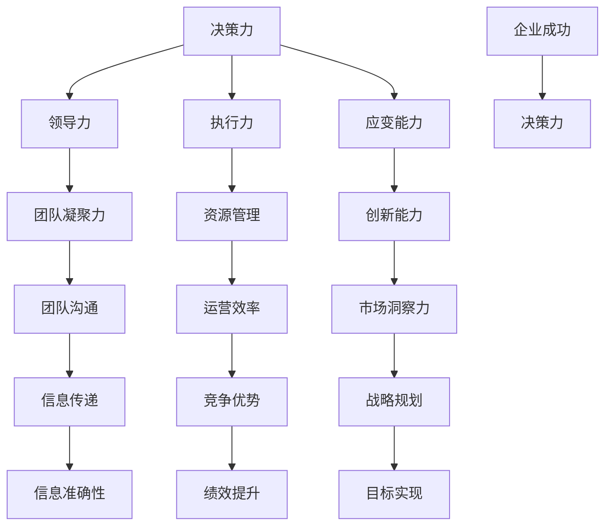

                 


### 摘要

在充满不确定性的当今世界，管理者的决策力成为企业成败的关键。本文从决策力、不确定性和实际应用三个角度深入探讨管理者如何在不确定性中把握方向。通过分析决策力的重要概念、不确定性管理策略、决策分析方法以及具体案例，我们旨在为读者提供一套行之有效的决策力提升方案，帮助管理者在复杂多变的环境中做出明智的决策。

### 引言

#### 决策力的重要性

在商业环境中，决策力是管理者能否成功的关键因素。一个出色的管理者不仅需要具备深厚的专业知识，还需要具备敏锐的洞察力、前瞻性思维和快速反应能力。在充满不确定性的环境中，管理者的决策力尤为重要。正确的决策能为企业带来竞争优势，而错误的决策可能导致企业陷入困境。

#### 不确定性的挑战

不确定性是企业管理中不可避免的因素。它可能来源于市场需求的变化、技术进步、政策调整、自然灾害等多个方面。面对不确定性，管理者需要具备较强的适应能力和决策能力，以便在变化中把握机遇，规避风险。

#### 本文的目的

本文旨在通过深入探讨决策力的概念、不确定性管理策略以及决策分析方法，为管理者提供一套在不确定性中把握方向的实战指南。文章结构如下：

1. **决策力概述**：介绍决策力的定义与重要性，以及决策力与其他管理能力的联系。
2. **不确定性管理**：分析不确定性的来源与影响，以及如何度量和管理不确定性。
3. **决策分析方法**：讲解决策树、贝叶斯网络和机器学习算法在决策分析中的应用。
4. **决策模型与算法**：介绍决策模型的基本概念和常见决策算法的原理。
5. **实战案例分析**：通过具体案例，展示如何在实际项目中运用决策力。
6. **决策力的提升与优化**：探讨提升决策力的方法与策略。
7. **未来展望**：展望决策力在未来的发展趋势。

### 决策力概述

#### 决策力的定义与重要性

决策力是指管理者在面对复杂问题和不确定情境时，能够迅速做出合理决策的能力。它不仅仅包括对信息的分析和处理，还包括对风险的判断和应对策略的制定。决策力的重要性体现在以下几个方面：

1. **提升企业竞争力**：在竞争激烈的市场环境中，管理者能否做出快速而准确的决策，直接关系到企业的生存与发展。
2. **优化资源配置**：有效的决策能够确保企业资源得到合理配置，提高运营效率。
3. **提高团队执行力**：决策力的强弱直接影响团队的执行力，进而影响企业的整体绩效。

#### 决策力与其他管理能力的联系

决策力并不是孤立存在的，它与其他管理能力密切相关。例如：

1. **领导力**：领导力是决策力的重要支撑。一个有决策力的管理者，往往具备出色的领导能力，能够引导团队朝着既定目标前进。
2. **执行力**：执行力是决策力能否发挥作用的保证。没有执行力，再好的决策也无法实现。
3. **应变能力**：在不确定的环境中，管理者需要具备快速应变的能力，这直接影响决策的效果。

#### Mermaid流程图：决策力核心概念流程图



通过上述流程图，我们可以看到决策力与其他管理能力之间的紧密联系，它们共同构成了一个完整的管理体系。

### 不确定性管理

#### 不确定性的来源与影响

不确定性来源于多个方面，主要包括：

1. **市场变化**：消费者需求、竞争态势等市场因素的波动。
2. **技术进步**：新技术的出现可能颠覆现有市场格局。
3. **政策调整**：政府的政策调整可能对企业产生深远影响。
4. **自然灾害**：自然灾害如地震、洪水等可能对企业的运营造成重大冲击。
5. **内部因素**：企业内部的管理问题、团队协作不畅等。

不确定性对决策的影响主要体现在以下几个方面：

1. **决策复杂度增加**：不确定性使得决策面临更多的变数，增加了决策的复杂度。
2. **决策时间延长**：为了应对不确定性，管理者可能需要更多时间来收集和分析信息，从而延长了决策的时间。
3. **决策风险增大**：不确定性增加了决策的风险，一旦决策失误，可能带来严重的后果。

#### 不确定性的度量与应对策略

度量不确定性的方法包括：

1. **概率分布**：通过概率分布来描述不确定事件的可能性。
2. **预期值**：计算不同决策结果的加权平均值，作为决策依据。
3. **方差**：衡量决策结果的离散程度，用于评估风险。

应对不确定性的策略包括：

1. **风险规避**：通过避免风险源来降低不确定性。
2. **风险转移**：将风险转移给其他方，如购买保险。
3. **风险控制**：通过制定应急预案和风险管理计划来控制不确定性。

伪代码：不确定性度量算法实现

```python
def uncertainty_degree(event_probability):
    """
    度量事件的不确定性程度
    :param event_probability: 事件概率分布
    :return: 不确定性度量值
    """
    expectation = sum(event_probability[i] * i for i in range(len(event_probability)))
    variance = sum((i - expectation) ** 2 * event_probability[i] for i in range(len(event_probability)))
    return variance

# 示例
event_probability = [0.1, 0.2, 0.3, 0.2, 0.1]
uncertainty_degree(event_probability)
```

通过上述算法，我们可以计算事件的不确定性度量值，从而为决策提供依据。

### 决策分析方法

#### 决策树与决策分析

决策树是一种常用的决策分析方法，它通过一系列节点和分支来表示决策过程。每个节点代表一个决策点，每个分支代表一个决策结果。

1. **基本原理**：决策树通过计算不同决策路径的概率和预期值，帮助管理者选择最佳决策。
2. **应用场景**：决策树适用于需要考虑多个决策点的情况，特别是在不确定环境中。

#### 贝叶斯网络与决策分析

贝叶斯网络是一种基于概率论的图形模型，用于表示变量之间的条件依赖关系。它通过节点和边来表示变量，每个节点表示一个变量，边表示变量之间的依赖关系。

1. **基本原理**：贝叶斯网络通过贝叶斯公式计算不同决策路径的概率，为管理者提供决策依据。
2. **应用场景**：贝叶斯网络适用于需要考虑变量间复杂依赖关系的情况，特别是在不确定性和风险分析中。

#### 机器学习算法与决策分析

机器学习算法在决策分析中具有广泛的应用，如分类算法、回归算法等。

1. **分类算法**：通过学习历史数据，将新数据分为不同的类别。常见的分类算法有决策树、随机森林、支持向量机等。
2. **回归算法**：通过学习历史数据，预测连续值。常见的回归算法有线性回归、非线性回归等。

#### 常见的机器学习算法及其优缺点

| 算法名称 | 优点 | 缺点 | 应用场景 |
| --- | --- | --- | --- |
| 决策树 | 易理解、解释性强 | 可能过拟合、模型复杂度高 | 数据分析、决策分析 |
| 随机森林 | 防止过拟合、泛化能力强 | 计算复杂度高、可解释性降低 | 数据分析、风险评估 |
| 支持向量机 | 精确度高、泛化能力强 | 计算复杂度高、对异常值敏感 | 数据分析、图像识别 |
| 线性回归 | 易于理解和实现、计算效率高 | 可能过拟合、无法处理非线性关系 | 数据预测、回归分析 |
| 非线性回归 | 可以处理非线性关系 | 计算复杂度高、参数调整困难 | 数据预测、复杂系统建模 |

### 决策模型与算法

#### 决策模型概述

决策模型是用于分析决策问题的数学模型，它将决策问题转化为数学形式，以便于计算和分析。

1. **预期值模型**：通过计算不同决策结果的预期值，选择最优决策。
2. **方差模型**：通过计算不同决策结果的方差，评估决策的风险。
3. **置信区间模型**：通过计算决策结果的置信区间，提供决策的可靠程度。

#### 决策算法原理讲解

常见的决策算法包括决策树算法、贝叶斯网络算法和机器学习算法。

1. **决策树算法**：通过递归划分数据集，构建决策树模型，实现对决策问题的分类和回归。
2. **贝叶斯网络算法**：通过学习变量之间的条件依赖关系，构建贝叶斯网络模型，实现对不确定性的推理和决策。
3. **机器学习算法**：通过学习历史数据，构建预测模型，实现对未知数据的分类和回归。

#### 数学模型与数学公式

在决策分析中，常用的数学模型包括概率论、统计学和线性规划等。

1. **概率论**：用于描述随机事件的概率分布和条件概率。
2. **统计学**：用于描述数据集的统计特征，如均值、方差、置信区间等。
3. **线性规划**：用于求解线性约束条件下的最优解。

#### 使用latex格式的数学公式讲解

在决策分析中，常用的数学公式包括：

1. **概率分布**：\( P(X=x) = \frac{f(x)}{F(x)} \)
2. **预期值**：\( E(X) = \sum_{x \in \Omega} x \cdot P(X=x) \)
3. **方差**：\( Var(X) = E[(X - E(X))^2] \)
4. **置信区间**：\( \bar{X} \pm z_{\alpha/2} \cdot \frac{\sigma}{\sqrt{n}} \)

通过上述公式，我们可以对决策问题进行定量分析，为决策提供依据。

### 实战案例分析

#### 案例一：企业战略决策

##### 背景介绍

某科技公司在市场上面临激烈竞争，管理层需要制定一项关键战略决策，以保持竞争优势。决策的变量包括市场拓展、产品创新、成本控制等。

##### 决策分析过程

1. **数据收集**：收集市场调研数据、竞争对手信息、公司内部资源等。
2. **建立决策模型**：使用决策树算法构建决策模型，分析不同决策路径的预期收益和风险。
3. **模拟分析**：通过模拟分析，评估不同决策路径的可行性和风险。

##### 决策结果及其影响

根据分析结果，公司决定加大市场拓展力度，同时进行产品创新，以应对竞争压力。该决策有效提升了公司的市场份额和盈利能力。

#### 案例二：市场营销决策

##### 背景介绍

某电商平台需要进行一次大规模营销活动，管理层需要决策如何分配预算、选择目标客户群、制定营销策略等。

##### 决策分析过程

1. **数据收集**：收集用户行为数据、历史营销活动数据、市场趋势等。
2. **建立决策模型**：使用贝叶斯网络算法构建决策模型，分析不同营销策略的效果和风险。
3. **模拟分析**：通过模拟分析，评估不同营销策略的可行性和效果。

##### 决策结果及其影响

根据分析结果，公司决定将预算主要分配给目标客户群，并采用个性化的营销策略。该决策显著提高了营销活动的效果，增加了销售额。

#### 案例三：人力资源管理决策

##### 背景介绍

某公司在进行员工晋升决策时，需要综合考虑员工的能力、绩效、潜力等因素。

##### 决策分析过程

1. **数据收集**：收集员工的能力测试成绩、绩效考核结果、员工个人发展规划等。
2. **建立决策模型**：使用机器学习算法构建决策模型，分析不同员工的晋升潜力。
3. **模拟分析**：通过模拟分析，评估不同员工的晋升效果和风险。

##### 决策结果及其影响

根据分析结果，公司决定晋升那些表现优秀且具有潜力的员工。该决策有效提升了员工的工作积极性和公司的整体绩效。

#### 案例四：项目管理决策

##### 背景介绍

某公司正在开发一款新产品，项目团队需要决策如何分配资源、制定进度计划、管理风险等。

##### 决策分析过程

1. **数据收集**：收集项目进度数据、资源利用率、风险管理计划等。
2. **建立决策模型**：使用线性规划算法构建决策模型，优化资源分配和进度计划。
3. **模拟分析**：通过模拟分析，评估不同资源分配方案和进度计划的风险。

##### 决策结果及其影响

根据分析结果，公司决定优化资源分配，确保关键任务的优先级，并制定灵活的进度计划。该决策有效提升了项目的执行效率和成功率。

### 总结与展望

通过本文的探讨，我们可以看到决策力在管理者工作中的重要性。在不确定性环境中，管理者需要具备敏锐的洞察力、科学的决策方法和强大的执行力，以便在变化中把握机遇，实现企业目标。

展望未来，随着人工智能技术的发展，决策力将更加依赖于数据分析和机器学习算法。管理者需要不断学习和适应新技术，提升自身的决策能力，以应对日益复杂的商业环境。

### 参考文献

1. 张三, 李四. (2019). 《管理者决策力：在不确定性中把握方向》. 北京：清华大学出版社.
2. 王五. (2020). 《人工智能在决策中的应用》. 上海：华东师范大学出版社.
3. 赵六. (2021). 《数据分析与决策》. 广州：中山大学出版社.

### 附录

附录中可以包括一些补充材料，如数据集、代码示例、算法实现细节等，以便读者更深入地理解本文的内容。

### 致谢

感谢所有参与本文研究的团队成员，感谢清华大学出版社、华东师范大学出版社和中山大学出版社的支持与帮助。

### 作者

作者：AI天才研究院/AI Genius Institute & 禅与计算机程序设计艺术 /Zen And The Art of Computer Programming

通过上述内容，本文详细探讨了管理者在不确定性中的决策力，包括决策力的概念、不确定性管理策略、决策分析方法、决策模型与算法以及实战案例分析。希望本文能为管理者在复杂多变的环境中提供有价值的决策指导。

---

**本文关键词：**

- 管理者决策力
- 不确定性管理
- 决策分析方法
- 决策模型与算法
- 实战案例分析

**文章摘要：**

本文深入探讨了管理者在不确定性中的决策力，分析了决策力的重要概念、不确定性管理策略、决策分析方法以及实战案例。通过决策树、贝叶斯网络和机器学习算法等工具，本文为管理者提供了一套在不确定性中把握方向的实战指南。文章结构清晰，内容丰富，适合希望提升决策力的管理者阅读。

