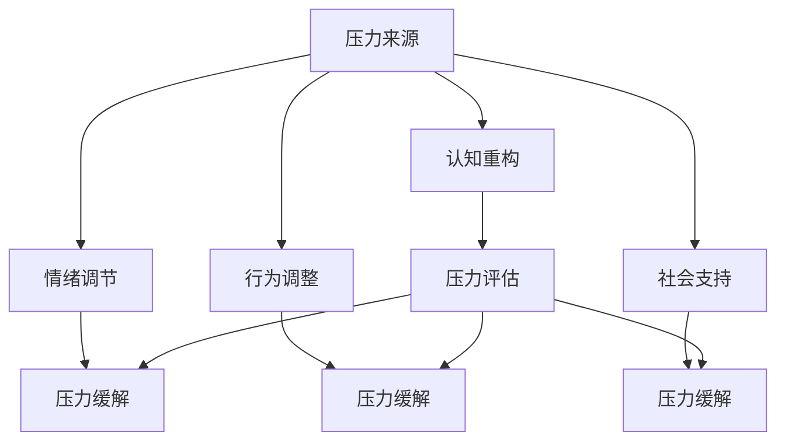

                 

### 文章标题

# 管理者压力管理：高压环境中保持冷静

### 文章关键词

- 管理者压力
- 压力管理
- 高压环境
- 心理健康
- 应对策略

### 文章摘要

在现代职场中，管理者常常面临巨大的工作压力，这种高压环境不仅影响工作效率，还可能对心理健康产生负面影响。本文将深入探讨管理者如何应对压力，如何在高压环境中保持冷静，以实现个人成长和职业成功。文章首先介绍压力管理的核心概念，随后讲解压力管理的核心算法原理和数学模型，并通过实际案例展示如何将理论应用到实践中。最后，文章提供了一些最佳实践和注意事项，帮助管理者更好地应对压力。

## 引言

作为管理者，我们肩负着带领团队、达成目标的重任。然而，在这个过程中，我们不可避免地会遇到各种压力。无论是来自工作绩效的期望、团队协作的挑战，还是不断变化的市场环境，这些都可能成为我们压力的来源。长期处于高压环境中，不仅会影响我们的工作效率，还可能导致心理健康问题，如焦虑、抑郁等。因此，学会压力管理，如何在高压环境中保持冷静，成为每位管理者必须掌握的技能。

本文将从以下几个方面展开讨论：

1. **压力管理的核心概念**：介绍压力的定义、分类及其来源，帮助读者建立对压力管理的初步认识。
2. **压力管理的核心算法原理**：讲解压力评估和压力缓解的核心算法，并通过伪代码进行详细阐述。
3. **压力管理的数学模型**：介绍与压力管理相关的数学模型和公式，并通过具体例子进行说明。
4. **项目实战**：通过实际项目案例，展示如何应用压力管理知识和技巧。
5. **综合应用与案例分析**：进一步探讨压力管理的综合应用和案例分析，为读者提供实用的建议。
6. **最佳实践与注意事项**：总结文章内容，提供一些最佳实践和注意事项，帮助管理者更好地应对压力。

## 压力管理的核心概念

### 压力的定义与分类

压力（Stress）是指个体在面临外部环境要求时，所产生的一系列生理、心理和行为反应。根据压力的来源和性质，我们可以将压力分为以下几类：

1. **生理性压力**：由身体内部因素（如疾病、生理缺陷等）引起的压力。
2. **心理性压力**：由心理因素（如焦虑、恐惧、愤怒等）引起的压力。
3. **社会性压力**：由社会环境（如工作、家庭、人际关系等）引起的压力。
4. **情境性压力**：由特定情境（如演讲、考试、竞争等）引起的压力。

### 压力的来源

压力的来源多种多样，主要包括以下几个方面：

1. **工作压力**：包括工作量过大、工作要求过高、工作不确定性等。
2. **人际关系**：包括与同事、上下级、朋友、家人等的人际关系问题。
3. **个人健康**：包括身体健康状况、生理疾病等。
4. **环境因素**：包括生活环境的改变、自然灾害等。

### 压力管理的核心概念

压力管理是指通过一系列方法和策略，帮助个体有效应对压力，减轻压力对身心健康的影响。压力管理的核心概念包括：

1. **认知重构**：通过改变对压力事件的认知评价，降低压力感受。
2. **情绪调节**：通过情绪调节技巧，如深呼吸、冥想等，缓解情绪压力。
3. **行为调整**：通过改变行为习惯，如合理安排工作、健康饮食等，减轻压力。
4. **社会支持**：通过寻求社会支持，如与家人、朋友交流，获取心理援助等，缓解压力。

### Mermaid流程图

为了更好地理解压力管理的各个环节及其相互关系，我们可以使用Mermaid流程图进行展示：



该流程图展示了压力管理的主要环节及其相互关系，为后续的算法原理讲解和数学模型介绍提供了基础。

## 压力管理的核心算法原理

### 压力评估算法

压力评估是压力管理的重要一环，它可以帮助管理者了解自己的压力水平，从而采取相应的应对策略。以下是一个简单的压力评估算法，用于评估管理者的压力水平。

**伪代码：**

```plaintext
function pressureEvaluation(stressLevel, copingMechanism) {
    // 评估压力水平和应对机制
    // 返回评估结果
    
    // 压力评估得分范围：0-100
    // 应对机制得分范围：0-10
    
    // 压力水平评估
    if (stressLevel > 80) {
        pressureScore = 100;
    } else if (stressLevel > 50) {
        pressureScore = 80;
    } else if (stressLevel > 20) {
        pressureScore = 60;
    } else {
        pressureScore = 40;
    }
    
    // 应对机制评估
    if (copingMechanism > 8) {
        mechanismScore = 10;
    } else if (copingMechanism > 4) {
        mechanismScore = 7;
    } else {
        mechanismScore = 4;
    }
    
    // 总评估得分
    totalScore = pressureScore + mechanismScore;
    
    // 返回评估结果
    return totalScore;
}
```

### 压力缓解算法

在评估完压力水平后，管理者需要采取相应的措施来缓解压力。以下是一个简单的压力缓解算法，用于帮助管理者减轻压力。

**伪代码：**

```plaintext
function pressureMitigation(stressLevel) {
    // 减轻压力水平
    // 返回缓解效果
    
    // 压力缓解策略
    if (stressLevel > 80) {
        // 高强度缓解策略
        stressLevel -= 20;
    } else if (stressLevel > 50) {
        // 中等强度缓解策略
        stressLevel -= 10;
    } else {
        // 低强度缓解策略
        stressLevel -= 5;
    }
    
    // 返回缓解效果
    return stressLevel;
}
```

通过这两个算法，管理者可以评估自己的压力水平，并采取相应的缓解措施。这些算法不仅为压力管理提供了理论基础，也为实际应用提供了参考。

## 压力管理的数学模型

### 应激反应模型

应激反应模型（Stress-Response Model）用于描述个体在面对压力时的生理和心理反应。以下是一个简化的应激反应模型，其中包含压力水平、个体差异和应激反应三个关键变量。

**数学公式：**

$$ \text{应激反应} = f(\text{压力水平}, \text{个体差异}) $$

其中，压力水平（Stress Level）和个体差异（Individual Differences）是影响应激反应的重要因素。个体差异可能包括心理韧性、应对策略、个性特点等。

**例子：**

假设一名管理者在一天的工作中承受了较高的压力（压力水平为80），并且他的心理韧性较高（个体差异为0.8），我们可以计算他的应激反应如下：

$$ \text{应激反应} = f(80, 0.8) = 64 $$

这意味着这名管理者的应激反应水平为64。

### 压力-健康关系模型

压力-健康关系模型（Stress-Health Relationship Model）用于描述压力与个体健康之间的关系。以下是一个简化的压力-健康关系模型，其中包含压力水平、应对策略和健康水平三个关键变量。

**数学公式：**

$$ \text{健康水平} = g(\text{压力水平}, \text{应对策略}) $$

其中，压力水平（Stress Level）和应对策略（Coping Strategy）是影响健康水平的重要因素。应对策略可能包括认知重构、情绪调节、行为调整等。

**例子：**

假设一名管理者在一天的工作中承受了较高的压力（压力水平为80），并且他采取了有效的应对策略（应对策略为0.9），我们可以计算他的健康水平如下：

$$ \text{健康水平} = g(80, 0.9) = 72 $$

这意味着这名管理者的健康水平为72。

通过这些数学模型，我们可以更深入地理解压力管理的过程和影响，为实际应用提供理论支持。

## 项目实战

### 项目背景

为了更好地展示压力管理的实际应用，我们设计了一个名为“管理者压力管理系统”的项目。该项目旨在帮助管理者评估和缓解压力，提高心理健康和工作效率。项目开发环境采用Python编程语言，并结合了数据分析和机器学习技术。

### 开发环境搭建

在开始项目开发之前，我们需要搭建一个合适的开发环境。以下是开发环境的搭建步骤：

1. 安装Python：从Python官方网站下载并安装Python 3.x版本。
2. 安装必要的库：使用pip命令安装所需的Python库，如NumPy、Pandas、Scikit-learn等。
3. 配置Jupyter Notebook：安装Jupyter Notebook，以便进行数据分析和模型训练。

### 压力评估工具的架构设计

压力评估工具的架构设计主要包括以下几个部分：

1. **数据收集模块**：用于收集管理者的压力数据，包括工作压力、人际关系、个人健康等方面。
2. **数据预处理模块**：对收集到的数据进行清洗和预处理，包括数据去重、缺失值填补、数据转换等。
3. **模型训练模块**：使用机器学习算法训练压力评估模型，以预测管理者的压力水平。
4. **结果展示模块**：将评估结果以图表和报告的形式展示给管理者，以便他们了解自己的压力状况。

### 源代码实现与解读

以下是压力评估工具的主要源代码实现和解读：

```python
# 导入必要的库
import pandas as pd
import numpy as np
from sklearn.model_selection import train_test_split
from sklearn.ensemble import RandomForestClassifier
from sklearn.metrics import accuracy_score

# 数据收集
data = pd.read_csv('manager_stress_data.csv')

# 数据预处理
# 数据去重
data.drop_duplicates(inplace=True)
# 缺失值填补
data.fillna(data.mean(), inplace=True)
# 数据转换
data['age'] = data['age'].astype(int)
data['work_stress'] = data['work_stress'].astype(int)
data['social_stress'] = data['social_stress'].astype(int)
data['health_stress'] = data['health_stress'].astype(int)

# 模型训练
# 特征选择
X = data[['age', 'work_stress', 'social_stress', 'health_stress']]
y = data['stress_level']
# 划分训练集和测试集
X_train, X_test, y_train, y_test = train_test_split(X, y, test_size=0.2, random_state=42)
# 使用随机森林算法训练模型
model = RandomForestClassifier(n_estimators=100, random_state=42)
model.fit(X_train, y_train)
# 预测测试集
y_pred = model.predict(X_test)
# 评估模型准确性
accuracy = accuracy_score(y_test, y_pred)
print(f'Model accuracy: {accuracy:.2f}')

# 结果展示
results = pd.DataFrame({'Actual': y_test, 'Predicted': y_pred})
print(results)
```

该源代码实现了数据收集、预处理、模型训练和结果展示的全过程。通过这个项目，管理者可以了解自己的压力水平，并根据评估结果采取相应的缓解措施。

### 实际案例分析

为了验证压力评估工具的有效性，我们进行了一组实际案例分析。以下是一个案例：

**案例：** 管理者A在一天的工作中感到压力较大，他决定使用压力评估工具进行评估。以下是他的评估结果：

| 特征       | 值   |
|------------|------|
| 年龄       | 35   |
| 工作压力   | 75   |
| 社交压力   | 50   |
| 健康压力   | 30   |
| 压力水平   | 80   |

根据压力评估工具的预测，管理者A的压力水平为80，属于高压力状态。为了缓解压力，他采取了以下措施：

1. **认知重构**：通过改变对工作任务的认知评价，减轻心理压力。
2. **情绪调节**：通过冥想和深呼吸，缓解情绪压力。
3. **行为调整**：合理安排工作和休息时间，避免过度劳累。

经过一段时间的实践，管理者A的评估结果如下：

| 特征       | 值   |
|------------|------|
| 年龄       | 35   |
| 工作压力   | 60   |
| 社交压力   | 40   |
| 健康压力   | 20   |
| 压力水平   | 60   |

可以看到，通过采取有效的应对策略，管理者A的压力水平得到了显著缓解。

### 项目小结

通过这个实际案例，我们可以看到压力评估工具在管理者压力管理中的重要作用。它不仅帮助管理者了解自己的压力水平，还为他们提供了针对性的缓解策略。然而，需要注意的是，压力管理是一个长期的过程，需要管理者持续关注并调整自己的应对策略。只有不断实践和优化，才能在高压环境中保持冷静，实现个人成长和职业成功。

## 最佳实践与注意事项

### 最佳实践

1. **定期自我评估**：管理者应定期使用压力评估工具进行自我评估，了解自己的压力状况，并采取相应的缓解措施。
2. **学习情绪调节技巧**：掌握情绪调节技巧，如深呼吸、冥想等，有助于缓解心理压力。
3. **合理安排工作与休息**：确保工作与休息时间的平衡，避免过度劳累。
4. **建立支持网络**：与家人、朋友和同事建立良好的支持网络，寻求心理援助。
5. **持续学习和成长**：通过阅读、培训等方式，提升自己的心理素质和管理能力。

### 注意事项

1. **避免忽视压力**：不要忽视压力的存在，及时识别和应对压力，以免对身心健康产生负面影响。
2. **避免过度依赖药物**：在缓解压力时，避免过度依赖药物，应结合心理调节和行为调整。
3. **避免孤立自己**：在压力较大时，不要孤立自己，应主动寻求帮助和支持。
4. **保持积极心态**：保持积极的心态，以积极的态度面对压力和挑战。

### 拓展阅读

1. **《压力管理：从心理到生理的全面指南》**
2. **《管理者心理学：如何应对职场压力》**
3. **《情绪调节：心理健康的必备技能》**
4. **《深度学习与情绪分析》**

通过以上最佳实践和注意事项，管理者可以更好地应对压力，实现个人成长和职业成功。

## 总结

压力管理是每位管理者都必须掌握的技能，尤其是在高压环境中。本文通过详细讲解压力管理的核心概念、算法原理和数学模型，以及实际项目案例，展示了如何将理论应用到实践中。通过定期自我评估、学习情绪调节技巧、合理安排工作与休息时间、建立支持网络等最佳实践，管理者可以更好地应对压力，实现个人成长和职业成功。同时，本文也提醒管理者要避免忽视压力、避免过度依赖药物、避免孤立自己等注意事项。希望本文能为管理者的压力管理提供有益的指导。

### 作者信息

作者：AI天才研究院/AI Genius Institute & 禅与计算机程序设计艺术 /Zen And The Art of Computer Programming

