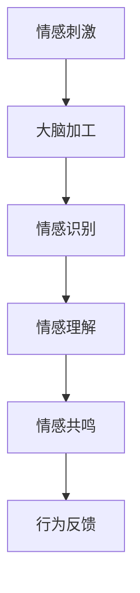
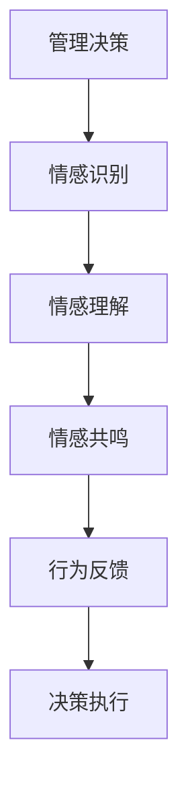
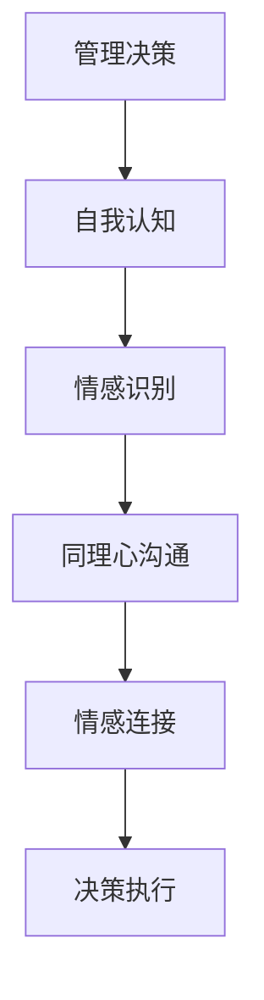
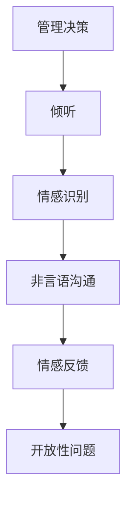
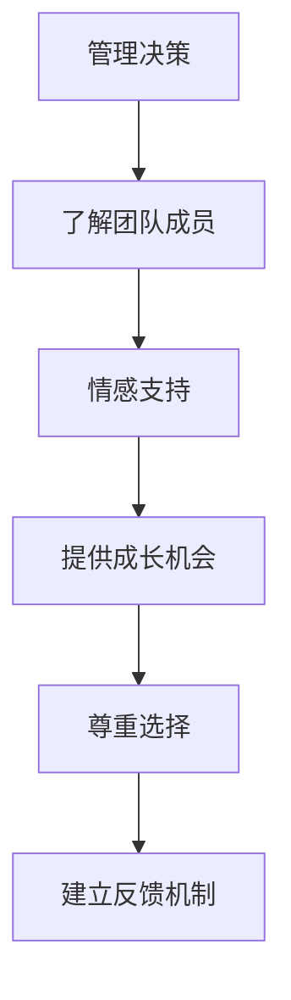
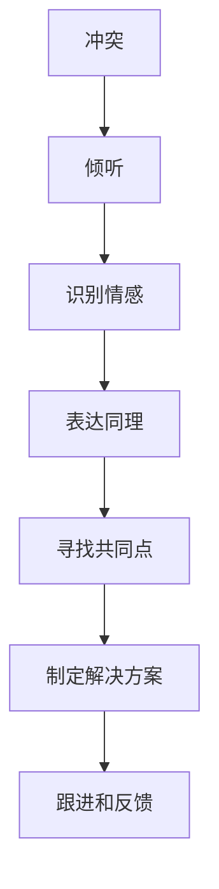
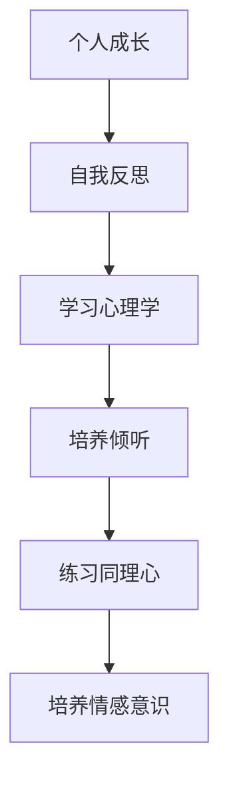
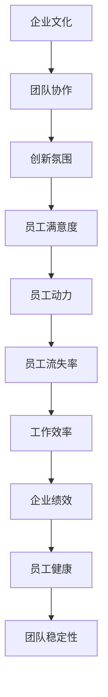
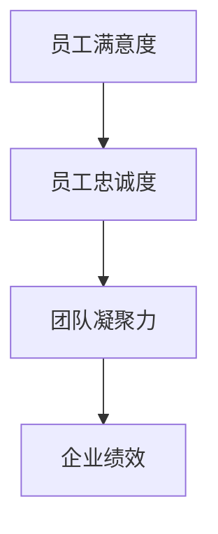

                 

# 管理者同理心：理解并激励团队的艺术

> 关键词：同理心、团队管理、激励、情商（EQ）、领导力、沟通技巧、冲突解决、个人成长

> 摘要：本文将探讨管理者同理心在团队管理中的应用，包括其定义、重要性、核心原理、应用策略和实际案例。通过深入理解同理心，管理者可以更有效地激励团队成员，提升团队凝聚力和工作效率。

## 前言

在现代社会，团队合作已成为实现项目成功的关键。而作为团队的领导者，管理者在团队中扮演着至关重要的角色。他们不仅要具备出色的技术能力，还需要拥有深厚的人际交往技能，特别是同理心。同理心是一种能够理解并感受他人情感状态的能力，对于管理者来说，它是建立高效团队、激发员工潜力、解决团队冲突的关键。

本文将从以下几个方面展开讨论：

1. **同理心的定义与重要性**：介绍同理心的概念及其在团队管理中的重要性。
2. **同理心的核心原理**：探讨同理心的心理学基础、情商（EQ）的关系以及测量方法。
3. **同理心在团队管理中的应用**：分析同理心在领导力、团队沟通、团队激励和解决冲突中的作用。
4. **同理心与个人成长**：探讨同理心对个人成长的影响以及提升同理心的策略。
5. **同理心的长期效益**：讨论同理心对企业文化、员工满意度和工作效率的积极影响。
6. **同理心在工作场所的推广**：提供推广同理心的策略和长期影响。

通过本文的探讨，希望能够帮助管理者更好地理解同理心，并将其应用于团队管理中，以实现团队的高效运作。

## 第一部分：同理心基础

### 第1章：同理心的定义与重要性

#### 1.1 同理心：理解他人的情感状态

同理心（Empathy）是一种心理能力，它使我们能够理解并感受他人的情感状态。具体来说，同理心包括认知同理心（Cognitive Empathy）和情感同理心（Affective Empathy）。认知同理心指的是理解他人情感状态的能力，而情感同理心则是能够感受到他人情感状态并产生共鸣的能力。

在团队管理中，同理心具有重要作用。管理者通过同理心能够更好地理解团队成员的需求和情感，从而在决策时更加贴近团队成员的利益，提高团队的整体满意度和工作效率。以下是同理心在团队管理中的一些关键作用：

1. **提升沟通效果**：同理心有助于管理者更好地理解团队成员的表达，从而更有效地沟通和传达信息。
2. **增强团队凝聚力**：同理心能够增强团队成员之间的信任和归属感，提高团队的凝聚力。
3. **激发员工潜力**：同理心使管理者能够更好地了解团队成员的优势和潜力，从而提供更有针对性的激励和支持。
4. **解决冲突**：同理心有助于管理者在冲突中采取更加公正和合理的解决方案，减少误解和矛盾。

#### 1.2 同理心的重要性：对团队管理的启示

同理心不仅是一种人际交往能力，更是管理者必备的素质。一个具备同理心的管理者能够更好地应对团队中的各种挑战，提高团队的绩效和员工的满意度。以下是同理心在团队管理中的几个重要启示：

1. **关注员工需求**：同理心使管理者能够更加关注团队成员的需求和情感，从而更好地满足他们的期望。
2. **提升决策质量**：同理心有助于管理者在决策时考虑团队成员的观点和感受，提高决策的合理性和可接受性。
3. **培养领导力**：同理心是领导力的核心组成部分，一个具备同理心的管理者能够更好地引领团队走向成功。
4. **建立信任关系**：同理心能够增强管理者与团队成员之间的信任，提高团队的协作效率和创新能力。

总之，同理心是团队管理中不可或缺的一部分。管理者通过提升同理心，能够更好地理解团队成员，提升团队绩效，实现团队的长期发展。在下一章中，我们将进一步探讨同理心的核心原理。

### 第2章：同理心的核心原理

#### 2.1 同理心的心理学基础

同理心作为心理学中的一个重要概念，其理论基础涉及多个心理学分支，包括社会心理学、认知心理学和发展心理学等。以下是对同理心心理学基础的一些详细解释：

1. **社会心理学视角**：社会心理学家认为，同理心是一种社会认知过程，它涉及对他人情感状态的理解和情感共鸣。例如，社会心理学家Tibbetts和Wrosch（2011）研究表明，同理心可以促进团队合作，因为团队成员之间能够更好地理解和支持彼此。

2. **认知心理学视角**：认知心理学家关注同理心的认知过程，如认知神经科学家Preston和Deonna（2010）发现，同理心涉及大脑中特定的神经网络，这些神经网络在情感识别、情感推理和情感共享中起关键作用。

3. **发展心理学视角**：发展心理学家研究同理心的形成和发展过程。例如，Piaget（1952）认为，同理心是儿童社会性发展的重要标志，它随着儿童认知能力的发展而逐步增强。

#### 2.2 同理心与情商（EQ）的关系

情商（Emotional Intelligence Quotient，EQ）是另一个在管理领域受到广泛关注的概念。情商包括情感识别、情感管理、自我激励、社交技能和同理心等五个关键要素。同理心作为情商的核心组成部分，对管理者的表现有着重要影响。

1. **情感识别**：同理心有助于管理者更好地识别和理解团队成员的情感状态，从而在沟通和决策中更加灵活和有效。

2. **情感管理**：同理心使管理者能够更好地管理自己的情感，以便在团队中创造一个积极、健康的工作氛围。

3. **自我激励**：同理心有助于管理者激励自己，以更高的热情和动力面对团队管理的挑战。

4. **社交技能**：同理心是社交技能的重要组成部分，它使管理者能够更好地建立和维护与团队成员之间的信任和合作关系。

5. **同理心**：同理心是情商的最高表现形式，它使管理者能够更深入地理解和感受他人的情感，从而在团队管理中取得更好的成果。

#### 2.3 同理心的测量与评估方法

测量和评估同理心是理解和应用同理心的关键步骤。以下是一些常用的测量与评估方法：

1. **自我评估问卷**：例如，Rosenberg的同理心量表（Rosenberg Self-Esteem Scale）和Tangney等人的同理心问卷（Tangney, Duff, & Miller，2007）。

2. **行为观察法**：通过观察管理者的行为，评估其在日常工作中展现的同理心。例如，可以使用替代性观察量表（Alternative Behavior Observation Scale）。

3. **情境模拟法**：设计特定的情境，让管理者在模拟环境中展示其同理心。这种方法可以更真实地评估管理者的同理心水平。

4. **反馈法**：通过团队成员的反馈，评估管理者在团队中展现的同理心。这种方法有助于了解管理者在团队中的实际表现。

通过以上方法，管理者可以更全面地了解自己的同理心水平，从而有针对性地提升自己的同理心技能。在下一章中，我们将探讨同理心在团队管理中的具体应用。

### 第3章：同理心的Mermaid流程图

#### 3.1 同理心的内在机制

同理心的内在机制是理解他人情感状态并产生共鸣的过程。这个过程中涉及多个环节，包括情感识别、情感理解和情感共鸣。以下是一个简化的同理心内在机制Mermaid流程图：

**A[情感刺激]**：情感刺激是同理心的起点，可能是他人的表情、声音或者其他非言语信息。

**B[大脑加工]**：大脑对情感刺激进行加工，这是情感识别和理解的前提。

**C[情感识别]**：通过大脑加工，管理者能够识别他人的情感状态。

**D[情感理解]**：情感理解是同理心的核心，管理者需要深入理解他人的情感状态。

**E[情感共鸣]**：情感共鸣是指管理者能够感受到他人的情感，并与他人产生情感上的共鸣。

**F[行为反馈]**：行为反馈是同理心机制的最后一步，管理者通过行为表现来回应他人的情感状态。

#### 3.2 同理心在管理决策中的应用

同理心在管理决策中的应用主要体现在以下几个方面：

1. **情感识别**：管理者通过同理心能够更好地识别团队成员的情感状态，从而在决策时考虑这些情感因素。

2. **情感理解**：同理心使管理者能够深入理解团队成员的情感需求，从而制定更符合团队利益的决策。

3. **情感共鸣**：管理者通过同理心能够与团队成员产生情感共鸣，增强决策的可接受性和执行力度。

4. **行为反馈**：管理者通过同理心能够及时给予团队成员情感反馈，增强团队的凝聚力。

以下是一个基于同理心的管理决策Mermaid流程图：

**A[管理决策]**：这是同理心在管理决策中的起点，管理者需要做出决策。

**B[情感识别]**：管理者通过同理心识别团队成员的情感状态。

**C[情感理解]**：管理者深入理解团队成员的情感需求。

**D[情感共鸣]**：管理者与团队成员产生情感共鸣。

**E[行为反馈]**：管理者通过行为反馈来回应团队成员的情感状态。

**F[决策执行]**：最终，管理者将决策付诸执行。

通过同理心，管理者能够在决策过程中更加全面地考虑团队成员的情感因素，从而做出更符合团队利益和成员需求的决策。在下一章中，我们将进一步探讨同理心在团队管理中的应用。

## 第二部分：同理心在团队管理中的应用

### 第4章：同理心与领导力

#### 4.1 同理心领导力的特点

同理心领导力是一种基于同理心的领导风格，它强调领导者与团队成员之间的情感连接和理解。这种领导力具有以下特点：

1. **关注团队成员的需求**：同理心领导力关注团队成员的情感和需求，领导者能够通过同理心深入理解团队成员的困境和挑战。

2. **有效的沟通**：同理心领导力强调开放和真诚的沟通，领导者通过同理心能够更好地理解团队成员的表达，并给予及时的反馈。

3. **激发员工的潜力**：同理心领导力能够激发员工的潜力，领导者通过同理心能够发现团队成员的优势和潜力，并提供有针对性的激励和支持。

4. **建立信任关系**：同理心领导力能够增强领导者与团队成员之间的信任，通过同理心，领导者能够更好地理解和支持团队成员，从而建立深厚的信任关系。

#### 4.2 培养同理心领导力的方法

要培养同理心领导力，管理者可以从以下几个方面入手：

1. **增强自我认知**：管理者需要了解自己的情感状态和需求，这是培养同理心的重要基础。

2. **提高情感识别能力**：管理者可以通过学习心理学知识，提高对他人情感状态的识别能力。

3. **实践同理心沟通**：管理者在日常工作中，需要通过同理心进行沟通，这包括倾听、理解和支持团队成员。

4. **建立情感连接**：管理者可以通过参与团队活动、关注团队成员的生活等途径，建立与团队成员的情感连接。

5. **反思和改进**：管理者需要定期反思自己在团队管理中的行为，识别不足之处，并采取改进措施。

以下是一个基于同理心领导力的管理决策Mermaid流程图：

**A[管理决策]**：这是同理心领导力在管理决策中的起点。

**B[自我认知]**：管理者通过自我认知，了解自己的情感状态和需求。

**C[情感识别]**：管理者识别团队成员的情感状态。

**D[同理心沟通]**：管理者通过同理心进行沟通，理解团队成员的需求。

**E[情感连接]**：管理者与团队成员建立情感连接。

**F[决策执行]**：最终，管理者将决策付诸执行。

通过同理心领导力，管理者能够在决策过程中充分考虑团队成员的情感因素，提高决策的合理性和可接受性。在下一章中，我们将探讨同理心在团队沟通中的作用。

### 第5章：同理心与团队沟通

#### 5.1 同理心在沟通中的作用

同理心在团队沟通中起着至关重要的作用。一个具备同理心的管理者能够更好地理解团队成员的表达，并给予恰当的回应。以下是同理心在团队沟通中的几个关键作用：

1. **提升沟通效果**：同理心使管理者能够更准确地理解团队成员的意图和情感，从而提高沟通的有效性。

2. **减少误解**：同理心有助于管理者在沟通中避免误解和冲突，因为管理者能够从他人的角度理解信息。

3. **增强信任**：同理心能够增强团队成员之间的信任，通过理解和支持，团队成员更加愿意开放和分享。

4. **改善团队氛围**：同理心能够营造一个积极、健康的团队氛围，团队成员感到被尊重和关心。

#### 5.2 提高同理心沟通技巧的策略

为了提高同理心沟通技巧，管理者可以采取以下策略：

1. **倾听**：管理者需要学会倾听，不仅仅是听到团队成员说什么，更重要的是理解他们的情感和需求。

2. **情感识别**：管理者可以通过学习心理学知识，提高对他人情感状态的识别能力，从而更好地理解团队成员。

3. **非言语沟通**：同理心沟通不仅包括言语，还包括非言语信号，如肢体语言、面部表情和语调等。

4. **情感反馈**：管理者可以通过情感反馈来回应团队成员的情感状态，增强沟通的效果。

5. **开放性问题**：管理者可以通过提出开放性问题，鼓励团队成员分享他们的想法和感受。

以下是一个基于同理心沟通的管理决策Mermaid流程图：

**A[管理决策]**：这是同理心沟通在管理决策中的起点。

**B[倾听]**：管理者通过倾听理解团队成员的意图和情感。

**C[情感识别]**：管理者识别团队成员的情感状态。

**D[非言语沟通]**：管理者通过非言语信号进行沟通。

**E[情感反馈]**：管理者回应团队成员的情感状态。

**F[开放性问题]**：管理者鼓励团队成员分享想法和感受。

通过同理心沟通，管理者能够在决策过程中更好地理解团队成员，提高决策的合理性和可接受性。在下一章中，我们将探讨同理心在团队激励中的作用。

### 第6章：同理心与团队激励

#### 6.1 同理心激励的原理

同理心激励是一种基于同理心的激励方法，它强调领导者通过理解和支持团队成员来激发他们的潜力。以下是同理心激励的几个关键原理：

1. **情感共鸣**：同理心激励通过情感共鸣，使领导者能够更好地理解团队成员的情感状态，从而提供更有针对性的激励。

2. **个性化激励**：同理心激励强调根据每个团队成员的个性、需求和潜力来制定激励策略，从而使激励更加有效。

3. **增强归属感**：同理心激励能够增强团队成员的归属感，通过理解和支持，团队成员感到被重视和关心。

4. **促进自主性**：同理心激励鼓励团队成员自主地制定目标和计划，从而提高他们的工作动力和责任感。

#### 6.2 通过同理心激励团队成员的实践

要有效地通过同理心激励团队成员，管理者可以采取以下实践策略：

1. **了解团队成员**：管理者需要花时间了解团队成员的背景、兴趣和需求，从而制定个性化的激励计划。

2. **情感支持**：管理者可以通过情感支持，如鼓励和赞扬，来激励团队成员，增强他们的自信心和动力。

3. **提供成长机会**：同理心激励还包括为团队成员提供成长和发展的机会，如培训、项目机会和晋升机会。

4. **尊重团队成员的选择**：管理者需要尊重团队成员的选择，给予他们自主决策的权利，从而提高他们的工作积极性和满意度。

5. **建立反馈机制**：管理者需要建立反馈机制，及时了解团队成员的工作进展和情感状态，从而进行有效的激励和调整。

以下是一个基于同理心激励的管理决策Mermaid流程图：

**A[管理决策]**：这是同理心激励在管理决策中的起点。

**B[了解团队成员]**：管理者了解团队成员的背景、兴趣和需求。

**C[情感支持]**：管理者通过情感支持激励团队成员。

**D[提供成长机会]**：管理者为团队成员提供成长和发展的机会。

**E[尊重选择]**：管理者尊重团队成员的选择，给予自主决策的权利。

**F[建立反馈机制]**：管理者建立反馈机制，及时了解团队成员的工作进展和情感状态。

通过同理心激励，管理者能够更好地激发团队成员的潜力，提高团队的整体绩效和满意度。在下一章中，我们将探讨同理心在解决冲突中的应用。

### 第7章：同理心与解决冲突

#### 7.1 同理心解决冲突的优势

同理心在解决冲突中具有显著的优势，它能够帮助管理者更有效地处理团队内部的矛盾和问题。以下是同理心解决冲突的几个主要优势：

1. **减少误解**：同理心使管理者能够更好地理解冲突双方的立场和情感，从而减少误解和误判。

2. **增强沟通**：同理心有助于建立开放的沟通渠道，使冲突双方能够更坦诚地表达自己的观点和感受。

3. **促进和解**：同理心能够促进冲突双方的和解，通过理解对方的情感和需求，找到共同点，达成共识。

4. **提高团队凝聚力**：同理心解决冲突有助于增强团队成员之间的信任和尊重，提高团队的凝聚力。

#### 7.2 同理心在冲突解决中的具体步骤

管理者可以通过以下步骤，利用同理心来有效解决冲突：

1. **倾听**：首先，管理者需要耐心倾听冲突双方的观点和感受，确保每个人都有机会表达自己。

2. **识别情感**：管理者需要识别冲突双方的情感状态，理解他们的情绪和情感需求。

3. **表达同理**：管理者需要通过语言和非言语方式，表达对冲突双方的理解和支持，建立情感共鸣。

4. **寻找共同点**：管理者需要寻找冲突双方的共同点，找到解决问题的基本共识。

5. **制定解决方案**：在理解双方的立场和情感后，管理者可以与双方共同制定解决方案，确保方案符合双方的利益和期望。

6. **跟进和反馈**：管理者需要跟进冲突解决的进展，收集反馈，确保解决方案的有效性和可持续性。

以下是一个基于同理心的冲突解决Mermaid流程图：

**A[冲突]**：这是同理心在冲突解决中的起点。

**B[倾听]**：管理者倾听冲突双方的观点和感受。

**C[识别情感]**：管理者识别冲突双方的情感状态。

**D[表达同理]**：管理者通过语言和非言语方式表达对双方的理解和支持。

**E[寻找共同点]**：管理者寻找冲突双方的共同点。

**F[制定解决方案]**：管理者与双方共同制定解决方案。

**G[跟进和反馈]**：管理者跟进冲突解决的进展，收集反馈。

通过同理心的冲突解决方法，管理者能够更好地处理团队内部的矛盾和问题，维护团队的和谐与稳定。在下一章中，我们将通过实际案例进一步探讨同理心在团队管理中的应用。

### 第8章：同理心案例分析

#### 8.1 案例一：同理心在团队建设中的应用

在一个高科技企业中，团队管理者张先生通过同理心来建设高效团队。张先生首先了解团队成员的背景和兴趣，发现团队中的李女士对编程技能有着深厚的热情，而王先生则对项目管理充满兴趣。基于这一了解，张先生为李女士安排了更多的编程挑战项目，并为王先生提供了项目管理培训。

张先生还通过定期的一对一交流，倾听团队成员的意见和感受，理解他们在工作中的困惑和压力。在一次团队活动中，张先生发现团队成员对于团队氛围的改善有着共同的需求。于是，张先生组织了一次团队建设活动，通过团队合作游戏和团队讨论，增强了团队成员之间的信任和合作。

通过同理心，张先生不仅提升了团队的整体绩效，还营造了一个积极、健康的工作氛围，团队成员之间的沟通更加顺畅，合作更加紧密。

#### 8.2 案例二：同理心在团队激励中的成功实践

在一家互联网公司，团队管理者李女士通过同理心来激励团队成员。李女士了解到团队成员张先生在家庭生活中承担了较多的责任，因此他在工作上的投入有限。李女士通过同理心，与张先生进行深入的交流，了解他的家庭情况和需求。

李女士不仅在工作上给予张先生更多的支持，如调整他的工作时间和任务分配，还提供了额外的培训机会，帮助他提升专业技能。此外，李女士还鼓励张先生参与公司的一些创新项目，让他在工作中找到更大的成就感。

通过同理心的激励，张先生的工作热情得到了极大的提升，他在项目中的表现也得到了团队的认可。李女士的成功实践不仅提高了张先生的工作效率，也增强了团队的整体凝聚力。

### 第9章：同理心与个人成长

#### 9.1 同理心对个人成长的影响

同理心不仅对团队管理有重要作用，也对个人的成长和发展有着深远的影响。以下是一些同理心对个人成长的积极影响：

1. **增强情感智慧**：同理心使个体能够更好地识别和理解他人的情感状态，从而提高情感智慧，增强人际交往能力。

2. **提升沟通技巧**：同理心有助于个体在沟通中更加敏感和细腻，提高沟通的有效性，减少误解和冲突。

3. **增强自我认知**：同理心使个体能够更好地认识自己的情感需求，从而提升自我认知，促进个人成长。

4. **提高情商**：同理心是情商的核心组成部分，通过提升同理心，个体能够更好地管理自己的情感，提高情商。

5. **促进人际关系**：同理心能够增强个体与家人、朋友和同事之间的情感连接，建立更加和谐的人际关系。

#### 9.2 提升同理心的个人成长策略

为了提升同理心，个体可以采取以下策略：

1. **自我反思**：定期进行自我反思，了解自己的情感状态和需求，从而更好地理解他人的情感。

2. **学习心理学知识**：学习心理学知识，提高对他人情感状态的理解和识别能力。

3. **培养倾听习惯**：在日常沟通中，培养倾听他人意见和感受的习惯，避免打断或评判。

4. **练习同理心**：通过角色扮演或情景模拟，练习如何在不同的情境中展现同理心。

5. **培养情感意识**：关注自己的情感变化，学会在情感高潮和低谷时保持冷静和理智。

以下是一个基于同理心的个人成长Mermaid流程图：

**A[个人成长]**：这是个人成长在同理心培养中的起点。

**B[自我反思]**：个体进行自我反思，了解自己的情感状态和需求。

**C[学习心理学]**：个体学习心理学知识，提高对他人情感状态的理解和识别能力。

**D[培养倾听]**：个体在沟通中培养倾听他人意见和感受的习惯。

**E[练习同理心]**：个体通过角色扮演或情景模拟，练习同理心。

**F[培养情感意识]**：个体关注自己的情感变化，学会在情感高潮和低谷时保持冷静和理智。

通过同理心的培养，个体能够更好地理解他人，提升人际交往能力和情商，促进个人成长。在下一章中，我们将讨论同理心的长期效益。

### 第10章：同理心的长期效益

#### 10.1 同理心对企业文化的塑造

同理心对企业文化的塑造具有深远的影响。一个具备同理心的企业文化能够促进团队协作、创新和员工满意度的提升。以下是同理心对企业文化塑造的几个方面：

1. **促进团队协作**：同理心使团队成员之间更加理解和支持，促进协作和合作，从而提高团队的整体绩效。

2. **增强创新氛围**：同理心鼓励团队成员分享自己的想法和观点，从而创造一个开放和创新的工作环境。

3. **提高员工满意度**：同理心使员工感到被重视和关心，从而提高他们的工作满意度和忠诚度。

4. **建立信任**：同理心能够增强员工对企业的信任，促进企业内部的良好沟通和合作。

#### 10.2 同理心对员工满意度和工作效率的积极影响

同理心对员工满意度和工作效率有着显著的积极影响。以下是同理心在这两方面的具体作用：

1. **提高员工满意度**：同理心使员工感到被理解和关心，从而提高他们的工作满意度和幸福感。

2. **增强工作动力**：同理心能够激发员工的工作动力，使他们更加投入和专注。

3. **减少员工流失**：同理心能够减少员工流失率，因为员工在一个具备同理心的企业中感到更加安心和归属。

4. **提高工作效率**：同理心能够促进团队成员之间的协作和沟通，从而提高工作效率和项目成功率。

#### 10.3 同理心在工作场所的长期影响

同理心在工作场所的长期影响是多方面的，包括企业绩效、员工健康和团队稳定性。以下是同理心在工作场所的长期影响的几个方面：

1. **企业绩效提升**：同理心能够促进团队协作和创新能力，从而提高企业的整体绩效和竞争力。

2. **员工健康改善**：同理心能够减少员工的工作压力和焦虑，改善他们的心理健康。

3. **团队稳定性增强**：同理心能够增强团队的凝聚力，减少内部冲突和矛盾，从而提高团队的稳定性。

以下是一个基于同理心在工作场所长期影响的Mermaid流程图：

**A[企业文化]**：同理心对企业文化的塑造。

**B[团队协作]**：同理心促进团队协作。

**C[创新氛围]**：同理心增强创新氛围。

**D[员工满意度]**：同理心提高员工满意度。

**E[员工动力]**：同理心增强员工动力。

**F[员工流失率]**：同理心减少员工流失率。

**G[工作效率]**：同理心提高工作效率。

**H[企业绩效]**：同理心提升企业绩效。

**I[员工健康]**：同理心改善员工健康。

**J[团队稳定性]**：同理心增强团队稳定性。

通过同理心的培养和应用，企业能够在长期内实现绩效提升、员工健康改善和团队稳定性增强，从而实现可持续发展。

### 第11章：同理心在工作场所的推广

#### 11.1 推广同理心的策略

要成功推广同理心在工作场所，企业需要采取一系列策略。以下是几个关键策略：

1. **领导层倡导**：企业领导层需要率先实践同理心，通过言行示范，树立榜样。

2. **培训与教育**：企业可以通过培训和教育，提高员工对同理心的认识和技能。

3. **文化建设**：企业需要建立一种鼓励同理心的文化，使同理心成为企业价值观的一部分。

4. **反馈机制**：企业应建立反馈机制，鼓励员工分享同理心实践的经验和成果。

5. **激励政策**：企业可以通过激励政策，如奖金、晋升等，鼓励员工实践和提升同理心。

#### 11.2 同理心在工作场所的长期影响

同理心在工作场所的长期影响是深远的，它不仅能够提升员工的满意度和工作效率，还能够增强企业的绩效和竞争力。以下是同理心在工作场所的长期影响：

1. **员工满意度提高**：同理心使员工感到被重视和关心，从而提高他们的工作满意度和幸福感。

2. **员工忠诚度增强**：同理心能够增强员工对企业的忠诚度，减少员工流失。

3. **团队凝聚力提升**：同理心能够增强团队成员之间的信任和合作，提高团队的凝聚力。

4. **企业绩效提升**：同理心促进团队协作和创新，从而提高企业的整体绩效和竞争力。

以下是一个基于同理心在工作场所长期影响的Mermaid流程图：

**A[员工满意度]**：同理心提高员工满意度。

**B[员工忠诚度]**：同理心增强员工忠诚度。

**C[团队凝聚力]**：同理心提升团队凝聚力。

**D[企业绩效]**：同理心提升企业绩效。

通过推广同理心，企业能够创造一个积极、健康的工作环境，提升员工的满意度和工作效率，从而实现企业的长期发展。

## 结论

同理心是管理者在团队管理中不可或缺的重要素质。通过同理心，管理者能够更好地理解团队成员的情感和需求，提高沟通和决策的质量，激励团队成员，解决团队冲突，促进个人成长和企业发展。本文从多个角度探讨了同理心的定义、核心原理、应用策略以及长期效益，为管理者提供了一套系统的同理心管理框架。

为了进一步提升同理心，管理者可以采取以下建议：

1. **自我反思**：定期进行自我反思，了解自己的情感状态和需求。
2. **学习心理学**：学习心理学知识，提高对他人情感状态的理解和识别能力。
3. **倾听与理解**：在日常工作中，注重倾听和理解团队成员的意见和感受。
4. **实践同理心**：通过角色扮演或情景模拟，练习同理心的应用。
5. **建立反馈机制**：鼓励团队成员分享同理心实践的经验和成果，建立反馈机制。

通过不断实践和提升同理心，管理者能够更有效地管理团队，实现个人和企业的共同发展。

### 附录A：同理心相关的资源和工具

#### A.1 心理学资源介绍

1. **《同理心：如何理解他人》（"Empathy: A Handbook for Revolutionaries" by Roman Krznaric）**：这是一本介绍同理心概念和应用的经典书籍，适合管理者了解同理心的理论基础。

2. **《情商：为什么情商比智商更重要》（"Emotional Intelligence" by Daniel Goleman）**：这本书详细介绍了情商的概念及其对管理的影响，同理心是情商的核心组成部分。

#### A.2 领导力发展工具推荐

1. **《同理心领导力发展工作坊》（"Empathy Leadership Development Workshop"）**：这是一个专门针对领导力的工作坊，帮助管理者提升同理心沟通和领导力。

2. **《同理心领导力在线课程》（"Empathy Leadership Online Course"）**：这是一系列在线课程，涵盖同理心领导力的各个方面，适合希望提升同理心的管理者。

#### A.3 同理心培训资源推荐

1. **《同理心培训课程》（"Empathy Training Program"）**：这是一套系统性培训课程，包括理论讲解、实践练习和反馈机制，适合企业内部推广同理心。

2. **《同理心实践指南》（"Empathy Practice Guide"）**：这是一个实践指南，提供具体的同理心实践方法和策略，帮助管理者在实际工作中应用同理心。

通过这些资源和工具，管理者可以更全面地了解和提升同理心，为团队管理带来积极的影响。

### 作者信息

**作者：AI天才研究院/AI Genius Institute & 禅与计算机程序设计艺术 /Zen And The Art of Computer Programming**

本文由AI天才研究院和禅与计算机程序设计艺术共同撰写，旨在为管理者提供关于同理心在团队管理中的应用和实践指南。我们致力于通过先进的AI技术和深入的人文思考，帮助企业和个人实现可持续的发展和创新。

