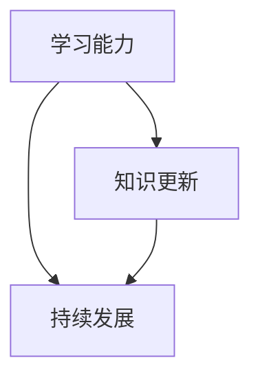

                 

### 《管理者学习能力：保持知识更新的持续发展》

#### 关键词：
- 管理者学习
- 知识更新
- 持续发展
- 终身学习
- 自我反思

#### 摘要：
在当今快速变化的技术和商业环境中，管理者需要不断更新知识和技能，以保持竞争优势和推动组织发展。本文将探讨管理者学习的重要性，分析学习能力的核心概念，并提供一系列方法和实践，帮助管理者有效提升学习能力和知识更新能力，实现个人和职业的持续发展。

----------------------------------------------------------------

### 引言

在当今信息化和全球化的时代，知识和信息的更新速度前所未有的快。无论是技术领域，还是商业管理，新概念、新工具、新方法层出不穷。对于管理者而言，保持学习能力和知识更新的能力，不仅是个人发展的需要，更是组织持续发展的关键。然而，随着知识量的不断膨胀，管理者面临着信息过载和知识更新的挑战。

本文旨在探讨管理者学习的重要性，分析学习能力的核心概念，并提供一系列方法和实践，帮助管理者有效提升学习能力和知识更新能力，实现个人和职业的持续发展。

本文将分为以下几个部分：

1. **核心概念**：介绍管理学习能力和知识更新的定义及其关系。
2. **理论框架**：探讨管理学习能力的理论基础，包括终身学习的理念、自我反思和持续学习的策略。
3. **知识更新机制**：讨论管理者如何获取、筛选和评估新知识。
4. **方法与实践**：具体分析管理者如何提升学习能力和知识更新能力，包括利用网络资源、时间管理和阅读策略。
5. **应用与案例**：探讨管理者如何在实际工作中应用学习成果，包括领导力提升、团队管理和个人成长。
6. **总结与展望**：总结全文内容，并展望未来管理者学习能力的趋势和发展方向。

通过本文的阅读，希望管理者能够更好地理解学习的重要性和方法，不断提升自身的学习能力，实现知识更新的持续发展。

----------------------------------------------------------------

### 核心概念

在探讨管理者学习能力之前，我们需要明确几个核心概念：学习能力、知识更新和持续发展。

#### 学习能力

学习能力是指个体获取、理解、应用和更新知识的能力。它不仅包括传统的认知学习，还涵盖技能学习、行为学习和情感学习。对于管理者而言，学习能力尤为重要，因为管理者需要不断学习新的管理理念、工具和技术，以应对快速变化的市场环境。

#### 知识更新

知识更新是指个体或组织持续获取新的知识和信息，并将其应用到实际工作中的过程。在快速变化的环境中，知识更新是管理者保持竞争力和适应能力的关键。知识更新的过程包括信息获取、筛选、评估和应用。

#### 持续发展

持续发展是指个体或组织在长期内保持稳定、可持续的发展。对于管理者而言，持续发展意味着不仅要在短期内有显著的成绩，还要在长期内保持学习和进步，以适应不断变化的环境。

#### 学习能力与知识更新的关系

学习能力是知识更新的基础，没有良好的学习能力，管理者难以有效更新知识。同时，知识更新也是学习能力的体现，通过不断更新知识，管理者能够提高自身的能力和竞争力。

为了更好地理解这三个核心概念之间的关系，我们可以使用Mermaid流程图来展示它们之间的联系：



在这个流程图中，学习能力是知识更新的基础，知识更新是持续发展的关键，而持续发展则是学习能力和知识更新的最终目标。

通过明确这些核心概念，管理者可以更好地理解学习的重要性和方法，从而在复杂多变的环境中保持竞争优势。

----------------------------------------------------------------

### 管理学习能力的理论框架

探讨管理者学习能力的提升，离不开对其理论框架的深入分析。终身学习的理念、自我反思和持续学习的策略构成了管理学习能力提升的理论基础。

#### 终身学习的理念

终身学习是指个体在其一生中不断学习、更新知识和技能的过程。这一理念在管理者学习能力提升中具有重要地位，因为管理领域的变化速度非常快，新技术、新方法、新理念不断涌现，管理者必须具备持续学习的能力，才能跟上时代的步伐。

**主要观点**：

1. **适应变化**：终身学习能够帮助管理者适应不断变化的环境，提高应对挑战的能力。
2. **提升竞争力**：通过持续学习，管理者可以不断提升自身的专业能力和领导力，从而在竞争激烈的市场中脱颖而出。
3. **促进创新**：终身学习鼓励管理者探索新的知识和方法，从而推动组织的创新和发展。

**实践建议**：

- 制定个人学习计划，确保定期学习和自我提升。
- 参加专业培训和研讨会，与同行交流最新管理理念和实践。
- 利用在线学习资源，如MOOCs（大型开放在线课程）和e-learning平台，灵活安排学习时间。

#### 自我反思

自我反思是指管理者通过深入思考自己的行为、决策和成果，从中吸取经验教训，以提升自身的管理水平。自我反思是管理学习能力的重要组成部分，因为它能够帮助管理者识别自身的优点和不足，从而有针对性地进行改进。

**主要观点**：

1. **提高自我认知**：自我反思有助于管理者深入了解自己的行为模式、思维方式和价值观，从而提高自我认知。
2. **促进持续改进**：通过自我反思，管理者可以发现并解决工作中的问题，不断改进管理方法，提高工作效率。
3. **增强决策能力**：自我反思能够帮助管理者从过去的决策中学习，提高未来决策的科学性和有效性。

**实践建议**：

- 定期进行自我反思，记录自己的行为、思考和成果。
- 借助工具和框架，如SWOT分析（优势、劣势、机会、威胁）和PDCA循环（计划、执行、检查、行动），进行系统化的自我反思。
- 与同事和下属进行定期交流，获取反馈，了解自己的工作表现和影响。

#### 持续学习策略

持续学习策略是指管理者采取的一系列具体行动，以不断提升自身的知识和技能。这些策略包括但不限于以下几种：

1. **阅读**：阅读是获取新知识的重要途径。管理者应定期阅读专业书籍、研究报告和行业资讯，以保持对最新理论和实践的掌握。

2. **实践**：理论知识需要通过实践来验证和应用。管理者应积极参与实际工作，将所学知识应用到具体场景中，从而提高实践能力和解决问题的能力。

3. **网络学习**：利用网络资源，如在线课程、论坛和社交媒体，管理者可以随时随地获取新的知识和见解，与他人交流学习经验。

4. **跨学科学习**：管理者应具备跨学科的知识结构，这不仅有助于拓宽视野，还能为解决复杂问题提供多样化的思路和方法。

**主要观点**：

- **知识整合**：通过持续学习，管理者能够整合不同领域的知识，形成综合性的思维方式，从而在复杂问题中找到最佳解决方案。
- **灵活适应**：持续学习能够使管理者具备快速适应新环境和应对变化的能力，提高管理效率和效果。
- **创新能力**：持续学习不仅能够提高管理者的专业知识，还能激发创新思维，推动组织的创新发展。

**实践建议**：

- 建立个人学习档案，记录学习内容和成果。
- 制定学习目标和计划，确保学习的系统性和持续性。
- 创造学习氛围，鼓励团队成员共同学习、分享和成长。

通过终身学习的理念、自我反思和持续学习策略，管理者可以不断提升自己的学习能力，实现知识的有效更新，为个人和组织的持续发展奠定坚实基础。

----------------------------------------------------------------

### 知识更新机制

在快速变化的环境中，管理者需要具备高效的知识更新机制，以确保能够及时获取和应用新的知识和信息。知识更新机制包括获取新知识、筛选和评估信息、以及将新知识应用到实际工作中。

#### 获取新知识

获取新知识是知识更新机制的第一步，也是最重要的一步。管理者可以通过多种途径获取新知识，包括：

1. **阅读**：定期阅读专业书籍、研究报告、行业资讯和博客，是获取新知识的重要途径。通过阅读，管理者可以了解最新的管理理念、工具和技术，从而保持对行业动态的敏锐感知。

2. **培训**：参加专业培训和研讨会，可以帮助管理者快速掌握新的知识和技能。这些培训通常由行业专家或学术机构提供，具有很高的实用性和针对性。

3. **网络资源**：利用网络资源，如在线课程、学术论文库和行业论坛，管理者可以随时随地获取新的知识和见解。网络资源具有更新快、信息量大的特点，非常适合管理者进行持续学习。

4. **实践**：通过实际工作，管理者可以将理论知识应用到具体场景中，从而获得实践经验和新的知识。实践是最好的学习方式，管理者应积极参与实际工作，从中积累经验和知识。

#### 筛选和评估信息

获取新知识后，管理者需要对这些信息进行筛选和评估，以确保获取到的信息是高质量的、有用的。以下是一些筛选和评估信息的策略：

1. **信息质量评估**：管理者应学会评估信息来源的可靠性、内容的准确性和权威性。可以通过以下标准进行评估：

   - **来源可靠性**：信息来源是否权威、可信，是否有丰富的行业背景和经验。
   - **内容准确性**：信息内容是否准确、完整，是否提供了足够的证据和论据。
   - **权威性**：信息提供者是否具有专业背景和学术地位，是否得到同行的认可。

2. **信息筛选**：管理者应学会从大量信息中筛选出最有价值的信息，避免陷入信息过载。可以通过以下方法进行筛选：

   - **关键词搜索**：使用关键词搜索相关信息，可以快速定位到感兴趣的主题。
   - **信息过滤**：利用信息过滤工具，如RSS订阅和智能推荐系统，自动筛选出高质量的信息。
   - **同行推荐**：借鉴同行的推荐和评价，可以快速找到有价值的信息。

3. **批判性思维**：管理者应培养批判性思维，对获取到的信息进行独立思考和分析，避免盲目接受。可以通过以下方法进行批判性思维：

   - **质疑假设**：对信息的假设和前提进行质疑，确保其逻辑性和合理性。
   - **证据核查**：对信息中的证据进行核查，确保其可靠性和有效性。
   - **综合分析**：将不同信息进行综合分析，从中找出矛盾和问题，形成独立见解。

#### 应用新知识

将新知识应用到实际工作中是知识更新机制的最后一步，也是最重要的一步。以下是一些将新知识应用到实际工作的策略：

1. **实践应用**：将新知识应用到实际工作中，通过实践来验证和改进。实践是最好的学习方式，通过实际应用，管理者可以更好地理解新知识的内涵和实际效果。

2. **知识分享**：将学习成果分享给团队成员，促进知识的传递和共享。通过分享，管理者不仅可以帮助团队成员提升知识水平，还可以从团队成员的反馈中获得新的见解和灵感。

3. **案例研究**：通过案例研究，分析成功和失败的管理实践，从中总结经验和教训，形成新的知识和方法。

4. **持续改进**：将新知识纳入到持续改进的过程中，不断优化管理实践。管理者应定期评估管理实践的效果，找出不足之处，并利用新知识进行改进。

通过以上方法，管理者可以建立起高效的知识更新机制，确保能够及时获取和应用新的知识和信息，从而在快速变化的环境中保持竞争优势。

----------------------------------------------------------------

### 方法与实践

在了解了管理学习能力和知识更新的理论框架和机制之后，接下来我们将探讨具体的方法和实践，帮助管理者在实际工作中提升学习能力和知识更新能力。

#### 利用网络资源

在当今信息爆炸的时代，网络资源成为了管理者获取新知识和信息的重要途径。以下是一些利用网络资源的策略：

1. **在线学习平台**：利用在线学习平台，如Coursera、edX、Udemy等，管理者可以随时随地学习新的课程和知识。这些平台提供了大量的专业课程，涵盖了各个领域的最新理论和实践。

   **示例**：
   ```python
   # 使用Python编写代码，自动搜索在线课程
   import requests
   from bs4 import BeautifulSoup

   def search_courses(topic):
       url = f'https://www.coursera.org/courses?query={topic}'
       response = requests.get(url)
       soup = BeautifulSoup(response.text, 'html.parser')
       courses = soup.find_all('div', {'class': 'course-listing'})
       for course in courses:
           title = course.find('h3').text
           link = course.find('a')['href']
           print(f"Course Title: {title}")
           print(f"Link: {link}")
           print()

   # 搜索“数据科学”相关课程
   search_courses("数据科学")
   ```

2. **专业论坛和博客**：参与专业论坛和博客，如Stack Overflow、LinkedIn和专业领域的技术博客，管理者可以与行业专家和同行进行交流和讨论，获取最新的行业动态和技术趋势。

   **示例**：
   ```python
   # 使用Python编写代码，搜索LinkedIn上的技术讨论
   import requests
   from bs4 import BeautifulSoup

   def search_linkedin_topics(topic):
       url = f'https://www.linkedin.com/search/results/all/?keywords={topic}&origin=FACETED_SEARCH'
       response = requests.get(url)
       soup = BeautifulSoup(response.text, 'html.parser')
       topics = soup.find_all('a', {'class': 'pv-entity__school-name'})
       for topic in topics:
           title = topic.text
           link = topic['href']
           print(f"Topic: {title}")
           print(f"Link: {link}")
           print()

   # 搜索“人工智能”相关讨论
   search_linkedin_topics("人工智能")
   ```

#### 时间管理

时间管理是提升学习效率和知识更新能力的关键。以下是一些时间管理的策略：

1. **制定学习计划**：管理者应制定详细的学习计划，包括每天的学习时间和学习内容，以确保学习的系统性和持续性。

   **示例**：
   ```python
   # 使用Python编写代码，生成学习计划
   import datetime

   def create_learning_plan(start_date, end_date, daily_hours, topics):
       current_date = start_date
       while current_date <= end_date:
           print(f"{current_date}: {topics[current_date.weekday() - 1]} - {daily_hours}小时")
           current_date += datetime.timedelta(days=1)

   # 生成一个为期30天的学习计划
   create_learning_plan(datetime.datetime(2023, 10, 1), datetime.datetime(2023, 10, 30), 2, ["数据分析", "机器学习", "项目管理", "领导力"])
   ```

2. **优先级排序**：管理者应学会对学习任务进行优先级排序，将重要和紧急的任务放在首位，确保关键任务得到及时处理。

   **示例**：
   ```python
   # 使用Python编写代码，对任务进行优先级排序
   from operator import itemgetter

   tasks = [
       {'name': '编写报告', 'priority': 3},
       {'name': '参加培训', 'priority': 1},
       {'name': '处理客户需求', 'priority': 2},
       {'name': '学习新技术', 'priority': 4}
   ]

   # 按优先级排序
   sorted_tasks = sorted(tasks, key=itemgetter('priority'), reverse=True)
   for task in sorted_tasks:
       print(f"任务：{task['name']} - 优先级：{task['priority']}")
   ```

#### 阅读策略

阅读是管理者获取新知识和信息的重要途径。以下是一些阅读策略：

1. **深度阅读**：深度阅读是指投入更多的时间和精力，深入理解和消化阅读内容。深度阅读能够帮助管理者更好地掌握复杂的概念和理论。

   **示例**：
   ```python
   # 使用Python编写代码，模拟深度阅读过程
   import time

   def deep_read(content, minutes=30):
       start_time = time.time()
       print(f"开始深度阅读：{content}")
       time.sleep(minutes * 60)  # 模拟阅读时间
       end_time = time.time()
       print(f"深度阅读完成，用时：{end_time - start_time}秒")
   
   # 模拟阅读一本专业书籍
   deep_read("《深度学习》", minutes=30)
   ```

2. **快速阅读**：快速阅读是指以较高的速度浏览文本，重点抓住关键信息和主旨。快速阅读适合管理者在短时间内获取大量信息。

   **示例**：
   ```python
   # 使用Python编写代码，模拟快速阅读过程
   import time

   def quick_read(content, minutes=10):
       start_time = time.time()
       print(f"开始快速阅读：{content}")
       time.sleep(minutes * 60)  # 模拟阅读时间
       end_time = time.time()
       print(f"快速阅读完成，用时：{end_time - start_time}秒")
   
   # 模拟阅读一篇行业报告
   quick_read("《2023年人工智能行业报告》", minutes=10)
   ```

通过利用网络资源、时间管理和阅读策略，管理者可以更高效地提升学习能力和知识更新能力，为个人和组织的持续发展奠定坚实基础。

----------------------------------------------------------------

### 应用与案例

在实际工作中，管理者如何将学习成果应用到领导力提升、团队管理和个人成长中，是决定其学习能力和知识更新能力是否真正发挥作用的关键。以下将探讨具体的应用案例，并提供实战经验分享。

#### 领导力提升

**案例1：** 一家大型科技公司的CTO通过参加人工智能领域的在线课程，学习了最新的机器学习和深度学习技术。他将这些新技术应用到公司的产品开发中，推出了一系列具有竞争力的新产品，显著提升了公司的市场份额和品牌影响力。

**实战经验分享：**

1. **领导力培养**：CTO通过分享自己的学习心得和成功案例，激发了团队对新技术的好奇心和热情，培养了团队成员的领导力。
2. **技术培训**：CTO组织了一系列技术培训，帮助团队成员掌握新技能，提高了团队的整体技术水平。
3. **创新氛围**：CTO鼓励团队成员大胆尝试和实验，为创新提供资源和支持，营造了积极向上的创新氛围。

#### 团队管理

**案例2：** 一家初创企业的CEO通过参加领导力和团队管理课程，学习了如何有效管理多元化团队的方法。他运用所学的知识，优化了团队的组织结构，提升了团队的协作效率和创新能力。

**实战经验分享：**

1. **团队建设**：CEO通过团队建设活动，增强了团队成员之间的信任和合作，提高了团队的整体凝聚力。
2. **绩效评估**：CEO引入了基于绩效的评估机制，激励团队成员发挥潜力，实现个人和团队的目标。
3. **沟通机制**：CEO建立了定期的团队沟通机制，确保团队成员能够及时了解公司的战略和目标，增强了团队的协作和执行力。

#### 个人成长

**案例3：** 一家金融服务公司的CFO通过参加财务管理课程，学习了最新的财务分析和风险管理方法。他将这些新方法应用到公司的财务管理和投资决策中，显著提升了公司的财务状况和投资回报。

**实战经验分享：**

1. **自我提升**：CFO通过持续学习和实践，不断提升自身的专业能力和领导力，实现了个人成长和职业发展。
2. **知识共享**：CFO定期与团队成员分享自己的学习成果和经验，促进了团队整体的知识更新和能力提升。
3. **反思与改进**：CFO通过定期反思和总结，识别自身和团队的不足，不断改进管理方法和决策，提高了工作效率和效果。

通过这些实际案例和实战经验，管理者可以更好地将学习成果应用到领导力提升、团队管理和个人成长中，从而实现知识的有效更新和持续发展。

----------------------------------------------------------------

### 案例分析

为了更好地理解管理者如何提升学习能力和知识更新能力，我们来看几个具体的管理者提升学习能力和知识更新的成功案例。

#### 案例一：技术公司的CTO

某大型科技公司的首席技术官（CTO）在人工智能领域有着深厚的背景，但他意识到随着技术的快速发展，他需要不断更新自己的知识库，以保持竞争优势。他采取了以下措施：

1. **持续学习**：CTO定期参加人工智能和深度学习领域的在线课程，通过Coursera和edX等平台学习最新的理论和实践。

2. **内部培训**：他组织了内部技术研讨会，邀请行业专家和团队成员分享最新的技术进展和应用案例，促进了团队内部的知识共享。

3. **实践应用**：CTO将所学的新技术应用到公司的产品开发中，推出了一系列具有前瞻性的产品，这些产品在市场上取得了显著的成效。

**效果评估**：通过持续学习和实践应用，CTO不仅提升了自身的专业能力，还增强了团队的创新能力和市场竞争力。

#### 案例二：初创企业的CEO

某初创企业的首席执行官（CEO）意识到，要想在竞争激烈的市场中脱颖而出，他不仅需要具备领导力和管理能力，还需要不断更新自己的商业知识和市场洞察。他的措施包括：

1. **学习计划**：CEO制定了详细的学习计划，每天抽出时间阅读行业报告、学术论文和商业书籍，以保持对市场和行业动态的敏感。

2. **网络资源**：CEO利用LinkedIn和专业论坛，与行业专家和同行建立联系，通过交流获取最新的市场信息和商业策略。

3. **实践应用**：CEO将学习成果应用到公司的战略规划和运营管理中，优化了公司的业务流程，提高了运营效率和客户满意度。

**效果评估**：通过系统的学习和实践应用，CEO显著提升了公司的市场份额和品牌影响力，带领公司实现了快速发展。

#### 案例三：金融服务公司的CFO

某金融服务公司的首席财务官（CFO）认识到，随着金融市场和法规的变化，他需要不断更新自己的财务知识和风险管理技能。他的措施包括：

1. **专业培训**：CFO参加了多次财务管理和技术培训课程，通过这些课程学习了最新的财务分析和风险管理方法。

2. **知识共享**：CFO定期组织团队内部的知识分享会，将所学的新知识和经验与团队成员分享，促进了团队的知识更新。

3. **数据驱动**：CFO引入了数据驱动的方法，利用大数据分析技术对公司的财务数据进行分析，提高了财务预测和决策的准确性。

**效果评估**：通过持续学习和知识更新，CFO显著提升了公司的财务状况和风险管理能力，为公司的长期发展奠定了坚实基础。

这些案例展示了不同行业的管理者如何通过多种措施提升学习能力和知识更新能力，实现个人和组织的持续发展。

----------------------------------------------------------------

### 总结与展望

本文系统地探讨了管理者学习能力的重要性，分析了知识更新的机制，并提供了具体的方法和实践。通过这些探讨，我们可以得出以下结论：

1. **终身学习是关键**：管理者应树立终身学习的理念，不断更新知识和技能，以适应快速变化的环境。
2. **自我反思是基础**：管理者应通过自我反思，深入理解自身的行为和决策，不断提高自我认知和管理水平。
3. **实践应用是目标**：管理者应将所学知识应用到实际工作中，通过实践来验证和改进管理方法，提高工作效率和效果。
4. **网络资源和时间管理是手段**：管理者应充分利用网络资源，如在线课程和专业论坛，以及科学的时间管理策略，提高学习效率。

在未来的发展中，管理者学习能力将面临新的挑战和机遇。随着人工智能、大数据和物联网等技术的快速发展，管理者需要不断学习和掌握新的技术和管理方法。同时，全球化和数字化进程的加速，也将要求管理者具备跨文化管理和全球视野。因此，管理者应保持对新技术和新理念的关注，积极参与行业交流和培训，不断提升自身的知识水平和领导能力。

展望未来，管理者学习能力的发展趋势将包括以下几个方面：

1. **个性化学习**：随着人工智能和大数据技术的发展，个性化学习将成为主流，管理者可以根据自身需求和兴趣，定制个性化的学习路径。
2. **知识图谱的应用**：知识图谱技术将帮助管理者更好地理解和应用复杂知识，提高知识更新和知识管理的能力。
3. **跨界融合**：管理者将需要具备跨学科的知识结构，通过跨界融合，推动组织创新和业务发展。
4. **学习文化的建设**：组织内部将更加重视学习文化的建设，鼓励员工持续学习和知识分享，形成积极向上的学习氛围。

通过不断学习和提升自身能力，管理者将能够更好地应对未来的挑战，推动个人和组织的持续发展。

----------------------------------------------------------------

### 附录

为了帮助管理者更有效地提升学习能力和知识更新能力，本文附录部分提供了以下有用的工具和资源：

1. **在线学习平台**：
   - Coursera（https://www.coursera.org/）
   - edX（https://www.edx.org/）
   - Udemy（https://www.udemy.com/）

2. **专业论坛和博客**：
   - Stack Overflow（https://stackoverflow.com/）
   - LinkedIn（https://www.linkedin.com/）
   - Medium（https://medium.com/）

3. **知识管理工具**：
   - Notion（https://www.notion.so/）
   - Evernote（https://www.evernote.com/）
   - OneNote（https://www.onenote.com/）

4. **技术书籍推荐**：
   - 《深度学习》（Ian Goodfellow、Yoshua Bengio、Aaron Courville著）
   - 《大数据时代》（涂子沛著）
   - 《人工智能：一种现代的方法》（Stuart Russell、Peter Norvig著）

5. **拓展阅读**：
   - 《终身学习：如何成为一个终身学习者》（保罗·泽勒曼著）
   - 《学习之道：如何学习得更好》（彼得·考夫曼著）
   - 《知识管理：理论与实践》（陈向东著）

通过使用这些工具和资源，管理者可以更加高效地提升自身的知识和技能，实现持续发展和职业成长。

### 作者信息

**作者：AI天才研究院/AI Genius Institute & 禅与计算机程序设计艺术 /Zen And The Art of Computer Programming**

