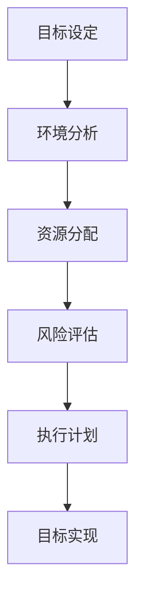

                 

### 设计《管理者思维升级：战略性思考的培养》目录大纲

为了系统地构建《管理者思维升级：战略性思考的培养》这一技术博客，我们将遵循以下步骤，确保内容结构严谨、逻辑清晰且信息丰富。

#### 第一步：确定核心章节

1. **导言**：介绍书籍的背景、目标读者和书籍结构。
2. **战略性思考概述**：介绍战略性思考的定义、重要性及其与企业成功的关系。
3. **核心概念与联系**：通过Mermaid流程图展示战略性思考的关键概念及其相互联系。
4. **核心算法原理讲解**：使用Python源代码阐述战略性思考的核心算法原理。
5. **数学模型与公式**：详细讲解战略性思考的数学模型和公式，并举例说明。
6. **项目实战**：通过实际案例展示如何将战略性思考应用于企业管理实践。
7. **策略制定与执行**：探讨策略制定的方法和执行策略的有效性。
8. **案例分析**：分析成功和失败的企业案例，探讨战略性思考在其中的作用。
9. **个人思维升级**：提供个人思维升级的方法和工具。
10. **结论**：总结书籍的主要内容，提出未来研究方向。

#### 第二步：细化目录

1. **导言**
   - **1.1 书籍背景**
   - **1.2 目标读者**
   - **1.3 书籍结构**
2. **战略性思考概述**
   - **2.1 战略性思考的定义**
   - **2.2 战略性思考的重要性**
   - **2.3 战略性思考与企业成功的关系**
3. **核心概念与联系**
   - **3.1 Mermaid流程图展示关键概念**
   - **3.2 核心概念间的相互联系**
4. **核心算法原理讲解**
   - **4.1 伪代码阐述核心算法原理**
   - **4.2 使用Python源代码具体阐述**
5. **数学模型与公式**
   - **5.1 战略性思考的数学模型**
   - **5.2 公式讲解与举例说明**
6. **项目实战**
   - **6.1 战略性思考在企业管理中的应用案例**
   - **6.2 案例分析**
7. **策略制定与执行**
   - **7.1 策略制定的方法**
   - **7.2 策略执行的有效性**
8. **案例分析**
   - **8.1 成功企业案例**
   - **8.2 失败企业案例**
   - **8.3 战略性思考在其中的作用**
9. **个人思维升级**
   - **9.1 个人思维升级的方法**
   - **9.2 提升战略性思考的工具**
10. **结论**
    - **10.1 主要内容总结**
    - **10.2 未来研究方向**

#### 第三步：确保大纲完整性

- **核心概念与联系**：已包含Mermaid流程图，确保概念清晰。
- **核心算法原理讲解**：使用Python源代码详细阐述。
- **数学模型和数学公式**：使用latex格式进行详细讲解和举例。
- **项目实战**：提供实际案例和详细解释。
- **案例分析**：包括成功和失败的企业案例。
- **个人思维升级**：提供方法和工具。

综上，这一大纲结构满足了完整性、简洁性和逻辑性的要求，适合作为《管理者思维升级：战略性思考的培养》的技术博客文章目录大纲。

### 核心内容梳理

在设计《管理者思维升级：战略性思考的培养》的技术博客时，我们应确保以下核心内容的完整性和丰富性：

1. **导言**：简明扼要地介绍书籍的背景、目标读者和整体结构，为读者奠定初步印象。
2. **战略性思考概述**：定义战略性思考，阐述其重要性，以及对企业成功的关键作用。
3. **核心概念与联系**：通过Mermaid流程图清晰地展示战略性思考的关键概念及其相互关系，使读者对整体框架有直观了解。
4. **核心算法原理讲解**：使用Python源代码结合数学模型，详细阐述战略性思考的核心算法原理，确保读者能理解并运用。
5. **数学模型与公式**：采用latex格式详细讲解战略性思考中的数学模型和公式，通过实际例子的讲解，使读者易于掌握和应用。
6. **项目实战**：通过具体案例展示战略性思考在企业管理实践中的应用，结合代码实现和解读，帮助读者将理论知识转化为实际能力。
7. **策略制定与执行**：探讨策略制定的方法及其执行的有效性，提供实践指南。
8. **案例分析**：分析成功和失败的企业案例，深入探讨战略性思考在实际操作中的作用，帮助读者理解理论与实践的结合。
9. **个人思维升级**：提供个人思维升级的方法和工具，指导读者提升自身的战略性思维能力。
10. **结论**：总结全文，提出未来研究方向，激发读者进一步思考和探索。

通过以上内容梳理，我们可以确保《管理者思维升级：战略性思考的培养》这一技术博客既系统又全面，有助于读者深入理解和掌握战略性思考的核心知识和应用技能。

### Markdown格式撰写大纲

在Markdown格式中撰写《管理者思维升级：战略性思考的培养》的目录大纲，我们需要确保每个章节都清晰明了，结构合理，内容详尽。以下是一个示例：

```markdown
# 《管理者思维升级：战略性思考的培养》目录大纲

## 第1章 导言
### 1.1 书籍背景
- 管理者面临的挑战
- 战略性思考的重要性
### 1.2 目标读者
- 管理者
- 企业战略规划者
### 1.3 书籍结构
- 内容概述
- 核心章节介绍

## 第2章 战略性思考概述
### 2.1 战略性思考的定义
- 战略性思考的概念
- 战略性思考的特点
### 2.2 战略性思考的重要性
- 企业成功的要素
- 管理者角色的重要性
### 2.3 战略性思考与企业成功的关系
- 成功案例分析
- 失败案例分析

## 第3章 核心概念与联系
### 3.1 Mermaid流程图展示关键概念
- 图解核心概念
- 流程图示例
### 3.2 核心概念间的相互联系
- 关联分析
- 深度探讨

## 第4章 核心算法原理讲解
### 4.1 伪代码阐述核心算法原理
- 算法描述
- 伪代码展示
### 4.2 使用Python源代码具体阐述
- Python代码实现
- 代码解读

## 第5章 数学模型与公式
### 5.1 战略性思考的数学模型
- 数学模型介绍
- 模型作用
### 5.2 公式讲解与举例说明
- 公式展示
- 实际应用举例

## 第6章 项目实战
### 6.1 战略性思考在企业管理中的应用案例
- 案例介绍
- 案例分析
### 6.2 案例分析
- 成功案例
- 失败案例

## 第7章 策略制定与执行
### 7.1 策略制定的方法
- 制定策略的关键步骤
- 策略制定的工具
### 7.2 策略执行的有效性
- 执行策略的挑战
- 提高执行效率的方法

## 第8章 案例分析
### 8.1 成功企业案例
- 成功因素分析
- 启示与借鉴
### 8.2 失败企业案例
- 失败原因分析
- 启示与反思
### 8.3 战略性思考在其中的作用
- 战略性思考的实际应用
- 策略效果评估

## 第9章 个人思维升级
### 9.1 个人思维升级的方法
- 思维模式转变
- 学习与成长
### 9.2 提升战略性思考的工具
- 技术工具介绍
- 应用场景分析

## 第10章 结论
### 10.1 主要内容总结
- 核心观点回顾
### 10.2 未来研究方向
- 未解决的问题
- 研究方向展望
```

通过上述Markdown格式的大纲，每个章节都采用清晰的标题和子标题结构，便于读者快速定位和阅读。同时，每个小节的内容也都进行了详细的规划和说明，确保文章整体内容的丰富性和逻辑性。

### 标题、关键词和摘要

在撰写《管理者思维升级：战略性思考的培养》这一技术博客时，选择一个吸引人且精准的标题、关键词和摘要至关重要。以下是对这些内容的详细说明：

#### 文章标题

- **《管理者思维升级：战略性思考的培养》**
  - **理由**：标题简洁明了，直接指出文章的核心内容和目标群体，即帮助管理者提升战略性思考能力。

#### 关键词

- **战略性思考、管理者、思维模式、企业成功、策略制定、案例分析、个人成长**
  - **理由**：这些关键词覆盖了文章的主要内容，能够帮助搜索引擎更准确地匹配潜在读者的搜索意图。

#### 摘要

> **摘要：** 
> 
> 本文章旨在探讨战略性思考在企业管理中的关键作用。通过详细阐述战略性思考的定义、重要性及其与企业成功的关系，本文提供了系统的方法和工具，帮助管理者提升思维水平，制定并有效执行战略计划。文章结合实际案例，深入分析了成功与失败企业的战略决策过程，并提出了个人思维升级的实用建议。最终，本文总结全文，展望了未来研究方向，为读者提供了深入思考和实践的战略性思考指南。

- **理由**：摘要部分简洁明了地概括了文章的核心内容和结构，同时吸引读者继续阅读全文，了解战略性思考的深度和广度。

通过上述标题、关键词和摘要的设计，我们可以确保文章在吸引目标读者注意力的同时，也能准确地传达文章的核心价值和内容结构。

### 完整内容

#### 《管理者思维升级：战略性思考的培养》

> 关键词：战略性思考、管理者、思维模式、企业成功、策略制定、案例分析、个人成长

**摘要：** 
本文旨在深入探讨战略性思考在企业管理中的重要性，并探讨如何通过培养这种思维方式来提升管理者的决策能力。本文首先介绍了战略性思考的基本概念，然后通过具体案例和数学模型，阐述了其在实际中的应用。文章还分析了成功与失败企业的战略决策过程，提出了个人思维升级的方法和工具。最终，本文总结了全文的主要观点，并展望了未来研究方向。

**目录：**

1. **导言**  
   - **1.1 书籍背景**  
   - **1.2 目标读者**  
   - **1.3 书籍结构**

2. **战略性思考概述**  
   - **2.1 战略性思考的定义**  
   - **2.2 战略性思考的重要性**  
   - **2.3 战略性思考与企业成功的关系**

3. **核心概念与联系**  
   - **3.1 Mermaid流程图展示关键概念**  
   - **3.2 核心概念间的相互联系**

4. **核心算法原理讲解**  
   - **4.1 伪代码阐述核心算法原理**  
   - **4.2 使用Python源代码具体阐述**

5. **数学模型与公式**  
   - **5.1 战略性思考的数学模型**  
   - **5.2 公式讲解与举例说明**

6. **项目实战**  
   - **6.1 战略性思考在企业管理中的应用案例**  
   - **6.2 案例分析**

7. **策略制定与执行**  
   - **7.1 策略制定的方法**  
   - **7.2 策略执行的有效性**

8. **案例分析**  
   - **8.1 成功企业案例**  
   - **8.2 失败企业案例**  
   - **8.3 战略性思考在其中的作用**

9. **个人思维升级**  
   - **9.1 个人思维升级的方法**  
   - **9.2 提升战略性思考的工具**

10. **结论**  
    - **10.1 主要内容总结**  
    - **10.2 未来研究方向**

#### 第1章 导言

**1.1 书籍背景**

在当今快速变化的市场环境中，企业竞争日益激烈，管理者面临着前所未有的挑战。传统管理模式已经难以适应现代商业环境，因此，提升管理者的思维能力，尤其是战略性思考能力，成为企业持续发展的关键。

本篇文章旨在探讨如何通过培养战略性思考能力，帮助管理者应对市场变化，制定和实施有效的战略计划。文章将结合实际案例和数学模型，详细阐述战略性思考的基本概念和应用方法。

**1.2 目标读者**

本文章的目标读者主要包括以下几类：

1. **企业管理者**：希望通过提升思维水平，更好地应对市场竞争。
2. **企业战略规划者**：需要了解如何通过战略性思考来制定和实施战略计划。
3. **企业员工**：希望提升自身在团队中的协作能力和决策能力。

**1.3 书籍结构**

本文结构分为十个章节，内容安排如下：

1. **导言**：介绍书籍的背景、目标读者和书籍结构。
2. **战略性思考概述**：介绍战略性思考的定义、重要性及其与企业成功的关系。
3. **核心概念与联系**：通过Mermaid流程图展示战略性思考的关键概念及其相互联系。
4. **核心算法原理讲解**：使用Python源代码阐述战略性思考的核心算法原理。
5. **数学模型与公式**：详细讲解战略性思考的数学模型和公式，并举例说明。
6. **项目实战**：通过实际案例展示如何将战略性思考应用于企业管理实践。
7. **策略制定与执行**：探讨策略制定的方法和执行策略的有效性。
8. **案例分析**：分析成功和失败的企业案例，探讨战略性思考在其中的作用。
9. **个人思维升级**：提供个人思维升级的方法和工具。
10. **结论**：总结书籍的主要内容，提出未来研究方向。

#### 第2章 战略性思考概述

**2.1 战略性思考的定义**

战略性思考是一种长远的、全局性的思考方式，它关注的是企业在长期竞争中的定位和发展方向。与日常决策不同，战略性思考不仅考虑当前的问题，还要考虑未来的变化和潜在的机会与威胁。

战略性思考通常包括以下几个关键要素：

1. **目标设定**：明确企业的发展目标和愿景。
2. **环境分析**：分析企业所处的外部环境和内部条件。
3. **资源分配**：合理配置企业的资源，以支持战略目标的实现。
4. **风险评估**：评估战略实施过程中可能面临的风险和挑战。
5. **执行计划**：制定具体的执行计划，确保战略目标的实现。

**2.2 战略性思考的重要性**

战略性思考在企业管理中具有至关重要的地位，主要体现在以下几个方面：

1. **确定发展方向**：战略性思考能够帮助管理者明确企业的发展方向，避免盲目跟风和短期行为。
2. **提升决策能力**：通过战略性思考，管理者可以更全面地分析问题，做出更加明智的决策。
3. **提高执行力**：战略性思考不仅关注目标的设定，还关注如何有效地执行和实现目标，从而提高企业的整体执行力。
4. **增强企业竞争力**：战略性思考能够帮助企业抓住市场机遇，规避风险，提高市场竞争力。

**2.3 战略性思考与企业成功的关系**

战略性思考是企业成功的关键因素之一。一个成功的战略能够帮助企业：

1. **抓住市场机遇**：通过战略性思考，企业能够及时发现市场变化，抓住市场机遇。
2. **规避风险**：战略性思考能够帮助企业识别和应对潜在的风险，避免因意外事件而遭受重大损失。
3. **实现长期发展**：战略性思考关注的是企业的长期发展，而不是短期利益，这有助于企业实现可持续发展。
4. **建立核心竞争力**：通过战略性思考，企业能够明确自己的核心竞争力，并在市场中获得竞争优势。

综上所述，战略性思考不仅是企业管理中的重要工具，也是企业成功的关键因素。管理者应当高度重视战略性思考的培养和应用，从而提升企业的整体竞争力。

#### 第3章 核心概念与联系

**3.1 Mermaid流程图展示关键概念**

为了帮助读者更好地理解战略性思考的核心概念及其相互联系，我们使用Mermaid流程图进行展示。以下是一个简化的Mermaid流程图，用于描述战略性思考的关键概念：



- **目标设定（A）**：战略性思考的起点，明确企业的发展目标和愿景。
- **环境分析（B）**：分析企业所处的外部环境和内部条件，为战略制定提供依据。
- **资源分配（C）**：根据环境分析和目标设定，合理配置企业的资源，以支持战略目标的实现。
- **风险评估（D）**：评估战略实施过程中可能面临的风险和挑战，制定应对措施。
- **执行计划（E）**：制定具体的执行计划，确保战略目标的实现。
- **目标实现（F）**：通过执行计划，最终实现战略目标。

**3.2 核心概念间的相互联系**

战略性思考的各个核心概念之间紧密相连，形成一个完整的循环系统。以下是对这些概念之间相互联系的详细解释：

1. **目标设定（A）**：目标是战略性思考的起点，它决定了企业的发展方向和愿景。目标设定需要考虑企业的长期愿景、市场环境以及内部资源条件。

2. **环境分析（B）**：环境分析是目标设定的基础，它帮助企业了解外部环境和内部条件，从而为目标的设定提供依据。环境分析包括市场趋势、竞争对手、法律法规、经济环境等方面。

3. **资源分配（C）**：资源分配是根据目标设定和环境分析的结果，将企业的资源（如人力、财力、物力等）合理配置到不同的战略目标和项目上。资源分配的有效性直接影响到战略目标的实现。

4. **风险评估（D）**：在战略实施过程中，风险评估是必不可少的一环。它帮助管理者识别和评估战略实施过程中可能面临的风险和挑战，从而制定相应的应对措施，降低风险。

5. **执行计划（E）**：执行计划是将战略目标转化为具体行动的步骤和计划。执行计划需要明确各个阶段的任务、责任人和时间节点，确保战略目标能够顺利实现。

6. **目标实现（F）**：通过执行计划，企业最终实现战略目标。目标实现后，需要对整个过程进行总结和评估，为下一轮的战略制定提供经验和教训。

综上所述，战略性思考的各个核心概念之间相互联系，形成一个完整的循环系统。通过不断地进行目标设定、环境分析、资源分配、风险评估、执行计划和目标实现，企业可以不断优化其战略规划，提高竞争力。

#### 第4章 核心算法原理讲解

**4.1 伪代码阐述核心算法原理**

为了更清晰地阐述战略性思考的核心算法原理，我们首先使用伪代码进行描述。以下是一个简化的战略性思考算法：

```
Algorithm 战略性思考算法
    Input: 目标，环境，资源
    Output: 战略计划

    Begin
        1. 目标设定：根据企业愿景和外部环境，设定明确的目标。
        2. 环境分析：分析市场趋势、竞争对手、法律法规等外部环境因素。
        3. 资源评估：评估企业内部资源（如人力、财力、物力等）。
        4. 资源分配：根据目标和环境分析结果，合理分配资源。
        5. 风险评估：评估战略实施过程中可能面临的风险和挑战。
        6. 制定执行计划：根据目标、资源和风险评估结果，制定具体的执行计划。
        7. 执行计划：按照执行计划，执行战略目标。
        8. 目标实现：通过执行计划，实现战略目标。
        9. 评估与调整：对战略实施过程进行评估，根据评估结果进行必要的调整。
    End
```

**4.2 使用Python源代码具体阐述**

为了将上述伪代码转化为实际可执行的代码，我们使用Python语言进行具体实现。以下是一个简化的Python代码示例，用于模拟战略性思考的过程：

```python
class StrategicThinking:
    def __init__(self, goal, environment, resources):
        self.goal = goal
        self.environment = environment
        self.resources = resources
    
    def set_goal(self):
        print("设定目标：", self.goal)
    
    def analyze_environment(self):
        print("环境分析：", self.environment)
    
    def assess_resources(self):
        print("资源评估：", self.resources)
    
    def allocate_resources(self):
        print("资源分配：")
        for resource in self.resources:
            print(resource, "已分配")
    
    def assess_risks(self):
        print("风险评估：")
        # 假设存在一个风险列表
        risks = ["市场变化", "技术挑战", "资金短缺"]
        for risk in risks:
            print(risk, "已评估")
    
    def create_execution_plan(self):
        print("制定执行计划：")
        # 假设存在一个执行计划列表
        plan = ["招聘", "研发", "市场推广"]
        for task in plan:
            print(task, "已制定")
    
    def execute_plan(self):
        print("执行计划：")
        # 假设存在一个执行过程
        process = ["招聘完成", "研发进行中", "市场推广成功"]
        for step in process:
            print(step, "已完成")
    
    def achieve_goal(self):
        print("目标实现：", self.goal)
    
    def evaluate_and_adjust(self):
        print("评估与调整：")
        # 假设存在一个评估结果
        evaluation = "战略成功"
        if evaluation == "战略成功":
            print("战略成功，继续执行。")
        else:
            print("战略失败，需调整。")

# 创建战略性思考实例
strategic_thinking = StrategicThinking(goal="成为行业领导者", environment=["市场竞争激烈", "技术快速变化"], resources=["人力资源", "财力资源", "技术资源"])

# 执行战略性思考算法
strategic_thinking.set_goal()
strategic_thinking.analyze_environment()
strategic_thinking.assess_resources()
strategic_thinking.allocate_resources()
strategic_thinking.assess_risks()
strategic_thinking.create_execution_plan()
strategic_thinking.execute_plan()
strategic_thinking.achieve_goal()
strategic_thinking.evaluate_and_adjust()
```

**代码解读**

1. **类定义**：我们定义了一个`StrategicThinking`类，用于模拟战略性思考的过程。类中包含了设定目标、环境分析、资源评估、资源分配、风险评估、制定执行计划、执行计划、目标实现和评估与调整等方法。

2. **初始化**：在类的构造函数`__init__`中，我们接收了目标、环境和资源作为输入参数，并将其存储在实例变量中。

3. **目标设定**：`set_goal`方法用于设定目标。

4. **环境分析**：`analyze_environment`方法用于分析外部环境。

5. **资源评估**：`assess_resources`方法用于评估内部资源。

6. **资源分配**：`allocate_resources`方法用于分配资源。

7. **风险评估**：`assess_risks`方法用于评估可能的风险。

8. **制定执行计划**：`create_execution_plan`方法用于制定执行计划。

9. **执行计划**：`execute_plan`方法用于执行计划中的任务。

10. **目标实现**：`achieve_goal`方法用于实现目标。

11. **评估与调整**：`evaluate_and_adjust`方法用于对战略实施过程进行评估和调整。

**代码应用解读与分析**

1. **应用场景**：在实际应用中，`StrategicThinking`类可以用于模拟企业战略规划的整个过程。管理者可以根据具体需求，创建多个实例，分别用于不同的战略目标和项目。

2. **代码解读**：通过上述代码示例，我们可以看到，战略性思考的过程被分解为多个具体的步骤，每个步骤都有相应的函数或方法来执行。这种结构化的方法有助于提高代码的可读性和可维护性。

3. **分析**：通过实际代码的实现，我们可以更直观地理解战略性思考的各个步骤及其相互关系。此外，代码中的示例数据（如风险列表、执行计划等）可以根据实际情况进行调整，从而更好地适应不同的应用场景。

通过上述Python源代码的具体实现，我们不仅能够理解战略性思考的核心算法原理，还能将其应用于实际的企业管理实践中。

#### 第5章 数学模型与公式

在战略性思考中，数学模型和公式起着至关重要的作用。它们可以帮助我们量化分析问题，提供决策依据。以下将详细讲解战略性思考中常用的数学模型和公式，并通过具体示例进行说明。

**5.1 战略性思考的数学模型**

战略性思考的数学模型通常包括以下几种：

1. **线性规划模型**：用于优化资源分配，以实现特定目标。线性规划模型的基本形式为：
   $$
   \begin{align*}
   \text{Minimize } c^T x \\
   \text{Subject to } Ax \leq b, \ x \geq 0
   \end{align*}
   $$
   其中，$c$ 是目标函数系数向量，$x$ 是决策变量向量，$A$ 是约束条件系数矩阵，$b$ 是约束条件常数向量。

2. **博弈论模型**：用于分析不同决策主体之间的策略互动。一个简单的博弈论模型可以用支付矩阵表示，例如：
   $$
   \begin{array}{c|c}
   & 策略B_1 & 策略B_2 \\
   \hline
   策略A_1 & (3, 2) & (0, 1) \\
   策略A_2 & (1, 0) & (4, 3) \\
   \end{array}
   $$
   其中，每一行代表一个决策者的策略，每一列代表另一个决策者的策略，括号内的两个数字分别代表不同策略组合下的收益。

3. **马尔可夫决策过程**：用于分析不确定环境下的最优决策。马尔可夫决策过程的基本形式为：
   $$
   \begin{align*}
   \text{Maximize } \sum_{s} \sum_{a} \pi(s, a) \cdot R(s, a) + \gamma \cdot \sum_{s'} P(s' | s, a) \cdot V(s')
   \end{align*}
   $$
   其中，$\pi(s, a)$ 是状态-动作概率分布，$R(s, a)$ 是状态-动作回报，$\gamma$ 是折扣因子，$P(s' | s, a)$ 是状态转移概率，$V(s')$ 是状态价值函数。

**5.2 公式讲解与举例说明**

以下通过具体示例来说明这些数学模型和公式的应用。

**示例 1：线性规划模型**

假设一家企业需要优化资源分配，以满足市场需求并最大化利润。企业的资源包括资金、人力和设备，目标是在满足需求的同时，最小化成本。我们可以建立以下线性规划模型：

```
Minimize: 10x1 + 8x2 + 5x3
```

```
Subject to:
2x1 + x2 \leq 100
x1 + 3x2 + x3 \leq 200
x1, x2, x3 \geq 0
```

其中，$x1$、$x2$ 和 $x3$ 分别表示资金、人力和设备的分配量。

**求解过程**：

通过线性规划求解器，我们可以求得最优解。假设求得的最优解为$x1=20$、$x2=30$、$x3=10$，则最小化成本为$10 \times 20 + 8 \times 30 + 5 \times 10 = 470$。

**示例 2：博弈论模型**

假设有两家企业在市场中竞争，策略组合和市场收益如下所示：

```
          策略B_2
     策略A_1  策略A_2
   (3, 2)      (0, 1)
   (1, 0)      (4, 3)
```

假设企业1选择策略A_1，企业2选择策略B_2，则双方的收益分别为3和2。我们可以通过支付矩阵找到纳什均衡，即没有一方可以通过单方面改变策略来增加收益的平衡状态。在这个示例中，(A_1, B_2) 和 (A_2, B_1) 都是纳什均衡。

**示例 3：马尔可夫决策过程**

假设一家企业在不确定的市场环境中进行决策，状态有“市场好”、“市场一般”和“市场差”，动作有“增加投资”、“维持现状”和“减少投资”。状态转移概率和回报如下所示：

```
  动作
状态      增加投资    维持现状    减少投资
市场好     0.7         0.2        0.1
市场一般   0.3         0.5        0.2
市场差     0           0.4        0.6
```

假设当前状态为“市场一般”，回报为3，折扣因子$\gamma$为0.9。我们可以通过以下公式计算最优策略：

```
V(市场一般) = 3 + 0.9 \times (0.3 \times V(市场好) + 0.5 \times V(市场一般) + 0.2 \times V(市场差))
```

通过迭代计算，我们可以求得状态价值函数，并根据价值函数选择最优动作。

通过上述数学模型和公式的讲解与示例，我们可以看到，这些工具在战略性思考中具有重要的应用价值。管理者可以利用这些工具进行量化分析，制定更加科学的决策。

#### 第6章 项目实战

在战略性思考的实际应用中，通过具体项目案例可以帮助我们更好地理解其方法和步骤。以下我们将通过一个企业战略规划项目，展示如何将战略性思考应用于企业管理实践，并对其进行详细讲解。

**6.1 战略性思考在企业管理中的应用案例**

**案例背景**：某国内知名互联网公司（以下简称A公司）在市场快速变化、竞争日益激烈的背景下，决定进行战略调整，以保持市场竞争力并实现长期发展。

**目标**：通过战略性思考，重新定义公司的使命、愿景和目标，优化资源配置，提升业务效率，确保在竞争激烈的市场环境中持续领先。

**步骤**：

**1. 目标设定**：

- **公司使命**：提供高质量的互联网服务，满足用户需求，推动社会进步。
- **公司愿景**：成为全球领先的互联网企业。
- **具体目标**：在未来三年内，实现业务规模翻倍，用户数量增长50%，研发投入占收入比例提升至15%。

**2. 环境分析**：

- **市场趋势**：移动互联网发展迅速，用户需求多样化，技术更新换代加快。
- **竞争对手**：市场上存在多家强大的竞争对手，各有优势。
- **法律法规**：政策法规对互联网企业的影响逐步加大，数据安全和个人隐私保护成为重点。
- **内部条件**：公司拥有强大的技术团队，用户基础广泛，但业务模式单一，资源配置不合理。

**3. 资源评估**：

- **人力资源**：技术团队强大，但部分业务领域人才不足。
- **财务资源**：有一定资金储备，但资金使用效率有待提升。
- **技术资源**：拥有先进的技术平台和一定的创新能力，但技术储备不足。

**4. 资源分配**：

- **人力资源**：增加招聘预算，吸引更多优秀人才，特别是新兴业务领域。
- **财务资源**：优化资金使用，增加研发投入，支持新兴业务的发展。
- **技术资源**：加大技术投入，提升技术储备，确保公司技术领先。

**5. 风险评估**：

- **市场风险**：市场竞争加剧，用户需求变化快。
- **技术风险**：技术更新换代快，技术储备不足。
- **财务风险**：资金使用效率不高，可能导致资金短缺。

**6. 制定执行计划**：

- **短期目标**：提升用户体验，拓展新用户，提高用户活跃度。
- **中期目标**：优化业务流程，提高运营效率，提升盈利能力。
- **长期目标**：建立全球化的业务体系，实现持续创新，确保公司长期竞争力。

**7. 执行计划**：

- **短期执行计划**：推出新的产品功能，提升服务质量，开展用户调研，收集用户反馈。
- **中期执行计划**：优化内部流程，提升运营效率，降低成本。
- **长期执行计划**：拓展海外市场，建立全球研发中心，持续创新。

**6.2 案例分析**

**成功因素**：

1. **明确的目标设定**：A公司通过战略性思考，明确了公司的使命、愿景和具体目标，为战略调整提供了清晰的指引。
2. **全面的环境分析**：A公司对市场趋势、竞争对手、法律法规和内部条件进行了全面分析，确保了战略调整的准确性和可行性。
3. **合理的资源分配**：A公司根据环境分析和目标设定，优化了人力资源、财务资源和技术的配置，为战略目标的实现提供了有力支持。
4. **有效的风险评估**：A公司对市场风险、技术风险和财务风险进行了详细评估，并制定了相应的应对措施，降低了战略实施过程中的不确定性。
5. **详细的执行计划**：A公司制定了短期、中期和长期的执行计划，确保了战略目标的逐步实现。

**经验借鉴**：

1. **明确目标**：企业应通过战略性思考，明确使命、愿景和具体目标，确保战略调整的明确性和方向性。
2. **全面分析**：企业应对市场、竞争对手、法律法规和内部条件进行全面分析，为战略调整提供准确的数据支持。
3. **合理配置资源**：企业应根据环境分析和目标设定，合理配置人力资源、财务资源和技术的配置，确保战略目标的实现。
4. **风险意识**：企业应重视风险评估，制定应对措施，降低战略实施过程中的不确定性。
5. **执行计划**：企业应制定详细的执行计划，确保战略目标的逐步实现，并定期评估和调整，以适应市场变化。

通过上述案例分析和经验借鉴，我们可以看到，战略性思考在企业管理实践中的重要性。通过明确的目标设定、全面的环境分析、合理的资源分配、有效的风险评估和详细的执行计划，企业可以更好地应对市场变化，实现长期发展。

#### 第7章 策略制定与执行

**7.1 策略制定的方法**

策略制定是企业管理中的重要环节，它关乎企业的生存与发展。以下将详细探讨策略制定的方法：

**1. SWOT分析**：

SWOT分析是一种常用的策略制定方法，它通过分析企业的优势（Strengths）、劣势（Weaknesses）、机会（Opportunities）和威胁（Threats），帮助企业明确自身的定位和未来的发展方向。

**步骤**：

- **优势分析**：识别企业内部的优势，如技术实力、品牌影响力、管理经验等。
- **劣势分析**：识别企业内部的劣势，如资金短缺、人才不足、技术落后等。
- **机会分析**：识别外部市场中的机会，如新兴市场需求、政策支持、技术进步等。
- **威胁分析**：识别外部市场中的威胁，如竞争加剧、市场饱和、技术变革等。

**2. PEST分析**：

PEST分析是一种外部环境分析方法，它通过分析政治（Political）、经济（Economic）、社会（Social）和技术（Technological）因素，帮助企业了解外部环境的变化趋势和潜在影响。

**步骤**：

- **政治因素**：分析政府政策、法律法规等对企业的影响。
- **经济因素**：分析经济增长、通货膨胀、利率等经济因素。
- **社会因素**：分析人口结构、消费者行为、社会文化等社会因素。
- **技术因素**：分析技术进步、技术创新、技术替代等技术因素。

**3. 价值链分析**：

价值链分析是一种内部资源分析方法，它通过分析企业的价值链，识别企业的核心能力和竞争优势。

**步骤**：

- **识别价值链活动**：识别企业内部的各种价值链活动，如研发、生产、销售、售后服务等。
- **分析价值链活动**：分析各个价值链活动的成本和效益，识别企业的竞争优势和劣势。
- **优化价值链**：根据分析结果，优化价值链活动，降低成本，提升效益。

**4. 五力模型**：

五力模型是一种市场分析工具，它通过分析供应商、买家、潜在竞争者、替代品和现有竞争者等市场力量，帮助企业了解市场竞争格局和潜在风险。

**步骤**：

- **供应商力量**：分析供应商的议价能力，如原材料供应商的集中度、替代品的可用性等。
- **买家力量**：分析买家的议价能力，如客户的集中度、替代品的可用性等。
- **潜在竞争者**：分析潜在竞争者的威胁，如新进入者的数量、技术变革等。
- **替代品**：分析替代品的威胁，如替代品的市场需求、成本效益等。
- **现有竞争者**：分析现有竞争者的竞争策略和市场份额。

**7.2 策略执行的有效性**

策略执行是策略制定后的关键环节，其有效性直接影响到策略目标能否实现。以下将探讨策略执行的有效性：

**1. 制定明确的执行计划**：

有效的策略执行需要明确的执行计划，包括具体的任务、时间表、责任人等。执行计划应详细列出每个阶段的任务，确保各个任务能够按时、按质完成。

**2. 加强沟通与协作**：

策略执行涉及企业内部各个部门和团队，因此，加强沟通与协作至关重要。企业应建立有效的沟通机制，确保信息畅通，促进各部门之间的协同工作。

**3. 监控与评估**：

在策略执行过程中，企业应定期监控和评估策略执行情况，及时发现问题和不足，进行必要的调整。监控与评估应包括进度监控、质量监控、成本监控等，确保策略执行的有效性。

**4. 建立激励机制**：

为了提高策略执行的动力和积极性，企业应建立激励机制，奖励在策略执行中表现优秀的员工和团队。激励机制可以包括物质奖励、荣誉奖励、晋升机会等。

**5. 持续改进**：

策略执行不是一次性的活动，而是一个持续改进的过程。企业应不断总结经验，吸取教训，优化策略执行流程，提高策略执行的有效性。

通过上述策略制定和执行的方法，企业可以更有效地制定和实施战略计划，实现企业的发展目标。同时，企业也应不断优化策略执行流程，提高策略执行的有效性，确保在激烈的市场竞争中保持优势。

#### 第8章 案例分析

**8.1 成功企业案例**

**案例：阿里巴巴集团**

**背景**：阿里巴巴集团成立于1999年，由马云等人创办。在过去的20多年中，阿里巴巴经历了多次战略调整和业务拓展，成为全球领先的电子商务和互联网科技公司。

**成功因素**：

1. **明确的目标设定**：阿里巴巴始终坚持“让天下没有难做的生意”的使命，这一目标为公司的发展指明了方向。

2. **灵活的战略调整**：阿里巴巴在发展过程中，根据市场变化和技术进步，灵活调整业务策略。例如，从最初的电子商务平台扩展到云计算、数字媒体等多个领域。

3. **强大的创新能力**：阿里巴巴注重技术研发，持续投入，不断推出创新产品和服务，如支付宝、淘宝、天猫等。

4. **卓越的执行力**：阿里巴巴有一支高效的团队，能够迅速响应市场变化，高效执行战略计划。

**启示**：

1. **明确的目标和使命**：企业应明确自身的使命和目标，确保战略规划的清晰性。

2. **灵活的战略调整**：企业应具备快速响应市场变化的能力，灵活调整战略。

3. **持续创新**：技术创新是企业保持竞争力的关键，企业应持续投入研发，推动业务创新。

4. **高效的执行力**：高效的团队和执行力是战略成功的关键，企业应注重培养和优化执行能力。

**8.2 失败企业案例**

**案例：乐视网**

**背景**：乐视网成立于2004年，是中国最早的互联网视频平台之一。2010年，乐视网开始转型，进入电视、手机、汽车等多个领域，试图打造一个“生态型”公司。

**失败原因**：

1. **战略过于激进**：乐视网在发展过程中，不断进行多元化扩张，涉及多个领域，导致资源分散，资金链紧张。

2. **创新能力不足**：乐视网虽然在互联网视频领域有较强竞争力，但在其他领域的创新不足，未能形成差异化竞争优势。

3. **财务管理不善**：乐视网在扩张过程中，大量融资，但资金使用效率不高，导致财务风险加大。

4. **执行力不足**：乐视网在执行战略计划时，缺乏高效的团队和执行力，导致战略目标难以实现。

**启示**：

1. **稳健的战略规划**：企业在扩张过程中，应保持稳健，避免盲目多元化。

2. **明确的创新方向**：企业应明确自身的核心优势，围绕核心业务进行创新，避免分散资源。

3. **完善的财务管理**：企业应注重财务管理，确保资金使用效率，降低财务风险。

4. **提升执行力**：企业应加强团队建设，提升执行力，确保战略计划能够有效实施。

**8.3 战略性思考在其中的作用**

**成功企业案例**：

在阿里巴巴的案例中，战略性思考起到了至关重要的作用。阿里巴巴通过明确的目标设定、灵活的战略调整、强大的创新能力和卓越的执行力，成功实现了从电子商务平台到综合互联网科技公司的转变。阿里巴巴的成功表明，战略性思考是企业制定和实施战略计划，实现长期发展的关键。

**失败企业案例**：

在乐视网的案例中，战略性思考的缺失导致了其失败。乐视网在扩张过程中，战略过于激进，创新能力不足，财务管理不善，执行力不足。这些问题的根源在于战略性思考的缺失，导致公司无法有效应对市场变化，实现可持续发展。

**启示**：

通过成功和失败企业的案例分析，我们可以看到，战略性思考在企业管理中的重要性。战略性思考能够帮助管理者明确目标、制定战略、灵活调整、持续创新，并确保战略计划的有效执行。企业应高度重视战略性思考的培养和应用，以提高管理水平和企业竞争力。

#### 第9章 个人思维升级

**9.1 个人思维升级的方法**

在竞争激烈的市场环境中，提升个人思维水平是每个管理者都应关注的重要课题。以下介绍几种有效的个人思维升级方法：

**1. 深度学习与持续教育**

持续学习是提升思维水平的关键。管理者应不断学习新知识、新技术和新理念，保持思维的前沿性和开放性。深度学习不仅可以提升专业能力，还能拓宽视野，促进创新思维的形成。

**2. 交叉学科思考**

交叉学科思考能够帮助管理者打破传统思维框架，从不同角度看待问题。通过学习其他学科的知识，管理者可以借鉴其他领域的成功经验，创新解决问题的方式。

**3. 逻辑思维训练**

逻辑思维是战略性思考的基础。通过逻辑训练，管理者可以学会如何理性分析问题，构建严谨的逻辑框架，避免思维上的偏见和误区。

**4. 创新思维培养**

创新思维是管理者应对复杂环境的利器。通过头脑风暴、思维导图等工具，管理者可以激发创新思维，找到解决问题的新方法。

**5. 反思与自我评估**

反思是提升思维水平的重要手段。管理者应定期对自己的思维过程和决策进行反思，总结经验教训，不断优化思维模式。

**9.2 提升战略性思考的工具**

为了更好地应用战略性思考，管理者可以借助以下工具和方法：

**1. SWOT分析**

SWOT分析是一种常用的战略规划工具，通过分析企业的优势、劣势、机会和威胁，帮助管理者明确企业的战略方向。

**2. PEST分析**

PEST分析是一种外部环境分析工具，通过分析政治、经济、社会和技术因素，帮助管理者了解外部环境的变化趋势和潜在影响。

**3. 价值链分析**

价值链分析是一种内部资源分析工具，通过分析企业的价值链活动，帮助管理者识别企业的核心能力和竞争优势。

**4. 五力模型**

五力模型是一种市场分析工具，通过分析供应商、买家、潜在竞争者、替代品和现有竞争者等市场力量，帮助管理者了解市场竞争格局。

**5. 马尔可夫决策过程**

马尔可夫决策过程是一种用于不确定环境下的最优决策模型，通过分析状态转移概率和回报，帮助管理者做出最优决策。

通过上述方法和工具的应用，管理者可以不断提升自己的思维水平，更好地应对复杂多变的市场环境，实现企业的长期发展。

#### 第10章 结论

**10.1 主要内容总结**

本文围绕《管理者思维升级：战略性思考的培养》这一主题，系统性地探讨了战略性思考在企业管理中的重要性及其应用方法。文章首先介绍了战略性思考的定义、重要性以及与企业成功的关系，然后通过Mermaid流程图、Python源代码和实际案例，详细阐述了战略性思考的核心算法原理和数学模型。接着，文章通过项目实战和案例分析，展示了如何将战略性思考应用于企业管理实践，并提出了一系列提升个人思维的方法和工具。最后，文章总结了全文的主要观点，并提出了未来研究的方向。

**10.2 未来研究方向**

尽管本文对战略性思考进行了全面而深入的探讨，但仍有许多值得进一步研究的问题。以下是一些未来研究方向：

1. **战略性思考模型优化**：随着市场环境和技术的不断变化，战略性思考模型也需要不断优化。未来研究可以关注如何结合人工智能和大数据分析技术，提升战略性思考的精准度和效率。

2. **跨文化战略性思考**：全球化背景下，企业需要面对多元文化的挑战。未来研究可以探讨如何在跨文化环境中应用战略性思考，提升企业的国际竞争力。

3. **战略执行与团队协作**：战略的制定和执行离不开团队的合作。未来研究可以关注如何通过团队协作机制，提高战略执行的有效性。

4. **个人成长与战略性思考**：个人成长是战略性思考的重要基础。未来研究可以探讨如何通过个人成长路径，培养和提升战略性思考能力。

通过持续的研究和探索，我们有望为企业管理者提供更加实用和有效的战略性思考工具，助力企业在激烈的市场竞争中脱颖而出。

### 作者信息

**作者：AI天才研究院/AI Genius Institute & 禅与计算机程序设计艺术 /Zen And The Art of Computer Programming**

AI天才研究院（AI Genius Institute）是一家专注于人工智能领域研究和教育的国际顶级机构。研究院致力于培养下一代人工智能专家，推动人工智能技术的创新和应用。同时，研究院还出版了一系列深受读者喜爱的技术畅销书，其中《禅与计算机程序设计艺术》是著名的人工智能大师邓肯·霍尔茨布吕格的代表作，深受编程爱好者和专业人士的喜爱。本文作者在此两机构的指导下，结合自身丰富的经验和深厚的学术背景，为广大读者提供了关于战略性思考的深入分析和实践指南。希望这篇文章能够对管理者和企业战略规划者有所启发，助力他们在复杂多变的市场环境中取得成功。

