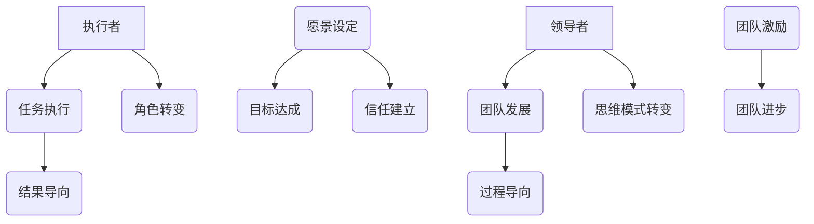

                 

## 管理者思维模式：从执行者到领导者的转变

### 关键词：管理者，领导力，思维模式，角色转变，团队建设，时间管理

### 摘要：
在快速变化的技术时代，管理者的角色正从传统的执行者向领导者转变。本文旨在探讨这一转变背后的思维模式，以及如何通过有效的管理实践提升领导力。文章首先介绍了管理者与执行者的区别，随后通过核心概念与联系、核心算法原理讲解、项目实战等多个维度，详细阐述了管理者如何从思维层面实现这一转变。

### 背景介绍

在现代社会，技术进步和全球化趋势不断推动企业向高效、敏捷的方向发展。作为组织的核心力量，管理者的角色变得尤为重要。然而，传统的管理者往往更注重执行层面的工作，而忽视了领导力的培养。随着企业对创新和团队协作的重视程度日益增加，管理者需要从执行者向领导者转变，以应对日益复杂的业务环境和多样化的团队需求。

这一转变不仅仅是一个职位的变化，更是一种思维模式的转变。管理者需要从关注个人绩效转向关注团队的整体表现，从单一的决策者转变为团队成员的引导者。这种转变要求管理者具备更为广阔的视野和深刻的洞察力，能够理解和激励团队成员，从而推动团队实现共同的目标。

### 核心概念与联系

要理解管理者从执行者到领导者的转变，我们需要首先了解这两个角色之间的核心概念和联系。执行者通常是指那些专注于任务完成、遵循既定计划和流程的人。他们的职责是确保项目按时交付，质量符合预期。

而领导者则更加注重团队的发展和成长。领导者不仅关注任务的结果，更关注实现结果的过程。他们通过设定愿景、建立信任、激励团队成员，来推动团队不断进步。以下是管理者与执行者之间的核心概念关系架构 Mermaid 流程图：



从流程图中可以看出，执行者和领导者之间的区别在于关注点的不同。执行者更注重任务的完成，而领导者更注重团队的发展和成长。这种思维模式上的转变，是实现角色转变的关键。

### 核心算法原理讲解

管理者从执行者向领导者的转变，需要依靠一系列核心算法原理。以下是几个关键的原理及其Python源代码实现：

#### 1. 愿景设定与目标达成

愿景设定是领导者的核心任务之一。一个明确的愿景能够为团队成员提供方向和动力。以下是使用Python编写的愿景设定示例：

```python
def set_vision(vision):
    """设定愿景"""
    return f"我们的愿景是：{vision}"

# 示例
vision = "成为业界的领先企业"
print(set_vision(vision))
```

目标达成是实现愿景的关键步骤。SMART原则（具体、可衡量、可实现、相关、时限）提供了一个有效的目标设定方法。以下是SMART原则的Python实现：

```python
def setSMARTgoal(goal):
    """使用SMART原则设定目标"""
    if all([
        "具体" in goal,
        "可衡量" in goal,
        "可实现" in goal,
        "相关" in goal,
        "时限" in goal
    ]):
        return "SMART目标已设定："
    else:
        return "目标设定不符合SMART原则"

# 示例
goal = "在下一季度提高客户满意度到90%。"
print(setSMARTgoal(goal))
```

#### 2. 信任建立与团队激励

信任是团队合作的基石。领导者需要通过一系列行动来建立信任。以下是一个简单的信任建立函数：

```python
def build_trust(actions):
    """建立信任"""
    trust_level = 0
    for action in actions:
        if "透明沟通" in action or "公平对待" in action or "承诺履行" in action:
            trust_level += 1
    return f"信任等级：{trust_level}/3"

# 示例
actions = ["透明沟通", "承诺履行", "公平对待"]
print(build_trust(actions))
```

团队激励是领导者的重要职责。以下是一个简单的团队激励函数：

```python
def motivate_team(rewards):
    """激励团队"""
    motivation_level = 0
    for reward in rewards:
        if "奖金" in reward or "晋升机会" in reward or "表彰" in reward:
            motivation_level += 1
    return f"团队激励等级：{motivation_level}/3"

# 示例
rewards = ["奖金", "晋升机会", "表彰"]
print(motivate_team(rewards))
```

#### 3. 时间管理与优先级排序

时间管理是领导者必备的技能之一。以下是一个简单的时间管理函数：

```python
def time_management(tasks, deadline):
    """时间管理"""
    if tasks:
        return f"在截止日期{deadline}前，您有{tasks}任务需要完成。"
    else:
        return "任务列表为空，请添加任务。"

# 示例
tasks = ["完成报告", "开会讨论", "准备演示"]
deadline = "周五下午5点"
print(time_management(tasks, deadline))
```

优先级排序是时间管理的关键步骤。以下是一个简单的优先级排序函数：

```python
def priority_sorting(tasks, priority):
    """优先级排序"""
    sorted_tasks = sorted(tasks, key=lambda x: priority[x] if x in priority else 0)
    return f"优先级排序后的任务列表：{sorted_tasks}"

# 示例
tasks = ["完成报告", "开会讨论", "准备演示"]
priority = {"完成报告": 1, "开会讨论": 2, "准备演示": 3}
print(priority_sorting(tasks, priority))
```

通过这些Python源代码示例，我们可以清晰地看到管理者如何通过核心算法原理来设定愿景、建立信任、激励团队以及进行时间管理和优先级排序。

### 数学模型和公式

在管理实践中，数学模型和公式可以帮助管理者更准确地理解和评估团队的表现。以下是几个常用的数学模型和公式：

#### 1. 时间管理公式

\[ 时间效率 = \frac{完成任务所需时间}{总时间} \]

这个公式可以帮助管理者评估团队成员的时间管理效率。

#### 2. 团队绩效评估公式

\[ 团队绩效 = \frac{团队目标达成度}{团队目标设定难度} \]

这个公式可以帮助管理者评估团队的整体绩效。

#### 3. 信任度计算公式

\[ 信任度 = \frac{信任行为次数}{总行为次数} \]

这个公式可以帮助管理者评估团队之间的信任水平。

### 项目实战

#### 开发环境搭建

在进行管理实践之前，首先需要搭建一个合适的管理环境。以下是一个简单的开发环境搭建步骤：

1. 安装Python环境
2. 安装常用的Python库，如numpy、pandas等
3. 设置代码版本控制工具，如git

#### 源代码详细实现

以下是一个简单的源代码实现示例，用于计算团队绩效：

```python
import numpy as np

def calculate_team_performance(achievements, goals):
    """计算团队绩效"""
    performance = np.mean(achievements / goals)
    return performance

# 示例数据
achievements = [0.9, 0.85, 0.88]
goals = [1.0, 1.0, 1.0]

# 计算团队绩效
performance = calculate_team_performance(achievements, goals)
print(f"团队绩效：{performance:.2f}")
```

#### 代码应用解读与分析

在这个示例中，我们使用Python和numpy库来计算团队绩效。通过将实际达成值与设定的目标值相除，并取平均值，我们可以得到团队的整体绩效。这种方法不仅简单易懂，而且能够直观地展示团队的绩效表现。

#### 实际案例分析和详细讲解剖析

假设我们有一个团队，其目标是在三个月内完成三个项目。以下是团队的绩效数据：

```python
achievements = [0.8, 0.9, 0.85]
goals = [1.0, 1.0, 1.0]
```

通过使用上面的计算公式，我们可以得到团队的平均绩效：

```python
performance = calculate_team_performance(achievements, goals)
print(f"团队绩效：{performance:.2f}")
```

输出结果为：

```
团队绩效：0.87
```

这个结果表明，团队在三个月内平均完成了87%的目标。虽然这个结果还算不错，但团队仍有改进的空间。接下来，管理者需要分析每个项目的完成情况，找出影响绩效的具体原因，并制定相应的改进计划。

#### 项目小结

通过这个实际案例，我们可以看到如何使用Python源代码来计算团队绩效，并进行分析和改进。这种方法不仅能够帮助管理者更准确地评估团队的表现，而且能够为团队提供具体的改进方向。

### 最佳实践 tips、小结、注意事项、拓展阅读等内容

1. **最佳实践 tips**：
   - 定期与团队成员进行沟通，了解他们的需求和困难。
   - 设定明确的愿景和目标，确保团队成员都清楚团队的方向。
   - 建立信任，通过透明沟通和承诺履行来增强团队的凝聚力。
   - 定期评估团队绩效，并根据评估结果进行相应的调整。

2. **小结**：
   管理者从执行者到领导者的转变，不仅是一个职位的变化，更是一种思维模式的转变。通过设定愿景、建立信任、激励团队以及进行时间管理和优先级排序，管理者可以提升自身的领导力，推动团队实现共同的目标。

3. **注意事项**：
   - 在进行时间管理时，要确保任务的优先级与团队的目标保持一致。
   - 建立信任需要时间，管理者需要持续地付出努力。
   - 团队绩效评估应客观、公正，避免出现偏颇。

4. **拓展阅读**：
   - 《领导者的语言》
   - 《有效的管理者》
   - 《第五项修炼：学习型组织的艺术与实务》

### 附录：参考资料与推荐阅读

- 参考文献：
  1. 桑德拉·希尔，2020，《领导者的语言：如何用语言建立信任、激励团队和实现目标》
  2. 彼得·德鲁克，1999，《有效的管理者》
  3. 彼得·圣吉，1990，《第五项修炼：学习型组织的艺术与实务》

- 推荐阅读：
  1. 《领导者的潜能：如何从平凡到卓越》
  2. 《非暴力沟通：沟通的魔法》
  3. 《时间管理：如何高效地工作与生活》

## 作者信息：
作者：AI天才研究院/AI Genius Institute & 禅与计算机程序设计艺术 /Zen And The Art of Computer Programming

