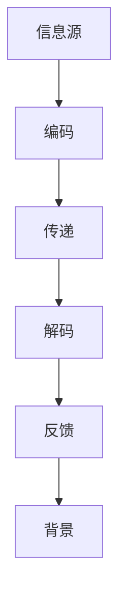
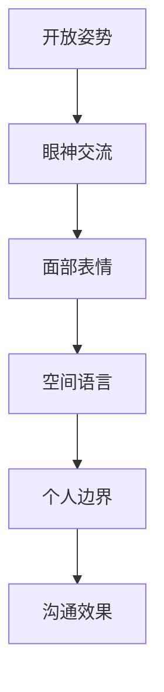

                 

### 文章标题

# 管理者沟通技巧：提升影响力的表达方法

> 关键词：沟通技巧、影响力、表达方法、管理者、非语言沟通

摘要：本文将深入探讨管理者在沟通中的关键技巧，以及如何通过有效的表达方法提升个人和团队的影响力。文章分为七个部分，从沟通的基础理论到非语言沟通的运用，再到冲突处理和案例分析，系统性地为管理者提供了一套实用且科学的沟通策略。

### 引言

管理者在组织中扮演着至关重要的角色，他们的沟通能力直接影响着团队的工作效率和个人影响力。有效的沟通不仅能传递清晰的信息，还能建立信任、促进合作，并解决潜在的问题。然而，沟通并非易事，它涉及到信息的传递、接收、理解以及反馈等多个环节。

本文旨在为管理者提供一套系统的沟通技巧，帮助他们在实际工作中提升个人影响力。通过分析沟通的基础理论、倾听技巧、表达技巧、非语言沟通、影响力提升策略、冲突处理方法以及案例实战，本文将帮助管理者构建一套科学且实用的沟通体系。

### 第1章：沟通的基础理论

#### 沟通的重要性

沟通是管理者的核心技能之一。有效的沟通不仅能够确保团队成员对任务的清晰理解，还能激发团队成员的积极性和创造力。在组织中，良好的沟通可以减少误解和冲突，提高团队协作效率，从而实现组织目标。

#### 沟通的基本原则

- **目的明确**：每一次沟通都应该有一个明确的目的，确保信息的传递是有针对性的。
- **信息准确**：信息需要准确无误，避免因误解而导致错误的决策。
- **及时反馈**：沟通是一个双向过程，及时的反馈可以帮助确认信息的传递是否准确。
- **尊重对方**：尊重对方的观点和意见，建立良好的沟通氛围。

#### 沟通的障碍与应对策略

沟通障碍主要包括语言障碍、文化差异、情绪因素等。管理者需要通过提高语言表达能力、增强跨文化沟通能力和掌握情绪管理技巧来克服这些障碍。

#### 沟通模型与流程图

为了更好地理解沟通的过程，我们可以使用沟通过程模型来描述。该模型包括信息源、编码、传递、解码、反馈和背景六个部分。以下是一个简化的沟通过程流程图：



### 第2章：倾听技巧

#### 倾听的定义与重要性

倾听是沟通的重要组成部分，它是理解他人观点、建立信任和促进有效沟通的关键。有效倾听不仅仅是听别人说什么，更重要的是理解对方的意思和情感。

#### 有效倾听的步骤与方法

1. **准备倾听**：在沟通前，管理者需要做好充分的准备，了解对方的背景和需求。
2. **专注倾听**：在沟通过程中，管理者需要保持注意力集中，避免分心。
3. **反馈倾听**：通过提问、总结对方的话或给予肯定反馈来确认自己是否正确理解了对方的观点。

#### 倾听中的障碍与解决策略

倾听中的障碍主要包括自我中心、情绪干扰和偏见等。管理者可以通过提高自我意识、管理情绪和培养开放心态来克服这些障碍。

#### 实例分析：提升倾听技巧

假设一个管理者在与团队成员讨论项目进展时，可以通过以下步骤提升倾听技巧：

1. **准备倾听**：提前了解项目背景和团队成员的职责。
2. **专注倾听**：在会议中，避免使用手机或做其他事情，确保注意力集中。
3. **反馈倾听**：在团队成员发言结束后，管理者可以总结他们的观点，并提问以确认理解。

### 第3章：表达技巧

#### 清晰表达的要点

清晰的表达是有效沟通的基础。管理者需要确保信息传递的准确性和逻辑性，避免使用复杂的术语和模糊的语言。

#### 逻辑性与条理性的提升

1. **明确主题**：在沟通过程中，管理者需要明确主题，确保信息的焦点明确。
2. **逻辑结构**：信息的组织应该有条理，确保信息的连贯性和一致性。
3. **简明扼要**：避免冗长的叙述，确保信息简洁明了。

#### 语言表达的精确性

管理者在表达时需要使用准确的语言，避免模糊的表述和误导性的信息。以下是一些提升语言表达精确性的技巧：

1. **使用具体的例子**：通过具体的例子来说明观点，使信息更加具体和直观。
2. **避免使用模糊的词汇**：如“可能”、“似乎”等，这些词汇可能会引起误解。
3. **确认理解**：在沟通过程中，可以请对方确认是否理解了你的观点。

#### 情感表达的适当性

管理者在表达时不仅需要关注信息的准确性，还需要注意情感的适当性。以下是一些提升情感表达的适当性的技巧：

1. **了解对方的情感状态**：在表达时，管理者需要考虑对方的情感状态，避免在对方情绪不稳定时进行沟通。
2. **使用积极的语言**：尽量使用积极、鼓励的语言，避免消极、负面的表达。
3. **适时表达同情和尊重**：在对方遇到困难或挫折时，管理者可以表达同情和尊重，帮助对方建立信心。

#### 算法：构建有效表达框架的伪代码

以下是一个简化的伪代码，用于构建有效的表达框架：

```python
function effective_communication(message, audience, context):
    # 确定主题和目的
    purpose = define_purpose(message, context)
    
    # 优化语言表达
    optimized_message = optimize_expression(message, audience)
    
    # 确保逻辑性和条理性
    structured_message = structure_message(optimized_message)
    
    # 确保情感表达的适当性
    emotional_message = handle_emotions(structured_message, audience, context)
    
    # 传递信息
    deliver_message(emotional_message, audience)
```

### 第4章：非语言沟通

#### 肢体语言的作用

肢体语言是沟通的重要组成部分，它能够传达出文字表达无法传达的情感和态度。有效的肢体语言可以增强沟通的效果，帮助管理者更好地传达信息。

#### 面部表情与非言语线索

面部表情和非言语线索（如眼神、姿势等）在沟通中起着关键作用。以下是一些关键的肢体语言技巧：

1. **开放的姿势**：开放的姿势（如展开双臂、面对对方）可以传达出友好和自信的态度。
2. **适时的眼神交流**：适时的眼神交流可以表明你在认真倾听和关注对方。
3. **适当的面部表情**：面部表情可以传达出情感和态度，如微笑、皱眉等。

#### 空间语言与个人边界

空间语言也是非语言沟通的一部分，它涉及到个人边界和社交距离的处理。以下是一些空间语言技巧：

1. **适当的社交距离**：根据文化背景和情境，确定适当的社交距离。
2. **个人边界的表达**：明确表达个人边界，避免侵犯他人的空间。

#### 非言语沟通的案例分析

以下是一个非言语沟通的案例分析：

在一次团队会议上，一个管理者在发言时一直低头看着演讲稿，而不是与团队成员进行眼神交流。这种行为可能会传达出管理者缺乏自信和关注对方的信息。

#### 流程图：非语言沟通的要素与影响

以下是一个简化的流程图，用于描述非语言沟通的要素及其影响：



### 第5章：影响力提升

#### 影响力的定义与来源

影响力是指一个人在团队或组织中影响他人思想和行为的能力。影响力来源于多个方面，包括专业知识、沟通技巧、领导能力等。

#### 沟通中的影响力策略

1. **建立信任**：通过诚实、透明和开放的沟通建立信任。
2. **展示专业知识**：通过专业知识和经验来增强个人影响力。
3. **倾听和尊重**：通过倾听和尊重对方的观点来建立良好的人际关系。
4. **积极沟通**：通过积极的语言和态度来提升个人形象和影响力。

#### 建立个人品牌的技巧

建立个人品牌是提升影响力的关键。以下是一些建立个人品牌的技巧：

1. **持续学习**：通过不断学习和提升自己，建立专业形象。
2. **分享经验**：通过分享自己的经验和见解，树立权威形象。
3. **积极形象**：通过正面的形象和态度来提升个人魅力。
4. **社交媒体**：利用社交媒体平台来展示自己的专业知识和成就。

#### 社交网络与影响力

社交网络是提升影响力的有效工具。通过建立广泛的社交网络，管理者可以扩大自己的影响力。以下是一些提升社交网络影响力的技巧：

1. **积极参与**：积极参与行业活动和社交活动，扩大人脉。
2. **分享有价值的内容**：在社交平台上分享有价值的内容，吸引关注。
3. **互动与反馈**：与关注者进行互动，及时反馈和回应。
4. **建立专业社群**：通过建立专业社群，提升自己在行业内的地位。

#### 数学模型：影响力评估的公式与应用

以下是一个简化的数学模型，用于评估个人影响力：

$$
影响力 = \frac{专业知识 \times 沟通技巧 \times 领导能力}{负面影响}
$$

该模型可以帮助管理者了解自己在团队和组织中的影响力，并找到提升影响力的关键因素。

### 第6章：应对冲突

#### 冲突的本质与类型

冲突是沟通中不可避免的一部分，它可以是个人之间的，也可以是团队或组织之间的。冲突的本质是不同观点、需求或利益的碰撞。常见的冲突类型包括：

1. **个人冲突**：由于个人性格、价值观或利益冲突引起的。
2. **团队冲突**：由于团队成员之间的意见不合、目标不一致等引起的。
3. **组织冲突**：由于组织内部或组织之间的利益冲突引起的。

#### 冲突管理的基本原则

1. **预防为主**：通过良好的沟通和团队合作，预防冲突的发生。
2. **及时处理**：冲突一旦发生，需要及时处理，避免问题扩大。
3. **公正处理**：在处理冲突时，需要保持公正和客观，避免偏袒任何一方。
4. **寻求共识**：通过对话和协商，寻求双方的共识和解决方案。

#### 处理冲突的技巧与策略

1. **倾听和理解**：在处理冲突时，首先要倾听和理解对方的观点和需求。
2. **表达和回应**：通过恰当的表达和回应，传达自己的观点和立场。
3. **协商和妥协**：在双方都无法满足对方需求时，通过协商和妥协来寻找折中方案。
4. **求助第三方**：在无法自行解决冲突时，可以寻求第三方的帮助，如调解人或顾问。

#### 实战案例：冲突的有效处理

以下是一个冲突处理的实战案例：

在一个项目中，团队成员A和B因为任务分工和进度问题产生了冲突。团队成员A认为B的任务分配不合理，导致项目进度延误；而团队成员B则认为A没有按时完成自己的任务，影响了整个项目的进度。

处理步骤：

1. **倾听和理解**：管理者首先与团队成员A和B进行一对一的沟通，了解双方的立场和需求。
2. **表达和回应**：管理者向团队成员A和B表达了自己的关切，并试图理解他们的观点。
3. **协商和妥协**：管理者帮助双方进行了协商，最终找到了一个双方都能接受的解决方案，即重新调整任务分配，并明确每个人的责任和进度。
4. **求助第三方**：如果双方无法自行解决冲突，管理者可以寻求第三方的帮助，如项目经理或人力资源部门。

#### 伪代码：冲突管理的决策框架

以下是一个简化的伪代码，用于描述冲突管理的决策框架：

```python
function conflict_management(conflict_type, parties_involved):
    if conflict_type == "个人冲突":
        manage_personal_conflict(parties_involved)
    elif conflict_type == "团队冲突":
        manage_team_conflict(parties_involved)
    elif conflict_type == "组织冲突":
        manage_organization_conflict(parties_involved)
    else:
        seek_third_party_help()
```

### 第7章：案例分析与实战

#### 案例一：提升团队沟通效率

在一个大型项目中，团队成员之间的沟通效率较低，导致项目进度延误。为了提升团队沟通效率，管理者采取了以下措施：

1. **明确沟通目标和流程**：制定清晰的沟通目标和流程，确保信息的传递是有针对性的。
2. **使用沟通工具**：引入沟通工具（如Slack、Microsoft Teams等），方便团队成员实时沟通和协作。
3. **定期沟通会议**：定期召开沟通会议，确保团队成员对项目的进展和问题有清晰的了解。
4. **反馈机制**：建立反馈机制，及时收集和处理团队成员的反馈和建议。

通过这些措施，团队的沟通效率显著提升，项目进度得到有效控制。

#### 案例二：通过沟通建立客户信任

在一个销售项目中，管理者通过有效的沟通建立了与客户的信任关系。以下是一些关键步骤：

1. **了解客户需求**：通过沟通了解客户的需求和痛点，确保提供的产品或服务能够满足客户的需求。
2. **诚实和透明**：在沟通中保持诚实和透明，避免夸大或隐瞒事实。
3. **积极回应**：及时回应客户的反馈和问题，展示出对客户关心和重视。
4. **定制化方案**：根据客户的需求提供定制化的解决方案，增强客户的信任。

通过这些措施，管理者成功建立了与客户的信任关系，项目取得了良好的业绩。

#### 案例三：跨部门沟通与协作

在一个大型组织中，不同部门之间的沟通和协作效率较低，导致项目进度延误。为了改善跨部门沟通和协作，管理者采取了以下措施：

1. **建立跨部门沟通渠道**：建立跨部门的沟通渠道（如跨部门会议、沟通平台等），方便不同部门之间的信息交流。
2. **明确责任和任务**：明确各部门的责任和任务，确保项目的顺利进行。
3. **定期沟通和协调**：定期召开跨部门沟通会议，协调各部门的工作进度和问题。
4. **建立协作文化**：通过培训和文化建设，培养跨部门的协作意识和团队精神。

通过这些措施，跨部门沟通和协作效率显著提升，项目顺利完成。

#### 实战练习：制定个人沟通计划

为了提升个人沟通技巧，管理者可以制定以下个人沟通计划：

1. **自我评估**：评估自己的沟通技巧和存在的问题。
2. **目标设定**：设定提升沟通技巧的具体目标，如改善倾听技巧、提升表达清晰度等。
3. **学习与实践**：通过学习相关书籍、课程和实践来提升沟通技巧。
4. **反馈与改进**：定期进行自我反馈，总结提升沟通技巧的经验和不足，并持续改进。

#### 代码解读：实战案例中的代码实现与解读

以下是一个简化的Python代码，用于实现案例中的沟通计划：

```python
class CommunicationPlan:
    def __init__(self, self_evaluation, goals, learning_methods, feedback_methods):
        self.self_evaluation = self_evaluation
        self.goals = goals
        self.learning_methods = learning_methods
        self.feedback_methods = feedback_methods
    
    def execute_plan(self):
        print("执行沟通计划：")
        print("自我评估：", self.self_evaluation)
        print("目标设定：", self.goals)
        print("学习与实践：", self.learning_methods)
        print("反馈与改进：", self.feedback_methods)

# 创建沟通计划实例
plan = CommunicationPlan("沟通技巧有待提升", "提升倾听技巧和表达清晰度", "阅读相关书籍和参加培训", "定期自我反馈和总结")

# 执行沟通计划
plan.execute_plan()
```

通过这个代码实例，管理者可以清晰地了解如何制定和执行个人沟通计划，进一步提升自己的沟通技巧。

### 项目实战：开发环境搭建

为了更好地理解和实践沟通技巧，管理者可以搭建一个简单的沟通平台。以下是一个简单的开发环境搭建步骤：

1. **选择开发工具**：选择适合的编程语言（如Python、JavaScript）和开发环境（如Visual Studio Code、PyCharm）。
2. **搭建开发环境**：在计算机上安装开发工具和必要的依赖库。
3. **编写代码**：编写简单的沟通功能代码，如发送消息、接收消息和显示消息。
4. **测试与调试**：测试代码的功能，并进行调试，确保沟通平台正常运行。

#### 源代码详细实现和代码解读

以下是一个简单的Python代码示例，用于实现一个基本的沟通平台：

```python
# 沟通平台：发送和接收消息

# 导入必要的库
import socket

# 定义服务器端代码
def server():
    # 创建套接字
    server_socket = socket.socket(socket.AF_INET, socket.SOCK_STREAM)
    
    # 绑定IP地址和端口
    server_socket.bind(('127.0.0.1', 8000))
    
    # 监听连接
    server_socket.listen(1)
    
    print("服务器已启动，等待连接...")
    
    # 接受客户端连接
    client_socket, client_address = server_socket.accept()
    print("已连接到客户端：", client_address)
    
    # 循环接收消息
    while True:
        message = client_socket.recv(1024).decode('utf-8')
        if not message:
            break
        print("接收到的消息：", message)
        
        # 发送回复
        client_socket.send("已收到消息！".encode('utf-8'))
    
    # 关闭连接
    client_socket.close()
    server_socket.close()

# 定义客户端代码
def client():
    # 创建套接字
    client_socket = socket.socket(socket.AF_INET, socket.SOCK_STREAM)
    
    # 连接到服务器
    client_socket.connect(('127.0.0.1', 8000))
    
    print("已连接到服务器...")
    
    # 循环发送消息
    while True:
        message = input("请输入要发送的消息：")
        client_socket.send(message.encode('utf-8'))
        
        reply = client_socket.recv(1024).decode('utf-8')
        print("接收到的回复：", reply)
        
        if reply == "退出":
            break

    # 关闭连接
    client_socket.close()

# 主程序
if __name__ == "__main__":
    # 启动服务器端
    server_thread = threading.Thread(target=server)
    server_thread.start()
    
    # 启动客户端
    client()

# 等待服务器端结束
server_thread.join()
```

#### 代码应用解读与分析

这个简单的沟通平台由服务器端和客户端组成。服务器端负责接收客户端的消息，并返回确认信息；客户端负责发送消息，并接收服务器的回复。

1. **服务器端代码解读**：

   - 创建套接字：使用`socket.socket()`函数创建一个TCP套接字。
   - 绑定IP地址和端口：使用`bind()`函数将套接字绑定到特定的IP地址和端口。
   - 监听连接：使用`listen()`函数使套接字进入监听状态，等待客户端的连接请求。
   - 接受客户端连接：使用`accept()`函数接受客户端的连接请求，返回一个新的套接字用于与客户端通信。
   - 循环接收消息：使用循环不断接收客户端发送的消息，并打印到控制台。
   - 发送回复：向客户端发送确认信息，表明消息已收到。
   - 关闭连接：在接收完所有消息后，关闭套接字。

2. **客户端代码解读**：

   - 创建套接字：使用`socket.socket()`函数创建一个TCP套接字。
   - 连接到服务器：使用`connect()`函数连接到服务器端指定的IP地址和端口。
   - 循环发送消息：使用循环接收用户输入的消息，并将其发送到服务器端。
   - 接收回复：接收服务器端发送的回复信息，并打印到控制台。
   - 关闭连接：在发送完所有消息后，关闭套接字。

#### 实际案例分析和详细讲解剖析

以下是一个实际案例，用于分析如何在实际项目中应用沟通平台，并详细讲解其剖析：

**案例：团队协作沟通平台**

在一个软件项目中，团队成员需要实时沟通和协作，以确保项目进度和质量。为了实现这一目标，团队决定搭建一个基于TCP协议的简单沟通平台。

**分析与讲解**：

1. **需求分析**：

   - 实时沟通：团队成员需要能够实时发送和接收消息。
   - 简单易用：平台应简单易用，不需要复杂的学习和操作。
   - 可扩展性：平台应具有可扩展性，以便未来增加更多功能。

2. **设计思路**：

   - 采用客户端-服务器架构：服务器端负责接收和存储消息，客户端负责发送和接收消息。
   - 使用TCP协议：TCP协议提供可靠的数据传输，确保消息的准确性和完整性。
   - 界面设计：设计一个简单的用户界面，方便用户操作。

3. **实现步骤**：

   - 创建服务器端和客户端代码。
   - 集成到项目开发环境。
   - 进行功能测试和调试。
   - 部署到生产环境。

4. **实际效果**：

   - 通过沟通平台，团队成员能够实时沟通和协作，提高工作效率。
   - 简化了沟通流程，减少了误解和冲突。
   - 平台简单易用，提高了用户的满意度。

**项目小结**

通过实际案例，我们可以看到沟通平台在团队协作中的重要性。有效的沟通不仅能提高工作效率，还能增强团队凝聚力。在项目中，我们需要根据实际需求设计合适的沟通平台，并不断优化和完善，以适应不断变化的工作环境。

### 最佳实践 tips

1. **定期进行沟通反馈**：定期与团队成员进行沟通反馈，了解他们的需求和意见，及时调整沟通策略。
2. **培养倾听和表达技巧**：通过培训和练习，提升自己的倾听和表达技巧，确保信息的准确传递。
3. **注重非语言沟通**：在沟通中，注重肢体语言和面部表情的运用，增强沟通的效果。
4. **建立信任关系**：通过诚实、透明和开放的沟通，建立与团队成员和客户的信任关系。
5. **持续学习和改进**：不断学习和尝试新的沟通技巧和方法，持续改进自己的沟通能力。

### 小结

有效的沟通是管理者成功的关键之一。通过本文的探讨，我们了解了沟通的基础理论、倾听技巧、表达技巧、非语言沟通、影响力提升策略、冲突处理方法以及案例实战。管理者需要不断学习和实践，提升自己的沟通能力，从而在组织中获得更大的影响力。

### 注意事项

1. **避免过度沟通**：过度的沟通可能会分散团队成员的注意力，影响工作效率。
2. **注意文化差异**：在跨文化沟通中，需要注意文化差异，尊重对方的价值观和习惯。
3. **保持客观和公正**：在处理冲突时，需要保持客观和公正，避免偏袒任何一方。

### 拓展阅读

1. 《非暴力沟通》（马歇尔·卢森堡著）：详细介绍了如何通过非暴力沟通技巧建立和谐的人际关系。
2. 《影响力》（罗伯特·西奥迪尼著）：探讨了影响力心理学，提供了提升影响力的策略。
3. 《沟通的艺术》（罗纳德·B·阿德勒、拉塞尔·F·普罗克托著）：全面介绍了沟通的技巧和方法。
4. 《团队协作的艺术》（汤姆·彼得斯、南希·奥斯汀著）：提供了提升团队协作效率的实用策略。

### 作者信息

作者：AI天才研究院/AI Genius Institute & 禅与计算机程序设计艺术/Zen And The Art of Computer Programming

