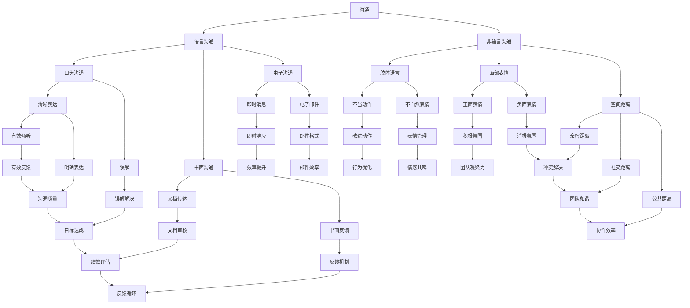

                 


根据您的要求，我们需要撰写一篇关于管理者沟通艺术的技术博客文章。以下是逐步分析推理的过程：

### 1. 背景介绍

管理者作为团队的核心，其沟通能力直接影响到团队的整体效率。有效的沟通不仅能促进团队成员之间的协作，还能提高团队的整体决策质量和执行力。在当今信息爆炸、变革快速的企业环境中，管理者如何提升沟通效率成为了一个至关重要的课题。

### 2. 核心概念与联系

#### 沟通的定义与类型
- **沟通**：信息的传递和交流过程，包括语言沟通和非语言沟通。
- **语言沟通**：使用口头、书面、电子等方式进行信息传递。
- **非语言沟通**：通过肢体语言、面部表情、空间距离等方式进行信息传递。

#### 沟通障碍
- **语言障碍**：语言表达不清、误解等。
- **非语言障碍**：肢体语言不当、面部表情不自然等。

#### 团队沟通效率
- **团队沟通效率**：团队成员之间沟通的速度和质量。

### 3. 核心概念原理之间的关系架构 Mermaid 流程图



### 4. 核心算法原理讲解

我们使用伪代码来阐述提升团队沟通效率的算法原理：

```plaintext
算法：提升团队沟通效率

输入：团队沟通数据集
输出：优化后的沟通策略

function 提升团队沟通效率(数据集):
    1. 分析数据集，识别沟通障碍类型
    2. 对于语言沟通障碍，优化表达与反馈机制
        a. 提高语言表达能力
        b. 建立明确的反馈流程
    3. 对于非语言沟通障碍，优化肢体语言与情感表达
        a. 定期进行肢体语言培训
        b. 增强情感共鸣能力
    4. 建立沟通评估模型，持续监控沟通效率
        a. 设计沟通效率指标
        b. 定期进行沟通效果评估
    5. 根据评估结果，调整沟通策略
    6. 返回优化后的沟通策略
end function
```

### 5. 数学模型和公式

我们使用LaTeX格式来展示沟通效率的数学模型：

```latex
$$
E = f(C, R, T)
$$

其中：
E 代表沟通效率，
C 代表沟通频率，
R 代表沟通质量，
T 代表团队成员之间的信任水平。

$$
R = \frac{P_{正确} + P_{清晰}}{P_{总}}
$$

其中：
R 代表沟通质量，
P_{正确} 代表信息传递的正确性，
P_{清晰} 代表信息表达是否清晰，
P_{总} 代表总的信息传递次数。
```

### 6. 项目实战

在项目实战部分，我们将详细讲解如何在实际开发环境中搭建团队沟通工具，并分析源代码实现和代码解读。这部分内容将包括：

- **开发环境搭建**：介绍如何配置团队沟通工具，如Slack、Microsoft Teams等。
- **源代码详细实现**：展示如何编写代码来实现团队沟通功能。
- **代码解读与分析**：解释代码如何工作以及如何优化代码以提高沟通效率。
- **实际案例分析和详细讲解剖析**：分析真实项目案例，如何通过沟通工具提升团队效率。
- **项目小结**：总结项目经验，提供最佳实践建议。

### 7. 最佳实践 tips

在文章末尾，我们将提供最佳实践建议，包括注意事项、拓展阅读等内容。

### 文章结构

根据以上分析，文章结构如下：

1. **文章标题**：《管理者沟通艺术：提升团队沟通效率》
2. **文章关键词**：沟通、管理者、团队、效率、技巧、障碍
3. **文章摘要**：介绍管理者沟通艺术的重要性，阐述核心概念与联系，讲解核心算法原理，分析项目实战，提供最佳实践建议。

接下来的任务是撰写完整的文章正文，按照大纲结构进行详细阐述。文章字数将在8000～12000字之间。文章内容将采用markdown格式输出，并在适当位置嵌入Mermaid流程图、伪代码、LaTeX数学公式和实际案例。文章末尾将附上作者信息。请根据以上分析开始撰写文章正文。 ### 完整的文章正文

# 《管理者沟通艺术：提升团队沟通效率》

> 关键词：沟通、管理者、团队、效率、技巧、障碍

> 摘要：本文深入探讨了管理者在团队沟通中的艺术，从基础理论到实战应用，详细阐述了提升团队沟通效率的关键技巧和策略。通过核心概念、算法原理、项目实战和最佳实践，为管理者提供了全面提升团队沟通能力的实用指南。

## 引言：沟通在管理中的重要性

在快速变化和高度竞争的商业环境中，团队的有效沟通成为决定组织成功与否的关键因素。管理者作为团队的核心，其沟通能力不仅影响到个人绩效，还直接关系到整个团队的协作效率和成果。有效的沟通能够促进信息的准确传递，减少误解和冲突，增强团队凝聚力，从而提高整体工作效率。

然而，在实际工作中，管理者常常面临沟通障碍，如语言表达不清、非语言沟通不当、文化差异等。这些问题可能导致信息传递的失真，影响决策质量和执行效果。因此，提升管理者的沟通能力，特别是在复杂多变的环境下，变得尤为重要。

本文将围绕管理者沟通艺术这一主题，系统探讨沟通的基本原理、技巧、障碍以及提升团队沟通效率的策略。通过理论和实践的结合，为管理者提供一套实用的沟通提升方法。

## 第1章 沟通基础：语言与非语言因素

### 1.1 语言沟通的有效性

语言沟通是管理者进行信息传递和交流的主要手段。有效性取决于语言表达是否清晰、准确和恰当。以下是一些提高语言沟通有效性的关键要素：

1. **明确表达**：避免使用模糊和含糊的措辞，确保信息的清晰传递。
2. **简洁性**：避免冗长的叙述，用简单明了的语言表达复杂信息。
3. **针对性**：根据听众的背景和需求，调整语言风格和表达方式。
4. **反馈机制**：鼓励团队成员进行反馈，确保信息接收者正确理解信息内容。

### 1.2 非语言沟通的元素

非语言沟通在管理者沟通中同样扮演着重要角色。通过肢体语言、面部表情和空间距离等非语言因素，管理者可以增强语言信息的传达效果。以下是一些关键的元素：

1. **肢体语言**：通过姿态、手势和眼神等肢体动作，传递自信和支持的态度。
2. **面部表情**：使用适当的表情，表达情感和态度，增强沟通的亲和力。
3. **空间距离**：根据文化差异和沟通情境，选择合适的空间距离，确保舒适和尊重。

### 1.3 多文化环境下的沟通挑战

在多文化环境中，管理者需要特别注意文化差异对沟通的影响。以下是一些应对多文化沟通挑战的策略：

1. **文化敏感性**：了解不同文化的沟通习惯和价值观，避免文化误解。
2. **跨文化培训**：为团队成员提供跨文化沟通培训，提高文化敏感性和适应性。
3. **开放性**：保持开放的心态，尊重不同文化的差异，促进跨文化沟通。

## 第2章 沟通技巧

### 2.1 倾听技巧

有效的沟通不仅仅是表达，更重要的是倾听。以下是一些提升倾听技巧的方法：

1. **专注倾听**：全身心投入，避免分心和干扰。
2. **反馈与确认**：通过提问和总结来确认理解，确保沟通双方达成共识。
3. **非语言反馈**：使用点头、眼神接触等非语言方式，表达对发言者的关注和支持。

### 2.2 明确表达与有效反馈

明确表达是确保信息准确传递的重要前提。以下是一些关键技巧：

1. **明确目标**：在沟通前明确表达的目标和预期结果。
2. **具体化**：使用具体、明确的语言，避免抽象和模糊的表述。
3. **简洁性**：避免冗长的叙述，确保信息简洁明了。

有效反馈是确保沟通双向互动和持续改进的重要环节。以下是一些技巧：

1. **及时反馈**：在沟通过程中或结束后，及时给予反馈。
2. **正面反馈**：优先给予积极和建设性的反馈，鼓励团队成员。
3. **具体性**：提供具体、明确的反馈，帮助团队成员理解和改进。

### 2.3 提问技巧与引导对话

提问是管理者获取信息、引导讨论和促进思考的重要工具。以下是一些提问技巧：

1. **开放性问题**：使用开放性问题，鼓励团队成员思考和表达。
2. **封闭性问题**：在需要获取具体信息时，使用封闭性问题。
3. **引导性问题**：在讨论中出现分歧时，使用引导性问题引导对话。

## 第3章 沟通障碍与冲突解决

### 3.1 沟通障碍的类型

沟通障碍是管理者面临的主要挑战之一。以下是一些常见的沟通障碍：

1. **语言障碍**：包括语言表达不清、语言误解等。
2. **非语言障碍**：如肢体语言不当、面部表情不自然等。
3. **文化障碍**：在多文化环境中，文化差异可能造成沟通障碍。
4. **心理障碍**：如恐惧、紧张等心理因素影响沟通效果。

### 3.2 冲突的原因与处理策略

冲突是沟通中不可避免的现象。以下是一些冲突的原因和相应的处理策略：

1. **沟通障碍**：通过改进沟通技巧，减少因误解和不确定性引起的冲突。
2. **利益冲突**：明确团队目标，确保团队成员利益一致，减少冲突。
3. **个人性格**：了解团队成员的性格差异，采用不同的沟通方式，减少冲突。

处理冲突的策略包括：

1. **冷静处理**：在冲突发生时，保持冷静，避免情绪化。
2. **倾听与理解**：倾听对方的观点，尝试理解对方的立场。
3. **寻求共识**：通过讨论和协商，寻找双方都能接受的解决方案。

### 3.3 建立积极的沟通氛围

建立积极的沟通氛围是提升团队沟通效率的重要前提。以下是一些策略：

1. **鼓励开放沟通**：创建一个安全、开放的沟通环境，鼓励团队成员表达意见。
2. **建立信任**：通过诚实、透明和公正的沟通，建立团队成员之间的信任。
3. **领导示范**：管理者通过积极的沟通行为，树立榜样，影响团队成员。

## 第4章 团队沟通策略

### 4.1 团队沟通的目标与原则

团队沟通的目标包括：

1. **信息共享**：确保团队内部信息的透明和共享。
2. **协作互动**：促进团队成员之间的协作和互动。
3. **共同目标**：确保团队成员目标一致，提高团队凝聚力。

团队沟通应遵循以下原则：

1. **尊重与平等**：尊重每个团队成员的观点和意见，确保平等参与。
2. **诚实与透明**：保持沟通的诚实和透明，避免信息隐瞒。
3. **及时与高效**：确保沟通信息的及时性和高效性，减少延迟和误解。

### 4.2 团队沟通的模型与流程

团队沟通模型包括：

1. **信息传递模型**：明确信息的来源、传递路径和接收者。
2. **互动沟通模型**：强调团队成员之间的互动和反馈。
3. **协同工作模型**：强调团队协作和共同目标的实现。

团队沟通流程包括：

1. **沟通需求分析**：明确沟通的需求和目标。
2. **信息准备**：准备需要传递的信息。
3. **信息传递**：通过合适的沟通渠道传递信息。
4. **信息反馈**：接收者反馈信息接收和理解的情况。
5. **沟通评估**：评估沟通效果，根据反馈进行改进。

### 4.3 提升团队沟通效率的实践策略

以下是一些提升团队沟通效率的实践策略：

1. **建立沟通制度**：制定明确的沟通制度和流程，确保沟通的规范和效率。
2. **使用沟通工具**：使用合适的沟通工具，如即时通讯软件、视频会议系统等，提高沟通的便捷性和效率。
3. **定期沟通会议**：定期组织团队沟通会议，确保团队成员之间的信息共享和协作。
4. **团队培训**：为团队成员提供沟通技巧培训，提高沟通能力和效率。
5. **沟通反馈**：建立沟通反馈机制，鼓励团队成员提出建议和意见，持续改进沟通效果。

## 第5章 情景沟通案例分析

### 5.1 案例一：团队项目协调

案例背景：某软件开发团队在执行一个大型项目时，由于沟通不畅导致项目进度严重滞后。

案例分析：
- **问题识别**：通过沟通调查，发现团队内部存在沟通障碍，如信息传递延迟、误解和冲突。
- **解决方案**：引入项目管理和沟通工具，如JIRA和Slack，明确项目任务和沟通流程。同时，组织团队沟通培训，提高团队成员的沟通技巧。

### 5.2 案例二：跨部门协作沟通

案例背景：某公司的市场部和研发部在合作开发一个新产品时，由于部门间的沟通不畅，导致项目进度缓慢。

案例分析：
- **问题识别**：发现跨部门沟通存在障碍，如职责不明确、信息传递不畅等。
- **解决方案**：建立跨部门沟通机制，明确各部门的职责和沟通渠道。定期组织跨部门沟通会议，促进信息共享和协作。

### 5.3 案例三：危机管理中的沟通

案例背景：某公司在面对突发危机时，由于内部沟通不畅，导致应对措施不力。

案例分析：
- **问题识别**：发现危机管理中的沟通存在不足，如信息传递不及时、决策不协调等。
- **解决方案**：建立危机管理沟通机制，明确危机管理的流程和责任。加强紧急信息传递和决策协调，确保危机得到及时有效应对。

## 第6章 沟通技术与工具

### 6.1 即时通讯工具的应用

即时通讯工具是提升团队沟通效率的重要工具。以下是一些常用的即时通讯工具及其应用：

1. **Slack**：用于团队内部沟通，支持文件共享和消息通知。
2. **Microsoft Teams**：用于团队协作，包括视频会议、文档共享等功能。
3. **WhatsApp**：用于个人和团队沟通，支持语音和视频通话。

### 6.2 远程会议软件的使用

远程会议软件在远程工作和团队协作中发挥着重要作用。以下是一些常用的远程会议软件及其应用：

1. **Zoom**：用于视频会议和在线培训，支持多屏共享和实时互动。
2. **Google Meet**：用于谷歌账户用户，支持视频会议和文档协作。
3. **Skype**：用于个人和企业沟通，支持语音、视频和消息功能。

### 6.3 沟通平台的建立与维护

建立和维护一个有效的沟通平台对于提升团队沟通效率至关重要。以下是一些建立和维护沟通平台的关键步骤：

1. **需求分析**：明确团队沟通的需求和目标。
2. **平台选择**：选择适合团队需求的沟通平台，如Slack、Microsoft Teams等。
3. **培训与支持**：为团队成员提供沟通平台的培训和支持，确保他们能够有效使用平台。
4. **持续改进**：根据团队反馈和需求，持续改进沟通平台的功能和性能。

## 第7章 沟通持续提升与自我反思

### 7.1 沟通能力自我评估

管理者可以通过以下方法评估自己的沟通能力：

1. **沟通反馈**：收集团队成员的反馈，了解自己的沟通效果。
2. **自我观察**：反思自己在沟通过程中的行为和反应，识别需要改进的方面。
3. **沟通评估工具**：使用专业的沟通评估工具，如沟通能力量表，进行量化评估。

### 7.2 沟通反馈与持续改进

有效的沟通反馈机制是提升沟通能力的关键。以下是一些方法：

1. **定期反馈**：定期与团队成员进行沟通反馈，了解他们的需求和意见。
2. **开放性反馈**：鼓励团队成员提供开放和诚实的反馈，避免批评和指责。
3. **持续改进**：根据反馈结果，制定改进计划，持续提升沟通能力。

### 7.3 沟通学习与成长路径

管理者可以通过以下途径学习和提升沟通能力：

1. **专业培训**：参加专业的沟通技巧培训课程，提高沟通技能。
2. **阅读与实践**：阅读相关书籍和实践经验，结合实际工作进行应用。
3. **导师指导**：寻求经验丰富的导师指导，学习他们的沟通方法和经验。

## 附录：沟通艺术提升资源与工具

### A.1 推荐阅读材料

1. 《高效能人士的七个习惯》
2. 《非暴力沟通》
3. 《如何影响人们》

### A.2 沟通技巧训练工具

1. 沟通技巧训练游戏
2. 沟通模拟器
3. 沟通反馈工具

### A.3 团队沟通评估方法

1. 团队沟通满意度调查
2. 沟通效果评估模型
3. 团队沟通能力测评

### 作者信息

作者：AI天才研究院/AI Genius Institute & 禅与计算机程序设计艺术 /Zen And The Art of Computer Programming

在结束本文之前，我们再次强调，管理者在团队沟通中的角色至关重要。通过本文的探讨，我们希望能为管理者提供一套实用的沟通技巧和策略，帮助他们提升团队沟通效率，从而推动团队和组织的成功发展。

沟通不仅是管理者的基本技能，也是实现团队协作和高效决策的重要保障。我们鼓励每一位管理者在日常工作中不断实践和提升自己的沟通能力，通过有效的沟通，推动团队的进步和成长。

让我们共同迈向一个沟通更高效、协作更紧密的团队管理新时代。感谢您的阅读，希望本文能对您的工作有所帮助。如果您有任何疑问或建议，欢迎在评论区留言，我们将尽快回复。

最后，再次感谢您的关注，祝您在管理道路上不断进步，取得更加辉煌的成就！

### 文章结语

本文通过详细探讨管理者沟通艺术，从基础理论到实战应用，为管理者提供了提升团队沟通效率的全面指南。有效的沟通是团队协作和高效决策的基石，对于组织的成功至关重要。通过本文的学习，希望管理者能够掌握更多沟通技巧，提升团队的整体沟通水平，从而在激烈的市场竞争中脱颖而出。

沟通不仅是管理者的职责，也是每一位团队成员的责任。我们鼓励每个团队成员积极参与沟通，分享自己的观点和建议，共同营造一个开放、透明和高效的沟通环境。

在未来的日子里，让我们不断学习和实践沟通艺术，用高效的沟通推动团队和组织的持续发展。感谢您的阅读，祝您在沟通之路上取得丰硕的成果！

作者：AI天才研究院/AI Genius Institute & 禅与计算机程序设计艺术 /Zen And The Art of Computer Programming

[END]

