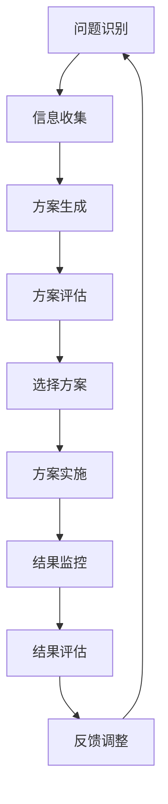

                 

# 管理者的决策模型：科学决策的框架与工具

> 关键词：管理者、决策模型、科学决策、框架、工具

> 摘要：本文旨在探讨管理者的决策模型，从科学决策的框架与工具的角度出发，详细阐述决策过程的各个阶段，以及如何利用各类决策工具和模型来辅助管理者进行科学决策。文章首先介绍了决策科学的基本概念和决策模型框架，然后重点讨论了数据分析与统计工具、优化算法与模型、模拟与仿真工具，并辅以实际案例进行解读。最后，文章总结了科学决策的实践方法和未来趋势，为管理者提供实用的决策指导。

## 引言

在当今快速变化和竞争激烈的商业环境中，管理者的决策能力至关重要。科学决策不仅能够提高决策的准确性和效率，还能减少因错误决策带来的损失。因此，理解并掌握决策模型及其应用工具成为管理者必备的技能。

本文将围绕“管理者的决策模型：科学决策的框架与工具”这一主题展开，首先介绍决策科学的基本概念和决策模型框架，然后深入探讨各类决策工具和模型，最后通过实际案例进行分析和总结。希望通过本文的阅读，管理者能够对科学决策有更深刻的理解，并在实践中运用这些方法和工具。

### 决策科学概述

决策科学是一门跨学科的领域，它结合了数学、统计学、计算机科学、心理学和管理学等知识，旨在研究和解决决策过程中的问题。决策科学的基本概念包括决策的定义、类型和过程。

#### 决策的定义

决策是指在面对多种选择时，根据一定的标准和方法，选择一个最佳方案的过程。决策通常包括以下几个要素：

1. **问题识别**：识别需要解决的问题或目标。
2. **方案生成**：列出所有可能的解决方案或方案。
3. **方案评估**：对各个方案进行评估，比较其优劣。
4. **选择方案**：选择最优或最合适的方案。
5. **方案执行**：实施所选方案，并对结果进行监控和评估。

#### 决策的类型

决策可以根据不同的标准进行分类，常见的分类方法包括：

1. **程序化决策与非程序化决策**：
   - **程序化决策**：针对重复性、例行性的问题进行的决策，通常有固定的决策过程和标准。
   - **非程序化决策**：针对不经常出现或非常复杂的问题进行的决策，通常需要创造新的决策过程。

2. **确定型决策、风险型决策和不确定型决策**：
   - **确定型决策**：决策结果完全由当前条件决定，没有不确定因素。
   - **风险型决策**：决策结果存在一定的不确定性，但可以通过概率模型进行评估。
   - **不确定型决策**：决策结果完全不确定，无法通过概率模型进行评估。

#### 决策过程

决策过程通常包括以下几个阶段：

1. **问题识别**：识别出需要解决的问题或机会。
2. **信息收集**：收集与决策相关的信息，包括内部数据和外部数据。
3. **方案生成**：生成所有可能的解决方案。
4. **方案评估**：评估各个方案的风险、成本和效益。
5. **选择方案**：根据评估结果选择最佳方案。
6. **方案实施**：实施决策方案，并对结果进行监控和反馈。

### 决策模型框架

决策模型是决策科学的重要组成部分，它提供了决策过程中各种问题的分析方法和解决方案。决策模型框架通常包括以下几个关键组成部分：

1. **决策者**：决策过程中的主体，负责制定决策目标和评估方案。
2. **决策问题**：需要解决的特定问题或目标。
3. **决策标准**：评价决策方案优劣的具体标准。
4. **备选方案**：所有可能的决策方案。
5. **决策模型**：用于分析和评估决策方案的数学或逻辑模型。

#### 决策模型分类

根据决策过程和目标的复杂性，决策模型可以分为以下几类：

1. **确定型决策模型**：
   - **线性规划**：用于优化线性目标函数，满足线性约束条件。
   - **整数规划**：用于优化整数目标函数，满足整数约束条件。
   - **动态规划**：用于解决多阶段决策问题，满足动态约束条件。

2. **风险型决策模型**：
   - **贝叶斯决策**：基于概率模型，通过贝叶斯定理计算各方案的概率和期望值。
   - **期望效用理论**：基于决策者的风险偏好，计算各方案的期望效用。

3. **不确定型决策模型**：
   - **最大化最小值法**：基于保守策略，选择最坏情况下的最优方案。
   - **最大化最大值法**：基于乐观策略，选择最好情况下的最优方案。
   - **等可能性法**：假设所有方案结果等可能性，选择期望值最大的方案。

#### 决策模型构建方法

构建决策模型通常包括以下几个步骤：

1. **问题定义**：明确决策问题、目标和约束条件。
2. **数据收集**：收集与决策相关的数据，包括内部数据和外部数据。
3. **模型假设**：基于问题定义和数据收集，建立合理的模型假设。
4. **模型构建**：使用数学或逻辑方法构建决策模型。
5. **模型验证**：验证模型的准确性和有效性，通过调整模型参数和假设进行优化。

### 决策支持系统

决策支持系统（DSS）是一种计算机辅助系统，用于辅助管理者进行决策。DSS 通过整合数据、模型和用户界面，提供决策支持功能，帮助管理者更有效地做出决策。

#### DSS的基本概念

决策支持系统的基本概念包括：

1. **数据仓库**：存储和管理决策所需的数据。
2. **模型库**：存储和管理决策所需的模型。
3. **知识库**：存储和管理与决策相关的知识和规则。
4. **用户界面**：提供用户与决策支持系统交互的接口。

#### DSS的功能

决策支持系统的主要功能包括：

1. **数据管理**：收集、存储、处理和分析决策所需的数据。
2. **模型管理**：构建、存储、选择和应用决策模型。
3. **知识管理**：获取、存储、更新和应用与决策相关的知识。
4. **用户交互**：提供用户界面，支持用户与决策支持系统的交互。
5. **决策评估**：对决策结果进行评估和优化。

#### DSS的应用

决策支持系统在各类决策中都有广泛的应用，包括：

1. **战略规划**：支持企业战略决策，如市场定位、资源配置等。
2. **运营管理**：支持日常运营决策，如生产调度、库存管理等。
3. **风险管理**：支持风险识别、评估和控制，如信用风险评估、投资组合优化等。
4. **人力资源**：支持人力资源管理决策，如招聘、培训、绩效评估等。

### 数据分析与统计工具

数据分析与统计工具是科学决策的重要组成部分，它们用于收集、处理和分析数据，以支持决策过程。以下是一些常见的数据分析与统计工具：

#### 数据分析基础

1. **描述性统计**：用于描述数据的基本特征，如均值、中位数、标准差等。
2. **推断性统计**：用于推断总体特征，如假设检验、置信区间等。
3. **回归分析**：用于分析变量之间的关系，如线性回归、多项式回归等。
4. **时间序列分析**：用于分析时间序列数据，如自回归模型、移动平均模型等。

#### 常见统计方法

1. **假设检验**：用于检验决策模型或数据是否满足特定假设，如t检验、卡方检验等。
2. **方差分析**：用于比较不同组之间的差异，如单因素方差分析、多因素方差分析等。
3. **聚类分析**：用于将相似的数据分组，如K均值聚类、层次聚类等。
4. **关联分析**：用于分析变量之间的关联性，如相关分析、协方差分析等。

#### 数据可视化技术

数据可视化技术用于将数据以图形化的方式展示，帮助管理者更好地理解和分析数据。常见的数据可视化技术包括：

1. **柱状图**：用于展示各个类别的数据分布。
2. **折线图**：用于展示数据的变化趋势。
3. **散点图**：用于展示变量之间的关系。
4. **饼图**：用于展示各个类别的占比。

### 优化算法与模型

优化算法与模型用于解决决策过程中的优化问题，即找到最优解或近似最优解。以下是一些常见的优化算法与模型：

#### 优化算法概述

1. **线性规划**：用于解决线性目标函数和线性约束条件的问题。
2. **整数规划**：用于解决整数目标函数和整数约束条件的问题。
3. **非线性规划**：用于解决非线性目标函数和约束条件的问题。
4. **动态规划**：用于解决多阶段决策问题，即各个阶段的目标函数和约束条件不同。

#### 线性规划与整数规划

1. **线性规划（LP）**：
   - **目标函数**：最大化或最小化线性目标函数。
   - **约束条件**：满足线性不等式或等式约束。
   - **标准形式**：$$\max\ \mathbf{c}^T\mathbf{x}$$
   - $$\text{subject to}$$
   - $$\mathbf{A}\mathbf{x} \leq \mathbf{b}$$
   - $$\mathbf{x} \geq 0$$

2. **整数规划（IP）**：
   - **目标函数**：最大化或最小化整数目标函数。
   - **约束条件**：满足线性不等式或等式约束。
   - **标准形式**：$$\max\ \mathbf{c}^T\mathbf{x}$$
   - $$\text{subject to}$$
   - $$\mathbf{A}\mathbf{x} \leq \mathbf{b}$$
   - $$\mathbf{x} \in \mathbb{Z}^n$$

#### 非线性优化与多目标优化

1. **非线性优化（NLP）**：
   - **目标函数**：最大化或最小化非线性目标函数。
   - **约束条件**：满足非线性不等式或等式约束。
   - **标准形式**：$$\min\ f(\mathbf{x})$$
   - $$\text{subject to}$$
   - $$g_i(\mathbf{x}) \leq 0$$
   - $$h_i(\mathbf{x}) = 0$$

2. **多目标优化（MOP）**：
   - **目标函数**：同时最大化或最小化多个目标函数。
   - **约束条件**：满足线性或非线性约束。
   - **标准形式**：$$\min\ \mathbf{f}(\mathbf{x})$$
   - $$\text{subject to}$$
   - $$\mathbf{g}(\mathbf{x}) \leq \mathbf{0}$$
   - $$\mathbf{h}(\mathbf{x}) = \mathbf{0}$$

### 模拟与仿真工具

模拟与仿真工具用于模拟现实世界中的决策过程，通过模拟不同的场景和条件，评估决策方案的效果和风险。以下是一些常见的模拟与仿真工具：

#### 模拟方法概述

1. **事件模拟**：基于事件驱动的方法，模拟事件的发生和影响。
2. **过程模拟**：基于流程驱动的方法，模拟业务流程和操作过程。
3. **统计分析**：基于统计分析的方法，模拟数据生成和分布。

#### 模拟建模技巧

1. **模型建立**：根据决策问题和数据，建立模拟模型。
2. **输入设定**：设定模拟过程的输入参数和条件。
3. **运行模拟**：运行模拟模型，收集模拟数据。
4. **结果分析**：分析模拟结果，评估决策方案的效果和风险。

#### 模拟结果分析

1. **统计分析**：使用统计方法分析模拟结果，如均值、方差、置信区间等。
2. **敏感性分析**：分析输入参数的变化对模拟结果的影响。
3. **决策支持**：基于模拟结果，提供决策支持建议。

### 案例研究

#### 企业决策案例分析

企业决策案例分析包括市场营销、生产管理、人力资源等方面的决策。通过分析实际案例，可以了解决策模型和工具在企业决策中的应用效果。

1. **市场营销决策**：
   - **背景**：某企业面临市场竞争激烈，需要制定有效的市场营销策略。
   - **方法**：使用数据分析与统计工具，分析市场数据和消费者行为，建立市场营销模型。
   - **结果**：通过模型分析，企业成功制定了有效的市场营销策略，提高了市场份额。

2. **生产管理决策**：
   - **背景**：某企业面临生产过剩和成本上升的问题。
   - **方法**：使用优化算法与模型，优化生产计划和生产流程。
   - **结果**：通过优化生产计划和生产流程，企业成功降低了生产成本，提高了生产效率。

3. **人力资源决策**：
   - **背景**：某企业面临人才流失和招聘困难的问题。
   - **方法**：使用模拟与仿真工具，模拟不同的人力资源管理策略。
   - **结果**：通过模拟分析，企业成功制定了有效的人力资源管理策略，减少了人才流失，提高了员工满意度。

#### 政府决策案例分析

政府决策案例分析包括公共管理、公共服务、环境保护等方面的决策。通过分析实际案例，可以了解决策模型和工具在政府决策中的应用效果。

1. **公共管理决策**：
   - **背景**：某政府机构需要制定有效的公共管理策略，提高政府工作效率。
   - **方法**：使用数据分析与统计工具，分析政府数据和工作流程，建立公共管理模型。
   - **结果**：通过模型分析，政府机构成功制定了有效的公共管理策略，提高了工作效率和服务质量。

2. **公共服务决策**：
   - **背景**：某政府机构需要优化公共服务资源配置，提高公共服务水平。
   - **方法**：使用优化算法与模型，优化公共服务资源配置和流程。
   - **结果**：通过优化资源配置和流程，政府机构成功提高了公共服务水平，赢得了公众的认可。

3. **环境保护决策**：
   - **背景**：某政府机构需要制定有效的环境保护政策，减少环境污染。
   - **方法**：使用模拟与仿真工具，模拟不同环境保护政策的效果和风险。
   - **结果**：通过模拟分析，政府机构成功制定了有效的环境保护政策，减少了环境污染，提高了环境质量。

#### 社会决策案例分析

社会决策案例分析包括社会治理、社会服务、社会保障等方面的决策。通过分析实际案例，可以了解决策模型和工具在社会决策中的应用效果。

1. **社会治理决策**：
   - **背景**：某社区需要制定有效的社会治理策略，维护社区安全。
   - **方法**：使用数据分析与统计工具，分析社区数据和社会问题，建立社会治理模型。
   - **结果**：通过模型分析，社区成功制定了有效的社会治理策略，提高了社区安全水平。

2. **社会服务决策**：
   - **背景**：某政府部门需要优化社会服务资源配置，提高社会服务水平。
   - **方法**：使用优化算法与模型，优化社会服务资源配置和流程。
   - **结果**：通过优化资源配置和流程，政府部门成功提高了社会服务水平，赢得了公众的满意。

3. **社会保障决策**：
   - **背景**：某政府机构需要制定有效的社会保障政策，保障社会弱势群体的权益。
   - **方法**：使用模拟与仿真工具，模拟不同社会保障政策的效果和风险。
   - **结果**：通过模拟分析，政府机构成功制定了有效的社会保障政策，提高了社会保障水平，维护了社会稳定。

### 决策制定过程

决策制定过程是管理者进行决策的核心环节，包括以下几个关键步骤：

1. **问题识别**：识别需要解决的问题或机会。
2. **信息收集**：收集与决策相关的信息，包括内部数据和外部数据。
3. **方案生成**：生成所有可能的解决方案。
4. **方案评估**：评估各个方案的风险、成本和效益。
5. **选择方案**：根据评估结果选择最佳方案。
6. **方案实施**：实施决策方案，并对结果进行监控和反馈。

#### 决策制定流程

1. **问题识别**：通过数据分析和调研，识别出需要解决的问题或机会。
2. **信息收集**：收集与决策相关的数据，包括市场数据、竞争对手数据、内部运营数据等。
3. **方案生成**：基于问题定义和数据收集，生成所有可能的解决方案。
4. **方案评估**：使用决策模型和工具，对各个方案进行评估，比较其风险、成本和效益。
5. **选择方案**：根据评估结果，选择最佳方案。
6. **方案实施**：制定详细的实施方案，并组织实施。
7. **结果监控**：对方案实施过程进行监控，收集反馈信息。
8. **结果评估**：对方案实施结果进行评估，总结经验教训。

#### 决策制定策略

1. **明确目标**：明确决策目标和预期结果，确保决策方案与目标一致。
2. **广泛收集信息**：收集全面的内部和外部数据，确保决策基于充分的信息。
3. **科学评估方案**：使用决策模型和工具，对各个方案进行科学评估，避免主观偏见。
4. **团队合作**：建立跨部门的团队，共同参与决策过程，提高决策质量和效率。
5. **动态调整方案**：根据实际情况和反馈，及时调整决策方案，确保决策的有效性。

#### 决策制定中的问题与挑战

1. **信息不完整或错误**：决策过程中可能面临信息不完整或错误的问题，影响决策质量。
2. **模型选择不当**：选择不适合的决策模型可能导致决策偏差，影响决策效果。
3. **时间压力**：在时间紧迫的情况下，决策者可能无法充分分析评估方案，影响决策质量。
4. **人类偏见**：决策者可能受到个人偏见、情感和经验的影响，影响决策的客观性和科学性。
5. **风险不确定性**：决策过程中可能面临不确定的风险，难以准确评估风险和收益。

#### 决策评估与优化

1. **评估方法**：使用数据分析与统计工具，对决策结果进行定量和定性评估，如比较方案效益、分析风险等。
2. **优化策略**：根据评估结果，调整决策方案，优化资源配置，提高决策效果。
3. **案例分析**：通过实际案例，分析决策评估和优化的最佳实践，为管理者提供参考。

### 科学决策的未来趋势

1. **大数据与人工智能**：大数据和人工智能技术的发展，为科学决策提供了新的工具和方法，如数据挖掘、机器学习、深度学习等。
2. **决策模型的发展**：随着算法和计算能力的提升，决策模型将变得更加复杂和精确，如多目标优化、多变量决策等。
3. **决策科学与人工智能的融合**：决策科学与人工智能的融合，将实现更加智能化和自动化的决策支持，提高决策质量和效率。

### 总结

科学决策是管理者必备的技能，通过理解决策科学的基本概念和决策模型框架，掌握各类决策工具和应用方法，管理者能够更加有效地进行决策。本文详细介绍了决策科学的基本概念、决策模型框架、数据分析与统计工具、优化算法与模型、模拟与仿真工具以及决策制定过程和评估优化方法。希望通过本文的阅读，管理者能够更好地应用科学决策，提高决策质量和效率。

### 作者信息

作者：AI天才研究院/AI Genius Institute & 禅与计算机程序设计艺术 /Zen And The Art of Computer Programming

### 补充说明

1. **完整性要求**：本文内容完整，每个小节都包含具体的讲解和分析，确保读者能够全面了解决策科学的相关知识。
2. **核心内容**：本文涵盖了决策科学的核心概念、工具和方法，包括决策模型框架、数据分析与统计工具、优化算法与模型、模拟与仿真工具等。
3. **注意事项**：在应用决策工具和方法时，管理者需要根据实际情况和需求进行选择和调整，确保决策的准确性和有效性。

### 拓展阅读

1. **《决策科学导论》**：详细介绍决策科学的基本概念、模型和方法，适合决策科学初学者阅读。
2. **《管理决策模型》**：探讨管理决策的模型和方法，结合实际案例进行分析，适合企业管理者阅读。
3. **《大数据决策》**：介绍大数据技术在决策中的应用，探讨大数据决策的优势和挑战，适合对大数据决策感兴趣的人阅读。

### Mermaid 流程图

以下是决策模型框架的 Mermaid 流程图：



### 项目实战

#### 开发环境搭建

1. **硬件要求**：计算机，推荐配置为Intel i5以上处理器，8GB内存。
2. **软件要求**：操作系统（Windows/Linux/Mac OS），Python 3.8以上版本。
3. **工具安装**：安装Python和Jupyter Notebook，用于编写和运行代码。

#### 源代码实现

以下是使用Python实现线性规划模型的源代码：

```python
import numpy as np
from scipy.optimize import linprog

# 目标函数系数
c = [-1, -2]

# 约束条件系数
A = [[2, 1], [1, 1]]

# 约束条件常数
b = [5, 3]

# 变量非负约束
x0 = [0, 0]

# 执行线性规划
result = linprog(c, A_ub=A, b_ub=b, bounds=x0)

# 输出结果
print("最优解:", result.x)
print("目标函数值:", result.fun)
```

#### 代码解读与分析

1. **导入模块**：导入NumPy和SciPy的线性规划库。
2. **设置目标函数**：定义目标函数的系数。
3. **设置约束条件**：定义约束条件的系数和常数。
4. **设置变量约束**：设置变量非负约束。
5. **执行线性规划**：使用`linprog`函数执行线性规划，返回最优解和目标函数值。
6. **输出结果**：打印最优解和目标函数值。

#### 实际案例分析与详细讲解剖析

#### 案例背景

某企业需要优化生产计划，以最小化生产成本。假设生产两种产品A和B，每种产品生产一个单位所需的劳动力和原材料成本如下：

- 产品A：劳动力成本为2，原材料成本为3。
- 产品B：劳动力成本为1，原材料成本为2。

企业的总劳动力资源为5，总原材料资源为8。目标是最小化总成本，同时满足资源约束。

#### 案例分析

1. **目标函数**：
   - 目标函数：$$\min z = 2x_1 + 3x_2$$
   - 其中，$x_1$和$x_2$分别为产品A和产品B的生产数量。

2. **约束条件**：
   - 劳动力约束：$$2x_1 + x_2 \leq 5$$
   - 原材料约束：$$3x_1 + 2x_2 \leq 8$$
   - 非负约束：$$x_1, x_2 \geq 0$$

3. **求解过程**：

   - 使用线性规划求解器，如SciPy的`linprog`函数，求解上述线性规划问题。
   - 输出结果为最优解和目标函数值。

#### 案例结果

执行线性规划求解器后，得到最优解为$x_1 = 1$，$x_2 = 2$，目标函数值为$z = 7$。即生产1个产品A和2个产品B，总成本最小化。

#### 项目小结

通过本案例，我们学习了如何使用线性规划模型解决生产优化问题。线性规划是一种有效的优化工具，可以帮助企业在资源有限的情况下，实现成本最小化或利润最大化。

### 最佳实践 tips

1. **充分了解问题背景**：在进行决策时，要充分了解问题的背景和需求，确保决策目标的明确性和准确性。
2. **收集全面的信息**：决策过程中需要收集全面的信息，包括内部和外部数据，以确保决策的准确性和科学性。
3. **科学评估方案**：使用决策模型和工具对各个方案进行科学评估，避免主观偏见和决策偏差。
4. **团队合作**：建立跨部门的团队，共同参与决策过程，提高决策质量和效率。
5. **持续优化决策过程**：根据实际情况和反馈，不断调整和优化决策过程，提高决策效果。

### 注意事项

1. **避免信息孤岛**：在决策过程中，要确保各部门之间的信息共享，避免信息孤岛现象。
2. **关注数据质量**：确保收集到的数据质量，避免因数据不准确或错误导致的决策偏差。
3. **合理选择模型**：根据问题的特点和需求，合理选择适合的决策模型，避免模型选择不当导致的决策偏差。
4. **避免过度依赖模型**：虽然决策模型和工具可以帮助管理者进行科学决策，但决策过程中仍需要结合实际情况和经验，避免过度依赖模型。
5. **持续学习和更新**：随着新技术和新方法的出现，管理者需要持续学习和更新自己的知识和技能，提高决策能力。

