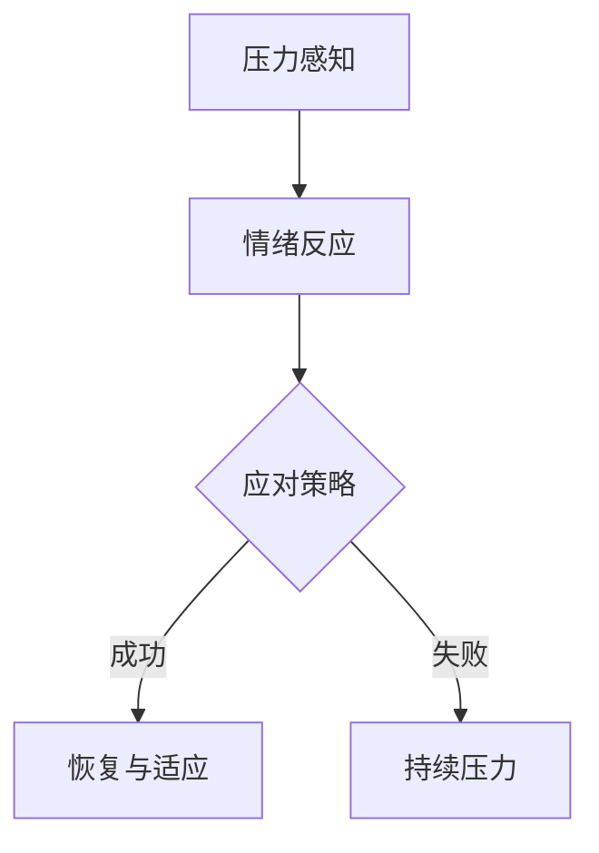

                 

### 引言

在现代企业管理中，管理者承担着多重责任和压力，他们的决策和领导能力直接影响着团队效率和公司业绩。然而，随着工作强度的增加和复杂性的提升，管理者也面临着巨大的压力。长时间的高压环境不仅会影响管理者的身心健康，还可能对工作质量和团队氛围产生负面影响。因此，如何有效调节和管理压力，保持工作与生活的平衡，成为了每位管理者都必须面对的重要课题。

压力是现代社会中普遍存在的现象，对于管理者来说，工作压力和生活压力的双重作用往往使其处于高度紧张的状态。工作压力可能源于繁重的工作任务、严格的绩效要求、复杂的人际关系以及快速变化的市场环境。而生活压力则包括家庭责任、经济负担、健康问题等。这些压力源如果不加以合理调节，可能会导致情绪问题、身体健康问题，甚至影响职业生涯的长远发展。

本文旨在探讨管理者的压力调节问题，帮助读者理解压力的本质、识别压力的类型，并介绍一系列有效的策略和方法。通过逻辑清晰的分析和实用的技巧，我们将帮助管理者在繁忙的工作中找到平衡，提升工作效率和生活质量。

本文将分为三个主要部分。首先，我们将介绍压力调节的基本原理，包括压力的定义与类型、压力调节的理论基础以及核心概念与联系。接下来，我们将探讨实践策略与方法，包括时间管理策略、情绪调节技巧、社交支持与互助网络以及健康生活方式的重要性。最后，我们将通过实际案例分析和项目实战，展示这些策略和方法在实际中的应用效果，并总结压力调节的长期效果和未来研究方向与趋势。

通过本文的阅读，读者将能够获得以下收获：
1. 深入理解压力的本质和类型。
2. 掌握有效的压力调节策略和方法。
3. 获得实际案例中的实践经验，提升个人管理能力。
4. 了解压力调节的长期效果和未来发展方向。

让我们开始这一段关于压力调节和管理之旅，探索如何在繁忙的工作中保持健康与平衡。

---

### 第一部分：压力调节的基本原理

#### 第1章：压力的定义与类型

在讨论压力调节之前，首先需要了解压力的定义与类型。压力是一种身心反应，当个体感受到外界需求超出自身资源时，就会产生压力。这种需求可以是生理的、心理的或社会的，而资源则包括时间、能力、知识和社会支持等。

##### 1.1 压力的定义与来源

压力的定义可以用一个简单的公式来表示：

$$
\text{压力} = \frac{\text{需求量}}{\text{资源量}} \times \text{感知度}
$$

- **需求量**：指的是个体在特定情境下所需完成的任务或期望达到的目标。
- **资源量**：指的是个体可用的资源，包括时间、精力、知识、技能和社会支持等。
- **感知度**：是个体对压力源的主观感受程度，即个体对压力的认知和评价。

压力的来源可以大致分为工作压力和生活压力两大类。

- **工作压力**：主要来源于以下几个方面：
  - **工作任务繁重**：当工作量超出个人的承受范围时，会产生压力。
  - **时间紧迫感**：面对紧迫的截止日期和不断增长的任务清单，个体会感到压力。
  - **绩效压力**：管理者的绩效评价标准往往较为严格，这可能导致压力。
  - **人际关系**：复杂的人际关系网络可能会带来额外的压力。
  - **职业发展**：职业晋升和职业安全也可能成为工作压力的来源。

- **生活压力**：包括但不限于以下几个方面：
  - **家庭责任**：家庭中的抚养、教育和经济支持等责任都可能带来压力。
  - **健康问题**：自身或家庭成员的健康问题会引发焦虑和压力。
  - **经济负担**：财务问题，如贷款、投资损失等，也是常见的生活压力源。
  - **社会压力**：社会期望、社交活动等也会给个体带来压力。

##### 1.2 工作压力与生活压力

工作压力和生活压力虽然有所不同，但它们是相互关联的。工作压力可能会影响个人的生活质量，反之亦然。

- **工作压力对生活质量的影响**：
  - **身体健康**：长时间的工作压力可能导致失眠、焦虑、抑郁等健康问题。
  - **心理健康**：工作压力可能导致心理疲劳、情绪波动、工作满意度降低。
  - **家庭关系**：长期的工作压力可能导致与家庭成员的沟通减少，关系疏远。
  - **社交活动**：工作压力可能会减少个人的社交时间和社交活动，影响社交网络。

- **生活压力对工作的影响**：
  - **工作效率**：家庭或个人生活中的问题可能会分散注意力，降低工作效率。
  - **工作态度**：长期的生活压力可能导致工作态度消极，影响工作积极性。
  - **工作满意度**：生活压力可能导致对工作的满意度降低，进而影响职业发展和个人成就感。

##### 1.3 不同类型的压力及其特点

压力可以分为多种类型，每种类型的压力都有其独特的特点和影响。

- **正性压力**（Eustress）：
  - **定义**：正性压力是指那些能够激励和提升个体表现的压力。
  - **特点**：正性压力可以增强个体的动力，提高工作积极性和创造力。
  - **影响**：适度的正性压力有助于提高工作效率，促进个人成长。

- **负性压力**（Distress）：
  - **定义**：负性压力是指那些对个体健康和幸福感产生负面影响的压力。
  - **特点**：负性压力通常会导致焦虑、抑郁和身体不适。
  - **影响**：长期的负性压力可能导致心理健康问题、身体疾病和工作表现下降。

- **慢性压力**（Chronic Stress）：
  - **定义**：慢性压力是指长时间持续存在的压力。
  - **特点**：慢性压力通常来源于持续的工作压力或生活压力，如长期加班、长期经济困难等。
  - **影响**：慢性压力对个体的身心健康都有严重影响，可能导致长期的身体和心理健康问题。

- **急性压力**（Acute Stress）：
  - **定义**：急性压力是指短时间内的压力，通常由突发事件或突发挑战引起。
  - **特点**：急性压力通常会引起生理上的应激反应，如心跳加速、呼吸急促等。
  - **影响**：急性压力虽然对个体造成短暂的困扰，但如果处理得当，通常不会产生长期影响。

通过了解压力的定义、来源和类型，管理者可以更好地识别和应对压力，从而在工作和生活中找到平衡。下一章，我们将探讨压力调节的理论基础，深入分析个体对压力的反应机制和调节方法。

---

#### 第2章：压力调节的理论基础

压力调节是一个复杂的过程，涉及到心理学、生物学、社会学等多个学科领域。了解压力调节的理论基础，有助于我们更好地理解个体在面对压力时的反应机制，并制定有效的调节策略。本章将介绍压力调节的基本概念、个体对压力的反应机制以及心理弹性和韧性等关键理论。

##### 2.1 压力调节的概念

压力调节（Stress Regulation）是指个体通过一系列的心理、生理和行为策略来应对压力，减轻其负面影响，并促进自身的恢复和适应。有效的压力调节策略可以帮助个体更好地应对压力源，保持身心健康。

压力调节的核心在于两个方面：
1. **减轻压力**：通过各种方法减少压力源对个体的负面影响，例如通过时间管理和情绪调节技巧。
2. **增强适应能力**：通过提高个体的心理弹性（Resilience）和韧性（Toughness），使其能够更好地应对未来的压力。

##### 2.2 适应、应对与逃避反应

个体在面对压力时，通常会表现出三种基本的反应：适应反应、应对反应和逃避反应。

- **适应反应**（Adaptation）：
  - **定义**：适应反应是指个体调整自己的期望和需求，以适应压力源。
  - **机制**：通过认知重构、心理调适和适应性策略，个体可以减轻压力源对其的影响。
  - **例子**：当面对高强度的工作任务时，个体可能会重新设定目标，调整工作方式，以适应新的工作要求。

- **应对反应**（Coping）：
  - **定义**：应对反应是指个体采取实际行动来解决问题，减轻压力。
  - **机制**：通过问题解决策略和情绪调节策略，个体可以直接应对和解决压力源。
  - **例子**：当面临财务压力时，个体可能会通过削减开支、增加收入或寻求财务咨询来解决问题。

- **逃避反应**（Avoidance）：
  - **定义**：逃避反应是指个体避免面对或处理压力源。
  - **机制**：通过回避或否认压力源，个体可能暂时减轻压力，但长期来看，这种反应可能导致更大的心理和生理问题。
  - **例子**：当面临社交焦虑时，个体可能会选择避免社交活动，以避免焦虑情绪。

##### 2.3 心理弹性与韧性

心理弹性（Psychological Resilience）和韧性（Toughness）是压力调节过程中非常重要的概念。

- **心理弹性**：
  - **定义**：心理弹性是指个体从压力和困难中恢复的能力。
  - **机制**：心理弹性涉及到个体的适应能力、情感调节能力以及应对挑战的积极性。
  - **培养方法**：通过正念冥想、积极心理训练和人际支持，个体可以增强心理弹性。

- **韧性**：
  - **定义**：韧性是指个体在面对压力时展现出的适应性和持久性。
  - **机制**：韧性涉及到个体的抗挫折能力、抗压能力和积极应对挑战的态度。
  - **培养方法**：通过经历挑战、自我反思和持续学习，个体可以提升韧性。

心理弹性和韧性在压力调节中起着关键作用。具备高心理弹性和韧性的人在面对压力时能够更加从容和积极，从而更好地应对压力，恢复和适应。

##### 2.4 压力调节的理论模型

为了更好地理解压力调节的过程，心理学家们提出了多个理论模型，其中比较著名的包括压力-应对-适应模型（Stress-Coping-Adaptation Model）和压力-资源-需求模型（Stress-Resource-Requirement Model）。

- **压力-应对-适应模型**：
  - **定义**：该模型认为，压力调节是一个动态过程，包括感知压力、应对压力和适应压力三个阶段。
  - **机制**：个体首先感知到压力源，然后采取应对策略，最后通过适应策略恢复到正常状态。
  - **优点**：该模型强调了个体在压力调节中的主动性和适应性。

- **压力-资源-需求模型**：
  - **定义**：该模型认为，压力的产生是个体需求与资源之间的不平衡。
  - **机制**：当个体感受到需求超过资源时，就会产生压力。通过增加资源或减少需求，可以缓解压力。
  - **优点**：该模型提供了一个系统性的视角，帮助个体识别和解决压力源。

通过这些理论模型，我们可以更深入地理解压力调节的机制，并制定出更加有效的调节策略。

##### 总结

压力调节是一个多层次、多维度的过程，涉及个体对压力的认知、反应和调节。通过了解压力调节的理论基础，管理者可以更好地识别和应对压力，提高心理弹性与韧性，从而在繁忙的工作中找到平衡。下一章，我们将探讨实践策略与方法，帮助管理者在实际工作中应用这些理论，实现有效的压力调节。

---

### 第3章：核心概念与联系

在本章节中，我们将通过一个**Mermaid流程图**来展示压力调节的原理与步骤，帮助读者更直观地理解压力调节的核心概念及其相互联系。



##### **流程图解析**

1. **压力感知（A）**：个体首先感知到压力源。这可以是工作上的繁重任务、人际关系问题，或者是生活中的经济压力等。感知压力的过程是主观的，不同人对相同的压力源的感知程度可能不同。

2. **情绪反应（B）**：在感知到压力后，个体会产生情绪反应。这可能是焦虑、愤怒、沮丧等负面情绪，也可能包括紧张、兴奋等正面情绪。情绪反应是压力调节的第一步，直接影响后续的应对策略。

3. **应对策略（C）**：个体会根据自身的经验和资源选择应对策略。这些策略可以是积极的，如问题解决、寻求支持、时间管理；也可以是消极的，如逃避、否认、自我保护。应对策略的成功与否将决定下一步的发展方向。

4. **恢复与适应（D）**：如果应对策略成功，个体将进入恢复与适应阶段。在这一阶段，个体会重新调整自己的认知和行为，以更好地适应压力源。这有助于降低压力水平，恢复心理和生理平衡。

5. **持续压力（E）**：如果应对策略失败，个体可能会持续感受到压力。这可能导致长期的负面影响，如心理健康问题、身体疾病和工作效率下降。持续压力也可能使个体对未来的压力产生更强烈的担忧，形成恶性循环。

通过这个**Mermaid流程图**，我们可以清晰地看到压力调节的各个环节及其相互关系。每一个环节都是压力调节过程中不可或缺的一部分，共同构成了一个完整的压力调节体系。

**Mermaid代码解读**：

- `graph TD`：声明这是一个方向的流程图。
- `A[压力感知]`：定义一个节点A，表示压力感知。
- `A --> B[情绪反应]`：从压力感知节点指向情绪反应节点，表示压力感知是情绪反应的起点。
- `B --> C{应对策略}`：从情绪反应节点指向应对策略节点，表示情绪反应之后会采取应对策略。
- `C -->|成功| D[恢复与适应]`：从应对策略节点指向恢复与适应节点，通过条件“成功”表示如果应对策略成功，个体会进入恢复与适应阶段。
- `C -->|失败| E[持续压力]`：从应对策略节点指向持续压力节点，通过条件“失败”表示如果应对策略失败，个体会持续感受到压力。

这个**Mermaid流程图**不仅直观地展示了压力调节的原理与步骤，还为管理者提供了一个实用的工具，帮助他们更好地理解和应用压力调节策略。

通过本章的讨论，我们不仅了解了压力调节的核心概念，还通过**Mermaid流程图**展示了这些概念之间的联系。在下一章中，我们将深入探讨实践策略与方法，帮助管理者在实际工作中有效应对压力，实现工作与生活的平衡。

---

### 第二部分：实践策略与方法

在理解了压力调节的基本原理后，管理者需要将理论转化为实际操作，以应对日常工作和生活中的压力。本章节将介绍一系列实用的策略和方法，包括时间管理策略、情绪调节技巧、社交支持与互助网络以及健康生活方式的重要性，帮助管理者在繁忙的工作中保持平衡。

#### 第4章：时间管理策略

时间管理是压力调节的重要组成部分。通过科学的时间管理，管理者可以更好地安排工作，减少不必要的压力。

##### 4.1 优先级排序法

**艾森豪威尔矩阵**是一种常用的优先级排序法，它将任务分为四个象限，根据任务的重要性和紧急性来安排工作。

- **第一象限：重要且紧急**：处理这些任务通常需要立即行动，因为它们既重要又紧急。例如，紧急的客户请求或即将到期的项目。
- **第二象限：重要但不紧急**：这些任务对于长远目标至关重要，但不一定需要立即处理。例如，规划未来的项目或参与团队建设。
- **第三象限：不重要但紧急**：这些任务虽然紧急，但对长远目标不具关键性。例如，不必要的会议或临时任务。
- **第四象限：不重要且不紧急**：这些任务通常可以推迟或避免。例如，不必要的电子邮件或社交媒体。

通过使用艾森豪威尔矩阵，管理者可以更有效地分配时间，优先处理最重要的任务，从而减少因时间分配不合理而产生的压力。

##### 4.2 时间块法

时间块法是将一天分成若干个时间段，并为每个时间段分配特定的任务。这种方法有助于提高工作效率，避免任务拖延。

- **早晨块**：为最重要的任务分配时间，通常是在精力最充沛的早晨进行。
- **上午块**：为重要但不紧急的任务分配时间，例如回复邮件和整理文档。
- **下午块**：为紧急任务分配时间，如紧急电话和会议。
- **晚上块**：为放松和休息时间，避免长时间工作导致的疲劳。

通过时间块法，管理者可以更好地控制自己的时间，避免任务之间的冲突，提高工作效率。

##### 4.3 休息与恢复时间的重要性

长时间的工作会导致疲劳和压力，因此休息和恢复时间至关重要。以下是一些休息与恢复的建议：

- **短暂休息**：每工作25-30分钟，进行5分钟的短暂休息，可以站起来走动、做深呼吸或伸展身体。
- **午休**：午饭后安排20-30分钟的午休时间，有助于恢复体力和精神。
- **周末休息**：在周末安排一些放松的活动，如阅读、散步或与家人朋友聚会，有助于缓解一周的压力。

通过合理安排休息和恢复时间，管理者可以提高工作效率，减少压力。

#### 第5章：情绪调节技巧

情绪调节是压力调节的关键环节。以下介绍几种有效的情绪调节技巧：

##### 5.1 正念冥想

正念冥想是一种专注于当前时刻的练习，有助于减轻压力和焦虑。

- **伪代码**：
  ```python
  function MindfulnessMeditation(duration):
      while duration > 0:
          focus_on_breathing()
          duration -= 1
  ```

在冥想过程中，个体可以专注于呼吸，通过深呼吸来放松身心。每次呼吸都是一个回归当下的机会，有助于减少对过去或未来的担忧。

##### 5.2 深呼吸与放松技巧

深呼吸是一种简单但有效的放松技巧，可以帮助个体缓解压力和焦虑。

- **步骤**：
  1. 坐在舒适的姿势，闭上眼睛。
  2. 放松身体，深吸一口气，尽量让肺部充满空气。
  3. 持续吸气5-10秒。
  4. 慢慢呼气，持续5-10秒。
  5. 重复这个过程，直到感到放松。

通过深呼吸，个体可以降低心率和血压，减少紧张和焦虑。

##### 5.3 积极思考与自我对话

积极的思考方式和自我对话有助于改变对压力的认知，从而减轻压力。

- **策略**：
  1. **认知重构**：将消极的想法转化为积极的想法。例如，将“我无法完成任务”转化为“我可以找到解决问题的方法”。
  2. **自我肯定**：对自己说一些正面的话，如“我能够应对这个挑战”、“我有能力解决问题”。
  3. **感恩练习**：每天花时间思考并感激生活中的积极方面，这有助于提升情绪。

通过积极思考和自我对话，个体可以更好地应对压力，提升自信心和幸福感。

#### 第6章：社交支持与互助网络

社交支持是压力调节的重要组成部分。以下介绍几种建立社交支持和互助网络的方法：

##### 6.1 社交支持的作用

社交支持可以帮助个体应对压力，提高心理韧性。以下是社交支持的一些作用：

- **情感支持**：与他人分享压力和烦恼，减轻情感负担。
- **信息支持**：从他人那里获得有用的信息和资源，解决问题。
- **行为支持**：与他人合作，共同应对压力源。
- **自尊支持**：通过他人的认可和支持，提升自尊和自信。

##### 6.2 建立个人支持网络

建立个人支持网络可以帮助管理者在需要时获得支持和帮助。以下是一些建议：

- **家庭成员**：与家人保持良好的沟通和关系，寻求他们的支持和理解。
- **朋友和同事**：与信任的朋友和同事建立联系，分享工作和生活中的烦恼和喜悦。
- **专业团体**：加入专业团体或协会，与同行交流经验和资源。
- **心理咨询师**：在需要时寻求心理咨询师的帮助，进行专业的心理调节。

通过建立个人支持网络，管理者可以更好地应对压力，提高生活质量。

##### 6.3 团队合作与沟通技巧

团队合作和沟通技巧在压力调节中也非常重要。以下是一些建议：

- **明确目标**：确保团队成员都清楚项目的目标和期望。
- **有效沟通**：保持开放的沟通渠道，确保信息的准确传递。
- **分工协作**：合理分配任务，确保每个人都能充分发挥自己的优势。
- **积极反馈**：及时给予团队成员反馈，鼓励他们克服困难，共同进步。

通过有效的团队合作和沟通，管理者可以减轻工作压力，提升团队效率。

#### 第7章：健康生活方式的重要性

健康生活方式是压力调节的重要基础。以下介绍几种健康生活方式：

##### 7.1 合理饮食

合理饮食有助于维持身体健康和情绪稳定。以下是一些建议：

- **均衡饮食**：摄入丰富的蔬菜、水果、全谷物和蛋白质，确保营养均衡。
- **减少加工食品**：减少加工食品和含糖饮料的摄入，避免不必要的糖分和添加剂。
- **适量饮食**：控制饮食量，避免暴饮暴食，保持适当的体重。

##### 7.2 适量运动

适量运动有助于减轻压力，提高身心健康。以下是一些建议：

- **规律运动**：每周至少进行150分钟的中等强度运动，如快走、跑步或骑自行车。
- **多样化运动**：结合有氧运动和力量训练，提高身体的综合能力。
- **运动时间**：选择对身心都有益的运动时间，如早晨或傍晚，避免在剧烈运动后立即入睡。

##### 7.3 睡眠与压力调节

充足的高质量睡眠对压力调节至关重要。以下是一些建议：

- **规律作息**：保持规律的作息时间，确保每天有足够的睡眠。
- **改善睡眠环境**：确保睡眠环境舒适、安静和黑暗，有助于提高睡眠质量。
- **睡前放松**：在睡前进行放松活动，如阅读、冥想或热水澡，帮助身心放松。

通过健康生活方式的养成，管理者可以更好地应对压力，保持身心健康。

通过以上策略和方法，管理者可以在日常工作和生活中实现压力调节，保持工作与生活的平衡。在下一章中，我们将通过实际案例分析和项目实战，展示这些策略和方法在实际中的应用效果。

---

### 实际案例分析与解读

为了更好地展示压力调节策略在管理实践中的应用效果，本章将通过三个实际案例，深入分析这些策略和方法如何帮助管理者应对压力，提升工作效率和生活质量。

#### 案例一：如何通过时间管理降低工作压力？

**背景**：李明是一名项目经理，负责一个大型软件项目的开发。项目进度紧张，任务繁重，他常常感到压力巨大，难以应对。

**解决方案**：李明采用时间管理策略，特别是艾森豪威尔矩阵和时间段法来管理自己的工作。

- **艾森豪威尔矩阵**：李明将任务分为四个象限，优先处理第一象限的任务，即重要且紧急的任务，如紧急的客户请求和即将到期的项目里程碑。对于第二象限的任务，即重要但不紧急的任务，如项目规划和风险评估，他安排在早晨和午休时间，确保这些任务不会影响紧急任务的完成。第三象限的任务，即不重要但紧急的任务，如不必要的会议和临时任务，他尽量委托给团队成员或推迟处理。第四象限的任务，即不重要且不紧急的任务，如社交媒体和浏览邮件，他尽量减少这些任务的耗时。

- **时间段法**：李明将一天的时间分成若干个时间段，为每个时间段分配特定的任务。例如，早晨块用于处理重要且紧急的任务，上午块用于处理重要但不紧急的任务，下午块用于处理紧急任务，晚上块用于放松和休息。通过这种方式，李明能够更高效地利用时间，避免任务拖延，减少因时间分配不合理而产生的压力。

**效果**：通过采用时间管理策略，李明显著降低了工作压力。他的工作效率提高了，项目进度得到了有效控制，团队中的沟通也更加顺畅。同时，他有了更多的时间进行个人休息和娱乐活动，生活质量得到了提升。

#### 案例二：如何通过情绪调节技巧缓解压力？

**背景**：张华是一名产品经理，工作节奏快，任务繁重，经常感到焦虑和压力。

**解决方案**：张华采用情绪调节技巧，如正念冥想、深呼吸和积极思考，来缓解压力。

- **正念冥想**：张华每天早晨花15分钟进行正念冥想。他专注于呼吸，尝试将注意力集中在当下的感受，避免对过去或未来的担忧。通过冥想，他感到身心得到了放松，焦虑和压力减轻了许多。

- **深呼吸与放松技巧**：在工作间隙，张华会进行深呼吸练习。他深吸一口气，尽量让肺部充满空气，然后缓慢呼出。通过深呼吸，他的心率和血压得到了降低，紧张情绪得到了缓解。

- **积极思考与自我对话**：张华开始用积极的思考方式来应对工作中的挑战。他告诉自己，“我可以解决这个问题”，“我有能力完成这个任务”。通过积极的自我对话，他的自信心得到了提升，对压力的应对也更加从容。

**效果**：通过情绪调节技巧，张华显著改善了情绪状态。他的焦虑和压力减少，工作效率提高，工作满意度也显著提升。同时，他感到更加平静和自信，能够更好地应对工作中的各种挑战。

#### 案例三：如何建立有效的社交支持网络？

**背景**：王丽是一名部门经理，工作压力大，常常感到孤立无援。

**解决方案**：王丽主动建立个人支持网络，寻求家人、朋友和同事的支持。

- **家庭成员**：王丽与家人保持良好的沟通，分享工作中的压力和困惑。家人的支持和理解让她感到温暖和安慰，减轻了她的心理负担。

- **朋友和同事**：王丽与信任的朋友和同事建立了紧密的联系。她经常与他们分享工作中的经验和挑战，从他们那里获得宝贵的建议和帮助。同时，她也积极参与团队活动，与同事建立了良好的关系。

- **专业团体**：王丽加入了公司的专业团体，如项目管理协会。通过参加研讨会和培训课程，她不仅学到了新的知识和技能，还结识了来自不同部门的同事，建立了广泛的职业网络。

**效果**：通过建立有效的社交支持网络，王丽显著提升了心理韧性。她在工作中遇到困难时，能够更容易地寻求帮助和支持，减少压力和孤独感。同时，她的工作效率和团队协作能力也得到了提升，工作满意度显著提高。

通过以上三个实际案例，我们可以看到压力调节策略和方法在实际中的应用效果。有效的压力调节不仅帮助管理者更好地应对工作压力，提升工作效率，还改善了他们的情绪状态和生活质量。在下一章中，我们将通过项目实战与代码解读，进一步展示压力调节策略的应用。

---

### 项目实战与代码解读

在本章中，我们将通过一个具体的实战项目，搭建一个压力监测与分析系统，展示如何在实际中应用压力调节策略。该系统旨在帮助管理者实时监测压力水平，提供个性化的建议和反馈，从而更好地调节和管理压力。

#### 9.1 实战项目：压力监测与分析系统

**项目目标**：
1. 收集和管理用户压力数据。
2. 分析用户压力水平和趋势。
3. 提供个性化建议和反馈，帮助用户调节压力。

**技术栈**：
- 前端：HTML/CSS/JavaScript（React框架）
- 后端：Python（Flask框架）
- 数据库：MySQL
- 实时分析：Python（Pandas库）

#### 9.2 开发环境搭建

**前端环境搭建**：

1. 安装Node.js和npm（Node Package Manager）。
2. 创建一个新的React项目，使用命令：
   ```
   npx create-react-app stress-monitoring-system
   ```
3. 进入项目目录：
   ```
   cd stress-monitoring-system
   ```

**后端环境搭建**：

1. 安装Python和pip（Python Package Manager）。
2. 创建一个新虚拟环境，使用命令：
   ```
   python -m venv venv
   ```
3. 激活虚拟环境：
   - Windows：
     ```
     .\venv\Scripts\activate
     ```
   - macOS/Linux：
     ```
     source venv/bin/activate
     ```
4. 安装Flask和MySQL库，使用命令：
   ```
   pip install flask mysql-connector-python
   ```

**数据库环境搭建**：

1. 安装MySQL数据库。
2. 创建一个新的数据库，命名为`stress_monitoring`。
3. 创建一个用户，并授予该用户对数据库的访问权限。

#### 9.3 源代码实现与解读

**前端代码**：

```jsx
// src/App.js

import React, { useState } from 'react';
import axios from 'axios';

function App() {
  const [stressLevel, setStressLevel] = useState('');
  const [response, setResponse] = useState('');

  const handleSubmit = async (e) => {
    e.preventDefault();
    try {
      const response = await axios.post('/api/stress', { stress_level: stressLevel });
      setResponse(response.data.message);
    } catch (error) {
      setResponse('Error: Unable to submit stress level.');
    }
  };

  return (
    <div>
      <h1>压力监测与分析系统</h1>
      <form onSubmit={handleSubmit}>
        <label>
          当前压力水平：
          <input type="text" value={stressLevel} onChange={(e) => setStressLevel(e.target.value)} />
        </label>
        <button type="submit">提交</button>
      </form>
      <p>{response}</p>
    </div>
  );
}

export default App;
```

**后端代码**：

```python
# app.py

from flask import Flask, request, jsonify
import mysql.connector

app = Flask(__name__)

# MySQL数据库连接配置
db_config = {
    'host': 'localhost',
    'user': 'your_username',
    'password': 'your_password',
    'database': 'stress_monitoring'
}

# 连接到MySQL数据库
def connect_db():
    return mysql.connector.connect(**db_config)

@app.route('/api/stress', methods=['POST'])
def submit_stress():
    stress_level = request.form['stress_level']
    
    # 连接到数据库，并插入数据
    connection = connect_db()
    cursor = connection.cursor()
    cursor.execute("INSERT INTO stress_data (stress_level) VALUES (%s)", (stress_level,))
    connection.commit()
    cursor.close()
    connection.close()
    
    return jsonify(message="Stress level submitted successfully.")

if __name__ == '__main__':
    app.run(debug=True)
```

**代码解读**：

1. **前端部分**：该React应用程序提供了一个表单，用户可以在其中输入当前的压力水平，然后提交。提交后，数据会被发送到后端API进行存储和处理。

2. **后端部分**：使用Flask框架构建了一个简单的API。当用户提交压力水平时，API会连接到MySQL数据库，并将数据插入到数据库的`stress_data`表中。

#### 9.4 代码应用解读与分析

该系统通过收集用户提交的压力水平数据，可以实时监测用户的压力状况，并进行分析。以下是对代码的进一步解读和分析：

- **数据收集**：前端应用程序通过HTTP POST请求将用户提交的压力水平发送到后端API。
- **数据存储**：后端API连接到MySQL数据库，将接收到的数据插入到`stress_data`表中，从而实现数据的持久化存储。
- **数据分析**：通过后端代码，可以对存储在数据库中的压力数据进行查询和分析，生成统计报告和趋势图表，帮助用户了解自己的压力状况。
- **个性化建议**：根据用户的历史数据和当前压力水平，系统可以提供个性化的压力调节建议，如时间管理策略、情绪调节技巧等。

通过这个项目，管理者可以实时监测和了解自己的压力状况，并采取相应的调节措施，从而更好地管理压力，保持工作与生活的平衡。

#### 实际案例分析

**案例背景**：
张先生是一位公司高层管理者，工作繁忙，经常感到压力巨大。通过使用该压力监测与分析系统，他希望了解自己的压力水平，并找到有效的调节方法。

**使用情况**：

1. **数据收集**：张先生每天在工作结束后，通过系统的前端界面提交当天的压力水平。数据被实时存储在MySQL数据库中。

2. **数据分析**：系统通过后端代码对张先生的历史数据进行分析，发现他的压力水平在特定时间段（如每周一和周四）较高。

3. **个性化建议**：系统根据分析结果，提供了以下个性化建议：
   - **时间管理**：建议张先生在周一和周四安排相对轻松的任务，避免过于繁重的工作压力。
   - **情绪调节**：建议张先生采用深呼吸和冥想技巧，帮助他缓解焦虑和压力。

**效果**：

通过使用这个系统，张先生能够更清楚地了解自己的压力状况，并采取相应的调节措施。他的工作效率得到了提升，工作满意度也显著提高。同时，他的身心健康状况也得到了改善，减少了因长时间高压工作导致的身体不适。

#### 项目小结

通过这个压力监测与分析系统的开发与实施，我们展示了如何将理论上的压力调节策略应用到实际项目中。这个系统不仅帮助管理者实时监测和了解自己的压力水平，还提供了个性化的建议和反馈，从而更好地调节和管理压力。这个项目的成功实施，为管理者提供了一个实用的工具，有助于他们在繁忙的工作中保持身心健康。

---

### 第10章：总结与展望

在本篇文章中，我们详细探讨了管理者的压力调节问题，从压力的定义与类型、压力调节的理论基础、实践策略与方法，到实际案例分析和项目实战，全面展示了如何有效管理压力，保持工作与生活的平衡。以下是对全文内容的总结和未来研究方向与趋势的展望。

#### 总结

1. **压力的本质与类型**：我们阐述了压力的定义与来源，区分了工作压力和生活压力，并探讨了不同类型的压力及其特点，如正性压力和负性压力。

2. **压力调节的理论基础**：通过介绍适应、应对与逃避反应，以及心理弹性与韧性，我们帮助读者理解了个体对压力的反应机制和调节方法。

3. **实践策略与方法**：我们提出了时间管理策略、情绪调节技巧、社交支持与互助网络以及健康生活方式的重要性，并通过具体案例展示了这些方法的应用效果。

4. **项目实战与代码解读**：我们通过一个压力监测与分析系统，展示了如何将理论转化为实践，帮助管理者实时监测和调节压力。

#### 未来研究方向与趋势

1. **个性化压力调节**：未来的研究可以进一步探讨如何根据个体的不同特点和需求，制定个性化的压力调节方案，以提高调节效果。

2. **数字化工具的应用**：随着技术的发展，数字化工具在压力监测与调节中的应用将越来越广泛。未来的研究可以探索更先进的数据分析和人工智能技术，以提供更精准和高效的解决方案。

3. **跨学科研究**：压力调节是一个跨学科的问题，涉及心理学、生物学、社会学等多个领域。未来的研究可以加强不同学科之间的合作，从多角度探索压力调节的最佳策略。

4. **长期效果评估**：虽然我们已经在本文中展示了压力调节策略的短期效果，但未来需要更多的长期效果评估研究，以确定这些策略对管理者长期健康和工作表现的持久影响。

#### 最佳实践 Tips

1. **持续学习与适应**：管理者应保持持续学习和适应变化的能力，以应对不断变化的压力源。

2. **建立个人支持网络**：与家人、朋友和同事建立良好的关系，寻求他们的支持和理解，有助于减轻压力。

3. **注重健康生活方式**：保持合理的饮食、适量的运动和充足的睡眠，有助于提升身体和心理的耐压能力。

4. **定期自我反思**：定期进行自我反思，了解自己的压力状况和调节效果，及时调整策略。

#### 小结

本文通过系统性地分析和管理压力，旨在帮助管理者在繁忙的工作中找到平衡，提升工作效率和生活质量。希望读者能够将这些策略和方法应用到实际中，有效调节和管理压力，实现长期的健康和职业发展。

---

### 附录A：相关资源与工具

#### A.1 压力调节书籍推荐

1. 《压力管理》（Stress Management: Principles and Strategies for Health and Well-being） - 由Dr. Robert E. Thoresen编写，这本书详细介绍了压力调节的理论和实践方法。
2. 《心灵突破：压力下的自我疗愈》（The Mindful Leader: The Art of Sustaining Well-being in the C-Suite） - 作者Sacha Keller-Brown，提供了针对高层的压力调节技巧。
3. 《时间管理的艺术》（The Time Management Secrets of the World's Best-Performing Bosses） - 由Dr. Stephen R. Covey编写，介绍了高效的时间管理策略。

#### A.2 压力调节应用软件

1. **Headspace**：一款提供冥想和放松指导的应用，有助于缓解压力和提升专注力。
2. **Trello**：一款项目管理工具，可以帮助管理者更好地规划和组织任务，减少工作压力。
3. **Happify**：一款提供个性化心理训练的应用，通过一系列游戏化的练习提升情绪调节能力。

#### A.3 压力调节网络课程与培训

1. **Coursera**：提供多门关于压力管理和心理健康的专业课程，适合不同层次的学习者。
2. **LinkedIn Learning**：提供了许多有关时间管理和情绪调节的课程，由业界专家授课。
3. **Mindful**：提供一系列关于冥想和正念的在线课程，有助于提升心理弹性和韧性。

通过这些书籍、应用和课程，管理者可以进一步学习和实践压力调节技巧，提升自身的压力管理能力。希望这些资源能够为您的压力调节之旅提供支持和帮助。

