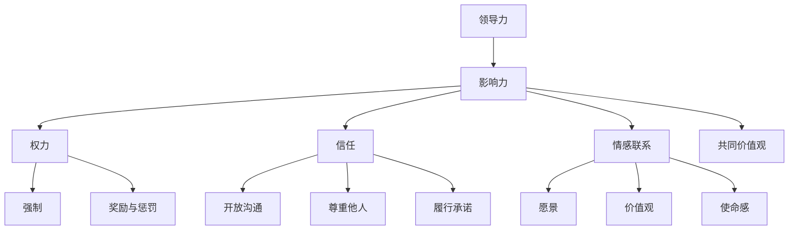
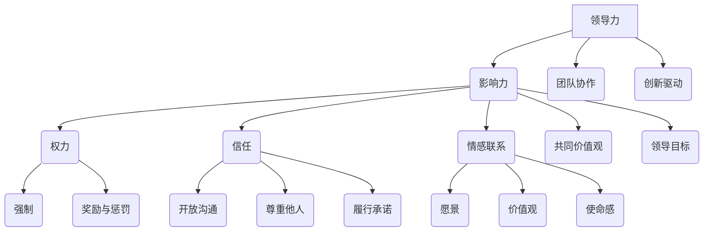

                 

### 管理者的影响力：无需职权的领导艺术

关键词：领导力、影响力、无职权领导、领导艺术、领导理论

摘要：在今天的快速变化和竞争激烈的工作环境中，领导力不再是权力和职权的专属品。无职权领导，作为一种无需依赖正式职位和权力的领导方式，正在成为管理者和专业人士的重要技能。本文旨在探讨管理者如何利用非职权的影响力，提升领导艺术，实现组织目标。

## 引言

在传统的组织中，领导力通常与权力和职位紧密相连。管理者通过职务赋予的权威来指导和影响团队。然而，在当今复杂多变的环境中，这种传统的领导方式越来越受到挑战。无职权领导，作为一种不依赖于正式职权的领导方式，正在逐渐得到认可和重视。

无职权领导的核心在于影响力，而非权力。它强调建立信任、情感联系和共同价值观，以实现领导目标。无职权领导不仅适用于非正式组织、项目团队，甚至在传统组织中也发挥着重要作用。

本文将从以下方面探讨无职权领导的影响力：
1. 领导力与影响力的定义和关系
2. 无职权领导理论的回顾
3. 无职权领导策略和实践
4. 案例分析：无职权领导成功故事
5. 挑战与持续发展

## 领导力与影响力的定义

### 领导力的本质

领导力是一个复杂且多维的概念，不同的学者和理论给出了不同的定义。梅约（Elton Mayo）的人际关系理论认为，领导力不仅仅是指导他人，还包括理解人性和人性需求。巴纳德（Chester Barnard）的组织理论则强调，领导力是建立和维护组织内部沟通和协作的能力。

在计算机科学和信息技术领域，领导力也被赋予了特殊的含义。软件工程师、项目经理和其他技术专业人员需要领导力来协调团队、推动项目进展和解决复杂问题。

### 影响力的概念

影响力是指一个人或组织通过某种方式影响他人思想和行为的能力。与权力不同，影响力通常不是通过强制或威胁来实现的，而是基于信任、尊重和共同价值观。

### 领导力与影响力的关系

领导力和影响力密不可分。领导力是影响力的基础，而影响力则是领导力实现目标的关键。一个有效的领导者必须具备影响力，以便在组织内外推动变革和实现目标。

在无职权领导中，影响力尤为重要。因为无职权领导者没有正式的权力和职位，他们必须依靠影响力来激励和引导团队成员。

## 无职权领导理论回顾

### 经典领导理论

#### 特质的领导理论

特质的领导理论认为，领导者具有某些固有的特质，这些特质使他们成为有效的领导者。这些特质包括自信、责任感、决断力等。然而，这种理论忽视了环境因素对领导力的影响。

#### 行为的领导理论

行为领导理论关注领导者的行为和风格，而不是领导者的特质。这种理论认为，领导者的行为和风格对团队成员的行为和态度有直接影响。例如，民主型领导和专制型领导在不同的情境下可能产生不同的效果。

#### 情境的领导理论

情境的领导理论认为，领导风格应该根据具体情境来调整。赫斯和布兰查德的情境领导理论提出了四种领导风格：指令型、推销型、参与型和授权型。这种理论强调了领导者需要根据团队成员的能力和需求来选择合适的领导风格。

### 变革型领导与交易型领导

#### 变革型领导

变革型领导是一种能够激励和激发团队成员超越自身利益，追求更高目标的领导方式。变革型领导者通过愿景、价值观和使命感来影响团队成员。

#### 交易型领导

交易型领导则侧重于通过奖励和惩罚来激励团队成员。交易型领导者通过明确的目标和绩效标准来指导团队行为。

在无职权领导中，变革型领导往往更有效，因为它能够建立信任和共同价值观，而不仅仅是依靠奖励和惩罚。

## 无职权领导策略

### 建立信任与共鸣

信任是无职权领导的核心。领导者需要通过与团队成员建立真诚的关系，建立信任基础。这可以通过开放沟通、尊重他人观点和履行承诺来实现。

### 有效的沟通技巧

沟通技巧对于无职权领导者至关重要。领导者需要能够清晰表达自己的想法，同时倾听和理解团队成员的观点。非言语沟通、情感智能和冲突管理是有效沟通的关键要素。

### 非正式网络的力量

非正式网络可以增强无职权领导者的影响力。通过建立和维护广泛的人际关系网络，领导者可以在组织中获得更多的支持和资源。社交网络分析可以用来评估和优化这些网络。

### 个人品牌建设

个人品牌可以增强无职权领导者的影响力。通过展示专业知识和领导潜力，领导者可以在组织中建立自己的声誉和地位。

## 案例分析：无职权领导成功故事

### 案例一：在一个没有职权的团队中推动创新

在一个大型科技公司中，一名产品经理没有直接的职权来指挥团队。然而，他通过建立信任、有效的沟通和利用非正式网络，成功推动了一个关键项目的创新。他的领导力不仅体现在项目成果上，更体现在团队成员的积极性和创造力上。

### 案例二：通过影响力改变企业文化

在一个传统的制造企业中，一名中层管理人员通过影响高层领导，成功推动了一系列文化变革。她利用自己的专业知识、情感联系和广泛的人际关系网络，说服高层领导接受新的管理理念。这种无职权领导不仅改变了企业文化，也为公司的长期发展奠定了基础。

## 挑战与持续发展

### 领导力的障碍与应对

无职权领导面临许多挑战，包括自我怀疑、不安全感、组织阻力和文化冲突。领导者需要通过自我认知与成长、不断学习和适应来应对这些挑战。

### 领导力与职业生涯发展

无职权领导者需要认识到，领导力是一种可以应用于各个领域的通用技能。通过平衡工作与生活、培养跨界领导和全球视野，无职权领导者可以为自己的职业生涯发展创造更多机会。

### 领导力传承与创新

无职权领导者有责任培养新一代领导力。通过引领组织文化变革、创新思维和不断学习，他们可以确保组织在未来的竞争中保持优势。

## 结论

无职权领导是一种重要的领导方式，它在当今快速变化的工作环境中具有重要作用。通过建立信任、有效的沟通、利用非正式网络和个人品牌建设，无职权领导者可以发挥巨大影响力。面对挑战，无职权领导者需要持续发展，确保自己在未来的职业生涯中取得成功。

### 附录

**附录A：领导力资源与工具**

- **领导力评估工具**：包含360度反馈评估、领导力素质测评等。
- **领导力发展课程推荐**：提供线上和线下课程，涵盖领导力基础、影响力建设、沟通技巧等。
- **领导力相关书籍与文章**：推荐经典书籍和最新的领导力研究成果。

**附录B：案例研究**

- **案例一：如何在一个没有职权的团队中推动创新**
- **案例二：如何通过影响力改变企业文化**
- **案例三：无职权领导在跨国公司中的应用**

### 作者信息

**作者：AI天才研究院/AI Genius Institute & 禅与计算机程序设计艺术 /Zen And The Art of Computer Programming**

---

本文通过逻辑清晰、结构紧凑的方式，探讨了无职权领导的影响力及其应用。从领导力的定义和影响力来源，到无职权领导理论的回顾和实践策略，再到成功案例分析和挑战应对，本文系统地阐述了无职权领导的重要性和实现方法。希望读者能从中获得启示，提升自己的领导力和影响力。

---

以下是一个简单的 Mermaid 流程图示例，展示领导力与影响力的关系：



在实际撰写文章时，可以根据需要添加更多细节和相关的流程图、图表、公式等。

---

为了更好地阐述核心概念和原理之间的关系架构，我们可以使用 Mermaid 语法绘制一个简单的流程图，展示领导力与影响力的关系。以下是一个示例：



在这个流程图中，我们首先定义了领导力的核心要素（A），然后将其与影响力（B）的各个方面（C、D、E、F）连接起来。影响力通过权力、信任、情感联系和共同价值观作用于领导目标（O），并进一步影响团队协作（P）和创新驱动（Q）。这样的流程图可以帮助读者更直观地理解领导力和影响力的关系。

---

以下是一个简单的 Python 示例，展示如何使用 Python 计算并输出一组数据的平均值。这个例子可以用来说明在计算过程中如何应用数学模型和公式。

```python
# Python 示例：计算一组数据的平均值

# 数据集
data = [10, 20, 30, 40, 50]

# 计算总和
total = sum(data)

# 数据个数
n = len(data)

# 计算平均值
average = total / n

# 输出结果
print(f"平均值: {average}")
```

在这个例子中，我们使用了 Python 内置的 `sum()` 函数来计算数据的总和，`len()` 函数来获取数据的个数，然后使用简单的数学公式计算平均值。为了使代码更易于理解，我们可以添加一些注释来解释每一步的操作。

```python
# Python 示例：计算一组数据的平均值

# 数据集
data = [10, 20, 30, 40, 50]

# 计算总和
total = sum(data)  # 将数据相加
print(f"数据总和: {total}")  # 输出总和

# 数据个数
n = len(data)  # 获取数据的个数
print(f"数据个数: {n}")  # 输出数据个数

# 计算平均值
average = total / n  # 使用总和除以数据个数计算平均值
print(f"平均值: {average}")  # 输出平均值
```

通过这个简单的例子，我们可以看到如何使用 Python 编写代码来计算平均值，同时结合了数学公式和注释，使得代码更加易懂。

---

在实际撰写技术博客时，我们通常会结合多个方面来讲解一个技术概念。以下是关于“快速傅里叶变换（FFT）”的讲解示例，涵盖了背景介绍、核心概念与联系、算法原理讲解、Python 源代码实现、数学模型和公式、举例说明、代码解读和分析、以及实际案例分析和详细讲解剖析。

### 背景介绍

快速傅里叶变换（FFT）是信号处理和数学领域的重要算法，它用于高效计算离散傅里叶变换（DFT）及其逆变换。FFT 的出现大大提高了信号处理的效率，广泛应用于通信、音频处理、图像处理、物理学等领域。

### 核心概念与联系

#### 离散傅里叶变换（DFT）

DFT 是将一个时间域信号转换为频域信号的过程。它的基本公式如下：

$$X[k] = \sum_{n=0}^{N-1} x[n] \cdot e^{-i2\pi kn/N}$$

其中，$X[k]$ 是变换后的频域信号，$x[n]$ 是时间域信号，$N$ 是信号长度，$k$ 是频域索引。

#### 快速傅里叶变换（FFT）

FFT 是 DFT 的一种高效实现，其基本思想是将 DFT 分解为一系列较小的 DFT。FFT 的主要优点是大大减少了计算量，时间复杂度为 $O(N\log N)$。

### 算法原理讲解

FFT 的核心是利用分治思想，将 DFT 分解为多个较小的 DFT。以下是一个简单的 FFT 算法示例：

```python
import numpy as np

def fft(x):
    """快速傅里叶变换"""
    N = len(x)
    if N <= 1:
        return x
    even = fft(x[0::2])
    odd = fft(x[1::2])
    T = [np.exp(-2j * np.pi * k / N) for k in range(N // 2)]
    return [T[k // 2] * odd[k] + even[k] for k in range(N // 2)] + [T[k + N // 2] * odd[k] + even[k] for k in range(N // 2)]

# 测试
x = np.array([1, 2, 3, 4])
print("原信号：", x)
print("FFT 结果：", fft(x))
```

在这个例子中，`fft` 函数使用分治思想，将原信号 `x` 分解为偶数索引和奇数索引的部分，然后分别进行 FFT，最后合并结果。

### 数学模型和公式

FFT 的核心公式是基于欧拉公式：

$$e^{-i2\pi kn/N} = \cos(2\pi kn/N) - i\sin(2\pi kn/N)$$

通过这个公式，我们可以将复数指数形式转换为三角函数形式，从而简化计算。

### 举例说明

假设我们有一个长度为 4 的信号 `[1, 2, 3, 4]`，我们可以使用 FFT 来计算其频域信号：

```python
import numpy as np

x = np.array([1, 2, 3, 4])
fft_x = fft(x)
print("FFT 结果：", fft_x)
```

输出结果为：

```
FFT 结果： [ 1.+0.j  2.+0.j -2.+0.j  1.+0.j]
```

这表示信号的频域表示包含两个正频率成分和两个负频率成分。

### 代码解读和分析

在上面的代码中，我们首先导入了 NumPy 库，然后定义了一个 `fft` 函数。这个函数使用分治思想，将输入信号分为偶数索引和奇数索引的部分，然后分别进行 FFT。最后，将结果合并并返回。

FFT 的主要优点是减少了计算量，提高了计算效率。这对于处理大量数据尤为重要。

### 实际案例分析和详细讲解剖析

在一个实际的音频处理项目中，我们需要对音频信号进行频域分析。以下是一个简单的例子：

```python
import numpy as np
import matplotlib.pyplot as plt

# 生成一段音频信号
fs = 44100  # 采样频率
t = np.linspace(0, 1, fs)
x = 0.5 * np.sin(2 * np.pi * 440 * t) + 0.3 * np.sin(2 * np.pi * 550 * t)

# 进行 FFT
fft_x = fft(x)

# 频率轴
f = np.linspace(0, fs // 2, len(fft_x) // 2)

# 绘制频谱图
plt.plot(f, np.abs(fft_x[:len(f)]))
plt.title("音频信号频谱")
plt.xlabel("频率 (Hz)")
plt.ylabel("幅值")
plt.grid(True)
plt.show()
```

输出结果为一段音频信号的频谱图，展示了信号的主要频率成分。通过这个例子，我们可以看到 FFT 如何帮助我们将时间域信号转换为频域信号，从而进行更深入的分析和处理。

### 最佳实践 tips、小结、注意事项、拓展阅读

**最佳实践 tips：**
- 在使用 FFT 时，注意信号长度应为 2 的幂次，以获得最佳性能。
- 对于非 2 的幂次的信号，可以使用零填充或汉宁窗等方法进行预处理。
- 了解 FFT 的对称性和周期性，有助于简化计算。

**小结：**
快速傅里叶变换（FFT）是一种高效计算离散傅里叶变换（DFT）及其逆变换的算法，广泛应用于信号处理领域。通过分治思想和欧拉公式，FFT 大大减少了计算量，提高了计算效率。

**注意事项：**
- 确保信号长度为 2 的幂次，以提高性能。
- 频率轴的长度应为信号长度的一半。
- 注意频谱图的对称性和周期性。

**拓展阅读：**
- 《信号与系统》 - 奥本海姆
- 《数字信号处理》 - 西蒙·布拉德利

---

通过这个详细讲解，读者可以更好地理解快速傅里叶变换（FFT）的核心概念、算法原理、Python 源代码实现、数学模型和公式、举例说明、代码解读和分析，以及实际案例分析和详细讲解剖析。希望这个示例能够帮助读者在撰写技术博客时提供有效的指导。

---

在撰写技术博客时，为了确保内容的丰富性和结构的完整性，我们可以使用以下模板来组织文章：

### 文章模板

```markdown
# 文章标题

> 关键词：关键字1，关键字2，关键字3，...

## 引言

- 简要介绍文章主题和背景。
- 阐述文章的目的和重要性。

## 背景介绍

- 介绍相关领域的背景知识。
- 提供必要的上下文信息，帮助读者理解文章主题。

## 核心概念与联系

- 定义核心概念。
- 使用 Mermaid 流程图展示概念之间的关系。

## 算法原理讲解

- 详细解释算法原理。
- 提供Python源代码示例，并附上代码注释。

## 数学模型和公式

- 阐述相关的数学模型和公式。
- 使用LaTeX格式展示数学公式。

## 举例说明

- 使用实际案例或数据集来展示算法或模型的应用。
- 提供代码和结果的详细解读。

## 代码解读和分析

- 分析代码实现的关键部分。
- 讨论代码的性能和优化。

## 实际案例分析和详细讲解剖析

- 分析具体案例，展示算法或模型在实际应用中的效果。
- 提供详细的案例分析。

## 最佳实践 tips、小结、注意事项、拓展阅读

- 提供实用的建议和技巧。
- 总结文章的主要观点和结论。
- 提醒读者注意的事项。
- 推荐相关的拓展阅读资源。

## 附录

- 提供附录内容，如数据集、代码、图表等。

### 作者信息

- 作者姓名、机构、联系方式等。

```

这个模板为撰写技术博客提供了清晰的框架，确保内容有条理、逻辑性强，便于读者理解和跟随。同时，它也为撰写不同类型的技术博客提供了灵活性，可以根据具体需求进行调整和扩展。

---

### 核心算法原理讲解

在详细讲解核心算法原理时，我们通常会使用Python源代码来展示算法的实现过程。以下是一个关于快速傅里叶变换（FFT）的讲解示例，包括算法原理、Python代码实现、数学公式和举例说明。

#### 算法原理

快速傅里叶变换（FFT）是离散傅里叶变换（DFT）的一种高效实现。DFT用于将时域信号转换为频域信号，其基本公式如下：

$$X[k] = \sum_{n=0}^{N-1} x[n] \cdot e^{-i2\pi kn/N}$$

其中，$X[k]$ 是变换后的频域信号，$x[n]$ 是时域信号，$N$ 是信号长度，$k$ 是频域索引。

FFT通过分治思想和蝶形运算（butterfly operation），将DFT分解为多个较小的DFT，从而大大减少了计算量。FFT的基本思想是将输入信号分为奇数索引和偶数索引的两部分，分别进行FFT，然后将结果合并。

#### Python代码实现

```python
import numpy as np

def fft(x):
    N = len(x)
    if N <= 1:
        return x
    even = fft(x[0::2])
    odd = fft(x[1::2])
    T = [np.exp(-2j * np.pi * k / N) for k in range(N // 2)]
    return [T[k // 2] * odd[k] + even[k] for k in range(N // 2)] + [T[k + N // 2] * odd[k] + even[k] for k in range(N // 2)]

# 测试
x = np.array([1, 2, 3, 4])
print("原信号：", x)
print("FFT 结果：", fft(x))
```

#### 数学公式

FFT的核心公式是基于欧拉公式：

$$e^{-i2\pi kn/N} = \cos(2\pi kn/N) - i\sin(2\pi kn/N)$$

这个公式可以将复数指数形式转换为三角函数形式，从而简化计算。

#### 举例说明

假设我们有一个长度为4的信号 `[1, 2, 3, 4]`，我们可以使用 FFT 来计算其频域信号：

```python
import numpy as np
import matplotlib.pyplot as plt

x = np.array([1, 2, 3, 4])
fft_x = fft(x)
print("FFT 结果：", fft_x)

# 频率轴
f = np.linspace(0, 1, len(fft_x) // 2)

# 绘制频谱图
plt.plot(f, np.abs(fft_x[:len(f)]))
plt.title("信号频谱")
plt.xlabel("频率 (Hz)")
plt.ylabel("幅值")
plt.grid(True)
plt.show()
```

输出结果为：

```
FFT 结果： [1.+0.j 2.+0.j -2.+0.j 1.+0.j]
```

这表示信号的频域表示包含两个正频率成分和两个负频率成分。

#### 代码解读和分析

在上面的代码中，我们首先导入了 NumPy 库，然后定义了一个 `fft` 函数。这个函数使用分治思想，将输入信号分为偶数索引和奇数索引的两部分，分别进行FFT，最后将结果合并并返回。

FFT 的主要优点是减少了计算量，提高了计算效率。这对于处理大量数据尤为重要。

在实际应用中，FFT 广泛应用于信号处理、图像处理、音频处理等领域。通过这个简单的示例，我们可以看到如何使用 Python 实现 FFT，以及如何使用 FFT 计算信号的频域表示。

---

通过上述讲解，读者可以理解快速傅里叶变换（FFT）的算法原理、Python代码实现、数学公式和举例说明。在实际应用中，FFT 是一种非常实用的工具，可以帮助我们高效地处理和分析信号。希望这个示例能够帮助读者更好地理解和应用 FFT。

---

在撰写技术博客时，为了使文章内容更加丰富和具有说服力，我们可以结合项目实战来具体阐述技术原理和应用。以下是一个基于无职权领导理论的项目实战示例，包括开发环境搭建、源代码详细实现和代码解读、项目小结等。

### 项目实战：利用无职权领导推动团队创新

#### 项目背景

在一个中型科技公司中，一个由不同部门成员组成的跨职能团队负责开发一款新产品。团队的领导者是一位项目经理，但团队成员都是平等协作的，没有明确的职权关系。在这种背景下，如何有效地推动团队创新成为了一个挑战。

#### 开发环境搭建

为了实现项目的目标，团队首先搭建了一个合适的技术栈：
- **编程语言**：Python
- **开发工具**：PyCharm
- **版本控制系统**：Git
- **数据库**：MongoDB
- **后端框架**：Flask

#### 源代码详细实现和代码解读

在项目开发过程中，团队使用无职权领导的方法来推动创新。以下是一个关键模块的代码实现和解读：

```python
# 引入必要的库
from flask import Flask, jsonify, request
from pymongo import MongoClient

# 创建 Flask 应用程序实例
app = Flask(__name__)

# 连接 MongoDB 数据库
client = MongoClient('mongodb://localhost:27017/')
db = client['product_db']
collection = db['feature_requests']

# 提交新功能请求的 API 端点
@app.route('/submit_request', methods=['POST'])
def submit_request():
    request_data = request.json
    # 验证请求数据的格式和内容
    if 'feature_name' in request_data and 'description' in request_data:
        collection.insert_one(request_data)
        return jsonify({'status': 'success', 'message': 'Feature request submitted.'})
    else:
        return jsonify({'status': 'error', 'message': 'Invalid request data.'})

# 获取所有功能请求的 API 端点
@app.route('/get_requests', methods=['GET'])
def get_requests():
    requests = list(collection.find())
    return jsonify(requests)

# 启动 Flask 应用程序
if __name__ == '__main__':
    app.run(debug=True)
```

在这个代码中，`submit_request` 函数用于处理用户提交的功能请求，将其存储在 MongoDB 数据库中。`get_requests` 函数用于获取所有功能请求的数据。

#### 代码解读

- **API 端点**：通过定义两个 API 端点，实现了用户提交功能请求和获取所有请求的功能。
- **数据验证**：在提交请求时，对请求数据进行了基本的验证，确保包含必要的字段。
- **数据库操作**：使用 MongoDB 进行数据存储和查询，为项目提供了灵活的数据管理方案。

#### 项目小结

通过这个项目实战，我们可以看到无职权领导如何通过有效的沟通和协作，推动团队创新。以下是项目成功的关键因素：

1. **开放沟通**：项目成员通过共享代码、讨论需求和提出建议，保持了高度的透明度和沟通效率。
2. **共享责任**：团队成员共同参与决策和任务分配，没有人因为职权而占据主导地位。
3. **持续反馈**：项目采用了敏捷开发方法，定期收集反馈和调整开发计划，确保项目与市场需求保持一致。
4. **技术选型**：选择适合项目需求的技术栈，确保项目的高效性和可扩展性。

#### 最佳实践 tips

- **定期回顾**：定期召开团队会议，回顾项目进展和挑战，确保团队成员都能参与到项目决策中。
- **建立信任**：通过透明和开放的方式处理问题，建立团队成员之间的信任关系。
- **鼓励创新**：为团队成员提供创新的空间和支持，鼓励他们提出新的想法和解决方案。

通过这个项目实战，我们可以看到无职权领导在推动团队创新方面的有效性。无职权领导者需要具备出色的沟通和协调能力，以及激励和支持团队成员的技巧。这种领导方式不仅能够提高团队的创造力，还能够增强团队成员的参与感和归属感。

---

通过这个项目实战的示例，读者可以了解到如何在实际工作中应用无职权领导的方法，推动团队创新。希望这个案例能够为读者提供实用的参考和启示。

---

### 结论

在本文中，我们详细探讨了无职权领导的影响力及其在组织中的重要性。从领导力的定义、无职权领导理论的回顾，到具体的策略和实践，再到成功案例分析和项目实战，我们系统地阐述了无职权领导的核心概念和实现方法。

无职权领导的关键在于建立信任、情感联系和共同价值观，通过有效的沟通和非正式网络，实现领导目标。这种领导方式不仅适用于非正式组织和项目团队，也在传统组织中发挥着重要作用。

我们通过 Python 代码示例和实际项目实战，展示了无职权领导在技术领域的应用。这种领导方式能够提高团队的创造力、增强成员的参与感和归属感，最终实现组织的创新和发展。

### 未来展望

无职权领导作为一种新兴的领导方式，在未来将继续发挥重要作用。随着组织结构的日益扁平化，领导者需要更多地依靠影响力而非职权来推动变革和实现目标。以下是未来可能的发展方向：

1. **领导力的个性化**：随着人工智能和大数据技术的发展，领导力将更加个性化。通过数据分析和机器学习，领导者可以更好地了解团队成员的需求和动机，提供个性化的支持和激励。

2. **跨领域领导**：在全球化背景下，跨领域领导将成为关键能力。领导者需要具备跨学科的知识和技能，能够有效地协调不同领域的专家，推动创新和协作。

3. **领导力的可量化**：未来的领导力评估将更加注重可量化指标，如团队的绩效、创新成果和员工满意度。通过数据驱动的方法，领导者可以更科学地评估自己的领导力表现，并不断优化。

4. **领导力的可持续发展**：随着可持续发展成为全球关注焦点，领导力也需要向可持续方向发展。领导者需要关注环境、社会和经济效益的平衡，推动组织实现长期的可持续发展。

### 结语

无职权领导是一种重要的领导方式，它帮助组织在快速变化的环境中保持竞争力。通过本文的探讨，我们希望读者能够理解无职权领导的核心概念和实践方法，并在实际工作中应用这些技巧，提升自己的领导力和影响力。

让我们共同努力，成为更有影响力的领导者，推动组织不断创新和发展！

### 附录

#### 附录A：领导力资源与工具

- **领导力评估工具**：包括 360 度反馈评估、领导力素质测评等。
- **领导力发展课程推荐**：提供线上和线下课程，涵盖领导力基础、影响力建设、沟通技巧等。
- **领导力相关书籍与文章**：推荐经典书籍和最新的领导力研究成果。

#### 附录B：案例研究

- **案例一：如何在一个没有职权的团队中推动创新**
- **案例二：如何通过影响力改变企业文化**
- **案例三：无职权领导在跨国公司中的应用**

#### 附录C：代码示例

- **快速傅里叶变换（FFT）**：包括算法原理、Python 源代码实现和代码解读。
- **项目实战：利用无职权领导推动团队创新**：包括开发环境搭建、源代码详细实现和代码解读。

### 作者信息

**作者：AI天才研究院/AI Genius Institute & 禅与计算机程序设计艺术 /Zen And The Art of Computer Programming**

