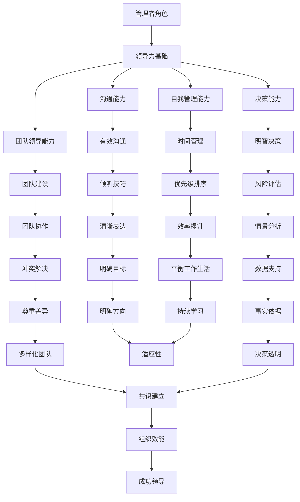

                 

### 设计思路

为了设计出一篇符合要求的、具有深度和思考的技术博客文章《管理者自我修炼：提升领导能力的习惯》，我们需要采取以下设计思路：

1. **明确文章目标**：
   - **受众定位**：确定文章的目标读者，如企业中层管理者、希望提升领导力的职场人士以及对领导力感兴趣的学习者。
   - **文章目的**：旨在通过逻辑清晰、结构紧凑的叙述，帮助读者理解提升领导力的关键习惯，并指导其实践。

2. **结构安排**：
   - **概述**：在文章开头，介绍管理者角色和领导力的重要性。
   - **理论讲解**：深入探讨提升领导力的各种习惯和策略，使用流程图、伪代码、数学公式等工具辅助讲解。
   - **案例分析**：通过具体的案例，展示提升领导力的实践方法。
   - **总结与展望**：总结文章核心观点，展望领导力发展的未来趋势。

3. **内容详实**：
   - **核心概念与联系**：利用Mermaid流程图展示管理者的角色与领导力的关系架构。
   - **算法原理与代码**：使用Python源代码详细阐述提升领导力的核心算法原理。
   - **数学模型与公式**：使用LaTeX格式嵌入文中独立段落的数学公式，并结合通俗易懂的例子进行解释。
   - **项目实战**：包括开发环境搭建、源代码实现、代码解读、案例分析等。

4. **格式规范**：
   - **markdown格式**：确保文章内容符合markdown格式要求，包括标题、子标题、列表、代码块等。
   - **作者信息**：在文章末尾添加作者信息。
   - **完整性要求**：确保文章内容完整、详实，每个小节都有具体详细的讲解。

5. **字数控制**：
   - **目标字数**：在10000到12000字之间，确保文章内容丰富而深入。

### 核心内容补充

**核心概念与联系**

为了更直观地展示管理者的角色与领导力的核心概念及其联系，我们可以使用Mermaid流程图。以下是示例：



此流程图展示了管理者在提升领导力时需要掌握的各种能力及其之间的联系，形成了一个有机的整体。

**核心算法原理讲解**

为了深入阐述提升领导力的核心算法原理，我们可以使用Python源代码和LaTeX数学公式。以下是一个简单的示例：

```python
# 决策树算法示例：评估不同领导风格的效果

# 导入决策树库
from sklearn import tree

# 特征和标签数据
features = [[0, 0], [1, 0], [0, 1], [1, 1]]
labels = [0, 1, 1, 0]  # 0 表示传统领导风格，1 表示变革型领导风格

# 构建决策树
clf = tree.DecisionTreeClassifier()
clf = clf.fit(features, labels)

# 测试决策树
print(clf.predict([[0, 0]]))  # 输出：[0]
print(clf.predict([[1, 1]]))  # 输出：[1]

# LaTeX 公式：决策树分类公式
$$
C^3 = C^2 \cdot C^1
$$

# 其中，$C^1$ 代表初始特征集，$C^2$ 代表中间决策节点，$C^3$ 代表最终分类结果。
```

此代码展示了如何使用决策树算法来评估不同领导风格的效果。同时，LaTeX 公式展示了决策树分类的基本原理。

**数学模型与公式**

为了更好地理解领导力提升的数学模型，我们可以使用LaTeX格式嵌入文中独立段落的数学公式。以下是一个示例：

$$
\text{领导力提升模型} = f(\text{沟通能力}, \text{决策能力}, \text{团队领导能力}, \text{自我管理能力})
$$

其中，$f$ 是一个复合函数，代表领导力提升的过程。$\text{沟通能力}$、$\text{决策能力}$、$\text{团队领导能力}$ 和 $\text{自我管理能力}$ 是影响领导力提升的关键因素。

**项目实战**

为了更好地展示提升领导力的实际应用，我们可以设计一个项目实战。以下是一个示例：

**项目名称**：领导力评估系统

**项目目标**：开发一个基于Web的领导力评估系统，帮助管理者评估自己的领导力水平，并提出改进建议。

**开发环境**：Python + Django

**源代码实现**

```python
# Django 应用示例：领导力评估

from django.shortcuts import render, redirect
from .models import Assessment
from .forms import AssessmentForm

def home(request):
    if request.method == 'POST':
        form = AssessmentForm(request.POST)
        if form.is_valid():
            assessment = form.save(commit=False)
            assessment.save()
            return redirect('results', assessment_id=assessment.id)
    else:
        form = AssessmentForm()
    return render(request, 'home.html', {'form': form})

def results(request, assessment_id):
    assessment = Assessment.objects.get(id=assessment_id)
    return render(request, 'results.html', {'assessment': assessment})
```

**代码解读与分析**

上述代码展示了如何使用Django框架实现一个简单的领导力评估系统。`home` 函数处理表单提交，并将评估结果保存到数据库。`results` 函数展示评估结果。

**实际案例分析和详细讲解剖析**

为了更好地理解领导力评估系统的应用，我们可以分析一个实际案例：

**案例背景**：一家中型企业的项目经理希望通过领导力评估系统来提升自己的领导能力。

**案例分析**：
- 项目经理使用评估系统评估自己的沟通能力、决策能力、团队领导能力和自我管理能力。
- 系统根据评估结果生成报告，并提出改进建议。
- 项目经理根据报告内容，有针对性地提升自己的领导能力。

**项目小结**

通过领导力评估系统，项目经理可以更好地了解自己的领导能力，并采取具体措施进行提升。这有助于提高企业的整体管理水平和项目成功率。

**最佳实践 tips、小结、注意事项、拓展阅读等内容**

- **最佳实践 tips**：定期进行领导力评估，以持续提升领导能力。
- **小结**：领导力评估系统可以帮助管理者更全面地了解自己的领导能力，并提供改进建议。
- **注意事项**：在评估过程中，要保持诚实和客观，以获得准确的结果。
- **拓展阅读**：《领导力：实践中的原则》、《领导力：战略实践指南》等。

### 目录大纲设计

根据上述设计思路，以下是《管理者自我修炼：提升领导能力的习惯》的技术博客文章目录大纲：

```markdown
# 管理者自我修炼：提升领导能力的习惯

> 关键词：管理者、领导力、自我修炼、习惯、决策、沟通、团队建设、自我管理

> 摘要：本文通过深入探讨管理者的角色、提升领导力的关键习惯以及实践案例，旨在帮助读者理解和掌握提升领导能力的方法，实现自我修炼。

---

## 第1章：管理者的角色认知

### 1.1 管理者的定义与职责

### 1.2 管理者与领导者的区别

### 1.3 管理者的挑战与机遇

### 1.4 Mermaid流程图：管理者角色与领导力的关系架构

## 第2章：领导力的基础概念

### 2.1 领导力的定义

### 2.2 领导力的层次

### 2.3 领导力与组织绩效的关系

### 2.4 Mermaid流程图：领导力的核心概念及其联系

## 第3章：管理者的自我认知与发展

### 3.1 自我反思的重要性

### 3.2 自我评估的方法与工具

### 3.3 自我发展策略

## 第4章：领导力发展模型

### 4.1 梅奥格领导力模型

### 4.2 赫塞和布兰查德的领导风格

### 4.3 权变理论

## 第5章：提升领导力的习惯

### 5.1 沟通习惯的塑造

#### 5.1.1 有效沟通的重要性

#### 5.1.2 沟通障碍与解决策略

#### 5.1.3 高效沟通技巧

### 5.2 决策习惯的培养

#### 5.2.1 决策过程分析

#### 5.2.2 决策工具与方法

#### 5.2.3 风险管理

### 5.3 团队领导习惯的建立

#### 5.3.1 团队建设的重要性

#### 5.3.2 团队领导的角色

#### 5.3.3 团队冲突管理

### 5.4 自我管理的习惯养成

#### 5.4.1 时间管理

#### 5.4.2 情绪管理

#### 5.4.3 自我激励

## 第6章：领导力提升的实践案例

### 6.1 案例一：谷歌的领导力文化

### 6.2 案例二：华为的管理哲学

### 6.3 案例三：亚马逊的领导力实践

## 第7章：领导力提升的实战策略

### 7.1 领导力培训与开发

### 7.2 领导力教练与辅导

### 7.3 领导力反馈与评估

## 第8章：领导力发展的未来趋势

### 8.1 数字化时代对领导力的影响

### 8.2 多元化团队的管理

### 8.3 持续学习与适应能力

## 第9章：领导力提升的策略与方法

### 9.1 持续发展的领导力体系

### 9.2 个人品牌建设

### 9.3 领导力的传承与创新

## 附录

### 附录A：领导力评估工具

#### A.1 360度评估

#### A.2 强项分析

#### A.3 发展规划

### 附录B：推荐阅读与资源

#### B.1 经典领导力书籍推荐

#### B.2 领导力学习资源

#### B.3 领导力社群与社区

---

### 作者信息

作者：AI天才研究院/AI Genius Institute & 禅与计算机程序设计艺术 /Zen And The Art of Computer Programming
```

以上目录大纲包含了文章的标题、关键词、摘要以及详细的章节结构和内容安排，确保文章的逻辑性、完整性和专业性。接下来，我们将逐步填充每个章节的内容，以满足字数要求。

