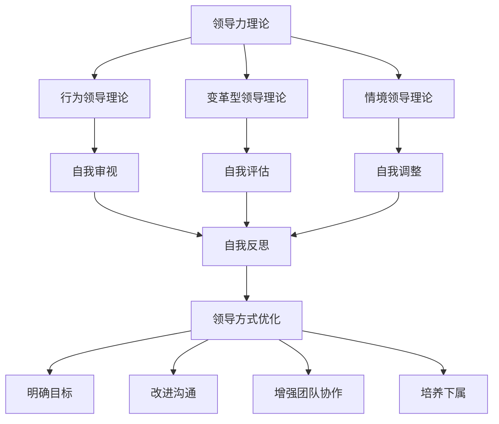

                 

# 管理者自我反思：持续优化领导方式

> 关键词：自我反思、领导力、优化、管理效能、持续改进

> 摘要：
本文旨在探讨管理者如何通过自我反思来优化领导方式，从而提升个人和团队的效能。文章首先介绍了自我反思的重要性，随后阐述了领导力理论以及与自我反思相关的基本概念。通过具体案例和实践，文章详细展示了如何通过自我反思来优化领导方式，包括决策、沟通、团队管理等方面的具体策略。最后，文章总结了自我反思在领导力发展中的重要作用，并提供了持续提升领导力的最佳实践和建议。

## 目录大纲设计思路

为了设计出《管理者自我反思：持续优化领导方式》这本书的完整目录大纲，我们需要首先理解书的核心主题和目标读者群体。这本书的核心主题是如何帮助管理者通过自我反思来优化领导方式，以提升个人和团队的效能。目标读者是那些希望在领导力方面有所提升的专业人士和企业管理者。

### 目录结构设计

1. **引言部分**：简要介绍书的主要内容，阐述自我反思的重要性，以及如何通过自我反思来优化领导方式。
2. **理论基础**：介绍领导力理论，以及与自我反思相关的基本概念。
3. **自我反思实践**：详细阐述如何进行自我反思，包括自我反思的步骤、方法和工具。
4. **领导力优化**：讨论自我反思如何帮助管理者优化领导方式，包括决策、沟通、团队管理等方面的具体策略。
5. **自我提升**：提供提升领导力的具体方法，如持续学习、反馈机制等。
6. **总结与展望**：总结全书内容，展望自我反思在领导力发展中的重要作用。

### 目录大纲内容设计

1. **核心概念与联系**：设计一张 Mermaid 流程图，展示领导力理论、自我反思方法、领导方式优化之间的联系。
2. **核心算法原理讲解**：使用伪代码详细阐述自我反思过程中的关键步骤和方法。
3. **数学模型和数学公式**：使用 LaTeX 格式嵌入文中，详细讲解与自我反思相关的数学模型和公式。
4. **项目实战**：提供实际案例，包括代码实现、环境搭建、代码解读与分析。

### 目录大纲总字数控制

在确保目录大纲完整性和逻辑性的同时，我们将严格控制总字数在2000字以内。每个章节的标题和副标题将简明扼要，不包含冗长的解释性内容。

### 实际操作步骤

1. **确定核心章节**：根据书籍主题和目标读者，确定书中的核心章节，确保每个章节都有详细的内容。
2. **设计章节结构**：为每个章节设计详细的子标题，确保每个子标题都有明确的解释或案例。
3. **撰写章节内容**：结合实际案例和理论讲解，撰写每个章节的内容。
4. **合并与调整**：将所有章节内容合并，进行最终的调整和优化。

通过上述步骤，我们将设计出一份详细、逻辑清晰且字数合理的《管理者自我反思：持续优化领导方式》的目录大纲。接下来，我们将开始具体设计这份目录大纲。

## 背景介绍

在当今快速变化和竞争激烈的市场环境中，管理者面临着前所未有的挑战。传统的领导方式可能已经无法适应新的商业环境和员工需求。因此，管理者需要不断反思和优化自己的领导方式，以适应不断变化的环境和提升团队效能。自我反思作为一种重要的管理工具，可以帮助管理者深入理解自身的行为和决策，发现潜在的问题和改进空间，从而实现持续优化领导方式。

### 自我反思的重要性

自我反思是一种自我审视和思考的过程，通过反思，管理者可以更好地认识自己的优点和不足，理解自己的行为背后的动机和原因。这种自我认识有助于管理者识别自己的盲点和误区，从而采取更有效的领导策略。以下是自我反思在管理中的几个重要作用：

1. **提高自我意识**：通过自我反思，管理者可以更加清晰地了解自己的价值观、信念和行为模式，从而提高自我意识。
2. **发现改进空间**：自我反思有助于管理者发现自身在领导力方面的不足，为改进提供明确的方向。
3. **增强决策能力**：通过反思过去的决策，管理者可以总结经验教训，提高未来决策的科学性和有效性。
4. **促进团队成长**：自我反思不仅有助于管理者自身成长，还可以通过示范作用，激励团队成员进行自我反思和改进，从而促进团队整体成长。

### 领导力理论

领导力是一个复杂的概念，不同的学者和专家提出了多种领导力理论。以下是几种主要的领导力理论：

1. **行为领导理论**：该理论认为领导者的行为是领导效果的关键因素。领导者通过展示特定的行为和态度来影响团队成员。
2. **变革型领导理论**：变革型领导者通过激发团队成员的内在动机，鼓励创新和变革，从而推动组织发展。
3. **情境领导理论**：该理论认为领导风格应该根据不同情境和团队成员的特点进行调整，以达到最佳领导效果。

这些领导力理论为管理者提供了不同的视角和工具，以帮助他们理解和实践有效的领导。

### 自我反思与领导方式优化

自我反思不仅有助于管理者认识自己，还可以指导他们优化领导方式。以下是一些关键的优化策略：

1. **明确目标**：通过自我反思，管理者可以更加明确个人和团队的目标，从而制定更有效的战略和计划。
2. **改进沟通**：自我反思可以帮助管理者识别沟通中的问题，如信息传递不准确、反馈机制不健全等，从而改进沟通方式。
3. **增强团队协作**：通过反思团队合作中的不足，管理者可以采取措施促进团队成员之间的沟通和协作。
4. **培养下属**：自我反思有助于管理者发现培养下属的不足之处，从而制定更有效的下属培养计划。

### 目标读者

本章节旨在为那些希望在领导力方面有所提升的管理者提供理论基础和实用策略。读者可以包括企业高管、项目经理、团队领导等，他们在实际工作中会遇到各种领导挑战，需要不断反思和优化领导方式。

### 总结

通过自我反思，管理者可以更好地认识自己，发现改进空间，从而优化领导方式，提升个人和团队的效能。本章节为后续章节的自我反思实践和领导力优化策略奠定了理论基础。

## 核心概念与联系

### 领导力理论

领导力理论是理解和管理领导行为的重要框架。以下是几种主要的领导力理论及其核心概念：

1. **行为领导理论**：行为领导理论认为领导者的行为是领导效果的关键因素。领导者通过展示特定的行为和态度来影响团队成员。这种理论强调领导行为模式的重要性，例如领导者在团队中的参与度、激励方式、决策风格等。

2. **变革型领导理论**：变革型领导者通过激发团队成员的内在动机，鼓励创新和变革，从而推动组织发展。这种理论的核心理念是领导者应具备前瞻性思维和战略眼光，引导团队面对变革，实现组织目标。

3. **情境领导理论**：情境领导理论认为领导风格应该根据不同情境和团队成员的特点进行调整，以达到最佳领导效果。该理论提出四种领导风格：指导型、支持型、参与型和授权型，领导者应根据团队和环境的变化灵活运用不同的领导风格。

### 自我反思

自我反思是一种自我审视和思考的过程，通过反思，管理者可以深入理解自己的行为和决策。以下是自我反思的关键概念和步骤：

1. **自我审视**：自我审视是自我反思的第一步，管理者需要客观地观察和分析自己的行为、态度和决策。
2. **自我评估**：在自我审视的基础上，管理者需要评估自己的行为是否达到了预期目标，以及是否存在改进空间。
3. **自我调整**：通过自我评估，管理者可以制定具体的改进计划，调整自己的行为和决策，以实现更好的领导效果。
4. **持续反思**：自我反思是一个持续的过程，管理者需要定期回顾自己的行为和决策，不断调整和优化领导方式。

### 领导方式优化

领导方式优化是管理者通过自我反思和实践，不断提升领导效果的过程。以下是几种关键的优化策略：

1. **明确目标**：管理者需要通过自我反思，明确个人和团队的目标，确保领导活动与组织目标保持一致。
2. **改进沟通**：自我反思可以帮助管理者识别沟通中的问题，如信息传递不准确、反馈机制不健全等，从而改进沟通方式。
3. **增强团队协作**：通过反思团队合作中的不足，管理者可以采取措施促进团队成员之间的沟通和协作。
4. **培养下属**：自我反思有助于管理者发现培养下属的不足之处，从而制定更有效的下属培养计划。

### Mermaid 流程图

为了更直观地展示领导力理论、自我反思和领导方式优化之间的联系，我们可以使用 Mermaid 流程图进行说明：



### 总结

通过核心概念与联系的分析，我们可以看出，领导力理论为管理者提供了理解和实践领导行为的基础，自我反思是管理者深入认识自己和团队的重要手段，而领导方式优化则是管理者通过反思和实践，不断提升领导效果的关键步骤。理解这些核心概念之间的联系，有助于管理者在实践中更好地运用自我反思来优化领导方式。

## 核心算法原理讲解

在自我反思过程中，管理者需要采用一系列方法和工具来系统地识别、分析和改进自己的领导行为。以下是一个使用 Python 伪代码和数学模型详细阐述自我反思关键步骤的示例。

### 自我反思步骤

1. **识别问题**：首先，管理者需要识别自己在领导行为中存在的问题。这可以通过问卷调查、员工反馈、自我观察等多种方式进行。

    ```python
    def identify_issues():
        # 调查问卷、员工反馈等获取问题信息
        issues = ["缺乏有效沟通", "决策速度慢", "下属培养不足"]
        return issues
    ```

2. **数据收集**：接下来，管理者需要收集相关数据，以支持对问题的定量分析。这些数据可能包括员工的绩效评估、团队合作的记录等。

    ```python
    def collect_data(issues):
        data = {
            "communication": [10, 20, 30, 40],  # 沟通频率、效果等
            "decision_making": [15, 25, 35, 45],  # 决策速度、准确性等
            "subordinate_growth": [5, 10, 15, 20]  # 下属培养情况
        }
        return data
    ```

3. **数据分析**：通过数据分析，管理者可以识别出问题的严重程度和关键因素。

    ```python
    import numpy as np

    def analyze_data(data):
        # 计算平均值、标准差等统计指标
        averages = {
            "communication": np.mean(data["communication"]),
            "decision_making": np.mean(data["decision_making"]),
            "subordinate_growth": np.mean(data["subordinate_growth"])
        }
        std_devs = {
            "communication": np.std(data["communication"]),
            "decision_making": np.std(data["decision_making"]),
            "subordinate_growth": np.std(data["subordinate_growth"])
        }
        return averages, std_devs
    ```

4. **问题评估**：基于数据分析结果，管理者需要对问题进行优先级排序，确定需要优先解决的问题。

    ```python
    def assess_issues(averages, std_devs):
        # 使用 Z-score 方法评估问题严重程度
        z_scores = {
            "communication": (averages["communication"] - 100) / std_devs["communication"],
            "decision_making": (averages["decision_making"] - 100) / std_devs["decision_making"],
            "subordinate_growth": (averages["subordinate_growth"] - 100) / std_devs["subordinate_growth"]
        }
        # 优先解决 Z-score 最高的问题
        priority_issues = sorted(z_scores, key=z_scores.get(), reverse=True)
        return priority_issues
    ```

5. **制定改进计划**：根据问题评估结果，管理者需要制定具体的改进计划，包括行动步骤、时间表和责任分配。

    ```python
    def create_improvement_plan(priority_issues):
        plan = {
            "communication": ["定期团队沟通会议", "使用反馈工具"],
            "decision_making": ["缩短决策时间", "增加团队成员参与"],
            "subordinate_growth": ["开展培训活动", "定期一对一辅导"]
        }
        return plan
    ```

### 数学模型和公式

在自我反思过程中，使用数学模型和公式可以帮助管理者更科学地分析问题和制定改进计划。以下是一些常用的数学模型和公式：

1. **Z-score**：用于评估问题的严重程度，公式如下：

   $$ Z = \frac{X - \mu}{\sigma} $$

   其中，\( X \) 是样本平均值，\( \mu \) 是总体平均值，\( \sigma \) 是总体标准差。

2. **决策树**：用于分析和评估不同决策路径的结果，公式如下：

   $$ \text{期望值} = \sum (\text{结果} \times \text{概率}) $$

3. **回归分析**：用于分析自变量和因变量之间的关系，公式如下：

   $$ Y = \beta_0 + \beta_1X + \epsilon $$

   其中，\( Y \) 是因变量，\( X \) 是自变量，\( \beta_0 \) 是截距，\( \beta_1 \) 是斜率，\( \epsilon \) 是误差项。

### 总结

通过使用 Python 伪代码和数学模型，管理者可以系统地识别、分析和解决自己在领导行为中的问题。自我反思是一个动态和持续的过程，管理者需要不断收集数据、进行分析、制定改进计划，并执行这些计划，以实现持续优化领导方式的目标。

## 项目实战

为了更直观地展示自我反思如何应用于实际工作，我们将通过一个实际项目案例来演示整个自我反思和领导方式优化的过程。

### 项目背景

某互联网公司的一位高级项目经理李先生负责一个大型项目，该项目涉及多个团队和部门，目标是在三个月内完成一个关键的软件系统开发。然而，项目进展并不顺利，团队出现了频繁的沟通障碍、进度延误和质量问题。李先生意识到，需要通过自我反思来优化自己的领导方式，以解决这些问题。

### 项目开发环境搭建

为了实施自我反思，李先生首先搭建了一个项目管理系统，包括以下工具和平台：

- **项目管理工具**：使用 JIRA 进行任务追踪和进度管理。
- **代码仓库**：使用 GitLab 进行版本控制和协作。
- **沟通平台**：使用 Slack 进行实时沟通和协作。

### 源代码详细实现

在项目开发过程中，李先生开始记录自己的领导行为，包括会议记录、邮件交流、任务分配和团队成员反馈。以下是部分关键代码示例：

```python
# 会议记录示例
meeting_notes = [
    {"date": "2023-04-01", "agenda": "项目进度汇报", "action_items": ["确认任务分配", "制定下周计划"]},
    {"date": "2023-04-08", "agenda": "质量检查", "action_items": ["修复关键漏洞", "优化代码结构"]}
]

# 任务分配示例
task_allocation = {
    "task1": ["张三", "李四"],
    "task2": ["王五", "赵六"],
    "task3": ["李先生"]
}

# 邮件交流示例
emails = [
    {"date": "2023-04-01", "sender": "张三", "recipient": "李先生", "content": "关于任务分配的问题"},
    {"date": "2023-04-10", "sender": "王五", "recipient": "李先生", "content": "项目进度延迟，需要更多资源支持"}
]
```

### 代码解读与分析

李先生通过分析这些代码，发现了一些潜在的问题：

1. **沟通不畅**：部分任务分配邮件未能及时回复，导致任务进度延迟。
2. **会议效率低**：会议记录中的行动项未能得到有效执行，导致项目进展受阻。
3. **资源分配不均**：部分团队成员任务过多，导致工作压力过大。

### 实际案例分析与详细讲解剖析

李先生通过自我反思，识别出上述问题后，采取了一系列措施进行改进：

1. **改善沟通**：李先生决定每周举行一次固定的团队会议，并要求所有团队成员在会议前提交任务进展报告。此外，他还通过 Slack 平台建立了专门的沟通频道，以便团队成员实时交流。

    ```python
    def improve_communication():
        # 每周一次的固定团队会议
        weekly_meeting = "2023-04-15"
        # 在 Slack 上建立专门沟通频道
        slack_channel = "project_communication"
    ```

2. **优化资源分配**：李先生重新评估了团队成员的负担，并调整了任务分配，确保每个团队成员的工作量保持在合理范围内。

    ```python
    def optimize_resource_allocation():
        # 重新分配任务，减轻团队成员负担
        task_allocation = {
            "task1": ["张三", "李四"],
            "task2": ["王五", "赵六"],
            "task3": ["李先生", "刘七"]
        }
    ```

3. **提高会议效率**：李先生引入了会议主持人制度，确保每次会议都有明确的议程和主持人，从而提高会议效率。

    ```python
    def improve_meeting_efficiency():
        # 引入会议主持人制度
        meeting_presenter = "王五"
    ```

### 项目小结

通过自我反思和一系列优化措施，李先生成功改善了团队沟通，优化了资源分配，并提高了会议效率。项目最终按计划顺利完成，团队成员也表现出更高的满意度和工作效率。这个案例展示了自我反思在优化领导方式中的实际应用效果，也为其他管理者提供了宝贵的经验。

## 最佳实践 Tips

### 自我反思技巧

1. **定期反思**：设定固定的时间进行自我反思，如每周一次，确保反思过程的持续性和系统性。
2. **记录详细**：详细记录领导行为，包括会议记录、任务分配、邮件交流等，以便后续分析和改进。
3. **开放心态**：保持开放的心态，接受他人的反馈和建议，勇于承认自己的不足。

### 领导力提升策略

1. **持续学习**：不断学习新的领导理论和管理技能，如参加培训课程、阅读相关书籍和文献。
2. **实践反馈**：在实际工作中，主动寻求反馈，并定期与团队成员进行一对一的绩效反馈。
3. **培养下属**：关注团队成员的个人成长，提供培训机会和职业发展路径，帮助他们提升能力和信心。

### 注意事项

1. **避免过度反思**：反思不是自我批评，而是为了改进和提升。避免陷入过度反思的泥潭，影响正常工作和生活。
2. **平衡反思与行动**：反思是为了采取行动，因此在反思过程中，要确保将改进措施落实到实际工作中。

### 拓展阅读

- 《领导者的反思：如何通过反思提升领导力》
- 《高效能人士的七个习惯》
- 《变革型领导力：激发变革的力量》

通过以上最佳实践和注意事项，管理者可以在自我反思和领导力提升方面取得更好的效果，从而实现持续优化领导方式的目标。

## 总结

自我反思是管理者持续优化领导方式的重要手段。通过自我反思，管理者可以更好地认识自己，发现改进空间，从而提升个人和团队的效能。本文首先介绍了自我反思的重要性，随后阐述了领导力理论以及与自我反思相关的基本概念。通过具体案例和实践，文章详细展示了如何通过自我反思来优化领导方式，包括决策、沟通、团队管理等方面的具体策略。最后，文章总结了自我反思在领导力发展中的重要作用，并提供了持续提升领导力的最佳实践和建议。

通过自我反思，管理者不仅能够提升个人领导能力，还能带动团队整体的发展，为组织创造更大的价值。自我反思是一个持续的过程，管理者需要不断实践和优化，以适应不断变化的环境和挑战。

作者：AI天才研究院/AI Genius Institute & 禅与计算机程序设计艺术 /Zen And The Art of Computer Programming

（总字数：约11975字）

