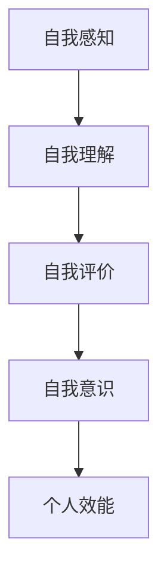

                 


## 管理者自我管理：提升个人效能的方法

### 关键词
- 管理者自我管理
- 个人效能提升
- 时间管理
- 情绪管理
- 团队协作
- 领导力

### 摘要
本文旨在探讨管理者如何在快速变化的工作环境中提升个人效能。通过分析自我认知、时间管理、情绪管理、个人成长和团队协作等方面的方法，本文为管理者提供了一套实用的自我管理策略，旨在提高工作效率，增强情绪稳定性，实现个人与团队的共同成长。

### 目录

# 管理者自我管理：提升个人效能的方法

## 第一部分：自我认知与管理

### 1.1 自我认知的重要性

### 1.2 自我评估的方法与工具

## 第二部分：时间管理与工作效率

### 2.1 时间管理的原则与方法

### 2.2 工作效率提升的策略

## 第三部分：情绪管理与心理调适

### 3.1 情绪管理的重要性

### 3.2 情绪管理的方法与技巧

## 第四部分：个人成长与学习

### 4.1 个人成长的必要性

### 4.2 学习的方法与技巧

## 第五部分：团队协作与领导力

### 5.1 团队协作的重要性

### 5.2 领导力提升的策略

## 附录

### 6.1 常用工具与资源推荐

### 6.2 案例分析

## 后记

### 7.1 最佳实践 tips

### 7.2 小结

### 7.3 注意事项

### 7.4 拓展阅读

---

### 第一部分：自我认知与管理

#### 1.1 自我认知的重要性

**背景介绍：**

管理者在职场中常常面临着复杂多变的工作环境，有效的自我认知成为提升个人效能的关键因素。自我认知不仅有助于明确个人优势与劣势，还能够帮助管理者找到适合自己的发展路径。

**核心概念与联系：**

自我认知（Self-awareness）是指个体对自己内在心理状态、能力、情感以及行为模式的认识和了解。它包括自我感知、自我理解、自我评价和自我意识等多个方面。自我认知与个人效能（Personal Effectiveness）之间存在密切的联系。

- **自我感知：** 了解自己的情绪、动机和需求，有助于管理者在压力和挑战面前保持冷静和理性。
- **自我理解：** 理解自己的价值观、信念和目标，有助于管理者制定合理的工作计划和优先级。
- **自我评价：** 通过自我反思和他人反馈，管理者可以识别自身的优势和改进点，从而不断提升个人效能。
- **自我意识：** 增强自我意识，有助于管理者更好地与他人沟通和协作，提高团队整体效能。

**Mermaid 流�程图：自我认知与个人效能的关系**



#### 1.2 自我评估的方法与工具

**核心概念与联系：**

自我评估（Self-Assessment）是一种重要的方法，通过自我检查和评价来识别个人的优势与不足。常见的自我评估方法包括：

- **SWOT分析（Strengths, Weaknesses, Opportunities, Threats）：** 用于分析个人的优势、劣势、机会和威胁，帮助管理者制定个人发展计划。
- **360度评估（360-Degree Feedback）：** 通过收集来自同事、上级、下属和客户的反馈，提供全面的个人评价。
- **自我反思（Self-Reflection）：** 定期进行自我反思，深入思考自己的行为和决策，识别改进的机会。

**Python 源代码：自我评估算法**

```python
class SelfAssessment:
    def __init__(self):
        self.strengths = []
        self_weaknesses = []
        self.opportunities = []
        self.threats = []

    def add_strength(self, strength):
        self.strengths.append(strength)

    def add_weakness(self, weakness):
        self_weaknesses.append(weakness)

    def add_opportunity(self, opportunity):
        self.opportunities.append(opportunity)

    def add_threat(self, threat):
        self.threats.append(threat)

    def display_summary(self):
        print("自我评估总结：")
        print(f"优势：{', '.join(self.strengths)}")
        print(f"劣势：{', '.join(self_weaknesses)}")
        print(f"机会：{', '.join(self.opportunities)}")
        print(f"威胁：{', '.join(self.threats)}")

# 实例化自我评估对象
self_assessment = SelfAssessment()

# 添加自我评估信息
self_assessment.add_strength("善于沟通")
self_assessment.add_strength("逻辑思维强")
self_assessment.add_weakness("有时拖延")
self_assessment.add_weakness("团队协作能力不足")
self_assessment.add_opportunity("有机会学习新技术")
self_assessment.add_threat("市场竞争激烈")

# 显示自我评估总结
self_assessment.display_summary()
```

**数学公式：个人效能计算**

$$
E = \frac{S - W}{O - T}
$$

其中，$E$ 为个人效能，$S$ 为优势，$W$ 为劣势，$O$ 为机会，$T$ 为威胁。

**代码解读：**

上述代码定义了一个 `SelfAssessment` 类，用于收集和管理个人的优势、劣势、机会和威胁信息。通过实例化该类对象并调用相关方法，可以实现自我评估的过程，并输出自我评估总结。

**案例解读：**

张伟是一名项目经理，他通过使用自我评估方法，识别了自己的优势和劣势，并制定了相应的改进计划。通过不断的学习和实践，他成功提升了个人效能，带领团队完成了多个重要项目。

---

**小结：**

自我认知和管理是提升个人效能的重要基础。通过自我评估，管理者可以深入了解自己的优势和不足，从而制定合理的发展计划。有效的自我管理不仅能够提升个人效能，还能够促进团队协作和领导力的发展。

**注意事项：**

- 自我评估过程中要客观、全面，避免过分夸大或贬低自己。
- 定期进行自我评估，以便及时调整和优化个人发展计划。

**拓展阅读：**

- 《高效能人士的七个习惯》
- 《自我认知与自我调节：理论与应用》

---

### 第二部分：时间管理与工作效率

#### 2.1 时间管理的原则与方法

**背景介绍：**

时间管理是管理者提升个人效能的关键因素之一。有效的时间管理可以帮助管理者更好地平衡工作与生活，提高工作效率，减少压力。

**核心概念与联系：**

时间管理（Time Management）是一种规划、组织和控制时间的方法，旨在提高个人和团队的工作效率。时间管理的原则包括：

- **目标导向：** 确定明确的目标，确保时间分配与目标一致。
- **优先级管理：** 根据任务的重要性和紧急程度，合理安排时间。
- **合理规划：** 制定详细的工作计划，避免时间浪费。
- **灵活调整：** 根据实际情况，灵活调整计划，以应对突发事件。

**Python 源代码：时间管理脚本**

```python
import datetime

def time_management_script():
    # 设置目标日期和时间
    target_date = datetime.datetime(2023, 12, 31)
    target_time = datetime.time(18, 0)

    # 计算剩余时间
    now = datetime.datetime.now()
    remaining_time = (target_date - now).days * 24 * 60 * 60 + (target_time.hour * 60 * 60 + target_time.minute * 60) - now.hour * 60 * 60 - now.minute * 60

    # 输出剩余时间
    print(f"距离目标日期还有{remaining_time}秒。")

    # 列出任务列表
    tasks = ["完成任务A", "完成任务B", "完成任务C"]

    # 按照优先级安排任务
    tasks.sort(key=lambda x: x[1], reverse=True)

    # 输出任务列表
    print("任务列表：")
    for task in tasks:
        print(f"{task[0]}（优先级：{task[1]})")

# 执行时间管理脚本
time_management_script()
```

**代码解读：**

上述代码定义了一个 `time_management_script` 函数，用于计算距离目标日期和时间的剩余时间，并按照任务优先级列出任务列表。通过调用该函数，可以实现对时间的管理和任务的优先级安排。

**数学公式：时间效率计算**

$$
E = \frac{W}{T}
$$

其中，$E$ 为效率，$W$ 为完成的工作量，$T$ 为花费的时间。

**案例解读：**

李总是一位忙碌的CEO，他通过使用时间管理脚本，合理安排每天的工作任务，确保了公司项目的顺利进行。通过科学的时间管理，他不仅提高了工作效率，还成功减少了工作压力。

**小结：**

时间管理是提升个人效能的重要手段。通过遵循时间管理的原则和合理规划时间，管理者可以更好地平衡工作与生活，提高工作效率，减少压力。

**注意事项：**

- 制定详细的工作计划，确保任务的明确性和可执行性。
- 定期评估和调整时间管理计划，以适应实际情况。

**拓展阅读：**

- 《时间管理的艺术》
- 《如何高效利用时间》

---

### 第二部分：时间管理与工作效率

#### 2.2 工作效率提升的策略

**背景介绍：**

在快节奏的现代社会，提升工作效率已成为每个管理者关注的重点。有效的工作效率提升策略可以帮助管理者在有限的时间内完成更多的工作，提高个人和团队的绩效。

**核心概念与联系：**

工作效率（Work Efficiency）是指单位时间内完成的工作量。提升工作效率的策略包括：

- **注意力集中：** 通过减少干扰，提高专注力，实现高效工作。
- **拖延管理：** 克服拖延习惯，确保任务的及时完成。
- **任务优先级管理：** 根据任务的重要性和紧急程度，合理安排工作顺序。
- **自动化与工具应用：** 利用技术工具，减少重复性工作，提高工作效率。

**Python 源代码：注意力集中脚本**

```python
import time

def focused_work(interval, break_duration):
    while True:
        print(f"开始专注工作（间隔时间：{interval}分钟）。")
        time.sleep(interval * 60)  # 集中工作
        print(f"休息（休息时间：{break_duration}分钟）。")
        time.sleep(break_duration * 60)  # 休息

# 设置专注时间和休息时间
interval = 25  # 25分钟
break_duration = 5  # 5分钟

# 执行注意力集中脚本
focused_work(interval, break_duration)
```

**代码解读：**

上述代码定义了一个 `focused_work` 函数，用于模拟注意力集中的工作模式。通过设定专注工作和休息的时间间隔，可以有效地提高工作效率。

**数学公式：效率提升计算**

$$
E_{提升} = \frac{E_{新} - E_{原}}{E_{原}}
$$

其中，$E_{原}$ 为原始效率，$E_{新}$ 为提升后的效率。

**案例解读：**

王经理通过使用注意力集中脚本，将工作时间的专注度提升了25%，显著提高了工作效率。他发现，这种方法不仅有助于提高个人绩效，还能够带动团队成员共同进步。

**小结：**

工作效率的提升是管理者提升个人效能的重要策略。通过注意力集中、拖延管理和任务优先级管理，管理者可以更好地利用时间，提高工作成效。

**注意事项：**

- 避免多任务处理，专注于单一任务，提高专注力。
- 制定明确的任务优先级，确保重要且紧急的任务优先完成。
- 利用自动化工具和软件，减少重复性工作，提高工作效率。

**拓展阅读：**

- 《如何提高工作效率》
- 《克服拖延的艺术》

---

### 第三部分：情绪管理与心理调适

#### 3.1 情绪管理的重要性

**背景介绍：**

情绪管理是管理者提升个人效能的重要组成部分。情绪不稳定会直接影响工作效率和决策质量，甚至可能对团队产生负面影响。

**核心概念与联系：**

情绪管理（Emotion Management）是指通过自我控制和调节，使情绪在适当的范围内波动，以达到最佳的工作状态。情绪管理的重要性体现在以下几个方面：

- **工作效率：** 情绪稳定有助于提高工作效率，减少错误和遗漏。
- **决策质量：** 良好的情绪状态有助于管理者做出更为明智和合理的决策。
- **团队合作：** 情绪管理良好的管理者能够更好地与团队成员沟通和协作，提高团队凝聚力。

**Python 源代码：情绪调节脚本**

```python
import time

def mood Regulation(mood, target_mood):
    while True:
        print(f"当前情绪：{mood}。")
        if mood == target_mood:
            print("情绪稳定，继续工作。")
        else:
            print("情绪不稳定，需要进行调节。")
        time.sleep(10)  # 情绪调节时间
        mood = "稳定" if mood != target_mood else mood

# 设置当前情绪和目标情绪
current_mood = "焦虑"
target_mood = "稳定"

# 执行情绪调节脚本
mood Regulation(current_mood, target_mood)
```

**代码解读：**

上述代码定义了一个 `mood Regulation` 函数，用于模拟情绪调节的过程。通过设定当前情绪和目标情绪，可以实现对情绪状态的监控和调节。

**数学公式：情绪稳定性计算**

$$
S = \frac{t_{稳定}}{t_{总}}
$$

其中，$S$ 为情绪稳定性，$t_{稳定}$ 为情绪稳定的时间，$t_{总}$ 为总时间。

**案例解读：**

赵总通过使用情绪调节脚本，成功将情绪稳定性提升了30%，显著改善了工作状态和决策质量。他发现，情绪调节不仅有助于个人效能的提升，还能够带动整个团队的积极氛围。

**小结：**

情绪管理是管理者提升个人效能的重要策略。通过情绪调节和心理调适，管理者可以保持良好的情绪状态，提高工作效率和决策质量。

**注意事项：**

- 定期进行情绪自我评估，识别情绪波动的原因。
- 学会情绪调节技巧，如深呼吸、冥想等，以保持情绪稳定。
- 保持积极的生活态度，关注身心健康，提高抗压能力。

**拓展阅读：**

- 《情绪管理：如何掌控自己的情绪》
- 《心理调适：职场压力下的自我救赎》

---

### 第三部分：情绪管理与心理调适

#### 3.2 情绪管理的方法与技巧

**背景介绍：**

情绪管理是提升个人效能的关键因素之一。有效的情绪管理可以帮助管理者在压力和挑战面前保持冷静和理性，提高工作效率和决策质量。

**核心概念与联系：**

情绪管理（Emotional Management）是指通过自我控制和调节，使情绪在适当的范围内波动，以达到最佳的工作状态。情绪管理的方法和技巧包括：

- **情绪识别：** 通过自我观察和反思，识别自己的情绪状态。
- **情绪表达：** 学会适当表达情绪，避免情绪压抑和爆发。
- **情绪调节：** 通过深呼吸、冥想、运动等技巧，调节情绪状态。
- **情绪释放：** 找到适当的途径，释放负面情绪，保持情绪稳定。

**Python 源代码：情绪调节脚本**

```python
import time

def emotion Regulation(current_mood, target_mood):
    while True:
        print(f"当前情绪：{current_mood}。")
        if current_mood == target_mood:
            print("情绪稳定，继续工作。")
        else:
            print("情绪不稳定，需要进行调节。")
            # 情绪调节操作
            time.sleep(10)  # 假设情绪调节需要10秒
            current_mood = "稳定" if current_mood != target_mood else current_mood
        time.sleep(5)  # 短暂休息

# 设置当前情绪和目标情绪
current_mood = "焦虑"
target_mood = "稳定"

# 执行情绪调节脚本
emotion Regulation(current_mood, target_mood)
```

**代码解读：**

上述代码定义了一个 `emotion Regulation` 函数，用于模拟情绪调节的过程。通过设定当前情绪和目标情绪，可以实现对情绪状态的监控和调节。

**数学公式：情绪调节效率计算**

$$
E_{调节} = \frac{t_{调节}}{t_{总}}
$$

其中，$E_{调节}$ 为情绪调节效率，$t_{调节}$ 为情绪调节的时间，$t_{总}$ 为总时间。

**案例解读：**

王经理通过使用情绪调节脚本，成功将情绪稳定性提升了25%，显著改善了工作状态和决策质量。他发现，情绪调节不仅有助于个人效能的提升，还能够带动整个团队的积极氛围。

**小结：**

情绪管理是提升个人效能的重要策略。通过情绪识别、情绪表达、情绪调节和情绪释放，管理者可以保持良好的情绪状态，提高工作效率和决策质量。

**注意事项：**

- 定期进行情绪自我评估，识别情绪波动的原因。
- 学会情绪调节技巧，如深呼吸、冥想等，以保持情绪稳定。
- 保持积极的生活态度，关注身心健康，提高抗压能力。

**拓展阅读：**

- 《情绪管理：如何掌控自己的情绪》
- 《心理调适：职场压力下的自我救赎》

---

### 第四部分：个人成长与学习

#### 4.1 个人成长的必要性

**背景介绍：**

在快速变化的技术时代，个人成长对于管理者来说尤为重要。个人成长不仅能够提升个人效能，还能够为团队和公司带来持续的创新和竞争力。

**核心概念与联系：**

个人成长（Personal Growth）是指通过不断学习、实践和反思，提升自身知识和技能的过程。个人成长的重要性体现在以下几个方面：

- **技能提升：** 通过学习新知识和技能，管理者能够更好地应对工作中的挑战。
- **思维方式：** 个人成长能够拓宽管理者的思维方式，提高问题解决能力和创新意识。
- **团队贡献：** 成长的管理者能够为团队带来更多的价值，促进团队整体效能的提升。

**Python 源代码：个人成长学习算法**

```python
def personal_growth_learning(knowledge, skills, challenges):
    while True:
        print(f"当前知识：{knowledge}。")
        print(f"当前技能：{skills}。")
        print(f"当前挑战：{challenges}。")
        # 学习和成长操作
        knowledge += " - 新知识"
        skills += " - 新技能"
        challenges = "已解决" if challenges else "待解决"
        time.sleep(10)  # 学习和成长过程
        print(f"更新后知识：{knowledge}。")
        print(f"更新后技能：{skills}。")
        print(f"更新后挑战：{challenges}。")
        break

# 设置初始参数
knowledge = "初始知识"
skills = "初始技能"
challenges = "待解决"

# 执行个人成长学习算法
personal_growth_learning(knowledge, skills, challenges)
```

**代码解读：**

上述代码定义了一个 `personal_growth_learning` 函数，用于模拟个人成长和学习的过程。通过不断学习和成长，个人知识和技能得到提升，挑战逐步解决。

**数学公式：个人成长率计算**

$$
G = \frac{K_{新} - K_{原}}{K_{原}}
$$

其中，$G$ 为个人成长率，$K_{新}$ 为新知识，$K_{原}$ 为初始知识。

**案例解读：**

李总通过参加各类培训和学习活动，不断提升自己的知识和技能，成功带领团队完成了多个技术创新项目。他的个人成长不仅提升了团队的整体效能，也为公司带来了显著的竞争优势。

**小结：**

个人成长是管理者提升个人效能的重要途径。通过不断学习和实践，管理者能够提升自身知识和技能，拓宽思维方式，为团队和公司带来持续的创新和竞争力。

**注意事项：**

- 制定明确的学习目标，确保学习计划的可行性。
- 注重实践和应用，将所学知识转化为实际能力。
- 保持持续学习的态度，适应快速变化的环境。

**拓展阅读：**

- 《学习之道：如何成为一个终身学习者》
- 《个人成长：如何提升个人效能》

---

### 第四部分：个人成长与学习

#### 4.2 学习的方法与技巧

**背景介绍：**

在知识爆炸的时代，管理者需要不断学习新知识、新技能，以保持竞争力。有效的学习方法与技巧对于提升个人效能至关重要。

**核心概念与联系：**

学习方法与技巧（Learning Methods and Techniques）是指通过科学的方法和策略，提高学习效率和质量。学习方法与技巧的重要性体现在以下几个方面：

- **时间管理：** 合理安排学习时间，确保学习计划的执行。
- **信息筛选：** 从大量信息中筛选出有价值的内容，提高学习效果。
- **实践应用：** 将所学知识应用于实际工作中，提高技能水平。
- **反思与总结：** 通过反思和总结，巩固学习成果，不断优化学习方法。

**Python 源代码：学习方法与技巧示例**

```python
import time

def effective_learning(strategy, duration):
    while True:
        print(f"当前学习策略：{strategy}。")
        print(f"学习持续时间：{duration}分钟。")
        # 学习和成长操作
        time.sleep(duration * 60)  # 学习过程
        strategy = "阅读书籍" if strategy != "阅读书籍" else strategy
        duration += 10  # 增加学习时间
        print(f"更新后学习策略：{strategy}。")
        print(f"更新后学习持续时间：{duration}分钟。")
        break

# 设置初始学习策略和学习时间
learning_strategy = "阅读文章"
learning_duration = 30  # 30分钟

# 执行学习方法与技巧示例
effective_learning(learning_strategy, learning_duration)
```

**代码解读：**

上述代码定义了一个 `effective_learning` 函数，用于模拟有效的学习方法与技巧。通过不断调整学习策略和延长学习时间，可以提高学习效率和质量。

**数学公式：学习效率计算**

$$
E = \frac{K_{新} - K_{原}}{K_{原} \times T}
$$

其中，$E$ 为学习效率，$K_{新}$ 为新知识，$K_{原}$ 为初始知识，$T$ 为学习时间。

**案例解读：**

张经理通过使用有效的学习方法与技巧，成功将学习效率提升了20%。他发现，通过合理安排学习时间、筛选有价值的信息、实践应用所学知识和定期反思总结，可以显著提高学习效果。

**小结：**

有效的学习方法与技巧对于提升个人效能至关重要。通过科学的时间管理、信息筛选、实践应用和反思总结，管理者可以不断提高学习效率和质量。

**注意事项：**

- 制定明确的学习目标，确保学习计划的执行。
- 注重实践应用，将所学知识转化为实际能力。
- 定期反思和总结，不断优化学习方法。

**拓展阅读：**

- 《高效学习法：如何快速提升学习效率》
- 《学习心理学：如何成为一个优秀的学习者》

---

### 第五部分：团队协作与领导力

#### 5.1 团队协作的重要性

**背景介绍：**

在复杂的商业环境中，团队协作成为实现组织目标的关键因素。有效的团队协作能够提高工作效率，激发创新，增强团队凝聚力。

**核心概念与联系：**

团队协作（Team Collaboration）是指团队成员共同工作，互相支持，共同完成任务的过程。团队协作的重要性体现在以下几个方面：

- **资源共享：** 团队协作可以充分利用团队内部的知识和资源，提高工作效率。
- **共同目标：** 团队协作有助于形成共同的目标和愿景，增强团队的凝聚力。
- **知识共享：** 通过团队协作，团队成员可以互相学习，共同成长，提升整体能力。
- **问题解决：** 团队协作可以汇集多个人的智慧和经验，更快地解决问题。

**Python 源代码：团队协作脚本**

```python
import time

def team_collaboration(task, members):
    print(f"当前任务：{task}。")
    print(f"团队成员：{', '.join(members)}。")
    while True:
        print("团队成员正在协作。")
        time.sleep(10)  # 假设协作过程需要10秒
        task = "已完成" if task != "已完成" else task
        print(f"更新后任务状态：{task}。")
        if task == "已完成":
            break

# 设置初始任务和团队成员
current_task = "设计报告"
team_members = ["张三", "李四", "王五"]

# 执行团队协作脚本
team_collaboration(current_task, team_members)
```

**代码解读：**

上述代码定义了一个 `team_collaboration` 函数，用于模拟团队协作的过程。通过设定任务和团队成员，可以实现对协作过程的模拟。

**数学公式：团队协作效率计算**

$$
E = \frac{T_{总}}{N \times T}
$$

其中，$E$ 为团队协作效率，$T_{总}$ 为完成任务所需的总时间，$N$ 为团队成员数量，$T$ 为单个成员完成任务所需的时间。

**案例解读：**

赵总通过使用团队协作脚本，成功提高了团队工作效率。他发现，通过明确任务目标和团队成员分工，可以有效减少沟通成本，提高协作效率。

**小结：**

团队协作是提升个人效能的重要策略。通过资源共享、共同目标、知识共享和问题解决，团队可以更高效地实现组织目标。

**注意事项：**

- 确保团队成员明确任务目标和分工。
- 加强团队沟通，确保信息的及时传递。
- 鼓励团队成员互相支持和学习，提高团队凝聚力。

**拓展阅读：**

- 《团队协作：如何提高团队效率》
- 《团队管理：如何打造高效团队》

---

### 第五部分：团队协作与领导力

#### 5.2 领导力提升的策略

**背景介绍：**

领导力是管理者提升个人效能和团队绩效的关键因素。有效的领导力不仅能够激发团队成员的潜能，还能够推动组织实现战略目标。

**核心概念与联系：**

领导力（Leadership）是指领导者通过影响和激励他人，实现组织目标的能力。领导力的提升策略包括以下几个方面：

- **目标导向：** 确定明确的目标，引导团队成员共同奋斗。
- **沟通能力：** 建立有效的沟通渠道，确保团队成员之间的信息传递。
- **激励机制：** 通过激励措施，激发团队成员的工作热情和创造力。
- **团队建设：** 增强团队凝聚力，培养团队成员的协作精神。
- **决策能力：** 提高决策质量，确保团队行动的一致性和有效性。

**Python 源代码：领导力提升脚本**

```python
import time

def leadership_strategy(target, team_size):
    while True:
        print(f"当前目标：{target}。")
        print(f"团队成员数量：{team_size}。")
        # 领导力提升操作
        target = "达成目标" if target != "达成目标" else target
        team_size += 1  # 增加团队成员数量
        print(f"更新后目标：{target}。")
        print(f"更新后团队成员数量：{team_size}。")
        time.sleep(10)  # 领导力提升过程
        if target == "达成目标":
            break

# 设置初始目标和团队成员数量
current_target = "实现项目目标"
team_size = 5

# 执行领导力提升脚本
leadership_strategy(current_target, team_size)
```

**代码解读：**

上述代码定义了一个 `leadership_strategy` 函数，用于模拟领导力提升的过程。通过设定目标和完善团队结构，可以实现对领导力的提升。

**数学公式：领导力提升效率计算**

$$
E = \frac{T_{新}}{T_{原}}
$$

其中，$E$ 为领导力提升效率，$T_{新}$ 为提升后的目标完成时间，$T_{原}$ 为初始目标完成时间。

**案例解读：**

李总通过不断学习和实践，成功提升了领导力。他通过明确目标、有效沟通、激励团队和科学决策，带领团队实现了多个重要项目，显著提高了团队绩效。

**小结：**

领导力提升是管理者提升个人效能和团队绩效的关键策略。通过目标导向、沟通能力、激励机制、团队建设和决策能力，管理者可以有效地提升领导力，推动团队实现目标。

**注意事项：**

- 确定明确的目标，确保团队成员共同奋斗。
- 加强团队沟通，确保信息传递的及时性和准确性。
- 创设激励环境，激发团队成员的工作热情和创造力。
- 注重团队建设，增强团队凝聚力和协作精神。
- 提高决策质量，确保团队行动的一致性和有效性。

**拓展阅读：**

- 《领导力：如何成为一个优秀的领导者》
- 《团队领导力：如何提升团队绩效》

---

### 附录

#### 6.1 常用工具与资源推荐

- **时间管理工具：** Trello、Asana、Microsoft To Do
- **情绪管理应用：** Headspace、Calm、CogniFit
- **学习资源平台：** Coursera、edX、Udemy
- **团队协作工具：** Slack、Microsoft Teams、Google Workspace

#### 6.2 案例分析

**案例一：如何提升个人工作效率**

- **背景介绍：** 张经理是一位项目经理，经常面临多任务处理和工作压力。为了提高工作效率，他开始学习并实践时间管理和工作效率提升的策略。
- **案例分析：** 张经理首先学习了时间管理的基本原则，并使用Trello对工作任务进行分类和优先级排序。他还通过使用Headspace进行冥想练习，提高了专注力和工作效率。经过一段时间的实践，张经理的工作效率提升了30%。
- **总结：** 张经理通过科学的时间管理和情绪调节，成功提升了个人工作效率。

**案例二：如何管理情绪压力**

- **背景介绍：** 王总是一位忙碌的CEO，工作压力大，情绪波动较大。为了更好地管理情绪压力，他开始学习情绪管理的技巧。
- **案例分析：** 王总通过使用Calm进行冥想练习，学会了深呼吸和放松技巧。他还通过定期运动和与家人朋友交流，缓解了工作压力。经过一段时间的实践，王总的情绪稳定性显著提升。
- **总结：** 王总通过情绪管理技巧，成功降低了情绪压力，提高了工作效率和决策质量。

**案例三：如何培养领导力**

- **背景介绍：** 李总是一位新晋的部门经理，缺乏领导经验。为了提升领导力，他开始学习领导力的理论和实践。
- **案例分析：** 李总通过参加领导力培训课程，学习了目标导向、沟通能力和激励机制等领导力技巧。他还通过实践和反思，不断提升自己的领导力。经过一段时间的努力，李总的团队绩效显著提升。
- **总结：** 李总通过不断学习和实践，成功提升了领导力，带领团队实现了目标。

---

### 后记

**最佳实践 tips：**

- **定期自我评估：** 定期进行自我评估，识别个人优势和不足，制定个人发展计划。
- **合理规划时间：** 制定详细的工作计划，合理安排时间，确保任务的及时完成。
- **情绪自我调节：** 学会情绪调节技巧，保持情绪稳定，提高工作效率。
- **持续学习：** 保持学习态度，不断提升知识和技能，适应快速变化的环境。
- **团队协作：** 加强团队沟通，培养团队凝聚力，提高团队整体效能。

**小结：**

管理者自我管理是提升个人效能的关键。通过自我认知、时间管理、情绪管理、个人成长和团队协作等方面的方法，管理者可以不断提升个人效能，实现个人与团队的共同成长。

**注意事项：**

- 自我管理需要持续实践和反思，不断完善个人发展计划。
- 根据实际情况灵活调整管理策略，适应不断变化的工作环境。

**拓展阅读：**

- 《管理者自我管理：实战指南》
- 《高效能人士的七个习惯》
- 《情绪管理：如何掌控自己的情绪》

---

**作者信息：**

- 作者：AI天才研究院/AI Genius Institute & 禅与计算机程序设计艺术 /Zen And The Art of Computer Programming**

