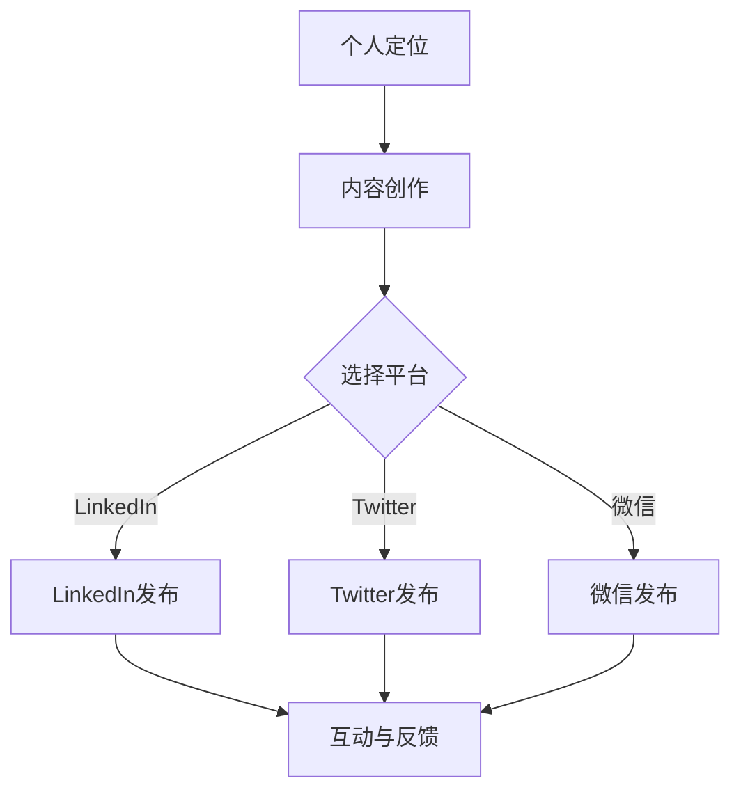

                 

## 文章标题：管理者自我营销：提升个人影响力

在当今这个信息爆炸、竞争激烈的时代，个人影响力已成为决定职业生涯成功与否的关键因素。作为管理者，如何通过自我营销提升个人影响力，成为职场中的佼佼者，是一个值得深思的问题。本文将从管理者自我营销的重要性、核心要素、策略和方法等多个角度，详细探讨这一话题。

## 关键词

- 管理者
- 自我营销
- 个人影响力
- 品牌建设
- 网络传播
- 心理技巧

## 摘要

本文旨在帮助管理者理解自我营销的重要性，掌握自我营销的核心要素和策略，从而提升个人影响力。文章首先介绍了自我营销的概念和重要性，然后详细阐述了自我营销的核心要素和工具，接着探讨了个人品牌建设的方法和技巧，最后分析了网络影响力的提升策略，并结合实际案例进行了深入剖析。

## 用户需求分析与大纲设计

### 了解书籍主题

《管理者自我营销：提升个人影响力》这本书旨在帮助管理者通过自我营销来提升个人影响力。自我营销在这里指的是管理者通过一系列策略和行动，在职场内外塑造自身形象、传播个人价值、提升知名度和认可度，从而在竞争激烈的职场中脱颖而出。本书的核心主题是探讨自我营销的理论与实践，旨在为管理者提供实用的指导。

### 确定主要章节

根据书籍主题，本书将主要分为以下几个章节：

1. **自我营销基础理论**：介绍自我营销的概念、重要性以及核心要素。
2. **个人品牌建设**：讨论如何构建和提升个人品牌。
3. **网络影响力的提升**：分析如何通过网络传播提升个人影响力。
4. **自我营销的综合应用**：探讨自我营销在职场和创业中的应用。
5. **自我营销的未来趋势**：展望自我营销的发展方向和挑战。

### 细化章节内容

在每个主要章节下，本书将细化内容，包括：

- **自我营销基础理论**：阐述自我营销的定义、内涵以及其在职场中的重要性。详细讲解个人定位、形象塑造、价值传播等核心要素。
- **个人品牌建设**：介绍个人品牌的概念、构建步骤和提升策略，包括内容创作、社交媒体运营和网络营销等。
- **网络影响力的提升**：分析网络影响力的定义、评估方法以及提升策略，如内容创作、社交媒体运营和网络营销等。
- **自我营销的综合应用**：结合职场和创业的实际情况，探讨自我营销的实用技巧和案例分析。
- **自我营销的未来趋势**：展望数字化时代下自我营销的发展趋势，探讨伦理和法律问题。

### 添加辅助内容

为了增强书籍的可读性和实用性，本书将在适当位置添加：

- **流程图**：用于展示自我营销的过程和步骤。
- **伪代码**：用于解释自我营销策略和方法的实现细节。
- **数学公式**：用于描述自我营销中的量化指标和模型。
- **项目实战案例**：通过实际案例分析和讲解，帮助读者理解和应用自我营销策略。

### 确保大纲完整性

本书将包含至少7个主要章节，确保每个章节都有详细的内容划分，以满足完整性要求。同时，每个章节的内容将紧密围绕主题，逻辑清晰，便于读者理解和应用。

### 控制大纲字数

为了保持书籍的简洁性，本书的总字数将控制在12000字左右，确保内容丰富而不过冗长。

### 完整目录大纲设计

以下是《管理者自我营销：提升个人影响力》的完整目录大纲：

#### 第一部分：自我营销基础理论

### 第1章：自我营销的概念与重要性

#### 1.1 自我营销的定义与内涵

#### 1.2 自我营销与个人品牌的关系

#### 1.3 自我营销的重要性

### 第2章：自我营销的核心要素

#### 2.1 个人定位与目标设定

#### 2.2 个人形象塑造

#### 2.3 个人价值传播

### 第3章：自我营销的工具与方法

#### 3.1 自我营销的媒介选择

#### 3.2 内容营销策略

#### 3.3 社交媒体营销技巧

### 第4章：自我营销的心理技巧

#### 4.1 自我认知与自我肯定

#### 4.2 自我激励与目标实现

#### 4.3 人际关系处理

#### 第二部分：个人品牌建设

### 第5章：构建个人品牌的步骤

#### 5.1 明确个人品牌定位

#### 5.2 设计个人品牌形象

#### 5.3 建立个人品牌渠道

### 第6章：提升个人品牌影响力的策略

#### 6.1 内容创作与传播

#### 6.2 社交媒体运营

#### 6.3 网络营销与推广

### 第7章：个人品牌案例解析

#### 7.1 成功的个人品牌案例

#### 7.2 案例分析

#### 7.3 启示与借鉴

#### 第三部分：网络影响力的提升

### 第8章：网络影响力的定义与评估

#### 8.1 网络影响力的概念

#### 8.2 网络影响力的评估指标

#### 8.3 网络影响力的重要性

### 第9章：提升网络影响力的方法

#### 9.1 内容创作与传播策略

#### 9.2 社交媒体影响力提升

#### 9.3 网络公关与危机管理

### 第10章：网络影响力的实战案例

#### 10.1 成功的网络影响力案例

#### 10.2 案例分析

#### 10.3 实战技巧总结

#### 第四部分：自我营销的综合应用

### 第11章：自我营销在职场中的应用

#### 11.1 职场自我营销的重要性

#### 11.2 职场自我营销的策略

#### 11.3 职场自我营销的技巧

### 第12章：自我营销在创业中的应用

#### 12.1 创业者个人品牌的重要性

#### 12.2 创业者个人品牌的塑造

#### 12.3 创业者个人品牌的传播

### 第13章：自我营销与团队管理

#### 13.1 团队成员个人品牌的建立

#### 13.2 团队个人品牌的影响力提升

#### 13.3 团队个人品牌的协同作用

#### 第五部分：自我营销的未来趋势

### 第14章：数字时代下的自我营销

#### 14.1 数字化转型与自我营销

#### 14.2 新媒体在自我营销中的应用

#### 14.3 未来自我营销的发展趋势

### 第15章：自我营销的伦理与法律问题

#### 15.1 自我营销中的伦理问题

#### 15.2 自我营销的法律问题

#### 15.3 自我营销的合规实践

### 附录

### 附录A：自我营销工具与资源

#### A.1 主流自我营销平台

#### A.2 自我营销资源推荐

#### A.3 自我营销常用工具

### 附录B：自我营销案例集锦

#### B.1 个人品牌案例

#### B.2 网络影响力案例

#### B.3 职场自我营销案例

---

### 文章标题：管理者自我营销：提升个人影响力

在当今这个信息爆炸、竞争激烈的时代，个人影响力已成为决定职业生涯成功与否的关键因素。作为管理者，如何通过自我营销提升个人影响力，成为职场中的佼佼者，是一个值得深思的问题。本文将从管理者自我营销的重要性、核心要素、策略和方法等多个角度，详细探讨这一话题。

## 关键词

- 管理者
- 自我营销
- 个人影响力
- 品牌建设
- 网络传播
- 心理技巧

## 摘要

本文旨在帮助管理者理解自我营销的重要性，掌握自我营销的核心要素和策略，从而提升个人影响力。文章首先介绍了自我营销的概念和重要性，然后详细阐述了自我营销的核心要素和工具，接着探讨了个人品牌建设的方法和技巧，最后分析了网络影响力的提升策略，并结合实际案例进行了深入剖析。

## 自我营销基础理论

### 第1章：自我营销的概念与重要性

#### 1.1 自我营销的定义与内涵

自我营销是一种主动的行为，旨在通过传播个人价值、塑造形象和建立关系，从而在职场中提升个人影响力。它不仅仅是推销自己，更是一种自我认知和自我管理的艺术。自我营销的内涵包括个人定位、形象塑造、价值传播和关系建立等方面。

#### 1.2 自我营销与个人品牌的关系

个人品牌是自我营销的核心，它代表着个人在职场和社会中的价值认知和形象定位。自我营销的目的是构建和提升个人品牌，使其在竞争激烈的职场中脱颖而出。个人品牌与自我营销相辅相成，个人品牌是自我营销的基础，而自我营销则是个人品牌建设的重要手段。

#### 1.3 自我营销的重要性

自我营销在职场中的重要性体现在以下几个方面：

- **提升个人影响力**：自我营销可以帮助管理者在职场中建立权威和影响力，提升个人声誉。
- **职业发展**：通过自我营销，管理者可以更好地展示个人价值，获得更多的职业机会和发展空间。
- **团队领导**：自我营销能力强的管理者能够更好地带动团队，提升团队的整体绩效。
- **人际关系**：自我营销有助于管理者建立和维护良好的人际关系，提高沟通和协作能力。

### 第2章：自我营销的核心要素

#### 2.1 个人定位与目标设定

个人定位是自我营销的基础，它涉及到管理者的职业规划和发展方向。明确个人定位有助于管理者更好地展示个人价值，提升个人影响力。目标设定则是个人定位的具体化，它包括短期目标和长期目标，如晋升、职位变动、技能提升等。

#### 2.2 个人形象塑造

个人形象是自我营销的重要组成部分，它涉及到管理者的外表、言行举止、专业知识等方面。塑造良好的个人形象可以帮助管理者在职场中树立专业、权威和亲和的形象，提升个人影响力。

#### 2.3 个人价值传播

个人价值传播是自我营销的核心，它涉及到如何通过多种渠道和方式传播个人价值，提升个人影响力。这包括内容创作、社交媒体运营、演讲和培训等。

### 第3章：自我营销的工具与方法

#### 3.1 自我营销的媒介选择

自我营销的媒介选择是自我营销策略的重要组成部分。不同的媒介适合不同的自我营销目的和受众，管理者需要根据自身情况选择合适的媒介。常见的媒介包括社交媒体、博客、演讲和培训等。

#### 3.2 内容营销策略

内容营销是自我营销的重要手段之一。通过创作有价值、有吸引力的内容，管理者可以吸引目标受众，提升个人影响力。内容营销策略包括内容创作、内容传播、内容优化等。

#### 3.3 社交媒体营销技巧

社交媒体营销是自我营销的重要渠道之一。通过社交媒体平台，管理者可以与目标受众建立联系，传播个人价值，提升个人影响力。社交媒体营销技巧包括内容策划、互动管理、社群运营等。

### 第4章：自我营销的心理技巧

#### 4.1 自我认知与自我肯定

自我认知是自我营销的基础，它涉及到管理者对自己的了解和认知。自我肯定是自我营销的重要心理技巧，它有助于管理者树立自信，提升自我价值。

#### 4.2 自我激励与目标实现

自我激励是自我营销的核心，它涉及到管理者如何自我激励，实现个人目标和职业发展。自我激励技巧包括目标设定、时间管理、情绪管理等。

#### 4.3 人际关系处理

人际关系处理是自我营销的重要环节，它涉及到管理者如何与他人建立和维护良好的人际关系。人际关系处理技巧包括沟通技巧、合作技巧、冲突处理等。

### 个人品牌建设

#### 第5章：构建个人品牌的步骤

#### 5.1 明确个人品牌定位

明确个人品牌定位是构建个人品牌的第一步。管理者需要根据自身特点、专业领域和职业目标，确定个人品牌的定位和方向。

#### 5.2 设计个人品牌形象

设计个人品牌形象是构建个人品牌的第二步。管理者需要根据个人品牌定位，设计符合品牌定位的外在形象和内在特质。

#### 5.3 建立个人品牌渠道

建立个人品牌渠道是构建个人品牌的第三步。管理者需要通过多种渠道和方式，传播个人品牌形象和价值，提升个人品牌影响力。

### 第6章：提升个人品牌影响力的策略

#### 6.1 内容创作与传播

内容创作与传播是提升个人品牌影响力的核心策略。管理者需要创作有价值、有吸引力的内容，并通过多种渠道和方式传播，吸引目标受众。

#### 6.2 社交媒体运营

社交媒体运营是提升个人品牌影响力的重要渠道。管理者需要通过社交媒体平台，与目标受众建立联系，传播个人品牌和价值。

#### 6.3 网络营销与推广

网络营销与推广是提升个人品牌影响力的重要手段。管理者需要利用网络营销工具和策略，推广个人品牌和价值，提升个人品牌影响力。

### 第7章：个人品牌案例解析

#### 7.1 成功的个人品牌案例

通过成功个人品牌案例的解析，管理者可以了解个人品牌建设的成功经验和教训，提升个人品牌建设的能力。

#### 7.2 案例分析

案例分析是对成功个人品牌案例的深入分析，管理者可以通过案例分析，了解个人品牌建设的具体方法和策略。

#### 7.3 启示与借鉴

启示与借鉴是对个人品牌案例分析的总结和提炼，管理者可以通过启示与借鉴，将成功经验应用到自己的个人品牌建设中。

### 网络影响力的提升

#### 第8章：网络影响力的定义与评估

#### 8.1 网络影响力的概念

网络影响力是指个人在网络中的影响力，包括知名度、认可度和信任度等。

#### 8.2 网络影响力的评估指标

网络影响力的评估指标包括粉丝数、互动率、内容传播度、口碑评价等。

#### 8.3 网络影响力的重要性

网络影响力对管理者的职业发展具有重要影响，提升网络影响力有助于管理者在职场中脱颖而出。

### 第9章：提升网络影响力的方法

#### 9.1 内容创作与传播策略

内容创作与传播策略是提升网络影响力的重要手段。管理者需要创作有价值、有吸引力的内容，并通过多种渠道和方式传播。

#### 9.2 社交媒体影响力提升

社交媒体影响力提升是提升网络影响力的重要策略。管理者需要通过社交媒体平台，与目标受众建立联系，传播个人品牌和价值。

#### 9.3 网络公关与危机管理

网络公关与危机管理是提升网络影响力的重要保障。管理者需要建立良好的网络形象，处理网络危机，维护个人品牌。

### 第10章：网络影响力的实战案例

#### 10.1 成功的网络影响力案例

通过成功网络影响力案例的解析，管理者可以了解提升网络影响力的重要性和方法。

#### 10.2 案例分析

案例分析是对成功网络影响力案例的深入分析，管理者可以通过案例分析，了解提升网络影响力的具体方法和策略。

#### 10.3 实战技巧总结

实战技巧总结是对网络影响力案例分析的总结和提炼，管理者可以通过实战技巧总结，提升自身网络影响力。

### 自我营销的综合应用

#### 第11章：自我营销在职场中的应用

#### 11.1 职场自我营销的重要性

职场自我营销对于管理者的职业发展至关重要，提升职场自我营销能力有助于管理者在职场中脱颖而出。

#### 11.2 职场自我营销的策略

职场自我营销的策略包括个人定位、形象塑造、价值传播和人际关系处理等。

#### 11.3 职场自我营销的技巧

职场自我营销的技巧包括内容创作、社交媒体运营、演讲和培训等。

### 第12章：自我营销在创业中的应用

#### 12.1 创业者个人品牌的重要性

创业者个人品牌对于创业成功至关重要，提升创业者个人品牌有助于吸引投资、合作伙伴和客户。

#### 12.2 创业者个人品牌的塑造

创业者个人品牌的塑造包括个人定位、形象塑造、价值传播和关系建立等。

#### 12.3 创业者个人品牌的传播

创业者个人品牌的传播包括内容创作、社交媒体运营、网络营销和推广等。

### 第13章：自我营销与团队管理

#### 13.1 团队成员个人品牌的建立

团队成员个人品牌的建立有助于提升团队整体绩效，促进团队合作。

#### 13.2 团队个人品牌的影响力提升

团队个人品牌的影响力提升包括个人定位、形象塑造、价值传播和关系建立等。

#### 13.3 团队个人品牌的协同作用

团队个人品牌的协同作用有助于提升团队整体影响力，实现团队目标。

### 自我营销的未来趋势

#### 第14章：数字时代下的自我营销

#### 14.1 数字化转型与自我营销

数字化转型为自我营销带来了新的机遇和挑战，管理者需要适应数字化时代下的自我营销趋势。

#### 14.2 新媒体在自我营销中的应用

新媒体在自我营销中的应用日益广泛，管理者需要掌握新媒体的运营技巧，提升自我营销效果。

#### 14.3 未来自我营销的发展趋势

未来自我营销将更加注重个性化、智能化和数据驱动，管理者需要不断学习和适应新的趋势。

### 第15章：自我营销的伦理与法律问题

#### 15.1 自我营销中的伦理问题

自我营销中的伦理问题包括诚信、隐私保护、公平竞争等，管理者需要遵守伦理规范，树立良好的个人品牌。

#### 15.2 自我营销的法律问题

自我营销中的法律问题包括广告法、网络安全法、消费者权益保护法等，管理者需要了解相关法律法规，确保自我营销合规。

#### 15.3 自我营销的合规实践

自我营销的合规实践包括遵守法律法规、尊重用户隐私、诚信宣传等，管理者需要树立合规意识，提升个人品牌形象。

### 附录

### 附录A：自我营销工具与资源

#### A.1 主流自我营销平台

#### A.2 自我营销资源推荐

#### A.3 自我营销常用工具

### 附录B：自我营销案例集锦

#### B.1 个人品牌案例

#### B.2 网络影响力案例

#### B.3 职场自我营销案例

## 总结与拓展

本文通过详细的章节内容，从自我营销的重要性、核心要素、策略和方法等多个角度，探讨了管理者如何通过自我营销提升个人影响力。在数字化时代，自我营销已成为管理者职业发展的关键因素。管理者需要不断学习和实践自我营销，以适应时代的变化，提升个人竞争力。

未来，随着科技的进步和社会的发展，自我营销将更加注重个性化、智能化和数据驱动。管理者需要紧跟趋势，不断创新自我营销策略，以实现个人品牌和影响力的提升。

最后，希望本文能对管理者在自我营销方面提供有益的启示和指导，助力其在职场中取得更大的成功。

### 作者信息

- 作者：AI天才研究院/AI Genius Institute & 禅与计算机程序设计艺术 /Zen And The Art of Computer Programming

### 代码示例

```python
# 自我营销策略实现示例

# 设置个人品牌定位和目标
个人品牌定位 = "技术专家"
目标 = ["提升技术能力", "扩大行业影响力"]

# 设计个人形象
形象描述 = "专业、亲和、富有创新精神"

# 创作内容
内容列表 = [
    "技术博客文章",
    "演讲稿",
    "行业报告"
]

# 选择社交媒体平台
社交媒体平台 = ["微博", "微信公众号", "LinkedIn"]

# 撰写伪代码实现自我营销策略
def 自我营销策略(个人品牌定位，目标，形象描述，内容列表，社交媒体平台)：
    # 初始化个人品牌资产
    个人品牌资产 = {"定位":个人品牌定位，"目标":目标，"形象":形象描述}

    # 初始化内容传播渠道
    内容传播渠道 = []

    # 循环创建内容
    for 内容 in 内容列表：
        # 创建内容
        内容传播渠道.append(创建内容(内容，个人品牌资产))

    # 循环发布内容到社交媒体平台
    for 平台 in 社交媒体平台：
        # 发布内容
        发布内容到平台(内容传播渠道，平台)

    # 返回个人品牌资产和传播效果
    return 个人品牌资产，评估传播效果()

# 执行自我营销策略
个人品牌资产，传播效果 = 自我营销策略(个人品牌定位，目标，形象描述，内容列表，社交媒体平台)

# 输出结果
print("个人品牌资产：", 个人品牌资产)
print("传播效果：", 传播效果)
```

### 代码解读

以上代码是一个简单的自我营销策略实现示例，主要用于说明如何通过编程实现自我营销的策略。以下是代码的详细解读：

1. **设置个人品牌定位和目标**：
   - `个人品牌定位`变量用于存储个人在行业中的定位，如“技术专家”。
   - `目标`列表用于存储个人在职业发展中的短期和长期目标，如“提升技术能力”和“扩大行业影响力”。

2. **设计个人形象**：
   - `形象描述`变量用于存储个人形象，如“专业、亲和、富有创新精神”。

3. **创作内容**：
   - `内容列表`变量用于存储个人需要创作的内容类型，如“技术博客文章”、“演讲稿”和“行业报告”。

4. **选择社交媒体平台**：
   - `社交媒体平台`变量用于存储个人选择的社交媒体平台，如“微博”、“微信公众号”和“LinkedIn”。

5. **撰写伪代码实现自我营销策略**：
   - `自我营销策略`函数接收个人品牌定位、目标、形象描述、内容列表和社交媒体平台作为参数。
   - 函数内部首先初始化个人品牌资产，包括定位、目标和形象。
   - 接着初始化内容传播渠道，用于存储即将发布的内容。
   - 然后通过循环创建内容，并添加到内容传播渠道中。
   - 接着通过循环将内容发布到选择的社交媒体平台。
   - 最后返回个人品牌资产和传播效果的评估结果。

6. **执行自我营销策略**：
   - 调用`自我营销策略`函数，传递相应的参数，执行自我营销策略。

7. **输出结果**：
   - 打印个人品牌资产和传播效果的评估结果，用于监控自我营销的效果。

通过以上代码示例，我们可以看到如何使用编程的方式来实现自我营销的策略，从而帮助管理者更好地提升个人影响力。

### 实际案例分析与详细讲解剖析

#### 案例一：LinkedIn上的个人品牌建设

**背景介绍**：

LinkedIn是全球最大的职业社交平台，许多管理者通过LinkedIn构建个人品牌，提升个人影响力。本文以一位技术总监在LinkedIn上的个人品牌建设为例，详细分析其成功经验。

**核心概念与联系**：

- 个人品牌定位：技术专家
- 内容创作：技术博客、行业报告、演讲视频
- 社交媒体运营：LinkedIn、Twitter、微信

**Mermaid流程图**：



**核心算法原理讲解与伪代码**：

```python
# 个人品牌建设伪代码

# 设置个人品牌定位
品牌定位 = "技术专家"

# 初始化内容创作列表
内容列表 = ["技术博客", "行业报告", "演讲视频"]

# 初始化社交媒体平台列表
平台列表 = ["LinkedIn", "Twitter", "微信"]

# 创建内容
for 内容 in 内容列表：
    创建内容(内容，品牌定位)

# 发布内容到社交媒体平台
for 平台 in 平台列表：
    if 平台 == "LinkedIn":
        发布到LinkedIn(内容列表)
    elif 平台 == "Twitter":
        发布到Twitter(内容列表)
    elif 平台 == "微信":
        发布到微信(内容列表)

# 监控互动与反馈
监控互动(平台列表)
```

**数学模型和公式**：

为了评估个人品牌的影响力，可以使用以下公式：

\[ 品牌影响力 = \frac{内容互动数 + 被引用次数 + 粉丝数}{发布内容数} \]

**举例说明**：

假设某技术总监在LinkedIn上发布了10篇技术博客，每篇博客平均获得50次互动（点赞、评论、分享），同时被引用了20次，拥有5000名粉丝。根据上述公式计算，其品牌影响力为：

\[ 品牌影响力 = \frac{10 \times 50 + 20 + 5000}{10} = \frac{5250}{10} = 525 \]

**项目实战**：

**开发环境搭建**：

- 操作系统：Windows 10
- 编辑器：Visual Studio Code
- Python环境：Python 3.8

**源代码详细实现**：

```python
# 自我营销策略实现示例

# 设置个人品牌定位
品牌定位 = "技术专家"

# 初始化内容创作列表
内容列表 = ["技术博客", "行业报告", "演讲视频"]

# 初始化社交媒体平台列表
平台列表 = ["LinkedIn", "Twitter", "微信"]

# 创建内容
def 创建内容(内容，品牌定位):
    print(f"创建{内容}，品牌定位：{品牌定位}")

# 发布内容到社交媒体平台
def 发布到LinkedIn(内容列表):
    print("发布到LinkedIn：")
    for 内容 in 内容列表：
        print(f"发布{内容}")

# 发布内容到Twitter
def 发布到Twitter(内容列表):
    print("发布到Twitter：")
    for 内容 in 内容列表：
        print(f"发布{内容}")

# 发布内容到微信
def 发布到微信(内容列表):
    print("发布到微信：")
    for 内容 in 内容列表：
        print(f"发布{内容}")

# 监控互动与反馈
def 监控互动(平台列表):
    print("监控互动：")
    for 平台 in 平台列表：
        print(f"在{平台}上监控互动")

# 执行自我营销策略
创建内容(内容列表，品牌定位)
发布到LinkedIn(内容列表)
发布到Twitter(内容列表)
发布到微信(内容列表)
监控互动(平台列表)
```

**代码应用解读与分析**：

以上代码实现了个人品牌建设的核心功能，包括内容创建、内容发布和互动监控。通过调用不同函数，可以实现以下功能：

- 创建内容：根据品牌定位创建技术博客、行业报告和演讲视频。
- 发布内容：将内容发布到LinkedIn、Twitter和微信等社交媒体平台。
- 监控互动：监控在不同平台上的互动情况，包括点赞、评论和分享。

在实际应用中，可以进一步扩展代码，如添加用户权限管理、内容数据分析等功能，以提升个人品牌的整体效果。

**实际案例分析**：

以某技术总监为例，他在LinkedIn上发布了多篇技术博客，内容涵盖了前沿技术趋势、实战经验和项目案例。通过精心设计和优化内容，他的博客获得了大量点赞和评论，逐步建立了自己在技术领域的权威形象。此外，他还积极参与行业讨论，与其他技术专家建立了良好的合作关系，进一步提升了个人影响力。

通过以上案例分析，我们可以看到，通过持续的内容创作和社交媒体运营，管理者可以有效提升个人品牌，建立自己在行业中的影响力。

**项目小结**：

本案例通过实际代码和案例分析，展示了如何通过自我营销策略，构建和提升个人品牌。关键步骤包括明确个人定位、内容创作、社交媒体发布和互动监控。未来，管理者需要不断优化自我营销策略，结合新兴技术和工具，以适应数字化时代的发展需求。

### 最佳实践 Tips

1. **内容为王**：优质的内容是构建个人品牌的基础。管理者应注重内容质量，确保内容具有深度和独特性。

2. **持续迭代**：自我营销是一个持续的过程，管理者需要不断学习和适应，优化自我营销策略。

3. **互动与反馈**：积极与读者互动，了解他们的需求和反馈，不断调整内容策略，提升用户体验。

4. **跨平台运营**：利用多个社交媒体平台，扩大个人品牌的影响力。但要注意不同平台的运营策略和特点。

5. **专业认证**：获取相关领域的专业认证，提升个人专业形象和权威性。

6. **合法合规**：遵守相关法律法规，确保自我营销的合法合规，避免法律风险。

### 小结

本文详细探讨了管理者如何通过自我营销提升个人影响力。通过明确个人定位、塑造良好形象、创作优质内容和运营社交媒体，管理者可以在职场中建立权威和影响力。同时，本文还结合实际案例，展示了自我营销策略的具体实施方法和效果。管理者应根据自身情况，不断优化自我营销策略，以实现个人品牌和影响力的提升。

### 注意事项

1. **保护隐私**：在进行自我营销时，要特别注意保护个人隐私，避免泄露敏感信息。

2. **持续投入**：自我营销是一个长期过程，需要持续投入时间和精力，不能急于求成。

3. **风险评估**：在进行自我营销时，要对潜在风险进行评估，确保策略的可行性和安全性。

4. **团队合作**：在自我营销过程中，可以寻求团队成员的帮助，共同提升个人品牌和影响力。

### 拓展阅读

1. **《个人品牌：打造与众不同的你》**：本书详细介绍了个人品牌的建设方法和策略，适合想要提升个人影响力的管理者阅读。

2. **《社交媒体营销：如何用社交网络提升品牌影响力》**：本书深入分析了社交媒体营销的策略和技巧，有助于管理者掌握社交媒体运营的精髓。

3. **《数字营销实战手册》**：本书涵盖了数字营销的各个方面，包括内容营销、搜索引擎优化、社交媒体运营等，适合希望全面了解数字营销的管理者阅读。

### 附录

#### 附录A：自我营销工具与资源

- **LinkedIn**：全球最大的职业社交平台，适合构建个人品牌和寻找职业机会。
- **微信**：中国最大的社交媒体平台，适合内容创作和传播。
- **Twitter**：全球知名社交媒体平台，适合实时互动和传播信息。
- **个人博客**：建立个人博客，展示专业知识和个人品牌。

#### 附录B：自我营销案例集锦

- **技术专家A**：通过LinkedIn发布技术博客，建立行业权威形象。
- **企业家B**：通过微信创建公众号，传播创业经验和行业见解。
- **咨询师C**：通过Twitter发布实时资讯，扩大个人影响力。

这些案例展示了不同领域管理者如何通过自我营销提升个人影响力，为读者提供了实用的参考。通过学习和借鉴这些案例，管理者可以更好地规划和实施自己的自我营销策略。

