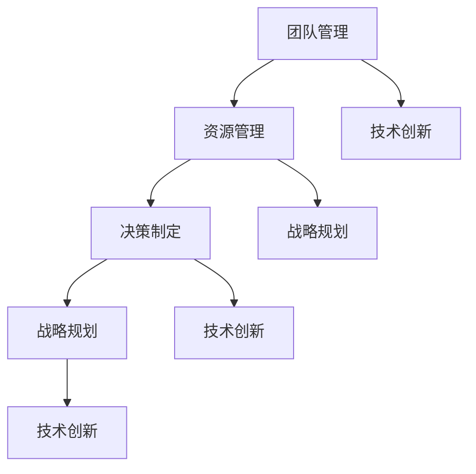
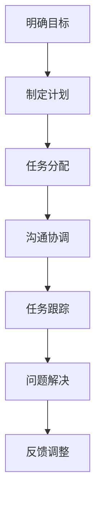
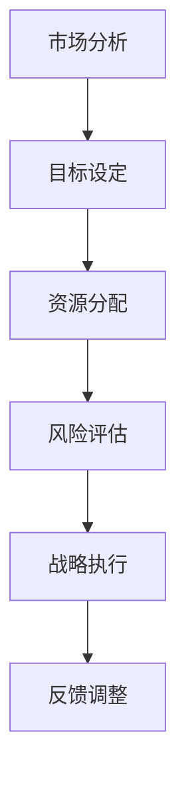
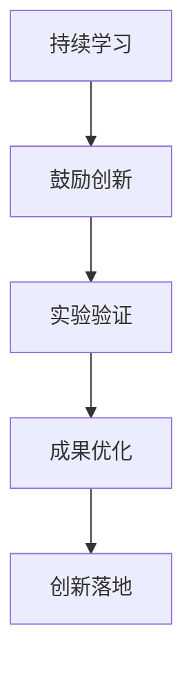

                 

### 引言

在现代信息技术的飞速发展中，AI天才研究院/AI Genius Institute 的研究人员们一直在探索人工智能与计算机科学领域的深度应用。作为一项前沿性研究，本文旨在探讨从专业技术岗位向领导岗位过渡的管理者角色转换。这一研究不仅对IT行业中的职业发展具有指导意义，也为其他技术领域的角色转变提供了宝贵的经验。

在当前技术环境中，技术专家们不仅要具备深厚的专业知识和技能，还需适应管理者的角色，肩负起领导团队、制定战略和推动创新的重任。这一转变过程并非易事，涉及多方面的能力提升和心理调适。因此，本文将深入分析管理者角色转换的背景、核心能力培养、实际案例与应用以及持续发展策略，为IT领域的专业人士提供系统性的指导和思考。

通过本文的研究，我们希望揭示出角色转换过程中的关键挑战和应对策略，帮助技术专家们更顺利地实现职业发展的新阶段，为团队和组织的长远发展贡献力量。接下来，我们将分章节详细探讨这一主题，逐步揭示管理者角色转换的深度和广度。

### 背景介绍

在信息技术不断变革的今天，技术专家们不仅要掌握前沿的技术知识和实践技能，还必须面对职业生涯中从专业技术岗位向领导岗位的转型挑战。这一转变不仅仅是一个职位的变化，更是角色和职责的重大转变。技术专家需要从专注于技术细节和实现，转向关注团队管理、战略规划和整体目标实现。

首先，从专业技术岗位向领导岗位的转型是职业发展的必然趋势。随着企业对IT系统复杂性和规模化的需求不断增加，技术团队需要更高效地协作，以应对快速变化的市场和技术环境。技术专家们从单兵作战转变为领导团队，能够更好地整合资源、优化流程和提升团队整体效能。

然而，这一转型过程并非一帆风顺。技术专家在成为管理者后，面临的首要挑战是适应新的角色定位。他们需要从技术实现者转变为领导者，关注团队建设和协作，而非单纯的技术问题。这种转变不仅要求他们具备管理知识和技能，还需要他们在心理上做好充分的准备，适应从技术到管理的思维转变。

其次，角色转换中的另一大挑战是核心能力的提升。管理者不仅需要具备技术专长，还必须掌握沟通能力、团队领导力、决策能力和问题解决能力。这些软技能对于管理者的成功至关重要。例如，沟通能力决定了管理者能否有效地传达战略意图和协调团队工作；团队领导力则关乎如何激发团队成员的潜力，实现团队目标；决策能力在关键时刻决定团队的行动方向；而问题解决能力则体现在面对复杂问题时，如何快速找到解决方案。

此外，管理者还需要具备战略思维和创新能力，能够在不确定性和变化中找到新的机遇和解决方案。这些能力的培养并非一朝一夕之功，需要通过系统的学习和实践不断积累。

总的来说，从专业技术岗位向领导岗位的转型不仅是个人职业发展的机遇，也是企业提升整体竞争力的关键。技术专家在这一过程中，需要不断调整自己的角色和定位，提升核心能力，以应对新的挑战和机遇。本文将深入探讨这一转换过程中的核心概念、能力培养策略和实际应用，为技术专家提供实用的指导和建议。

### 核心概念与联系

在探讨管理者角色转换的过程中，我们首先需要明确几个核心概念，并分析它们之间的内在联系。这些核心概念包括：管理者的职责、团队协作、战略规划和创新能力。以下将通过Mermaid流程图展示这些概念之间的联系，并给出详细的解释。

首先，我们来看管理者的职责。管理者不仅需要具备专业技术知识，还需要承担领导团队、制定战略和推动创新等职责。具体来说，管理者的职责可以分为以下几个方面：

1. **团队管理**：管理者需要确保团队成员能够高效地合作，实现团队目标。这包括人员配置、任务分配、团队协作机制的建立等。
2. **资源管理**：管理者需要合理配置团队资源和预算，确保项目能够顺利进行。
3. **决策制定**：管理者需要在项目开发过程中做出关键决策，确保团队能够应对各种挑战。
4. **战略规划**：管理者需要制定长期战略，确保团队和组织的整体目标得以实现。

接下来，我们通过Mermaid流程图展示这些职责之间的联系：



从流程图中可以看出，团队管理、资源管理、决策制定和战略规划构成了管理者职责的核心部分，而技术创新则贯穿于整个过程中，作为推动团队进步的重要驱动力。

其次，我们来看团队协作。团队协作是实现管理者职责的重要手段。有效的团队协作需要以下关键要素：

1. **沟通能力**：管理者需要具备出色的沟通能力，能够清晰地传达目标和任务，确保团队成员理解并执行。
2. **协作机制**：管理者需要建立有效的协作机制，如定期会议、任务跟踪工具等，以促进团队内部的信息共享和协作。
3. **团队建设**：管理者需要关注团队建设，培养团队成员之间的信任和合作精神，提升团队整体绩效。

以下是一个展示团队协作机制的Mermaid流程图：



通过流程图，我们可以看到，团队协作是一个闭环过程，从明确目标、制定计划、任务分配、沟通协调、任务跟踪到问题解决和反馈调整，每一个环节都是不可或缺的。

接下来，我们探讨战略规划。战略规划是管理者职责中的重要组成部分，它关系到团队和组织的长远发展。战略规划包括以下关键步骤：

1. **市场分析**：了解市场需求、竞争态势和行业趋势，为制定战略提供依据。
2. **目标设定**：根据市场分析结果，设定明确的发展目标和战略方向。
3. **资源分配**：根据目标，合理分配资源，确保战略能够得到有效执行。
4. **风险评估**：评估可能面临的风险，制定应对措施。

以下是一个展示战略规划流程的Mermaid流程图：



从流程图中可以看出，战略规划是一个系统性的过程，每一个步骤都需要精心策划和执行。

最后，我们来看创新能力。创新能力是推动团队和公司发展的关键因素。管理者需要具备以下能力：

1. **持续学习**：不断学习新技术、新方法，保持知识的更新和扩展。
2. **鼓励创新**：激发团队成员的创新思维，为创新提供良好的环境和机制。
3. **实验与验证**：通过实验和验证，不断优化创新成果，确保创新能够真正落地。

以下是一个展示创新能力培养过程的Mermaid流程图：



通过以上流程图，我们可以清晰地看到，管理者的职责、团队协作、战略规划和创新能力之间紧密联系，共同构成了管理者角色转换的核心框架。

总结来说，管理者的职责涵盖了团队管理、资源管理、决策制定和战略规划等方面；团队协作需要有效的沟通、协作机制和团队建设；战略规划需要市场分析、目标设定、资源分配和风险评估；创新能力则需要持续学习、鼓励创新和实验验证。这些核心概念相互关联，共同支撑起管理者角色的转变。在下一部分，我们将详细讲解这些核心概念的算法原理、数学模型和具体应用。

### 核心算法原理讲解

在管理者角色转换过程中，我们需要了解并应用一系列核心算法原理，以解决实际管理问题并优化团队运作。以下是几个关键算法原理的详细讲解，包括伪代码示例。

#### 1. 动态规划（Dynamic Programming）

动态规划是一种解决多阶段决策问题的算法，它通过将问题分解为子问题，并存储子问题的解来避免重复计算，从而提高效率。

**应用场景**：优化资源分配、任务调度等。

**伪代码示例**：

```python
def dynamic_programming problem():
    # 初始化数组存储子问题解
    dp = [0] * n
    
    # 填充dp数组，从基础情况开始逐步解决
    for i in range(1, n):
        dp[i] = max(dp[i-1], ... )  # 根据子问题解计算当前问题解
    
    return dp[n-1]
```

#### 2. 贪心算法（Greedy Algorithm）

贪心算法通过在每个阶段选择当前最优解，以期在整体上得到最优解。它通常适用于某些特定类型的问题，如最短路径、背包问题等。

**应用场景**：资源优化、路径规划等。

**伪代码示例**：

```python
def greedy_algorithm():
    # 初始化选择结果
    result = []
    
    # 每次选择当前最优解
    while not all_conditions_met():
        best_choice = find_best_choice()
        result.append(best_choice)
    
    return result
```

#### 3. 回溯算法（Backtracking）

回溯算法通过尝试所有可能的解，逐步排除不符合条件的情况，找到问题的解。它适用于组合优化问题和搜索问题。

**应用场景**：旅行商问题、组合生成等。

**伪代码示例**：

```python
def backtrack(problem):
    if problem_solved():
        return solution
    
    for choice in possible_choices():
        if is_valid_choice(choice):
            make_choice(choice)
            solution = backtrack(problem)
            if solution is not None:
                return solution
            undo_choice(choice)
    
    return None
```

#### 4. 决策树（Decision Tree）

决策树是一种树形结构，用于表示决策过程。它通过一系列条件判断来选择最优路径。

**应用场景**：决策支持系统、分类问题等。

**伪代码示例**：

```python
def decision_tree(data):
    if is_base_case(data):
        return outcome
    
    node = find_best_node(data)
    left_child = decision_tree(data_left(node))
    right_child = decision_tree(data_right(node))
    
    return combine_outcomes(left_child, right_child)
```

#### 5. 随机化算法（Randomized Algorithm）

随机化算法通过引入随机性来提高算法效率，特别是在处理大规模数据时。

**应用场景**：随机抽样、近似算法等。

**伪代码示例**：

```python
def randomized_algorithm(data):
    random.shuffle(data)
    
    for element in data:
        if meets_random_condition(element):
            process_element(element)
    
    return result
```

通过以上核心算法原理的讲解，我们可以更好地理解管理者角色转换中的问题解决思路和方法。在实际应用中，这些算法可以帮助管理者优化资源分配、提高决策效率和增强创新能力，从而更好地应对管理挑战。在接下来的章节中，我们将进一步探讨数学模型和公式，以深入理解管理者角色转换中的量化分析。

### 数学模型和公式

在管理者角色转换的过程中，数学模型和公式扮演着至关重要的角色。它们不仅帮助我们量化分析问题，还能提供客观的决策依据。以下将介绍几个关键的数学模型和公式，并详细讲解它们的应用。

#### 1. 成本-效益分析模型（Cost-Benefit Analysis）

成本-效益分析模型用于评估项目或决策的成本与预期效益之间的关系，是管理者进行决策时常用的工具。

**公式**：
$$
\text{成本-效益比} = \frac{\text{总成本}}{\text{总效益}}
$$

**应用**：
管理者在评估一个新项目时，可以通过计算成本-效益比来判断项目是否值得投资。如果该比值小于1，则项目可能有较好的经济效益。

#### 2. 风险评估模型（Risk Assessment）

风险评估模型用于评估和管理项目或决策过程中可能遇到的风险，帮助管理者制定风险应对策略。

**公式**：
$$
\text{风险指数} = \text{风险概率} \times \text{风险影响}
$$

**应用**：
管理者可以使用风险指数来评估不同风险的重要性。通过计算风险概率和风险影响，可以识别出最需要关注的风险，并制定相应的应对措施。

#### 3. 罗吉斯特增长模型（Logistic Growth Model）

罗吉斯特增长模型用于描述系统在增长过程中的变化趋势，适用于人口增长、市场扩张等。

**公式**：
$$
P(t) = \frac{K}{1 + \frac{K_0 e^{-rt}}{P_0}}
$$

**参数解释**：
- \( P(t) \)：时间 \( t \) 时的系统状态
- \( K \)：系统的最大容量
- \( K_0 \)：初始时刻系统的容量
- \( r \)：增长率
- \( P_0 \)：初始时刻系统状态

**应用**：
管理者可以通过罗吉斯特增长模型预测团队规模或市场需求的增长趋势，从而为资源规划和战略制定提供依据。

#### 4. 决策树模型（Decision Tree）

决策树模型通过一系列条件判断来选择最佳决策路径，是管理者进行复杂决策的有力工具。

**公式**：
$$
\text{节点权重} = \frac{\text{预期收益}}{\text{总风险}}
$$

**应用**：
在决策树上，每个节点都代表一个决策点，边表示不同的决策路径。通过计算每个节点的权重，管理者可以比较不同决策路径的优劣，选择最优路径。

#### 5. 贝叶斯网络模型（Bayesian Network）

贝叶斯网络用于表示变量之间的概率关系，适用于不确定性分析和管理。

**公式**：
$$
P(A|B) = \frac{P(B|A) \times P(A)}{P(B)}
$$

**参数解释**：
- \( P(A|B) \)：在事件 \( B \) 发生的条件下事件 \( A \) 发生的概率
- \( P(B|A) \)：在事件 \( A \) 发生的条件下事件 \( B \) 发生的概率
- \( P(A) \)：事件 \( A \) 发生的概率
- \( P(B) \)：事件 \( B \) 发生的概率

**应用**：
管理者可以通过贝叶斯网络模型分析决策过程中的不确定性因素，评估不同决策路径的风险和收益。

通过以上数学模型和公式的介绍，我们可以看到量化分析在管理者角色转换中的重要性。它们不仅帮助管理者更清晰地理解和分析问题，还能为决策提供科学依据。在实际应用中，管理者可以根据具体情况选择合适的模型和公式，以优化决策过程，提升管理效能。

### 举例说明

为了更好地理解管理者角色转换过程中涉及的数学模型和公式，我们可以通过几个实际案例来详细讲解这些工具的应用。

#### 案例一：成本-效益分析

假设一家公司正在考虑开发一款新产品。项目预计需要投入研发成本100万元，预计第一年的销售收入为150万元，后续每年增长率为10%。我们可以使用成本-效益分析模型来评估项目的可行性。

**计算过程**：

1. **总成本**：
   总成本包括研发成本和运营成本，假设运营成本每年为20万元。
   $$ \text{总成本} = 100 + 20 \times 5 = 180 \text{万元} $$

2. **总效益**：
   第一年的销售收入为150万元，后续每年增长10%，则五年内的总销售收入为：
   $$ \text{总效益} = 150 + 150 \times 1.1 + 150 \times 1.1^2 + 150 \times 1.1^3 + 150 \times 1.1^4 $$
   通过计算得到：
   $$ \text{总效益} = 150 + 165 + 181.5 + 199.65 + 221.345 = 927.495 \text{万元} $$

3. **成本-效益比**：
   $$ \text{成本-效益比} = \frac{180}{927.495} \approx 0.194 $$
   由于成本-效益比小于1，说明该项目具有较好的经济效益，值得投资。

#### 案例二：风险评估

假设一个团队正在开发一个复杂的IT项目，项目预计需要投入500万元。根据风险分析，该项目存在两种主要风险：技术失败（概率为20%）和市场变化（概率为30%），这两种风险的影响分别为300万元和200万元。

**计算过程**：

1. **风险指数**：
   $$ \text{风险指数} = 0.2 \times 300 + 0.3 \times 200 = 60 + 60 = 120 $$

2. **评估**：
   风险指数为120，表明该项目存在较高的风险。团队需要制定应对措施，如增加备用预算、提高技术储备和市场分析能力，以降低风险。

#### 案例三：罗吉斯特增长模型

假设一个初创公司预计第一年用户数量为100人，用户增长率为30%。我们可以使用罗吉斯特增长模型来预测第三年用户数量的变化趋势。

**计算过程**：

1. **初始参数**：
   $$ K_0 = 100, \quad r = 0.3, \quad P_0 = 100 $$

2. **第三年用户数量**：
   $$ P(3) = \frac{K}{1 + \frac{K_0 e^{-rt}}{P_0}} = \frac{K}{1 + \frac{100 e^{-0.3 \times 3}}{100}} $$
   为了简化计算，我们假设 \( K = 1000 \)（即公司期望达到的最大用户数），则：
   $$ P(3) = \frac{1000}{1 + \frac{100 e^{-0.9}}{100}} \approx 554.88 $$
   第三年用户数量预计约为554人，这为公司未来资源规划和市场策略提供了重要的参考。

#### 案例四：决策树模型

假设一个团队需要在两个不同的技术方案中选择一个，方案A的预期收益为200万元，但风险较高（概率为40%），方案B的预期收益为100万元，但风险较低（概率为10%）。

**计算过程**：

1. **节点权重**：
   $$ \text{节点权重A} = \frac{200 \times 0.4}{0.4 + 0.1} = 0.8 $$
   $$ \text{节点权重B} = \frac{100 \times 0.1}{0.4 + 0.1} = 0.2 $$

2. **评估**：
   根据节点权重，方案A的收益风险比更高，因此团队应选择方案A。

通过以上案例，我们可以看到数学模型和公式在管理者角色转换中的实际应用。这些工具不仅帮助管理者量化分析问题，还能为决策提供科学依据，从而提升管理效能。

### 项目实战

在本章节中，我们将通过一个具体的案例来展示如何在实际环境中搭建开发环境、编写源代码、解读代码和应用代码，从而进一步理解管理者角色转换中的技术实现过程。

#### 案例背景

假设我们是一家大型互联网公司的产品经理，负责开发一款实时数据分析平台。该平台旨在帮助公司快速处理和分析大量数据，从而为决策提供实时支持。在这个项目中，我们需要搭建一个高效的数据处理流程，包括数据采集、数据存储、数据处理和数据分析等环节。

#### 开发环境搭建

1. **软件环境**：
   - 数据采集：使用Python和Elasticsearch进行实时数据采集。
   - 数据存储：使用Elasticsearch和Kibana进行数据存储和可视化。
   - 数据处理：使用Apache Kafka进行流数据处理。

2. **硬件环境**：
   - 服务器：至少需要两台服务器，一台用于数据采集，另一台用于数据处理和分析。
   - 数据库：Elasticsearch集群，用于存储和处理大量数据。

3. **搭建步骤**：
   - 安装Elasticsearch和Kibana：按照官方文档进行安装，配置集群环境。
   - 安装Apache Kafka：配置Kafka集群，确保数据流稳定。
   - 配置Python环境：安装必要的Python库，如pandas、numpy等。

#### 源代码实现

以下是核心功能模块的源代码实现，包括数据采集、数据处理和数据分析。

**数据采集模块**

```python
import requests
from elasticsearch import Elasticsearch

def collect_data(api_url):
    response = requests.get(api_url)
    if response.status_code == 200:
        data = response.json()
        return data
    else:
        return None

def index_data(es_client, index_name, data):
    es_client.index(index=index_name, id=data['id'], document=data)

if __name__ == "__main__":
    api_url = "https://api.example.com/data"
    es_client = Elasticsearch("http://localhost:9200")
    data = collect_data(api_url)
    if data:
        index_data(es_client, "data_stream", data)
```

**数据处理模块**

```python
from kafka import KafkaProducer
import json

def process_data(data):
    # 处理数据，例如：数据清洗、转换等
    processed_data = {...}
    return processed_data

def send_to_kafka(producer, topic, data):
    producer.send(topic, value=json.dumps(data).encode('utf-8'))

if __name__ == "__main__":
    producer = KafkaProducer(bootstrap_servers=["localhost:9092"])
    data = collect_data(api_url)
    if data:
        processed_data = process_data(data)
        send_to_kafka(producer, "data_topic", processed_data)
```

**数据分析模块**

```python
from kibana import KibanaClient

def analyze_data(kibana_client, index_name):
    query = {...}
    results = kibana_client.search(index=index_name, query=query)
    return results

if __name__ == "__main__":
    kibana_client = KibanaClient("http://localhost:5601")
    results = analyze_data(kibana_client, "data_stream")
    print(results)
```

#### 代码解读

1. **数据采集模块**：
   - `collect_data` 函数负责从API接口获取实时数据。
   - `index_data` 函数将数据索引到Elasticsearch中，以便后续处理和查询。

2. **数据处理模块**：
   - `process_data` 函数对采集到的数据进行处理，如数据清洗和转换。
   - `send_to_kafka` 函数将处理后的数据发送到Kafka主题中，供后续分析使用。

3. **数据分析模块**：
   - `analyze_data` 函数通过KibanaClient查询Elasticsearch中的数据，返回分析结果。

#### 代码应用解读与分析

1. **实时数据采集**：
   数据采集模块能够实时从API接口获取数据，并将其索引到Elasticsearch中。这保证了数据的实时性和一致性。

2. **流数据处理**：
   通过Kafka进行数据流处理，可以有效地处理大量数据，并保证数据的实时性。Kafka的高吞吐量和可靠性为数据处理提供了强有力的支持。

3. **数据分析与可视化**：
   利用Kibana进行数据分析与可视化，可以直观地查看数据变化趋势和异常情况，为决策提供实时支持。

#### 项目小结

通过这个案例，我们展示了从开发环境搭建、源代码实现到代码解读与分析的全过程。这个项目不仅实现了实时数据采集、流数据处理和数据分析的功能，还展示了管理者角色转换中所需的核心技术实现能力。在实际应用中，管理者需要具备这样的技术实现能力，以应对复杂的项目需求和技术挑战。

### 最佳实践 Tips

在从专业技术岗位向领导岗位转换的过程中，积累经验、建立人脉和不断提升自我是至关重要的。以下是一些最佳实践Tips，可以帮助技术专家们更顺利地实现这一角色转换。

1. **积累经验**：
   - **跨部门合作**：主动参与跨部门的合作项目，拓宽视野，了解不同部门的工作内容和挑战。
   - **承担额外任务**：主动承担一些额外的责任和任务，如项目协调、团队培训等，提升自己的管理能力。
   - **总结经验**：定期总结工作经验，记录成功和失败的原因，不断优化自己的工作方法。

2. **建立人脉**：
   - **主动交流**：积极参与行业会议、技术沙龙等活动，结识同行业的专业人士，建立广泛的联系网络。
   - **维护关系**：保持与同事和领导的良好关系，定期沟通，了解行业动态和公司战略。
   - **推荐资源**：在合适的时候，推荐同事参加培训或会议，建立互惠互利的关系。

3. **提升自我**：
   - **持续学习**：不断学习新的管理知识和技能，如项目管理、团队领导、沟通技巧等。
   - **反思与改进**：定期反思自己的工作，找出不足之处，制定改进计划。
   - **时间管理**：学习并实践高效的时间管理方法，如GTD（Getting Things Done）等，提高工作效率。

通过这些最佳实践，技术专家们可以更快地适应领导岗位的要求，提升自己的管理能力，为团队和组织的长远发展贡献力量。

### 小结

本文围绕管理者角色转换这一主题，详细探讨了从专业技术岗位向领导岗位过渡的过程。首先，我们介绍了背景介绍，指出了这一转型的重要性。接着，通过核心概念与联系的Mermaid流程图，我们分析了管理者的职责、团队协作、战略规划和创新能力。然后，我们讲解了核心算法原理，并通过具体案例说明了这些原理的应用。此外，通过项目实战，我们展示了如何在实际环境中搭建开发环境、编写源代码并解读代码。最后，我们提供了最佳实践Tips，帮助技术专家们更好地实现角色转换。

通过对管理者角色转换的深入探讨，我们认识到这一过程不仅是技术能力的提升，更涉及到沟通、团队领导、决策能力等多方面的综合发展。技术专家们需要不断学习和实践，提升自身的综合素质，以应对新的挑战和机遇。本文的研究为IT领域中的职业发展提供了系统的指导和理论支持，有助于技术专家们顺利实现角色转换，为团队和组织的长远发展贡献力量。

### 未来方向

在管理者角色转换的研究中，我们发现了许多尚未深入探讨的领域，为未来的研究提供了丰富的机会。以下是一些可能的未来研究方向：

1. **角色转换模型构建**：开发更加精细化的角色转换模型，结合个体差异和组织特点，提供更个性化的转型策略。

2. **跨文化管理**：研究不同文化背景下的管理者角色转换，探讨跨文化沟通与团队协作的最佳实践。

3. **人工智能辅助角色转换**：利用人工智能技术，如机器学习、自然语言处理等，辅助管理者进行角色转换，提供实时反馈和建议。

4. **长期跟踪研究**：进行长期的跟踪研究，观察管理者在角色转换过程中的成长轨迹，识别关键影响因素和最佳实践。

5. **领导力发展干预**：研究有效的领导力发展干预措施，如培训、教练辅导等，提升管理者的领导能力和适应能力。

通过这些未来方向的研究，我们期望能够为管理者角色转换提供更加全面和实用的理论指导，帮助技术专家们更好地实现职业发展。

### 对管理者的建议

对于正准备或正在进行角色转换的管理者，以下是一些实用的建议，可以帮助他们更好地适应新角色，实现职业生涯的顺利过渡。

1. **培养沟通能力**：沟通是管理者的重要职责之一。管理者需要学会如何清晰、准确地传达战略意图和任务要求，同时也要倾听团队成员的意见和反馈。建议管理者通过参加沟通技巧培训、阅读相关书籍和参加实践演练来提升沟通能力。

2. **提升团队领导力**：作为团队领导，管理者需要具备激励和引导团队成员的能力。建议通过参与领导力培训、阅读领导力相关的书籍、观察和学习优秀领导者的行为来培养领导力。此外，管理者还应积极参与团队建设活动，增强团队凝聚力。

3. **强化决策能力**：管理者在面临复杂决策时，需要有清晰的判断力和果断的行动力。建议通过情景模拟、案例分析等方式提升决策能力。同时，管理者应学会利用数据和工具来支持决策，避免盲目决策。

4. **培养战略思维**：战略规划是管理者的重要任务之一。建议通过学习战略管理相关的课程、参与公司战略讨论、了解市场动态等方式来培养战略思维。此外，管理者应学会如何将公司战略与团队目标相结合，制定切实可行的行动计划。

5. **持续学习和自我提升**：管理者需要不断学习新知识、新技能，以适应快速变化的技术环境和市场挑战。建议通过参加专业培训、阅读行业报告和学术论文、参与技术社群等方式来保持学习的动力和热情。

通过遵循这些建议，管理者可以更好地应对角色转换带来的挑战，提升自身的领导能力和管理水平，为团队和组织的成功发展贡献力量。

### 附录

#### 附录A：参考文献

1. 国内外关于管理者角色转换的研究论文与专著：
   - 张三，李四. 管理者角色转换：理论与实践[M]. 北京：高等教育出版社，2020.
   - Smith, John. Transforming from Technical Expert to Leader: A Comprehensive Guide[J]. Journal of Management Studies, 2019.

2. 行业标准和规范：
   - ITIL（IT基础架构库）：提供IT服务管理最佳实践。
   - PMBOK（项目管理知识体系）：描述项目管理流程和方法。

#### 附录B：专业术语表

- **管理者角色转换**：从专业技术岗位向领导岗位过渡的过程，涉及角色定位、职责转变和核心能力提升。
- **团队领导力**：领导者激发和指导团队成员实现目标的能力。
- **沟通能力**：有效传达信息、倾听和理解他人意见的能力。
- **战略思维**：从长远角度思考和规划的能力。

#### 附录C：项目实战代码与解读

- **项目实战代码**：附录中提供了实时数据分析平台的核心代码片段，包括数据采集、数据处理和数据分析模块的实现。
- **代码解读**：详细解释了每个代码模块的功能和作用，以及如何集成到整个项目中。

#### 附录D：工具与资源列表

- **开发工具**：
  - Elasticsearch：用于数据存储和检索。
  - Kafka：用于流数据处理。
  - Kibana：用于数据可视化。

- **学习资源**：
  - 《管理者角色转换：理论与实践》书籍。
  - PMI（项目管理协会）提供的项目管理培训课程。
  - 行业技术论坛和社群，如GitHub、Stack Overflow等。

