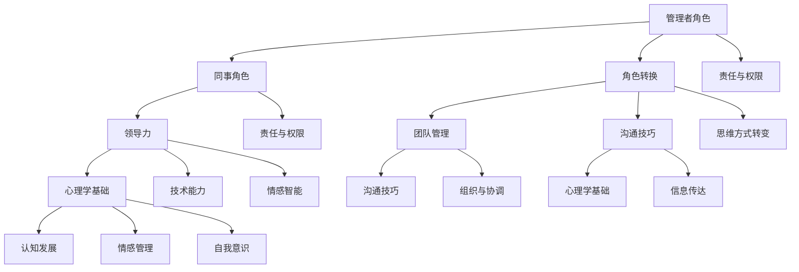

                 

### 引言

在信息技术飞速发展的今天，管理者角色转换，尤其是从同事到上级的过渡，成为了众多专业人士职业生涯中的一个重要环节。这种角色转换不仅仅是一个位置的变化，更是思维方式、行为模式以及责任范畴的深刻转变。本文旨在深入探讨这一过程，帮助那些即将或已经进入管理层的IT专业人士顺利完成角色转换，实现个人和团队的共同成长。

首先，我们需要明确什么是管理者角色转换。从同事到上级的过渡，意味着个体将从被管理者转变为管理者，需要承担更多的责任和决策权。这一过程中，不仅要求个体具备较强的专业能力，还需要具备优秀的领导力、团队管理能力以及有效的沟通技巧。然而，很多专业人士在转换过程中会遇到各种挑战，比如如何平衡工作与生活、如何处理团队中的冲突等。

本文将从多个角度探讨管理者角色转换的各个方面。首先，我们将介绍管理者角色的核心概念及其相互联系，通过Mermaid流程图来帮助读者更直观地理解。接着，我们会探讨心理学基础，包括认知发展、情感管理以及自我意识，这些心理学因素在角色转换中起着至关重要的作用。随后，我们将讨论领导力的发展，从基础概念到关键要素，再到具体的领导力发展策略，提供全方位的指导。

在团队管理方面，我们将探讨如何建立高效团队，包括团队成员的角色与职责、团队沟通与协作、以及团队绩效评估。接下来，我们将专注于沟通技巧，详细讨论如何提升沟通效果，并给出实际案例进行说明。此外，时间管理和任务优先级也是作为上级必须掌握的技能，我们将提供具体策略和时间管理算法原理。

冲突解决是管理过程中的一个常见挑战，我们将提供有效的冲突管理策略和技巧。最后，我们将探讨如何在新角色中保持工作与生活的平衡，并提供一些建议和最佳实践。

通过本文的深入探讨，读者将能够全面了解管理者角色转换的过程和关键要素，为即将到来的角色转变做好充分准备。无论是刚刚晋升的管理者，还是准备走上管理岗位的专业人士，本文都将为您提供有价值的指导和策略。

### 关键词

- 管理者角色转换
- 同事到上级过渡
- 领导力发展
- 团队管理
- 沟通技巧
- 时间管理
- 冲突解决
- 工作与生活平衡

### 摘要

本文旨在探讨从同事到上级的角色转换过程，帮助专业人士顺利完成这一转变。通过介绍核心概念、心理学基础、领导力发展、团队管理、沟通技巧、时间管理和优先级、冲突解决以及工作与生活平衡，本文提供了一套全面的管理策略和实践指南。读者将了解到如何有效应对角色转换中的各种挑战，提升管理技能，实现个人与团队的共同成长。

## 核心概念与联系

在探讨管理者角色转换之前，我们首先需要明确几个核心概念，这些概念不仅是理解这一过程的基础，也是角色转换过程中相互联系的关键要素。以下是几个核心概念的定义及其相互关系：

1. **管理者角色**：管理者是负责规划、组织、领导和控制团队或组织资源以达成目标的人。这一角色不仅要求具备深厚的专业知识，还需要具备良好的领导力和管理技能。

2. **同事角色**：同事是指在同一个团队或组织中，与管理者处于同一层次的专业人士。同事之间的关系主要是合作和互助，目标一致但责任分配不同。

3. **角色转换**：从同事到上级的转换，不仅是一个职位的变化，更是责任、权限和思维方式的深刻转变。这种转换涉及到个人能力的提升，同时也需要建立新的工作关系和团队动态。

4. **领导力**：领导力是指激励、引导和影响他人，以实现共同目标的能力。领导力不仅包括技术能力，还涵盖情感智能、决策能力以及影响力等要素。

5. **团队管理**：团队管理是指通过有效的组织、协调和领导，使团队成员协同工作，实现团队目标的过程。这包括团队成员的角色与职责分配、沟通与协作、以及绩效评估等方面。

6. **沟通技巧**：沟通技巧是指信息传达、理解以及反馈的能力。有效的沟通不仅能够提高团队工作效率，还能增强团队凝聚力，减少误解和冲突。

7. **心理学基础**：心理学基础包括认知发展、情感管理和自我意识等。这些心理学因素在角色转换中起着至关重要的作用，帮助个体更好地适应新的角色和职责。

为了更直观地理解这些核心概念及其相互关系，我们可以使用Mermaid流程图进行描述：



Mermaid流程图展示了管理者角色转换过程中的核心概念及其相互关系。例如，管理者角色和同事角色都涉及责任与权限的分配，而角色转换则涉及到思维方式、领导力以及团队管理等方面的深刻变化。此外，领导力不仅包括技术能力，还涵盖情感智能，而团队管理和沟通技巧都依赖于心理学基础，如认知发展、情感管理和自我意识。

通过这个Mermaid流程图，我们可以清晰地看到每个核心概念在角色转换过程中的作用和相互关系。这不仅有助于理解这些概念，还能帮助读者在实际工作中更好地运用这些概念，实现有效的角色转换和管理。

## 心理学基础

在管理者角色转换的过程中，心理学基础起着至关重要的作用。心理学为我们提供了理解人类行为、思维模式以及情感反应的框架，这对于成功地进行角色转换至关重要。以下是几个关键的心理学术语及其在角色转换中的应用。

### 认知发展

认知发展理论是由瑞士心理学家让·皮亚杰提出的，它探讨了儿童和成人如何通过思考、学习和适应环境来构建知识体系。这一理论对于理解管理者角色转换中的思维方式转变至关重要。

1. **同化与顺应**：认知发展过程中，个体通过同化和顺应来处理新信息。同化是指将新信息纳入已有知识框架中，而顺应是指调整已有知识框架以适应新信息。在角色转换中，同化可以帮助管理者将新的管理知识和技能整合到已有的经验中，而顺应则要求管理者灵活调整思维方式以适应新的角色和职责。

2. **图式**：图式是指个体在认知过程中形成的思维框架。管理者在角色转换过程中需要建立新的图式，如领导力图式和团队管理图式，以更好地应对新的挑战和职责。

### 情感管理

情感管理是指个体如何识别、理解和调节自己的情绪，以及如何识别和应对他人的情感反应。在管理者角色转换中，情感管理尤为重要。

1. **情绪智力**：情绪智力（Emotional Intelligence，EQ）是指个体识别、理解、管理和利用情感信息的能力。高情商的管理者能够更好地处理团队中的冲突，建立积极的工作关系，并提高团队的士气。

2. **自我意识**：自我意识是指个体对自己情感、行为和思维的认识。自我意识较高的管理者能够更好地了解自己的优势和不足，从而在角色转换中采取更有效的策略。

### 自我意识

自我意识是指个体对自己情感、行为和思维的认识。自我意识在管理者角色转换中起着关键作用。

1. **自我效能感**：自我效能感是指个体对自己完成特定任务的信心。管理者在角色转换过程中需要建立较高的自我效能感，以应对新的挑战和职责。

2. **自我反思**：自我反思是指个体通过回顾和分析自己的行为和决策，以实现个人成长和发展。管理者通过自我反思，可以更好地理解自己在角色转换过程中的表现，发现并改正不足。

### 心理学模型在角色转换中的应用

在角色转换过程中，多种心理学模型可以提供有价值的指导。

1. **心理适应模型**：心理适应模型探讨个体如何适应新环境和新角色。管理者在角色转换过程中需要应用这一模型，通过调整行为和思维方式来适应新的职责和要求。

2. **职业发展阶段模型**：职业发展阶段模型描述个体在职业生涯中的不同阶段及其特点。管理者角色转换可以被视为职业发展中的一个关键阶段，这一模型可以帮助个体了解这一阶段的特点和挑战，从而采取相应的策略。

### 实际案例

假设一位技术专家晋升为项目经理，他在角色转换过程中面临的主要挑战之一是思维方式的变化。在作为技术专家时，他的主要任务是解决技术问题，而在担任项目经理后，他需要更多地关注团队管理、任务分配和时间管理。

通过认知发展理论，他可以意识到需要从同化和顺应的角度处理新信息。他可以将已有的技术知识和管理技能同化到项目管理中，同时调整思维方式以适应新的职责。

在情感管理方面，他需要提高情绪智力，更好地处理团队中的冲突和压力。通过自我意识，他可以更好地了解自己的情绪反应，从而采取更有效的应对策略。

此外，通过自我反思，他可以定期回顾自己的表现，发现并改正不足。例如，他可能发现自己在团队沟通方面存在不足，因此可以采取一些具体的沟通技巧来改善这一情况。

总之，心理学基础为管理者角色转换提供了理论框架和实用工具。通过理解认知发展、情感管理和自我意识，管理者可以更好地应对角色转换中的各种挑战，实现个人和团队的共同成长。

## 领导力发展

在从同事到上级的角色转换过程中，领导力的发展至关重要。领导力不仅仅是指导和管理团队，更是一种激励和引导他人共同实现目标的能力。在这一部分，我们将探讨领导力的基本概念、关键要素以及具体的发展策略。

### 领导力的基本概念

领导力是指通过影响和激励他人来实现共同目标的能力。它不仅仅是职位或权力的象征，更是一种态度和技能。领导力可以存在于各个层级，不仅限于高级管理者。有效的领导力能够激发团队成员的潜力，提高团队绩效，并建立积极的工作环境。

### 关键领导力要素

1. **影响力**：影响力是领导力的核心要素之一，它指的是通过说服、激励和引导他人来实现共同目标的能力。领导者需要具备强大的影响力，以便在团队中建立信任和合作。

2. **决策能力**：决策能力是指领导者能够在复杂和不确定的环境中做出明智和有效的决策。优秀的领导者能够权衡各种因素，快速做出决策，并在决策过程中保持透明和公正。

3. **情感智力**：情感智力（Emotional Intelligence，EQ）是领导者成功的关键因素之一。情感智力包括自我意识、自我管理、社会意识和关系管理。领导者需要具备高情商，以便更好地处理人际关系，理解团队成员的情感需求，并有效地解决冲突。

4. **影响力**：影响力是领导者能够影响和激励团队成员的能力。这包括说服力、激励能力和榜样作用。领导者需要通过展示自己的价值观和行为，来影响和激励团队成员。

### 领导力发展的策略

1. **自我反思**：自我反思是领导力发展的重要策略之一。领导者需要定期反思自己的行为、决策和表现，识别自己的优势和不足，并制定改进计划。通过自我反思，领导者可以不断提升自己的能力和影响力。

2. **持续学习**：领导力是一个持续发展的过程，领导者需要不断学习新的知识和技能，以适应不断变化的环境。这包括参加培训课程、阅读相关书籍、参与研讨会以及与同行交流经验。

3. **建立信任**：建立信任是领导力的基础。领导者需要通过诚实、透明和公正的行为来赢得团队成员的信任。信任能够增强团队的凝聚力，提高工作效率，并促进团队合作。

4. **激励团队成员**：领导者需要了解团队成员的需求和动机，并采取有效的激励措施来激发他们的潜力。这包括提供明确的期望、认可团队成员的贡献、提供成长和发展的机会等。

5. **培养团队协作**：团队协作是实现共同目标的关键。领导者需要创造一个支持协作和开放沟通的环境，鼓励团队成员分享想法和意见，并共同解决问题。

### 伪代码：领导力发展的核心算法原理

为了更直观地理解领导力发展的核心算法原理，我们可以使用伪代码来描述这一过程：

```python
def leadership_development():
    # 初始化领导力属性
    influence = initial_influence
    decision_making_ability = initial_decision_making_ability
    emotional_intelligence = initial_emotional_intelligence
    impact = initial_impact
    
    # 自我反思
    while self_reflection_required:
        reflect_on_behavior()
        identify_weaknesses()
        create_improvement_plan()
        
    # 持续学习
    while learning_required:
        attend_training_courses()
        read_books()
        participate_in_workshops()
        engage_in_peer_exchange()
        
    # 建立信任
    build_trust(through_honesty, transparency, fairness)
    
    # 激励团队成员
    motivate_team_members(by_setting_clear_expectations, recognizing_contributions, providing_growth_opportunities)
    
    # 培养团队协作
    foster_team_collaboration(through_supportive_environment, open_communication, shared_problem_solving)
    
    # 输出最终领导力水平
    return (influence, decision_making_ability, emotional_intelligence, impact)

# 调用领导力发展函数
final_leadership_skills = leadership_development()
```

通过伪代码，我们可以看到领导力发展包括自我反思、持续学习、建立信任、激励团队成员和培养团队协作等多个步骤。这些步骤相互作用，共同推动领导者能力的提升。

### 实际案例

假设一位技术团队负责人想要提升自己的领导力。他可以采取以下步骤：

1. **自我反思**：定期记录自己的行为和决策，识别自己的优势和不足。例如，他可能发现自己在处理团队冲突时缺乏耐心，因此可以制定一个具体的改进计划。

2. **持续学习**：参加领导力培训课程，阅读相关书籍，与同行交流经验。这些学习活动可以帮助他获得新的知识和技能。

3. **建立信任**：通过诚实和透明的行为来赢得团队成员的信任。例如，他在团队会议上主动分享自己的工作进展和决策依据，增强团队成员对他的信任。

4. **激励团队成员**：了解团队成员的需求和动机，提供明确的期望和认可。例如，他可以设置明确的绩效目标，并在团队达成目标后组织庆祝活动。

5. **培养团队协作**：创造一个支持协作和开放沟通的环境。例如，他可以组织团队建设活动，鼓励团队成员分享想法和意见。

通过这些具体的行动，这位技术团队负责人可以逐步提升自己的领导力，实现从同事到上级的成功转换。

### 结论

领导力发展是管理者角色转换过程中的关键环节。通过自我反思、持续学习、建立信任、激励团队成员和培养团队协作，领导者可以不断提升自己的能力，实现个人和团队的共同成长。理解领导力的基本概念和关键要素，并采取具体的发展策略，将为管理者在角色转换过程中提供有力的支持。

## 团队管理

团队管理是管理者角色转换中的关键组成部分，有效管理团队不仅关系到项目的成功，还影响到团队的整体士气和员工满意度。在这一部分，我们将探讨如何建立高效的团队，包括团队成员的角色与职责、团队沟通与协作、以及团队绩效评估。

### 建立高效的团队

1. **团队成员的角色与职责**：首先，明确每个团队成员的角色和职责至关重要。团队成员应清楚自己的工作内容、责任范围以及与其他角色的协作关系。这可以通过制定详细的职位描述来实现。例如，项目经理负责整体项目的规划和管理，而技术专家则负责具体的技术实现。

2. **团队沟通与协作**：良好的沟通和协作是高效团队的基础。管理者需要建立有效的沟通机制，确保信息在团队中畅通无阻。这可以通过定期团队会议、即时通讯工具以及文档共享平台来实现。此外，鼓励团队成员之间进行开放、坦诚的沟通，以解决潜在的问题和冲突。

3. **团队文化建设**：团队文化是团队精神的核心。一个积极向上的团队文化可以增强团队的凝聚力，提高工作效率。管理者可以通过设立团队价值观、制定团队目标以及组织团队建设活动来塑造团队文化。

### 团队绩效评估

1. **明确绩效标准**：为了对团队成员进行有效评估，管理者需要制定明确的绩效标准。这些标准应包括可量化的目标和具体的衡量指标，如任务完成时间、项目质量、团队合作表现等。

2. **定期绩效评估**：定期对团队成员进行绩效评估，可以帮助管理者及时发现并解决绩效问题。这可以通过季度评估或半年评估来实现。在评估过程中，管理者应与团队成员进行一对一的沟通，了解他们的工作进展、遇到的挑战以及需要支持的地方。

3. **反馈与改进**：绩效评估不仅仅是评价团队成员的工作表现，更是提供反馈和改进的机会。管理者应给予具体、建设性的反馈，帮助团队成员了解自己的优势和不足，并制定改进计划。

### 伪代码：团队绩效评估的核心算法原理

为了更直观地理解团队绩效评估的核心算法原理，我们可以使用伪代码来描述这一过程：

```python
def team_performance_evaluation(team_members, performance_standards):
    # 初始化绩效评估结果
    performance_scores = {member: 0 for member in team_members}
    
    # 对每个团队成员进行评估
    for member in team_members:
        # 收集相关数据
        data = collect_data(member, performance_standards)
        
        # 计算绩效分数
        performance_scores[member] = calculate_score(data, performance_standards)
        
        # 提供反馈
        provide_feedback(member, performance_scores[member])
        
    # 输出绩效评估结果
    return performance_scores

def collect_data(member, performance_standards):
    # 收集与绩效标准相关的数据
    # 例如：任务完成时间、项目质量、团队合作表现等
    data = {}
    for criterion in performance_standards:
        data[criterion] = get_member_data(member, criterion)
    return data

def calculate_score(data, performance_standards):
    # 根据数据计算绩效分数
    score = 0
    for criterion, value in data.items():
        if value >= performance_standards[criterion]["threshold"]:
            score += performance_standards[criterion]["weight"]
    return score

def provide_feedback(member, score):
    # 提供具体、建设性的反馈
    feedback = f"{member}，您的绩效得分为{score}分。以下是一些改进建议："
    for criterion, details in performance_standards.items():
        if data[criterion] < details["threshold"]:
            feedback += f"在{criterion}方面，您需要加强。"
    print(feedback)
```

通过伪代码，我们可以看到团队绩效评估包括数据收集、分数计算和反馈提供三个主要步骤。这些步骤相互关联，共同实现团队绩效的有效评估。

### 实际案例

假设一家科技公司有一个由5名成员组成的产品开发团队，管理者需要对其进行绩效评估。以下是一个具体的案例：

1. **明确绩效标准**：管理者制定了以下绩效标准：
   - 任务完成时间：任务必须在预定时间内完成
   - 项目质量：代码质量需达到公司标准，无严重缺陷
   - 团队合作：积极参与团队讨论，协助解决团队成员的问题

2. **定期绩效评估**：在每个季度的最后一个月，管理者对团队成员进行绩效评估。

3. **数据收集**：管理者收集了每个团队成员在过去季度内的任务完成时间、项目质量和团队合作表现。

4. **分数计算**：根据收集的数据，管理者计算出每个团队成员的绩效分数。

5. **反馈提供**：管理者与每个团队成员进行一对一的沟通，提供具体、建设性的反馈，并帮助制定改进计划。

通过这个实际案例，我们可以看到团队绩效评估的整个过程，包括绩效标准的制定、数据收集、分数计算和反馈提供，以及团队成员如何根据反馈进行改进。

### 结论

团队管理是管理者角色转换中的关键环节，通过明确团队成员的角色与职责、建立有效的沟通与协作机制，以及进行定期的团队绩效评估，管理者可以确保团队的高效运作。有效的团队管理不仅有助于实现项目的成功，还能提高团队士气和员工满意度，为组织的长期发展奠定基础。

## 沟通技巧

有效的沟通是管理者角色转换成功的关键要素之一。作为上级，良好的沟通技巧能够确保信息传递准确无误，减少误解和冲突，提高团队的工作效率和士气。在这一部分，我们将探讨提升沟通技巧的策略，并结合实际案例来详细说明。

### 提升沟通技巧的策略

1. **明确沟通目标**：在任何沟通之前，明确沟通目标是至关重要的。这包括确定你要传达的信息、希望达成的结果以及目标受众。明确的目标可以帮助你在沟通过程中保持专注，避免跑题。

2. **主动倾听**：倾听是有效沟通的核心。作为上级，你需要主动倾听团队成员的意见和建议，不仅是为了理解他们的观点，更是为了建立信任和尊重。倾听不仅仅是听到对方说什么，更重要的是理解其背后的意图和感受。

3. **清晰表达**：清晰、简洁的表达是有效沟通的关键。避免使用复杂的术语和冗长的句子，尽量用简单明了的语言来表达你的意思。同时，确保你的表达具有逻辑性和连贯性，使对方容易理解和接受。

4. **非言语沟通**：非言语沟通，如肢体语言、面部表情和语调，在沟通中起着重要作用。作为上级，你需要注意自己的非言语信号，确保它们与你的口头表达一致。同时，也要关注对方的非言语信号，以更好地理解对方的情感和态度。

5. **反馈与确认**：在沟通过程中，及时给予反馈并确认对方是否理解你的意思。这可以通过提问和总结对方的话来实现。例如，你可以说：“你刚刚说的意思是我需要在下周前完成这个报告，是吗？”这样可以确保双方对沟通内容有共同的理解。

### 实际案例

假设一位项目经理需要与团队成员讨论一个关键的项目进度问题。以下是一个具体的沟通案例：

1. **明确沟通目标**：项目经理的目标是了解团队当前的工作进度，识别潜在的问题，并讨论解决方案。

2. **主动倾听**：项目经理召开了一次团队会议，首先让每个团队成员报告自己的工作进展，并耐心倾听他们的反馈。

3. **清晰表达**：在团队成员报告完毕后，项目经理清晰地表达了自己的担忧：“根据目前的进度，我们似乎无法在预定时间内完成这个项目。我们需要讨论一下可能的解决方案，以确保项目能够按时交付。”

4. **非言语沟通**：项目经理保持开放的肢体语言，微笑面对团队成员，以营造一个轻松的沟通氛围。

5. **反馈与确认**：项目经理在讨论过程中不断提问，以确认团队成员是否理解他的意思。例如，他问：“我理解你的意思是，我们可以通过加班来赶进度，是这样吗？”

通过这个案例，我们可以看到提升沟通技巧的具体应用。项目经理通过明确沟通目标、主动倾听、清晰表达、关注非言语沟通和及时给予反馈，有效地与团队成员进行了沟通，并解决了项目进度问题。

### 实际案例：提升沟通效果

除了上述案例，以下是一个提升沟通效果的实战技巧：

**情景演练**：

情景：项目经理需要在紧急情况下与团队成员讨论一个即将超时的关键任务。

步骤：
1. **准备**：项目经理提前准备了一份任务清单和可能的解决方案。
2. **情景模拟**：项目经理邀请团队成员参加一个情景模拟会议，模拟讨论关键任务的紧急情况。
3. **反馈**：在情景模拟结束后，项目经理与团队成员讨论模拟过程中的有效沟通点和不妥之处。
4. **调整**：根据反馈，项目经理和团队成员调整沟通策略，如明确任务优先级、使用简洁的语言等。

通过情景演练，项目经理和团队成员可以更好地理解有效沟通的技巧，并在实际工作中应用这些技巧，提高沟通效果。

### 结论

良好的沟通技巧是管理者角色转换成功的关键。通过明确沟通目标、主动倾听、清晰表达、关注非言语沟通和及时给予反馈，管理者可以有效地与团队成员进行沟通，减少误解和冲突，提高团队的工作效率和士气。通过实际案例和情景演练，我们可以看到提升沟通技巧的具体策略和实战方法，为管理者在角色转换过程中提供了有价值的指导。

## 时间管理和优先级

作为上级，有效的时间管理和任务优先级设置是确保工作效率和项目成功的关键。在这一部分，我们将探讨时间管理的基本原理、任务优先级设置策略，以及如何通过实际案例和伪代码来详细讲解这些策略。

### 时间管理的基本原理

1. **明确任务目标**：时间管理的第一步是明确任务目标。这包括确定每个任务的最终目标和所需的时间范围。通过明确任务目标，可以确保在任务执行过程中始终专注于目标，从而提高工作效率。

2. **任务分解**：将大任务分解为小任务，有助于更好地管理和监控任务进度。每个小任务应具有明确的开始和结束时间，以及具体的执行步骤。

3. **优先级排序**：对任务进行优先级排序，确保关键任务优先执行。优先级排序可以考虑任务的重要性和紧迫性，如使用埃森豪威尔矩阵（Eisenhower Matrix）来区分紧急且重要、紧急但不重要、不紧急但重要以及不紧急且不重要的任务。

4. **定时工作**：使用定时工具来管理工作时间，如番茄工作法（Pomodoro Technique），将工作时间分为25分钟的工作周期和5分钟的休息时间，以保持专注和提高工作效率。

### 任务优先级设置策略

1. **紧急-重要矩阵**：使用紧急-重要矩阵（Eisenhower Matrix）来区分任务的优先级。紧急且重要的事务应立即处理，紧急但不重要的事务可以委托给他人处理，不紧急但重要的事务应安排在空闲时间处理，而不紧急且不重要的事务可以推迟或放弃。

2. **关键路径法**：在项目管理中，关键路径法（Critical Path Method，CPM）用于确定项目任务的最佳顺序和最短完成时间。关键路径上的任务必须按时完成，以确保项目按时交付。

3. **优先级调优**：根据实际情况动态调整任务优先级。例如，如果某个紧急任务的出现，可能需要重新评估和调整现有任务的优先级，以确保整个项目的顺利进行。

### 伪代码：时间管理和优先级设置的核心算法原理

为了更直观地理解时间管理和优先级设置的核心算法原理，我们可以使用伪代码来描述这一过程：

```python
def time_management_and_priority_setting(tasks):
    # 初始化任务列表
    sorted_tasks = prioritize_tasks(tasks)
    
    # 分配时间
    assign_times_to_tasks(sorted_tasks)
    
    # 输出最终任务列表
    return sorted_tasks

def prioritize_tasks(tasks):
    # 根据紧急-重要矩阵对任务进行排序
    sorted_tasks = sort_by_eisenhower_matrix(tasks)
    return sorted_tasks

def sort_by_eisenhower_matrix(tasks):
    # 初始化任务列表
    sorted_tasks = []
    
    # 分类任务
    urgent_important = [task for task in tasks if task['urgency'] and task['importance']]
    urgent_not_important = [task for task in tasks if task['urgency'] and not task['importance']]
    not_urgent_important = [task for task in tasks if not task['urgency'] and task['importance']]
    not_urgent_not_important = [task for task in tasks if not task['urgency'] and not task['importance']]
    
    # 按优先级排序
    sorted_tasks = urgent_important + urgent_not_important + not_urgent_important + not_urgent_not_important
    return sorted_tasks

def assign_times_to_tasks(sorted_tasks):
    # 分配时间
    for task in sorted_tasks:
        # 根据任务的重要性和紧急性分配时间
        task['time'] = allocate_time(task['urgency'], task['importance'])
        
def allocate_time(urgency, importance):
    # 根据任务的重要性和紧急性动态分配时间
    if urgency and importance:
        return max_time
    elif urgency:
        return medium_time
    elif importance:
        return medium_time
    else:
        return min_time
```

通过伪代码，我们可以看到时间管理和优先级设置的核心算法原理，包括任务优先级排序、任务时间分配以及根据紧急性和重要性动态调整时间分配。

### 实际案例

假设一位项目经理需要管理一个包含多个任务的复杂项目，以下是一个具体的案例：

1. **明确任务目标**：项目经理明确项目最终目标是按期完成并达到预期质量。

2. **任务分解**：项目经理将项目分解为多个具体任务，每个任务都有明确的开始和结束时间。

3. **优先级排序**：使用紧急-重要矩阵对任务进行排序，确定哪些任务需要优先处理。

4. **时间分配**：根据任务的紧急性和重要性分配具体的时间。

5. **动态调整**：在项目执行过程中，根据实际情况重新评估任务优先级和时间分配。

### 结论

有效的时间管理和任务优先级设置是管理者角色转换中不可或缺的技能。通过明确任务目标、任务分解、优先级排序和时间分配，以及动态调整策略，管理者可以确保项目高效运作并按时交付。通过实际案例和伪代码，我们可以看到这些策略的具体应用和实现方法，为管理者提供了实用的指导。

## 冲突解决

在管理者角色转换的过程中，冲突解决是一项至关重要的技能。无论是团队内部的分歧，还是与团队成员之间的矛盾，有效解决冲突能够维护团队的和谐，提高工作效率和士气。在这一部分，我们将探讨冲突的类型、原因以及解决策略。

### 冲突的类型

1. **任务冲突**：由于任务目标、优先级或资源分配等方面的差异而产生的冲突。这种冲突通常涉及任务完成时间和质量的要求。

2. **角色冲突**：由于角色职责和权限的不明确而产生的冲突。例如，项目经理和团队成员之间的职责划分不清，可能导致互相推诿责任。

3. **价值观冲突**：由于个人价值观、工作理念和目标的不同而产生的冲突。这种冲突往往涉及到深层次的价值观差异，需要更加细致的沟通和协调。

4. **关系冲突**：由于个人关系、沟通不畅或误解而产生的冲突。这种冲突可能导致团队成员之间的不信任和隔阂。

### 冲突的原因

1. **目标不一致**：团队目标不明确或存在分歧，导致成员在任务执行过程中产生冲突。

2. **资源有限**：资源（如时间、预算、人力等）有限，导致成员在资源分配上产生竞争，从而引发冲突。

3. **沟通不畅**：信息传递不畅或误解，导致团队成员对任务目标、职责和进度产生分歧。

4. **个人情绪**：个人情绪因素，如压力、焦虑或不满，可能导致团队成员在工作中产生冲突。

### 冲突解决策略

1. **积极倾听**：在解决冲突时，首先要积极倾听对方的意见和感受。这有助于理解对方的立场，找到冲突的根本原因。

2. **明确目标**：明确团队的目标和任务，确保所有成员对任务目标和期望有共同的理解。这有助于减少由于目标不一致而产生的冲突。

3. **公平公正**：在处理冲突时，应保持公平公正的态度。这意味着要避免偏袒某一方，确保每个成员都能公平地表达自己的观点。

4. **寻求共识**：通过讨论和协商，寻求所有成员都能接受的解决方案。这有助于缓解由于价值观或关系冲突而产生的紧张情绪。

5. **建立规则**：制定明确的团队规则和工作流程，以确保所有成员在执行任务时都有章可循。这有助于减少由于角色不明确而产生的冲突。

### 实际案例

假设一个团队在项目执行过程中出现了严重的任务冲突，以下是一个具体的案例：

1. **识别冲突**：项目经理发现团队成员A和团队成员B在任务分配上存在分歧，A认为B分配的任务量过大，而B则认为A的任务完成时间过长。

2. **积极倾听**：项目经理分别与A和B进行一对一的沟通，了解他们的意见和感受。

3. **明确目标**：项目经理重申项目的整体目标，确保团队成员对项目任务和目标有共同的理解。

4. **寻求共识**：项目经理组织了一次团队会议，让A和B共同讨论任务的重新分配和调整方案。通过协商，他们达成了一项双方都能接受的解决方案。

5. **建立规则**：项目经理制定了新的任务分配规则，明确了每个团队成员的职责和任务量，以防止类似冲突再次发生。

### 结论

冲突解决是管理者角色转换中的重要环节。通过积极倾听、明确目标、公平公正、寻求共识和建立规则，管理者可以有效地解决团队中的冲突，维护团队的和谐。实际案例展示了这些策略的具体应用，为管理者提供了实用的指导。

## 工作与生活平衡

在新角色中保持工作与生活平衡是许多管理者面临的重大挑战。这种平衡不仅对管理者的身心健康至关重要，也对团队的整体表现产生深远影响。在这一部分，我们将探讨工作与生活平衡的重要性，并提供具体策略来帮助管理者实现这一目标。

### 工作与生活平衡的重要性

1. **心理健康**：长期的工作压力可能导致焦虑、抑郁等心理健康问题。保持工作与生活的平衡有助于减轻压力，提高心理健康水平。

2. **家庭关系**：工作与生活平衡有助于管理者更好地照顾家庭，维护家庭关系的稳定和谐。

3. **工作效率**：良好的工作与生活平衡能够提高管理者的专注力和工作效率，从而更好地完成工作任务。

4. **团队士气**：管理者保持工作与生活的平衡，能够树立积极的榜样，提高团队士气，增强团队凝聚力。

### 保持工作与生活平衡的策略

1. **设定优先级**：明确工作和生活的优先事项，确保关键任务和重要活动得到妥善安排。

2. **有效时间管理**：合理安排时间，确保工作时间和休闲时间得到有效分配。使用时间管理工具，如日程表和待办事项清单，可以帮助你更好地控制时间。

3. **灵活工作安排**：与团队成员和管理层协商，灵活调整工作时间。例如，采用弹性工作时间或远程办公，可以更好地适应个人生活需求。

4. **学会说“不”**：在时间和资源有限的情况下，学会拒绝不必要的工作任务，以避免过度劳累。

5. **保持健康习惯**：定期锻炼、保持健康的饮食习惯和充足的睡眠，有助于提高身体和心理的抵抗力，更好地应对工作压力。

6. **家庭和个人时间**：确保每周留出固定的家庭和个人时间，用于陪伴家人、进行个人爱好和放松身心。

### 实际案例

假设一位新晋升的项目经理，在角色转换过程中面临工作与生活平衡的挑战。以下是一个具体的案例：

1. **设定优先级**：项目经理首先列出工作和生活的优先事项，如家庭聚会、项目进度会议和健康锻炼等，并确保这些事项得到妥善安排。

2. **有效时间管理**：项目经理使用日程表和待办事项清单来管理时间，确保每天的工作和私人时间得到合理安排。例如，他每天早上都会查看日程，确保没有冲突的活动。

3. **灵活工作安排**：项目经理与团队成员和管理层协商，灵活调整工作时间。例如，他在需要时采用远程办公，以便在家庭聚会和项目任务之间灵活切换。

4. **学会说“不”**：项目经理学会了拒绝一些不紧急或不重要的任务，以避免过度劳累。例如，当他已经有两个重要的项目正在同时进行时，他拒绝了额外的兼职工作。

5. **保持健康习惯**：项目经理每天早上都会进行30分钟的有氧运动，晚上则会安排时间陪伴家人。他还坚持每天保持健康的饮食习惯和充足的睡眠。

### 结论

工作与生活平衡是管理者角色转换中不可忽视的重要方面。通过设定优先级、有效时间管理、灵活工作安排、学会说“不”以及保持健康习惯，管理者可以更好地平衡工作与生活，提高身心健康和整体工作效率。实际案例展示了这些策略的具体应用，为管理者提供了实用的指导。

## 结论

管理者角色转换，从同事到上级的过渡，不仅是一个职位的变化，更是一次深层次的思维模式、行为模式和责任范畴的转型。在这个过程中，我们探讨了多个关键方面，包括核心概念与联系、心理学基础、领导力发展、团队管理、沟通技巧、时间管理和优先级、冲突解决以及工作与生活平衡。通过这些全面而深入的探讨，我们希望为即将或已经进入管理层的IT专业人士提供一套实用的策略和指南。

首先，理解核心概念和相互联系是角色转换的基础。通过Mermaid流程图，我们清晰地展示了管理者角色的各个方面及其相互关系，帮助读者建立全局视野。接着，心理学基础为角色转换提供了理论框架，包括认知发展、情感管理和自我意识，这些因素在适应新角色中起着至关重要的作用。

领导力发展是管理者角色转换的关键要素。我们探讨了领导力的基本概念和关键要素，并通过伪代码详细描述了领导力发展的核心算法原理，帮助读者在实践中不断提升自己的领导能力。

团队管理是管理者职责的核心部分。通过明确团队成员的角色与职责、建立有效的沟通与协作机制，以及进行定期的团队绩效评估，管理者可以确保团队的高效运作。

沟通技巧是管理者成功的关键。我们提供了提升沟通技巧的策略，并通过实际案例和情景演练，展示了如何在实际工作中应用这些策略。

时间管理和优先级设置是确保工作效率的关键。通过明确任务目标、分解任务、优先级排序和时间分配，管理者可以有效地管理时间和资源。

冲突解决是维护团队和谐的重要技能。我们讨论了冲突的类型、原因以及解决策略，并通过实际案例展示了如何有效地解决冲突。

最后，工作与生活平衡是管理者角色转换中的重要挑战。通过设定优先级、有效时间管理、灵活工作安排、学会说“不”以及保持健康习惯，管理者可以更好地平衡工作与生活，提高身心健康和整体工作效率。

总之，管理者角色转换是一个复杂而充满挑战的过程，但通过全面而深入的探讨，我们可以为这一过程提供有价值的指导。我们希望本文能够为读者提供实用的策略和深刻的见解，帮助他们在角色转换中取得成功。

## 拓展阅读

为了更深入地了解管理者角色转换的各个方面，以下是几本推荐阅读的书籍和论文：

1. **书籍推荐**：
   - 《领导力》(Leadership) by John C. Maxwell
   - 《团队的智慧》(The Wisdom of Teams) by Jon Katzenbach and Douglas K. Smith
   - 《时间管理的艺术》(The Art of Being Timeless) by Mark Forster

2. **论文推荐**：
   - "Leadership and Team Performance in High-Tech Companies" by Andrew M. Wright and Ian I. Mitroff
   - "The Impact of Emotional Intelligence on Managerial Performance" by Daniel Goleman

3. **在线资源**：
   - Harvard Business Review（哈佛商业评论）
   - TED Talks（TED演讲）

这些资源提供了丰富的理论和实践指导，可以帮助读者在管理者角色转换的过程中不断学习和成长。

## 注意事项

在管理者角色转换的过程中，以下几个关键点值得特别注意：

1. **持续学习**：不断学习新的管理知识和技能，以适应不断变化的工作环境。
2. **自我反思**：定期进行自我反思，识别自己的优势和不足，并制定改进计划。
3. **建立信任**：通过诚实、透明和公正的行为来赢得团队成员的信任。
4. **灵活调整**：根据实际情况动态调整管理策略，确保团队的高效运作。
5. **保持平衡**：保持工作与生活的平衡，关注身心健康。

通过关注这些关键点，管理者可以更好地应对角色转换中的挑战，实现个人和团队的共同成长。

