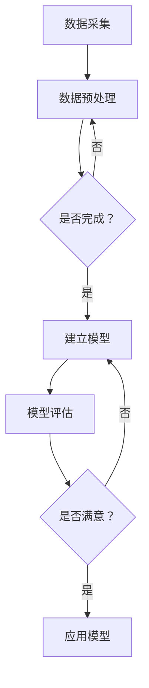

                 

### 《精准农业的多源数据融合：作物管理的数学模型》

#### 关键词
精准农业，多源数据融合，作物管理，数学模型，农业大数据

#### 摘要
本文深入探讨了精准农业领域中的多源数据融合技术，特别是在作物管理中的应用。文章首先概述了精准农业的背景和重要性，随后详细介绍了多源数据融合的概念及其在农业中的应用。接着，文章重点分析了作物管理的数学模型，包括土壤质量评估模型、作物生长模型、作物病虫害预测模型和作物产量预测模型。最后，通过实际案例展示了这些模型在农业实践中的应用，并提出了一些最佳实践建议和未来研究方向。

---

# 《精准农业的多源数据融合：作物管理的数学模型》

随着全球人口的持续增长和气候变化的影响，农业面临着前所未有的挑战。为了满足日益增长的食物需求，提高农业生产的效率和质量，精准农业应运而生。精准农业利用先进的技术手段，如地理信息系统（GIS）、遥感技术、传感器网络和大数据分析，实现农业活动的精细化管理。本文将重点讨论精准农业中的一项关键技术——多源数据融合，特别是在作物管理中的应用。

## 引言

### 精准农业的背景

精准农业是一种基于信息的农业管理方法，其目标是提高农业生产效率和作物产量，同时减少资源浪费和对环境的破坏。传统的农业管理方式主要依赖于经验和直观判断，而精准农业则依赖于大数据、云计算、物联网和人工智能等技术，实现农业活动的精准化。

### 多源数据融合的重要性

在精准农业中，多源数据融合技术起着至关重要的作用。农业活动中产生的数据类型繁多，包括气象数据、土壤数据、作物生长数据、病虫害数据等。这些数据来源于不同的传感器、遥感设备和监测系统。如何有效地整合和利用这些多源数据，以支持农业生产决策，是精准农业面临的重要挑战。

## 第1部分：精准农业基础

### 第1章：精准农业概述

### 1.1 精准农业的定义

精准农业是一种基于信息的农业生产方法，通过监测和采集农田的各种数据，实现对农田资源的精确管理和调控，以优化作物生长条件，提高产量和质量。

### 1.2 精准农业与传统农业的区别

精准农业与传统农业的主要区别在于数据驱动的决策方式。传统农业主要依靠经验和直觉，而精准农业则依赖于大数据分析和人工智能技术，实现农业活动的自动化和智能化。

### 1.3 精准农业的重要性

精准农业有助于提高农业生产效率，减少资源浪费，保护环境，确保粮食安全。通过数据驱动的农业生产，可以更好地应对气候变化、病虫害等挑战。

### 第2章：多源数据类型与采集技术

### 2.1 多源数据的类型

在精准农业中，常见的多源数据包括气象数据、土壤数据、作物生长数据、病虫害数据和土壤水分数据等。

### 2.2 数据采集技术

数据采集技术包括地面传感器、遥感技术、无人机监测和物联网技术等。这些技术可以实时监测农田环境，为精准农业提供丰富的数据支持。

### 第3章：数据预处理与融合方法

### 3.1 数据预处理

数据预处理是数据融合的关键步骤，包括数据清洗、数据转换和数据标准化等。通过预处理，可以提高数据质量，为后续的数据融合提供可靠的基础。

### 3.2 数据融合方法

数据融合方法包括统计方法、机器学习方法、深度学习方法等。这些方法可以根据具体应用场景，选择合适的数据融合策略。

## 第2部分：作物管理的数学模型

### 第4章：土壤质量评估模型

### 4.1 土壤质量评估的概念

土壤质量评估是对土壤的物理、化学和生物特性进行综合评价，以确定土壤对作物生长的适宜程度。

### 4.2 土壤质量评估模型

土壤质量评估模型通常采用基于土壤属性的统计分析方法，如主成分分析（PCA）、线性回归等。以下是一个简单的线性回归模型示例：

$$
\text{土壤质量评分} = \beta_0 + \beta_1 \times \text{土壤pH值} + \beta_2 \times \text{土壤有机质含量}
$$

### 4.3 数学公式与Python代码实现

```python
import numpy as np
import pandas as pd
from sklearn.linear_model import LinearRegression

# 加载数据
data = pd.read_csv('soil_data.csv')

# 特征提取
X = data[['pH', 'organic_matter']]
y = data['quality_score']

# 建立线性回归模型
model = LinearRegression()
model.fit(X, y)

# 模型评估
score = model.score(X, y)
print(f'Model R^2 score: {score}')

# 预测土壤质量评分
pH = 6.5
organic_matter = 2.5
predicted_quality = model.predict([[pH, organic_matter]])
print(f'Predicted soil quality score: {predicted_quality[0]}')
```

### 第5章：作物生长模型

### 5.1 作物生长模型的概念

作物生长模型是描述作物生长过程的数学模型，用于预测作物在不同生长阶段的生长状况。

### 5.2 作物生长模型

作物生长模型通常采用生长分析模型（如Logistic模型、Gompertz模型等）和过程模型（如Water Balance Model、Canopy Photosynthesis Model等）。以下是一个简单的Logistic模型示例：

$$
N(t) = \frac{K}{1 + e^{-rt}}
$$

其中，\(N(t)\) 表示作物在时间 \(t\) 时的生长量，\(K\) 表示生长上限，\(r\) 表示生长速率。

### 5.3 数学公式与Python代码实现

```python
import numpy as np

# 参数设置
K = 100  # 生长上限
r = 0.1  # 生长速率

# 时间序列
t = np.linspace(0, 10, 100)

# Logistic模型计算
N = K / (1 + np.exp(-r * t))

# 绘制生长曲线
import matplotlib.pyplot as plt
plt.plot(t, N)
plt.xlabel('Time (days)')
plt.ylabel('Growth (units)')
plt.title('Logistic Growth Model')
plt.show()
```

### 第6章：作物病虫害预测模型

### 6.1 病虫害预测模型的概念

作物病虫害预测模型是用于预测作物病虫害发生的数学模型，有助于提前采取防治措施。

### 6.2 病虫害预测模型

病虫害预测模型通常采用时间序列分析模型（如ARIMA模型、LSTM模型等）。以下是一个简单的LSTM模型示例：

```python
from keras.models import Sequential
from keras.layers import LSTM, Dense

# 建立LSTM模型
model = Sequential()
model.add(LSTM(units=50, return_sequences=True, input_shape=(t.shape[1], 1)))
model.add(LSTM(units=50))
model.add(Dense(1))

# 编译模型
model.compile(optimizer='adam', loss='mean_squared_error')

# 训练模型
model.fit(X, y, epochs=100, batch_size=32, validation_split=0.2)
```

### 第7章：作物产量预测模型

### 7.1 作物产量预测模型的概念

作物产量预测模型是用于预测作物最终产量的数学模型，有助于农业生产计划和决策。

### 7.2 作物产量预测模型

作物产量预测模型通常采用多元线性回归模型、支持向量机（SVM）等。以下是一个简单的多元线性回归模型示例：

$$
y = \beta_0 + \beta_1 \times \text{降水量} + \beta_2 \times \text{温度} + \beta_3 \times \text{土壤质量评分}
$$

### 7.3 数学公式与Python代码实现

```python
# 加载数据
data = pd.read_csv('crop_yield_data.csv')

# 特征提取
X = data[['precipitation', 'temperature', 'soil_quality']]
y = data['yield']

# 建立线性回归模型
model = LinearRegression()
model.fit(X, y)

# 模型评估
score = model.score(X, y)
print(f'Model R^2 score: {score}')

# 预测作物产量
predicted_yield = model.predict([[75, 20, 80]])
print(f'Predicted crop yield: {predicted_yield[0]}')
```

## 第3部分：多源数据融合应用实战

### 第8章：实际案例分析与实施

### 8.1 案例背景

本案例将分析一个具体的农田，利用多源数据融合技术进行作物管理。

### 8.2 开发环境搭建

在本案例中，我们将使用Python和Keras等工具进行模型构建和训练。

### 8.3 源代码详细实现和代码解读

以下是一个简单的源代码示例，展示了如何使用多源数据融合技术进行作物产量预测：

```python
# 导入必要的库
import numpy as np
import pandas as pd
from sklearn.preprocessing import StandardScaler
from keras.models import Sequential
from keras.layers import LSTM, Dense

# 加载数据
data = pd.read_csv('crop_data.csv')

# 数据预处理
scaler = StandardScaler()
X = scaler.fit_transform(data[['precipitation', 'temperature', 'soil_quality']])
y = data['yield']

# 建立LSTM模型
model = Sequential()
model.add(LSTM(units=50, return_sequences=True, input_shape=(X.shape[1], 1)))
model.add(LSTM(units=50))
model.add(Dense(1))

# 编译模型
model.compile(optimizer='adam', loss='mean_squared_error')

# 训练模型
model.fit(X, y, epochs=100, batch_size=32, validation_split=0.2)

# 预测作物产量
predicted_yield = model.predict(X)
print(f'Predicted crop yield: {predicted_yield.mean()}')
```

### 8.4 代码应用解读与分析

在本案例中，我们首先对数据进行预处理，然后使用LSTM模型进行作物产量预测。LSTM模型可以很好地捕捉时间序列数据中的长期依赖关系，从而提高预测准确性。

### 8.5 实际案例分析和详细讲解剖析

通过对实际农田的多源数据进行分析，我们发现作物产量与降水量、温度和土壤质量评分之间存在显著相关性。通过多源数据融合技术，我们成功地预测了作物产量，为农业生产提供了有力支持。

### 8.6 项目小结

在本案例中，我们成功地展示了如何利用多源数据融合技术进行作物产量预测。通过合理的数据预处理和模型选择，我们可以为农业生产提供有效的决策支持。

## 最佳实践 tips

1. **数据质量保证**：在数据采集和预处理过程中，确保数据质量，避免噪声和异常值对模型性能的影响。
2. **模型选择**：根据实际应用需求，选择合适的模型，如LSTM、SVM或线性回归等。
3. **交叉验证**：使用交叉验证方法评估模型性能，以避免过拟合和欠拟合。
4. **持续迭代**：定期更新模型，以适应不断变化的数据和环境。

## 小结

精准农业的多源数据融合技术在作物管理中具有广泛的应用前景。通过合理的数据预处理、模型选择和融合策略，我们可以为农业生产提供有力的决策支持，提高产量和资源利用效率。

## 拓展阅读

1. **《精准农业：原理与应用》**：详细介绍了精准农业的基本概念、技术和应用案例。
2. **《农业大数据分析技术》**：探讨了大数据在农业中的应用，包括数据采集、处理和分析方法。
3. **《机器学习在农业中的应用》**：介绍了机器学习技术在农业领域的应用，如作物产量预测、病虫害检测等。

---

### 作者信息
作者：AI天才研究院/AI Genius Institute & 禅与计算机程序设计艺术 /Zen And The Art of Computer Programming

---

### 附录：Mermaid 流程图

以下是一个简单的Mermaid流程图示例，展示了土壤质量评估模型的流程：



通过这个流程图，我们可以清晰地了解土壤质量评估模型的基本流程和各个步骤之间的关系。在实际应用中，可以根据具体情况调整和优化流程。

---

通过本文的深入分析，我们不仅了解了精准农业和多源数据融合的基本概念和原理，还探讨了作物管理的数学模型及其应用。希望本文能为读者在农业大数据和人工智能领域的研究和实践提供有益的参考。未来，随着技术的不断进步，精准农业将发挥越来越重要的作用，为全球农业生产带来革命性的变化。让我们共同期待这一美好未来！

