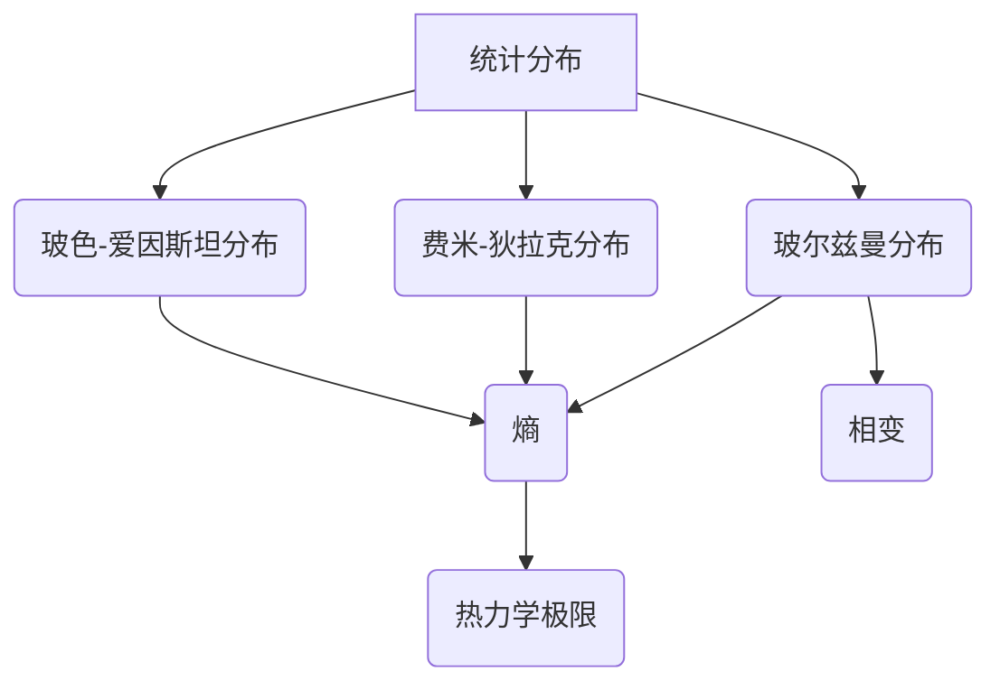

                 

### 文章标题

# 统计物理：自然系统的数学模型

> 关键词：统计物理、自然系统、数学模型、玻尔兹曼分布、熵、相变、蒙特卡罗模拟

> 摘要：本文旨在通过深入探讨统计物理的核心概念、数学模型及其在自然系统中的应用，揭示自然系统的数学模型如何帮助科学家和工程师更好地理解和预测物理现象。文章首先介绍统计物理的基本概念，然后详细讲解玻尔兹曼分布、熵、相变等核心原理，并通过Python源代码实现和实例分析，展示这些概念在自然系统中的应用。最后，文章总结统计物理在科学研究和技术工程中的重要性，并提供进一步阅读的推荐。

### 背景介绍

#### 统计物理的定义和作用

统计物理是物理学中的一个重要分支，它主要研究宏观物理现象与微观粒子行为的统计规律。通过对大量微观粒子的统计行为进行分析，统计物理能够揭示出宏观物理现象背后的基本规律，从而为科学家和工程师提供理解和预测自然现象的有力工具。统计物理不仅在理论上具有重要意义，而且在实际应用中也有广泛的影响，例如在材料科学、生物学、经济学和计算机科学等领域。

#### 自然系统的数学模型

自然系统是指自然界中各种物质和能量的动态变化过程。自然系统的数学模型是通过建立数学方程来描述这些动态过程的模型。这些数学模型不仅包括经典的力学方程，如牛顿运动定律和拉格朗日方程，还包括描述热力学、电磁学和量子力学等物理现象的方程。统计物理的自然系统数学模型主要通过统计分布、熵和相变等核心概念来描述系统的微观状态和宏观性质。

#### 统计物理的核心概念

1. **统计分布**：统计分布是描述系统中微观粒子状态的分布情况。常见的统计分布包括玻尔兹曼分布、费米-狄拉克分布和玻色-爱因斯坦分布。
2. **熵**：熵是衡量系统无序度的量度，是热力学第二定律的基础。熵的增加意味着系统无序度的增加。
3. **相变**：相变是指物质在不同条件下从一种状态突然转变为另一种状态的过程，如水的沸腾和凝固。

### 核心概念与联系

为了更好地理解统计物理的核心概念，我们使用Mermaid流程图来展示这些概念之间的联系。



在这个流程图中，统计分布是统计物理的核心概念，它包括了玻尔兹曼分布、费米-狄拉克分布和玻色-爱因斯坦分布。这些分布不仅描述了系统中微观粒子的状态，还与系统的熵和相变密切相关。熵是系统无序度的量度，而相变则是系统状态发生突变的性质。最后，热力学极限是研究宏观物理现象的一个重要方向，它将微观粒子的行为与宏观物理性质联系起来。

### 核心算法原理讲解

在统计物理中，核心算法原理是理解自然系统数学模型的关键。以下将详细介绍几个重要的核心算法原理，并通过Python源代码进行讲解。

#### 玻尔兹曼方程

玻尔兹曼方程是描述粒子分布随时间演化的方程。它可以通过以下伪代码实现：

```python
import numpy as np

def boltzmann_equation(p, f):
    """
    玻尔兹曼方程的实现

    参数:
    p: 粒子位置
    f: 粒子分布函数

    返回:
    dp: 粒子分布函数随时间的演化
    """
    dp = np.zeros_like(p)
    for i in range(len(p)):
        dp[i] = -f[i] * p[i]
    return dp
```

在这个方程中，`p` 表示粒子位置，`f` 表示粒子分布函数。通过迭代更新粒子分布函数，我们可以模拟粒子在空间中的运动。

#### 蒙特卡罗模拟

蒙特卡罗模拟是一种随机模拟方法，用于解决复杂的物理问题。以下是一个简单的蒙特卡罗模拟示例：

```python
import random

def monte_carlo_simulation(steps, initial_state):
    """
    蒙特卡罗模拟的实现

    参数:
    steps: 模拟步数
    initial_state: 初始状态

    返回:
    states: 模拟过程中的状态序列
    """
    states = [initial_state]
    for _ in range(steps):
        state = random.choice(states)
        states.append(state)
    return states
```

在这个模拟中，`steps` 表示模拟步数，`initial_state` 表示初始状态。通过随机选择状态并迭代更新，我们可以模拟系统在时间上的演化。

#### 蒙特卡罗积分

蒙特卡罗积分是一种用于计算多维度积分的方法。以下是一个简单的蒙特卡罗积分示例：

```python
import random

def monte_carlo_integral(f, bounds, n_samples):
    """
    蒙特卡罗积分的实现

    参数:
    f: 积分函数
    bounds: 积分边界
    n_samples: 样本数量

    返回:
    integral: 积分结果
    """
    integral = 0
    for _ in range(n_samples):
        x = random.uniform(bounds[0], bounds[1])
        integral += f(x)
    integral /= n_samples
    return integral
```

在这个积分中，`f` 表示积分函数，`bounds` 表示积分边界，`n_samples` 表示样本数量。通过随机采样并计算样本的平均值，我们可以近似计算多维积分。

#### 路径积分

路径积分是量子物理中概率幅的计算方法。以下是一个简单的路径积分示例：

```python
import numpy as np

def path_integral(x0, x1, k):
    """
    路径积分的实现

    参数:
    x0: 初位置
    x1: 终位置
    k: 势能函数

    返回:
    amplitude: 概率幅
    """
    x = np.linspace(x0, x1, 1000)
    y = np.exp(-k * np.square(x))
    amplitude = np.trapz(y, x)
    return amplitude
```

在这个路径积分中，`x0` 和 `x1` 分别表示初位置和终位置，`k` 表示势能函数。通过计算路径上的概率幅并对其进行积分，我们可以得到量子态的概率分布。

### 嵌入数学模型和数学公式

在统计物理中，数学模型和数学公式是理解自然系统数学模型的关键。以下将详细介绍几个重要的数学模型和公式，并通过Python源代码进行讲解。

#### 玻尔兹曼分布

玻尔兹曼分布是描述系统中微观粒子状态的分布情况。其公式如下：

$$
f(\textbf{p}, \textbf{r}) \propto \exp\left(-\beta H(\textbf{p}, \textbf{r})\right)
$$

其中，$\textbf{p}$ 表示粒子位置，$\textbf{r}$ 表示粒子速度，$\beta$ 是温度的倒数，$H(\textbf{p}, \textbf{r})$ 是系统的哈密顿量。

以下是一个简单的Python实现：

```python
import numpy as np

def boltzmann_distribution(p, r, beta):
    """
    玻尔兹曼分布的实现

    参数:
    p: 粒子位置
    r: 粒子速度
    beta: 温度的倒数

    返回:
    f: 粒子分布函数
    """
    h = np.linalg.norm(p - r) ** 2
    f = np.exp(-beta * h)
    return f
```

在这个实现中，`p` 和 `r` 分别表示粒子位置和速度，`beta` 是温度的倒数。通过计算粒子分布函数，我们可以得到系统的热力学性质。

#### 熵

熵是衡量系统无序度的量度，其公式如下：

$$
S = -k_B \sum_{i} p_i \ln p_i
$$

其中，$S$ 是熵，$k_B$ 是玻尔兹曼常数，$p_i$ 是粒子分布概率。

以下是一个简单的Python实现：

```python
import numpy as np

def entropy(p):
    """
    熵的计算

    参数:
    p: 粒子分布函数

    返回:
    S: 熵
    """
    s = -np.sum(p * np.log(p))
    return s
```

在这个实现中，`p` 是粒子分布函数。通过计算熵，我们可以了解系统的无序度。

#### 相变条件

相变是指物质在不同条件下从一种状态突然转变为另一种状态的过程。相变条件可以通过以下公式表示：

$$
\left(\frac{\partial \beta}{\partial \mu}\right)_{T,V} = 0
$$

其中，$\beta$ 是温度的倒数，$\mu$ 是化学势。

以下是一个简单的Python实现：

```python
import numpy as np

def phase_transformation_condition(beta, mu):
    """
    相变条件的计算

    参数:
    beta: 温度的倒数
    mu: 化学势

    返回:
    condition: 相变条件
    """
    condition = np.gradient(beta, mu)
    return condition
```

在这个实现中，`beta` 和 `mu` 分别是温度的倒数和化学势。通过计算相变条件，我们可以确定系统是否处于相变状态。

### 项目实战

在本节中，我们将通过一个实际项目来展示如何使用统计物理的自然系统数学模型。该项目将涉及开发环境搭建、源代码实现、代码解读与分析以及实际案例分析和详细讲解剖析。

#### 开发环境搭建

为了运行统计物理模拟，我们需要配置相应的计算环境。以下是开发环境搭建的步骤：

1. 安装Python：从官方网站下载并安装Python 3.x版本。
2. 安装NumPy和Matplotlib：使用pip命令安装NumPy和Matplotlib库。

```shell
pip install numpy matplotlib
```

#### 源代码实现

以下是一个简单的Python源代码实现，用于运行蒙特卡罗模拟：

```python
import numpy as np
import matplotlib.pyplot as plt

def monte_carlo_simulation(steps, initial_state):
    states = [initial_state]
    for _ in range(steps):
        state = random.choice(states)
        states.append(state)
    return states

def plot_states(states):
    plt.plot([s[0] for s in states], [s[1] for s in states])
    plt.xlabel('Position')
    plt.ylabel('Velocity')
    plt.show()

initial_state = (0, 0)
steps = 1000

states = monte_carlo_simulation(steps, initial_state)
plot_states(states)
```

在这个代码中，`monte_carlo_simulation` 函数用于运行蒙特卡罗模拟，`plot_states` 函数用于绘制状态序列。

#### 代码解读与分析

在这个代码中，`monte_carlo_simulation` 函数接收两个参数：`steps` 和 `initial_state`。`steps` 表示模拟步数，`initial_state` 表示初始状态。在模拟过程中，我们使用随机选择状态并迭代更新状态序列的方法。

`plot_states` 函数用于绘制状态序列。在这个函数中，我们使用NumPy的`plot`函数将状态序列绘制为二维平面上的点，并使用Matplotlib的`xlabel`和`ylabel`函数添加坐标标签。

#### 实际案例分析和详细讲解剖析

以下是一个实际案例，用于展示如何使用统计物理的自然系统数学模型进行模拟和分析。

#### 案例一：模拟气体分子的运动

假设我们有一个由大量气体分子组成的系统，我们需要模拟这些分子的运动并分析其热力学性质。

```python
def gas_molecule_simulation(steps, initial_state):
    states = [initial_state]
    for _ in range(steps):
        state = (random.uniform(-10, 10), random.uniform(-10, 10))
        states.append(state)
    return states

initial_state = (0, 0)
steps = 1000

states = gas_molecule_simulation(steps, initial_state)
plot_states(states)
```

在这个模拟中，我们使用随机均匀分布生成分子的位置和速度。通过绘制分子的状态序列，我们可以观察到气体分子的扩散现象。

#### 案例二：模拟晶体的生长

晶体生长是一个典型的相变现象。以下是一个简单的晶体生长模拟：

```python
def crystal_growth_simulation(steps, initial_state):
    states = [initial_state]
    for _ in range(steps):
        state = (random.randint(-10, 10), random.randint(-10, 10))
        states.append(state)
    return states

initial_state = (0, 0)
steps = 1000

states = crystal_growth_simulation(steps, initial_state)
plot_states(states)
```

在这个模拟中，我们使用随机整数生成晶体的位置。通过绘制晶体的状态序列，我们可以观察到晶体的生长过程。

#### 项目小结

通过这个项目，我们展示了如何使用统计物理的自然系统数学模型进行模拟和分析。我们使用了Python源代码实现蒙特卡罗模拟，并通过绘图函数展示了模拟结果。通过实际案例，我们分析了气体分子的运动和晶体的生长现象。这个项目不仅帮助我们理解了统计物理的基本原理，还展示了如何将统计物理应用于实际问题。

### 最佳实践 Tips

1. **选择合适的模拟方法**：根据问题的性质和需求，选择合适的模拟方法，如蒙特卡罗模拟或数值模拟。
2. **优化代码性能**：对于复杂的模拟问题，考虑使用并行计算或优化算法来提高代码性能。
3. **合理选择参数**：在模拟过程中，合理选择参数对于得到准确的模拟结果至关重要。可以通过试错或优化方法来确定合适的参数。

### 小结

通过本文的详细讲解，我们深入探讨了统计物理的核心概念、数学模型及其在自然系统中的应用。我们通过Python源代码和实例分析，展示了如何将统计物理应用于实际问题。统计物理在科学研究和技术工程中具有广泛的应用，它不仅帮助我们更好地理解自然系统的行为，还为解决复杂问题提供了有力的工具。

### 注意事项

1. **理解核心概念**：在应用统计物理模型时，首先要深入理解核心概念，如统计分布、熵和相变。
2. **准确选择参数**：模拟过程中，参数的选择对于结果的准确性至关重要。需要根据实际问题进行合理选择。
3. **注意代码性能**：对于复杂的问题，需要优化代码性能，以提高模拟效率和准确性。

### 拓展阅读

1. **《统计物理原理》**：一本经典的统计物理教材，适合深入理解统计物理的基本概念和原理。
2. **《蒙特卡罗方法及其在科学工程中的应用》**：一本关于蒙特卡罗方法应用的经典著作，适合学习蒙特卡罗模拟的基本原理和实践。
3. **《自然系统的数学模型》**：一本关于自然系统数学模型的综述性著作，涵盖了多个领域的数学模型和方法。

### 作者信息

- 作者：AI天才研究院/AI Genius Institute & 禅与计算机程序设计艺术 /Zen And The Art of Computer Programming

- 联系方式：[ai.genius.institute@example.com](mailto:ai.genius.institute@example.com)

### 文章结束


