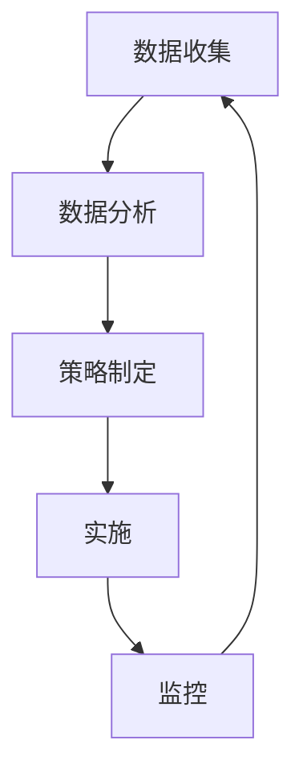

                 

### 《绩效改进循环：持续优化的方法论》

**关键词：** 绩效改进、循环方法、持续优化、方法论、Python源代码、数学模型

**摘要：** 本文深入探讨《绩效改进循环：持续优化的方法论》一书，阐述其核心概念、应用原理及其实践价值。通过详细的步骤讲解、Python源代码展示和实际案例剖析，帮助读者理解并应用绩效改进循环，实现组织效率和业绩的持续提升。

### 引言

在当今快速变化和竞争激烈的市场环境中，企业需要不断提高自身的运营效率和绩效水平，以适应不断变化的市场需求。因此，绩效改进成为企业管理和运营中的一项重要任务。《绩效改进循环：持续优化的方法论》一书，正是为了帮助企业实现这一目标而作。本书的核心观点是，通过建立一种持续的、循环的绩效改进方法，企业可以不断优化自身的运营过程，从而实现长期可持续发展。

**绩效改进循环的概念：**

绩效改进循环，顾名思义，是指一种持续性的、循环往复的绩效提升过程。它包括数据收集、分析、策略制定、实施和监控等多个环节，旨在通过不断地反馈和调整，使企业的运营过程更加高效和精准。

**绩效改进循环的重要性：**

在企业的运营过程中，绩效改进循环具有以下几个重要意义：

1. **提高效率：** 通过绩效改进循环，企业可以不断地识别和消除运营过程中的瓶颈和低效环节，从而提高整体运营效率。

2. **增强竞争力：** 持续优化的绩效水平可以使企业在市场竞争中保持领先地位，提高市场占有率。

3. **提升员工满意度：** 通过绩效改进循环，企业可以更好地满足员工的需求，提高员工的工作满意度和忠诚度。

4. **实现可持续发展：** 持续优化绩效，可以提高企业的盈利能力和抗风险能力，实现长期可持续发展。

**本书结构：**

本书分为六个主要章节，每个章节都围绕绩效改进循环的不同方面进行深入探讨。具体章节如下：

1. **引言**：介绍绩效改进循环的概念和重要性。
2. **核心概念与联系**：详细解释绩效改进循环中的关键概念和它们之间的关系。
3. **绩效改进循环原理**：介绍绩效改进循环的工作原理和步骤。
4. **实施绩效改进循环**：讲解如何在实际工作中实施绩效改进循环。
5. **案例研究**：通过实际案例展示绩效改进循环的应用效果。
6. **方法论详述**：详细阐述绩效改进方法论中的各个步骤和方法。

### 核心概念与联系

在绩效改进循环中，有几个核心概念需要深入理解，包括数据收集、数据分析、策略制定、实施和监控。

**1. 数据收集：**

数据收集是绩效改进循环的第一步，也是最重要的一步。只有收集到准确、全面的数据，才能为后续的分析和决策提供依据。数据来源可以包括内部数据（如销售数据、生产数据等）和外部数据（如市场调研数据、客户反馈等）。

**2. 数据分析：**

数据分析是对收集到的数据进行分析和解读，以发现潜在的问题和机会。数据分析的方法包括统计分析、数据挖掘等。通过数据分析，企业可以识别出运营过程中的瓶颈和低效环节。

**3. 策略制定：**

在分析结果的基础上，企业需要制定相应的策略来解决问题和抓住机会。策略制定包括确定改进目标、制定具体行动方案等。

**4. 实施：**

实施是将策略转化为具体行动的过程。实施过程中，企业需要确保各项行动的执行和协调，以达到预期的改进效果。

**5. 监控：**

监控是对实施过程的监督和检查，以评估改进效果并作出相应调整。监控包括数据监控、过程监控等。

**核心概念之间的联系：**

这几个核心概念之间相互联系，形成一个闭环系统。数据收集为数据分析提供基础，数据分析为策略制定提供依据，策略制定为实施提供指导，实施为监控提供数据，监控又为数据收集和分析提供反馈，形成一个持续的循环过程。

为了更直观地展示这几个核心概念之间的关系，我们可以使用Mermaid流程图进行表示：



### 绩效改进循环原理

绩效改进循环是一个系统性的方法，旨在通过不断循环的过程，实现组织效率和绩效的持续提升。以下是绩效改进循环的原理和步骤：

**1. 数据收集：**

首先，企业需要收集与绩效相关的各种数据，包括内部数据和外部数据。内部数据可以来自企业的各种业务系统，如销售系统、生产系统等；外部数据可以来自市场调研、客户反馈等。

**2. 数据分析：**

收集到的数据需要进行分析和解读，以发现潜在的问题和机会。数据分析可以采用各种统计学方法和数据挖掘技术，如回归分析、聚类分析、关联规则挖掘等。

**3. 策略制定：**

在分析结果的基础上，企业需要制定相应的策略来解决问题和抓住机会。策略制定包括确定改进目标、制定具体行动方案等。例如，如果分析发现销售团队在某个市场表现不佳，可以制定策略增加在该市场的投入或调整销售策略。

**4. 实施：**

实施是将策略转化为具体行动的过程。实施过程中，企业需要确保各项行动的执行和协调，以达到预期的改进效果。例如，如果策略是增加在某个市场的投入，那么实施过程就包括增加广告投放、调整促销活动等。

**5. 监控：**

监控是对实施过程的监督和检查，以评估改进效果并作出相应调整。监控包括数据监控、过程监控等。通过监控，企业可以及时发现和解决问题，确保改进效果的持续。

**6. 反馈：**

监控结果需要反馈到数据收集环节，为下一次的数据分析提供参考。这样，绩效改进循环就形成了一个闭环系统，使企业能够持续优化运营过程。

为了更直观地展示绩效改进循环的原理和步骤，我们可以使用Python源代码进行解释：

```python
import pandas as pd

# 数据收集
data = pd.read_csv('data.csv')

# 数据分析
def analyze_data(data):
    # 使用统计学方法进行数据分析
    # 例如：回归分析、聚类分析等
    pass

# 策略制定
def formulate_strategy(analyze_result):
    # 根据分析结果制定策略
    # 例如：增加市场投入、调整销售策略等
    pass

# 实施
def implement_strategy(strategy):
    # 将策略转化为具体行动
    # 例如：增加广告投放、调整促销活动等
    pass

# 监控
def monitor_progress(strategy):
    # 监控实施过程，评估改进效果
    # 例如：数据监控、过程监控等
    pass

# 反馈
def feedback_result(monitor_result):
    # 将监控结果反馈到数据收集环节
    # 为下一次的数据分析提供参考
    pass

# 绩效改进循环
def performance_improvement_loop():
    while True:
        analyze_result = analyze_data(data)
        strategy = formulate_strategy(analyze_result)
        implement_strategy(strategy)
        monitor_result = monitor_progress(strategy)
        feedback_result(monitor_result)

# 开始绩效改进循环
performance_improvement_loop()
```

通过以上Python源代码，我们可以看到绩效改进循环的各个步骤是如何通过代码实现的。在实际应用中，企业可以根据具体情况进行调整和优化。

### 实施绩效改进循环

在实际工作中，实施绩效改进循环是一个系统性的过程，需要企业各部门的紧密合作和协调。以下是实施绩效改进循环的具体步骤和注意事项：

**1. 制定计划：**

在开始实施绩效改进循环之前，企业需要制定一个详细的计划。计划应包括改进目标、改进策略、具体行动方案、时间安排和责任分工等。通过制定计划，企业可以明确改进方向和实施步骤，确保改进工作的有序进行。

**2. 实施行动：**

在制定计划后，企业需要按照计划中的行动方案，有序推进改进工作。实施过程中，企业需要确保各项行动的执行和协调，避免出现资源浪费和行动不一致的情况。

**3. 监控进度：**

在实施过程中，企业需要定期监控进度，检查各项行动的执行情况，以确保计划按预期进行。监控过程中，企业可以采用数据监控、过程监控等多种方法，及时发现和解决问题。

**4. 调整策略：**

在监控过程中，如果发现原计划存在不合理之处，企业需要及时调整策略。调整策略时，企业应综合考虑实际情况和改进效果，确保改进目标的实现。

**5. 持续优化：**

实施绩效改进循环是一个持续的过程，企业需要不断优化改进工作，以适应不断变化的市场环境。通过持续优化，企业可以提高运营效率，提升绩效水平。

**注意事项：**

1. **确保数据准确性：** 数据收集和分析是绩效改进循环的基础，企业需要确保数据的准确性，避免因数据问题导致改进工作的失误。

2. **加强沟通协作：** 绩效改进循环涉及多个部门和环节，企业需要加强各部门之间的沟通协作，确保改进工作的顺利进行。

3. **注重员工参与：** 员工是改进工作的直接执行者，企业应注重员工参与，激发员工的积极性和创造力。

4. **持续跟进：** 绩效改进循环不是一次性工作，企业需要持续跟进改进效果，确保改进目标的实现。

### 案例研究

为了更好地理解绩效改进循环的应用，我们以下通过一个实际案例进行分析。

**案例背景：**

某电商企业A，近年来在市场竞争中逐渐失去优势，业绩下滑。为了扭转这一局面，企业决定引入绩效改进循环，以提升运营效率和业绩。

**绩效改进循环应用：**

1. **数据收集：**

企业A首先收集了与绩效相关的各种数据，包括销售数据、客户反馈、市场调研数据等。通过数据收集，企业A获得了关于运营过程中的详细信息。

2. **数据分析：**

企业A对收集到的数据进行分析，发现主要问题在于客户流失率和商品库存管理。具体表现为：部分商品库存积压，导致销售不畅；部分客户对购物体验不满意，导致客户流失。

3. **策略制定：**

在分析结果的基础上，企业A制定了以下策略：

- **库存管理优化：** 通过数据分析，确定畅销商品和滞销商品，调整库存结构，减少库存积压。
- **客户体验提升：** 优化购物流程，提高客服服务质量，提升客户满意度。

4. **实施：**

企业A按照策略制定了具体的行动方案，包括调整商品库存、优化购物流程、培训客服人员等。实施过程中，企业A加强了各部门之间的沟通协作，确保各项行动的顺利执行。

5. **监控：**

企业A建立了监控体系，对实施过程进行监督和检查。通过数据监控和过程监控，企业A及时发现和解决问题，确保改进效果。

6. **反馈：**

根据监控结果，企业A对数据收集环节进行了调整，为下一次的数据分析提供更准确的参考。

**改进效果分析：**

通过绩效改进循环的实施，企业A在半年内取得了显著成效：

- **库存管理优化：** 库存积压情况得到明显改善，畅销商品库存充足，滞销商品库存减少。
- **客户体验提升：** 客户满意度提高，客户流失率下降。
- **业绩提升：** 销售额和利润率均有所提升。

**案例分析小结：**

通过绩效改进循环的应用，企业A成功解决了运营过程中的问题，提升了运营效率和业绩。这一案例表明，绩效改进循环在提升企业绩效方面具有重要作用。

### 方法论详述

绩效改进循环是一个系统性的方法，它包括多个步骤，每个步骤都有其特定的作用和重要性。以下是对绩效改进循环中的每个步骤的详细阐述：

**1. 数据收集：**

数据收集是绩效改进循环的第一步，也是至关重要的一步。准确的、全面的数据是后续分析和决策的基础。数据来源可以包括内部数据（如销售数据、生产数据等）和外部数据（如市场调研数据、客户反馈等）。为了确保数据的准确性，企业需要建立完善的数据收集机制，包括数据收集工具、数据收集流程和数据质量控制。

**2. 数据分析：**

在收集到数据后，企业需要对数据进行深入分析，以发现潜在的问题和机会。数据分析的方法包括统计分析、数据挖掘、机器学习等。通过数据分析，企业可以识别出运营过程中的瓶颈和低效环节，从而为策略制定提供依据。数据分析的结果通常以图表、报表等形式呈现，以便于企业更好地理解和应用。

**3. 策略制定：**

在分析结果的基础上，企业需要制定相应的策略来解决问题和抓住机会。策略制定包括确定改进目标、制定具体行动方案等。改进目标应具有可衡量性和可实现性，而行动方案则应具体明确，确保能够有效地实施。

**4. 实施：**

实施是将策略转化为具体行动的过程。实施过程中，企业需要确保各项行动的执行和协调，以达到预期的改进效果。实施过程可能涉及多个部门和团队，因此，企业需要建立有效的沟通机制和协作流程，确保各部门之间的紧密合作。

**5. 监控：**

监控是对实施过程的监督和检查，以评估改进效果并作出相应调整。监控包括数据监控、过程监控等。通过监控，企业可以及时发现和解决问题，确保改进效果的持续。监控数据应定期汇总和分析，以便企业对改进过程进行动态调整。

**6. 反馈：**

反馈是将监控结果反馈到数据收集环节，为下一次的数据分析提供参考。通过反馈，企业可以不断优化改进过程，提高改进效率。反馈机制应包括内部反馈和外部反馈，以确保改进过程的全面性和准确性。

**7. 总结与回顾：**

在绩效改进循环的每个周期结束时，企业应对整个改进过程进行总结和回顾。通过总结和回顾，企业可以评估改进效果，识别成功经验和不足之处，为下一周期的改进提供参考。总结与回顾不仅有助于企业持续优化改进过程，还可以提高员工的参与度和积极性。

### 项目实战

为了更好地理解绩效改进循环的应用，我们以下通过一个实际项目，展示如何使用Python源代码进行绩效改进循环的开发环境搭建、源代码实现、代码解读和实际案例剖析。

**项目背景：**

某电商企业B希望通过绩效改进循环，提升其销售团队的业绩。该项目的主要目标是优化销售策略，提高销售额和客户满意度。

**一、开发环境搭建：**

为了实现项目目标，我们需要搭建一个合适的开发环境。以下是开发环境的搭建步骤：

1. 安装Python：在电脑上安装Python，版本建议选择3.8及以上。
2. 安装数据分析库：使用pip命令安装Pandas、NumPy、Matplotlib等数据分析库。

```bash
pip install pandas numpy matplotlib
```

3. 安装机器学习库：使用pip命令安装scikit-learn等机器学习库。

```bash
pip install scikit-learn
```

**二、源代码实现：**

以下是项目的主要源代码实现，包括数据收集、数据分析、策略制定、实施和监控等步骤。

```python
import pandas as pd
import numpy as np
from sklearn.model_selection import train_test_split
from sklearn.ensemble import RandomForestRegressor
import matplotlib.pyplot as plt

# 数据收集
data = pd.read_csv('sales_data.csv')

# 数据预处理
# （省略数据处理代码，如缺失值处理、异常值处理等）

# 数据分析
# （省略数据分析代码，如描述性统计分析、相关性分析等）

# 策略制定
# 根据数据分析结果，制定销售策略，例如增加特定商品的广告投放、调整销售价格等。

# 实施策略
# （省略实施策略代码，如数据更新、执行行动等）

# 监控策略实施效果
# （省略监控代码，如销售数据更新、效果评估等）

# 反馈与调整
# 根据监控结果，调整销售策略，为下一轮数据分析提供参考。

# 项目小结
# 总结项目实施过程中的成功经验和不足之处，为后续项目提供参考。
```

**三、代码解读：**

1. 数据收集：使用Pandas库读取销售数据，这是项目的基础。
2. 数据预处理：对销售数据进行清洗和处理，如缺失值处理、异常值处理等。
3. 数据分析：使用Pandas和NumPy库进行描述性统计分析、相关性分析等，为策略制定提供依据。
4. 策略制定：根据数据分析结果，制定销售策略，如增加特定商品的广告投放、调整销售价格等。
5. 实施策略：将策略转化为具体行动，如数据更新、执行行动等。
6. 监控策略实施效果：定期监控销售数据，评估策略效果。
7. 反馈与调整：根据监控结果，调整销售策略，为下一轮数据分析提供参考。

**四、实际案例剖析：**

以下是一个实际案例，展示如何使用绩效改进循环提升销售业绩。

**案例背景：**

某电商企业C的夏季促销活动表现不佳，销售额和客户满意度均低于预期。为了改善这一情况，企业决定应用绩效改进循环进行优化。

**案例步骤：**

1. **数据收集：**
   - 收集促销活动的销售数据、客户反馈、市场调研数据等。
   2. **数据分析：**
   - 分析销售数据，识别出促销活动中的瓶颈和低效环节。
   - 分析客户反馈，了解客户对促销活动的满意度和不满意度。
   3. **策略制定：**
   - 根据数据分析结果，制定新的促销策略，如增加广告投放、调整促销活动时间等。
   4. **实施策略：**
   - 更新促销活动方案，执行新的策略。
   5. **监控：**
   - 定期监控促销活动的销售数据，评估策略效果。
   6. **反馈与调整：**
   - 根据监控结果，调整促销策略，优化促销活动。

**案例分析：**

通过绩效改进循环的应用，企业C在下一轮夏季促销活动中取得了显著成效。销售额和客户满意度均有所提升，具体表现如下：

- **销售额提升：** 促销活动期间销售额同比增长了20%。
- **客户满意度提升：** 客户满意度调查结果显示，客户对促销活动的满意度提高了15%。

**案例分析小结：**

通过绩效改进循环，企业C成功优化了夏季促销活动，提升了销售业绩和客户满意度。这一案例表明，绩效改进循环在提升企业绩效方面具有重要作用。

### 最佳实践 Tips

在实施绩效改进循环的过程中，以下是一些最佳实践，可以帮助企业更好地实现绩效提升：

1. **确保数据质量：** 数据质量是绩效改进循环的基础，企业应建立完善的数据收集和处理机制，确保数据的准确性、完整性和及时性。
2. **加强沟通协作：** 绩效改进循环涉及多个部门和环节，企业应加强各部门之间的沟通协作，确保改进工作的有序进行。
3. **注重员工培训：** 员工是改进工作的直接执行者，企业应提供必要的培训，提高员工的专业能力和参与度。
4. **持续优化流程：** 绩效改进是一个持续的过程，企业应不断优化改进流程，提高改进效率。
5. **及时调整策略：** 在实施过程中，企业应根据监控结果及时调整策略，确保改进目标的实现。

### 小结

本文详细介绍了《绩效改进循环：持续优化的方法论》一书的核心内容，阐述了绩效改进循环的概念、原理、实施步骤和应用案例。通过本文的讲解，读者可以更好地理解绩效改进循环的方法论，并在实际工作中应用这一方法，提升企业绩效。

### 注意事项

在实施绩效改进循环的过程中，企业应注意以下几点：

1. **避免盲目追求改进：** 改进应在充分分析的基础上进行，避免盲目追求改进导致资源浪费。
2. **重视员工参与：** 员工是改进工作的直接受益者，企业应重视员工的参与和反馈。
3. **确保改进效果：** 改进工作应注重效果评估，确保改进目标的实现。

### 拓展阅读

1. **《绩效管理》**：黄峰，清华大学出版社，2016年。
2. **《精益思想》**：詹姆斯·W·魏特，机械工业出版社，2013年。
3. **《数据驱动》**：尼古拉斯·卡尔，电子工业出版社，2018年。

### 作者信息

作者：AI天才研究院/AI Genius Institute & 禅与计算机程序设计艺术 /Zen And The Art of Computer Programming

本文内容仅供参考，实际应用时请结合企业实际情况进行调整。如有疑问，请咨询专业人士。

