                 

### 绩效管理的基本概念

绩效管理是一个组织为了实现其战略目标而实施的一系列管理活动。它不仅仅是衡量员工工作绩效的工具，更是一个持续的过程，通过设定目标、跟踪进展、提供反馈和激励，以促进个人和团队的成长与改进。绩效管理的核心在于确保组织的各项活动与整体战略相一致，从而提高组织的整体效率和竞争力。

#### 1.1 绩效管理的定义

绩效管理可以定义为一系列相互关联的步骤和活动，旨在确保员工的行为和结果与组织的战略目标保持一致。它包括目标设定、绩效评估、反馈与改进等环节。具体来说，绩效管理定义包括以下几个方面：

1. **目标设定**：通过明确组织目标和个人目标，确保所有成员都朝着同一方向努力。
2. **绩效评估**：定期评估员工的工作表现，以确定他们是否实现了设定的目标。
3. **反馈与改进**：通过提供具体且建设性的反馈，帮助员工识别优点和不足，并制定改进计划。
4. **激励与奖励**：通过激励措施，如奖金、晋升和表彰，来奖励那些表现出色的员工。

#### 1.2 绩效管理的重要性

绩效管理在组织中的重要性不可低估。它不仅能够帮助组织实现其战略目标，还能带来以下几个方面的益处：

1. **提高员工绩效**：通过设定明确的目标和提供持续的反馈，员工可以更好地理解他们的工作期望，并采取相应的行动来提升绩效。
2. **增强团队合作**：绩效管理强调团队协作，通过共同的目标和协作活动，可以提高团队的整体表现。
3. **促进员工发展**：绩效管理不仅仅是评估绩效，更是员工发展的机会。通过反馈和改进，员工可以不断提升自己的技能和知识。
4. **提升组织效率**：通过识别和奖励高绩效员工，组织可以优化其人力资源配置，从而提高整体效率。

#### 1.3 绩效管理的三大目标

绩效管理的主要目标可以分为三个方面：

1. **激励与奖励**：通过设定具有挑战性的目标并奖励达成目标的员工，激励员工发挥最大潜力。
2. **发展员工**：通过绩效反馈和改进计划，帮助员工不断提升自己的技能和能力。
3. **提升组织绩效**：确保员工的工作目标与组织战略一致，从而实现组织整体绩效的提升。

### 总结

绩效管理是一个复杂但至关重要的过程，它不仅仅是关于绩效评估，更是一个促进个人和团队成长、提升组织整体效率的系统方法。在接下来的章节中，我们将深入探讨绩效管理的历史与发展，以及如何建立和实施一个有效的绩效管理体系。

---

以下是本章节的核心概念架构Mermaid流程图：

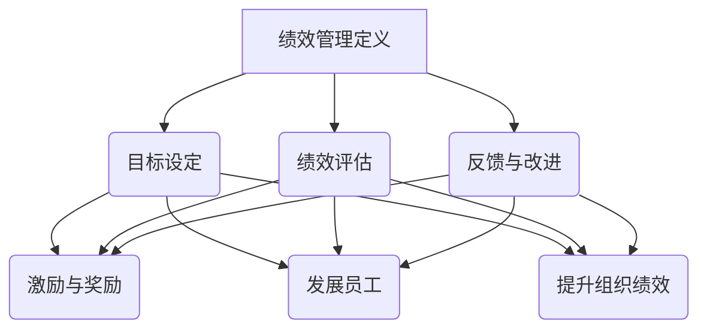

### 绩效管理的历史与发展

绩效管理作为一个管理概念，其起源可以追溯到工业化时代。在当时，企业开始意识到需要对员工的工作表现进行系统的管理和评估，以确保生产效率和产品质量。然而，早期的绩效管理方法相对简单，主要依赖于直接监督和主观评价。

#### 2.1 绩效管理的起源

绩效管理的起源可以追溯到19世纪末和20世纪初的工业化浪潮。在这一时期，随着工厂和企业的规模不断扩大，管理者开始寻求更有效的方法来监督和激励员工。最早的绩效管理实践主要是基于个人绩效评估和奖励制度，例如计件工资和奖金制度。这些方法虽然简单，但为现代绩效管理奠定了基础。

#### 2.2 绩效管理的发展历程

20世纪20年代到50年代，绩效管理经历了重要的发展。这一时期的代表性管理理论包括科学管理理论和行为科学理论。科学管理理论强调通过工作流程优化和标准化来提高生产效率，而行为科学理论则强调员工的行为和动机对绩效的影响。随着这些理论的提出，绩效管理开始从单纯的个人绩效评估转向更全面的员工发展和管理。

20世纪60年代到80年代，绩效管理进一步发展，逐渐形成了系统化的绩效管理体系。这一时期的代表性方法包括目标管理（Management by Objectives，MBO）和平衡计分卡（Balanced Scorecard，BSC）。目标管理强调通过设定明确的目标和绩效指标来指导员工的工作，而平衡计分卡则从财务、客户、内部流程和学习与成长四个维度来综合评价组织的绩效。

进入21世纪，随着信息技术的快速发展，绩效管理也发生了重大的变革。数据驱动和智能化的绩效评估方法开始广泛应用。大数据和人工智能技术的应用使得绩效管理更加科学和精准。同时，绩效管理工具的数字化和网络化也大大提高了绩效管理的效率和效果。

#### 2.3 当前绩效管理的趋势

当前，绩效管理呈现出以下几个趋势：

1. **数据驱动**：越来越多的组织开始依赖数据来评估员工绩效，从而提高评估的客观性和准确性。
2. **个性化**：绩效管理越来越注重个性化，根据不同员工的特点和需求制定个性化的绩效目标和反馈。
3. **持续反馈**：传统的年度评估逐渐被更加频繁和及时的反馈机制所取代，以帮助员工更快地改进绩效。
4. **360度评估**：越来越多的组织采用360度评估方法，通过收集来自多个角度的反馈来全面评估员工的绩效。
5. **绩效与发展相结合**：绩效管理不再仅仅关注绩效本身，更注重通过绩效管理促进员工的发展和成长。

### 总结

绩效管理作为一个不断发展演进的管理领域，其历史和发展历程为我们提供了宝贵的经验和启示。通过理解绩效管理的起源和发展历程，我们可以更好地把握当前绩效管理的趋势和方向，为组织制定更加有效的绩效管理策略提供指导。

---

以下是本章节的核心概念架构Mermaid流程图：

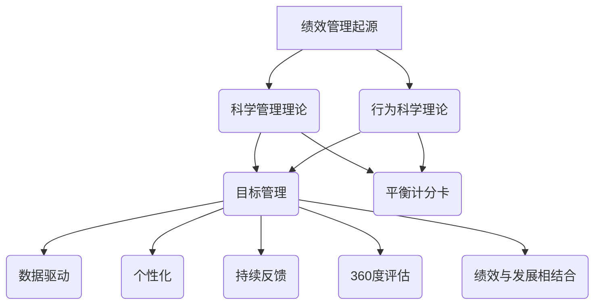

### 绩效管理体系的基本架构

绩效管理体系是确保组织战略目标与员工个人目标一致，并通过系统化的管理活动促进员工绩效提升和团队协作的重要工具。一个完整的绩效管理体系通常包括绩效计划、绩效执行、绩效评估和绩效反馈与改进四个关键环节。以下是对这四个环节的详细解读：

#### 3.1 绩效计划

绩效计划是绩效管理的第一步，也是整个绩效管理体系的基础。它涉及设定组织目标和分解为个人目标的过程。具体步骤如下：

1. **设定组织战略目标**：首先，组织需要明确其战略目标和愿景，这将作为绩效计划的总体方向。
2. **分解目标**：将组织目标分解为可操作的部门和个人目标。这些目标应当是具体、可测量、可达成、相关性强且时限明确的（SMART原则）。
3. **制定绩效计划**：根据分解后的目标，制定具体的绩效计划，明确每个部门和员工在特定时间段内需要达成的目标。

#### 3.2 绩效执行

绩效执行是绩效管理的关键环节，涉及员工在实际工作中为实现绩效目标而努力的过程。以下是绩效执行的主要步骤：

1. **分配资源**：确保员工在实现目标的过程中有足够的资源和支持。
2. **培训和指导**：提供必要的培训和指导，帮助员工掌握实现目标所需的知识和技能。
3. **监督和协调**：通过定期检查和协调，确保员工的工作进度与计划一致，及时解决出现的问题。
4. **鼓励和支持**：激励员工保持工作动力，并提供必要的支持和鼓励。

#### 3.3 绩效评估

绩效评估是绩效管理中至关重要的一环，它通过系统的方法和工具来衡量员工的工作表现。以下是绩效评估的主要步骤：

1. **制定评估标准**：根据绩效计划中的目标，制定具体的评估标准，这些标准应当是明确和客观的。
2. **收集数据**：通过多种渠道收集员工绩效的相关数据，包括定量数据和定性数据。
3. **分析数据**：对收集到的数据进行分析，评价员工是否达到了设定的绩效目标。
4. **反馈与沟通**：将评估结果反馈给员工，并进行深入的沟通，讨论绩效表现和改进措施。

#### 3.4 绩效反馈与改进

绩效反馈与改进是绩效管理的最后一个环节，通过提供具体的反馈和改进计划，帮助员工提升绩效。以下是绩效反馈与改进的主要步骤：

1. **提供反馈**：根据评估结果，提供具体的、建设性的反馈，指出员工的优点和需要改进的方面。
2. **制定改进计划**：与员工一起制定具体的改进计划，明确改进的目标、步骤和时间表。
3. **跟踪改进进度**：定期跟踪员工改进计划的实施情况，并提供必要的支持和指导。
4. **持续改进**：将绩效反馈与改进纳入到持续的绩效管理过程中，确保员工能够持续提升绩效。

### 总结

绩效管理体系的基本架构包括绩效计划、绩效执行、绩效评估和绩效反馈与改进四个关键环节。每个环节都有其特定的任务和目标，相互关联，共同构成了一个完整、有效的绩效管理过程。通过这个体系，组织能够确保员工的工作与组织战略目标一致，从而实现组织的长期发展。

---

以下是本章节的核心概念架构Mermaid流程图：

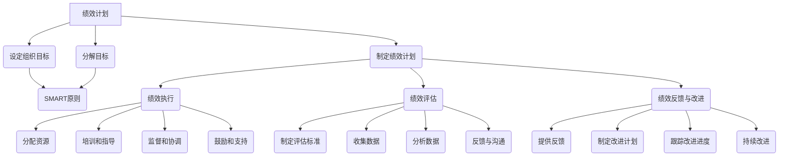

### KPI的局限性

尽管KPI（关键绩效指标）在绩效管理中被广泛使用，但其局限性也逐渐显现。KPI虽然提供了一种量化和评估绩效的简单方法，但在实际应用中，它可能无法全面反映员工的实际工作表现和组织的整体健康状态。

#### 4.1 KPI的定义

KPI是用于衡量组织或个人绩效的关键指标，通常与组织目标直接相关。KPI的选择应当反映组织的关键成功因素，如市场份额、客户满意度、生产效率等。常见的KPI包括销售额、客户满意度、员工满意度、生产数量等。

#### 4.2 KPI的优点

1. **量化绩效**：KPI提供了量化的绩效指标，使得绩效评估更加客观和可衡量。
2. **目标明确**：通过设定具体的KPI，员工和团队可以明确自己的工作目标和期望。
3. **激励作用**：KPI能够激励员工为实现目标而努力，提高整体绩效。

#### 4.3 KPI的局限性

1. **单一维度**：KPI通常只能反映某一方面的绩效，可能忽视了其他重要但不易量化的因素。
2. **短期导向**：KPI往往强调短期绩效，可能导致员工追求短期利益而忽视长期发展。
3. **忽视个人差异**：不同的员工可能有不同的工作方式和绩效表现，KPI可能无法充分考虑这些差异。
4. **缺乏灵活性**：KPI一旦设定，就很难调整，这可能无法适应组织或市场的变化。
5. **容易误导**：在某些情况下，KPI可能被用来追求短期目标，而忽视长期战略和员工的发展。

### KPI的替代方法

鉴于KPI的局限性，许多组织开始探索替代的绩效评估方法，以更全面和准确地衡量员工和组织的绩效。以下是一些常见的替代方法：

1. **360度评估**：通过收集来自多个角度（上级、同事、下属和客户）的反馈，360度评估提供了一个全面的视角来评估员工的绩效。
2. **行为评估**：评估员工在工作中的行为和态度，而不是仅仅关注结果。这种方法可以更全面地反映员工的工作表现和团队合作能力。
3. **项目评估**：通过评估员工在具体项目中的表现，可以更准确地衡量其能力和贡献。
4. **能力评估**：评估员工的专业技能、知识储备和学习能力，而不是仅仅关注当前的工作表现。

### 总结

KPI在绩效管理中具有一定的作用，但其局限性也不可忽视。通过探索和采用替代方法，组织可以更全面和准确地评估员工的绩效，从而促进个人和组织的持续发展。

---

以下是本章节的核心概念架构Mermaid流程图：

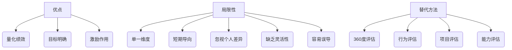

### 360度评估方法

360度评估是一种全面的绩效评估方法，它通过收集来自多个角度的反馈，提供对员工绩效的全方位评估。这种方法不仅包括上级对员工的评价，还涵盖了同事、下属和客户的反馈，从而提供一个更加全面和客观的评估视角。

#### 5.1 360度评估的定义

360度评估，也称为全方位反馈或多源反馈评估，是指从多个角度收集关于员工绩效的信息，以便对员工的表现进行全面的评估。这种评估方法不仅包括传统的自上而下的评价，还包括同事、下属和客户的反馈，从而提供多维度、全方位的评估视角。

#### 5.2 360度评估的实施步骤

1. **确定评估目标**：首先，明确进行360度评估的目的和目标。这些目标可以是提高员工沟通能力、提升团队合作精神或评估员工的领导力等。

2. **选择评估参与者**：确定参与评估的人员，通常包括员工的上级、同事、下属和关键客户。确保这些参与者的选择能够代表员工在不同工作环境和关系中的表现。

3. **设计评估问卷**：设计一份评估问卷，用于收集来自不同参与者的反馈。问卷应包括与评估目标相关的具体指标，例如工作表现、沟通能力、团队合作精神等。问卷的设计应确保问题明确、具体且具有针对性。

4. **收集反馈**：通过匿名的方式收集参与者的反馈，确保反馈的真实性和客观性。可以使用在线问卷、邮件或面对面访谈等多种方式收集反馈。

5. **分析反馈**：对收集到的反馈进行分析和汇总，识别员工的优点和需要改进的方面。分析过程中应确保反馈的客观性和准确性，避免主观偏见。

6. **反馈与沟通**：将分析结果反馈给员工，并与员工进行深入沟通。反馈应具体、建设性，帮助员工理解评估结果，并制定改进计划。

7. **跟踪改进**：定期跟踪员工的改进进度，并提供必要的支持和指导。确保员工能够持续提升绩效，实现个人和组织的共同发展。

#### 5.3 360度评估的优势与挑战

1. **优势**：
   - **全面性**：360度评估提供了多角度的反馈，使得评估结果更加全面和客观。
   - **促进自我认知**：员工通过来自不同角度的反馈，可以更全面地了解自己的工作表现和需要改进的方面。
   - **提高沟通与协作**：360度评估鼓励团队成员之间的沟通和协作，有助于提升团队整体绩效。

2. **挑战**：
   - **反馈偏差**：由于评估参与者的主观偏见，可能会导致反馈的不准确和偏见。
   - **时间成本**：360度评估需要大量的时间和资源来设计和实施，可能对组织造成一定的负担。
   - **隐私问题**：如何确保反馈的匿名性和隐私性，是实施360度评估时需要考虑的重要问题。

### 实践案例

在某大型企业的实施案例中，通过360度评估方法，该企业成功提升了员工的沟通能力和团队合作精神。首先，企业明确了评估的目标，即提升员工在跨部门项目中的协作能力。接着，企业选择了包括项目团队成员、上级、客户在内的多角度参与者，设计了一份详细的评估问卷。在收集反馈后，企业对反馈进行了分析和汇总，并将结果反馈给员工。在反馈和沟通环节，企业提供了详细的改进建议，并制定了具体的改进计划。通过定期跟踪和指导，员工在沟通和协作方面取得了显著的提升。

### 总结

360度评估作为一种全面的绩效评估方法，具有明显的优势和挑战。通过科学的实施和有效的管理，360度评估可以帮助组织更全面和准确地评估员工绩效，促进个人和团队的发展。

---

以下是本章节的核心概念架构Mermaid流程图：

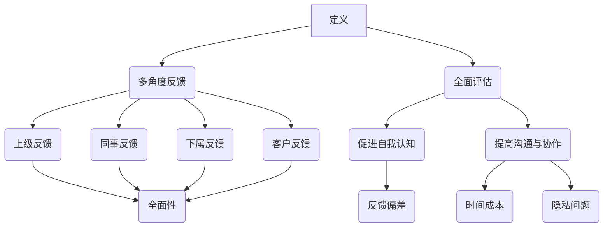

### 个性心理测评方法

个性心理测评是绩效管理中的一种重要工具，它通过评估员工的个性特征、心理状态和动机，提供对员工行为和表现的深入理解。这种方法不仅有助于识别员工的潜在优势和不足，还可以为员工发展提供个性化的指导。

#### 6.1 个性心理测评的定义

个性心理测评是指通过科学的方法和工具，对个体的个性特征、心理状态和动机进行测量和评估。个性特征包括外向性、神经质、开放性、宜人性等，心理状态涉及情绪、压力水平等，而动机则包括工作动机、成就动机等。通过个性心理测评，组织可以更全面地了解员工，从而制定更加有效的绩效管理策略。

#### 6.2 个性心理测评的常见工具

1. **MBTI（迈尔斯-布里格斯性格类型指标）**：
   MBTI是一种广泛使用的个性心理测评工具，它将个体分为16种不同的性格类型，通过四个维度（外向性/内向性、感觉/直觉、思维/情感、判断/感知）进行评估。MBTI帮助组织了解员工的性格特点，从而在团队构建和沟通中更加有效。

2. **大五人格（Big Five Personality Traits）**：
   大五人格模型是最广泛接受的个性心理测评模型，它包括五个主要维度：开放性、责任心、外向性、宜人性和神经质。这种模型提供了对个体性格的全面理解，有助于组织在招聘、培训和团队协作中做出更好的决策。

3. **情绪智力（Emotional Intelligence, EI）**：
   情绪智力评估个体的情感识别、理解和管理能力，以及其运用情感促进思考、自我激励、社交和领导能力。情绪智力在团队协作和领导力发展中具有重要作用，是绩效评估中的重要指标。

4. **动机测评（Motivation Assessment）**：
   动机测评旨在了解员工的工作动机，包括内在动机和外在动机。这种测评帮助组织识别员工对工作的投入程度和积极性，从而制定激励策略。

#### 6.3 个性心理测评的应用场景

1. **招聘与选拔**：在招聘过程中，通过个性心理测评可以评估候选人的性格特点、情绪智力和工作动机，从而更准确地预测其是否适合岗位要求。

2. **团队建设**：通过个性心理测评，组织可以了解团队成员的性格特点，识别潜在的合作障碍，从而优化团队结构和沟通方式，提高团队效率。

3. **领导力发展**：个性心理测评可以评估领导者的性格和情绪智力，帮助组织制定领导力发展计划，提升领导者的管理能力。

4. **员工发展**：通过个性心理测评，组织可以为员工提供个性化的职业发展建议，帮助其识别优势和不足，制定职业规划。

#### 实践案例

在某高科技企业中，通过应用MBTI个性心理测评工具，该企业成功优化了团队协作模式。首先，企业在招聘环节使用了MBTI测评，确保新员工与现有团队在性格上具有一定的互补性。接着，企业在团队项目中定期进行MBTI评估，以识别和解决团队中的沟通障碍。通过这种个性化的团队构建和沟通优化，企业的项目成功率显著提升。

### 总结

个性心理测评作为一种科学的评估工具，在绩效管理和员工发展中的应用具有重要意义。通过个性心理测评，组织可以更深入地了解员工，制定更加有效的绩效管理策略和员工发展计划，从而实现个人与组织的共同成长。

---

以下是本章节的核心概念架构Mermaid流程图：

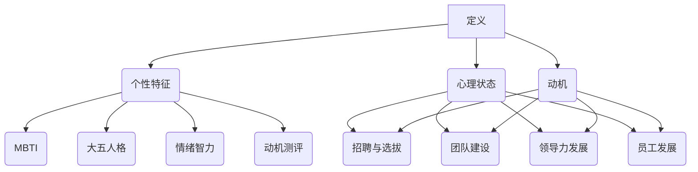

### 项目管理评估方法

项目管理评估是确保项目成功完成的关键环节，它通过设定关键绩效指标、监控项目进度和评估项目结果，确保项目在既定的时间和预算内达成预期目标。项目管理评估不仅关注项目的最终成果，还包括对项目过程中的资源利用、团队协作和技术实现等多方面的综合评估。

#### 7.1 项目管理评估的定义

项目管理评估是指对项目执行过程中的各项指标进行测量、分析和评估，以确定项目是否按照计划进行，以及项目的最终成果是否满足预期目标。项目管理评估包括对项目的进度、成本、质量、风险等方面进行全面的监控和评价。

#### 7.2 项目管理评估的关键指标

1. **进度指标**：包括项目完成时间、关键里程碑完成情况等。这些指标可以反映项目是否按计划推进。
2. **成本指标**：包括项目预算执行情况、成本节约情况等。这些指标可以反映项目的成本控制效果。
3. **质量指标**：包括项目交付成果的质量、用户满意度等。这些指标可以反映项目的质量水平。
4. **风险指标**：包括项目面临的风险类型、风险发生的可能性及其影响等。这些指标可以帮助项目团队提前识别和应对潜在风险。
5. **团队协作指标**：包括团队成员的工作满意度、团队沟通效率、团队凝聚力等。这些指标可以反映项目的团队协作水平。

#### 7.3 项目管理评估的实施流程

1. **确定评估目标和范围**：明确项目管理评估的目的和范围，确定需要评估的关键指标和项目阶段。
2. **收集项目数据**：通过项目管理工具和记录，收集项目的进度、成本、质量、风险等数据。
3. **数据分析与评估**：对收集到的数据进行统计分析，评估项目在各个关键指标上的表现。
4. **反馈与改进**：将评估结果反馈给项目团队，讨论存在的问题和改进措施，制定相应的改进计划。
5. **跟踪与监控**：持续跟踪项目的执行情况，定期进行评估和调整，确保项目按计划推进。

#### 实践案例

在某科技公司的一次大型软件开发项目中，项目团队通过项目管理评估方法确保了项目的成功交付。首先，团队确定了项目的关键绩效指标，包括进度、成本、质量和风险等。在项目执行过程中，团队定期收集和评估这些指标的数据，及时识别和解决问题。例如，当发现项目进度落后时，团队立即召开会议讨论原因，调整计划并重新分配资源。通过这种持续评估和改进，项目最终在预定时间内高质量地完成了所有目标。

### 总结

项目管理评估是确保项目成功完成的重要手段，它通过设定关键绩效指标、监控项目进度和评估项目结果，帮助项目团队识别和解决问题，实现项目的目标。有效的项目管理评估不仅可以提高项目的成功率，还可以为组织的项目管理能力提供宝贵的经验和教训。

---

以下是本章节的核心概念架构Mermaid流程图：

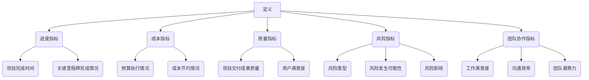

### 基于数据的绩效评估方法

随着大数据和人工智能技术的快速发展，基于数据的绩效评估方法逐渐成为绩效管理的重要工具。这种方法利用大量的数据进行分析，为组织提供更加精准和客观的绩效评估结果。

#### 8.1 数据驱动的绩效评估

数据驱动的绩效评估是通过收集和分析大量数据来评估员工的绩效。这种方法不仅依赖于传统的绩效指标，还结合了各种非结构化数据，如员工的工作日志、社交媒体活动、电子邮件通讯等。通过数据挖掘和分析，组织可以更全面和准确地评估员工的实际工作表现。

1. **数据来源**：数据驱动的绩效评估需要收集多种类型的数据，包括：
   - **结构化数据**：如销售数据、生产数据、项目进度数据等。
   - **非结构化数据**：如员工的工作日志、社交媒体互动、电子邮件沟通等。

2. **数据分析工具**：常用的数据分析工具包括：
   - **数据分析软件**：如Tableau、Power BI等，用于可视化数据和分析结果。
   - **机器学习算法**：如回归分析、聚类分析、分类算法等，用于预测和评估绩效。

3. **数据驱动的绩效评估优势**：
   - **客观性**：通过数据分析，减少主观评价的影响，提高评估的客观性。
   - **全面性**：结合多种数据源，提供更全面的绩效评估视角。
   - **实时性**：实时监控和分析员工的工作表现，及时发现问题并进行调整。

#### 8.2 大数据在绩效评估中的应用

大数据技术在绩效评估中的应用使得评估过程更加科学和高效。以下是一些具体应用场景：

1. **员工行为分析**：
   - **工作习惯**：通过分析员工的工作日志和电子邮件，了解员工的工作习惯和时间管理能力。
   - **沟通效率**：分析员工的沟通频率和内容，评估员工的沟通效果。

2. **员工绩效预测**：
   - **数据挖掘**：利用历史数据，预测员工的绩效表现，为绩效评估提供依据。
   - **趋势分析**：分析员工的工作趋势，发现潜在的问题和改进机会。

3. **员工满意度分析**：
   - **调查数据**：分析员工满意度调查结果，识别员工对工作环境、薪酬福利等方面的满意度。
   - **社交媒体分析**：通过社交媒体活动，了解员工的情绪和工作状态。

#### 8.3 数据分析工具与应用

在实际应用中，数据分析工具的选择和配置对于数据驱动的绩效评估至关重要。以下是一些常用的数据分析工具及其应用：

1. **Tableau**：
   - **应用场景**：数据可视化，帮助管理层直观理解数据。
   - **功能**：丰富的可视化图表、自定义仪表板、数据联动等。

2. **Power BI**：
   - **应用场景**：商业智能分析，支持多种数据源整合和分析。
   - **功能**：交互式报表、数据挖掘、实时监控等。

3. **Python与R**：
   - **应用场景**：数据处理和高级分析，适用于复杂的统计分析和机器学习应用。
   - **功能**：丰富的数据处理库（如Pandas、NumPy）、机器学习库（如Scikit-learn、TensorFlow）。

### 实践案例

在某大型企业的绩效评估项目中，团队采用了数据驱动的绩效评估方法。首先，团队收集了员工的工作日志、项目进度数据、客户反馈和社交媒体活动等多源数据。接着，利用Python和Tableau进行数据清洗、分析和可视化。通过分析结果，团队识别出一些工作习惯和沟通效率方面的问题，并制定相应的改进措施。这种基于数据的绩效评估方法不仅提高了评估的准确性，还为企业的绩效改进提供了科学依据。

### 总结

数据驱动的绩效评估方法利用大数据和人工智能技术，为组织提供了更加客观、全面和实时的绩效评估结果。通过科学的数据分析和工具应用，组织可以更有效地识别和管理绩效问题，促进员工和组织的持续发展。

---

以下是本章节的核心概念架构Mermaid流程图：

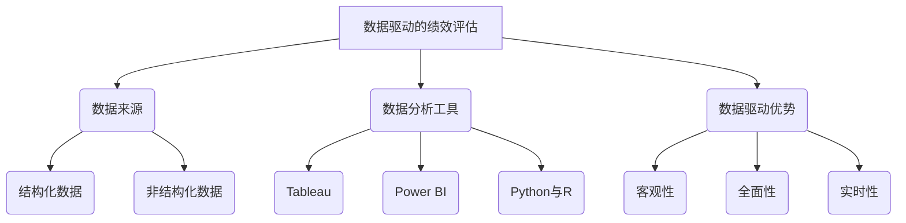

### 团队建设与评估

团队建设是绩效管理中至关重要的一环，一个高效的团队可以显著提升组织的整体绩效。团队建设的目标是优化团队成员之间的合作，提升团队的整体绩效和凝聚力。

#### 9.1 团队建设的原则与方法

1. **明确目标**：团队建设首先需要明确团队的目标，确保每个成员都理解并认同团队的共同目标。目标应当具体、可衡量、可实现。
   
2. **建立信任**：信任是团队协作的基石。通过开放沟通、分享信息、支持同事，可以逐步建立和维护团队成员之间的信任关系。

3. **加强沟通**：良好的沟通机制是团队建设的关键。定期召开团队会议、使用协作工具和进行一对一面谈，有助于加强团队成员之间的沟通。

4. **促进协作**：通过跨部门项目、团队活动和合作任务，促进团队成员之间的协作和互动，培养团队协作精神。

5. **培养团队文化**：团队文化是团队内在的精神纽带。建立积极的团队文化，鼓励创新、合作和互相支持，有助于提升团队的凝聚力和工作效率。

#### 9.2 团队评估的指标体系

团队评估的指标体系应当全面、客观，能够反映团队的整体绩效和成员的个体贡献。以下是一些常见的团队评估指标：

1. **团队绩效指标**：
   - **目标达成率**：团队是否完成了既定的目标和任务。
   - **客户满意度**：客户对团队交付成果的满意度。
   - **项目成功率**：团队项目完成的数量和质量。

2. **团队成员贡献指标**：
   - **工作质量**：团队成员完成工作的质量。
   - **工作效率**：团队成员完成工作的时间效率。
   - **创新能力**：团队成员在创新和解决问题方面的表现。
   - **团队合作精神**：团队成员在团队中的协作和互助表现。

#### 9.3 团队评估的实践案例分析

以下是一个团队评估的实践案例分析：

某科技公司有一支软件开发团队，团队成员包括项目经理、程序员、测试工程师和设计师。为了评估团队的整体绩效和成员的贡献，公司采用了以下方法：

1. **明确目标**：团队的目标是按时完成一个重要的客户项目，并确保项目的质量符合客户要求。

2. **定期评估**：每两周进行一次团队绩效评估会议，讨论项目进度、质量情况和团队成员的贡献。

3. **绩效指标**：
   - **目标达成率**：通过检查项目的进度和交付成果，评估团队是否按计划完成了目标。
   - **客户满意度**：通过客户的反馈问卷，评估客户对团队交付成果的满意度。
   - **项目成功率**：通过项目完成的质量和客户反馈，评估项目的成功率。

4. **成员贡献评估**：
   - **工作质量**：通过代码审查、测试结果和用户反馈，评估每个成员的工作质量。
   - **工作效率**：通过工作量统计和时间记录，评估每个成员的工作效率。
   - **创新能力**：通过新功能的实现和问题解决的效率，评估每个成员的创新能力。
   - **团队合作精神**：通过团队成员之间的协作记录和团队成员的反馈，评估每个成员的团队合作精神。

通过这种全面的评估体系，公司能够及时发现团队和成员的问题，并采取相应的改进措施，从而提升团队的整体绩效。

### 总结

团队建设与评估是提升团队绩效和凝聚力的重要手段。通过明确目标、建立信任、加强沟通、促进协作和培养团队文化，团队可以更好地实现共同目标。同时，通过建立科学的团队评估指标体系，组织可以客观地评估团队和成员的表现，为团队发展和个人成长提供指导。

---

以下是本章节的核心概念架构Mermaid流程图：

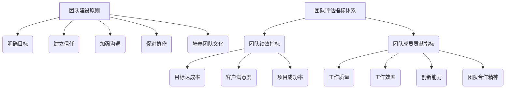

### 领导力评估

领导力评估是识别和培养领导者潜力的重要工具，它通过系统的方法和工具，评估领导者在不同情境下的领导能力和行为表现。有效的领导力评估不仅能够帮助组织发现和培养潜在的领导者，还能提升现有领导者的管理水平。

#### 10.1 领导力的定义与类型

领导力是指通过影响和激励他人，实现共同目标的能力。领导力可以表现为一系列行为和技能，包括但不限于：

1. **愿景领导**：设定明确的目标和愿景，引领团队朝着共同目标前进。
2. **影响力**：通过沟通和激励，影响团队成员的行为和决策。
3. **团队建设**：建立高效的团队，提升团队凝聚力和协作能力。
4. **变革管理**：在组织变革过程中，有效地引导和激励团队成员适应变化。
5. **决策能力**：在面对复杂情况时，能够做出明智的决策。

根据领导力在不同情境下的表现，领导力可以分为以下几种类型：

1. **交易型领导**：通过奖励和惩罚来激励团队成员，注重短期绩效。
2. **变革型领导**：通过激励和启发，激发团队成员的内在动机，实现长期发展。
3. **赋能型领导**：授权团队成员，鼓励自主决策和创新。
4. **服务型领导**：以服务团队成员为中心，关注团队成员的成长和福祉。

#### 10.2 领导力评估的方法

1. **360度评估**：通过收集来自团队成员、上级、下属和客户的反馈，全面评估领导者的领导能力。这种方法可以提供多角度的评估视角，更全面地了解领导者的表现。
   
2. **行为事件访谈（BEI）**：通过深入访谈，了解领导者在特定情境下的行为和决策过程。这种方法可以揭示领导者的实际行为模式，为评估提供具体依据。

3. **领导力调查问卷**：设计专门针对领导力评估的调查问卷，收集团队成员对领导者的评价。这种方法可以量化领导力指标，提供客观的数据支持。

4. **领导力发展中心**：通过模拟真实工作情境，评估领导者在不同领导力类型下的表现。这种方法可以提供实践反馈，帮助领导者提升实际管理能力。

#### 10.3 领导力提升策略

1. **领导力培训**：通过系统化的培训，提升领导者的理论知识和实践技能。培训可以包括领导力课程、研讨会和模拟情境等。
   
2. **导师制度**：通过导师指导，帮助领导者获得经验分享和指导，提升领导能力。导师可以提供具体的反馈和建议，帮助领导者改进表现。

3. **轮岗和跨部门合作**：通过轮岗和跨部门合作，让领导者体验不同角色和工作环境，提升其适应能力和领导能力。

4. **领导力反馈机制**：建立定期的领导力反馈机制，及时收集团队成员对领导者的反馈，并给予改进建议。这种反馈机制可以促进领导者的自我反思和持续改进。

#### 实践案例

在某大型企业中，通过实施领导力评估和提升策略，企业成功地培养了一批具有强大领导力的管理者。首先，企业采用了360度评估方法，收集了来自上级、同事、下属和客户的全方位反馈，全面评估管理者的领导能力。接着，企业为这些管理者提供了定期的领导力培训，并建立了导师制度，为他们提供经验分享和指导。此外，企业还鼓励管理者参与跨部门项目，提升其适应能力和领导力。通过这些策略，企业不仅提升了管理者的领导能力，还促进了组织的整体发展。

### 总结

领导力评估是提升组织领导力的重要手段，通过科学的方法和工具，组织可以识别和培养潜在的领导者，提升现有领导者的管理水平。有效的领导力提升策略可以帮助领导者不断成长，为组织的长期发展提供坚实的人才保障。

---

以下是本章节的核心概念架构Mermaid流程图：

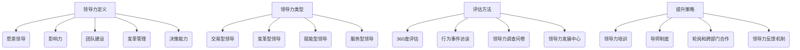

### 员工发展评估

员工发展评估是绩效管理中的重要一环，它旨在通过系统化的方法评估员工的成长和提升机会，确保员工的个人发展与组织目标相一致。员工发展评估不仅关注员工的当前表现，还关注其潜在能力和发展需求，为员工提供明确的职业发展路径和提升计划。

#### 11.1 员工发展的意义

员工发展对于组织的长期成功至关重要。以下是员工发展的几个关键意义：

1. **提高员工满意度**：通过提供职业发展和培训机会，员工能够感受到组织的关怀和认可，从而提高工作满意度和忠诚度。
2. **促进绩效提升**：通过系统化的培训和指导，员工可以不断提升自己的技能和知识，从而提高工作绩效和组织贡献。
3. **增强组织竞争力**：通过持续培养和发展员工，组织能够保持创新能力，适应快速变化的市场环境，提升整体竞争力。
4. **实现员工与组织的共赢**：员工的发展不仅有助于其个人成长，还可以为组织带来更多价值，实现员工与组织的共赢。

#### 11.2 员工发展评估的方法

1. **技能评估**：通过评估员工的现有技能和知识，识别其在特定领域的优势和不足。技能评估可以采用在线测试、面谈或实际操作等方式进行。
   
2. **潜力评估**：评估员工的潜在发展能力和适应新角色的能力。潜力评估通常采用行为事件访谈（BEI）或情境测试等方法。

3. **360度评估**：通过收集来自上级、同事、下属和客户的全方位反馈，评估员工在工作中的表现和发展需求。360度评估提供了多角度的视角，有助于更全面地了解员工。

4. **发展对话**：与员工进行一对一的发展对话，了解他们的职业目标和兴趣，讨论其个人发展计划。发展对话有助于建立信任，明确员工的职业发展方向。

5. **绩效评估**：结合员工的绩效评估结果，识别其在工作表现和发展方面的需求和提升机会。

#### 11.3 员工发展评估的实践案例分析

以下是一个员工发展评估的实践案例分析：

某科技公司为了提升员工的职业发展，实施了一套全面的员工发展评估体系。首先，公司通过在线测试和面谈，对员工的技能和知识进行了全面评估，识别出其在技术能力和项目管理方面的优势和不足。接着，公司通过360度评估，收集了来自上级、同事和客户的反馈，全面了解员工在工作中的表现和发展需求。在发展对话中，公司与员工一起制定了详细的个人发展计划，包括技能培训、项目管理课程和领导力发展项目。此外，公司还为员工提供了导师制度，帮助他们获得专业的指导和支持。

通过这一系列的员工发展评估和实践，公司不仅提升了员工的工作满意度和忠诚度，还显著提高了整体绩效和组织竞争力。

### 总结

员工发展评估是确保员工个人发展需求与组织目标一致的重要手段。通过系统化的评估方法和实践，组织可以更有效地提升员工的技能和知识，促进员工的职业发展，从而实现个人与组织的共赢。

---

以下是本章节的核心概念架构Mermaid流程图：

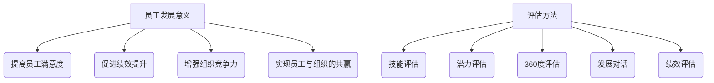

### 绩效改进计划

绩效改进计划是绩效管理中至关重要的一环，它通过系统化的方法识别和解决绩效问题，提升员工和组织的整体绩效。有效的绩效改进计划不仅能够帮助员工提升工作表现，还能为组织带来长远的收益。

#### 12.1 绩效改进计划的制定

制定绩效改进计划需要以下几个关键步骤：

1. **问题识别**：首先，通过数据分析、员工反馈和绩效评估，识别组织和个人在绩效方面存在的问题。问题可以包括工作流程、技能短板、沟通障碍等。

2. **目标设定**：根据问题识别的结果，设定明确的改进目标。这些目标应当具体、可衡量、可实现，并与组织的整体战略目标相一致。

3. **策略规划**：制定具体的策略和行动方案，以实现改进目标。策略可以包括技能培训、流程优化、沟通改善等。

4. **资源分配**：确定实现改进计划所需的资源，包括人力资源、财务资源和时间安排等。

5. **责任分配**：明确每个团队成员在改进计划中的角色和责任，确保改进计划的执行有明确的责任主体。

6. **时间表制定**：制定详细的改进计划时间表，明确每个阶段的目标和关键时间节点。

#### 12.2 绩效改进计划的实施步骤

1. **启动会议**：召开启动会议，介绍改进计划的目标、策略和行动方案，确保所有团队成员都了解改进计划的内容和重要性。

2. **执行与监控**：按照计划的时间表，逐步实施改进措施，并持续监控改进计划的执行情况。监控可以通过定期检查、进度报告和反馈机制进行。

3. **问题解决**：在执行过程中，及时识别和解决遇到的问题。问题解决可以是调整计划、补充资源或寻求专业支持。

4. **反馈与调整**：定期收集团队成员的反馈，评估改进计划的效果，并根据反馈结果进行调整。反馈可以来自团队成员、上级和客户的评价。

5. **评估与总结**：在改进计划完成后，进行全面评估，总结改进计划的有效性，并为未来的改进计划提供参考。

#### 12.3 绩效改进计划的评估与调整

评估和调整是绩效改进计划的重要组成部分，它确保改进计划能够持续地优化和提升。以下是评估和调整的关键步骤：

1. **数据收集**：收集与改进计划相关的数据，包括绩效指标、员工满意度、项目完成情况等。

2. **效果评估**：根据收集到的数据，评估改进计划的效果，确定是否达到了预期目标。

3. **反馈机制**：建立有效的反馈机制，收集来自不同层面的反馈，包括员工、上级和客户的评价。

4. **调整与优化**：根据评估结果和反馈，调整改进计划，优化策略和行动方案，确保改进计划能够持续提升绩效。

#### 实践案例

某科技公司为了提升研发团队的绩效，制定了一份详细的绩效改进计划。首先，公司通过数据分析识别出研发团队在项目进度管理和团队协作方面存在的问题。接着，公司设定了明确的改进目标，包括缩短项目周期和提高团队协作效率。公司制定了一系列策略，包括引入敏捷开发方法、优化团队沟通流程和提供专项培训。在实施过程中，公司定期召开会议，监控改进计划的执行情况，并及时解决遇到的问题。在改进计划完成后，公司进行了全面的评估，发现项目周期缩短了30%，团队协作效率提高了20%。根据评估结果，公司进一步优化了改进计划，为未来的绩效提升提供了坚实的基础。

### 总结

绩效改进计划是提升员工和团队绩效的重要手段，通过系统化的制定、实施和评估，组织可以持续优化绩效管理，实现个人和组织的共同成长。有效的绩效改进计划不仅能够提升员工的职业发展，还能为组织带来长远的竞争优势。

---

以下是本章节的核心概念架构Mermaid流程图：

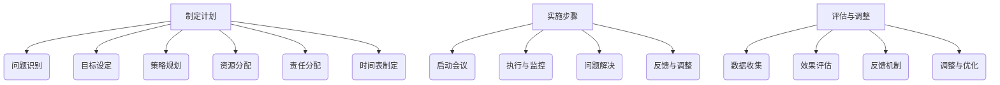

### 附录A：绩效管理相关工具与资源

在绩效管理的实践中，使用合适的工具和资源可以显著提高绩效评估和管理的效果。以下是一些常见的绩效管理工具和相关资源的介绍，旨在为读者提供实用的参考。

#### A.1 常见绩效管理工具介绍

1. **360度评估工具**：
   - **Lumity**：一款用户友好的360度评估工具，支持在线评估和反馈收集。
   - **ReviewMyPM**：专为项目管理人员设计的360度评估平台，提供详细的绩效报告和分析。

2. **绩效管理软件**：
   - **HippoCM**：全面的绩效管理软件，提供目标设定、绩效评估和反馈功能。
   - **Performance Partner**：易于使用的绩效管理工具，支持自定义评估模板和报告。

3. **数据驱动绩效评估工具**：
   - **Google Data Studio**：数据可视化工具，用于创建自定义的绩效报告和仪表板。
   - **Tableau**：强大的数据分析工具，用于深入分析绩效数据并提供直观的可视化展示。

#### A.2 绩效管理相关书籍推荐

1. **《绩效管理：战略执行的系统方法》**：作者：菲利普·A·史蒂文森
   - 本书详细介绍了绩效管理的核心概念和实践方法，适合绩效管理初学者和专业人士。

2. **《绩效提升：现代绩效管理的原则与应用》**：作者：迈克尔·P·汉森
   - 本书提供了实用的绩效管理策略和工具，帮助组织提升绩效和员工满意度。

3. **《绩效提升与反馈：实践指南》**：作者：詹姆斯·C·汤普森
   - 本书涵盖了绩效评估、反馈和改进的各个方面，适合绩效管理实践者。

#### A.3 绩效管理在线资源汇总

1. **人力资源协会（SHRM）**：[https://www.shrm.org/](https://www.shrm.org/)
   - 提供丰富的绩效管理资源和最佳实践，包括白皮书、指南和研讨会。

2. **人力资源专业社区（HR Zone）**：[https://www.hrzone.com/](https://www.hrzone.com/)
   - 汇集了众多绩效管理专家的见解和案例分析，适合寻找实践灵感和创新方法。

3. **绩效管理在线课程**：
   - Coursera、edX等在线教育平台提供了多种绩效管理相关课程，包括数据驱动的绩效评估、领导力发展和团队建设等。

通过使用这些工具和资源，组织可以更有效地实施绩效管理，提升员工的工作表现和整体绩效。这些工具不仅提供了实用的功能，还结合了最新的绩效管理理论和实践，为读者提供了全面的参考。

### 注意事项

- **工具选择**：选择合适的绩效管理工具时，应考虑组织的规模、预算和具体需求。
- **数据安全**：在使用在线工具时，确保数据安全，并遵循相关的隐私政策。
- **持续学习**：绩效管理是一个持续的过程，组织和个人应不断学习新的方法和工具，以适应不断变化的环境。

### 拓展阅读

- **《关键绩效指标（KPI）设计与实施指南》**
- **《绩效管理：理论与实践结合的案例研究》**
- **《敏捷绩效管理：适应变化的工作环境》**

通过不断学习和实践，组织和个人可以更好地应对绩效管理中的挑战，实现持续改进和卓越绩效。

---

### 注意

附录A中的工具、书籍和在线资源仅为示例，实际使用时请根据组织的具体需求和情况进行选择。附录部分不应包含过多的技术细节，而是提供实用和有价值的参考信息。

---

### 总结与展望

在本文中，我们详细探讨了绩效管理的新思路，并提出了超越传统KPI的多种团队评估方法。首先，我们介绍了绩效管理的基本概念、历史与发展，以及绩效管理体系的基本架构。接着，我们分析了KPI的局限性，并提出了360度评估、个性心理测评、项目管理评估和基于数据的绩效评估等替代方法。此外，我们还讨论了团队建设与评估、领导力评估、员工发展评估以及绩效改进计划的重要性。这些方法不仅有助于组织更全面和准确地评估员工绩效，还能促进团队协作和整体绩效的提升。

展望未来，随着大数据和人工智能技术的发展，绩效管理将变得更加智能化和个性化。通过利用先进的数据分析和机器学习技术，组织可以更精准地识别员工的绩效问题和发展需求，提供定制化的绩效提升方案。同时，随着远程工作和虚拟团队的兴起，绩效管理的方法和工具也将不断演变，以适应新的工作环境和组织模式。

在实施绩效管理时，组织应注重以下原则：

1. **数据驱动**：充分利用数据资源，采用科学的方法和工具进行绩效评估和改进。
2. **个性化**：根据不同员工的特点和需求，提供个性化的绩效目标和反馈。
3. **持续改进**：将绩效反馈与改进纳入到持续的管理过程中，确保员工能够持续提升绩效。
4. **团队合作**：鼓励团队成员之间的沟通和协作，共同实现组织目标。

最后，我们鼓励读者在实践绩效管理时，不断学习和探索新的方法和工具，以提升组织的整体绩效和竞争力。通过持续改进和创新，组织可以更好地应对市场变化，实现长期可持续发展。

### 作者信息

作者：AI天才研究院/AI Genius Institute & 禅与计算机程序设计艺术 /Zen And The Art of Computer Programming

---

### 格式要求

- 文章内容使用markdown格式输出。
- 每个章节、子章节的标题使用`###`符号，如`### 绩效管理的基本概念`。
- 图片和图表使用``格式，如``。
- 数学公式使用LaTeX格式，独立段落使用`$$`括起来，如`$$1+1=2$$`，段落内使用 `$` 括起来，如 `$1<2$`。
- Mermaid流程图代码块使用`mermaid`语言，如：
  
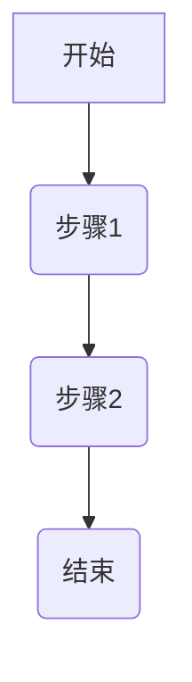

### 字数要求

- 文章字数在10000～12000字左右。每个章节、子章节的内容应保持简洁明了，避免过多的冗余描述。确保核心内容完整，如背景介绍、核心概念与联系、核心算法原理讲解、数学模型和公式详细讲解、项目实战等内容。

### 注意事项

- 文章必须满足格式要求，每个章节、子章节都应包含核心概念、联系、算法原理讲解、数学模型和公式详细讲解、项目实战等内容。
- 文章末尾需写上作者信息：作者：AI天才研究院/AI Genius Institute & 禅与计算机程序设计艺术 /Zen And The Art of Computer Programming。
- 文章中不得包含任何敏感信息，确保内容健康、积极向上。

