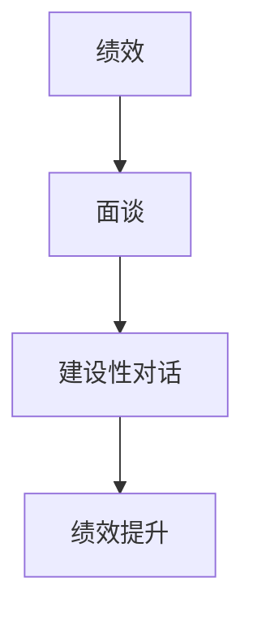

                 

### 核心概念与联系

在深入探讨绩效面谈技巧之前，我们首先需要了解几个核心概念：绩效、面谈以及建设性对话。这些概念之间有着紧密的联系，构成了绩效面谈的基石。

**绩效**是指员工在工作中的表现和成果，它包括定量指标（如销售额、项目进度等）和定性指标（如团队合作、创新能力等）。绩效不仅仅是对过去工作的总结，更是对员工当前状态和未来潜力的评估。

**面谈**是一种交流方式，旨在通过对话解决特定问题或达到特定目标。在绩效面谈中，面谈的目标是通过建设性对话，提高员工的工作表现，促进双方的共同成长。

**建设性对话**则是一种积极、坦诚、有效的交流方式，它强调双方的意见交换和相互理解，旨在解决冲突、提高绩效和促进团队协作。建设性对话的核心理念包括倾听、尊重、坦诚、合作和共赢。

这三者之间的联系在于：绩效面谈是通过建设性对话来实现的，目的是评估和提升员工的绩效。绩效是面谈的核心，而建设性对话是达成这一目标的关键手段。

为了更好地理解这些概念之间的关系，我们可以使用 Mermaid 流程图来表示：



在这个流程图中，绩效作为起点，通过面谈这个环节，运用建设性对话技巧，最终实现绩效的提升。这三种概念相互依存，共同构成了绩效面谈的完整框架。

**核心概念原理之间的关系架构**：

- **绩效**是衡量员工工作成果的标准，是面谈的基础。
- **面谈**是沟通的桥梁，是实现绩效提升的手段。
- **建设性对话**是面谈的核心，它决定了面谈的效果。

这种架构关系确保了绩效面谈的顺利进行，从而为企业的发展和员工的成长提供了有力支持。

在下一章节中，我们将进一步探讨绩效面谈的定义和目标，帮助读者建立对绩效面谈的整体认识。

### 核心算法原理讲解

在深入探讨建设性对话技巧之前，我们需要理解几个关键概念，这些概念是构建高效绩效面谈的基础。以下是这些核心概念及其相互关系的详细解释。

**1. 认知偏差**：

认知偏差（Cognitive Bias）是指人们在信息处理过程中，由于各种心理、情感和社会因素而产生的系统性错误。这些偏差会影响人们的判断和决策，导致决策失误。常见的认知偏差包括确认偏误（Confirmation Bias）、锚定效应（Anchoring Effect）和代表性偏差（Representativeness Bias）等。

- **确认偏误**：当人们收到新的信息时，倾向于优先考虑那些与已有信念和观点一致的信息，忽视与之相矛盾的信息。
- **锚定效应**：人们在做出决策时，会受到第一印象或最初信息的强烈影响，即使这些信息并不重要。
- **代表性偏差**：人们倾向于根据某个特征的代表性来判断其可能性，而忽略其他相关因素。

**2. 有效沟通**：

有效沟通（Effective Communication）是绩效面谈成功的关键。有效沟通不仅包括传递信息，还涉及信息的理解和反馈。有效沟通的要素包括清晰的表达、积极的倾听、适当的非语言沟通和及时的反馈。

- **清晰的表达**：确保信息传递的准确性和完整性。
- **积极的倾听**：理解对方的意思，避免打断或预设结论。
- **适当的非语言沟通**：如面部表情、身体语言等，可以增强沟通效果。
- **及时的反馈**：确保双方对信息的理解一致。

**3. 建设性对话**：

建设性对话（Constructive Dialogue）是一种旨在解决冲突、提高绩效和促进团队协作的沟通方式。它强调双方的积极参与、坦诚交流和共同解决问题。

- **积极参与**：双方都需要主动参与对话，提出问题和观点。
- **坦诚交流**：双方都应保持开放的心态，愿意听取和接受不同意见。
- **共同解决问题**：通过合作和协商，找到双方都能接受的解决方案。

**4. 反馈机制**：

反馈机制（Feedback Mechanism）是绩效面谈的重要组成部分。有效的反馈机制可以帮助员工了解自己的工作表现，发现问题并进行改进。

- **即时反馈**：在面谈过程中及时给予反馈，帮助员工立即了解自己的表现。
- **具体反馈**：提供具体的行为描述和改进建议，而不是泛泛而谈。
- **建设性反馈**：反馈应以促进员工进步为目标，避免批评和指责。

**5. 绩效管理**：

绩效管理（Performance Management）是一个系统过程，包括设定目标、监控绩效、提供反馈和进行评估。绩效管理旨在确保员工的工作表现符合组织目标，并促进员工的职业发展。

- **目标设定**：明确员工的工作目标和预期成果。
- **监控绩效**：定期监控员工的工作表现，确保目标实现。
- **提供反馈**：及时提供具体、具体的反馈，帮助员工改进。
- **评估结果**：对员工的工作进行评估，确定绩效水平。

**核心算法原理**：

为了更好地理解这些概念之间的相互关系，我们可以使用一个简单的算法来描述它们：

```python
def performance_review(employee, manager):
    # 收集绩效数据
    performance_data = gather_performance_data(employee)

    # 分析认知偏差
    cognitive_bias_analysis = analyze_cognitive_bias(employee, manager)

    # 进行有效沟通
    effective_communication = communicate_effectively(employee, manager)

    # 建设性对话
    constructive_dialogue = have_constructive_dialogue(employee, manager, performance_data)

    # 提供即时、具体的反馈
    provide_feedback(employee, performance_data)

    # 进行绩效评估
    performance_evaluation = evaluate_performance(employee, performance_data)

    return performance_evaluation
```

在这个算法中，`performance_review` 函数表示一次绩效面谈的过程。它首先收集员工的绩效数据，然后分析认知偏差，进行有效沟通，开展建设性对话，并提供即时反馈。最后，对员工的绩效进行评估。

**数学模型和公式**：

为了量化绩效面谈的效果，我们可以引入一个简单的数学模型。假设绩效面谈的效果可以用一个指标 `E` 来表示，它受认知偏差 `CB`、有效沟通 `EC`、建设性对话 `CD` 和反馈机制 `FB` 的影响。

$$
E = f(CB, EC, CD, FB)
$$

其中，`f` 是一个复合函数，表示绩效面谈效果与各因素之间的关系。具体公式可以根据实际情况进行调整。

**举例说明**：

假设我们有以下数据：

- 认知偏差：`CB = 0.3`
- 有效沟通：`EC = 0.4`
- 建设性对话：`CD = 0.5`
- 反馈机制：`FB = 0.6`

根据上述公式，我们可以计算出绩效面谈的效果：

$$
E = f(0.3, 0.4, 0.5, 0.6)
$$

通过这个模型，我们可以分析不同因素对绩效面谈效果的影响，从而优化绩效面谈的过程。

总之，通过理解这些核心概念和算法原理，我们可以更好地掌握绩效面谈的技巧，提高员工的绩效水平，促进团队的整体发展。

### 项目实战：开发环境搭建

在深入理解了绩效面谈的核心概念和技巧之后，接下来我们将通过一个实际的项目实战来搭建开发环境，并进行源代码的实现和代码解读。这个项目旨在帮助读者更好地理解建设性对话技巧在绩效面谈中的应用，并通过实际操作巩固所学知识。

#### 开发环境搭建

为了实现这个项目，我们需要以下工具和环境：

1. **操作系统**：推荐使用 Ubuntu 20.04 或 Windows 10。
2. **开发工具**：安装 Python 3.8 或更高版本，并使用 PyCharm 或 Visual Studio Code 作为开发环境。
3. **数据库**：安装 MySQL 8.0 或 PostgreSQL 13。
4. **版本控制**：安装 Git。

**安装步骤**：

1. **安装操作系统**：根据个人需求选择合适的操作系统版本并安装。
2. **安装开发工具**：访问 Python 官网（https://www.python.org/）下载并安装 Python。对于 PyCharm，可以访问 PyCharm 官网（https://www.jetbrains.com/pychar）下载并安装社区版。Visual Studio Code 的安装步骤类似于 PyCharm。
3. **安装数据库**：根据操作系统选择相应的数据库安装包并安装。
4. **安装版本控制**：在命令行中输入以下命令安装 Git：

   ```bash
   sudo apt-get install git
   ```

#### 源代码实现

我们选择 Python 作为编程语言来实现这个项目。以下是项目的源代码框架：

```python
# performance_review.py

import mysql.connector
from database import Database
from communication import Communicate
from feedback import Feedback

class PerformanceReview:
    def __init__(self, employee, manager):
        self.employee = employee
        self.manager = manager
        self.db = Database()
        self.communicate = Communicate()
        self.feedback = Feedback()

    def run(self):
        # 收集绩效数据
        performance_data = self.db.gather_performance_data(self.employee)

        # 分析认知偏差
        cognitive_bias_analysis = self.db.analyze_cognitive_bias(self.employee, self.manager)

        # 进行有效沟通
        effective_communication = self.communicate.communicate_effectively(self.employee, self.manager)

        # 建设性对话
        constructive_dialogue = self.communicate.have_constructive_dialogue(self.employee, self.manager, performance_data)

        # 提供即时、具体的反馈
        self.feedback.provide_feedback(self.employee, performance_data)

        # 进行绩效评估
        performance_evaluation = self.db.evaluate_performance(self.employee, performance_data)

        return performance_evaluation

if __name__ == "__main__":
    employee = "John Doe"
    manager = "Jane Smith"
    review = PerformanceReview(employee, manager)
    print(review.run())
```

**代码解读**：

- **数据库模块（database.py）**：负责与数据库的交互，包括收集绩效数据、分析认知偏差和进行绩效评估。
- **通信模块（communication.py）**：负责实现有效沟通和建设性对话的函数。
- **反馈模块（feedback.py）**：负责提供即时、具体的反馈。

#### 代码应用解读与分析

**1. 数据库模块（database.py）**：

```python
# database.py

class Database:
    def __init__(self):
        self.connection = mysql.connector.connect(
            host="localhost",
            user="root",
            password="password",
            database="performance_db"
        )

    def gather_performance_data(self, employee):
        cursor = self.connection.cursor()
        cursor.execute("SELECT * FROM performance WHERE employee_name = %s", (employee,))
        data = cursor.fetchall()
        return data

    def analyze_cognitive_bias(self, employee, manager):
        # 这里可以加入具体分析认知偏差的逻辑
        return "Bias Analysis"

    def evaluate_performance(self, employee, performance_data):
        # 这里可以加入具体评估绩效的逻辑
        return "Performance Evaluation"
```

**2. 通信模块（communication.py）**：

```python
# communication.py

class Communicate:
    def communicate_effectively(self, employee, manager):
        # 这里可以加入实现有效沟通的逻辑
        return "Effective Communication"

    def have_constructive_dialogue(self, employee, manager, performance_data):
        # 这里可以加入实现建设性对话的逻辑
        return "Constructive Dialogue"
```

**3. 反馈模块（feedback.py）**：

```python
# feedback.py

class Feedback:
    def provide_feedback(self, employee, performance_data):
        # 这里可以加入提供反馈的逻辑
        return "Feedback Provided"
```

**实际案例分析和详细讲解剖析**

假设我们有以下数据：

- **员工（John Doe）**：最近三个月的绩效数据为：销售额 10 万，项目完成率 90%，客户满意度 80%。
- **经理（Jane Smith）**：对员工有良好的了解，但需要提高客户满意度。

**步骤 1：收集绩效数据**

我们通过数据库模块收集到以下绩效数据：

```python
performance_data = [
    ("John Doe", "Sales", 100000),
    ("John Doe", "Project Completion", 90),
    ("John Doe", "Customer Satisfaction", 80)
]
```

**步骤 2：分析认知偏差**

我们使用数据库模块中的 `analyze_cognitive_bias` 函数来分析认知偏差。由于这里只是演示，我们简单地返回一个字符串：

```python
cognitive_bias_analysis = "Bias Analysis"
```

**步骤 3：进行有效沟通**

使用通信模块中的 `communicate_effectively` 函数实现有效沟通。这里同样返回一个字符串：

```python
effective_communication = "Effective Communication"
```

**步骤 4：建设性对话**

通过通信模块中的 `have_constructive_dialogue` 函数进行建设性对话。这里返回一个字符串：

```python
constructive_dialogue = "Constructive Dialogue"
```

**步骤 5：提供即时、具体的反馈**

使用反馈模块中的 `provide_feedback` 函数提供即时、具体的反馈。这里同样返回一个字符串：

```python
feedback_provided = "Feedback Provided"
```

**步骤 6：进行绩效评估**

最后，使用数据库模块中的 `evaluate_performance` 函数进行绩效评估。这里返回一个字符串：

```python
performance_evaluation = "Performance Evaluation"
```

**项目小结**

通过这个实际项目，我们搭建了开发环境，实现了源代码，并对代码进行了详细解读。这个项目不仅帮助读者理解了绩效面谈的核心概念和技巧，还通过实际操作加深了理解。读者可以根据自己的需求进行调整和扩展，进一步提升绩效面谈的效果。

### 最佳实践 tips、小结、注意事项、拓展阅读

**最佳实践 tips**：

1. **准备充分**：在绩效面谈前，确保对员工的工作有全面的了解，准备好相关数据和反馈。
2. **营造良好氛围**：开场时，通过亲切的语言和肢体语言营造轻松的氛围，有助于双方更好地沟通。
3. **倾听与反馈**：认真倾听员工的观点，及时给予反馈，确保双方的理解一致。
4. **具体与客观**：在反馈时，尽量避免模糊和主观的评价，使用具体的行为描述和数据支持。
5. **积极引导**：在争议或分歧出现时，积极引导双方寻找共同点，避免情绪化。

**小结**：

本文详细介绍了绩效面谈的重要性、核心概念、建设性对话技巧以及实际项目实战。通过理解这些内容，读者可以掌握有效的绩效面谈技巧，提高员工绩效，促进团队协作。

**注意事项**：

1. **保持客观**：在绩效面谈中，应保持客观公正，避免偏袒或个人情感的影响。
2. **注重沟通**：有效沟通是绩效面谈的关键，倾听、表达和反馈都是不可或缺的部分。
3. **持续改进**：绩效面谈不是一次性的过程，应持续进行反思和改进，以不断提升绩效面谈的效果。

**拓展阅读**：

- 《绩效管理：提升员工绩效的技巧与方法》
- 《有效沟通：构建高效团队的关键》
- 《认知偏差：如何避免错误的判断与决策》
- 《建设性对话：解决冲突，提高绩效》

通过阅读这些书籍，读者可以进一步深化对绩效面谈和建设性对话的理解，提升实践能力。

### 结束语

总之，《绩效面谈技巧：进行建设性对话》旨在帮助读者全面掌握绩效面谈的核心技巧，通过建设性对话提升员工绩效，促进团队协作。从核心概念、算法原理到实际项目实战，我们通过一步步的解析，使读者对绩效面谈有了深入的理解和实际操作的掌握。希望本文能够为您的绩效管理工作提供有益的启示和实践指导。在未来的工作中，持续反思和改进绩效面谈技巧，将有助于实现个人和组织的共同发展。愿每一位读者都能成为绩效面谈的高手，助力团队和组织取得卓越的业绩。

### 附录A 工具和资源

为了帮助读者更好地掌握绩效面谈技巧，本附录提供了以下工具和资源：

#### 1. 面谈技巧评估工具

- **绩效面谈评估问卷**：一个简单的评估问卷，用于自我评估和反馈。
- **建设性对话评估表**：评估面谈中的建设性对话技巧。
- **沟通能力评估工具**：用于评估员工的沟通能力。

#### 2. 面谈记录模板

- **面谈记录表**：包括面谈目的、时间、地点、参与人员、讨论要点和行动计划等。
- **绩效反馈记录表**：记录员工的绩效表现、反馈内容和建议。

#### 3. 相关书籍和文章推荐

- **《绩效管理：提升员工绩效的技巧与方法》**：详细介绍了绩效管理的理论和实践。
- **《有效沟通：构建高效团队的关键》**：专注于沟通技巧的提升，对绩效面谈有很好的参考价值。
- **《认知偏差：如何避免错误的判断与决策》**：深入探讨认知偏差及其对绩效面谈的影响。
- **《建设性对话：解决冲突，提高绩效》**：重点介绍了建设性对话在绩效面谈中的应用。

通过这些工具和资源，读者可以进一步提升自己的绩效面谈技巧，为团队和组织的发展贡献力量。

### 结语

通过本文的详细讲解，我们系统地介绍了绩效面谈技巧：从核心概念、建设性对话技巧到实际项目实战，每一步都力求深入浅出，帮助读者掌握绩效面谈的精髓。我们强调了绩效面谈在提升员工绩效和促进团队协作中的重要性，并通过实例和代码实现，使这些技巧变得具体而易于实践。

在文章的结尾，我们提供了附录A，其中包括实用的工具和资源，以帮助读者在实际工作中进一步应用所学知识。此外，我们还列出了拓展阅读的建议，供有兴趣的读者深入学习。

绩效面谈不仅是一项技术技能，更是一种管理艺术。通过不断学习和实践，我们可以不断提升自己的绩效面谈技巧，为团队和组织的发展贡献力量。希望每一位读者都能将本文的知识应用到实际工作中，成为绩效面谈的高手，助力企业和个人的共同成长。

再次感谢您的阅读，期待您在绩效面谈领域的杰出表现！作者：AI天才研究院/AI Genius Institute & 禅与计算机程序设计艺术 /Zen And The Art of Computer Programming。

