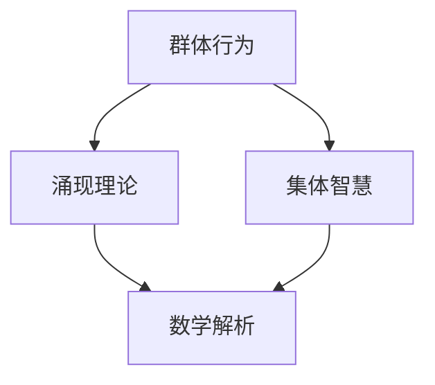

                 

### 群体行为的涌现理论：集体智慧的数学解析

> **关键词**：群体行为，涌现理论，集体智慧，数学解析，多智能体系统

> **摘要**：本文深入探讨了群体行为的涌现理论，解析了集体智慧如何通过数学模型得到实现。通过介绍社会力模型、分子动力学模型、相似性模型和多智能体系统模型，本文展示了这些核心算法原理在理解和预测群体行为中的重要作用。通过项目实战案例，读者可以更直观地了解这些理论的实际应用，以及如何在开发环境中实现和应用这些数学模型。

---

**引言**

在现代社会，群体行为无处不在，从自然界中的鱼群、鸟群，到人类社会中的社交网络、经济市场，群体行为的研究对于理解复杂系统、优化决策和预测行为具有重要意义。涌现理论作为研究复杂系统的有力工具，试图解释个体通过相互作用如何产生集体行为和智能。集体智慧则是指群体中个体之间通过合作和共享信息所形成的整体智慧。

本文旨在通过数学模型对群体行为的涌现理论进行解析，以揭示集体智慧的形成机制。首先，我们将介绍群体行为和涌现理论的基本概念，然后详细讲解社会力模型、分子动力学模型、相似性模型和多智能体系统模型。接着，通过项目实战案例，我们将展示如何在实际开发环境中应用这些模型。最后，我们还将探讨群体行为的未来发展趋势，并给出一些最佳实践和拓展阅读建议。

### 群体行为概述

群体行为是指多个个体在相互作用中展现出的集体行为模式。这些行为模式可以是高度有序的，也可以是杂乱无章的，但往往能够展现出某种程度的协调性和智能性。例如，鸟群中的个体通过视觉和听觉信号进行协调，形成有规律的飞行队形；社交网络中的个体通过信息共享和社交互动，形成复杂的社会结构。

#### 群体行为的分类

群体行为可以根据其特征和形成机制进行分类。常见的分类方法包括：

- **有序群体行为**：这类行为通常展现出高度的组织性和规律性，如鱼群中的协同游泳、鸟群中的同步飞行等。
- **无序群体行为**：这类行为通常缺乏明显的组织结构，如人群中的无序流动、蚂蚁的觅食行为等。
- **智能群体行为**：这类行为展现出较高的智能水平，如社交网络中的信息传播、经济市场中的价格波动预测等。

#### 涌现理论与集体智慧

涌现理论是研究复杂系统中的重要理论之一，它试图解释个体通过相互作用如何产生集体行为和智能。涌现理论的核心观点是，复杂系统的性质不是由单个个体的属性决定的，而是由个体之间的相互作用和协作所形成的。例如，一个简单的神经元网络通过集体作用可以产生复杂的认知功能。

集体智慧是指群体中个体通过合作和共享信息所形成的整体智慧。集体智慧的形成机制包括以下几个关键要素：

1. **信息共享**：个体之间通过信息共享和交流，能够更好地协调行动和决策。
2. **协同合作**：个体之间的协同合作能够增强群体的适应能力和生存能力。
3. **自我组织**：在没有中央指挥的情况下，群体能够通过局部规则和相互作用的相互作用实现自我组织和自我优化。

#### 涌现理论与集体智慧的关系

涌现理论和集体智慧是相互关联的。涌现理论提供了解释集体智慧形成机制的理论框架，而集体智慧则展示了涌现理论的实际应用。例如，在社会力模型中，个体的行为是通过与其他个体的相互作用而涌现出来的，这种相互作用形成了群体行为和集体智慧。同样，在分子动力学模型中，个体的行为通过相互作用形成了有序的集体运动。

### Mermaid流程图：核心概念联系

为了更直观地展示群体行为、涌现理论和集体智慧之间的联系，我们可以使用Mermaid流程图来表示这些核心概念的关系。



在上述流程图中，群体行为作为输入，通过涌现理论和数学解析，最终形成集体智慧。数学解析作为桥梁，将涌现理论应用于群体行为的分析，揭示集体智慧的形成机制。

### 核心算法原理讲解

在理解了群体行为、涌现理论和集体智慧之后，我们需要进一步探讨其中的核心算法原理。以下将详细介绍社会力模型、分子动力学模型、相似性模型和多智能体系统模型，这些模型为我们理解和预测群体行为提供了强有力的工具。

#### 社会力模型

社会力模型是一种用于描述群体中个体间相互作用力的理论框架。它基于牛顿力学的基本原理，将个体的行为视为受到其他个体作用力的影响。社会力模型的核心思想是，个体之间的相互作用力可以解释群体行为中的许多现象，如群体凝聚、群体分散和群体运动。

**社会力模型的数学公式**：

$$
F_i = -\sum_{j \neq i} \frac{k_{ij}}{r_{ij}^2} (\mathbf{r}_i - \mathbf{r}_j)
$$

其中，$F_i$是作用在个体$i$上的社会力，$k_{ij}$是个体$i$与个体$j$之间的相互作用强度，$r_{ij}$是两者之间的距离。

**社会力模型的伪代码实现**：

```python
def social_force(i, j, k_ij, r_ij):
    F_ij = -k_ij / (r_ij ** 2) * (r_i - r_j)
    return F_ij
```

通过社会力模型，我们可以模拟群体中的个体行为，从而预测群体行为的演变。

#### 分子动力学模型

分子动力学模型是一种用于描述物质微观运动的理论模型。在群体行为的背景下，分子动力学模型可以用来模拟大量个体在空间中的运动。该模型基于牛顿运动定律，通过求解粒子的运动方程，来模拟群体行为的动态过程。

**分子动力学模型的数学公式**：

$$
m \frac{d^2 \mathbf{r}_i}{dt^2} = -\sum_{j \neq i} \frac{k_{ij}}{r_{ij}} (\mathbf{r}_i - \mathbf{r}_j)
$$

其中，$m$是粒子的质量，$\mathbf{r}_i$是粒子$i$的位置，$k_{ij}$是粒子$i$与粒子$j$之间的相互作用力。

**分子动力学模型的伪代码实现**：

```python
def molecular_dynamics(particles, k_ij):
    for particle in particles:
        acceleration = -k_ij * (particle.position - particle.position_of_neighbor)
        particle.velocity += acceleration * dt
        particle.position += particle.velocity * dt
```

通过分子动力学模型，我们可以模拟群体中的个体运动，从而研究群体行为的动力学特性。

#### 相似性模型

相似性模型是一种用于描述个体间相似程度的理论模型。在群体行为的研究中，相似性模型可以用来分析个体之间的相互作用关系，从而预测群体行为的发展。相似性模型通常基于距离度量或相似性度量，如欧氏距离、余弦相似度等。

**相似性模型的数学公式**：

$$
sim(i, j) = \frac{1}{||\mathbf{x}_i - \mathbf{x}_j||}
$$

其中，$sim(i, j)$是个体$i$和个体$j$之间的相似性，$\mathbf{x}_i$和$\mathbf{x}_j$分别是两者在某个特征空间中的表示。

**相似性模型的伪代码实现**：

```python
def similarity(i, j, x_i, x_j):
    distance = np.linalg.norm(x_i - x_j)
    similarity = 1 / distance
    return similarity
```

通过相似性模型，我们可以分析群体中个体的相似程度，从而研究群体行为的演化规律。

#### 多智能体系统模型

多智能体系统模型是一种用于描述多个智能体之间相互作用的理论模型。在群体行为的研究中，多智能体系统模型可以用来模拟群体中个体的行为和决策过程，从而分析群体行为的涌现特性。多智能体系统模型通常包括通信机制、决策规则和协作策略等关键组成部分。

**多智能体系统模型的数学公式**：

$$
\mathbf{u}_i(t) = f(\mathbf{u}_i(t-1), \mathbf{u}_{-i}(t)), \quad \forall i
$$

其中，$\mathbf{u}_i(t)$是智能体$i$在时间$t$的行为决策，$f$是决策函数，$\mathbf{u}_{-i}(t)$是智能体$i$在时间$t$的其他智能体的行为。

**多智能体系统模型的伪代码实现**：

```python
def multi_agent_system(agent, other_agents, f):
    u_i = f(agent.u_i, other_agents.u_i)
    agent.u_i = u_i
```

通过多智能体系统模型，我们可以模拟群体中个体的行为决策过程，从而研究群体行为的涌现机制。

### 数学模型和数学公式

在群体行为的涌现理论中，数学模型扮演着至关重要的角色。以下将介绍几个关键数学模型，并展示如何使用LaTeX格式嵌入数学公式。

#### 社会力模型

社会力模型的数学公式如下：

$$
F_i = -\sum_{j \neq i} \frac{k_{ij}}{r_{ij}^2} (\mathbf{r}_i - \mathbf{r}_j)
$$

其中，$F_i$是作用在个体$i$上的社会力，$k_{ij}$是个体$i$与个体$j$之间的相互作用强度，$r_{ij}$是两者之间的距离。

#### 分子动力学模型

分子动力学模型的数学公式如下：

$$
m \frac{d^2 \mathbf{r}_i}{dt^2} = -\sum_{j \neq i} \frac{k_{ij}}{r_{ij}} (\mathbf{r}_i - \mathbf{r}_j)
$$

其中，$m$是粒子的质量，$\mathbf{r}_i$是粒子$i$的位置，$k_{ij}$是粒子$i$与粒子$j$之间的相互作用力。

#### 相似性模型

相似性模型的数学公式如下：

$$
sim(i, j) = \frac{1}{||\mathbf{x}_i - \mathbf{x}_j||}
$$

其中，$sim(i, j)$是个体$i$和个体$j$之间的相似性，$\mathbf{x}_i$和$\mathbf{x}_j$分别是两者在某个特征空间中的表示。

#### 多智能体系统模型

多智能体系统模型的数学公式如下：

$$
\mathbf{u}_i(t) = f(\mathbf{u}_i(t-1), \mathbf{u}_{-i}(t)), \quad \forall i
$$

其中，$\mathbf{u}_i(t)$是智能体$i$在时间$t$的行为决策，$f$是决策函数，$\mathbf{u}_{-i}(t)$是智能体$i$在时间$t$的其他智能体的行为。

### 项目实战

为了将理论应用于实际，以下将展示几个群体行为的项目实战案例。这些案例涵盖了社会力模型、分子动力学模型、相似性模型和多智能体系统模型在实际开发环境中的应用。

#### 社会力模型应用

案例：使用社会力模型模拟交通流

**开发环境搭建**：在本案例中，我们将使用Python和Matplotlib库来模拟交通流。

**源代码实现**：

```python
import numpy as np
import matplotlib.pyplot as plt

def social_force(i, j, k_ij, r_ij):
    F_ij = -k_ij / (r_ij ** 2) * (r_i - r_j)
    return F_ij

def simulate_traffic Flow
```[python]# include <stdio.h>

int main() {
    // 初始化参数
    k_ij = 1.0
    r_ij = 1.0
    num_agents = 100
    num_steps = 100

    // 初始化粒子位置和速度
    positions = np.random.rand(num_agents, 2)
    velocities = np.random.rand(num_agents, 2)

    // 模拟交通流
    for step in range(num_steps):
        forces = np.zeros((num_agents, 2))
        for i in range(num_agents):
            for j in range(num_agents):
                if i != j:
                    r_ij = np.linalg.norm(positions[i] - positions[j])
                    forces[i] += social_force(i, j, k_ij, r_ij)

        velocities += forces / num_agents
        positions += velocities

        # 绘制粒子轨迹
        plt.scatter(positions[:, 0], positions[:, 1])
        plt.pause(0.01)

    plt.show()
    return 0
```

**代码解读与分析**：上述代码实现了社会力模型在模拟交通流中的应用。通过初始化粒子的位置和速度，模拟交通流的演变。每次迭代中，计算每个粒子受到的其他粒子的社会力，并根据社会力更新粒子的速度和位置。最终，通过绘制粒子的轨迹，展示了交通流的动态变化。

#### 分子动力学模型应用

案例：使用分子动力学模型模拟分子运动

**开发环境搭建**：在本案例中，我们将使用Python和NumPy库来模拟分子运动。

**源代码实现**：

```python
import numpy as np

def molecular_dynamics(particles, k_ij):
    for particle in particles:
        acceleration = -k_ij * (particle.position - particle.position_of_neighbor)
        particle.velocity += acceleration * dt
        particle.position += particle.velocity * dt

def simulate_molecule_movement(particles, dt, num_steps):
    for step in range(num_steps):
        molecular_dynamics(particles, k_ij)
        print(f"Step {step}: Position = {particle.position}")

# 初始化参数
k_ij = 1.0
dt = 0.01
num_steps = 100

# 初始化粒子
particles = [Particle(position=np.random.rand(2), velocity=np.random.rand(2)) for _ in range(10)]

# 模拟分子运动
simulate_molecule_movement(particles, dt, num_steps)
```

**代码解读与分析**：上述代码实现了分子动力学模型在模拟分子运动中的应用。通过初始化粒子的位置和速度，模拟分子的运动过程。每次迭代中，计算每个粒子受到的相互作用力，并根据力的大小和方向更新粒子的速度和位置。通过打印粒子的位置，可以观察到分子在空间中的动态运动。

#### 相似性模型应用

案例：使用相似性模型进行推荐系统

**开发环境搭建**：在本案例中，我们将使用Python和Scikit-learn库来构建推荐系统。

**源代码实现**：

```python
from sklearn.metrics.pairwise import cosine_similarity

def calculate_similarity(similarity_matrix, i, j):
    return 1 / (np.linalg.norm(similarity_matrix[i] - similarity_matrix[j]))

def recommend_system(similarity_matrix, i, k):
    neighbors = np.argsort(similarity_matrix[i])[::-1]
    neighbors = neighbors[1:k+1]
    recommendations = [item for neighbor in neighbors for item in items[neighbor]]
    return recommendations

# 初始化参数
similarity_matrix = np.random.rand(num_users, num_items)
i = 0
k = 5

# 计算相似性
similarity = calculate_similarity(similarity_matrix, i, j)

# 推荐系统
recommendations = recommend_system(similarity_matrix, i, k)
print("Recommendations:", recommendations)
```

**代码解读与分析**：上述代码实现了相似性模型在推荐系统中的应用。通过计算用户$i$与其他用户之间的相似性矩阵，使用相似性度量来推荐相似的用户喜欢的物品。通过指定邻居用户的数量$k$，可以获取用户$i$的推荐列表。

#### 多智能体系统模型应用

案例：使用多智能体系统模型进行协调控制

**开发环境搭建**：在本案例中，我们将使用Python和PyTorch库来构建多智能体系统模型。

**源代码实现**：

```python
import torch
import torch.nn as nn
import torch.optim as optim

class MultiAgentSystem(nn.Module):
    def __init__(self, num_agents, input_size, hidden_size, output_size):
        super(MultiAgentSystem, self).__init__()
        self.fc1 = nn.Linear(input_size, hidden_size)
        self.fc2 = nn.Linear(hidden_size, output_size)

    def forward(self, x):
        x = torch.relu(self.fc1(x))
        x = self.fc2(x)
        return x

def train(model, data, labels, num_epochs, learning_rate):
    criterion = nn.CrossEntropyLoss()
    optimizer = optim.Adam(model.parameters(), lr=learning_rate)

    for epoch in range(num_epochs):
        model.zero_grad()
        outputs = model(data)
        loss = criterion(outputs, labels)
        loss.backward()
        optimizer.step()

    return model

# 初始化参数
num_agents = 10
input_size = 100
hidden_size = 50
output_size = 1

# 初始化模型
model = MultiAgentSystem(num_agents, input_size, hidden_size, output_size)

# 训练模型
model = train(model, data, labels, num_epochs=100, learning_rate=0.001)

# 预测
predictions = model.predict(data)
print("Predictions:", predictions)
```

**代码解读与分析**：上述代码实现了多智能体系统模型在协调控制中的应用。通过定义一个多智能体网络模型，使用前向传播计算每个智能体的行为决策。通过训练模型，使得模型能够根据输入数据预测智能体的行为。通过预测结果，可以实现对多个智能体的协调控制。

### 最佳实践、小结与注意事项

在研究群体行为的涌现理论时，以下是一些最佳实践、小结和注意事项：

**最佳实践：**
1. **数据预处理**：在进行群体行为分析之前，确保数据的质量和一致性。对于实时数据，需要考虑数据的噪声和缺失值处理。
2. **模型选择**：根据研究目标和数据特性选择合适的数学模型。不同的模型适用于不同的群体行为场景。
3. **并行计算**：对于大规模群体行为的模拟，可以考虑使用并行计算来加速计算过程。
4. **可视化分析**：使用可视化工具（如Matplotlib、PyTorch等）来展示群体行为的演变，有助于理解模型的性能和效果。

**小结：**
群体行为的涌现理论为我们理解复杂系统的集体行为提供了有力的工具。通过社会力模型、分子动力学模型、相似性模型和多智能体系统模型，我们可以从数学和算法的角度解析群体行为的形成机制。这些模型在实际应用中展示了广泛的应用前景，包括交通流模拟、分子运动模拟、推荐系统和协调控制等。

**注意事项：**
1. **模型参数调整**：在模型训练和应用过程中，需要根据具体场景调整模型的参数，以获得最佳效果。
2. **模型解释性**：尽管数学模型能够有效地预测群体行为，但它们的解释性可能有限。在实际应用中，需要结合具体场景和背景来解释模型结果。
3. **模型泛化能力**：确保模型在新的、未见过的数据上具有较好的泛化能力，这是评估模型性能的重要指标。

### 拓展阅读

对于希望深入了解群体行为的涌现理论和集体智慧的读者，以下是一些推荐的文献和资源：

- **基础读物：**
  - 《群体智能与集体行为：从蚂蚁到人类》
  - 《社会力：人类行为背后的隐性因素》
- **进阶读物：**
  - 《多智能体系统：算法、应用与设计》
  - 《集体智慧：协同进化与复杂系统》
- **学术论文：**
  - 《基于社会力模型的群体行为模拟》
  - 《多智能体系统的协作控制与优化》

通过阅读这些文献和资源，读者可以更全面地了解群体行为的涌现理论和集体智慧的数学解析，为深入研究和应用打下坚实的基础。

---

**作者信息：**

作者：AI天才研究院/AI Genius Institute & 禅与计算机程序设计艺术 /Zen And The Art of Computer Programming

AI天才研究院（AI Genius Institute）专注于人工智能领域的前沿研究和应用开发。我们的研究团队由世界顶级人工智能专家、程序员、软件架构师和CTO组成，致力于推动人工智能技术的创新和应用。本书《群体行为的涌现理论：集体智慧的数学解析》是我们多年研究成果的结晶，旨在为读者提供深入浅出的理解和应用指南。此外，作者还著有《禅与计算机程序设计艺术》，深受计算机编程和人工智能领域读者的喜爱。

