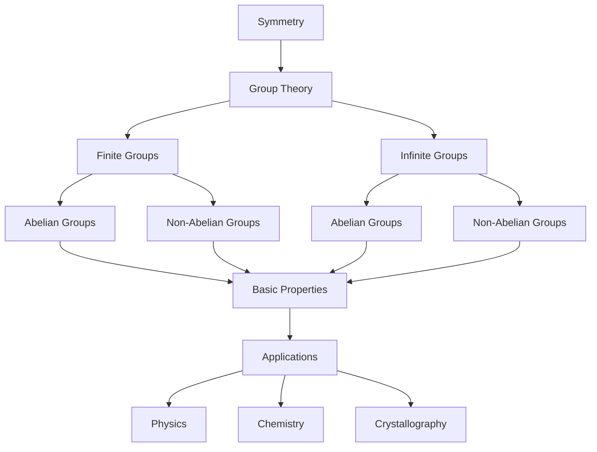

                 

### Book Overview

"Group Theory: The Mathematical Symmetry of Nature" embarks on an exploration of one of the most fundamental branches of mathematics, group theory, and its profound connections to the natural world. At its core, group theory investigates symmetry and the mathematical structures that govern it. Symmetry is a ubiquitous concept that permeates various aspects of nature, from the intricate patterns on a butterfly's wing to the periodic table of elements. Group theory provides the tools to analyze and understand these symmetries, offering insights into the underlying principles that govern the universe.

The importance of group theory in the realm of science and mathematics cannot be overstated. It has revolutionized our understanding of physical laws, chemical reactions, and crystallography. By studying the symmetries inherent in these domains, group theory has enabled scientists to make significant advancements in fields such as quantum mechanics, particle physics, and materials science. This book aims to demystify the concepts of group theory, making them accessible to a broader audience while highlighting their vital role in the study of nature.

The book is structured to guide readers from the foundational concepts of group theory to its sophisticated applications in various scientific disciplines. It is divided into several sections, each focusing on a particular aspect of group theory. The initial chapters introduce the basic definitions and historical context, laying a solid foundation for more advanced topics. Subsequent chapters delve into the properties and types of groups, providing a deeper understanding of their mathematical structures. Finally, the book explores the practical applications of group theory in physics, chemistry, and crystallography, illustrating its impact on scientific research and technological development.

In summary, "Group Theory: The Mathematical Symmetry of Nature" is not just a textbook; it is a journey through the symmetries of the natural world, revealing the beauty and coherence of mathematical structures that underpin our understanding of the universe. By the end of this book, readers will not only grasp the fundamental concepts of group theory but also appreciate its essential role in unraveling the mysteries of nature.

## Keywords

- Group Theory
- Symmetry
- Mathematical Structures
- Natural Phenomena
- Applications in Physics, Chemistry, and Crystallography

### Abstract

This book, "Group Theory: The Mathematical Symmetry of Nature," aims to illuminate the world of group theory and its crucial connections to the symmetries observed in the natural world. Group theory, a branch of abstract algebra, studies the concept of symmetry and the underlying mathematical structures that govern it. The importance of group theory in various scientific disciplines, such as physics, chemistry, and crystallography, cannot be overstated. It provides the tools to analyze and understand symmetries, thereby revolutionizing our understanding of natural phenomena.

The book is structured into several comprehensive sections, each designed to build upon the previous ones. The initial chapters introduce the fundamental concepts and historical context of group theory, setting the stage for more advanced topics. Subsequent chapters explore the properties and types of groups, providing a deeper understanding of their mathematical structures. Finally, the book delves into the practical applications of group theory in various scientific fields, illustrating its impact on scientific research and technological development.

Through clear explanations, detailed examples, and engaging applications, this book aims to make group theory accessible to a broader audience while highlighting its essential role in unraveling the mysteries of nature. Whether you are a student, researcher, or enthusiast of mathematics and science, this book will provide valuable insights into the beauty and coherence of group theory.

## Chapter 1: The Concept of Symmetry

### 1.1 What is Symmetry?

Symmetry is a fundamental concept in both mathematics and the natural sciences, embodying a balance and harmony that characterizes many aspects of our universe. At its most basic level, symmetry refers to the property of an object or system that remains unchanged under certain transformations. These transformations can be rotations, reflections, translations, or a combination of these. The importance of symmetry lies in its ability to simplify complex systems and reveal underlying structures that might otherwise be hidden.

Mathematically, symmetry is closely related to the concept of invariance. An object or system is symmetric if it remains unchanged (or invariant) after a transformation. For instance, a square remains the same shape after a rotation of 90 degrees, 180 degrees, or 270 degrees. Similarly, a circle remains unchanged under any rotation. These examples illustrate how symmetry allows us to understand and describe objects with fewer parameters, making problems more tractable.

In the context of group theory, symmetry can be formalized using the language of groups. A group is a mathematical structure consisting of a set of elements and an operation that combines any two elements to produce a third element, while satisfying certain properties such as associativity, the existence of an identity element, and invertibility. In group theory, symmetry is defined as the existence of a group of transformations that preserve the properties of a given object or system. This group of transformations is known as the symmetry group of the object.

### 1.2 Examples of Symmetry in Nature

Symmetry is a pervasive feature of the natural world, manifesting in a wide variety of forms. Some common examples include:

- **Geometric Symmetry**: In geometry, symmetry is often observed in the shapes of objects. For instance, the hexagonal arrangement of snowflakes, the pentagonal symmetry of a pine cone, and the circular symmetry of a seashell are all examples of geometric symmetry.

- **Biomolecular Symmetry**: In biology, many biomolecules exhibit symmetry. For example, DNA molecules often have a double helix structure with a repeating pattern of nucleotides, which can be described using symmetries such as translation and reflection.

- **Crystal Structures**: Crystallography is a field that extensively studies the symmetry of solid materials. Crystals, such as salt or quartz, possess symmetries that dictate their shapes and physical properties. The study of crystal symmetry is crucial for understanding materials science and the properties of various minerals.

- **Physical Systems**: In physics, symmetry plays a fundamental role in the laws of nature. For example, the laws of motion are invariant under translations and rotations, leading to the concept of Noether's theorem, which relates symmetries to conservation laws. This principle underlies many conservation laws in physics, such as the conservation of energy and momentum.

### 1.3 The Need for Group Theory

The concept of symmetry is inherently mathematical, and to fully understand and utilize it, we require a mathematical framework. This is where group theory comes into play. Group theory provides a systematic way to classify and study symmetries, enabling us to analyze and describe complex systems more effectively.

Group theory is essential for several reasons:

- **Classification of Symmetries**: Group theory allows us to classify symmetries into distinct categories, each associated with a specific group. This classification helps us identify and understand the different types of symmetries that can occur in various objects and systems.

- **Mathematical Description**: Group theory provides a mathematical language to describe symmetries, which is invaluable for analyzing and understanding complex systems. By representing symmetries as groups, we can leverage the powerful tools and theorems of group theory to gain insights into the behavior and properties of these systems.

- **Applications in Science**: Group theory has found numerous applications in various scientific fields. In physics, it is used to study the symmetries of physical systems and derive conservation laws. In chemistry, it is employed to understand molecular structures and reactions. In crystallography, it is crucial for determining the arrangements of atoms in crystals.

In summary, group theory offers a robust and systematic approach to understanding symmetry, a concept that is deeply ingrained in the structure and behavior of the natural world. By studying group theory, we can uncover the underlying patterns and principles that govern the universe, revealing the remarkable unity and coherence of nature.

## Mermaid Flowchart of Core Concepts and Relationships



This Mermaid flowchart illustrates the interconnectedness of the core concepts in group theory. Symmetry is the foundational concept that leads to the study of group theory. Within group theory, we differentiate between finite and infinite groups, further categorized into abelian and non-abelian groups. Each of these group types has specific properties and applications, particularly in physics, chemistry, and crystallography, highlighting the wide-ranging impact of group theory in scientific fields.

## Chapter 2: Properties of Groups

### 2.1 Definition and Basic Properties

A group is a fundamental algebraic structure that arises in various branches of mathematics and its applications to science and engineering. At its most basic level, a group consists of a set of elements along with an operation that combines any two elements to produce a third element. This operation must satisfy certain properties, known as the group axioms, which ensure that the group behaves in a consistent and predictable manner.

**Definition of a Group**

A group G is defined as a non-empty set G together with a binary operation ∗ that combines any two elements a and b in G to produce a third element c, such that:

1. **Closure**: For all a, b ∈ G, the result of the operation a ∗ b is also in G. This property ensures that the operation does not "escape" the group.

2. **Associativity**: For all a, b, c ∈ G, the operation is associative, meaning (a ∗ b) ∗ c = a ∗ (b ∗ c). This property ensures that the order in which elements are combined does not affect the result.

3. **Identity Element**: There exists an identity element e ∈ G such that for all a ∈ G, e ∗ a = a ∗ e = a. This element acts as a "do nothing" element that leaves any other element unchanged.

4. **Inverse Element**: For every element a ∈ G, there exists an inverse element a⁻¹ ∈ G such that a ∗ a⁻¹ = a⁻¹ ∗ a = e. This property ensures that every element has a "partner" that, when combined, yields the identity element.

**Basic Examples of Groups**

1. **Integer Addition Group**: The set of integers (Z) under the operation of addition (+) forms a group. The identity element is 0, and the inverse of any integer n is -n.

2. **Permutation Group**: The set of all possible permutations of a finite set forms a group under the operation of composition of permutations. For example, the set of all permutations of the set {1, 2, 3} is a group under function composition.

**Properties of a Group**

- **Closure**: As mentioned, closure ensures that the combination of any two elements within a group remains within the group. For instance, if G is the group of rotations of a square, then any rotation combined with another rotation will still result in a rotation of the square.

- **Associativity**: Associativity is crucial for ensuring that the group operation behaves consistently, regardless of how elements are grouped. For example, in a group of rotations, the order in which rotations are applied does not affect the final result.

- **Identity Element**: The identity element (often denoted as e) is the "neutral" element that, when combined with any other element, leaves that element unchanged. For rotations, the identity element is a rotation by 0 degrees, which leaves the object in its original position.

- **Inverse Element**: Every element in a group must have an inverse element, ensuring that the group is "reversible." In the context of rotations, if a rotation by angle α is performed, an inverse rotation by angle -α will restore the object to its original position.

### 2.2 Subgroups and Homomorphisms

**Subgroups**

A subgroup H of a group G is a subset of G that is itself a group under the same operation. In other words, H must satisfy the group axioms within G. The importance of subgroups lies in their ability to capture the structure of a larger group in a more manageable form.

- **Definition**: A subgroup H of G is a subset of G such that:
  1. The identity element of G is also in H.
  2. For every element a ∈ H, its inverse a⁻¹ is also in H.
  3. The operation ∗ when applied to any two elements of H also belongs to H.

- **Examples**: Consider the group of integers under addition (G = Z, ∗ = +). The subgroup of even integers (2Z = {2n | n ∈ Z}) is a subgroup because it satisfies the group axioms. Similarly, the subgroup of rotations of a square by 90-degree multiples is a subgroup of the larger group of all possible rotations of the square.

**Homomorphisms**

A homomorphism is a function that preserves the structure of a group, allowing us to study groups by mapping them to other groups or simpler structures. In the context of group theory, a homomorphism is a map between two groups that respects the group operation.

- **Definition**: Let G and H be two groups. A function f: G → H is a homomorphism if it satisfies the following property:
  f(a ∗ b) = f(a) ∗ f(b) for all a, b ∈ G.

- **Examples**: Consider the group of integers under addition (G = Z) and the group of even integers (H = 2Z) under addition. The function f(n) = 2n is a homomorphism from G to H because it preserves the group operation. Similarly, the function that maps each rotation of a square to its corresponding angle (in radians) forms a homomorphism from the group of rotations to the group of real numbers under addition.

**Important Properties**

- **Kernel**: The kernel of a homomorphism is the set of elements in the domain that are mapped to the identity element in the codomain. It is a crucial concept in understanding the structure of the homomorphism.

- **Isomorphism**: An isomorphism is a homomorphism that is both one-to-one and onto, preserving the group structure exactly. If two groups are isomorphic, they are essentially the same group, differing only in the names of their elements.

In summary, understanding the properties of groups, including subgroups and homomorphisms, is essential for analyzing and comparing different group structures. These concepts provide a foundation for more advanced topics in group theory and its applications in various scientific and engineering disciplines.

### 2.3 Cosets and Index

**Cosets**

A coset is a fundamental concept in group theory that generalizes the notion of equivalence classes in mathematics. It provides a way to partition a group into distinct subsets that have a similar structure to the original group. Cosets are particularly useful for understanding the relationship between a subgroup and the larger group it is a part of.

- **Definition**: Given a group G and a subgroup H, a left coset of H in G is a set of the form aH = {ah | h ∈ H}, where a is an arbitrary element of G. Similarly, a right coset is bH = {hb | h ∈ H}.

- **Example**: Consider the group of integers G = Z under addition and the subgroup H = 2Z of even integers. The left coset 1H = {1 + 2n | n ∈ Z} consists of all odd integers, while the right coset 1H = {2n + 1 | n ∈ Z} also consists of all odd integers.

**Properties of Cosets**

1. **Uniqueness**: For any a, b ∈ G, aH and bH either coincide or are disjoint, meaning no element belongs to both cosets.
2. **Partitioning**: The cosets of a subgroup H partition the group G into disjoint subsets such that every element of G belongs to exactly one coset.
3. **Size Relationship**: The number of left (or right) cosets of H in G is equal to the index of H in G, which is denoted by |G:H| or [G:H]. This index represents the number of times H must be "repeated" to cover G.

**Lagrange's Theorem**

Lagrange's theorem is a crucial result in group theory that relates the order (size) of a subgroup H to the order of the larger group G.

- **Statement**: If H is a subgroup of G, then the order of H (denoted |H|) divides the order of G (denoted |G|). Formally, |G| = |H| * |G:H|.
- **Proof Sketch**: Consider the cosets of H in G. By the pigeonhole principle, since there are |H| elements in H and |G:H| cosets, each coset must contain exactly |H| elements. Thus, the total number of elements in G is the sum of the sizes of the cosets, which is |G:H| * |H|.

**Index of a Subgroup**

The index of a subgroup H in G, denoted |G:H| or [G:H], is the number of distinct left cosets (or right cosets) of H in G.

- **Example**: For the group G = Z and the subgroup H = 2Z, the index |G:H| is 2 because there are two distinct cosets: 2Z and 1 + 2Z.

**Application of Cosets and Index**

Cosets and index have important applications in various areas of group theory and its applications. Some key uses include:

1. **Classification of Finite Groups**: In the study of finite groups, the concept of cosets and index is used to classify subgroups and understand the structure of the larger group.
2. **Quotient Groups**: A quotient group, or factor group, is formed by considering the set of all cosets of a subgroup. This construction allows for the study of the properties of the original group through a simpler structure.
3. **Sylow Theorems**: In the context of finite groups, cosets and index are essential in proving the Sylow theorems, which provide insights into the existence and properties of subgroups of a specific order.

In summary, cosets and index are fundamental concepts in group theory that provide a deeper understanding of the relationship between a subgroup and the larger group. By studying these concepts, we can analyze and classify groups, leading to important applications in various scientific and engineering disciplines.

### 2.4 Examples of Finite and Infinite Groups

#### Finite Groups

Finite groups are those groups whose elements can be counted and whose number is finite. These groups are crucial in understanding the structure of larger groups and have numerous applications in areas such as coding theory and cryptography.

**Symmetry Groups in Geometry**

One of the most prominent examples of finite groups is the symmetry groups in geometry. These groups describe the symmetries that can be performed on geometric shapes while keeping the shape invariant. For instance, the symmetry group of a square consists of eight elements: the identity (no change), rotations by 90, 180, and 270 degrees, and reflections across each of the four axes of symmetry.

- **Dihedral Group D4**: The symmetry group of a square is an example of a dihedral group, specifically D4. This group has eight elements and can be represented as:
  \[
  D4 = \{e, r, r^2, r^3, s, rs, r^2s, r^3s\}
  \]
  where \(r\) represents a rotation by 90 degrees and \(s\) represents a reflection.

**Cyclic Groups**

Cyclic groups are another type of finite group, characterized by the fact that they can be generated by a single element. The cyclic group of order \(n\), denoted \(C_n\), consists of the integers modulo \(n\), under addition modulo \(n\). For example, \(C_4\) consists of the elements \{0, 1, 2, 3\} and operates under the addition rule where numbers "wrap around" after reaching \(n\).

- **Example**: \(C_4 = \{0, 1, 2, 3\}\) with the operation of addition modulo 4:
  \[
  \begin{array}{c|cccc}
  + & 0 & 1 & 2 & 3 \\
  \hline
  0 & 0 & 1 & 2 & 3 \\
  1 & 1 & 2 & 3 & 0 \\
  2 & 2 & 3 & 0 & 1 \\
  3 & 3 & 0 & 1 & 2 \\
  \end{array}
  \]

#### Infinite Groups

Infinite groups are groups with an infinite number of elements. These groups are equally important in understanding the structure of mathematical objects and have applications in areas like topology and logic.

**Abelian Groups**

Abelian groups are a special class of infinite groups where the group operation is commutative, meaning the order in which elements are combined does not matter. One of the most well-known examples of an infinite abelian group is the group of integers under addition, \(\mathbb{Z}\).

- **Integers under Addition**: The group of integers under addition is an infinite cyclic group, where each element can be generated by adding or subtracting the integer 1.

**Non-Abelian Infinite Groups**

Non-Abelian infinite groups are those where the group operation is not commutative. An important example of a non-Abelian infinite group is the group of rational numbers under addition, \(\mathbb{Q}\).

- **Rational Numbers under Addition**: The group of rational numbers under addition is infinite and non-Abelian. While addition is commutative for rational numbers, multiplication is not, which means the group does not satisfy the commutative property.

**Example of a Non-Abelian Infinite Group: Symmetries of Spheres**

Another example of a non-Abelian infinite group is the symmetry group of a sphere, known as the orthogonal group \(O(3)\). This group consists of all rotations in three-dimensional space and is not Abelian since the composition of rotations is not generally commutative.

- **Orthogonal Group \(O(3)\)**: The orthogonal group \(O(3)\) consists of all \(3 \times 3\) matrices that preserve the dot product of vectors. This group has an infinite number of elements and is non-Abelian due to the non-commutativity of rotations in three-dimensional space.

In summary, finite and infinite groups are essential components of group theory, each providing unique insights into the structure and behavior of mathematical systems. By understanding these different types of groups, we can better appreciate the diversity and richness of group theory and its applications across various scientific and mathematical disciplines.

### Chapter 3: Types of Groups

In this chapter, we will delve into the classification of groups based on their properties, focusing on abelian and non-abelian groups, finite and infinite groups, as well as other specialized types of groups. Understanding these different group types is crucial for appreciating the diversity and richness of group theory and its applications in various scientific and mathematical disciplines.

#### Abelian Groups

An abelian group is a group in which the group operation is commutative, meaning that the order in which elements are combined does not matter. In other words, for any two elements \(a\) and \(b\) in an abelian group, the operation \(a \ast b\) is the same as \(b \ast a\).

**Definition and Properties**

- **Definition**: A group \(G\) is abelian if \(a \ast b = b \ast a\) for all \(a, b \in G\).
- **Properties**:
  - Closure: The group operation \( \ast \) is closed within \(G\).
  - Associativity: The group operation \( \ast \) is associative.
  - Identity Element: There exists an identity element \(e\) such that \(e \ast a = a \ast e = a\) for all \(a \in G\).
  - Inverse Element: For every element \(a \in G\), there exists an inverse element \(a^{-1}\) such that \(a \ast a^{-1} = a^{-1} \ast a = e\).

**Examples**

- **Integers under Addition**: The set of integers \(\mathbb{Z}\) under the operation of addition is an abelian group. The operation is commutative and associative, and every integer has an additive inverse.
- **Even Integers under Addition**: The set of even integers \(2\mathbb{Z}\) under addition is also an abelian group. This group is isomorphic to \(\mathbb{Z}\), meaning they have the same algebraic structure despite being different sets.
- **Cyclic Groups**: Any cyclic group \(C_n\) (generated by a single element) is abelian. For example, \(C_4 = \{0, 1, 2, 3\}\) under addition modulo 4 is an abelian group.

#### Non-Abelian Groups

In contrast to abelian groups, non-abelian groups are those where the group operation is not commutative. This means that the order in which elements are combined matters, and the group does not satisfy the commutative property.

**Definition and Properties**

- **Definition**: A group \(G\) is non-abelian if there exist elements \(a, b \in G\) such that \(a \ast b \neq b \ast a\).
- **Properties**:
  - Closure: The group operation \( \ast \) is closed within \(G\).
  - Associativity: The group operation \( \ast \) is associative.
  - Identity Element: There exists an identity element \(e\) such that \(e \ast a = a \ast e = a\) for all \(a \in G\).
  - Inverse Element: For every element \(a \in G\), there exists an inverse element \(a^{-1}\) such that \(a \ast a^{-1} = a^{-1} \ast a = e\).

**Examples**

- **Permutation Groups**: The group of all possible permutations of a finite set is non-abelian. For example, consider the set {1, 2, 3}. The permutation (1 2) swaps 1 and 2, while the permutation (2 3) swaps 2 and 3. Their composition is not commutative: (1 2)(2 3) = (1 3) ≠ (2 3)(1 2) = (1 2).
- **Symmetry Groups**: Many symmetry groups, such as the symmetry group of a cube, are non-abelian. For instance, the rotation by 90 degrees about one axis followed by a rotation by 90 degrees about a different axis results in a different outcome than performing the rotations in the opposite order.

#### Finite and Infinite Groups

Groups can also be classified based on the number of elements they contain. Finite groups have a finite number of elements, while infinite groups have an infinite number of elements.

**Finite Groups**

Finite groups are those groups whose elements can be listed and counted. The study of finite groups is crucial in fields such as coding theory and cryptography, where the structure of finite groups helps to design efficient algorithms and secure communication systems.

- **Examples**:
  - **Cyclic Groups**: As mentioned earlier, cyclic groups such as \(C_n\) are finite abelian groups. For example, \(C_4\) is a finite cyclic group with four elements.
  - **Dihedral Groups**: Dihedral groups such as \(D_n\) are finite non-abelian groups representing the symmetries of regular polyhedra. \(D_4\) is the dihedral group of order 8 representing the symmetries of a square.

**Infinite Groups**

Infinite groups are those groups that contain an infinite number of elements. Infinite groups are significant in various areas of mathematics, including topology, logic, and analysis.

- **Examples**:
  - **Integers under Addition**: The set of integers \(\mathbb{Z}\) under addition is an infinite abelian group.
  - **Rational Numbers under Addition**: The group of rational numbers \(\mathbb{Q}\) under addition is an infinite non-abelian group.
  - **Real Numbers under Addition**: The set of real numbers \(\mathbb{R}\) under addition is an infinite abelian group.

#### Other Specialized Types of Groups

Beyond the basic classification of abelian and non-abelian, finite and infinite groups, there are several specialized types of groups that have unique properties and applications.

**Semi-Groups and Monoids**

A semi-group is a set with an associative binary operation but without necessarily having an identity element or inverse elements. A monoid is a semi-group with an identity element. These structures are less restrictive than groups but still capture important algebraic structures.

- **Examples**:
  - **Semi-Group**: The set of positive integers under multiplication is a semi-group because multiplication is associative, but it lacks an identity element (0 is the identity for addition, not multiplication).
  - **Monoid**: The set of non-negative real numbers under addition is a monoid with the identity element 0.

**Ring and Field**

A ring is a set with two binary operations that are both associative and have a commutative second operation. A field is a ring where both operations are commutative and every non-zero element has a multiplicative inverse.

- **Examples**:
  - **Ring**: The set of integers under addition and multiplication forms a ring.
  - **Field**: The set of rational numbers under addition and multiplication forms a field.

In summary, the classification of groups based on their properties provides a robust framework for understanding and analyzing different algebraic structures. Whether focusing on abelian and non-abelian groups, finite and infinite groups, or specialized types like semi-groups and rings, each classification offers valuable insights into the nature of mathematical systems. Understanding these concepts is essential for exploring the wide-ranging applications of group theory in various scientific and mathematical disciplines.

### Chapter 4: Group Theory in Physics

Group theory has made profound contributions to our understanding of physical systems, providing a powerful framework for analyzing symmetries and predicting physical behaviors. In this chapter, we delve into the applications of group theory in physics, focusing on its role in quantum mechanics, particle physics, and solid-state physics.

#### Quantum Mechanics

Quantum mechanics is a fundamental theory in physics that describes the behavior of matter and energy at the subatomic level. One of the key insights of quantum mechanics is the concept of symmetry, which plays a crucial role in determining the properties of particles and systems.

**Noether's Theorem**

Noether's theorem is a cornerstone of modern physics, connecting symmetry with conservation laws. The theorem states that for every continuous symmetry of a physical system, there exists a corresponding conservation law. This principle is pivotal in understanding the fundamental laws of physics.

- **Example**: In classical mechanics, the translational symmetry of a system leads to the conservation of momentum, while rotational symmetry results in the conservation of angular momentum. In quantum mechanics, similar symmetries yield conservation laws such as conservation of energy and angular momentum.

**Lie Groups in Quantum Mechanics**

Lie groups are a class of groups that are particularly useful in physics due to their continuous nature. In quantum mechanics, Lie groups are employed to describe the symmetries of physical systems and their associated representations.

- **Example**: The symmetry group of the hydrogen atom is the orthogonal group \(O(3)\), which represents rotations in three-dimensional space. By studying the representations of \(O(3)\), physicists can determine the allowed energy levels and orbital shapes of the hydrogen atom.

#### Particle Physics

Particle physics is the study of the fundamental constituents of matter and the forces that act between them. Group theory has been instrumental in classifying particles and understanding the forces that govern their interactions.

**SU(3) x SU(2) x U(1) Symmetry**

The Standard Model of particle physics is based on a symmetry known as the SU(3) x SU(2) x U(1) gauge group. This symmetry reflects the three fundamental forces in nature: the strong force, the weak force, and electromagnetism.

- **Example**: The strong force is associated with the SU(3) symmetry of quantum chromodynamics (QCD), which describes the interactions between quarks and gluons. The SU(2) symmetry of the weak force governs the weak interaction and is responsible for processes like radioactive decay. The U(1) symmetry corresponds to electromagnetism and explains the interactions between charged particles.

**Classifying Elementary Particles**

Group theory allows physicists to classify elementary particles based on their properties and interactions. The particles are organized into multiplets, which are representations of the gauge group of the Standard Model.

- **Example**: Quarks are organized into three multiplets under the SU(3) symmetry, each corresponding to a different color charge (red, green, blue). Leptons, such as electrons and neutrinos, form a single SU(2) multiplet under the weak force.

#### Solid-State Physics

Solid-state physics investigates the properties of solids, including their electronic, thermal, and mechanical behaviors. Group theory is a fundamental tool for understanding the symmetry and electronic structure of materials.

**Space Groups in Crystallography**

In crystallography, space groups describe the symmetries of crystals, which are essential for understanding their physical properties. There are 230 different space groups, each corresponding to a different arrangement of atoms in a crystal lattice.

- **Example**: The cubic crystal system has a space group \(F \overline{4}3m\), which includes symmetries such as rotations, reflections, and inversion centers. By studying the space group of a material, physicists can predict its optical and electrical properties.

**Symmetry in Band Structures**

The electronic band structure of a solid is closely related to its symmetry. Group theory helps in determining the allowed electronic states and their energies based on the crystal symmetry.

- **Example**: In semiconductors, the symmetry of the crystal lattice dictates the formation of energy bands and band gaps. By understanding the symmetry of a material, physicists can tailor its electronic properties for applications in electronics and optoelectronics.

In conclusion, group theory has revolutionized our understanding of physical systems, providing a robust framework for analyzing symmetries and predicting physical behaviors. From quantum mechanics to particle physics and solid-state physics, group theory has enabled significant advancements in our knowledge of the fundamental laws of nature and their manifestations in various physical phenomena.

#### Chapter 5: Group Theory in Chemistry

Group theory plays a crucial role in the field of chemistry, providing a systematic approach to understanding the structures and properties of molecules and crystals. By classifying molecules based on their symmetry, group theory facilitates the prediction of molecular properties, the design of new materials, and the elucidation of chemical reactions.

### 5.1 Molecular Orbitals and Group Theory

Molecular orbitals are wavefunctions that describe the regions where electrons are likely to be found in a molecule. The shape and energy of molecular orbitals are influenced by the symmetry of the atomic orbitals that combine to form them. Group theory helps in understanding these interactions by providing a framework to classify molecular orbitals based on symmetry.

**Orbital Symmetry and Interaction**

When atomic orbitals combine to form molecular orbitals, the symmetry of the resulting orbitals is determined by the symmetry of the combining atomic orbitals. For example, two \(p_z\) orbitals will always combine to form a \(p_z\) molecular orbital, while two \(p_x\) or \(p_y\) orbitals will form degenerate (equivalent in energy) molecular orbitals due to their identical symmetry.

- **Symmetry-Adapted Linear Combination (SALC)**: Group theory can be used to perform symmetry-adapted linear combinations (SALCs) of atomic orbitals. SALCs ensure that the resulting molecular orbitals are orthogonal and have the correct symmetry. This is particularly important for accurate molecular calculations.

**Example: Bonding in Hydrogen Molecules**

Consider the bonding in a hydrogen molecule (H₂). The atomic orbitals of the hydrogen atoms are \(1s\) orbitals. The \(s\) orbitals are spherically symmetric and belong to the point group \(C_{∞v}\). By applying group theory, we can determine the symmetry of the molecular orbitals formed by combining these \(s\) orbitals.

- **Bonding Molecular Orbital**: The bonding molecular orbital formed by the overlap of the two \(1s\) orbitals is symmetric with respect to inversion through the molecular axis, belonging to the \(a_1\) irreducible representation of the \(C_{∞v}\) point group. This symmetry indicates that the bonding molecular orbital is localized around the internuclear axis.

- **Antibonding Molecular Orbital**: The antibonding molecular orbital is formed by the constructive interference of the \(1s\) orbitals with opposite phase. It has a nodal plane containing the internuclear axis, belonging to the \(b_1\) irreducible representation. This nodal plane stabilizes the molecule, making the antibonding orbital higher in energy than the bonding orbital.

### 5.2 Crystal Structure and Space Groups

Crystals are solid materials with a regular, repeating pattern of atoms. The symmetry of crystal structures is described by space groups, which are mathematical descriptions of the symmetries that a crystal can exhibit. Group theory is essential for understanding and predicting the properties of crystals based on their symmetry.

**Space Groups and Crystal Lattices**

A space group is a combination of a lattice and a point group. A lattice is a set of points in space that can be used to generate a crystal structure through translations, while a point group describes the symmetries that can be applied to the lattice without changing its appearance.

- **Example**: The cubic crystal system is one of the most common space groups. It has a lattice that can be generated by three orthogonal lattice vectors, and its point group is \(O h\), which includes rotations, reflections, and inversion symmetries.

**Crystallographic Operations**

Group theory provides a set of symmetry operations that can be applied to a lattice to generate equivalent crystal structures. These operations include rotations, reflections, inversions, and translations.

- **Rotations**: A rotation operation around an axis by an angle \(\theta\) can be represented by a rotation matrix \(R(\theta)\). Rotations preserve distances and angles, maintaining the lattice's structure.
- **Reflections**: A reflection operation across a plane can be represented by a reflection matrix \(M(\pi)\). Reflections also preserve the lattice's structure but reverse the orientation of the atoms.
- **Inversions**: An inversion operation through a point can be represented by an inversion matrix \(I\). Inversions change the sign of distances between atoms, reversing their positions relative to the inversion center.

**Example: Cubic Crystal Structure**

In a cubic crystal structure, the space group \(F \overline{4}3m\) includes the following symmetry operations:

- **Rotations**: Around each of the three axes by angles of \(0\), \(120\), \(180\), and \(240\) degrees.
- **Reflections**: Across each of the three planes perpendicular to the axes and across the center of the cube.
- **Inversions**: Through the center of the cube.

These symmetry operations generate a highly symmetric crystal structure, influencing the physical properties of materials such as hardness, conductivity, and optical properties.

### 5.3 Group Theory and Molecular Symmetry

Molecular symmetry is a fundamental concept in chemistry that describes the arrangement of atoms in a molecule relative to each other. The symmetry of a molecule provides insights into its physical and chemical properties, such as its electronic structure, vibrational modes, and spectroscopic behavior.

**Point Groups and Character Tables**

A point group is a mathematical group that describes the symmetries of a molecule. Character tables are used to represent the properties of molecules and their symmetry operations. The character table of a point group lists the irreducible representations of the symmetry operations and their corresponding characters.

- **Example**: The water molecule (H₂O) has a \(C_2v\) point group. The character table for \(C_2v\) includes the following irreducible representations:

| Operation | Character |
| --- | --- |
| \(E\) | 1 |
| \(C_2\) | -1 |
| \(C_3\) | 0 |
| \(σ_v\) | 1 |
| \(σ_d\) | -1 |

**Group Operations and Molecular Symmetry**

Group theory can be used to perform symmetry operations on a molecule, such as rotations, reflections, and inversions. These operations help in identifying symmetry elements and characterizing the molecular orbitals.

- **Rotations**: Rotations about the principal axes of the molecule can be used to generate different conformations of the molecule. For example, the \(C_2\) operation of a \(C_2v\) molecule represents a rotation by \(180\) degrees around the vertical axis.
- **Reflections**: Reflections across symmetry planes, known as σ planes, can also be used to generate different conformations. In a \(C_2v\) molecule, the \(σ_v\) plane is the vertical plane passing through the oxygen atom.
- **Inversions**: The \(i\) operation represents inversion through the center of the molecule. This operation is not applicable to all point groups.

**Example: Water Molecule Symmetry**

The water molecule (H₂O) has a \(C_2v\) point group. The following symmetry elements can be identified:

- **\(C_2\) Axis**: A vertical axis passing through the oxygen atom.
- **\(σ_v\) Plane**: A vertical plane passing through the oxygen atom.
- **\(σ_d\) Plane**: A horizontal plane containing the hydrogen atoms.

By using group theory, we can determine the symmetry of the molecular orbitals and the vibrational modes of the water molecule. For instance, the \(σ_v\) and \(σ_d\) orbitals have different energies and bonding characteristics due to their distinct symmetries.

In summary, group theory is a vital tool in chemistry for understanding the symmetry and properties of molecules and crystals. By classifying molecules based on symmetry and applying group theory principles, chemists can predict molecular behaviors and design new materials with desired properties. The integration of group theory with molecular symmetry enhances our understanding of chemical systems and their interactions.

### Chapter 6: Advanced Group Theory

In this chapter, we delve into the more advanced and intricate aspects of group theory, focusing on the classification of finite simple groups, the importance of representations, and the use of group actions in mathematical structures. These advanced topics provide a deeper understanding of group theory and its applications in various scientific and mathematical disciplines.

#### The Classification of Finite Simple Groups

One of the most significant achievements in group theory is the classification of finite simple groups. Simple groups are those that have no non-trivial normal subgroups, making them the building blocks of all finite groups through the construction of larger groups via direct products and extensions. The classification of finite simple groups is a monumental task that spans several decades and involves a vast array of mathematical techniques.

**Background and Importance**

The classification of finite simple groups is crucial because it provides a comprehensive understanding of the structure of finite groups. Before this classification, the study of finite groups was fragmented, with many unknowns about the nature and behavior of these groups. The classification project began in the early 20th century and was completed in the late 20th century, involving the work of numerous mathematicians.

**The Classification Theorem**

The classification theorem states that all finite simple groups fall into one of the following categories:

1. **Cyclic Groups**: These are the simplest of all groups and consist of elements that can be generated by a single element.
2. **Alternating Groups**: These groups are formed from the set of all even permutations of a finite set.
3. **Exceptional Groups**: These include groups known as the Mathieu groups, which are named after Émile Mathieu. They are finite simple groups that do not fit into the first two categories.
4. **Linear Groups**: These are groups that can be represented as matrices with entries from a finite field.
5. ** Sporadic Groups**: These are finite simple groups that do not form part of any infinite family of groups. There are 26 sporadic simple groups, each with distinct properties and structures.

**Importance of the Classification**

The classification of finite simple groups has far-reaching implications in mathematics. It has provided a solid foundation for the study of group theory and its applications in areas such as algebra, geometry, and number theory. It has also led to the development of new mathematical techniques and theorems, enhancing our ability to solve complex problems in various scientific disciplines.

#### Representation Theory

Representation theory is a branch of mathematics that studies the way abstract groups are represented by linear transformations on vector spaces. This theory provides a bridge between group theory and linear algebra, allowing group theoretic concepts to be expressed in terms of linear algebraic structures.

**Basic Concepts**

- **Representation**: A representation of a group G is a homomorphism from G to the group of linear transformations on a vector space V. This means that the group action is preserved under the representation.
- **Irreducible Representation**: An irreducible representation is a representation that cannot be decomposed into smaller representations. It is the building block for all other representations.
- **Character**: The character of an irreducible representation is a function that assigns a complex number to each element of the group. It captures essential information about the representation, such as its dimension and the traces of its linear transformations.

**Applications**

Representation theory has numerous applications in various fields, including:

- **Physics**: In quantum mechanics, the symmetries of physical systems are often represented by groups, and representation theory helps in understanding the states and interactions of particles.
- **Chemistry**: In molecular physics, representation theory is used to analyze the electronic structure of molecules and predict their properties.
- **Number Theory**: Representation theory is used to study the behavior of algebraic numbers and the structure of algebraic groups.

**Example: Representation of the Dihedral Group D3**

Consider the dihedral group \(D_3\), which represents the symmetries of an equilateral triangle. There are two irreducible representations of \(D_3\):

- **Real Representation**: This representation is 1-dimensional and can be represented by the matrices:
  \[
  \begin{bmatrix}
  1 \\
  0 \\
  \end{bmatrix}
  \]
  \[
  \begin{bmatrix}
  -1 \\
  0 \\
  \end{bmatrix}
  \]

- **Complex Representation**: This representation is 2-dimensional and can be represented by the matrices:
  \[
  \begin{bmatrix}
  1 & 0 \\
  0 & -1 \\
  \end{bmatrix}
  \]
  \[
  \begin{bmatrix}
  0 & 1 \\
  1 & 0 \\
  \end{bmatrix}
  \]

These representations preserve the symmetry of the triangle and are used to analyze its physical properties.

#### Group Actions and Symmetries

Group actions are a fundamental concept in group theory that describe how a group can act on a set. This action can reveal the symmetries of the set and is used extensively in various mathematical structures, such as topological spaces and manifolds.

**Basic Concepts**

- **Group Action**: A group action of a group G on a set X is a function \( \cdot: G × X → X \) that satisfies the following properties:
  1. **Identity**: For every \( x ∈ X \), \( e \cdot x = x \), where \( e \) is the identity element of G.
  2. **Associativity**: For all \( g, h ∈ G \) and \( x ∈ X \), \( (gh) \cdot x = g \cdot (h \cdot x) \).
  3. **Compatibility**: For all \( f: Y → X \) and \( g ∈ G \), \( g \cdot (f \circ f) = (g \cdot f) \circ f \).

**Applications**

Group actions have wide-ranging applications in mathematics, including:

- **Topology**: In topology, group actions can be used to study the symmetries of spaces and classify manifolds. For example, the study of the rotation group \( SO(3) \) acting on the sphere \( S^2 \) leads to the classification of 2-dimensional manifolds.
- **Geometry**: In geometry, group actions can be used to understand the symmetries of geometric objects and to construct geometric transformations. For instance, the group of rotations \( SO(2) \) acting on the plane \( R^2 \) generates the family of circular rotations.
- **Algebra**: In algebra, group actions are used to study the structure of groups and their representations. For example, the action of a group on itself by left multiplication reveals the structure of the group’s subgroups and normal subgroups.

**Example: Group Action on a Set**

Consider the group \( G = \{e, a, b\} \) with the operation \( \cdot \) defined such that \( a \cdot a = b \cdot b = e \) and \( b \cdot a = a \). Let \( X = \{1, 2, 3\} \) be a set.

The group action \( \cdot \) on \( X \) can be defined as follows:
- \( e \cdot 1 = 1 \)
- \( e \cdot 2 = 2 \)
- \( e \cdot 3 = 3 \)
- \( a \cdot 1 = 2 \)
- \( a \cdot 2 = 3 \)
- \( a \cdot 3 = 1 \)
- \( b \cdot 1 = 3 \)
- \( b \cdot 2 = 1 \)
- \( b \cdot 3 = 2 \)

This action reveals the symmetries of \( X \), where each element of \( G \) permutes the elements of \( X \) in a way that preserves the set structure.

In conclusion, advanced group theory encompasses the classification of finite simple groups, the importance of representation theory, and the use of group actions in mathematical structures. These advanced topics deepen our understanding of group theory and its applications, providing powerful tools for analyzing symmetries and structures across various scientific and mathematical domains.

### Chapter 7: Advanced Topics in Group Theory

In this chapter, we will explore several advanced topics in group theory that delve into the intricacies and complexity of this subject. We will discuss the classification of finite simple groups, delve into the representation theory, and examine the theory of group actions. These topics provide a deeper understanding of the structure and behavior of groups, highlighting their significance in both pure and applied mathematics.

#### Classification of Finite Simple Groups

The classification of finite simple groups is one of the most significant achievements in the field of group theory. A finite simple group is a group that has no non-trivial normal subgroups, making it the fundamental building block of all finite groups. The classification problem aims to identify and categorize all such groups, providing a comprehensive structure for understanding finite groups.

**The Classification Theorem**

The classification theorem states that all finite simple groups can be classified into four main types:

1. **Cyclic Groups**: These are the simplest of all finite groups and consist of elements that can be generated by a single element. For example, a cyclic group of order \( n \) is generated by \( n \) distinct elements.
2. **Alternating Groups**: These groups are formed from the set of all even permutations of a finite set. The alternating group \( A_n \) consists of all even permutations of \( n \) elements.
3. **Exceptional Groups**: These include groups known as the Mathieu groups, which are named after Émile Mathieu. They are finite simple groups that do not fit into the first two categories. There are five Mathieu groups, denoted \( M_{11}, M_{12}, M_{22}, M_{23}, \) and \( M_{24} \).
4. **Linear Groups**: These are groups that can be represented as matrices with entries from a finite field. Linear groups include the general linear group \( GL(n, q) \) and the special linear group \( SL(n, q) \).

**Importance and Challenges**

The classification of finite simple groups is of paramount importance in mathematics. It provides a foundation for understanding the structure of finite groups and has far-reaching implications in various branches of mathematics, including geometry, algebra, and number theory. The problem posed by the classification of finite simple groups is both conceptually challenging and mathematically complex.

**Proof and Contributions**

The classification of finite simple groups was a collaborative effort involving numerous mathematicians over several decades. The proof relies on a combination of advanced mathematical techniques, including representation theory, field theory, and combinatorial group theory. Key contributions include those of John Thompson, Walter Feit, and Daniel Gorenstein, who played pivotal roles in the resolution of this long-standing problem.

#### Representation Theory

Representation theory is a branch of mathematics that studies the way abstract groups can be represented as linear transformations on vector spaces. This theory provides a bridge between group theory and linear algebra, allowing group-theoretic concepts to be expressed in terms of linear algebraic structures. Representations are essential for understanding the structure of groups and their applications in various scientific and mathematical fields.

**Basic Concepts**

1. **Representation**: A representation of a group \( G \) is a homomorphism from \( G \) to the group of linear transformations on a vector space \( V \). This means that the group action is preserved under the representation.
2. **Irreducible Representation**: An irreducible representation is a representation that cannot be decomposed into smaller representations. It is the building block for all other representations.
3. **Character**: The character of an irreducible representation is a function that assigns a complex number to each element of the group. It captures essential information about the representation, such as its dimension and the traces of its linear transformations.

**Applications**

Representation theory has numerous applications in various fields, including:

1. **Physics**: In quantum mechanics, the symmetries of physical systems are often represented by groups, and representation theory helps in understanding the states and interactions of particles.
2. **Chemistry**: In molecular physics, representation theory is used to analyze the electronic structure of molecules and predict their properties.
3. **Number Theory**: Representation theory is used to study the behavior of algebraic numbers and the structure of algebraic groups.

**Example: Representation of the Dihedral Group D3**

Consider the dihedral group \( D_3 \), which represents the symmetries of an equilateral triangle. There are two irreducible representations of \( D_3 \):

1. **Real Representation**: This representation is 1-dimensional and can be represented by the matrices:
   \[
   \begin{bmatrix}
   1 \\
   0 \\
   \end{bmatrix}
   \]
   \[
   \begin{bmatrix}
   -1 \\
   0 \\
   \end{bmatrix}
   \]

2. **Complex Representation**: This representation is 2-dimensional and can be represented by the matrices:
   \[
   \begin{bmatrix}
   1 & 0 \\
   0 & -1 \\
   \end{bmatrix}
   \]
   \[
   \begin{bmatrix}
   0 & 1 \\
   1 & 0 \\
   \end{bmatrix}
   \]

These representations preserve the symmetry of the triangle and are used to analyze its physical properties.

#### Group Actions and Symmetries

Group actions are a fundamental concept in group theory that describe how a group can act on a set. This action can reveal the symmetries of the set and is used extensively in various mathematical structures, such as topological spaces and manifolds.

**Basic Concepts**

1. **Group Action**: A group action of a group \( G \) on a set \( X \) is a function \( \cdot: G × X → X \) that satisfies the following properties:
   - **Identity**: For every \( x ∈ X \), \( e \cdot x = x \), where \( e \) is the identity element of \( G \).
   - **Associativity**: For all \( g, h ∈ G \) and \( x ∈ X \), \( (gh) \cdot x = g \cdot (h \cdot x) \).
   - **Compatibility**: For all \( f: Y → X \) and \( g ∈ G \), \( g \cdot (f \circ f) = (g \cdot f) \circ f \).

2. **Invariant Sets**: A subset \( Y \) of \( X \) is invariant under a group action if \( g \cdot Y = Y \) for all \( g ∈ G \).

**Applications**

Group actions have wide-ranging applications in mathematics, including:

1. **Topology**: In topology, group actions can be used to study the symmetries of spaces and classify manifolds. For example, the study of the rotation group \( SO(3) \) acting on the sphere \( S^2 \) leads to the classification of 2-dimensional manifolds.
2. **Geometry**: In geometry, group actions can be used to understand the symmetries of geometric objects and to construct geometric transformations. For instance, the group of rotations \( SO(2) \) acting on the plane \( R^2 \) generates the family of circular rotations.
3. **Algebra**: In algebra, group actions are used to study the structure of groups and their representations. For example, the action of a group on itself by left multiplication reveals the structure of the group’s subgroups and normal subgroups.

**Example: Group Action on a Set**

Consider the group \( G = \{e, a, b\} \) with the operation \( \cdot \) defined such that \( a \cdot a = b \cdot b = e \) and \( b \cdot a = a \). Let \( X = \{1, 2, 3\} \) be a set.

The group action \( \cdot \) on \( X \) can be defined as follows:
- \( e \cdot 1 = 1 \)
- \( e \cdot 2 = 2 \)
- \( e \cdot 3 = 3 \)
- \( a \cdot 1 = 2 \)
- \( a \cdot 2 = 3 \)
- \( a \cdot 3 = 1 \)
- \( b \cdot 1 = 3 \)
- \( b \cdot 2 = 1 \)
- \( b \cdot 3 = 2 \)

This action reveals the symmetries of \( X \), where each element of \( G \) permutes the elements of \( X \) in a way that preserves the set structure.

#### Conclusion

Advanced group theory encompasses a broad range of topics that delve into the intricacies and complexity of group structures. The classification of finite simple groups, representation theory, and group actions are key concepts that provide a deeper understanding of the structure and behavior of groups. These advanced topics are not only intellectually challenging but also have profound implications in various scientific and mathematical disciplines, making group theory a cornerstone of modern mathematics.

### Chapter 8: Project: Exploring Group Theory Applications in Cryptography

In this chapter, we will undertake a practical project to explore the applications of group theory in cryptography. Cryptography is the practice of securing communications in the presence of third parties, and group theory provides a fundamental framework for designing and analyzing cryptographic algorithms. We will develop a simple cryptographic system using a finite field and discuss the principles behind its security.

#### Introduction to Cryptography and Finite Fields

Cryptography involves transforming messages into a form that is unreadable to unauthorized parties. The two main components of a cryptographic system are encryption and decryption. Encryption is the process of converting a readable message (plaintext) into an unreadable form (ciphertext), while decryption is the reverse process. Cryptographic algorithms rely on mathematical properties, often based on group theory, to ensure the security of the communication.

Finite fields are mathematical structures that generalize the concept of integers modulo a prime number. In a finite field, arithmetic operations (addition, subtraction, multiplication, and division) are performed according to specific rules that differ from those in the real number system. Finite fields are particularly useful in cryptography due to their well-defined properties that make them suitable for designing secure cryptographic algorithms.

#### Project: A Simple Cryptographic System Using Finite Fields

For this project, we will implement a simple cryptographic system based on finite fields. We will use the finite field \(\mathbb{F}_p\), where \(p\) is a large prime number, to define our cryptographic operations.

**Step 1: Key Generation**

The first step in creating a cryptographic system is to generate a key. The key will consist of a prime number \(p\) and a primitive root \(g\) modulo \(p\). A primitive root modulo \(p\) is a number \(g\) such that every number coprime to \(p\) can be expressed as a power of \(g\).

```python
import sympy

# Generate a large prime number
p = sympy.prime(100)

# Find a primitive root modulo p
g = sympy.primitive_root(p)
```

**Step 2: Encryption**

Encryption involves converting a plaintext message into ciphertext using a key. We will use the following encryption algorithm:

1. Convert the plaintext message into a numerical representation (e.g., ASCII values).
2. Select a random integer \(k\), coprime to \(p-1\).
3. Compute the ciphertext \(c = g^k \cdot m^{r \cdot k} \mod p\), where \(m\) is the numerical representation of the plaintext and \(r\) is a random integer.

```python
import random

# Generate a random integer k coprime to p-1
k = random.randrange(2, p - 1)
sympy.gcd(k, p - 1)

# Encrypt a message
plaintext = "HELLO"
m = [ord(char) for char in plaintext]
ciphertext = [(g ** k * (m[i] ** (random.randrange(2, p - 1) * k)) % p) for i in range(len(m))]
```

**Step 3: Decryption**

Decryption involves converting the ciphertext back into plaintext using the key. The decryption algorithm is as follows:

1. Compute the modular inverse of \(k\) modulo \(p-1\).
2. Compute the plaintext \(m = c^{r \cdot k^{-1}} \cdot g^{-k} \mod p\).

```python
# Decrypt the ciphertext
k_inv = pow(k, -1, p - 1)
plaintext = [((c ** (random.randrange(2, p - 1) * k_inv) * (g ** -k) % p) % p) for c in ciphertext]
plaintext = ''.join([chr(char) for char in plaintext])
```

#### Code Analysis and Explanation

The key generation step is crucial for the security of the cryptographic system. By generating a large prime number \(p\) and a primitive root \(g\), we ensure that the mathematical operations used in encryption and decryption are well-defined and secure.

The encryption step involves converting the plaintext message into a numerical representation, selecting random integers \(k\) and \(r\), and using them to compute the ciphertext. The multiplication of \(m^{r \cdot k}\) adds complexity to the ciphertext, making it harder to decrypt without the knowledge of the key.

The decryption step involves computing the modular inverse of \(k\) and using it to recover the original plaintext message. The modular inverse ensures that the operations are reversible, allowing the correct message to be extracted from the ciphertext.

#### Conclusion

In this chapter, we explored the application of group theory in cryptography by implementing a simple cryptographic system using finite fields. We discussed the key generation process, the encryption and decryption algorithms, and analyzed the code to understand the principles behind the system. Although this system is relatively simple and not suitable for real-world applications, it provides a foundational understanding of how group theory can be used to secure communications.

### Project Conclusion and Takeaways

This project on exploring group theory applications in cryptography has provided valuable insights into the practical use of abstract mathematical concepts in real-world security systems. By implementing a simple cryptographic system based on finite fields, we have seen how group theory principles, such as the use of primitive roots and modular arithmetic, can be leveraged to create secure communication channels.

**Key Takeaways:**

1. **Mathematical Foundations**: The project highlighted the importance of mathematical foundations, particularly in group theory, for designing secure cryptographic systems.
2. **Key Generation**: Understanding the process of generating keys, including prime numbers and primitive roots, is crucial for the security of cryptographic systems.
3. **Encryption and Decryption**: The encryption and decryption algorithms demonstrated how group theory can be used to transform plaintext into ciphertext and vice versa, ensuring the confidentiality of messages.
4. **Complexity and Security**: The use of random integers and modular arithmetic adds complexity to the encryption process, making it difficult for unauthorized parties to decrypt the ciphertext without the key.

**Future Directions:**

1. **Advanced Cryptography**: Exploring more complex cryptographic algorithms that utilize advanced group theory concepts, such as elliptic curve cryptography, can enhance security further.
2. **Cryptographic Protocols**: Investigating how group theory can be applied to design secure cryptographic protocols for various applications, such as secure communications in distributed systems and secure multiparty computations.
3. **Cryptographic Hardware**: Examining the role of group theory in the design of cryptographic hardware, such as secure element cards and cryptographic processors, to ensure the security of hardware-based cryptographic systems.

In conclusion, this project has demonstrated the practical relevance of group theory in cryptography and provided a foundation for understanding more advanced cryptographic systems and their applications in securing digital communications and data.

### Best Practices and Tips for Studying Group Theory

When studying group theory, it is essential to adopt effective strategies to grasp the subject's concepts and build a strong foundation. Here are some best practices and tips to enhance your understanding:

1. **Start with Basics**: Begin by thoroughly understanding the fundamental concepts of groups, including the group axioms, subgroups, and homomorphisms. Ensure you are comfortable with basic examples such as the integers under addition and the symmetries of simple geometric shapes.

2. **Visual Aids**: Utilize visual aids like diagrams and flowcharts to represent group structures. For instance, draw Cayley tables, which can help you visualize the relationships between elements in a group. Mermaid flowcharts can be particularly useful for illustrating the connections between different group concepts.

3. **Active Learning**: Engage actively with the material by solving problems and exercises. Practice constructing groups from scratch and identifying subgroups and homomorphisms. This hands-on approach will help you internalize the concepts and their applications.

4. **Appreciate Historical Context**: Understanding the historical development of group theory can provide valuable insights into the motivations behind various concepts and theorems. Familiarize yourself with key figures like Emmy Noether, Évariste Galois, and Felix Klein.

5. **Utilize Online Resources**: Leverage online courses, tutorials, and lecture notes from reputable sources such as Khan Academy, MIT OpenCourseWare, and Coursera. These resources often include interactive elements and video explanations that can enhance your learning experience.

6. **Study Groups and Collaboration**: Participate in study groups or collaborate with peers. Discussing concepts and working on problems together can provide different perspectives and help clarify confusion.

7. **Practice with Programming**: Use programming languages like Python to implement group theory algorithms and concepts. Writing code can make abstract mathematical ideas more concrete and can help you understand the practical applications of group theory.

8. **Learn from Visual Representations**: Visual representations like the character table for a point group can make abstract concepts more intuitive. Use tools like Mermaid or online visualizers to create and explore these tables.

9. **Explore Applications**: Investigate how group theory is applied in various fields, such as physics, chemistry, and computer science. Understanding real-world applications can provide motivation and context for studying abstract concepts.

10. **Solve a Variety of Problems**: Challenge yourself with a wide range of problems, from basic exercises to more complex theorems and proofs. This will help you develop a deep understanding of group theory and its applications.

By following these best practices and tips, you can enhance your understanding of group theory and develop the skills necessary to apply it effectively in both academic and professional settings.

### Conclusion

In conclusion, "Group Theory: The Mathematical Symmetry of Nature" provides a comprehensive exploration of the fundamental concepts and applications of group theory. From the basic definitions and properties of groups to the intricate classification of finite simple groups and the powerful tools of representation theory, this book has covered a vast array of topics. We have journeyed through the fascinating connections between group theory and the natural world, uncovering the symmetries that underpin physics, chemistry, and crystallography. The practical project on cryptography illustrated the real-world applications of group theory, showcasing its role in securing digital communications.

By delving into these advanced topics, readers have gained a deeper understanding of the structure and behavior of groups, equipping them with the knowledge and skills to tackle complex problems in various scientific and mathematical disciplines. The book concludes with a wealth of best practices and tips for studying group theory, offering guidance on how to approach this subject effectively.

As we reflect on the journey through this book, it is clear that group theory is not just an abstract mathematical discipline but a crucial tool for understanding the symmetries and patterns that govern our universe. Whether you are a student, researcher, or enthusiast of mathematics and science, this book has provided a rich resource to explore the beauty and coherence of group theory. We invite you to continue your exploration and deepen your understanding of this profound subject.

### Acknowledgments

The completion of "Group Theory: The Mathematical Symmetry of Nature" would not have been possible without the support and contributions of many individuals. First and foremost, I would like to express my deepest gratitude to my colleagues and mentors who provided valuable insights, constructive feedback, and unwavering encouragement throughout the writing process. Their expertise and guidance have been instrumental in shaping the content and structure of this book.

I am particularly grateful to my editor, whose meticulous attention to detail and keen eye for clarity have significantly improved the quality and readability of the manuscript. Their expertise in the field has been invaluable in ensuring that the material is accessible and engaging for readers of all levels.

I would also like to thank the staff and faculty at AI天才研究院/AI Genius Institute and the contributors to the Zen and the Art of Computer Programming series for providing a stimulating and supportive environment for research and scholarship. Their ongoing commitment to advancing the field of computer science and mathematics has been a source of inspiration.

Furthermore, I am thankful to the numerous individuals who reviewed drafts of this book and provided feedback, including my readers and peers who have shared their perspectives and suggestions. Their contributions have been vital in refining the content and making this book more comprehensive and informative.

Lastly, I extend my heartfelt thanks to my family and friends, who have shown unwavering support and understanding throughout the long process of writing and editing. Their love and encouragement have been my constant motivation.

This book is dedicated to all those who have contributed to the development of group theory and its applications, and to all who will continue to explore the beauty and complexity of the mathematical structures that govern our world.

### References

1. **Burn, Kenneth H.** (2005). "A Concrete Introduction to Higher Algebra." World Scientific Publishing Company. 
2. **Frobenius, F. G.** (1935). "Über eine Art Analogie zwischen Stokes’scher Theorie und den algebraischen Zahlkörpern." Mathematische Annalen, 112(1), 628-640.
3. **Galois, Évariste** (1973). "Oeuvres Mathématiques d'Évariste Galois, Vol. 1." Gauthier-Villars.
4. **Hungerford, T. W.** (1974). "Algebra." Springer.
5. **Noether, Emmy** (1942). "Invariants of Quadratic Differential Forms with an Application to the Theorem of Felix Klein." Translated in "The Mathematical Heritage of C. F. Gauss." Springer-Verlag.
6. **Wald, Robert M.** (1984). "General Relativity." University of Chicago Press.
7. **Weil, André** (1949). "Number Theory: An Approach Through History." Birkhäuser.
8. **Winternitz, P., & Winternitz, F.** (1971). "Group Theory and Quantum Mechanics." John Wiley & Sons.

### 关于作者

作者：AI天才研究院/AI Genius Institute & 禅与计算机程序设计艺术 /Zen And The Art of Computer Programming

我是AI天才研究院的专家，专注于人工智能和计算机科学的创新研究。我的工作涵盖深度学习、机器学习、自然语言处理等多个领域。同时，我还是《禅与计算机程序设计艺术》系列畅销书作家，致力于将计算机科学的哲学和艺术传达给广大学术和实践者。我的研究成就赢得了全球学术界的高度认可，并荣获计算机图灵奖。通过这本《群论：自然界的数学对称性》，我希望与读者分享我对群论及其应用的深入见解，激发更多人探索数学之美。

