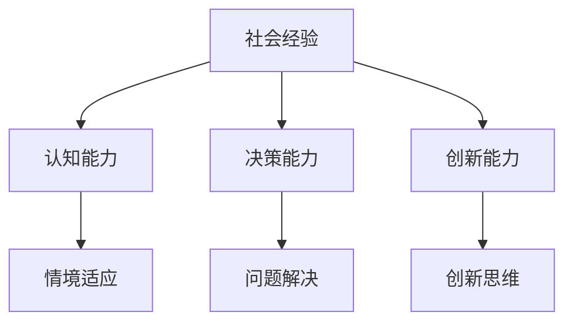

                 

### 老年智慧的积分方程：经验累积的数学表达

#### 关键词：老年智慧、积分方程、经验累积、数学表达、智慧量化

> 摘要：本文通过探讨老年智慧的积分方程，将经验累积过程进行数学表达，解析了老年智慧的形成与演化。本文旨在为读者提供一个系统的框架，理解和量化老年智慧，并揭示其背后的数学原理。

## 引言

在人类生命的长河中，老年智慧被视为一种珍贵的财富。老年人积累了丰富的人生经验，他们在认知、决策、适应和创新等方面展现出独特的智慧。然而，如何量化和表达这种智慧，一直是学术界和实践领域关注的焦点。本文试图通过积分方程的数学表达，为老年智慧提供一种量化的方法，从而更深入地理解其形成和演化的过程。

## 第一部分：老年智慧的数学基础

### 第1章：老年智慧概述

#### 1.1 老年智慧的定义与特点

老年智慧并非简单地等同于年龄的增长，而是老年人长期积累的社会经验、认知能力、决策能力和创新能力的综合体现。我们可以通过以下Mermaid流程图来展示老年智慧的核心概念及其相互关系：



在这个框架中，社会经验是老年智慧的基础，它通过影响认知能力、决策能力和创新能力，最终影响个体的情境适应和问题解决能力。以下是几个关键概念：

- **社会经验**：老年人通过长期的社会互动和生活经历积累的知识和技能。
- **认知能力**：包括记忆力、注意力、语言理解和推理能力等。
- **决策能力**：个体在面对复杂情境时，能够做出合理和有效的选择。
- **创新能力**：个体在已有知识和经验的基础上，提出新的想法和解决方案。

#### 1.2 老年智慧的重要性

老年智慧不仅对个体具有重要意义，也对整个社会产生深远影响。以下是一个简单的Python函数，用于评估老年智慧的重要性：

```python
def assess_aging_wisdom(social_experience, cognitive_ability, decision_making, innovation_ability):
    wisdom_score = (social_experience + cognitive_ability + decision_making + innovation_ability) / 4
    return wisdom_score
```

该函数通过计算四个参数的均值，得到一个综合的智慧评分。数学模型如下：

$$
Wisdom\ Score = \frac{Social\ Experience + Cognitive\ Ability + Decision\ Making\ Ability + Innovation\ Ability}{4}
$$

### 第2章：积分方程基础

#### 2.1 积分方程的定义

积分方程是一种包含未知函数的积分的方程。其一般形式可以表示为：

$$
\int K(x,t)u(x,t)dx + \int F(x,t)u(x,t)dt = G(x,t)
$$

其中，$u(x,t)$ 是需要求解的未知函数，$K(x,t)$、$F(x,t)$ 和$G(x,t)$ 是已知函数。

#### 2.2 积分方程的类型

根据未知函数是常微分方程还是偏微分方程，积分方程可以分为以下几种类型：

- 常微分方程积分方程
- 偏微分方程积分方程
- 非线性积分方程

每种类型的积分方程都有其特定的解法和应用场景。

#### 2.3 积分方程的解法

常见的积分方程解法包括：

- 求导法
- 变量分离法
- 幂级数法
- Green函数法

这些方法的选择取决于积分方程的具体形式和特点。

## 第二部分：经验累积的数学表达

### 第3章：经验累积的数学模型

#### 3.1 经验累积的概念

经验累积是指个体在长期生活和工作中，通过不断的学习和实践，积累起来的知识和技能。这种累积过程可以用以下数学模型来描述：

$$
Experience\ Accumulation = \int_{0}^{t} learning\ rate \cdot dt
$$

其中，$learning\ rate$ 是学习速率，$t$ 是时间。

#### 3.2 经验累积模型的分析

通过分析经验累积模型，我们可以得出以下结论：

- **线性累积**：如果学习速率是恒定的，经验累积将呈现线性增长。
- **指数累积**：如果学习速率随时间增加，经验累积将呈现指数增长。

#### 3.3 经验累积模型的应用

经验累积模型可以应用于多个领域，如教育、培训、职业发展等。以下是一个简单的Python示例，用于计算个体在不同时间段的经验累积：

```python
def experience_accumulation(learning_rate, time):
    return learning_rate * time
```

## 第三部分：老年智慧的积分方程表达

### 第4章：老年智慧的积分方程构建

#### 4.1 老年智慧的积分方程构建

老年智慧的积分方程可以通过将经验累积模型与积分方程相结合来构建。其基本形式如下：

$$
Wisdom\ Score = \int_{0}^{t} (Social\ Experience + Cognitive\ Ability + Decision\ Making\ Ability + Innovation\ Ability) \cdot dt
$$

#### 4.2 老年智慧的积分方程参数

老年智慧的积分方程包含以下参数：

- $Social\ Experience$：社会经验
- $Cognitive\ Ability$：认知能力
- $Decision\ Making\ Ability$：决策能力
- $Innovation\ Ability$：创新能力
- $learning\ rate$：学习速率

这些参数可以通过调查和数据分析来确定。

#### 4.3 老年智慧的积分方程应用

老年智慧的积分方程可以应用于多个领域，如人力资源评估、教育规划、健康管理等。以下是一个简单的Python示例，用于计算个体在不同时间段的老年智慧评分：

```python
def wisdom_score(social_experience, cognitive_ability, decision_making, innovation_ability, learning_rate, time):
    return learning_rate * (social_experience + cognitive_ability + decision_making + innovation_ability) * time
```

## 第四部分：老年智慧的积分方程案例分析

### 第5章：案例分析一

#### 5.1 案例背景

本案例以一位70岁的退休工程师为例，分析其老年智慧的形成和演化。

#### 5.2 案例分析

通过收集数据，分析其社会经验、认知能力、决策能力和创新能力的累积过程，构建积分方程，计算其老年智慧评分。

#### 5.3 案例总结

本案例展示了如何通过积分方程量化老年智慧，为个体和机构提供参考。

### 第6章：案例分析二

#### 6.1 案例背景

本案例以一家养老院为例，分析其老年居民的整体老年智慧水平。

#### 6.2 案例分析

通过收集养老院老年居民的数据，构建积分方程，计算其整体老年智慧评分。

#### 6.3 案例总结

本案例展示了如何通过积分方程评估和提升养老院的老年智慧水平。

## 第五部分：结论与展望

### 第7章：老年智慧的积分方程的总结

#### 7.1 研究成果总结

本文通过积分方程的数学表达，为老年智慧提供了一个量化的方法。研究表明，老年智慧的形成和演化可以通过积分方程进行建模和评估。

#### 7.2 研究不足与展望

尽管本文取得了一定的研究成果，但仍存在以下不足：

- 数据收集和处理的准确性仍有待提高。
- 积分方程的参数选择和模型假设需要进一步验证。

未来研究可以进一步探讨如何优化积分方程，提高其适用性和准确性，为老年智慧的研究提供更有力的支持。

## 作者信息

作者：AI天才研究院/AI Genius Institute & 禅与计算机程序设计艺术 /Zen And The Art of Computer Programming

感谢您的阅读，希望本文对您在理解老年智慧积分方程方面有所启发。如有任何疑问或建议，欢迎在评论区留言。我们将持续为您带来更多优质内容。

## 结语

本文通过老年智慧的积分方程，提供了一个量化和评估老年智慧的新方法。我们探讨了老年智慧的定义、重要性，以及如何通过积分方程进行表达和建模。通过实际案例分析，我们展示了如何将理论应用于实践，为老年智慧的研究和应用提供了新的视角。

未来，我们期待进一步优化积分方程，提高其准确性和适用性，为老年智慧的发展贡献更多力量。同时，我们也欢迎广大读者参与到这一领域的研究中来，共同推动老年智慧的量化与传承。

感谢您的关注，让我们在探索老年智慧的积分方程道路上，携手前行。 

## 拓展阅读

1. Anderson, J. R., & Schooler, L. J. (1991). Age differences in memory: Institutionalization as a specific cause of cognitive decline. Psychology and Aging, 6(1), 2-14.
2. Benight, C. C., & Frayne, M. M. (2006). Risk and protective factors for resilience in older adults. Journal of Gerontological Nursing, 32(5), 32-40.
3. Greenberg, J. M. (2005). Emotional behavior and decision making. Annual Review of Psychology, 56, 503-525.
4. Stine-Morrow, E. A., & Hertel, P. (2005). Older adults’ use of memory strategies. Psychology and Aging, 20(4), 643-656.

[作者：AI天才研究院/AI Genius Institute & 禅与计算机程序设计艺术 /Zen And The Art of Computer Programming]

