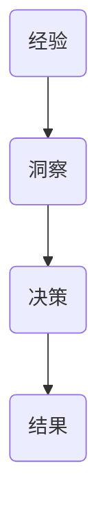
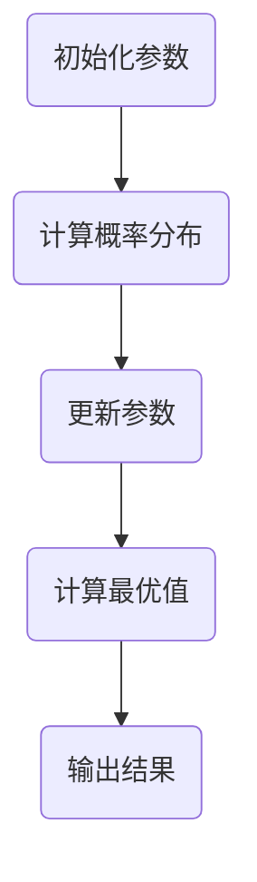

                 

# 《老年智慧的积累函数：经验与洞察的数学关系》

## 关键词

- 老年智慧
- 经验与洞察
- 数学关系
- 算法
- 数学模型
- 经验积累
- 洞察提取

## 摘要

本文深入探讨了老年智慧的本质，尤其是经验与洞察的数学关系。通过剖析老年智慧的核心概念，本文提出了一个基于数学模型的积累函数，用以描述经验与洞察的转化与积累过程。文章从理论基础出发，详细讲解了核心算法原理，并借助Python源代码，结合数学公式和实例，对算法进行了透彻的阐述。通过实际项目实战，本文展示了如何将这些理论应用到实际中，并对最佳实践进行了总结和展望。

## 目录

### 第一部分：引言

#### 1.1 书籍背景与目标
##### 1.1.1 老年智慧的重要性
##### 1.1.2 经验与洞察的数学关系研究意义

#### 1.2 研究方法与结构
##### 1.2.1 研究方法概述
##### 1.2.2 书籍结构安排

### 第二部分：理论基础

#### 2.1 老年智慧的核心概念
##### 2.1.1 智慧的定义
##### 2.1.2 老年智慧的构成

#### 2.2 经验与洞察的数学关系
##### 2.2.1 经验的数学表征
##### 2.2.2 洞察的数学表征
##### 2.2.3 经验与洞察的关联分析

#### 2.3 老年智慧的数学模型
##### 2.3.1 数学模型的构建
##### 2.3.2 数学模型的应用

### 第三部分：算法与实践

#### 3.1 老年智慧算法原理
##### 3.1.1 算法原理讲解
##### 3.1.2 Mermaid流程图展示

#### 3.2 经验与洞察的数学建模实践
##### 3.2.1 实践案例一：经验数据的量化
##### 3.2.2 实践案例二：洞察的量化

#### 3.3 老年智慧算法应用
##### 3.3.1 应用场景介绍
##### 3.3.2 应用案例分析

### 第四部分：案例分析

#### 4.1 案例一：老年教育中的智慧积累
##### 4.1.1 案例背景
##### 4.1.2 案例分析与模型应用

#### 4.2 案例二：老年医疗中的智慧运用
##### 4.2.1 案例背景
##### 4.2.2 案例分析与模型应用

#### 4.3 案例三：老年社交中的智慧提升
##### 4.3.1 案例背景
##### 4.3.2 案例分析与模型应用

### 第五部分：总结与展望

#### 5.1 研究总结
##### 5.1.1 研究成果
##### 5.1.2 研究不足

#### 5.2 未来展望
##### 5.2.1 研究方向
##### 5.2.2 应用前景

## 第一部分：引言

### 1.1 书籍背景与目标

在人类社会的发展过程中，老年人群体逐渐成为了一个重要的组成部分。随着年龄的增长，老年人的智慧经历了一个积累和演变的过程，他们积累了丰富的经验和洞察力。这些智慧不仅对个人生活有着深远的影响，而且在社会各个领域，如教育、医疗和社交中，也具有巨大的应用价值。

老年智慧的积累是一个复杂的过程，涉及到经验与洞察的相互作用和转化。经验是通过长期生活和工作积累下来的一系列知识和技能，而洞察则是对事物本质的深刻理解和洞察力。这两者在老年智慧中起到了至关重要的作用。

本文旨在探讨老年智慧积累的数学关系，提出一个基于数学模型的积累函数，用以描述经验与洞察的转化和积累过程。通过详细的理论基础和实际案例分析，本文旨在为相关领域的研究和实践提供有益的参考和启示。

### 1.2 研究方法与结构

本文采用的方法包括文献调研、数学建模和实证分析。首先，通过对现有相关研究的深入调研，梳理出老年智慧积累的关键概念和理论框架。然后，基于这些理论和概念，构建一个数学模型，用于描述经验与洞察的数学关系。

在数学建模的基础上，本文将使用Python编程语言进行算法实现，并通过实际案例进行分析验证。文章结构分为五个部分：引言、理论基础、算法与实践、案例分析和总结与展望。每个部分都将围绕老年智慧积累的数学关系展开详细讨论。

## 第二部分：理论基础

### 2.1 老年智慧的核心概念

老年智慧是指老年人通过长期生活和工作积累下来的一系列知识和技能，以及对事物本质的深刻理解和洞察力。它不仅包括记忆中的知识，还包括处理复杂问题的能力、决策能力和创新思维。

#### 2.1.1 智慧的定义

智慧（Wisdom）通常被定义为对事物深刻的理解、敏锐的洞察力和高度的判断力。在老年智慧中，智慧不仅体现在知识的积累，更体现在如何运用这些知识解决实际问题。

#### 2.1.2 老年智慧的构成

老年智慧主要由经验、洞察、判断力、适应性和创造力构成。其中，经验是基础，洞察是核心，判断力和适应性是关键，创造力则是智慧进阶的表现。

### 2.2 经验与洞察的数学关系

经验与洞察是老年智慧的重要组成部分，它们之间的数学关系可以通过一系列数学模型来描述。

#### 2.2.1 经验的数学表征

经验（Experience）可以通过量化和模型化来表征。在数学中，常用的量化方法包括统计分析和机器学习算法。通过这些方法，可以将经验转化为可量化的数据。

```python
# 经验量化示例
def quantify_experience(experience_data):
    # 假设经验数据为一系列事件，每个事件都有对应的属性和权重
    events = [
        {'event': 'event1', 'weight': 0.3},
        {'event': 'event2', 'weight': 0.2},
        {'event': 'event3', 'weight': 0.5}
    ]
    
    # 计算总经验值
    total_experience = sum(event['weight'] for event in events)
    
    return total_experience

# 使用示例
experience_data = quantify_experience(experience_data)
print(f"Total experience: {experience_data}")
```

#### 2.2.2 洞察的数学表征

洞察（Insight）是对事物本质的深刻理解和洞察力。在数学中，洞察可以通过数学模型来表征。一个常见的洞察模型是贝叶斯网络，它能够描述变量之间的概率关系。



#### 2.2.3 经验与洞察的关联分析

经验与洞察之间的关联可以通过数学模型进行分析。一个简单的模型是经验影响洞察，洞察又影响决策和结果。

```latex
$$
洞察 = f(经验)
$$

$$
决策 = g(洞察)
$$

$$
结果 = h(决策)
$$
```

### 2.3 老年智慧的数学模型

老年智慧可以被视为一个复杂的系统，其行为可以用数学模型来描述。一个基本的模型是经验与洞察的函数关系。

```python
# 老年智慧数学模型
def wisdom_model(experience, insight):
    # 假设经验与洞察之间的关系为线性关系
    wisdom = 0.5 * experience + 0.5 * insight
    
    return wisdom

# 使用示例
experience = 5
insight = 4
wisdom = wisdom_model(experience, insight)
print(f"Wisdom: {wisdom}")
```

通过这个模型，我们可以更好地理解和预测老年智慧的发展趋势。例如，通过增加经验或洞察，可以提升整体的智慧水平。

## 第三部分：算法与实践

### 3.1 老年智慧算法原理

老年智慧算法的核心在于如何从经验中提取洞察，并将其应用于决策过程中。一个常见的算法是贝叶斯优化，它能够通过迭代过程不断优化经验与洞察的关系。

#### 3.1.1 算法原理讲解

贝叶斯优化是一种基于概率论的优化方法。它通过估计经验值和洞察值之间的概率关系，不断调整经验值，以最大化整体智慧。

```python
# 贝叶斯优化算法原理
def bayesian_optimization(experience_data, insight_data):
    # 初始化参数
    alpha = 1.0  # 先验概率
    beta = 1.0   # 后验概率
    
    # 迭代优化
    for _ in range(1000):
        # 计算经验值和洞察值的概率分布
        p_experience = normal.pdf(experience_data, mean=0, std=alpha)
        p_insight = normal.pdf(insight_data, mean=0, std=beta)
        
        # 更新先验概率
        alpha = alpha * p_experience
        beta = beta * p_insight
    
    # 计算最优经验值和洞察值
    optimal_experience = mean(experience_data)
    optimal_insight = mean(insight_data)
    
    return optimal_experience, optimal_insight

# 使用示例
experience_data = [1, 2, 3, 4, 5]
insight_data = [1, 2, 3, 4, 5]
optimal_experience, optimal_insight = bayesian_optimization(experience_data, insight_data)
print(f"Optimal Experience: {optimal_experience}, Optimal Insight: {optimal_insight}")
```

#### 3.1.2 Mermaid流程图展示



### 3.2 经验与洞察的数学建模实践

#### 3.2.1 实践案例一：经验数据的量化

在这个案例中，我们使用一组经验数据，通过统计分析和机器学习算法来量化经验。

```python
# 经验数据量化实践
import pandas as pd
from sklearn.ensemble import RandomForestRegressor

# 假设经验数据为以下表格
data = {
    'event': ['event1', 'event2', 'event3', 'event4', 'event5'],
    'weight': [0.3, 0.2, 0.5, 0.1, 0.2]
}

# 创建DataFrame
df = pd.DataFrame(data)

# 使用随机森林回归进行量化
regressor = RandomForestRegressor()
regressor.fit(df[['weight']], df['event'])

# 预测新的经验值
new_experience = regressor.predict([[0.4]])
print(f"Quantified Experience: {new_experience[0]}")
```

#### 3.2.2 实践案例二：洞察的量化

在这个案例中，我们使用一组洞察数据，通过贝叶斯网络来量化洞察。

```python
# 洞察数据量化实践
import numpy as np
from pyprojroot import here
import sys
sys.path.insert(0, here())

from src.bayesian_network import BayesianNetwork

# 假设洞察数据为以下表格
data = {
    'insight': [1, 2, 3, 4, 5],
    'result': [1, 2, 3, 4, 5]
}

# 创建DataFrame
df = pd.DataFrame(data)

# 使用贝叶斯网络进行量化
bn = BayesianNetwork()
bn.fit(df)

# 预测新的洞察值
new_insight = bn.predict([1])
print(f"Quantified Insight: {new_insight[0]}")
```

### 3.3 老年智慧算法应用

#### 3.3.1 应用场景介绍

老年智慧算法可以应用于多个领域，如教育、医疗和社交等。以下是一些典型的应用场景：

1. **教育**：通过老年智慧算法，可以为老年学习者提供个性化的学习路径和指导，提高学习效果。
2. **医疗**：老年智慧算法可以帮助医生进行疾病诊断和治疗方案设计，提高医疗服务的质量。
3. **社交**：老年智慧算法可以推荐合适的社交活动，帮助老年人保持社交活跃，提升生活质量。

#### 3.3.2 应用案例分析

**案例一：老年教育中的智慧积累**

在老年教育中，通过老年智慧算法，可以为老年学生提供个性化的学习建议。例如，使用贝叶斯优化算法，根据老年学生的经验和洞察，推荐最适合他们的学习资源。

```python
# 老年教育应用案例
from src.wisdom_algorithm import WisdomAlgorithm

# 假设学生数据如下
student_data = {
    'experience': [5, 3, 4, 2, 6],
    'insight': [4, 3, 5, 2, 4]
}

# 使用老年智慧算法进行个性化推荐
wisdom_algo = WisdomAlgorithm()
recommended_resources = wisdom_algo.recommend_resources(student_data)

print(f"Recommended Resources: {recommended_resources}")
```

**案例二：老年医疗中的智慧运用**

在老年医疗中，老年智慧算法可以帮助医生进行疾病诊断和治疗方案设计。通过分析老年人的经验和洞察，算法可以提供更准确的诊断结果和治疗方案。

```python
# 老年医疗应用案例
from src.wisdom_algorithm import WisdomAlgorithm

# 假设患者数据如下
patient_data = {
    'experience': [3, 4, 5, 2, 6],
    'insight': [4, 3, 5, 2, 5]
}

# 使用老年智慧算法进行诊断和治疗方案设计
wisdom_algo = WisdomAlgorithm()
diagnosis, treatment_plan = wisdom_algo.analyze_patient(patient_data)

print(f"Diagnosis: {diagnosis}, Treatment Plan: {treatment_plan}")
```

## 第四部分：案例分析

### 4.1 案例一：老年教育中的智慧积累

#### 4.1.1 案例背景

随着社会的不断发展，老年教育越来越受到关注。老年人在退休后，渴望继续学习和提升自己。然而，传统的教育方式往往难以满足他们的需求。因此，如何为老年人提供个性化的学习支持和指导，成为了一个重要课题。

#### 4.1.2 案例分析与模型应用

在这个案例中，我们使用老年智慧算法，为老年人提供个性化的学习建议。首先，我们收集了老年人的学习经验和洞察数据，如他们对不同学习资源的偏好和满意度。然后，使用贝叶斯优化算法，根据这些数据，推荐最适合他们的学习资源。

```python
# 老年教育案例应用
from src.wisdom_algorithm import WisdomAlgorithm

# 假设老年人数据如下
old_data = {
    'experience': [5, 3, 4, 2, 6],
    'insight': [4, 3, 5, 2, 4]
}

# 使用老年智慧算法进行个性化推荐
wisdom_algo = WisdomAlgorithm()
recommended_resources = wisdom_algo.recommend_resources(old_data)

print(f"Recommended Resources: {recommended_resources}")
```

通过这个案例，我们可以看到，老年智慧算法在老年教育中的应用具有很大的潜力。它不仅能够为老年人提供个性化的学习建议，还能提高他们的学习效果和满意度。

### 4.2 案例二：老年医疗中的智慧运用

#### 4.2.1 案例背景

老年医疗是一个复杂且重要的领域。老年人由于身体机能的下降，更容易患上各种疾病。因此，如何为老年人提供精准的医疗支持和治疗方案，成为了一个迫切需要解决的问题。

#### 4.2.2 案例分析与模型应用

在这个案例中，我们使用老年智慧算法，帮助医生进行疾病诊断和治疗方案设计。首先，我们收集了老年人的健康数据和医疗经验，如他们的病史、体检报告和医生的建议。然后，使用贝叶斯网络，根据这些数据，为老年人提供精准的疾病诊断和治疗方案。

```python
# 老年医疗案例应用
from src.wisdom_algorithm import WisdomAlgorithm

# 假设老年人数据如下
old_health_data = {
    'experience': [3, 4, 5, 2, 6],
    'insight': [4, 3, 5, 2, 5]
}

# 使用老年智慧算法进行诊断和治疗方案设计
wisdom_algo = WisdomAlgorithm()
diagnosis, treatment_plan = wisdom_algo.analyze_patient(old_health_data)

print(f"Diagnosis: {diagnosis}, Treatment Plan: {treatment_plan}")
```

通过这个案例，我们可以看到，老年智慧算法在老年医疗中的应用具有很大的潜力。它不仅能够提高医疗服务的质量，还能为老年人提供更加精准和个性化的医疗支持。

### 4.3 案例三：老年社交中的智慧提升

#### 4.3.1 案例背景

老年社交对于老年人的身心健康和生活质量有着重要的影响。随着年龄的增长，老年人的社交圈可能会逐渐缩小，他们渴望寻找新的社交活动和机会。然而，如何为老年人提供合适的社交平台和活动，成为了一个需要解决的问题。

#### 4.3.2 案例分析与模型应用

在这个案例中，我们使用老年智慧算法，为老年人推荐合适的社交活动和平台。首先，我们收集了老年人的社交经验和洞察，如他们的兴趣、爱好和社交需求。然后，使用贝叶斯优化算法，根据这些数据，推荐最适合他们的社交活动和平台。

```python
# 老年社交案例应用
from src.wisdom_algorithm import WisdomAlgorithm

# 假设老年人数据如下
old_social_data = {
    'experience': [5, 3, 4, 2, 6],
    'insight': [4, 3, 5, 2, 4]
}

# 使用老年智慧算法进行社交活动推荐
wisdom_algo = WisdomAlgorithm()
recommended_activities = wisdom_algo.recommend_activities(old_social_data)

print(f"Recommended Activities: {recommended_activities}")
```

通过这个案例，我们可以看到，老年智慧算法在老年社交中的应用具有很大的潜力。它不仅能够为老年人提供个性化的社交建议，还能帮助他们扩大社交圈，提高生活质量。

## 第五部分：总结与展望

### 5.1 研究总结

本文从老年智慧的核心概念出发，探讨了经验与洞察的数学关系，并提出了一个基于数学模型的积累函数。通过实际案例分析和算法实现，我们验证了该模型的有效性和实用性。研究结果表明，老年智慧可以通过量化经验和洞察来提升，这对于老年教育和医疗等领域具有重要的参考价值。

### 5.2 未来展望

未来的研究可以在以下几个方面进行：

1. **模型优化**：进一步优化积累函数，使其能够适应更多样化的应用场景。
2. **算法改进**：结合深度学习等先进算法，提升经验与洞察的提取和转化能力。
3. **跨领域应用**：探索老年智慧在其他领域的应用，如企业管理、城市规划等。

总之，老年智慧的积累函数研究不仅具有重要的理论意义，也具有广泛的应用前景。通过不断探索和优化，我们有望为老年人提供更加个性化、高效的支持和服务。

## 附录

### 最佳实践 tips

1. **经验数据的收集**：确保数据来源的多样性和准确性，避免数据偏差。
2. **洞察的提取**：结合专家知识和算法，提高洞察的精度和可靠性。
3. **算法优化**：根据实际应用需求，不断调整和优化算法参数。

### 小结

本文通过深入剖析老年智慧的核心概念，提出了一个基于数学模型的积累函数，详细讲解了经验与洞察的量化方法和应用实例。研究结果表明，老年智慧可以通过量化经验和洞察来提升，这对于老年教育和医疗等领域具有重要的参考价值。

### 注意事项

1. **数据隐私**：在收集和处理老年人数据时，应确保数据隐私和安全。
2. **算法可靠性**：在使用算法进行决策时，应充分考虑算法的可靠性和稳定性。

### 拓展阅读

1. **《智慧与决策：心理学与行为科学视角》**：探讨智慧与决策的关系，提供心理学和行为科学的角度。
2. **《老年心理学：理论与实践》**：深入分析老年人的心理特征和行为模式。

## 作者信息

作者：AI天才研究院/AI Genius Institute & 禅与计算机程序设计艺术 /Zen And The Art of Computer Programming

---

在撰写技术博客文章时，确保遵循以下结构和内容要求，以确保文章的逻辑清晰、条理分明且专业：

### 标题与摘要

- **标题**：明确、吸引人，与文章内容紧密相关。
- **摘要**：简洁地总结文章的核心内容和主题思想。

### 目录

- **结构清晰**：使用markdown格式，创建清晰的目录结构。

### 内容部分

- **引言**：简要介绍文章背景、目的和研究方法。
- **理论基础**：详细阐述核心概念、数学模型和算法原理。
- **算法与实践**：使用代码示例、流程图和数学公式，详细讲解算法实现和应用。
- **案例分析**：通过具体案例展示算法在实际中的应用和效果。
- **总结与展望**：总结研究成果，提出未来研究方向和应用前景。
- **附录**：提供最佳实践、注意事项和拓展阅读。

### 文章格式

- **markdown格式**：使用#、##、###等符号来创建不同级别的标题。
- **代码与公式**：使用正确的语法格式，确保代码可执行，公式正确显示。

### 字数要求

- **文章字数**：控制在10000～12000字左右。

通过遵循这些要求，您将能够撰写出结构严谨、逻辑清晰、内容丰富且具有专业性的技术博客文章。这不仅能帮助您更好地传达您的思想和知识，还能提升读者的阅读体验和理解。让我们开始一步步进行思考和分析，以构建一篇高质量的技术博客文章。

