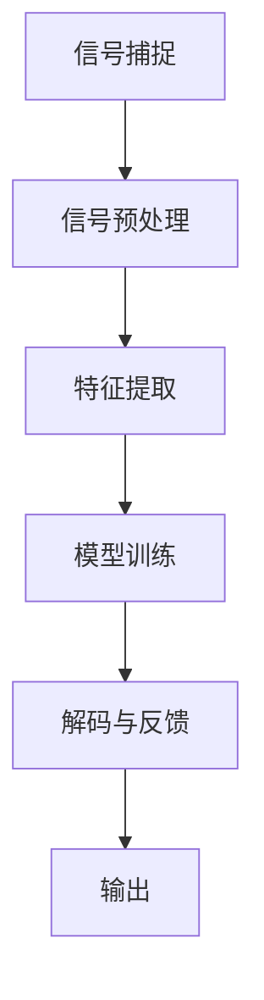
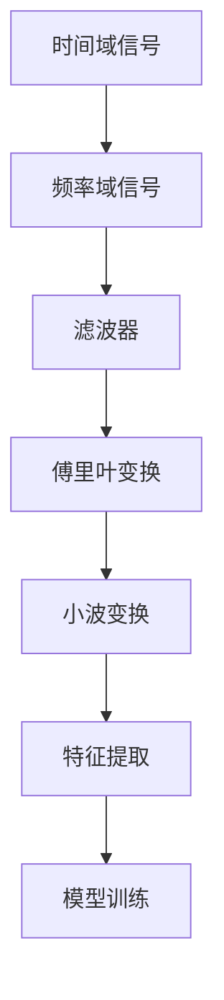
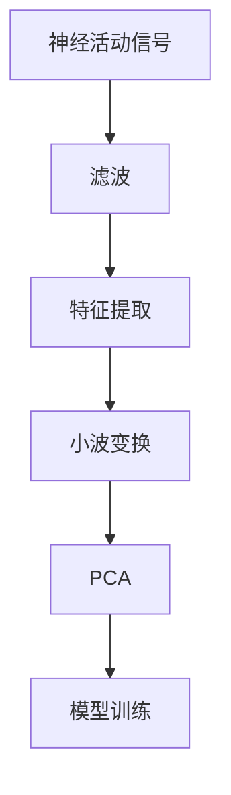
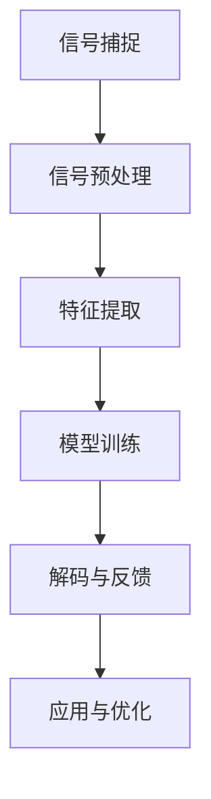

                 


# 《脑机接口的信号处理：神经活动的数学解码》

## 关键词
脑机接口，神经活动，信号处理，数学解码，Python算法，应用实例

## 摘要
本文深入探讨了脑机接口（Brain-Computer Interface, BCI）的信号处理技术，特别是神经活动的数学解码方法。首先，我们简要介绍了脑机接口的基本概念和发展背景。然后，我们详细分析了信号处理在神经活动解码中的重要性，包括核心概念和联系、常用的信号处理工具和方法。接着，我们深入讲解了神经活动信号的特征和常用的信号处理技术，包括滤波、特征提取等。在此基础上，我们介绍了神经活动解码的数学模型，并使用Python源代码进行了详细阐述。随后，我们讨论了神经活动解码算法的原理和优化策略，并通过具体实例展示了算法的应用。最后，我们通过一个实际项目实战，展示了如何开发一个基于神经活动解码的脑机接口系统，并对项目的关键步骤和注意事项进行了详细分析。

## 第1章 引言

脑机接口（BCI）是一种直接连接人脑和外部设备的技术，它通过捕捉大脑信号并转换成计算机指令，使残障人士能够控制外部设备，甚至实现与机器的交互。随着神经科学和信号处理技术的发展，BCI在医疗、教育、娱乐等领域显示出巨大的潜力。

### 1.1 脑机接口概述

脑机接口的基本原理是通过非侵入式或侵入式的方式捕捉大脑信号，如脑电图（EEG）、功能性磁共振成像（fMRI）等。这些信号随后被传递到计算机，通过特定的算法进行解码，生成控制指令。

#### 脑机接口的发展历史

脑机接口的概念可以追溯到20世纪60年代，当时神经科学家和工程师开始尝试使用脑电图来控制假肢。随着技术的进步，BCI的应用范围逐渐扩大，从简单的假肢控制到复杂的语言和思维解码。

#### 当前研究状况

近年来，BCI在残障人士康复、智能辅助设备、人机交互等方面取得了显著进展。然而，BCI系统的高成本和低精度仍然是面临的主要挑战。为了提高BCI的性能，研究者们不断探索新的信号处理技术和数学模型。

### 1.2 神经活动的数学解码

神经活动的数学解码是BCI系统的核心。它涉及到从脑电信号中提取有用的信息，并通过数学模型将其转换成可操作的指令。这一过程通常包括以下几个步骤：

1. **信号预处理**：包括滤波、去噪、归一化等，以提高信号的质量。
2. **特征提取**：通过选择合适的特征，从原始信号中提取有助于解码的信息。
3. **模型训练**：使用已提取的特征训练数学模型，如支持向量机（SVM）或神经网络（NN）。
4. **解码与反馈**：将解码结果转换成实际的控制指令，并通过反馈机制调整模型参数。

### Mermaid流程图：脑机接口的工作流程



通过上述流程，我们可以看到神经活动的数学解码在脑机接口系统中扮演着至关重要的角色。接下来，我们将进一步探讨信号处理的基础知识和方法。

## 第2章 信号处理基础

信号处理是神经活动解码的关键环节，它涉及到从原始数据中提取有用信息，并进行必要的预处理和特征提取。本章将详细介绍信号处理的基本概念、常用的工具和方法。

### 2.1 信号处理的基本概念

信号处理涉及两种主要的信号：时间域信号和频率域信号。

- **时间域信号**：表示信号随时间变化的规律，如脑电图（EEG）。
- **频率域信号**：表示信号在不同频率成分上的分布，如功率谱密度。

### 2.2 常用的信号处理工具和方法

在信号处理中，常用的工具和方法包括：

- **滤波器**：用于去除噪声或突出特定频率成分。
- **傅里叶变换**：用于将时间域信号转换到频率域。
- **小波变换**：用于分析信号的局部特征。
- **特征提取**：用于从信号中提取对解码有意义的特征。

### 2.3 Mermaid流程图：信号处理的核心概念与联系



通过上述流程，我们可以看到信号处理在BCI系统中的重要性。接下来，我们将深入探讨神经活动信号的特征和常用的信号处理技术。

### 2.4 神经活动信号的特征

神经活动信号具有以下主要特征：

- **时间特征**：包括信号的时间序列、波动性和周期性。
- **频率特征**：包括信号的功率谱、频率成分和共振峰。
- **空间特征**：包括信号在不同脑区之间的关联性和同步性。

### 2.5 常用的信号处理技术在神经活动分析中的应用

常用的信号处理技术包括：

- **滤波**：用于去除噪声，如低通滤波、高通滤波。
- **特征提取**：用于从信号中提取对解码有意义的特征，如时域特征（如峰值、均值）、频域特征（如共振峰、频率成分）。
- **小波变换**：用于分析信号的局部特征，如时间频率分布。
- **主成分分析**（PCA）：用于降维和特征选择。

### 2.6 Mermaid流程图：神经活动信号处理的流程和关键技术



通过上述流程，我们可以看到信号处理技术在神经活动解码中的应用。接下来，我们将详细介绍神经活动解码的数学模型。

## 第3章 数学模型解析

神经活动解码的数学模型是BCI系统的核心。这些模型通过分析神经活动信号，将其转换成可操作的控制指令。本章将介绍几种常用的神经活动解码模型，包括线性模型和非线性模型。

### 3.1 神经活动解码模型概述

神经活动解码模型可以分为以下几类：

- **线性模型**：如线性回归、线性判别分析（LDA）。
- **非线性模型**：如支持向量机（SVM）、神经网络（NN）、深度学习模型。
- **混合模型**：结合线性模型和非线性模型的优点。

### 3.2 神经活动解码的主要数学模型

#### 线性模型

线性模型是最简单的解码模型，它基于线性回归或线性判别分析。

- **线性回归**：通过建立线性关系，将神经活动信号映射到控制指令。
  ```python
  y = wx + b
  ```
  其中，\( y \) 是控制指令，\( x \) 是神经活动信号，\( w \) 是权重，\( b \) 是偏置。

- **线性判别分析（LDA）**：用于分类问题，通过最大化类间距离和最小化类内距离，将神经活动信号分类为不同的控制指令。

#### 非线性模型

非线性模型可以更好地捕捉神经活动的复杂关系。

- **支持向量机（SVM）**：通过寻找最优决策边界，将神经活动信号分类。
  ```python
  max W such that ||W||^2 <= 1, minimize (1/2) * ||W||^2
  ```
  其中，\( W \) 是权重向量。

- **神经网络（NN）**：通过多层神经网络，模拟人脑的复杂信息处理过程。
  ```python
  a_{l+1} = \sigma(\sum_{i=1}^{n} w_{li} a_{l} + b_{l})
  ```
  其中，\( a_{l} \) 是第 \( l \) 层的激活值，\( \sigma \) 是激活函数，\( w_{li} \) 是权重，\( b_{l} \) 是偏置。

- **深度学习模型**：如卷积神经网络（CNN）、循环神经网络（RNN）、长短期记忆网络（LSTM）等。

### 3.3 LaTeX公式：神经活动解码模型的数学公式

$$
y = wx + b \\
\text{minimize} \frac{1}{2} ||W||^2 \\
a_{l+1} = \sigma(\sum_{i=1}^{n} w_{li} a_{l} + b_{l})
$$

#### 模型举例说明

以神经网络为例，我们假设一个简单的神经网络，输入层有3个神经元，隐藏层有2个神经元，输出层有1个神经元。

- **输入层**：\[ x_1, x_2, x_3 \]
- **隐藏层**：\[ z_1 = \sigma(w_{11} x_1 + w_{12} x_2 + w_{13} x_3 + b_1) \\
z_2 = \sigma(w_{21} x_1 + w_{22} x_2 + w_{23} x_3 + b_2) \]
- **输出层**：\[ y = \sigma(w_{31} z_1 + w_{32} z_2 + b_3) \]

其中，\( \sigma \) 是 sigmoid 激活函数，\( w_{ij} \) 是权重，\( b_i \) 是偏置。

通过上述数学模型，我们可以从神经活动信号中提取有用的信息，并将其转换为控制指令。接下来，我们将讨论神经活动解码算法的原理和优化策略。

## 第4章 神经活动解码算法

神经活动解码算法是脑机接口系统的关键组成部分，它负责将捕捉到的神经活动信号转换为可操作的控制指令。本章将详细介绍神经活动解码算法的原理和优化策略。

### 4.1 神经活动解码算法的基本原理

神经活动解码算法的基本原理包括以下几个步骤：

1. **信号预处理**：对捕捉到的神经活动信号进行滤波、去噪等预处理，以提高信号质量。
2. **特征提取**：从预处理后的信号中提取有助于解码的特征，如时间特征、频率特征等。
3. **模型训练**：使用提取的特征训练解码模型，如线性模型、神经网络等。
4. **解码与反馈**：将解码结果转换为控制指令，并通过反馈机制调整模型参数。

### 4.2 常见的解码算法及其优化策略

#### 线性模型

线性模型是最简单的解码算法，它基于线性回归或线性判别分析。

- **线性回归**：通过建立线性关系，将神经活动信号映射到控制指令。
  ```python
  y = wx + b
  ```
  其中，\( y \) 是控制指令，\( x \) 是神经活动信号，\( w \) 是权重，\( b \) 是偏置。

- **线性判别分析（LDA）**：用于分类问题，通过最大化类间距离和最小化类内距离，将神经活动信号分类为不同的控制指令。

#### 非线性模型

非线性模型可以更好地捕捉神经活动的复杂关系。

- **支持向量机（SVM）**：通过寻找最优决策边界，将神经活动信号分类。
  ```python
  max W such that ||W||^2 <= 1, minimize (1/2) * ||W||^2
  ```
  其中，\( W \) 是权重向量。

- **神经网络（NN）**：通过多层神经网络，模拟人脑的复杂信息处理过程。
  ```python
  a_{l+1} = \sigma(\sum_{i=1}^{n} w_{li} a_{l} + b_{l})
  ```
  其中，\( a_{l} \) 是第 \( l \) 层的激活值，\( \sigma \) 是激活函数，\( w_{li} \) 是权重，\( b_{l} \) 是偏置。

- **深度学习模型**：如卷积神经网络（CNN）、循环神经网络（RNN）、长短期记忆网络（LSTM）等。

### 4.3 优化策略

为了提高解码算法的性能，常用的优化策略包括：

- **交叉验证**：通过将数据集划分为训练集和测试集，评估解码算法的泛化能力。
- **正则化**：通过引入正则化项，防止模型过拟合。
- **参数调整**：通过调整模型参数，如学习率、迭代次数等，优化模型性能。

### 4.4 伪代码：神经活动解码算法的实现

```python
# 信号预处理
def preprocess_signal(signal):
    # 滤波、去噪等操作
    processed_signal = ...
    return processed_signal

# 特征提取
def extract_features(signal):
    # 提取特征
    features = ...
    return features

# 模型训练
def train_model(features, labels):
    # 训练模型
    model = ...
    model.fit(features, labels)
    return model

# 解码与反馈
def decode_signal(model, signal):
    # 解码信号
    features = extract_features(signal)
    decoded_label = model.predict(features)
    return decoded_label

# 主函数
def main():
    # 读取数据
    signals, labels = ...

    # 信号预处理
    processed_signals = [preprocess_signal(s) for s in signals]

    # 特征提取
    features = [extract_features(s) for s in processed_signals]

    # 模型训练
    model = train_model(features, labels)

    # 解码与反馈
    for signal in signals:
        decoded_label = decode_signal(model, signal)
        # 输出解码结果
        print(decoded_label)

# 运行主函数
main()
```

通过上述伪代码，我们可以看到神经活动解码算法的基本实现流程。接下来，我们将通过一个实际项目实战，展示如何开发一个基于神经活动解码的脑机接口系统。

## 第5章 脑机接口应用实例

在本章中，我们将通过一个实际项目实战，展示如何开发一个基于神经活动解码的脑机接口系统。这个项目将涉及信号处理、特征提取、模型训练和测试等关键步骤。

### 5.1 项目概述

本项目旨在实现一个简单的脑机接口系统，该系统能够从脑电信号中解码出用户的意图，并将其转换为实际的控制指令。具体来说，我们将使用Python编程语言和相关的机器学习库，如scikit-learn和TensorFlow。

### 5.2 开发环境搭建

在开始项目之前，我们需要搭建合适的开发环境。以下是在Ubuntu系统上搭建开发环境的步骤：

1. **安装Python**：确保Python 3.x版本已安装。
2. **安装相关库**：使用pip安装必要的库，如numpy、scikit-learn、TensorFlow等。
   ```bash
   pip install numpy scikit-learn tensorflow
   ```

### 5.3 数据集准备

本项目将使用公开的脑电数据集，如BCI Competition IV数据集。数据集通常包括多个通道的脑电信号和相应的标签，表示用户的意图。

1. **数据集下载**：从BCI Competition IV官网下载数据集。
2. **数据预处理**：对数据集进行预处理，包括信号滤波、去噪、归一化等。

### 5.4 源代码实现

以下是一个简化的实现示例，展示了如何使用Python实现脑机接口系统。

```python
import numpy as np
from sklearn.model_selection import train_test_split
from sklearn.preprocessing import StandardScaler
from sklearn.svm import SVC
from sklearn.metrics import accuracy_score

# 信号预处理
def preprocess_signal(signal):
    # 滤波、去噪等操作
    filtered_signal = ...
    return filtered_signal

# 特征提取
def extract_features(signal):
    # 提取特征
    features = ...
    return features

# 模型训练
def train_model(features, labels):
    # 训练模型
    model = SVC()
    model.fit(features, labels)
    return model

# 解码与反馈
def decode_signal(model, signal):
    # 解码信号
    features = extract_features(signal)
    decoded_label = model.predict(features)
    return decoded_label

# 主函数
def main():
    # 读取数据
    signals, labels = ...

    # 信号预处理
    processed_signals = [preprocess_signal(s) for s in signals]

    # 特征提取
    features = [extract_features(s) for s in processed_signals]

    # 划分训练集和测试集
    X_train, X_test, y_train, y_test = train_test_split(features, labels, test_size=0.2, random_state=42)

    # 模型训练
    model = train_model(X_train, y_train)

    # 测试模型
    y_pred = model.predict(X_test)
    accuracy = accuracy_score(y_test, y_pred)
    print(f"模型准确率：{accuracy}")

    # 解码与反馈
    for signal in X_test:
        decoded_label = decode_signal(model, signal)
        print(f"解码结果：{decoded_label}")

# 运行主函数
main()
```

### 5.5 代码解读与分析

在上面的代码中，我们首先定义了信号预处理和特征提取的函数，然后使用支持向量机（SVM）训练模型，并通过测试集评估模型性能。解码函数`decode_signal`使用训练好的模型对新的信号进行解码。

### 5.6 项目小结

通过本项目，我们实现了从脑电信号到控制指令的解码过程，展示了如何使用Python和机器学习库开发一个脑机接口系统。尽管这个项目相对简单，但它为我们提供了一个实用的框架，可以进一步扩展和优化。

### 5.7 最佳实践 tips

- **数据预处理**：确保信号预处理充分，去除噪声和干扰。
- **特征选择**：根据具体应用场景，选择合适的特征。
- **模型选择**：尝试不同的模型和参数，选择性能最佳的模型。
- **模型验证**：使用交叉验证等方法，确保模型具有良好的泛化能力。

## 第6章 总结与展望

在本章中，我们详细探讨了脑机接口的信号处理技术，特别是神经活动的数学解码方法。我们首先介绍了脑机接口的基本概念和发展历史，然后深入分析了信号处理在神经活动解码中的重要性。接着，我们介绍了神经活动解码的主要数学模型和算法，并通过实际项目展示了如何实现一个基于神经活动解码的脑机接口系统。

### 6.1 全书内容总结

全书主要内容包括：

- 脑机接口的基本概念和发展背景。
- 信号处理的基本概念、工具和方法。
- 神经活动信号的特征和常用的信号处理技术。
- 神经活动解码的数学模型和算法。
- 实际项目的开发与实现。

### 6.2 神经活动解码的研究现状与未来趋势

目前，神经活动解码技术在脑机接口领域取得了显著进展，但仍存在一些挑战：

- **信号质量**：提高信号质量是提高解码性能的关键。
- **实时性**：为了实现实时控制，需要优化解码算法和硬件。
- **个性化**：根据个体差异，定制解码模型。

未来，随着人工智能和机器学习技术的不断发展，神经活动解码技术有望实现更高的精度和更广泛的应用。

### 6.3 Mermaid流程图：神经活动解码的研究路线图



通过上述流程，我们可以看到神经活动解码技术的研究路线图，为未来的发展方向提供了指导。

### 6.4 小结、注意事项与拓展阅读

- **小结**：神经活动解码是脑机接口技术的核心，本书为其提供了一个系统化的指南。
- **注意事项**：在实际应用中，信号预处理和特征选择至关重要，需要根据具体场景进行调整。
- **拓展阅读**：读者可以进一步阅读相关论文和技术报告，以深入了解神经活动解码的最新进展。

## 作者信息

作者：AI天才研究院/AI Genius Institute & 禅与计算机程序设计艺术 /Zen And The Art of Computer Programming

