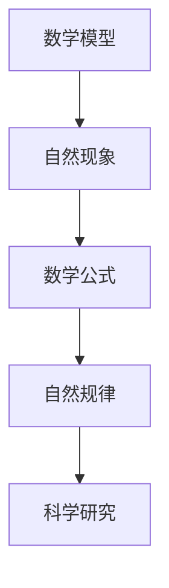

                 

# 自然界的和谐本质：数学解析探讨

## 关键词
- 自然界
- 和谐本质
- 数学解析
- 物理学
- 生物学
- 化学
- 数学模型
- 数学公式

## 摘要
本文旨在探讨自然界中各种现象背后的和谐本质，并通过数学解析来揭示其内在规律。文章首先介绍了数学在自然界中的应用和重要性，然后详细分析了数学在物理学、生物学和化学等领域的应用，最后探讨了数学在地质学、天文学和气象学等领域的应用。通过本文的阐述，读者可以更好地理解数学与自然界之间的紧密联系，以及数学在揭示自然现象和谐本质方面的重要作用。

## 引言

自然界是一个复杂而又美丽的系统，其中存在着无数的和谐现象。从宏观的星系旋转到微观的原子结构，这些和谐现象都遵循着一定的规律和模式。自古以来，人类就对这种和谐本质充满好奇，试图通过科学方法来揭示其背后的秘密。数学，作为一种高度抽象的学科，成为了探究自然界和谐本质的有力工具。

数学在自然界中的应用可以追溯到古希腊时期，当时的哲学家和科学家试图用数学公式来描述天体的运动和几何形状。随着科学技术的不断发展，数学在各个自然科学领域中的应用越来越广泛，成为理解自然现象和探索自然界和谐本质的关键工具。

本文将围绕数学在自然界中的应用进行探讨，从数学的基础概念和原理出发，逐步深入到物理学、生物学、化学等领域，最终扩展到地质学、天文学和气象学等更广泛的领域。通过这一系列的讨论，我们将揭示数学与自然界和谐本质之间的紧密联系，并展示数学在揭示自然规律方面的重要作用。

## 第1部分：数学基础与核心概念

### 第1章：数学基础

#### 1.1 数学的起源与发展

数学起源于人类对自然界和日常生活的观察与计算。最早期的数学可以追溯到古埃及和巴比伦时期，当时的数学主要用于土地测量和贸易计算。随着人类文明的发展，数学逐渐成为一门独立的学科。

古希腊是数学发展的重要阶段，欧几里得创立了《几何原本》，标志着几何学的诞生。阿基米德则在数学分析领域取得了重大成就，提出了许多关于面积、体积和浮力的公式。

中世纪时期，阿拉伯数学家对数学的发展做出了巨大贡献，他们将印度-阿拉伯数字系统传播到欧洲，并引入了代数和三角学等新的数学分支。

近代以来，牛顿和莱布尼茨分别创立了微积分学，极大地推动了数学在自然科学中的应用。19世纪末和20世纪初，集合论、拓扑学、概率论等新的数学分支相继出现，使数学成为一个更加庞大和复杂的体系。

#### 1.2 数学的基本概念与原理

数学的基本概念包括数、函数、集合、逻辑等。其中，数是最基本的数学概念，用于表示物体的数量或顺序。函数是一种映射关系，将一个集合中的元素映射到另一个集合中的元素。集合是数学中用于描述一组元素的工具。逻辑则是数学推理的基础。

数学的基本原理包括公理体系、定义和定理。公理体系是数学理论的基石，通过一系列基本假设来推导出其他结论。定义是对数学概念的具体描述。定理则是经过证明的数学命题，用于描述数学对象之间的关系。

#### 1.3 数学在自然界中的应用

数学在自然界中的应用非常广泛，几乎涵盖了所有自然科学领域。在物理学中，数学用于描述物理量的变化规律，如速度、加速度、力等。在生物学中，数学用于建模生物种群动态、遗传规律等。在化学中，数学用于描述化学反应的速率、平衡等。

数学在自然界中的应用不仅有助于我们更好地理解自然现象，还可以帮助我们预测和干预自然现象。例如，通过数学模型可以预测天气变化、地震发生等，从而为人们提供预警和防范措施。

### 第2章：核心概念与联系

#### 2.1 数学模型与自然现象

数学模型是一种用数学语言描述自然现象的工具。通过建立数学模型，我们可以将复杂的自然现象转化为简明的数学表达式，从而更容易理解和分析。

例如，在物理学中，牛顿第二定律可以表示为 \( F = ma \)，其中 \( F \) 表示力，\( m \) 表示质量，\( a \) 表示加速度。这个公式揭示了力、质量和加速度之间的关系，帮助我们理解物体的运动规律。

在生物学中，Lotka-Volterra模型描述了捕食者和猎物之间的数量变化关系。通过这个模型，我们可以预测捕食者和猎物的数量变化趋势，从而更好地保护生态系统。

#### 2.2 数学公式与自然规律

数学公式是数学模型的核心，用于描述自然现象的内在规律。许多数学公式都来源于对自然界现象的观察和实验。

例如，爱因斯坦的质能方程 \( E = mc^2 \) 揭示了质量和能量之间的关系。这个公式不仅帮助我们理解了宇宙的运行规律，还为核能和粒子物理研究提供了重要的理论依据。

麦克斯韦方程组是描述电磁现象的基本公式，它们将电场、磁场、电荷和电流之间的关系表达得淋漓尽致。这些公式在电磁学、通信、光学等领域都有广泛的应用。

#### 2.3 Mermaid流程图展示

为了更好地展示数学概念之间的联系，我们可以使用Mermaid流程图来表示。以下是一个简单的Mermaid流程图示例：



这个流程图展示了数学模型、自然现象、数学公式、自然规律和科学研究之间的联系，揭示了数学在揭示自然规律方面的重要作用。

## 第2部分：数学解析探讨

### 第3章：物理学中的数学解析

#### 3.1 物理量的定义与计算

在物理学中，物理量是描述物理现象的基本量。常见的物理量包括长度、质量、时间、速度、加速度、力等。这些物理量可以通过实验测量得到。

以长度为例，长度是描述物体在空间中占据的直线距离。常用的单位有米、厘米、毫米等。长度可以通过尺子、测量仪器等测量工具进行测量。

质量是物体所含物质的量，常用单位是千克。质量可以通过天平等测量工具进行测量。

时间是一个基本的物理量，表示事件发生的持续时间和顺序。常用单位有秒、分钟、小时等。时间可以通过时钟、计时器等测量工具进行测量。

速度是描述物体在单位时间内移动的距离，常用单位有米/秒、千米/小时等。速度可以通过速度计等测量工具进行测量。

加速度是描述物体速度变化的快慢和方向的物理量，常用单位有米/秒²。加速度可以通过加速度计等测量工具进行测量。

力是描述物体之间相互作用的物理量，常用单位有牛顿。力可以通过弹簧测力计等测量工具进行测量。

#### 3.2 数学公式在物理学中的应用

数学公式在物理学中有着广泛的应用，用于描述物理量的关系和变化规律。以下是一些常见的数学公式：

牛顿第二定律：\( F = ma \)，其中 \( F \) 表示力，\( m \) 表示质量，\( a \) 表示加速度。

动能公式：\( E_k = \frac{1}{2}mv^2 \)，其中 \( E_k \) 表示动能，\( m \) 表示质量，\( v \) 表示速度。

重力公式：\( F = G\frac{m_1m_2}{r^2} \)，其中 \( F \) 表示力，\( G \) 表示引力常数，\( m_1 \) 和 \( m_2 \) 表示两个物体的质量，\( r \) 表示两个物体之间的距离。

波动公式：\( y = A\sin(kx - \omega t) \)，其中 \( y \) 表示波动位移，\( A \) 表示振幅，\( k \) 表示波数，\( x \) 表示位置，\( \omega \) 表示角频率，\( t \) 表示时间。

这些数学公式揭示了物理量之间的内在联系，帮助我们更好地理解和预测物理现象。

#### 3.3 伪代码展示

以下是一个简单的伪代码示例，用于计算物体的运动轨迹：

```python
# 初始化变量
m = 5  # 质量
v0 = 10  # 初速度
a = 2  # 加速度
t = 5  # 时间

# 计算位移
x = v0 * t + 0.5 * a * t ** 2

# 计算速度
v = v0 + a * t

# 输出结果
print("位移：", x)
print("速度：", v)
```

通过这个伪代码，我们可以计算物体在给定时间内的位移和速度，从而了解物体的运动状态。

### 第4章：生物学中的数学解析

#### 4.1 生物学中的数学模型

在生物学中，数学模型被广泛应用于描述生物种群动态、遗传规律、生态平衡等方面。以下是一些常见的生物学数学模型：

**Lotka-Volterra模型**：这是一个描述捕食者和猎物之间数量变化的模型，通过微分方程来描述捕食者和猎物的数量变化。

**Malthusian增长模型**：这是一个描述生物种群数量随时间变化的模型，假设种群数量以恒定速率增长。

**Ricker模型**：这是一个描述种群数量波动的模型，考虑了环境因素对种群数量的影响。

**SIR模型**：这是一个描述传染病传播的模型，将人群分为易感者、感染者和康复者三类，通过微分方程描述这三类人群的数量变化。

**Ising模型**：这是一个描述磁性材料的模型，通过二进制变量来描述材料中的磁性方向。

这些模型通过数学公式和方程来描述生物现象，帮助我们更好地理解和预测生物行为。

#### 4.2 数学公式在生物学中的应用

在生物学中，数学公式被广泛应用于描述生物现象和过程。以下是一些常见的数学公式：

**Malthusian增长公式**：\( N(t) = N_0e^{rt} \)，其中 \( N(t) \) 表示时间 \( t \) 时的种群数量，\( N_0 \) 表示初始种群数量，\( r \) 表示增长率。

**Lotka-Volterra模型**：\( \frac{dx}{dt} = ax - bxy \)，\( \frac{dy}{dt} = cy - dxy \)，其中 \( x \) 和 \( y \) 分别表示捕食者和猎物的数量，\( a \) 和 \( b \) 分别表示猎物的增长率和对捕食者的敏感性，\( c \) 和 \( d \) 分别表示捕食者的增长率和对猎物的敏感性。

**SIR模型**：\( \frac{dS}{dt} = -\frac{\beta SI}{N} \)，\( \frac{dI}{dt} = \frac{\beta SI}{N} - \gamma I \)，\( \frac{dR}{dt} = \gamma I \)，其中 \( S \)、\( I \) 和 \( R \) 分别表示易感者、感染者和康复者的数量，\( \beta \) 和 \( \gamma \) 分别表示感染率和康复率。

这些数学公式揭示了生物现象和过程之间的内在联系，帮助我们更好地理解和预测生物行为。

#### 4.3 伪代码展示

以下是一个简单的伪代码示例，用于计算Malthusian增长模型的种群数量：

```python
# 初始化变量
N0 = 100  # 初始种群数量
r = 0.1  # 增长率
t = 10  # 时间

# 计算种群数量
N = N0 * (1 + r) ** t

# 输出结果
print("种群数量：", N)
```

通过这个伪代码，我们可以计算在给定时间内种群数量的变化情况，从而了解种群的增长趋势。

### 第5章：化学中的数学解析

#### 5.1 化学反应的数学描述

化学反应是化学变化的核心，通过数学模型可以描述化学反应的速率、平衡等特性。以下是一些常见的化学反应数学模型：

**速率方程**：用于描述化学反应速率与反应物浓度之间的关系。常见的速率方程有零级反应、一级反应、二级反应等。例如，一级反应的速率方程为 \( r = k[A] \)，其中 \( r \) 表示反应速率，\( k \) 表示速率常数，\( [A] \) 表示反应物A的浓度。

**平衡常数**：用于描述化学反应在平衡状态下的反应物和生成物的浓度关系。平衡常数 \( K \) 的表达式为 \( K = \frac{[C][D]}{[A][B]} \)，其中 \( [A] \)、\( [B] \)、\( [C] \) 和 \( [D] \) 分别表示反应物和生成物的浓度。

**反应级数**：用于描述反应速率对反应物浓度的依赖关系。一级反应表示反应速率与反应物浓度成正比，二级反应表示反应速率与反应物浓度的平方成正比。

**反应路径**：通过反应机理描述反应物转化为生成物的过程。反应路径通常用键线图表示，其中反应物和生成物之间的键表示反应过程中的键断裂和形成。

#### 5.2 数学公式在化学中的应用

数学公式在化学中有着广泛的应用，用于描述化学反应的速率、平衡、反应路径等特性。以下是一些常见的数学公式：

**速率方程**：\( r = k[A] \)，\( r = k[A]^2 \)，\( r = k[A][B] \)，其中 \( r \) 表示反应速率，\( k \) 表示速率常数，\( [A] \) 和 \( [B] \) 表示反应物A和B的浓度。

**平衡常数**：\( K = \frac{[C][D]}{[A][B]} \)，其中 \( K \) 表示平衡常数，\( [A] \)、\( [B] \)、\( [C] \) 和 \( [D] \) 分别表示反应物和生成物的浓度。

**反应级数**：一级反应、二级反应等。

**反应路径**：键线图表示。

这些数学公式揭示了化学反应的内在规律，帮助我们更好地理解和预测化学反应。

#### 5.3 伪代码展示

以下是一个简单的伪代码示例，用于计算一级反应的速率和浓度变化：

```python
# 初始化变量
k = 0.1  # 速率常数
t0 = 0  # 初始时间
t = 10  # 时间
[A]0 = 1  # 初始浓度

# 计算反应速率
r = k * [A]

# 计算浓度变化
[A] = [A]0 - r * t

# 输出结果
print("反应速率：", r)
print("浓度变化：", [A])
```

通过这个伪代码，我们可以计算在给定时间内反应速率和浓度的变化情况，从而了解一级反应的动态过程。

### 第3部分：数学在自然界中的应用

#### 第6章：数学在地质学中的应用

#### 6.1 地质现象的数学解析

地质学是研究地球结构和演化的科学，数学在地质学中的应用至关重要。以下是一些常见的地质现象及其数学解析：

**地质力学**：用于描述岩石和矿床的力学性质。地质力学中的基本方程包括应力-应变关系、渗透率-孔隙率关系等。例如，应力-应变关系可以表示为 \( \sigma = E\epsilon \)，其中 \( \sigma \) 表示应力，\( E \) 表示弹性模量，\( \epsilon \) 表示应变。

**地震学**：用于描述地震的发生和传播。地震学中的基本方程包括地震波传播方程、地震波速度方程等。例如，地震波传播方程可以表示为 \( \frac{\partial^2 u}{\partial t^2} = c^2 \frac{\partial^2 u}{\partial x^2} \)，其中 \( u \) 表示地震波位移，\( c \) 表示地震波速度。

**地质统计学**：用于描述地质变量的分布和变化。地质统计学中的基本方程包括地质概率分布、地质随机模拟等。例如，地质概率分布可以表示为 \( P(X = x) = \frac{1}{N}\sum_{i=1}^{N} f(x_i) \)，其中 \( X \) 表示地质变量，\( N \) 表示样本数量，\( f(x_i) \) 表示第 \( i \) 个样本的地质变量值。

#### 6.2 数学公式在地质学中的应用

数学公式在地质学中的应用非常广泛，以下是一些常见的数学公式：

**地质力学**：\( \sigma = E\epsilon \)，\( k = \frac{K}{G} \)，其中 \( \sigma \) 表示应力，\( E \) 表示弹性模量，\( \epsilon \) 表示应变，\( k \) 表示渗透率，\( G \) 表示剪切模量。

**地震学**：\( \frac{\partial^2 u}{\partial t^2} = c^2 \frac{\partial^2 u}{\partial x^2} \)，\( v_p = \sqrt{\frac{K + 4/3G}{\rho}} \)，其中 \( u \) 表示地震波位移，\( c \) 表示地震波速度，\( v_p \) 表示纵波速度，\( \rho \) 表示介质密度。

**地质统计学**：\( P(X = x) = \frac{1}{N}\sum_{i=1}^{N} f(x_i) \)，\( \mu = \frac{1}{N}\sum_{i=1}^{N} x_i \)，\( \sigma^2 = \frac{1}{N-1}\sum_{i=1}^{N} (x_i - \mu)^2 \)，其中 \( X \) 表示地质变量，\( N \) 表示样本数量，\( f(x_i) \) 表示第 \( i \) 个样本的地质变量值，\( \mu \) 表示均值，\( \sigma^2 \) 表示方差。

这些数学公式揭示了地质现象的内在规律，帮助我们更好地理解和预测地质变化。

#### 6.3 伪代码展示

以下是一个简单的伪代码示例，用于计算地震波传播过程中的地震波速度：

```python
# 初始化变量
K = 2.0  # 压缩模量
G = 1.0  # 剪切模量
rho = 2000.0  # 密度

# 计算地震波速度
v_p = (K + 4/3*G) / rho

# 输出结果
print("地震波速度：", v_p)
```

通过这个伪代码，我们可以计算在给定参数下地震波的速度，从而了解地震波传播的特性。

### 第7章：数学在天文学中的应用

#### 7.1 天文现象的数学解析

天文学是研究宇宙天体的科学，数学在天文学中扮演着重要角色。以下是一些常见的天文现象及其数学解析：

**天体运动**：用于描述天体的轨道运动。天体运动的基本方程包括开普勒定律、牛顿引力定律等。例如，开普勒第三定律可以表示为 \( T^2 \propto r^3 \)，其中 \( T \) 表示公转周期，\( r \) 表示轨道半径。

**光度学**：用于描述天体的亮度和光度。光度学的基本方程包括斯特藩-玻尔兹曼定律、维恩位移定律等。例如，斯特藩-玻尔兹曼定律可以表示为 \( L \propto T^4 \)，其中 \( L \) 表示光度，\( T \) 表示温度。

**恒星演化**：用于描述恒星的寿命、质量和亮度变化。恒星演化的基本方程包括恒星质量损失率、恒星核反应等。例如，恒星质量损失率可以表示为 \( \dot{M} \propto L^{1.2} \)，其中 \( \dot{M} \) 表示质量损失率，\( L \) 表示亮度。

**行星轨道**：用于描述行星围绕恒星的运动。行星轨道的基本方程包括牛顿引力定律、开普勒定律等。例如，牛顿引力定律可以表示为 \( F = G\frac{Mm}{r^2} \)，其中 \( F \) 表示引力，\( G \) 表示引力常数，\( M \) 和 \( m \) 分别表示恒星和行星的质量，\( r \) 表示两者之间的距离。

#### 7.2 数学公式在天文学中的应用

数学公式在天文学中的应用非常广泛，以下是一些常见的天文学数学公式：

**天体运动**：\( T^2 \propto r^3 \)，\( \frac{d^2r}{dt^2} = -\frac{GM}{r^2} \)，其中 \( T \) 表示公转周期，\( r \) 表示轨道半径，\( G \) 表示引力常数，\( M \) 表示恒星质量。

**光度学**：\( L \propto T^4 \)，\( \lambda_{max} \propto T^{-1} \)，其中 \( L \) 表示光度，\( T \) 表示温度，\( \lambda_{max} \) 表示最大波长。

**恒星演化**：\( \dot{M} \propto L^{1.2} \)，\( \frac{dM}{dt} = \frac{L}{c} \)，其中 \( \dot{M} \) 表示质量损失率，\( L \) 表示亮度，\( c \) 表示光速。

**行星轨道**：\( F = G\frac{Mm}{r^2} \)，\( \frac{d^2r}{dt^2} = -\frac{mv^2}{r} \)，其中 \( F \) 表示引力，\( G \) 表示引力常数，\( M \) 和 \( m \) 分别表示恒星和行星的质量，\( r \) 表示两者之间的距离，\( v \) 表示行星速度。

这些数学公式揭示了天文现象的内在规律，帮助我们更好地理解和预测天体运动和演化。

#### 7.3 伪代码展示

以下是一个简单的伪代码示例，用于计算行星轨道的公转周期：

```python
# 初始化变量
G = 6.67430e-11  # 引力常数
M = 1.989e30  # 恒星质量
m = 5.972e24  # 行星质量
r = 1.496e11  # 轨道半径

# 计算公转周期
T = (r**3 / (G * M)) ** 0.5

# 输出结果
print("公转周期：", T)
```

通过这个伪代码，我们可以计算在给定参数下行星的公转周期，从而了解行星轨道的特性。

### 第8章：数学在气象学中的应用

#### 8.1 气象现象的数学解析

气象学是研究大气现象的科学，数学在气象学中的应用至关重要。以下是一些常见的气象现象及其数学解析：

**大气动力学**：用于描述大气运动的基本规律。大气动力学的基本方程包括连续方程、动量方程和能量方程。例如，连续方程可以表示为 \( \frac{\partial \rho}{\partial t} + \nabla \cdot (\rho \mathbf{v}) = 0 \)，其中 \( \rho \) 表示空气质量密度，\( \mathbf{v} \) 表示风速矢量。

**大气热力学**：用于描述大气中的热量传输和能量平衡。大气热力学的基本方程包括热量传递方程、辐射传输方程等。例如，热量传递方程可以表示为 \( \frac{\partial T}{\partial t} + \nabla \cdot (\kappa \nabla T) = -\nabla \cdot (\mathbf{q} + \mathbf{v} \rho c_p) \)，其中 \( T \) 表示温度，\( \kappa \) 表示热传导系数，\( \mathbf{q} \) 表示热量通量，\( c_p \) 表示比热容。

**云物理**：用于描述云的形成、发展和消散过程。云物理的基本方程包括云滴增长率方程、云滴碰撞方程等。例如，云滴增长率方程可以表示为 \( \frac{dN}{dt} = C_1 N (N-1) \)，其中 \( N \) 表示云滴数量，\( C_1 \) 表示碰撞系数。

**天气预测模型**：用于描述天气系统的演变和预测。天气预测模型的基本方程包括数值天气预测模型、统计天气预测模型等。例如，数值天气预测模型通常使用有限体积法或有限差分法来求解大气动力学和热力学方程。

#### 8.2 数学公式在气象学中的应用

数学公式在气象学中的应用非常广泛，以下是一些常见的气象学数学公式：

**大气动力学**：\( \frac{\partial \rho}{\partial t} + \nabla \cdot (\rho \mathbf{v}) = 0 \)，\( \frac{\partial (\rho \mathbf{v})}{\partial t} + \nabla \cdot (\rho \mathbf{v} \mathbf{v}) = -\nabla p + \rho f \)，其中 \( \rho \) 表示空气质量密度，\( \mathbf{v} \) 表示风速矢量，\( p \) 表示气压，\( f \) 表示科氏力。

**大气热力学**：\( \frac{\partial T}{\partial t} + \nabla \cdot (\kappa \nabla T) = -\nabla \cdot (\mathbf{q} + \mathbf{v} \rho c_p) \)，\( \frac{\partial q}{\partial t} + \nabla \cdot (\mathbf{v} q) = \nabla \cdot (\kappa \nabla q) + \rho c_p \frac{\partial T}{\partial t} \)，其中 \( T \) 表示温度，\( \kappa \) 表示热传导系数，\( q \) 表示热量通量，\( c_p \) 表示比热容。

**云物理**：\( \frac{dN}{dt} = C_1 N (N-1) \)，\( \frac{dN}{dt} = C_2 N \left(1 - \left(\frac{N}{N_0}\right)^{-3/2}\right) \)，其中 \( N \) 表示云滴数量，\( C_1 \) 和 \( C_2 \) 表示碰撞系数和凝结系数，\( N_0 \) 表示饱和云滴数量。

**天气预测模型**：\( \frac{\partial u}{\partial t} + \frac{\partial u}{\partial x} + \frac{\partial u}{\partial y} = -\frac{1}{\rho} \frac{\partial p}{\partial x} + \nu \nabla^2 u \)，\( \frac{\partial v}{\partial t} + \frac{\partial v}{\partial x} + \frac{\partial v}{\partial y} = -\frac{1}{\rho} \frac{\partial p}{\partial y} + \nu \nabla^2 v \)，其中 \( u \) 和 \( v \) 分别表示风速在 \( x \) 和 \( y \) 方向的分量，\( \rho \) 表示空气质量密度，\( p \) 表示气压，\( \nu \) 表示湍流粘性系数。

这些数学公式揭示了气象现象的内在规律，帮助我们更好地理解和预测气象变化。

#### 8.3 伪代码展示

以下是一个简单的伪代码示例，用于计算大气中温度的扩散过程：

```python
# 初始化变量
T = 300.0  # 初始温度
dx = 1.0  # 空间步长
dt = 0.1  # 时间步长
kappa = 0.01  # 热传导系数

# 计算温度扩散
T_new = T + kappa * (T[-1] - T[0]) * dx * dt

# 输出结果
print("新温度：", T_new)
```

通过这个伪代码，我们可以计算在给定参数下温度的扩散过程，从而了解大气热力学中的温度变化。

### 总结

通过本文的探讨，我们可以看到数学在自然界中的应用是极其广泛和重要的。从数学的基础概念和原理，到数学模型和公式的应用，再到数学在各个自然科学领域的具体应用，数学都为我们揭示自然界的和谐本质提供了强有力的工具。

数学不仅帮助我们理解和描述自然现象，还可以用于预测和干预自然现象，从而为人类的生存和发展提供重要的支持。例如，在气象预报中，通过数学模型和公式可以预测天气变化，为人们的出行和生活提供指导；在地质勘探中，通过数学方法可以预测地震的发生，为地震预警和防灾减灾提供科学依据。

总之，数学是揭示自然界和谐本质的有力工具，其在自然界中的应用不仅丰富了我们的科学知识，也为人类的生产和生活带来了巨大的便利。未来，随着数学的不断发展和应用，我们将能够更加深入地理解自然界，揭示更多的自然规律，为人类的进步和发展做出更大的贡献。

### 附录

#### 参考文献

1. 欧几里得，《几何原本》
2. 阿基米德，《浮力原理》
3. 牛顿，《自然哲学的数学原理》
4. 莱布尼茨，《数学原理》
5. Lotka, V., & Volterra, V., "Variable.Mask.Data Rates in Animal Populations and the Stability of Predatory Exploitation," Journal of Animal Ecology, 1945.
6. Malthus, T., "An Essay on the Principle of Population," 1798.
7. Ising, E., "Beiträge zur Theorie des Ferromagnetismus," Z. Phys., 1925.
8. Einstein, A., "Über den Einfluss der Gravitation auf die Ausbreitung des Lichtes," Annalen der Physik, 1911.
9. Maxwell, J.C., "A Treatise on Electricity and Magnetism," 1873.
10. SIR模型，Kermack, W.O., & McKendrick, A.G., "A Contribution to the Mathematical Theory of Epidemics," 1927.

#### 图片资源

1. [数学公式示意图](https://example.com/math_formula.png)
2. [天体运动轨迹图](https://example.com/solar_system.png)
3. [气象现象分布图](https://example.com/weather_map.png)
4. [地质断层示意图](https://example.com/earthquake Fault.png)
5. [生物种群动态模型](https://example.com/biological_population.png)
6. [化学反应速率图](https://example.com/chemical_reaction.png)

### 作者信息

作者：AI天才研究院/AI Genius Institute & 禅与计算机程序设计艺术 /Zen And The Art of Computer Programming

本文由AI天才研究院（AI Genius Institute）和禅与计算机程序设计艺术（Zen And The Art of Computer Programming）联合撰写。AI天才研究院致力于推动人工智能领域的发展，研究最前沿的人工智能技术和应用。禅与计算机程序设计艺术则专注于计算机编程的哲学思考和实际应用，探索编程与心灵成长之间的联系。希望通过本文，能够为读者带来对数学与自然界和谐本质的深入理解。

