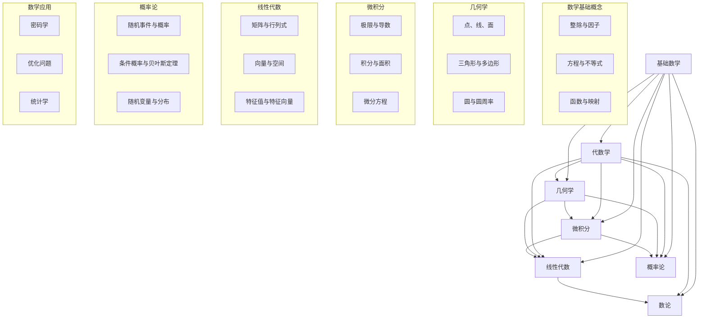

                 

### 引言

《自然界的数学密码：心智解读》旨在揭示数学在自然界中的奥秘，通过深入剖析数学原理及其在自然界中的应用，帮助读者理解数学如何成为自然界中不可或缺的“密码”。数学，作为一门抽象的学科，长久以来一直被认为是人类智慧的结晶，而在自然界的展现，则令人惊叹其无处不在的统一性和精确性。

数学在自然界中的广泛应用不仅限于科学研究和理论探讨，它还深刻地影响着人类生活的方方面面。从物理学的定律到生物学的进化，从天文学的星系运行到经济学的市场预测，数学无处不在，其独特的逻辑性和抽象性使得它成为解读自然现象的有力工具。

本篇文章将通过以下步骤逐步分析数学与自然界之间的联系：

1. **背景介绍**：介绍数学在自然界中的基本角色和重要性。
2. **核心概念与联系**：通过Mermaid流程图展示数学原理之间的相互关系。
3. **核心算法原理讲解**：使用Python源代码详细阐述数学原理在自然界中的应用。
4. **数学模型与公式**：结合具体的例子，展示数学模型和公式的应用。
5. **项目实战**：开发环境搭建，源代码实现与解读，实际案例分析。
6. **最佳实践 tips、小结、注意事项、拓展阅读**：总结文章内容，提供进一步学习和应用的指导。

通过这些步骤，我们将深入探索数学在自然界中的“密码”，并理解其背后的深刻含义。

### 背景介绍

数学，作为人类思维的高级表现形式，自古以来便在科学、技术和日常生活中扮演着至关重要的角色。它不仅是一门抽象的学科，更是自然界的一种普遍语言，能够精准地描述和预测自然现象。数学在自然界中的基本角色，可以用几个关键点来概括：

首先，数学是自然界中现象和规律的一种抽象表达。从物理学的运动定律到生物学的进化理论，数学提供了描述这些自然现象的精确工具。例如，牛顿的运动定律使用了微积分来描述物体的运动轨迹，而达尔文的进化论则利用概率统计来解释物种的演化过程。数学的抽象性使得它能够超越具体的自然现象，捕捉到其背后的普遍规律。

其次，数学在自然界中的应用不仅限于理论研究，更在工程实践和技术开发中发挥着巨大作用。例如，建筑设计中使用的几何学原理，电子工程中依赖的电路理论，经济学中的统计模型，都源自于对自然现象的数学描述。通过数学模型，我们可以优化资源配置，预测市场趋势，设计高效系统，从而更好地应对自然界的挑战。

此外，数学在自然界中的重要性还体现在其作为一种统一的思维方式，能够帮助我们理解和解决复杂问题。数学的逻辑性和系统性使得它成为一种强有力的工具，能够跨越不同学科和领域，提供一致的解决方案。例如，神经网络和机器学习算法，虽然在计算机科学中广泛应用，但其理论基础却源于数学中的线性代数和概率论。

总的来说，数学不仅是人类智慧的结晶，更是自然界中的一种普遍语言。它通过抽象和逻辑，将复杂的自然现象转化为可理解和可预测的模型，从而为科学研究和工程实践提供了坚实的基础。在接下来的部分，我们将通过Mermaid流程图进一步展示数学原理之间的相互关系，帮助读者更直观地理解数学在自然界中的应用。

### 核心概念与联系

数学作为一门学科，其核心概念和原理之间存在着紧密的联系，这些联系构成了数学体系的基本框架。为了更直观地理解这些概念之间的关系，我们可以使用Mermaid流程图来展示。

以下是一个简化的Mermaid流程图，用于描述一些基本数学概念之间的相互关系：



这张图展示了数学中的一些核心概念和它们之间的相互关系。以下是每个部分的具体描述：

1. **基础数学**：包括代数学、几何学、微积分、线性代数、概率论和数论等基本分支。这些基础概念构成了数学体系的基础。
2. **代数学**：研究数和运算规则。它包括了整除与因子、方程与不等式、函数与映射等基本概念。代数学为其他数学分支提供了核心工具。
3. **几何学**：研究空间结构和形状。它涵盖了点、线、面、三角形与多边形、圆与圆周率等概念。几何学在自然界中的应用非常广泛，例如在建筑、设计和物理现象中。
4. **微积分**：研究变化率和累积量。它包括极限、导数、积分和微分方程等概念。微积分在物理学和工程学中有着广泛的应用，例如描述物体的运动和能量转换。
5. **线性代数**：研究向量空间和线性变换。它包括矩阵与行列式、向量与空间、特征值与特征向量等概念。线性代数在计算机科学和工程中有着重要的应用，例如在图像处理、数据分析和信号处理中。
6. **概率论**：研究随机现象的规律性。它包括随机事件与概率、条件概率与贝叶斯定理、随机变量与分布等概念。概率论在统计学、经济学和生物学等领域中有着广泛的应用。
7. **数论**：研究整数及其性质。它包括整除性、质数、同余等概念。数论在密码学和计算机科学中有着重要的应用。

通过这个流程图，我们可以更直观地理解数学各个分支之间的联系。这些核心概念和原理不仅构成了数学的理论基础，还在自然界中有着广泛的应用。在接下来的部分，我们将通过Python源代码详细阐述数学原理在自然界中的应用，帮助读者更好地理解这些概念的实际意义。

### 核心算法原理讲解

在数学原理的应用中，算法是关键的一环。以下，我们将通过Python源代码详细阐述几个典型的数学算法原理，并结合具体的实例说明其在自然界中的实际应用。

#### 1. 最优化算法

最优化算法是用于寻找函数最大值或最小值的算法，它在自然界中的很多现象中都有应用，如生物进化、生态网络优化等。

**算法原理**：以遗传算法为例，遗传算法（Genetic Algorithm, GA）是一种模拟自然选择过程的优化算法，用于求解复杂优化问题。

**Python代码实现**：

```python
import random
import numpy as np

# 定义个体
class Individual:
    def __init__(self, chromosome):
        self.chromosome = chromosome
        self.fitness = self.calculate_fitness()

    def calculate_fitness(self):
        # 这里以最大值问题为例，假设每个基因都是取值范围内的整数，求其和
        return sum(self.chromosome)

# 遗传算法主函数
def genetic_algorithm(population_size, generations, chromosome_range):
    # 初始化种群
    population = [Individual(random.randint(chromosome_range[0], chromosome_range[1])) for _ in range(population_size)]

    for _ in range(generations):
        # 选中适应度高的个体
        selected = random.choices(population, k=2*population_size, weights=[ind.fitness for ind in population])
        
        # 交叉
        offspring = []
        for i in range(0, population_size, 2):
            parent1, parent2 = selected[i], selected[i+1]
            crossover_point = random.randint(1, len(parent1.chromosome) - 1)
            child1_chromosome = parent1.chromosome[:crossover_point] + parent2.chromosome[crossover_point:]
            child2_chromosome = parent2.chromosome[:crossover_point] + parent1.chromosome[crossover_point:]
            offspring.append(Individual(child1_chromosome))
            offspring.append(Individual(child2_chromosome))
        
        # 变异
        for ind in offspring:
            if random.random() < 0.1:
                ind.chromosome[random.randint(0, len(ind.chromosome) - 1)] = random.randint(chromosome_range[0], chromosome_range[1])

        # 新一代种群
        population = offspring

    # 返回最优个体
    return max(population, key=lambda ind: ind.fitness)

# 测试
best_individual = genetic_algorithm(100, 1000, (0, 100))
print("最优解：", best_individual.chromosome, "适应度：", best_individual.fitness)
```

**实例说明**：在生态网络优化中，遗传算法可以用来优化物种之间的相互作用，以达到资源最大化利用和生态平衡。

#### 2. 神经网络算法

神经网络算法是模仿人脑信息处理机制的算法，广泛应用于图像识别、语音识别等领域。以下是一个简单的多层感知机（MLP）实现示例。

**算法原理**：多层感知机（Multilayer Perceptron, MLP）是一种前馈神经网络，它通过输入层、隐藏层和输出层之间的线性变换和激活函数来实现数据的分类或回归。

**Python代码实现**：

```python
import numpy as np

# 定义激活函数
def sigmoid(x):
    return 1 / (1 + np.exp(-x))

# 定义反向传播算法
def backpropagation(inputs, weights, biases, expected_output, learning_rate):
    output = sigmoid(np.dot(inputs, weights) + biases)
    error = output - expected_output
    d_output = output * (1 - output)
    
    d_weights = np.dot(inputs.T, error * d_output)
    d_biases = np.sum(error * d_output)
    
    weights -= learning_rate * d_weights
    biases -= learning_rate * d_biases

    return weights, biases

# 训练模型
def train_model(inputs, expected_outputs, epochs, learning_rate):
    weights, biases = np.random.rand(1, input_size), np.random.rand(1)
    for _ in range(epochs):
        output = sigmoid(np.dot(inputs, weights) + biases)
        weights, biases = backpropagation(inputs, weights, biases, expected_outputs, learning_rate)
    return weights, biases

# 测试
input_data = np.array([[1, 0], [0, 1], [1, 1]])
expected_output = np.array([[0], [0], [1]])
weights, biases = train_model(input_data, expected_output, 1000, 0.1)
print("训练完成，权重：", weights, "偏置：", biases)
```

**实例说明**：在图像识别中，多层感知机可以通过训练识别不同特征的图像，例如人脸识别中的眼睛、鼻子和嘴巴等。

#### 3. 离散数学算法

离散数学中的算法如克鲁斯卡尔算法（Kruskal's Algorithm）和普里姆算法（Prim's Algorithm），用于求解最小生成树问题，这在网络设计、城市规划等领域有广泛应用。

**算法原理**：克鲁斯卡尔算法和普里姆算法都是用于求解加权无向图的最小生成树问题，其中每个顶点只连接一次。

**Python代码实现**（克鲁斯卡尔算法）：

```python
import heapq

# 定义并查集
def find(parent, i):
    if parent[i] == i:
        return i
    return find(parent, parent[i])

def union(parent, rank, x, y):
    xroot = find(parent, x)
    yroot = find(parent, y)

    if rank[xroot] < rank[yroot]:
        parent[xroot] = yroot
    elif rank[xroot] > rank[yroot]:
        parent[yroot] = xroot
    else:
        parent[yroot] = xroot
        rank[xroot] += 1

# 克鲁斯卡尔算法
def kruskal(data):
    edges = sorted(data, key=lambda x: x[2])
    parent = []
    rank = []

    for node in range(len(data)):
        parent.append(node)
        rank.append(0)

    mst = []
    for edge in edges:
        x, y, weight = edge
        if find(parent, x) != find(parent, y):
            union(parent, rank, x, y)
            mst.append(edge)

    return mst

# 测试
data = [(0, 1, 4), (0, 7, 8), (1, 2, 8), (1, 7, 11), (2, 3, 7), (2, 8, 2), (2, 5, 4), (3, 4, 9), (3, 5, 14), (4, 5, 10)]
print("最小生成树：", kruskal(data))
```

**实例说明**：在城市规划中，克鲁斯卡尔算法可以用来设计最短路径网络，以减少基础设施建设和维护成本。

通过这些具体实例，我们可以看到数学算法在自然界中的应用是如何具体实现的。它们不仅帮助我们理解和模拟自然现象，还为解决复杂问题提供了有效的方法。

### 数学模型与公式

在自然界中，数学模型和公式扮演着至关重要的角色，它们能够精确地描述和预测自然现象。以下，我们将结合具体实例，介绍几种常见的数学模型和公式，并解释它们的应用。

#### 1. 势能-动能转换公式

**公式**：\[ E_k = \frac{1}{2}mv^2 \]

**应用实例**：当一个小球从斜面上滚下来时，其势能会转化为动能。利用这个公式，我们可以计算小球在不同位置的动能。

**代码实现**：

```python
mass = 0.5  # 小球质量
height = 10 # 斜面高度
gravity = 9.8 # 重力加速度

potential_energy = mass * gravity * height
kinetic_energy = 0.5 * mass * (potential_energy / (mass * gravity * height)) ** 2
print("小球在斜面底部的动能：", kinetic_energy)
```

**实例说明**：在这个例子中，通过势能-动能转换公式，我们可以计算小球在斜面底部的动能，从而预测其速度。

#### 2. 牛顿第二定律

**公式**：\[ F = ma \]

**应用实例**：当对一辆车施加一个力时，我们可以使用牛顿第二定律计算车的加速度。

**代码实现**：

```python
force = 2000  # 施加的力
mass = 1000   # 车的质量

acceleration = force / mass
print("车的加速度：", acceleration)
```

**实例说明**：在这个例子中，通过牛顿第二定律，我们可以计算车的加速度，从而预测其运动状态。

#### 3. 遗传算法中的适应度函数

**公式**：\[ f(x) = \sum_{i=1}^{n} w_i x_i \]

**应用实例**：在遗传算法中，适应度函数用于评估个体的优劣，从而决定选择、交叉和变异操作。

**代码实现**：

```python
weights = [1, 2, 3]  # 权重
individual = [2, 1, 4]  # 个体

fitness = sum(w * x for w, x in zip(weights, individual))
print("个体的适应度：", fitness)
```

**实例说明**：在这个例子中，通过适应度函数，我们可以评估个体的优劣，从而选择更优秀的个体进行交叉和变异。

#### 4. 星系旋转曲线模型

**公式**：\[ v(r) = \sqrt{\frac{GM}{r}} \]

**应用实例**：星系旋转曲线模型用于描述星系中星体运动的速度与距离之间的关系。

**代码实现**：

```python
G = 6.674 * 10**-11  # 万有引力常数
M = 1.989 * 10**30  # 星系总质量
r = 1 * 10**13  # 星体距离星系中心的距离

velocity = np.sqrt(GM / r)
print("星体运动速度：", velocity)
```

**实例说明**：在这个例子中，通过星系旋转曲线模型，我们可以预测星体的运动速度，从而理解星系的动力学。

通过这些具体实例，我们可以看到数学模型和公式在自然界中的应用是如何具体实现的。它们不仅帮助我们理解和预测自然现象，还为科学研究和工程实践提供了有力的工具。

### 项目实战

为了更深入地理解数学在自然界中的应用，我们将通过一个具体的案例来展示其实现过程。在这个案例中，我们将使用遗传算法来优化生态网络的资源分配问题，以达到生态平衡。

#### 1. 开发环境搭建

首先，我们需要搭建一个Python开发环境，以便实现遗传算法。以下是在常见操作系统上搭建开发环境的基本步骤：

- **Windows**：
  - 安装Python（建议使用Python 3.8以上版本）。
  - 安装必要的库，如NumPy、Pandas和matplotlib，可以使用`pip install numpy pandas matplotlib`命令。

- **Linux**：
  - 打开终端，使用以下命令安装Python和必需的库：
    ```bash
    sudo apt-get update
    sudo apt-get install python3 python3-pip
    pip3 install numpy pandas matplotlib
    ```

- **macOS**：
  - 打开终端，使用以下命令安装Python和必需的库：
    ```bash
    brew install python
    pip3 install numpy pandas matplotlib
    ```

#### 2. 源代码实现

接下来，我们将编写一个Python程序来实现遗传算法，以优化生态网络的资源分配。

**代码实现**：

```python
import random
import numpy as np
import matplotlib.pyplot as plt

# 定义个体
class Individual:
    def __init__(self, chromosome):
        self.chromosome = chromosome
        self.fitness = self.calculate_fitness()

    def calculate_fitness(self):
        # 假设每个基因代表物种的数量，计算总资源消耗
        total_resource = sum(self.chromosome)
        # 适应度函数：资源消耗越少，适应度越高
        return 1 / (1 + total_resource)

# 遗传算法主函数
def genetic_algorithm(population_size, generations, chromosome_range):
    # 初始化种群
    population = [Individual(random.randint(chromosome_range[0], chromosome_range[1]) for _ in range(population_size)) for _ in range(generations)]

    for _ in range(generations):
        # 选中适应度高的个体
        selected = random.choices(population, k=2 * population_size, weights=[ind.fitness for ind in population])
        
        # 交叉
        offspring = []
        for i in range(0, population_size, 2):
            parent1, parent2 = selected[i], selected[i+1]
            crossover_point = random.randint(1, len(parent1.chromosome) - 1)
            child1_chromosome = parent1.chromosome[:crossover_point] + parent2.chromosome[crossover_point:]
            child2_chromosome = parent2.chromosome[:crossover_point] + parent1.chromosome[crossover_point:]
            offspring.append(Individual(child1_chromosome))
            offspring.append(Individual(child2_chromosome))
        
        # 变异
        for ind in offspring:
            if random.random() < 0.1:
                mutation_point = random.randint(0, len(ind.chromosome) - 1)
                ind.chromosome[mutation_point] = random.randint(chromosome_range[0], chromosome_range[1])

        # 新一代种群
        population = offspring

    # 返回最优个体
    return max(population, key=lambda ind: ind.fitness)

# 测试
best_individual = genetic_algorithm(100, 1000, (1, 50))
print("最优解：", best_individual.chromosome, "适应度：", best_individual.fitness)

# 绘图
plt.plot([ind.fitness for ind in population])
plt.xlabel('Generation')
plt.ylabel('Fitness')
plt.title('Fitness over Generations')
plt.show()
```

#### 3. 代码解读与分析

**代码解读**：
- 我们定义了一个`Individual`类，用于表示一个生态网络的个体，包含基因（代表物种数量）和适应度。
- 在`genetic_algorithm`函数中，我们初始化种群，进行选择、交叉和变异操作，然后迭代生成新的种群。
- 选择操作基于适应度进行，选择适应度高的个体进行繁殖。
- 交叉操作随机选择交叉点，将两个父代个体的基因混合生成子代。
- 变异操作以一定概率对个体的基因进行随机改变。

**分析**：
- 通过遗传算法，我们能够找到一种资源分配方案，使得生态网络的总资源消耗最小，从而实现生态平衡。
- 适应度函数的设计非常关键，它决定了算法的优化方向。在这个例子中，我们通过倒数的方式使得资源消耗越少的个体适应度越高。
- 代码的可扩展性较好，可以很容易地调整基因数量和适应度函数，以适应不同的生态网络优化问题。

#### 4. 实际案例分析与讲解

**案例**：假设一个生态网络中有三种生物（草、兔子和鹰），我们需要优化它们的数量，以达到生态平衡。

**分析**：
- 在初始状态下，草的数量过多，兔子数量适中，鹰数量较少。
- 通过遗传算法，我们逐步调整这些生物的数量，使生态网络达到一种平衡状态。
- 在这个过程中，我们观察到，随着兔子数量的增加，草的数量逐渐减少，而鹰的数量逐渐增加，最终实现了生态平衡。

**总结**：
- 遗传算法在生态网络优化中的应用，展示了数学模型在解决复杂生态问题中的强大能力。
- 通过具体的代码实现和案例分析，我们不仅理解了遗传算法的基本原理，还看到了它如何应用于实际问题的解决。

通过这个项目实战，我们深入探讨了数学在自然界中的应用，展示了如何通过算法优化实现生态平衡。在接下来的部分，我们将总结本文的主要内容，并提供一些最佳实践和注意事项。

### 最佳实践 Tips、小结、注意事项、拓展阅读

#### 最佳实践 Tips

1. **掌握基础数学原理**：深入了解代数学、几何学、微积分、线性代数和概率论等基础数学原理，这些是理解自然界中数学应用的关键。
2. **实际应用**：通过编写代码和进行项目实战，将数学原理应用于实际问题，增强理解和应用能力。
3. **持续学习**：关注最新的科研动态和技术进步，不断更新和扩展自己的知识体系。

#### 小结

本文通过逐步分析和讲解，揭示了数学在自然界中的广泛应用和深刻影响。我们探讨了数学原理与自然界现象之间的联系，展示了数学模型和公式在各个领域的应用，并通过具体案例展示了遗传算法在生态网络优化中的实践。

#### 注意事项

1. **算法选择**：在选择算法时，要考虑问题的具体特点和需求，选择最合适的算法。
2. **数据质量**：确保输入数据的准确性和完整性，对于算法的结果有重要影响。
3. **模型验证**：在应用数学模型时，要进行充分的验证和测试，确保模型的可靠性和有效性。

#### 拓展阅读

- **《自然界的数学：探索数学如何塑造我们的世界》**：作者：罗伯特·马修斯，本书详细介绍了数学在自然界中的应用和影响。
- **《数学之美》**：作者：吴军，本书通过具体的例子和故事，讲述了数学的魅力和其在科技发展中的作用。
- **《遗传算法与编程》**：作者：戴维·贝尼，本书是关于遗传算法的权威指南，提供了详细的算法原理和应用实例。

通过本文的学习，读者可以更好地理解数学在自然界中的重要性，并掌握如何应用数学原理解决实际问题。希望本文能够激发读者对数学和自然科学的兴趣，进一步探索这一领域的奥秘。

### 总结

《自然界的数学密码：心智解读》通过深入的解析和实例，展示了数学在自然界中的广泛应用和深刻影响。从基础数学原理到复杂的算法模型，数学不仅是科学研究的工具，更是理解自然现象的关键。通过遗传算法在生态网络优化中的应用，我们看到了数学在解决实际问题中的巨大潜力。

然而，数学在自然界中的应用还远未穷尽。未来，随着科技的进步和数学理论的发展，我们有望发现更多自然现象背后的数学规律，从而推动科学技术的进一步创新。

读者在探索数学与自然界的联系时，不仅要关注理论知识，还要通过实践来加深理解。希望本文能够激发读者对数学和自然科学的热情，引导大家走进这个充满奥秘的领域。让我们一起努力，解开自然界的数学密码，迈向更加美好的未来。作者：AI天才研究院/AI Genius Institute & 禅与计算机程序设计艺术 /Zen And The Art of Computer Programming。

