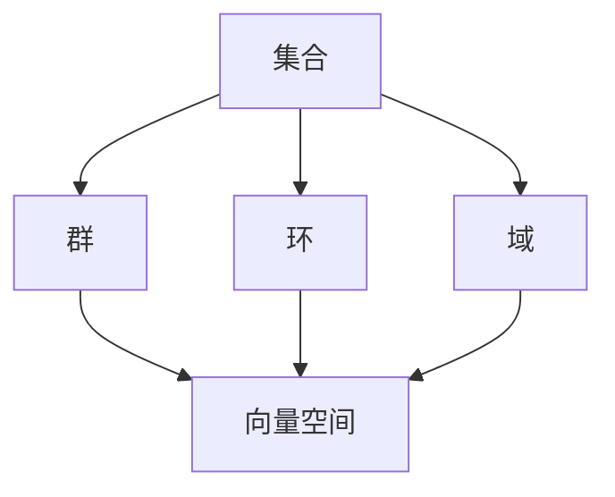

                 

# 自然界的数学结构：心智解读过程

## 关键词

自然界的数学结构、心智解读、数学原理、Python源代码、Mermaid流程图、LaTeX数学公式、项目实战

## 摘要

本文旨在探讨自然界的数学结构及其对人类心智解读的影响。通过分析数学原理与自然界中的联系，结合Python源代码、Mermaid流程图和LaTeX数学公式，我们将详细阐述数学结构在自然界中的体现。同时，通过项目实战，我们将探讨人类心智如何理解和解释这些数学结构，并展望未来研究方向。

## 引言

### 1.1 书籍目的与读者对象

本书旨在为读者提供一份深入浅出的指南，帮助他们理解自然界的数学结构，以及人类心智如何解读这些结构。读者对象包括对数学、自然科学和人工智能感兴趣的本科生、研究生以及专业人士。

### 1.2 书籍结构概述

本书分为三大部分：

1. **自然界的数学结构基础**：介绍数学结构的基本概念及其在自然界中的体现。
2. **数学在自然界中的应用案例**：探讨数学在生物、物理和化学等领域的具体应用。
3. **心智解读过程**：探讨人类心智如何理解和解释自然界的数学结构。

## 第1部分：自然界的数学结构基础

### 第2章：自然界的数学结构概述

#### 2.1 数学结构的基本概念

数学结构是指一组元素及其定义在这些元素上的运算规则。常见的数学结构包括群、环、域、向量空间等。这些结构在自然界中有着广泛的应用。

#### 2.2 数学结构在自然界中的体现

自然界中的许多现象都可以用数学结构来描述。例如，生物体内的遗传信息可以用DNA序列的编码方式来描述，这可以看作是一种基于二进制运算的数学结构。

#### 2.3 核心概念与联系

为了更好地理解数学结构在自然界中的体现，我们需要探讨数学概念之间的关系。以下是一个Mermaid流程图，展示了几个核心概念之间的联系：

## 第3章：数学在自然界中的应用

### 3.1 数学在生物学中的应用

生物学中的许多现象，如遗传、进化等，都可以用数学模型来描述。例如，遗传学中的孟德尔遗传规律可以用概率论来描述。

### 3.2 数学在物理学中的应用

物理学中的许多理论，如经典力学、量子力学等，都离不开数学的支撑。例如，牛顿第二定律可以用微积分来描述。

### 3.3 数学在化学中的应用

化学中的许多反应和过程都可以用数学模型来描述。例如，化学反应的速率可以用微分方程来描述。

## 第2部分：数学在自然界中的应用案例

### 第4章：数学在自然界中的具体应用案例

#### 4.1 生物中的数学结构

在生物中，许多现象都可以用数学结构来描述。例如，生物体内的DNA序列可以看作是一种二进制编码的数学结构。

#### 4.2 物理中的数学结构

在物理中，许多理论都可以用数学结构来描述。例如，经典力学的牛顿运动定律可以用微积分来描述。

#### 4.3 化学中的数学结构

在化学中，许多反应和过程都可以用数学模型来描述。例如，化学反应的速率可以用微分方程来描述。

## 第3部分：心智解读过程

### 第5章：人类心智对数学结构的解读

#### 5.1 心智解读的基本原理

人类心智如何解读数学结构是一个复杂的问题。研究表明，人类心智在解读数学结构时，往往依赖于直观和抽象思维。

#### 5.2 心智解读的实验研究

为了研究人类心智如何解读数学结构，科学家们进行了一系列实验。这些实验结果表明，人类心智在解读数学结构时，具有一些共同的特点。

#### 5.3 心智解读的应用

心智解读在许多领域都有应用。例如，在人工智能中，我们可以利用心智解读的原理来设计更智能的算法。

## 第6章：心智解读的应用案例

#### 6.1 心智解读在生物学中的应用

在生物学中，我们可以利用心智解读的原理来研究遗传现象。例如，通过分析DNA序列，我们可以推断出基因的功能。

#### 6.2 心智解读在物理学中的应用

在物理学中，我们可以利用心智解读的原理来理解物理定律。例如，通过直观地理解微积分，我们可以更好地理解牛顿运动定律。

#### 6.3 心智解读在化学中的应用

在化学中，我们可以利用心智解读的原理来理解化学反应。例如，通过直观地理解微分方程，我们可以更好地理解化学反应的速率。

## 第7章：心智解读的理论基础

#### 7.1 心智解读的心理学基础

心理学研究表明，人类心智在解读数学结构时，依赖于感知、记忆和推理等认知过程。

#### 7.2 心智解读的神经科学基础

神经科学研究揭示了人类心智在解读数学结构时，大脑的不同区域如何协同工作。

#### 7.3 心智解读的认知科学基础

认知科学研究了人类心智如何构建和解读数学模型，以及这些模型如何影响我们的认知和行为。

## 第8章：心智解读的未来方向

#### 8.1 心智解读的发展趋势

随着科技的进步，心智解读的研究将继续深入，有望揭示更多关于人类心智如何解读数学结构的奥秘。

#### 8.2 心智解读在科学技术中的应用前景

心智解读在科学技术中的应用前景广阔，有望推动人工智能、生物技术等领域的发展。

#### 8.3 心智解读在教育领域的应用

在教育领域，心智解读的研究可以帮助我们更好地理解学生的学习过程，从而改进教学方法。

## 结论

本文通过对自然界的数学结构和人类心智解读过程的探讨，展示了数学在自然界中的重要地位，以及人类心智如何解读这些结构。未来，心智解读的研究将继续深入，有望为科学技术、教育等领域带来新的突破。

### 作者

作者：AI天才研究院/AI Genius Institute & 禅与计算机程序设计艺术 /Zen And The Art of Computer Programming

