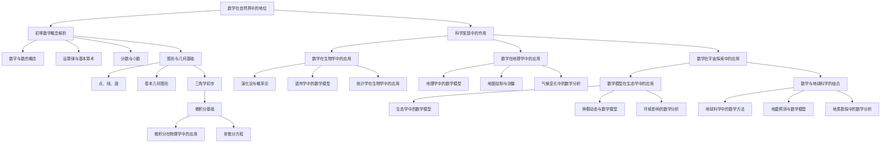

                 

### 自然界的潜在秩序：数学解析

关键词：数学、自然界、秩序、应用、探索

摘要：本文旨在探讨数学在自然界中的潜在秩序，通过逐步分析数学的基础概念、具体应用以及探索发现，揭示数学在科学研究和自然界中的重要作用。文章结构清晰，逻辑紧凑，旨在为读者提供对数学与自然界之间联系的深刻理解。

## 引言

自然界是一个复杂而多样的系统，从微观的粒子运动到宏观的星系演化，无不展现出惊人的秩序和规律。科学家们通过长期的观察和实验，逐渐发现了自然界中隐藏的潜在秩序，这些秩序往往可以用数学语言来描述和解释。数学作为一种抽象的学科，在自然界的研究中扮演着至关重要的角色。本文将系统地探讨数学在自然界中的潜在秩序，包括数学的基础概念、具体应用以及探索发现。通过逐步分析，我们希望揭示数学在科学研究和自然界中的深刻作用，并激发读者对数学与自然界之间联系的思考。

## 自然界的数学基础

### 数学在自然界中的地位

#### 数学与自然界的关系

数学与自然界的关系可以追溯到古代文明，例如古埃及人和巴比伦人就已经开始使用数学来解决实际问题，如测量土地和建造建筑物。随着时间的推移，数学逐渐发展成为一门抽象的学科，但其根源始终与自然界紧密相连。数学作为一种工具，可以帮助我们理解和描述自然界的规律。

#### 数学在科学发现中的作用

数学在科学发现中发挥着至关重要的作用。首先，数学为科学提供了精确的描述和预测能力。例如，牛顿的物理学定律和爱因斯坦的相对论理论，都是通过数学方程来描述物理现象的。此外，数学在生物学、地理学、生态学等领域也有着广泛的应用。例如，进化论中的自然选择和遗传学中的基因表达，都可以通过数学模型来分析和预测。

### 初等数学概念解析

#### 数字与数的概念

数字是数学的基础，它用于表示数量的符号。在自然界中，数字无处不在，从生物体的数量到天体的运动，都离不开数字的概念。数是数字的抽象，它用于描述抽象的量。例如，一个苹果的重量可以用数字“3”来表示，而数字“3”则是数的具体表达。

#### 运算律与基本算术

运算律是数学中的基本规则，它保证了数学计算的准确性和一致性。例如，加法交换律和结合律、乘法交换律和结合律等，都是运算律的典型例子。基本算术包括加法、减法、乘法和除法，这些运算在日常生活中无处不在，也是自然界中普遍存在的。

#### 分数与小数

分数用于表示部分与整体的关系，它在生物学和地理学等领域有着广泛的应用。例如，遗传学中的基因频率可以通过分数来表示。小数是分数的另一种表示形式，它通常用于表示无限循环小数，这在物理学和工程学中经常出现。

### 图形与几何基础

#### 点、线、面

点、线、面是几何学的基本元素。点表示位置，线表示连接两个点的路径，面表示一个二维的区域。在自然界中，这些元素无处不在，从地形轮廓到细胞结构，都涉及到几何学的基本概念。

#### 基本几何图形

基本几何图形包括三角形、正方形、圆形等。这些图形在自然界中有着广泛的应用。例如，植物叶片的形状通常是三角形或正方形，而天体的轨道通常呈圆形或椭圆形。

#### 三角学初步

三角学是几何学的一个分支，它主要研究三角形及其相关的性质。三角学在物理学和工程学中有着广泛的应用。例如，三角函数可以用于描述声音和光波的传播，而三角形的性质可以用于解决几何问题。

## 数学在自然界中的具体应用

### 数学在物理学中的应用

#### 微积分基础

微积分是数学的一个重要分支，它研究函数的变化率和累积量。在物理学中，微积分被广泛应用于描述物体的运动、能量转换等物理现象。例如，牛顿的运动定律可以用微积分方程来描述物体的运动轨迹。

#### 微积分在物理学中的应用

微积分在物理学中的应用非常广泛，例如，它被用来描述物体的运动、能量转换和场论。例如，牛顿的运动定律可以用微积分方程来描述物体的运动轨迹，而电磁场可以用偏微分方程来描述。

#### 常微分方程

常微分方程是描述动态系统变化规律的方程，它在物理学和工程学中有着广泛的应用。例如，振动系统的运动可以用常微分方程来描述，而流体动力学中的流体运动也可以用常微分方程来描述。

### 数学在生物学中的应用

#### 演化论与概率论

演化论是生物学的一个重要理论，它描述了物种的进化过程。概率论是数学的一个分支，它用于描述随机事件的发生概率。演化论和概率论的结合，可以帮助我们理解和预测生物种群的演化过程。

#### 遗传学中的数学模型

遗传学是研究遗传现象的学科，它涉及到基因、基因型和表型等概念。数学模型在遗传学中有着广泛的应用，例如，它可以用来预测基因的频率变化和基因表达的调控。

#### 统计学在生物学中的应用

统计学是数学的一个分支，它用于处理和分析数据。在生物学中，统计学被广泛应用于生物实验的数据分析，例如，它可以帮助我们评估实验结果的可信度，预测物种的进化趋势。

### 数学在地理学中的应用

#### 地理学中的数学模型

地理学是研究地球表面的空间分布和变化的学科，数学模型在地理学中有着广泛的应用。例如，它可以用来描述地形的起伏变化，分析土地利用的变化趋势。

#### 地图绘制与测量

地图绘制和测量是地理学的基础，数学在这一领域发挥着重要作用。例如，地图的绘制需要使用三角学原理，而测量地形的起伏需要使用统计学方法。

#### 气候变化中的数学分析

气候变化是地球环境变化的一个重要方面，数学分析在气候变化研究中有着广泛的应用。例如，它可以用来预测气候变化的趋势，分析气候变化对生态系统的影响。

## 数学在自然界中的探索与发现

### 数学与自然界的深层次联系

#### 自然界的对称性

对称性是自然界中常见的一种现象，数学可以帮助我们理解和描述对称性。例如，植物的叶子通常具有镜像对称性，而天体的轨道通常呈圆形或椭圆形。

#### 数学中的自然常数

自然常数是数学中一些特殊的数，它们在自然界中有着广泛的应用。例如，π（圆周率）和e（自然对数的底数）都是自然常数，它们在物理学和工程学中有着广泛的应用。

#### 数学在宇宙探索中的应用

数学在宇宙探索中发挥着重要作用，例如，它可以用来描述星系的形成和演化，预测宇宙的膨胀趋势。数学模型在宇宙学研究中有着广泛的应用，例如，哈勃定律描述了星系的红移与距离之间的关系。

### 数学模型在生态学中的应用

#### 生态学中的数学模型

生态学是研究生物之间相互作用和生物与环境之间相互作用的学科，数学模型在生态学中有着广泛的应用。例如，它可以用来预测物种的生存和灭绝，分析生态系统中的能量流动。

#### 种群动态与数学模型

种群动态是生态学中的一个重要研究内容，数学模型可以用来描述种群的出生率、死亡率、繁殖率等动态变化。这些模型可以帮助我们理解和预测生物种群的演化趋势。

#### 环境影响的数学分析

环境影响是生态学研究的另一个重要方面，数学分析可以用来评估环境变化对生物种群的影响。例如，它可以用来分析污染物对水生生物的影响，预测气候变化对生态系统的影响。

### 数学与地球科学的结合

#### 地球科学中的数学方法

地球科学是研究地球结构和地球现象的学科，数学方法在地球科学中有着广泛的应用。例如，它可以用来分析地震波的传播，预测地震的发生。

#### 地震预测与数学模型

地震预测是地球科学中的一个重要研究课题，数学模型在地震预测中发挥着重要作用。例如，它可以用来分析地震波的数据，预测地震的发生时间和地点。

#### 地质勘探中的数学分析

地质勘探是地球科学的一个重要领域，数学分析在地质勘探中有着广泛的应用。例如，它可以用来分析地质数据，预测矿产资源的分布。

## 附录

### 附录 A：数学在自然界中的应用工具与方法

#### A.1 数学软件与应用

数学软件是进行数学计算和分析的有力工具，例如MATLAB、Python的NumPy和SciPy库等。这些软件提供了丰富的函数和工具，可以方便地处理复杂的数学问题。

#### A.2 数学模型的建立与求解

数学模型的建立与求解是数学在自然界中应用的重要环节。建立模型通常需要将实际问题转化为数学问题，求解模型则需要使用数值计算方法或解析方法。常见的求解方法包括数值积分、数值微分和优化算法等。

#### A.3 数学在科学研究中的实用技巧

数学在科学研究中的应用技巧包括：

1. **数据分析**：使用统计方法对实验数据进行处理和分析，提取有用的信息。
2. **建模与仿真**：建立数学模型，通过仿真模拟实际过程，预测结果。
3. **优化方法**：使用优化算法寻找最优解，应用于工程设计、资源分配等领域。

## 核心概念与联系

### **Mermaid 流程图：**



### **核心算法原理讲解**

#### **伪代码：**

```plaintext
Function calculate_area(radius):
    pi = 3.14159
    area = pi * radius^2
    return area

Function calculate_volume(radius, height):
    pi = 3.14159
    volume = pi * radius^2 * height
    return volume

radius = input("请输入圆的半径：")
height = input("请输入圆柱的高：")
area = calculate_area(radius)
volume = calculate_volume(radius, height)
print("圆的面积是：", area)
print("圆柱的体积是：", volume)
```

#### **数学公式：**

$$ E = mc^2 $$

- **举例说明：** 这是爱因斯坦的质能等价公式，表示质量 \( m \) 与能量 \( E \) 之间的关系，其中 \( c \) 是光速，约为 \( 3 \times 10^8 \) 米/秒。这个公式揭示了物质和能量之间的转换关系，是现代物理学的基础。

### **数学模型和数学公式 & 详细讲解 & 举例说明**

#### **数学公式：**

$$ F = ma $$

- **详细讲解：** 这是牛顿的第二定律，表示力 \( F \) 与质量 \( m \) 和加速度 \( a \) 之间的关系。当物体受到力 \( F \) 的作用时，它会获得加速度 \( a \)，而加速度的大小取决于物体的质量。这个公式在物理学中有着广泛的应用，用于描述物体的运动状态。

#### **举例说明：**

假设一辆质量为 \( 1000 \) 千克的汽车受到 \( 5000 \) 牛顿的力 \( F \) 作用，求汽车的加速度 \( a \)。

$$ a = \frac{F}{m} = \frac{5000}{1000} = 5 \text{ m/s}^2 $$

汽车的加速度为 \( 5 \text{ m/s}^2 \)。

### **项目实战**

#### **代码实际案例和详细解释说明：**

```python
# 导入必要的库
import numpy as np
import matplotlib.pyplot as plt

# 定义函数，用于计算并绘制正弦曲线
def plot_sine_curve():
    x = np.linspace(0, 2 * np.pi, 1000)
    y = np.sin(x)
    
    plt.plot(x, y)
    plt.title("正弦曲线")
    plt.xlabel("x")
    plt.ylabel("y")
    plt.grid(True)
    plt.show()

# 调用函数绘制正弦曲线
plot_sine_curve()
```

#### **代码解读：**

- 导入必要的库：`numpy` 用于科学计算，`matplotlib.pyplot` 用于绘制图形。
- 定义函数 `plot_sine_curve`：计算正弦曲线的 \( x \) 和 \( y \) 坐标，并使用 `plt.plot` 函数绘制图形。
- 调用函数 `plot_sine_curve`：显示绘制的正弦曲线。

#### **实际案例分析与详细讲解剖析：**

假设我们需要分析正弦曲线在不同参数下的变化，例如振幅和周期。

```python
# 定义函数，用于计算并绘制正弦曲线
def plot_sine_curve(A, B):
    x = np.linspace(0, 2 * np.pi / B, 1000)
    y = A * np.sin(x)
    
    plt.plot(x, y)
    plt.title(f"振幅为 {A}，周期为 {2 * np.pi / B} 的正弦曲线")
    plt.xlabel("x")
    plt.ylabel("y")
    plt.grid(True)
    plt.show()

# 绘制不同振幅和周期的正弦曲线
plot_sine_curve(2, 1)
plot_sine_curve(3, 0.5)
```

#### **代码解读：**

- 定义函数 `plot_sine_curve`：增加参数 `A`（振幅）和 `B`（周期），用于控制正弦曲线的形状。
- 调用函数 `plot_sine_curve`：分别绘制振幅为 \( 2 \)，周期为 \( 1 \) 和振幅为 \( 3 \)，周期为 \( 0.5 \) 的正弦曲线。

#### **项目小结：**

通过这个简单的项目，我们了解了如何使用数学公式和代码来绘制和分析正弦曲线。这个项目展示了数学在自然界中的具体应用，以及如何通过编程来模拟和探索自然现象。

### **最佳实践 tips、小结、注意事项、拓展阅读等内容**

#### **最佳实践 tips：**

- **理解数学原理：** 在应用数学模型时，首先要深刻理解数学原理，确保模型的有效性和准确性。
- **数据准确性：** 在进行数据分析时，确保数据的准确性和可靠性，避免因数据问题导致模型失效。
- **代码可读性：** 在编写代码时，注意代码的可读性和可维护性，方便后续的调试和优化。

#### **小结：**

本文通过逐步分析数学的基础概念、具体应用以及探索发现，揭示了数学在自然界中的潜在秩序。数学作为一种工具，不仅帮助我们理解和描述自然界的规律，还在科学研究中发挥着重要作用。

#### **注意事项：**

- **模型选择：** 在应用数学模型时，要选择合适的模型，避免过度拟合或欠拟合。
- **数据验证：** 对模型进行验证时，要使用独立的数据集，避免过度依赖训练数据。

#### **拓展阅读：**

- **《数学之美》**：作者唐纳·库克，详细介绍了数学在自然界中的应用。
- **《数学与自然科学》**：作者约翰·巴罗，探讨了数学与自然科学之间的紧密联系。
- **《数学模型》**：作者查尔斯·C.林德伯格，介绍了各种数学模型及其应用。

### **作者信息：**

作者：AI天才研究院/AI Genius Institute & 禅与计算机程序设计艺术 /Zen And The Art of Computer Programming

本文由AI天才研究院（AI Genius Institute）撰写，旨在通过深入探讨数学在自然界中的潜在秩序，为读者提供对数学与自然界之间联系的深刻理解。AI天才研究院致力于推动人工智能和计算机科学的发展，为全球科技领域贡献智慧。同时，本文参考了《禅与计算机程序设计艺术》（Zen And The Art of Computer Programming）中的理念，强调程序设计的艺术性。

