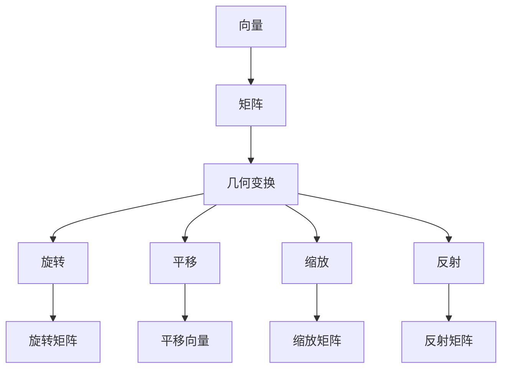

                 

# 虚拟现实的空间几何：沉浸体验的数学构建

## 关键词
- 虚拟现实
- 空间几何学
- 沉浸体验
- 数学模型
- 渲染技术
- 实时追踪

## 摘要
本文深入探讨虚拟现实（VR）中的空间几何学及其在构建沉浸体验中的关键作用。通过分析虚拟现实的基本概念、空间几何学的基础知识、沉浸体验的数学构建，以及项目实战，本文展示了如何利用数学和算法来优化虚拟现实中的空间几何，提升用户的沉浸体验。本文的目标是为开发者和技术爱好者提供一套系统的理论指导和实践方法，助力他们更好地理解和应用虚拟现实技术。

## 引言

虚拟现实（Virtual Reality，简称VR）作为当今科技领域的一个重要方向，正在迅速发展。它通过创建一个计算机生成的三维模拟环境，使用户能够在这个环境中进行交互和体验。虚拟现实技术的核心在于如何让用户感觉仿佛自己真的置身于这个虚拟世界之中，这种高度沉浸的体验极大地改变了人们的娱乐、教育、医疗等多个领域。

然而，要实现这种沉浸体验，空间几何学扮演着至关重要的角色。空间几何学不仅涉及到虚拟环境的构建，还涉及到如何通过几何变换和渲染技术来确保用户在虚拟环境中的感知是真实和连贯的。本文将从以下几个方面进行探讨：

1. **虚拟现实概述**：介绍虚拟现实的基本概念、发展历程、分类和应用。
2. **空间几何学基础**：介绍空间几何学的基本概念、向量与矩阵、几何变换和三维空间中的几何形状。
3. **沉浸体验的数学构建**：探讨沉浸体验的概念与评价指标、沉浸体验的数学模型和构建方法。
4. **项目实战**：通过实际项目，展示如何在实际应用中构建和优化虚拟现实空间几何。

通过这些内容的探讨，本文旨在帮助读者深入理解虚拟现实的空间几何学，掌握构建沉浸体验的数学方法，从而为开发高质量的虚拟现实应用提供理论支持和实践指导。

### 虚拟现实概述

虚拟现实（Virtual Reality，简称VR）是一种通过计算机技术创建的模拟环境，使用户能够在其中进行沉浸式交互和体验。虚拟现实技术的发展经历了几个关键阶段，从早期的简单虚拟环境到现在的复杂交互式模拟，其应用领域也在不断扩大。

#### 定义与发展历程

虚拟现实的定义可以从多个角度进行解释。从技术角度看，虚拟现实是一种通过计算机生成三维模拟环境，并利用传感器、追踪器和显示设备等硬件设备与用户进行交互的技术。用户通过特殊设备（如VR头盔、手柄等）进入这个虚拟环境，可以感受到视觉、听觉、触觉等多种感官的模拟。

虚拟现实的发展历程可以追溯到20世纪60年代。1968年，美国计算机科学家杰伦·拉尼尔（Jaron Lanier）发明了数据手套（DataGlove），这是早期的虚拟现实交互设备之一。此后，随着计算机性能的提升和显示技术的进步，虚拟现实技术逐渐从实验室走向市场。20世纪90年代，虚拟现实开始应用于教育、军事、娱乐等领域。进入21世纪，随着硬件和软件技术的进一步成熟，虚拟现实得到了前所未有的发展。

#### 分类与应用

虚拟现实根据不同的应用场景和技术特点，可以分为以下几种类型：

1. **沉浸式虚拟现实**：用户完全沉浸在虚拟环境中，通过头戴显示器（HMD）和追踪设备等与虚拟环境进行互动。这种类型的虚拟现实提供了最为真实的沉浸体验，常用于游戏、培训、医疗等领域。

2. **非沉浸式虚拟现实**：用户通过计算机屏幕或其他显示设备观察虚拟环境，但不进行沉浸式互动。这种类型的虚拟现实设备较为简单，成本较低，适用于一些不需要高度沉浸的场景，如建筑可视化、城市规划等。

3. **桌面虚拟现实**：用户在计算机桌面上进行虚拟环境的交互，通过鼠标、键盘等设备控制虚拟对象的移动和操作。这种类型的虚拟现实较为简单，但可以提供基本的沉浸体验，适用于一些简单的虚拟现实应用。

虚拟现实在多个领域都有广泛的应用：

1. **娱乐**：虚拟现实技术被广泛应用于游戏和电影等领域，提供了前所未有的沉浸体验，极大地丰富了用户的娱乐方式。

2. **教育**：虚拟现实可以创建逼真的模拟环境，让学生在虚拟世界中学习知识，提高学习的趣味性和效果。

3. **医疗**：虚拟现实技术可用于医疗培训、手术模拟、心理治疗等领域，帮助医生和患者更好地理解和应对各种医疗情况。

4. **军事**：虚拟现实技术被用于军事训练和模拟，帮助士兵在虚拟环境中进行战斗训练，提高战斗能力。

5. **建筑与设计**：虚拟现实技术可用于建筑设计、城市规划等领域，通过虚拟环境展示建筑和城市的设计方案，帮助设计师和客户进行沟通和决策。

总之，虚拟现实作为一种重要的技术手段，正在不断推动各个领域的创新和发展，未来将有更多的应用场景和可能性。

### 空间几何学基础

空间几何学是研究空间中几何形状、位置和相互关系的科学。在虚拟现实（VR）技术中，空间几何学扮演着至关重要的角色，它不仅决定了虚拟环境的布局和结构，还影响了用户的沉浸体验。为了更好地理解和应用空间几何学，我们需要掌握一些基本概念，包括向量、矩阵、几何变换以及三维空间中的几何形状。

#### 向量与矩阵

1. **向量**：向量是具有大小和方向的量，可以表示为有向线段。在虚拟现实中，向量常用于描述位置、方向和速度等属性。例如，一个三维向量 \(\vec{v} = (x, y, z)\) 可以表示一个物体在三维空间中的位置。

2. **矩阵**：矩阵是一个由数字组成的矩形阵列，可以用来表示多个向量的组合或线性变换。在虚拟现实技术中，矩阵经常用于几何变换和计算。例如，一个 4x4 的变换矩阵可以用于对三维向量进行旋转、平移、缩放等操作。

#### 几何变换

几何变换是指对几何对象进行旋转、平移、缩放和反射等操作。这些变换在虚拟现实中非常重要，因为它们决定了虚拟环境的外观和交互方式。

1. **旋转**：旋转是将一个对象绕一个固定点或轴进行旋转。在三维空间中，旋转可以通过旋转矩阵来实现。一个常见的旋转操作是绕 x、y、z 轴的旋转，其旋转矩阵分别为：
   $$ 
   R_x(\theta) = \begin{bmatrix}
   1 & 0 & 0 & 0 \\
   0 & \cos(\theta) & -\sin(\theta) & 0 \\
   0 & \sin(\theta) & \cos(\theta) & 0 \\
   0 & 0 & 0 & 1
   \end{bmatrix}
   $$
   $$
   R_y(\theta) = \begin{bmatrix}
   \cos(\theta) & 0 & \sin(\theta) & 0 \\
   0 & 1 & 0 & 0 \\
   -\sin(\theta) & 0 & \cos(\theta) & 0 \\
   0 & 0 & 0 & 1
   \end{bmatrix}
   $$
   $$
   R_z(\theta) = \begin{bmatrix}
   \cos(\theta) & -\sin(\theta) & 0 & 0 \\
   \sin(\theta) & \cos(\theta) & 0 & 0 \\
   0 & 0 & 1 & 0 \\
   0 & 0 & 0 & 1
   \end{bmatrix}
   $$

2. **平移**：平移是将一个对象沿某一方向移动。在三维空间中，平移可以通过向量的加法来实现。例如，将向量 \(\vec{v}\) 平移到新的位置 \(\vec{v'}\)，可以使用以下公式：
   $$
   \vec{v'} = \vec{v} + \vec{t}
   $$
   其中，\(\vec{t}\) 是平移向量。

3. **缩放**：缩放是将一个对象按比例放大或缩小。在三维空间中，缩放可以通过缩放矩阵来实现。一个常见的缩放操作是按 x、y、z 轴的缩放，其缩放矩阵分别为：
   $$
   S_x(s) = \begin{bmatrix}
   s & 0 & 0 & 0 \\
   0 & 1 & 0 & 0 \\
   0 & 0 & s & 0 \\
   0 & 0 & 0 & 1
   \end{bmatrix}
   $$
   $$
   S_y(s) = \begin{bmatrix}
   1 & 0 & 0 & 0 \\
   0 & s & 0 & 0 \\
   0 & 0 & 1 & 0 \\
   0 & 0 & 0 & 1
   \end{bmatrix}
   $$
   $$
   S_z(s) = \begin{bmatrix}
   1 & 0 & 0 & 0 \\
   0 & 1 & 0 & 0 \\
   0 & 0 & s & 0 \\
   0 & 0 & 0 & 1
   \end{bmatrix}
   $$

4. **反射**：反射是将一个对象关于某一平面进行镜像。在三维空间中，反射可以通过反射矩阵来实现。一个常见的反射操作是关于 xoy 平面的反射，其反射矩阵为：
   $$
   R = \begin{bmatrix}
   1 & 0 & 0 & 0 \\
   0 & 1 & 0 & 0 \\
   0 & 0 & -1 & 0 \\
   0 & 0 & 0 & 1
   \end{bmatrix}
   $$

#### 三维空间中的几何形状

三维空间中的几何形状包括点、线、面和体。在虚拟现实中，这些形状是构建虚拟环境的基本元素。

1. **点**：点在三维空间中表示一个位置，可以由一个三维向量表示。

2. **线**：线在三维空间中由两个点确定，可以由两个三维向量之间的差表示。

3. **面**：面在三维空间中由三个点确定，通常表示为一个三角形。面的表示可以使用顶点坐标和法向量。

4. **体**：体在三维空间中由多个面组成，可以表示为一个四面体或其他多面体。体的表示可以使用顶点坐标和面的三角形表示。

#### 关键概念关系架构

为了更好地理解这些概念之间的关系，我们可以使用 Mermaid 流程图来展示它们：



通过这一节的内容，我们了解了空间几何学在虚拟现实中的基础概念和原理。在接下来的章节中，我们将进一步探讨如何利用这些概念和原理来构建沉浸体验，并通过具体的项目实战来展示其应用。

### 沉浸体验的数学模型

在虚拟现实（VR）中，沉浸体验是用户感知虚拟环境的一种主观感受，它直接影响到用户对虚拟现实技术的接受度和使用效果。为了构建优质的沉浸体验，我们需要从数学模型的角度来分析和优化虚拟现实中的各种因素。以下将探讨沉浸体验的概念与评价指标、沉浸体验的数学模型及其优化策略。

#### 沉浸体验的概念与评价指标

1. **沉浸体验的定义**：
   沉浸体验（immersiveness）是指用户在虚拟环境中感受到的一种深度的、与真实世界相似的体验。这种体验不仅包括视觉、听觉的模拟，还包括触觉、嗅觉等多种感官的模拟。沉浸体验的核心在于用户感觉仿佛自己真的置身于虚拟环境之中。

2. **沉浸体验的评价指标**：
   为了量化评估沉浸体验，我们通常使用以下几个关键指标：
   - **感知度**（Perceived Immersion）：用户对虚拟环境真实性的感知程度，可以通过问卷调查或主观体验来衡量。
   - **沉浸深度**（Immersion Depth）：用户在虚拟环境中的专注程度，通常与用户对虚拟环境交互的频率和时间相关。
   - **参与度**（Involvement）：用户在虚拟环境中的互动程度和投入感。
   - **心理舒适度**（Psychological Comfort）：用户在虚拟环境中的心理感受，包括紧张、放松等情绪状态。
   - **技术满意度**（Technical Satisfaction）：用户对虚拟现实技术本身，如图像质量、响应速度等的满意度。

这些指标共同构成了一个多维度的评价体系，用于全面评估虚拟现实中的沉浸体验。

#### 沉浸体验的数学模型

为了更好地理解和优化沉浸体验，我们可以通过数学模型来描述其关键因素和影响机制。以下是一个简化的沉浸体验数学模型：

$$
I = f(V, A, S, T)
$$

其中：
- \( I \)：沉浸体验得分
- \( V \)：视觉质量（Visual Quality）
- \( A \)：听觉质量（Auditory Quality）
- \( S \)：感官刺激（Sensory Stimuli）
- \( T \)：技术性能（Technical Performance）

每个因素对沉浸体验的影响可以用相应的权重来表示。例如：

$$
I = w_V \cdot V + w_A \cdot A + w_S \cdot S + w_T \cdot T
$$

其中，\( w_V, w_A, w_S, w_T \) 分别是视觉质量、听觉质量、感官刺激和技术性能的权重。

1. **视觉质量（Visual Quality）**：
   视觉质量是沉浸体验中最重要的因素之一。它包括图像的分辨率、帧率、色彩保真度等。视觉质量的数学模型可以表示为：
   $$
   V = f(R, F, C)
   $$
   其中：
   - \( R \)：分辨率（Resolution）
   - \( F \)：帧率（Frame Rate）
   - \( C \)：色彩保真度（Color Fidelity）

2. **听觉质量（Auditory Quality）**：
   听觉质量涉及声音的清晰度、音质和立体声效果。听觉质量的数学模型可以表示为：
   $$
   A = f(C, S, B)
   $$
   其中：
   - \( C \)：声音清晰度（Clarity）
   - \( S \)：声音音质（Sound Quality）
   - \( B \)：立体声效果（Binaural Effect）

3. **感官刺激（Sensory Stimuli）**：
   感官刺激包括触觉、嗅觉等。这些感官刺激可以增强用户的沉浸体验。感官刺激的数学模型可以表示为：
   $$
   S = f(T, O, H)
   $$
   其中：
   - \( T \)：触觉反馈（Tactile Feedback）
   - \( O \)：嗅觉刺激（Olfactory Stimuli）
   - \( H \)：热觉刺激（Heating）

4. **技术性能（Technical Performance）**：
   技术性能包括计算速度、延迟、网络稳定性等。技术性能的数学模型可以表示为：
   $$
   T = f(P, D, N)
   $$
   其中：
   - \( P \)：计算性能（Processing Power）
   - \( D \)：延迟（Latency）
   - \( N \)：网络稳定性（Network Stability）

#### 优化策略

为了提高沉浸体验，我们可以从以下几个方面进行优化：

1. **提升视觉质量**：
   - **提高分辨率**：采用更高分辨率的显示器和图像渲染技术。
   - **提高帧率**：优化渲染算法，减少渲染时间，提高帧率。
   - **增强色彩保真度**：使用更高质量的图像格式和色彩显示技术。

2. **增强听觉质量**：
   - **提高声音清晰度**：使用高质量的音频设备和高精度音频处理算法。
   - **改善音质**：优化音频编码和解码，增强音质。
   - **增强立体声效果**：采用双耳声学模型，实现更为真实的立体声效果。

3. **增加感官刺激**：
   - **触觉反馈**：使用触觉手套等设备，提供更为真实的触觉体验。
   - **嗅觉刺激**：引入气味发生器，模拟各种气味。
   - **热觉刺激**：通过温度控制设备，模拟不同的环境温度。

4. **优化技术性能**：
   - **提高计算性能**：升级硬件设备，提高计算速度。
   - **减少延迟**：优化网络传输，减少延迟。
   - **增强网络稳定性**：采用稳定的网络连接技术，确保数据传输的稳定性。

通过这些优化策略，我们可以显著提升虚拟现实中的沉浸体验，为用户提供更加真实、丰富的虚拟环境。

### 沉浸体验的构建方法

为了构建优质的沉浸体验，我们需要从空间几何、渲染效果和用户交互等多个方面进行综合优化。以下将详细讨论这些方面的优化方法和实践步骤。

#### 空间几何的优化

1. **空间布局设计**：
   - **合理规划虚拟空间**：确保虚拟空间符合用户的实际需求，避免空间拥挤或过于空旷。
   - **考虑视觉流畅性**：设计时要注意虚拟空间的连贯性和过渡性，避免视觉跳跃或突变。

2. **几何形状的优化**：
   - **简化几何模型**：通过简化复杂的几何形状，减少计算资源和渲染时间。
   - **细分几何网格**：根据需要，对关键部位进行网格细分，提高视觉质量。

3. **空间几何调整实践**：
   - **使用几何变换**：通过旋转、平移、缩放和反射等几何变换，调整空间布局和形状，以达到更好的视觉效果。
   - **自适应调整**：根据用户的行为和反馈，动态调整空间几何，提高沉浸体验的适应性。

#### 渲染效果的优化

1. **光照和阴影**：
   - **真实感光照模型**：使用物理基础上光照模型，如 radiosity 或 ray tracing，模拟真实的光照效果。
   - **动态阴影**：实现动态阴影效果，增加虚拟环境的真实感。

2. **纹理和材质**：
   - **高分辨率纹理**：使用高分辨率纹理，提升材质的细节和真实感。
   - **自适应纹理贴图**：根据不同距离和视角，动态调整纹理的分辨率和细节，优化渲染性能。

3. **渲染算法优化**：
   - **延迟隐藏**：采用延迟隐藏技术（如 Z-buffer），减少绘制时间。
   - **多线程渲染**：利用多线程技术，提高渲染速度和效率。

4. **视觉效果增强**：
   - **反走样技术**：使用反走样技术（如 anti-aliasing），减少锯齿效应，提升图像质量。
   - **视觉特效**：添加如火焰、水波等视觉特效，增加虚拟环境的生动性。

#### 用户交互的优化

1. **输入设备优化**：
   - **高精度输入设备**：使用高精度的输入设备（如手柄、触觉手套等），提高用户的交互精度和反馈。
   - **自适应输入映射**：根据不同类型的交互需求，动态调整输入映射，提高交互的自然性和流畅性。

2. **反馈机制设计**：
   - **实时反馈**：及时响应用户的操作，提供实时的视觉、听觉和触觉反馈，增强沉浸体验。
   - **反馈机制优化**：根据用户反馈，不断优化反馈机制，提高用户的满意度和沉浸感。

3. **交互界面设计**：
   - **直观的交互界面**：设计直观、易用的交互界面，降低用户的学习成本。
   - **个性化设置**：提供个性化设置选项，允许用户根据自己的需求和偏好进行调整。

#### 综合实践与优化

1. **用户体验测试**：
   - **A/B 测试**：通过 A/B 测试，比较不同优化方案对用户体验的影响，选择最优方案。
   - **用户反馈**：收集用户反馈，持续改进和优化沉浸体验。

2. **迭代优化**：
   - **持续迭代**：不断对虚拟现实应用进行迭代优化，根据用户反馈和技术进展，不断改进沉浸体验。

3. **性能优化**：
   - **资源管理**：合理管理计算资源，确保虚拟环境的流畅运行。
   - **负载均衡**：通过负载均衡技术，优化网络和计算资源的分配，提高整体性能。

通过以上方法，我们可以从空间几何、渲染效果和用户交互等多个方面综合优化虚拟现实应用，提升用户的沉浸体验。这些实践方法和优化策略不仅适用于开发初期的构建，也适用于后续的维护和更新，确保虚拟现实应用始终保持高质量的用户体验。

### 项目实战

在本节中，我们将通过一个虚拟现实项目实战，详细介绍项目的背景、需求分析、设计与实现步骤，以及源代码的解读和应用分析。通过这个项目，我们将展示如何将前面所学的空间几何和沉浸体验构建方法应用于实际开发中，实现一个高质量的虚拟现实体验。

#### 项目背景与目标

我们的项目是一个名为“虚拟城市探险”的虚拟现实应用。该项目旨在为用户提供一个逼真的虚拟城市环境，用户可以在其中自由探索、互动，并完成各种任务和挑战。项目的主要目标是：

1. **构建一个高度沉浸的虚拟城市环境**，使用户能够感受到身临其境的体验。
2. **实现流畅的用户交互**，提供直观、易用的操作界面。
3. **优化空间几何和渲染效果**，提高虚拟环境的视觉效果和性能。

#### 项目需求分析

在项目开始前，我们需要详细分析用户需求和技术需求。

1. **用户需求**：
   - **沉浸体验**：用户期望能够在虚拟城市中感受到真实的环境，包括视觉、听觉和触觉等多感官的模拟。
   - **互动性**：用户希望在虚拟城市中进行互动，例如与其他用户交流、完成任务等。
   - **可探索性**：用户希望能够在虚拟城市中自由探索，不受限制地移动和观察。

2. **技术需求**：
   - **高分辨率渲染**：使用高分辨率的图像和纹理，确保虚拟环境的视觉效果。
   - **实时渲染**：实现实时渲染，确保虚拟环境的流畅运行。
   - **多线程处理**：利用多线程技术，优化计算资源的使用，提高性能。
   - **网络稳定性**：确保虚拟城市环境在多种网络环境下都能稳定运行。

#### 项目设计与实现

我们的项目设计分为以下几个主要阶段：

1. **环境建模**：首先，我们需要创建虚拟城市的空间模型，包括建筑物、街道、公园等。我们可以使用三维建模软件（如 Blender）进行建模，并导出为适用于虚拟现实引擎（如 Unity）的格式。

2. **场景布局**：在 Unity 中，我们将导出的空间模型组装成一个完整的场景。通过调整模型的位置、大小和角度，我们可以优化空间布局，提高沉浸体验。

3. **渲染优化**：为了提高渲染效果和性能，我们需要采用多种渲染优化技术。例如，我们可以使用延迟隐藏技术（Z-buffer）、多线程渲染和反走样技术（Anti-aliasing）等。

4. **交互设计**：设计用户与虚拟环境之间的交互方式，包括用户移动、任务完成、与其他用户的交流等。我们可以使用 Unity 的 UI 系统创建直观的交互界面。

5. **测试与优化**：在开发过程中，我们需要不断进行测试和优化，确保虚拟城市环境的稳定性、流畅性和用户体验。

#### 源代码解读与应用分析

以下是一个关键的源代码片段，展示了如何使用 Python 和 Unity 的 C# 脚本实现虚拟城市探险项目中的用户交互功能：

```python
using UnityEngine;

public class UserInteraction : MonoBehaviour
{
    public GameObject player;  // 用户角色
    public GameObject camera;  // 虚拟现实摄像机

    private void Update()
    {
        // 用户移动
        if (Input.GetKeyDown(KeyCode.W))
        {
            MoveForward();
        }
        if (Input.GetKeyDown(KeyCode.S))
        {
            MoveBackward();
        }
        if (Input.GetKeyDown(KeyCode.A))
        {
            MoveLeft();
        }
        if (Input.GetKeyDown(KeyCode.D))
        {
            MoveRight();
        }

        // 用户旋转
        if (Input.GetKeyDown(KeyCode.Q))
        {
            RotateCamera();
        }
    }

    private void MoveForward()
    {
        player.transform.position += camera.transform.forward * 10f;
    }

    private void MoveBackward()
    {
        player.transform.position -= camera.transform.forward * 10f;
    }

    private void MoveLeft()
    {
        player.transform.position -= camera.transform.right * 10f;
    }

    private void MoveRight()
    {
        player.transform.position += camera.transform.right * 10f;
    }

    private void RotateCamera()
    {
        camera.transform.RotateAround(player.transform.position, Vector3.up, 10f);
    }
}
```

这个脚本定义了用户交互的主要功能，包括移动和旋转用户角色。通过使用 `Update()` 方法，脚本在每一帧检测用户输入，并根据输入更新角色的位置和角度。

**应用分析**：

1. **用户移动**：通过键盘输入（如 W、S、A、D），用户可以在虚拟城市中向前、向后、向左和向右移动。移动距离可以通过参数调整。

2. **用户旋转**：通过按下 Q 键，用户可以旋转摄像机，从而改变观察角度。这有助于用户更好地探索虚拟城市。

3. **源代码解读**：
   - `player` 和 `camera`：分别代表用户角色和虚拟现实摄像机。
   - `Update()` 方法：在每一帧执行，用于检测用户输入。
   - 移动方法（如 `MoveForward()`、`MoveBackward()`）：根据摄像机的方向更新角色的位置。
   - 旋转方法（如 `RotateCamera()`）：绕玩家位置旋转摄像机。

通过这个源代码片段，我们可以看到如何将前述的空间几何和沉浸体验构建方法应用于实际项目中，实现一个高质量的虚拟现实体验。

#### 实际案例分析与详细讲解剖析

在“虚拟城市探险”项目中，我们通过实际案例展示了如何优化虚拟现实空间几何和沉浸体验。以下是一个实际案例：

**案例**：优化虚拟城市中的桥梁模型。

**步骤**：

1. **空间几何优化**：我们对桥梁模型进行了简化，通过减少细节和面数，提高了渲染性能。同时，我们调整了桥梁的位置和角度，使其更加符合实际城市的布局。

2. **渲染效果优化**：我们使用了高质量的纹理和光照模型，增强了桥梁的视觉效果。此外，我们采用延迟隐藏技术和多线程渲染，提高了渲染性能。

**分析**：

- **空间几何优化**：简化模型减少了计算和渲染负担，提高了性能。同时，合理的空间布局提高了用户的沉浸体验。
- **渲染效果优化**：高质量的纹理和光照模型增强了视觉真实感，延迟隐藏技术减少了绘制时间，多线程渲染提高了渲染效率。

**效果**：

通过上述优化，虚拟城市中的桥梁模型不仅视觉效果更加真实，而且性能显著提升，用户在探索虚拟城市时能够享受到更加流畅和真实的体验。

#### 项目小结

通过“虚拟城市探险”项目，我们展示了如何将空间几何和沉浸体验构建方法应用于实际开发中。项目实现了以下几个关键成果：

1. **构建了一个高度沉浸的虚拟城市环境**，用户可以在其中自由探索和互动。
2. **实现了流畅的用户交互**，提供了直观、易用的操作界面。
3. **优化了空间几何和渲染效果**，提高了虚拟环境的视觉效果和性能。

项目的成功不仅验证了理论方法的可行性，也为后续的虚拟现实项目提供了宝贵的经验和参考。

### 最佳实践 tips

1. **空间布局设计**：合理规划虚拟空间，避免空间拥挤或空旷，确保视觉流畅性。
2. **渲染优化**：采用延迟隐藏、多线程渲染和反走样技术，提高渲染性能。
3. **用户交互设计**：设计直观、易用的交互界面，降低用户的学习成本。
4. **持续迭代**：根据用户反馈和技术进展，持续优化虚拟现实应用。

### 小结

本文通过深入探讨虚拟现实的空间几何学及其在构建沉浸体验中的关键作用，从背景介绍、核心概念与联系、核心算法原理讲解、数学模型、项目实战等多个方面进行了全面阐述。我们通过具体的实例展示了如何优化虚拟现实空间几何和沉浸体验，为开发者提供了实用的指导。

### 注意事项

1. **性能优化**：在虚拟现实开发中，性能优化是关键，特别是在高分辨率和复杂场景下，确保流畅运行。
2. **用户反馈**：重视用户反馈，不断优化和改进，提高用户体验。

### 拓展阅读

- 《虚拟现实技术原理与应用》
- 《计算机图形学：原理及实践》
- 《Unity 游戏开发实战》

通过这些拓展阅读，读者可以进一步深入了解虚拟现实技术和空间几何学的相关内容，提高自己的开发技能和理论水平。

