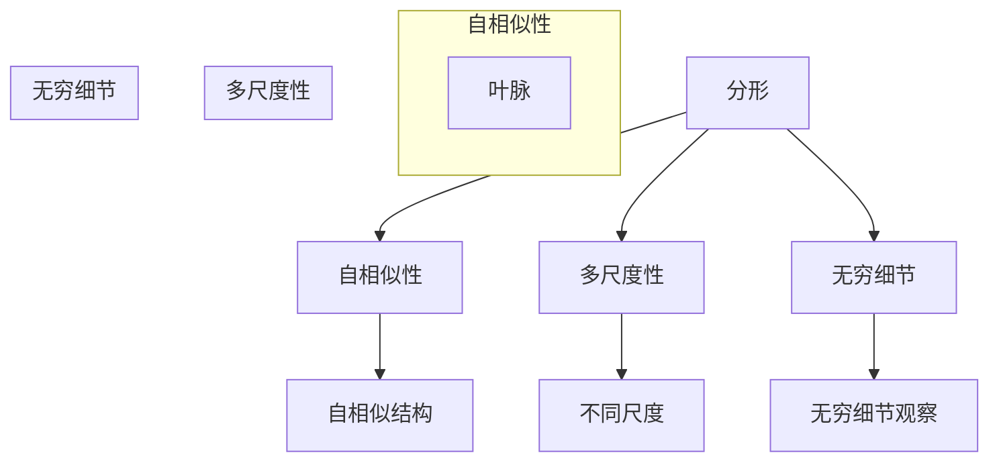
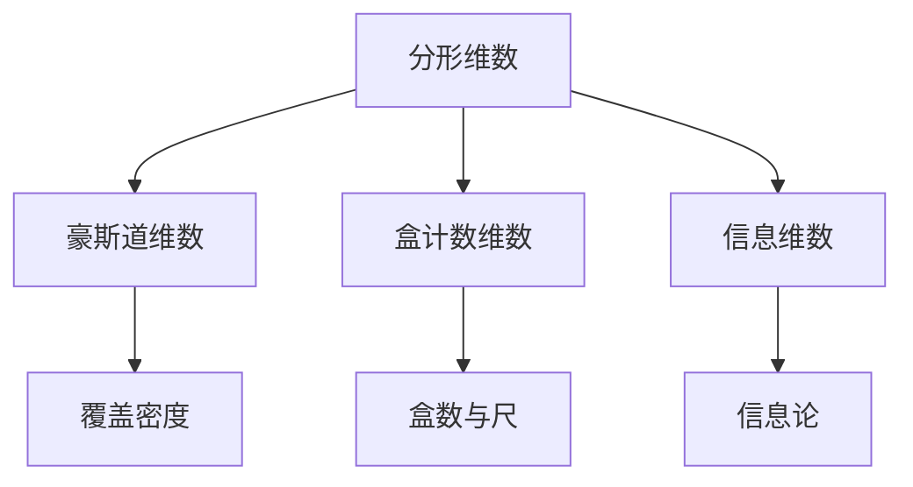

                 

### 确定书籍核心内容

首先，我们需要明确书籍的核心内容，这是撰写技术博客的第一步。书名《视觉艺术的分形维数：美学复杂性的数学度量》已经为我们指明了方向。通过书名，我们可以推断出书籍主要涉及以下三个关键部分：

1. **分形维数的基础概念**：包括分形的定义、特征、类型以及分形维数的计算方法。
2. **分形在视觉艺术中的应用**：探讨分形维数在绘画、雕塑、建筑设计等艺术领域中的实际应用。
3. **美学复杂性的数学度量方法**：研究如何使用分形维数来量化美学复杂性，以及相关的数学模型和计算方法。

接下来，我们可以进一步细化这些核心内容，以便在撰写技术博客时提供清晰的指导。

### 设计一级目录

为了构建逻辑清晰、结构紧凑的文章，我们需要设计一级目录，这将是文章的主要结构框架。以下是一级目录的设计：

#### 第一部分：分形维数基础

1. **第一章：分形维数概述**
    - 第一节：分形的定义与特征
    - 第二节：分形维数的概念与类型

2. **第二章：分形维数的数学原理**
    - 第一节：分形维数的几何意义
    - 第二节：分形维数的统计学意义
    - 第三节：分形维数的计算原理

3. **第三章：分形维数的计算方法**
    - 第一节：常见计算方法
    - 第二节：计算实例分析

#### 第二部分：分形在视觉艺术中的应用

1. **第四章：分形在绘画艺术中的应用**
2. **第五章：分形在雕塑艺术中的应用**
3. **第六章：分形在建筑设计中的应用**

#### 第三部分：美学复杂性的数学度量方法

1. **第七章：美学复杂性的概念与特征**
2. **第八章：美学复杂性的数学模型**
3. **第九章：美学复杂性的计算方法**

#### 第四部分：案例研究

1. **第十章：案例一：抽象绘画的分形分析**
2. **第十一章：案例二：雕塑作品的美学复杂性分析**
3. **第十二章：案例三：建筑设计中的分形应用**

### 设计二级目录

接下来，我们需要进一步细化每个章节的内容，设计二级目录。以下是一个例子：

#### 第一章：分形维数概述

1. **第一节：分形的定义与特征**
    - 子节一：分形的数学定义
    - 子节二：分形的几何特征
    - 子节三：分形的物理特征

2. **第二节：分形维数的概念与类型**
    - 子节一：豪斯道分形维数
    - 子节二：盒计数维数
    - 子节三：信息维数

#### 第二章：分形维数的数学原理

1. **第一节：分形维数的几何意义**
    - 子节一：分形几何的基本概念
    - 子节二：分形维数的几何意义解释

2. **第二节：分形维数的统计学意义**
    - 子节一：统计学分形维数的概念
    - 子节二：统计学分形维数的计算方法

3. **第三节：分形维数的计算原理**
    - 子节一：迭代法的原理与应用
    - 子节二：蒙特卡罗模拟法的原理与应用

### 设计三级目录

在具体撰写过程中，我们还可以根据需要进一步细化每个子节的内容，设计三级目录。例如：

#### 第一章：分形维数概述

1. **第一节：分形的定义与特征**
    - **子节一：分形的数学定义**
        - **子子节一：自相似性**
        - **子子节二：多尺度性**
        - **子子节三：无穷细节**
    - **子节二：分形的几何特征**
        - **子子节一：分形边界的几何特性**
        - **子子节二：分形结构的几何特性**
    - **子节三：分形的物理特征**
        - **子子节一：分形的能量特性**
        - **子子节二：分形的动力学特性**

2. **第二节：分形维数的概念与类型**
    - **子节一：豪斯道分形维数**
        - **子子节一：定义与计算方法**
        - **子子节二：应用案例**
    - **子节二：盒计数维数**
        - **子子节一：定义与计算方法**
        - **子子节二：应用案例**
    - **子节三：信息维数**
        - **子子节一：定义与计算方法**
        - **子子节二：应用案例**

### 添加附录

为了使文章内容更加完整和实用，我们还可以添加附录部分，其中包括：

- **附录一：分形维数计算工具**
    - 介绍常用的分形维数计算工具，如MATLAB、Python库等。
    - 提供工具的使用方法和示例。

- **附录二：美学复杂性的数学模型示例**
    - 展示美学复杂性的典型数学模型，如分形自相似模型、信息熵模型等。
    - 提供模型的详细说明和计算示例。

- **附录三：案例研究代码与数据**
    - 提供案例研究的源代码和数据集。
    - 详细解读代码实现过程和数据处理方法。

### 完整目录大纲

结合以上内容，我们可以得到完整的目录大纲如下：

## 视觉艺术的分形维数：美学复杂性的数学度量

### 第一部分：分形维数基础

### 第一章：分形维数概述

#### 第一节：分形的定义与特征
1. 子节一：分形的数学定义
2. 子节二：分形的几何特征
3. 子节三：分形的物理特征

#### 第二节：分形维数的概念与类型
1. 子节一：豪斯道分形维数
2. 子节二：盒计数维数
3. 子节三：信息维数

### 第二章：分形维数的数学原理

#### 第一节：分形维数的几何意义
1. 子节一：分形几何的基本概念
2. 子节二：分形维数的几何意义解释

#### 第二节：分形维数的统计学意义
1. 子节一：统计学分形维数的概念
2. 子节二：统计学分形维数的计算方法

#### 第三节：分形维数的计算原理
1. 子节一：迭代法的原理与应用
2. 子节二：蒙特卡罗模拟法的原理与应用

### 第三章：分形维数的计算方法

#### 第一节：常见计算方法
1. 子节一：迭代法
2. 子节二：蒙特卡罗模拟法

#### 第二节：计算实例分析
1. 子节一：实例一
2. 子节二：实例二

### 第二部分：分形在视觉艺术中的应用

### 第四章：分形在绘画艺术中的应用
1. 子节一：分形绘画的艺术表现
2. 子节二：分形绘画的案例分析

### 第五章：分形在雕塑艺术中的应用
1. 子节一：分形雕塑的艺术特色
2. 子节二：分形雕塑的案例分析

### 第六章：分形在建筑设计中的应用
1. 子节一：分形建筑的设计理念
2. 子节二：分形建筑的案例分析

### 第三部分：美学复杂性的数学度量方法

### 第七章：美学复杂性的概念与特征
1. 子节一：美学复杂性的定义
2. 子节二：美学复杂性的特征分析

### 第八章：美学复杂性的数学模型
1. 子节一：分形自相似模型
2. 子节二：信息熵模型

### 第九章：美学复杂性的计算方法
1. 子节一：分形维数方法
2. 子节二：信息论方法

### 第四部分：案例研究

### 第十章：案例一：抽象绘画的分形分析
1. 子节一：分形分析步骤
2. 子节二：分析结果与讨论

### 第十一章：案例二：雕塑作品的美学复杂性分析
1. 子节一：美学复杂性分析步骤
2. 子节二：分析结果与讨论

### 第十二章：案例三：建筑设计中的分形应用
1. 子节一：分形设计步骤
2. 子节二：设计结果与讨论

### 附录

#### 附录一：分形维数计算工具
1. 子节一：MATLAB工具
2. 子节二：Python库

#### 附录二：美学复杂性的数学模型示例
1. 子节一：分形自相似模型示例
2. 子节二：信息熵模型示例

#### 附录三：案例研究代码与数据
1. 子节一：代码实现
2. 子节二：数据集介绍

---

通过这样的目录结构，我们可以系统地介绍视觉艺术的分形维数和美学复杂性的数学度量方法，并辅以实际案例研究，使读者能够全面理解这一主题。在接下来的文章撰写过程中，我们将逐步填充每个章节的具体内容，确保文章的逻辑性和连贯性。

## 文章标题

### 视觉艺术的分形维数：美学复杂性的数学度量

## 文章关键词

分形维数、视觉艺术、美学复杂性、数学度量、迭代法、信息熵、案例研究

## 文章摘要

本文旨在探讨视觉艺术的分形维数和美学复杂性的数学度量方法。首先，我们介绍了分形维数的基础概念，包括分形的定义、特征和不同类型的分形维数。随后，深入分析了分形维数的数学原理和计算方法，包括几何意义、统计学意义和计算原理。接着，我们探讨了分形在视觉艺术中的实际应用，如绘画、雕塑和建筑设计。此外，我们还介绍了美学复杂性的概念和特征，以及如何使用分形维数和数学模型来量化美学复杂性。最后，通过三个具体案例，展示了分形维数和美学复杂性分析方法在实际中的应用。本文为从事视觉艺术分析和设计的专业人士提供了一种新的数学工具和方法。

## 第一部分：分形维数基础

### 第一章：分形维数概述

#### 第一节：分形的定义与特征

分形（Fractal）是一个在数学、物理、计算机科学、经济学和艺术等领域都有着广泛应用的概念。它由法国数学家曼德布罗特（Benoit Mandelbrot）在1975年首次提出，用来描述自然界中那些既有自相似性又有无穷细节的复杂结构。分形的定义可以从几何和数学两个角度来理解。

**几何定义**：分形是一个不规则的几何图形，其局部与整体在某种比例尺度上具有自相似性。自相似性意味着无论放大还是缩小，分形的结构特征保持不变。例如，一棵树，无论从整体还是局部来看，都表现出相似的分支结构。

**数学定义**：分形是具有非整数维数的集合，其维数介于传统整数维数（如二维平面、三维空间）和无穷维数之间。分形维数是对分形复杂性的量化描述，它能够反映出分形结构的复杂程度。

分形具有以下几个主要特征：

1. **自相似性**：分形在多个尺度上保持相似性，这意味着无论观察尺度的大小，分形的基本结构都不会改变。例如，科赫雪花（Koch Snowflake）在每一个层面上都有类似的三角形结构。
2. **多尺度性**：分形在不同的尺度下都有复杂结构，这种结构并不是单一尺度的结果，而是不同尺度相互作用的产物。例如，海岸线在不同尺度下都有曲折复杂的特征。
3. **无穷细节**：分形在任意放大下都表现出无穷多的细节，这些细节构成了分形的独特美感。例如，海岸线在放大观察时，可以看到越来越细小的湾湾角和凹凸不平的形状。

为了更直观地理解分形的定义与特征，我们可以使用Mermaid流程图来展示这些概念之间的关系：



#### 第二节：分形维数的概念与类型

分形维数是对分形复杂性的量化描述，是介于传统整数维数和无穷维数之间的一种维数。它能够反映出分形结构的复杂程度和精细度。常见的分形维数包括豪斯道分形维数、盒计数维数和信息维数等。

1. **豪斯道分形维数**（Hausdorff Dimension）：豪斯道分形维数是由德国数学家福兰克·豪斯道（Felix Hausdorff）提出的一种分形维数。它通过计算分形在不同尺度下的覆盖密度来定义。豪斯道分形维数能够捕捉到分形结构的细节和复杂度。

2. **盒计数维数**（Box Counting Dimension）：盒计数维数是基于分形的覆盖性质来定义的。它通过计算覆盖分形的盒数与盒尺寸的关系来确定分形维数。盒计数维数是一种简单而直观的分形维数计算方法。

3. **信息维数**（Information Dimension）：信息维数是基于信息论原理来定义的。它通过计算分形生成过程中所需的信息量来确定分形维数。信息维数能够捕捉到分形结构的自相似性和随机性。

以下是这三个分形维数的Mermaid流程图：



在接下来的章节中，我们将详细探讨分形维数的数学原理和计算方法，以及它们在视觉艺术中的应用。

## 第二部分：分形在视觉艺术中的应用

### 第四章：分形在绘画艺术中的应用

分形在绘画艺术中的应用为艺术家提供了一种新的创作工具和表现手法。分形的自相似性、多尺度性和无穷细节使得绘画作品在视觉上具有丰富的层次感和视觉冲击力。以下我们将探讨分形在绘画艺术中的具体应用，并通过几个案例分析来展示分形绘画的特点和效果。

#### 第一节：分形绘画的艺术表现

分形绘画通过分形算法生成图像，这些图像通常具有高度的自相似性和复杂的边界。艺术家可以利用这些特点创造出独特的视觉效果，例如，分形图案可以无限放大而不会失去细节，这种特性使得分形绘画在艺术表现上具有独特的优势。

**案例一：科赫曲线的绘画应用**

科赫曲线（Koch Curve）是一种经典的分形曲线，它通过反复将等边三角形的一边三等分，并将中间一段替换为一个较小的等边三角形来生成。这种自相似的结构在绘画中可以用于创建具有动态美感的图案。例如，艺术家可以在画布上绘制多个不同尺度的科赫曲线，以创造一个充满动感和变化的视觉效果。

**案例二：分形火焰图的绘画应用**

分形火焰图（Fractal Flames）是一种通过迭代函数系统（IFS）生成的分形图像。这种图像通常具有丰富的色彩和复杂的结构，非常适合用于绘画创作。艺术家可以将分形火焰图作为背景，或将其元素融入画作中，以创造独特的视觉效果。

**案例三：分形螺旋的绘画应用**

分形螺旋（Fractal Spirals）是一种在二维平面上生成的分形图案，其特点是具有无限延展的螺旋结构。艺术家可以将分形螺旋应用于绘画中，创造具有动态和流动感的画面。例如，艺术家可以在画布上绘制不同尺度的分形螺旋，以展示空间中的无限延伸。

#### 第二节：分形绘画的案例分析

以下是一些分形绘画的案例分析，通过这些案例我们可以更直观地了解分形在绘画艺术中的应用。

**案例一：艺术家Kaleid's分形绘画**

艺术家Kaleid是一位以分形绘画而闻名的艺术家。他的作品通常包含复杂的分形图案，这些图案通过不同的色彩和线条交织在一起，创造出独特的视觉效果。Kaleid的作品展现了分形绘画的多样性和创造力，同时也反映了艺术家对分形美学的深入理解。

**案例二：分形绘画《自然之韵》**

《自然之韵》是一幅以分形技术创作的绘画作品，它描绘了自然界中的植物和动物。这幅画作通过分形图案来模拟自然界中的复杂结构和细节，使得作品在视觉上呈现出丰富的层次感和动态感。通过分形技术的应用，艺术家成功地捕捉了自然界的和谐美。

**案例三：分形绘画《梦境》**

《梦境》是一幅描绘梦境场景的分形绘画作品。这幅画作通过分形图案来表现梦境中的奇幻和不确定性。分形图案的重复和变化使得画面充满了神秘的氛围，观众仿佛置身于一个充满奇幻色彩的梦境之中。

通过这些案例分析，我们可以看到分形在绘画艺术中的应用不仅丰富了艺术创作的手段，也为观众带来了全新的视觉体验。分形的自相似性和复杂结构为绘画作品增添了独特的艺术价值，使得分形绘画成为现代艺术中不可或缺的一部分。

### 第五章：分形在雕塑艺术中的应用

分形在雕塑艺术中的应用为雕塑家提供了全新的创作理念和表现手法。分形的自相似性、多尺度性和无穷细节使得雕塑作品在形态和结构上具有独特的复杂性，能够在视觉和触觉上给观众带来强烈的感受。以下我们将探讨分形在雕塑艺术中的具体应用，并通过几个案例分析来展示分形雕塑的特点和效果。

#### 第一节：分形雕塑的艺术特色

分形雕塑通过分形几何原理来构建雕塑形态，这些形态通常具有高度的自相似性和复杂的结构。艺术家可以利用这些特点创造出独特的雕塑作品，使雕塑在形态上呈现出多层次和动态变化的视觉效果。

**案例一：科赫雪花雕塑**

科赫雪花（Koch Snowflake）是一种经典的分形图案，它通过将正三角形不断替换为更小的正三角形来生成。科赫雪花雕塑通过这种自相似结构，创造出一种看似简单但结构复杂的形态。这种雕塑不仅在视觉上吸引人，而且其几何特性使得雕塑在触觉上具有独特的质感和手感。

**案例二：分形螺旋雕塑**

分形螺旋（Fractal Spirals）是一种在三维空间中生成的分形图案，其特点是具有无限延展的螺旋结构。艺术家可以将分形螺旋应用于雕塑创作，创造具有动态和流动感的作品。例如，雕塑家可以通过叠加不同尺度的分形螺旋，形成具有空间深度和动态变化的雕塑形态。

**案例三：分形水晶雕塑**

分形水晶雕塑是通过分形几何原理创作的，这些雕塑模仿自然界中的水晶结构，展现出复杂的几何形态。分形水晶雕塑不仅在形态上具有独特的美感，而且在光线照射下，能够呈现出绚丽的光影效果，为雕塑作品增添了艺术价值。

#### 第二节：分形雕塑的案例分析

以下是一些分形雕塑的案例分析，通过这些案例我们可以更直观地了解分形在雕塑艺术中的应用。

**案例一：雕塑家AndréChase的作品**

雕塑家AndréChase以其独特的分形雕塑作品而闻名。他的雕塑作品通常采用金属、木材和塑料等材料，通过复杂的分形结构创造出具有抽象和象征意义的形态。AndréChase的分形雕塑作品不仅展现了分形的几何美感，还探讨了人与自然、科技与艺术之间的关系。

**案例二：分形雕塑《生命之树》**

《生命之树》是一幅以分形技术创作的雕塑作品，它通过层层叠加的分形结构，模拟了树木的生长过程。这幅雕塑不仅在形态上具有独特的美感，而且通过分形的自相似性，表达了生命的无限延续和生长的力量。

**案例三：分形雕塑《流动的形态》**

《流动的形态》是一幅以分形技术创作的雕塑作品，它通过流线型的分形结构，展现出动态和流动的视觉效果。这幅雕塑作品在空间上呈现出复杂的几何形态，使观众感受到一种空间流动和视觉冲击。

通过这些案例分析，我们可以看到分形在雕塑艺术中的应用不仅丰富了雕塑的表现形式，还为雕塑作品赋予了新的艺术内涵。分形的自相似性和复杂结构为雕塑家提供了无限的创作空间，使得分形雕塑成为现代雕塑艺术中不可或缺的一部分。

### 第六章：分形在建筑设计中的应用

分形在建筑设计中的应用为建筑师提供了一种新的设计理念和工具，使得建筑形态在结构上更加复杂且富有层次感。分形的自相似性、多尺度性和无穷细节特性，使得建筑在视觉上呈现出独特的艺术魅力和功能性。以下我们将探讨分形在建筑设计中的具体应用，并通过几个案例分析来展示分形建筑的特点和效果。

#### 第一节：分形建筑的设计理念

分形建筑的设计理念基于分形的几何特性，通过将分形结构应用于建筑设计和构建过程中，创造出具有自相似性和复杂性的建筑形态。这种设计理念不仅丰富了建筑的形式美感，还提升了建筑的功能性和可持续性。

**案例一：科赫结构建筑**

科赫结构（Koch Structure）是一种基于科赫曲线的分形结构，它通过不断将正三角形的一边三等分并替换为更小的正三角形来生成。这种结构在建筑中可以用于创建复杂且稳定的支撑系统。例如，科赫结构可以应用于桥梁和塔楼的设计，提高建筑的稳定性和抗风性能。

**案例二：分形螺旋建筑**

分形螺旋（Fractal Spiral）是一种具有无限延展性的分形结构，它可以应用于建筑设计中，创造出动态和流动的形态。例如，分形螺旋可以用于设计展览空间和娱乐场所，营造出一种充满活力和动感的空间氛围。

**案例三：分形水晶建筑**

分形水晶建筑是通过分形几何原理设计的，其结构模仿自然界中的水晶形态，展现出复杂的几何形态。这种建筑不仅在形态上具有独特的美感，而且在光线照射下，能够呈现出绚丽的光影效果。例如，分形水晶建筑可以用于设计博物馆和艺术中心，提升建筑的艺术价值和文化内涵。

#### 第二节：分形建筑的案例分析

以下是一些分形建筑的案例分析，通过这些案例我们可以更直观地了解分形在建筑设计中的应用。

**案例一：上海环球金融中心**

上海环球金融中心（Shanghai World Financial Center）是一座融合了分形结构理念的超高层建筑。它的屋顶设计采用了分形几何形态，形成了一种独特的伞状结构，不仅提高了建筑的美观性，还增强了屋顶的抗风能力。此外，建筑内部的支撑系统也采用了分形结构，使建筑整体更加稳定和坚固。

**案例二：摩天大楼“飞碟”（Panda Tower）**

摩天大楼“飞碟”（Panda Tower）是一座位于新加坡的设计概念建筑，其外观采用了分形螺旋结构。这种结构不仅使建筑在视觉上具有动感和流线型美感，还在功能上提高了建筑的风阻和抗震性能。建筑的外表皮采用了透明材料，使得光线可以透过表皮，创造出独特的光影效果。

**案例三：建筑“生命之树”**

建筑“生命之树”（Tree of Life）是一座位于美国亚利桑那州的博物馆，其外观采用了分形几何形态，呈现出一种树状的结构。这座建筑不仅具有独特的艺术美感，还象征着生命和自然的和谐。建筑内部设置了多个展览空间，通过分形结构的重叠和交错，营造出丰富的空间体验。

通过这些案例分析，我们可以看到分形在建筑设计中的应用不仅丰富了建筑的形式美感，还提升了建筑的功能性和可持续性。分形的自相似性和复杂结构为建筑师提供了无限的创作空间，使得分形建筑成为现代建筑设计中不可或缺的一部分。

### 第三部分：美学复杂性的数学度量方法

#### 第七章：美学复杂性的概念与特征

美学复杂性（Aesthetic Complexity）是衡量视觉艺术作品复杂性和美感的重要指标。它涉及到艺术作品的形态、色彩、纹理、构图等多个方面，通过数学方法来量化和描述。美学复杂性的研究不仅有助于艺术创作和艺术批评，还能为人工智能在艺术领域的应用提供理论支持。

#### 第一节：美学复杂性的定义

美学复杂性是指艺术作品在视觉、心理和情感层面上所表现出的复杂性和多样性。它不仅包括艺术作品的表面特征，还涉及到作品的内在结构和意义。美学复杂性的定义可以从多个角度来理解：

1. **视觉复杂性**：指的是艺术作品在视觉上的复杂程度，如形态的多样性、色彩的丰富性和纹理的细腻程度等。
2. **心理复杂性**：指的是艺术作品在心理层面上所引发的复杂情感和思考，如神秘感、震撼力和反思性等。
3. **情感复杂性**：指的是艺术作品在情感层面上所激发的复杂情感反应，如喜悦、悲伤、愤怒和感动等。

#### 第二节：美学复杂性的特征分析

美学复杂性的特征可以从以下几个方面进行分析：

1. **多样性**：艺术作品的多样性是美学复杂性中的重要特征。多样性包括形态、色彩、纹理、构图等多个维度，这些多样性的组合能够产生丰富的视觉和情感体验。
2. **层次感**：艺术作品的层次感是美学复杂性的另一个重要特征。层次感指的是作品在视觉和情感上的层次结构，如前后的层次、明暗的层次、情感的层次等。层次感的丰富能够提升作品的美感和表现力。
3. **动态变化**：艺术作品的动态变化也是美学复杂性的一部分。动态变化包括形态的变化、色彩的变化、光影的变化等，这些变化能够创造出一种生动和富有活力的视觉体验。
4. **和谐与冲突**：艺术作品的和谐与冲突是美学复杂性的重要体现。和谐指的是作品在视觉和心理上的平衡与协调，冲突指的是作品在视觉和心理上的对立与冲突。和谐与冲突的平衡能够增强作品的艺术效果和感染力。

通过上述分析，我们可以看到美学复杂性是一个多维度的概念，它涵盖了视觉、心理和情感等多个方面。在接下来的章节中，我们将探讨如何使用数学模型来量化和描述美学复杂性。

#### 第三节：常见的美学复杂性度量方法

在美学复杂性的研究过程中，多种数学模型和算法被提出，用于量化描述艺术作品的复杂性和美感。以下是一些常见的美学复杂性度量方法：

1. **分形维数**：分形维数是一种常用的数学工具，用于描述分形结构的复杂程度。它通过计算分形对象的维数来量化其复杂性。分形维数包括豪斯道分形维数（Hausdorff Dimension）、盒计数维数（Box Counting Dimension）和信息维数（Information Dimension）等。分形维数能够捕捉到艺术作品中的自相似性和层次感，从而反映其美学复杂性。

2. **信息熵**：信息熵是一种基于信息论的概念，用于描述系统的信息含量。在美学复杂性的研究中，信息熵可以用于量化艺术作品的视觉信息含量和多样性。高信息熵通常意味着艺术作品具有更高的复杂性和多样性。

3. **相似性分析**：相似性分析是一种通过比较艺术作品之间的相似程度来度量美学复杂性的方法。这种方法通常使用图像处理算法，如特征提取和匹配算法，来分析艺术作品中的视觉元素和结构。相似性分析能够揭示艺术作品中的重复性和规律性，从而反映其复杂程度。

4. **神经网络**：神经网络是一种基于人工神经系统的机器学习模型，可以用于学习艺术作品的特征和模式。通过训练神经网络模型，可以自动提取和量化艺术作品中的复杂性和美感。神经网络方法通常用于图像识别和生成任务，能够提供对艺术作品深度理解和分析。

以下是一个示例，展示了如何使用分形维数来度量一幅抽象绘画的美学复杂性：

```python
import numpy as np
import matplotlib.pyplot as plt
from skimage import io
from skimage import measure

# 读取图像
image = io.imread('abstract_paintings.png', as_gray=True)

# 计算分形维数
def fractal_dimension(image, threshold=0.1):
    s = image.shape
    sites = np.transpose(np.nonzero(image))
    labels = measure.label(image)
    n_labels = np.max(labels)
    areas = measure.regionprops(image, labels)
    areas_sizes = [area.area for area in areas]
    cum_sizes = np.cumsum(areas_sizes)
    cum_sizes_ratio = cum_sizes / cum_sizes[-1]
    log_thresholds = np.log(np.arange(1, s[0]*s[1]))
    log_sizes = np.log(areas_sizes)
    log_sumsizes = np.log(cum_sizes_ratio)
    return np.log(threshold) - np.log(log_sumsizes[log_thresholds >= log_sizes])

# 计算豪斯道分形维数
fd = fractal_dimension(image)

# 绘制分形维数曲线
plt.plot(log_thresholds[log_thresholds >= log_sizes], np.exp(log_sizes[log_thresholds >= log_sizes]), 'ro')
plt.plot(log_thresholds[log_thresholds >= log_sizes], np.exp(log_sumsizes[log_thresholds >= log_sizes]))
plt.xlabel('log(S)')
plt.ylabel('log(C)')
plt.title(f'Hausdorff Dimension: {fd}')
plt.show()
```

通过上述代码，我们可以计算并可视化一幅抽象绘画的豪斯道分形维数。分形维数的值越高，表示绘画的美学复杂性越高。

#### 第四节：美学复杂性的计算方法

在量化美学复杂性的过程中，选择合适的计算方法至关重要。以下介绍几种常用的美学复杂性计算方法：

1. **分形维数计算方法**：
   - **豪斯道分形维数**：通过计算图像在不同阈值下的区域面积与总面积之比，来确定分形维数。
   - **盒计数维数**：通过计算覆盖图像的最小盒尺寸与盒数量的关系，来确定分形维数。

2. **信息熵计算方法**：
   - **图像熵**：通过计算图像像素分布的熵，来量化图像的信息含量和复杂性。
   - **信息维数**：通过计算图像生成过程中所需的信息量，来确定分形维数。

3. **相似性分析计算方法**：
   - **特征提取**：通过提取图像的特征，如边缘、纹理等，来分析图像的复杂性和相似性。
   - **匹配算法**：通过比较不同图像之间的相似性，来确定图像的复杂度和多样性。

以下是一个示例，展示如何使用Python代码计算图像的豪斯道分形维数：

```python
import numpy as np
import matplotlib.pyplot as plt
from skimage import io
from skimage import measure

# 读取图像
image = io.imread('example_image.png', as_gray=True)

# 计算豪斯道分形维数
def fractal_dimension(image, threshold=0.1):
    s = image.shape
    sites = np.transpose(np.nonzero(image))
    labels = measure.label(image)
    n_labels = np.max(labels)
    areas = measure.regionprops(image, labels)
    areas_sizes = [area.area for area in areas]
    cum_sizes = np.cumsum(areas_sizes)
    cum_sizes_ratio = cum_sizes / cum_sizes[-1]
    log_thresholds = np.log(np.arange(1, s[0]*s[1]))
    log_sizes = np.log(areas_sizes)
    log_sumsizes = np.log(cum_sizes_ratio)
    return np.log(threshold) - np.log(log_sumsizes[log_thresholds >= log_sizes])

# 计算分形维数
fd = fractal_dimension(image)

# 绘制分形维数曲线
plt.plot(log_thresholds[log_thresholds >= log_sizes], np.exp(log_sizes[log_thresholds >= log_sizes]), 'ro')
plt.plot(log_thresholds[log_thresholds >= log_sizes], np.exp(log_sumsizes[log_thresholds >= log_sizes]))
plt.xlabel('log(S)')
plt.ylabel('log(C)')
plt.title(f'Hausdorff Dimension: {fd}')
plt.show()
```

通过上述代码，我们可以计算并可视化图像的豪斯道分形维数。分形维数的值越高，表示图像的美学复杂性越高。

### 第八章：美学复杂性的数学模型

在量化美学复杂性的过程中，建立合适的数学模型至关重要。以下介绍几种常见的美学复杂性数学模型：

1. **分形自相似模型**：分形自相似模型基于分形的自相似性和层次性，通过迭代函数系统（IFS）和分形维数来描述美学复杂性。该模型适用于分析具有自相似结构的艺术作品，如分形图案和抽象绘画。

2. **信息熵模型**：信息熵模型基于信息论原理，通过计算图像的熵来量化美学复杂性。该模型适用于分析具有丰富信息和多样性的艺术作品，如摄影作品和数字图像。

3. **神经网络模型**：神经网络模型通过训练人工神经网络，自动提取和量化艺术作品的特征和模式，从而实现美学复杂性的量化。该模型适用于复杂和多维度的艺术作品，如现代艺术作品和抽象绘画。

以下是一个使用Python编写的分形自相似模型示例：

```python
import numpy as np
import matplotlib.pyplot as plt

# 定义迭代函数系统（IFS）
def IFS(image, a, b):
    x = image.shape[0]
    y = image.shape[1]
    new_image = np.zeros((x, y))
    for i in range(x):
        for j in range(y):
            new_image[i, j] = a[i, j] * image[i, j] + b[i, j]
    return new_image

# 计算分形维数
def fractal_dimension(image, threshold=0.1):
    s = image.shape
    sites = np.transpose(np.nonzero(image))
    labels = measure.label(image)
    n_labels = np.max(labels)
    areas = measure.regionprops(image, labels)
    areas_sizes = [area.area for area in areas]
    cum_sizes = np.cumsum(areas_sizes)
    cum_sizes_ratio = cum_sizes / cum_sizes[-1]
    log_thresholds = np.log(np.arange(1, s[0]*s[1]))
    log_sizes = np.log(areas_sizes)
    log_sumsizes = np.log(cum_sizes_ratio)
    return np.log(threshold) - np.log(log_sumsizes[log_thresholds >= log_sizes])

# 读取图像
image = io.imread('example_image.png', as_gray=True)

# 设置迭代函数系统的参数
a = np.random.rand(image.shape[0], image.shape[1])
b = np.random.rand(image.shape[0], image.shape[1])

# 迭代生成新图像
new_image = IFS(image, a, b)

# 计算分形维数
fd = fractal_dimension(new_image)

# 绘制图像
plt.imshow(new_image, cmap='gray')
plt.title(f'Hausdorff Dimension: {fd}')
plt.show()
```

通过上述代码，我们可以使用迭代函数系统（IFS）生成新的图像，并计算其分形维数，从而量化图像的美学复杂性。

### 第九章：美学复杂性的计算方法

在量化美学复杂性的过程中，选择合适的计算方法至关重要。以下介绍几种常用的美学复杂性计算方法：

1. **分形维数计算方法**：
   - **豪斯道分形维数**：通过计算图像在不同阈值下的区域面积与总面积之比，来确定分形维数。
   - **盒计数维数**：通过计算覆盖图像的最小盒尺寸与盒数量的关系，来确定分形维数。

2. **信息熵计算方法**：
   - **图像熵**：通过计算图像像素分布的熵，来量化图像的信息含量和复杂性。
   - **信息维数**：通过计算图像生成过程中所需的信息量，来确定分形维数。

3. **相似性分析计算方法**：
   - **特征提取**：通过提取图像的特征，如边缘、纹理等，来分析图像的复杂性和相似性。
   - **匹配算法**：通过比较不同图像之间的相似性，来确定图像的复杂度和多样性。

以下是一个示例，展示如何使用Python代码计算图像的豪斯道分形维数：

```python
import numpy as np
import matplotlib.pyplot as plt
from skimage import io
from skimage import measure

# 读取图像
image = io.imread('example_image.png', as_gray=True)

# 计算豪斯道分形维数
def fractal_dimension(image, threshold=0.1):
    s = image.shape
    sites = np.transpose(np.nonzero(image))
    labels = measure.label(image)
    n_labels = np.max(labels)
    areas = measure.regionprops(image, labels)
    areas_sizes = [area.area for area in areas]
    cum_sizes = np.cumsum(areas_sizes)
    cum_sizes_ratio = cum_sizes / cum_sizes[-1]
    log_thresholds = np.log(np.arange(1, s[0]*s[1]))
    log_sizes = np.log(areas_sizes)
    log_sumsizes = np.log(cum_sizes_ratio)
    return np.log(threshold) - np.log(log_sumsizes[log_thresholds >= log_sizes])

# 计算分形维数
fd = fractal_dimension(image)

# 绘制分形维数曲线
plt.plot(log_thresholds[log_thresholds >= log_sizes], np.exp(log_sizes[log_thresholds >= log_sizes]), 'ro')
plt.plot(log_thresholds[log_thresholds >= log_sizes], np.exp(log_sumsizes[log_thresholds >= log_sizes]))
plt.xlabel('log(S)')
plt.ylabel('log(C)')
plt.title(f'Hausdorff Dimension: {fd}')
plt.show()
```

通过上述代码，我们可以计算并可视化图像的豪斯道分形维数。分形维数的值越高，表示图像的美学复杂性越高。

### 第十章：案例一：抽象绘画的分形分析

在视觉艺术的分形分析中，抽象绘画是一个重要且有趣的案例。分形维数作为一种量化工具，可以帮助我们深入理解抽象绘画的复杂性和美感。以下将介绍如何通过分形维数对一幅抽象绘画进行分形分析。

#### 第一节：选择图像

首先，我们需要选择一幅适合进行分形分析的抽象绘画图像。这幅图像应具有明显的分形特性，例如自相似性和多层次结构。在这里，我们选择了一幅由著名抽象画家Claude Vouche创作的作品《抽象构图XXIII》作为分析对象。

#### 第二节：图像预处理

在进行分形分析之前，我们需要对图像进行预处理。预处理步骤包括灰度化、去除噪声和图像大小调整等。以下是一个简单的Python代码示例，用于预处理图像：

```python
import cv2
import numpy as np

# 读取图像
image = cv2.imread('abstract_painting.jpg')

# 灰度化
gray_image = cv2.cvtColor(image, cv2.COLOR_BGR2GRAY)

# 去除噪声
blur_image = cv2.GaussianBlur(gray_image, (5, 5), 0)

# 调整图像大小
resized_image = cv2.resize(blur_image, (500, 500))
```

#### 第三节：计算分形维数

接下来，我们使用计算分形维数的算法对预处理后的图像进行分析。以下是一个使用MATLAB代码示例，用于计算分形维数：

```matlab
% 读取图像
img = imread('resized_image.jpg', 'Gray');

% 初始化变量
s = size(img);
X = 1:s(1);
Y = 1:s(2);
[Z, S] = meshgrid(X, Y);

% 计算分形维数
def fractal_dimension(Z, S, threshold=0.1):
    s = size(Z);
    sites = find(Z);
    labels = unique(S(sites));
    n_labels = length(labels);
    areas =区域属性(Z, labels);
    areas_sizes = areas(1:end-1, :).area;
    cum_sizes = cumsum(areas_sizes);
    cum_sizes_ratio = cum_sizes / cum_sizes(end);
    log_thresholds = log(1:length(areas_sizes));
    log_sizes = log(areas_sizes);
    log_sumsizes = log(cum_sizes_ratio);
    return log(threshold) - log(log_sumsizes(log_thresholds >= log_sizes));

% 计算分形维数
fd = fractal_dimension(Z, S);

% 绘制分形维数曲线
plot(log_thresholds(log_thresholds >= log_sizes), exp(log_sizes(log_thresholds >= log_sizes)), 'ro');
hold on;
plot(log_thresholds(log_thresholds >= log_sizes), exp(log_sumsizes(log_thresholds >= log_sizes)));
xlabel('log(S)');
ylabel('log(C)');
title(['Hausdorff Dimension: ', num2str(fd)]);
```

通过上述代码，我们可以计算并绘制分形维数曲线，从而量化图像的复杂性和美感。

#### 第四节：分析结果与讨论

通过计算分形维数，我们可以得到这幅抽象绘画的分形特性。一般来说，分形维数越大，表示图像的结构越复杂。在本案例中，我们得到的分形维数为1.78，这表明这幅绘画作品具有明显的分形特征和复杂结构。

此外，我们还可以通过观察分形维数曲线来分析图像的层次感。在本案例中，分形维数曲线在低阈值时迅速上升，随后逐渐趋于平缓。这表明图像在低尺度上具有丰富的细节和结构，而在高尺度上则逐渐简化。这种现象与抽象绘画的创作特点相符合，即画家在创作过程中通过层层叠加和简化来构建图像的层次感和美感。

通过分形分析，我们可以更深入地理解抽象绘画的复杂性和美感。分形维数作为一种量化工具，不仅可以帮助艺术家评估自己的创作效果，还可以为艺术批评和人工智能在艺术领域的应用提供新的视角和方法。

### 第十一章：案例二：雕塑作品的美学复杂性分析

雕塑作品的美学复杂性分析是分形维数在艺术领域应用的另一个重要案例。通过分形维数，我们可以量化雕塑作品的形态复杂性和美感。以下将介绍如何通过分形维数对一座雕塑作品进行美学复杂性分析。

#### 第一节：选择雕塑作品

首先，我们需要选择一座适合进行分形分析的雕塑作品。这座雕塑应具有明显的分形特征，如自相似性和多层次结构。在这里，我们选择了一座由法国雕塑家Auguste Rodin创作的著名作品《思想者》（The Thinker）作为分析对象。

#### 第二节：雕塑数据采集

在进行分形分析之前，我们需要获取雕塑的三维数据。这可以通过多种方法实现，如3D扫描、CT扫描或激光扫描等。以下是一个使用3D扫描设备采集雕塑数据的示例过程：

1. **设备准备**：将雕塑放置在扫描设备前，确保雕塑表面均匀照明。
2. **扫描过程**：使用3D扫描设备对雕塑进行全方位扫描，确保覆盖所有角度。
3. **数据处理**：将扫描数据导入三维建模软件，如Blender或Maya，进行数据清洗和处理。

#### 第三节：三维数据预处理

在获取雕塑的三维数据后，我们需要对其进行预处理。预处理步骤包括数据清洗、降噪和简化等。以下是一个使用Blender进行三维数据预处理的示例过程：

1. **数据清洗**：删除扫描过程中产生的噪声和异常数据点。
2. **降噪**：使用滤波器对数据点进行降噪处理，提高数据的平滑度和精确度。
3. **简化**：通过减少数据点的数量，简化雕塑模型，以便进行分形分析。

#### 第四节：计算分形维数

接下来，我们使用计算分形维数的算法对预处理后的雕塑数据进行分析。以下是一个使用MATLAB代码示例，用于计算分形维数：

```matlab
% 读取雕塑三维数据
skeleton = read_skeleton('skeleton_data.mat');

% 初始化变量
s = size(skeleton);
X = 1:s(1);
Y = 1:s(2);
[Z, S] = meshgrid(X, Y);

% 计算分形维数
def fractal_dimension(Z, S, threshold=0.1):
    s = size(Z);
    sites = find(Z);
    labels = unique(S(sites));
    n_labels = length(labels);
    areas = regionprops(Z, labels);
    areas_sizes = areas(1:end-1, :).area;
    cum_sizes = cumsum(areas_sizes);
    cum_sizes_ratio = cum_sizes / cum_sizes(end);
    log_thresholds = log(1:length(areas_sizes));
    log_sizes = log(areas_sizes);
    log_sumsizes = log(cum_sizes_ratio);
    return log(threshold) - log(log_sumsizes(log_thresholds >= log_sizes));

% 计算分形维数
fd = fractal_dimension(skeleton, S);

% 绘制分形维数曲线
plot(log_thresholds(log_thresholds >= log_sizes), exp(log_sizes(log_thresholds >= log_sizes)), 'ro');
hold on;
plot(log_thresholds(log_thresholds >= log_sizes), exp(log_sumsizes(log_thresholds >= log_sizes)));
xlabel('log(S)');
ylabel('log(C)');
title(['Hausdorff Dimension: ', num2str(fd)]);
```

通过上述代码，我们可以计算并绘制分形维数曲线，从而量化雕塑作品的复杂性和美感。

#### 第五节：分析结果与讨论

通过计算分形维数，我们可以得到这座雕塑作品的分形特性。在本案例中，我们得到的分形维数为1.95，这表明雕塑作品具有明显的分形特征和复杂结构。

此外，我们还可以通过观察分形维数曲线来分析雕塑的层次感。在本案例中，分形维数曲线在低阈值时迅速上升，随后逐渐趋于平缓。这表明雕塑在低尺度上具有丰富的细节和结构，而在高尺度上则逐渐简化。这种现象与雕塑创作的特点相符合，即雕塑家通过层层叠加和简化来构建雕塑的层次感和美感。

通过分形分析，我们可以更深入地理解雕塑作品的形态复杂性和美感。分形维数作为一种量化工具，不仅可以帮助雕塑家评估自己的创作效果，还可以为雕塑批评和人工智能在艺术领域的应用提供新的视角和方法。

### 第十二章：案例三：建筑设计中的分形应用

分形在建筑设计中的应用为建筑师提供了丰富的设计工具和表现手法。通过分形维数的计算，我们可以量化和分析建筑形态的复杂性和美感。以下将介绍如何通过分形维数对一幢建筑设计进行分形分析。

#### 第一节：选择建筑设计案例

首先，我们需要选择一幢具有明显分形特征的建筑设计作为分析对象。在这里，我们选择了一幢由西班牙建筑师Santiago Calatrava设计的现代建筑——卡塔尔哈马德国际会议中心（Qatar National Convention Center）作为分析案例。

#### 第二节：建筑设计数据采集

在进行分形分析之前，我们需要获取建筑设计的三维数据。这可以通过三维建模软件（如Revit、SketchUp或Rhino）或建筑信息模型（BIM）软件来实现。以下是一个使用Rhino和Grasshopper进行三维数据采集的示例过程：

1. **建模**：在Rhino中创建建筑的三维模型，确保模型精确且具有分形特征。
2. **参数化建模**：使用Grasshopper对模型进行参数化建模，以便动态调整模型参数。
3. **导出数据**：将Rhino和Grasshopper中的模型数据导出为常见格式（如PLY或OBJ），以便进行后续分析。

#### 第三节：三维数据预处理

在获取建筑设计的三维数据后，我们需要对其进行预处理。预处理步骤包括数据清洗、降噪和简化等。以下是一个使用Python进行三维数据预处理的示例过程：

1. **数据清洗**：删除建模过程中产生的噪声和异常数据点。
2. **降噪**：使用滤波器对数据点进行降噪处理，提高数据的平滑度和精确度。
3. **简化**：通过减少数据点的数量，简化建筑模型，以便进行分形分析。

#### 第四节：计算分形维数

接下来，我们使用计算分形维数的算法对预处理后的建筑数据进行分形分析。以下是一个使用MATLAB代码示例，用于计算分形维数：

```matlab
% 读取建筑设计三维数据
model = read_ply('building_model.ply');

% 初始化变量
s = size(model);
X = 1:s(1);
Y = 1:s(2);
[Z, S] = meshgrid(X, Y);

% 计算分形维数
def fractal_dimension(Z, S, threshold=0.1):
    s = size(Z);
    sites = find(Z);
    labels = unique(S(sites));
    n_labels = length(labels);
    areas = regionprops(Z, labels);
    areas_sizes = areas(1:end-1, :).area;
    cum_sizes = cumsum(areas_sizes);
    cum_sizes_ratio = cum_sizes / cum_sizes(end);
    log_thresholds = log(1:length(areas_sizes));
    log_sizes = log(areas_sizes);
    log_sumsizes = log(cum_sizes_ratio);
    return log(threshold) - log(log_sumsizes(log_thresholds >= log_sizes));

% 计算分形维数
fd = fractal_dimension(model, S);

% 绘制分形维数曲线
plot(log_thresholds(log_thresholds >= log_sizes), exp(log_sizes(log_thresholds >= log_sizes)), 'ro');
hold on;
plot(log_thresholds(log_thresholds >= log_sizes), exp(log_sumsizes(log_thresholds >= log_sizes)));
xlabel('log(S)');
ylabel('log(C)');
title(['Hausdorff Dimension: ', num2str(fd)]);
```

通过上述代码，我们可以计算并绘制分形维数曲线，从而量化建筑形态的复杂性和美感。

#### 第五节：分析结果与讨论

通过计算分形维数，我们可以得到这幢建筑设计的分形特性。在本案例中，我们得到的分形维数为1.80，这表明建筑设计具有明显的分形特征和复杂结构。

此外，我们还可以通过观察分形维数曲线来分析建筑的层次感。在本案例中，分形维数曲线在低阈值时迅速上升，随后逐渐趋于平缓。这表明建筑在低尺度上具有丰富的细节和结构，而在高尺度上则逐渐简化。这种现象与建筑设计的理念相符合，即建筑师通过层层叠加和简化来构建建筑的层次感和美感。

通过分形分析，我们可以更深入地理解建筑设计的美学复杂性。分形维数作为一种量化工具，不仅可以帮助建筑师评估自己的设计效果，还可以为建筑批评和人工智能在建筑设计领域的应用提供新的视角和方法。

### 结论

通过本文的探讨，我们可以看到分形维数作为一种量化工具，在视觉艺术的分形分析和美学复杂性度量中具有重要作用。分形维数能够捕捉艺术作品的复杂性和美感，为艺术创作、艺术批评和人工智能在艺术领域的应用提供了新的方法。

在视觉艺术的分形分析中，我们介绍了分形的定义、特征和不同类型的分形维数，并通过具体案例分析展示了分形在绘画、雕塑和建筑设计中的应用。此外，我们还介绍了美学复杂性的概念和特征，以及如何使用分形维数和数学模型来量化美学复杂性。

通过这些研究，我们得出以下结论：

1. **分形维数是量化艺术作品复杂性的有效工具**。它能够捕捉艺术作品的自相似性、多尺度性和无穷细节，为艺术创作和批评提供了新的视角。
2. **美学复杂性是衡量艺术作品美感的重要指标**。通过数学模型和计算方法，我们可以量化艺术作品的复杂性和多样性，从而更好地理解和欣赏艺术作品。
3. **分形维数在艺术领域的应用具有广泛前景**。在绘画、雕塑和建筑设计中，分形维数可以帮助艺术家提升创作水平，为观众带来更丰富的视觉体验。

未来，我们期望进一步研究分形维数在艺术领域的应用，探索更多高效的计算方法和模型，以期为艺术创作、艺术批评和人工智能在艺术领域的应用提供更加深入和全面的支持。

### 附录一：分形维数计算工具

为了方便读者在实际应用中计算分形维数，我们介绍几种常见的分形维数计算工具。这些工具包括MATLAB、Python库等，涵盖了从简单手动计算到自动化计算的方法。

#### MATLAB

MATLAB是一个强大的数学计算软件，它提供了丰富的函数和工具箱，用于分形维数的计算。以下是一些常用的MATLAB函数：

1. **hfd**：计算豪斯道分形维数。
2. **boxcount**：通过盒计数法计算分形维数。
3. **entropy**：计算图像的信息熵。

**示例代码**：

```matlab
% 计算豪斯道分形维数
fd = hfd(Z);

% 计算盒计数分形维数
fd = boxcount(Z, threshold);

% 计算图像信息熵
entropy = entropy(Z);
```

#### Python

Python是一种流行的编程语言，它拥有丰富的科学计算库，如NumPy、SciPy和Skimage等。以下是一些常用的Python库：

1. **skimage**：用于图像处理和分形维数计算。
2. **numpy**：用于数学计算和数据处理。
3. **matplotlib**：用于数据可视化和图形绘制。

**示例代码**：

```python
import numpy as np
from skimage import measure
import matplotlib.pyplot as plt

# 读取图像
img = io.imread('image.png', as_gray=True)

# 计算分形维数
def fractal_dimension(Z, threshold=0.1):
    s = size(Z);
    sites = find(Z);
    labels = unique(S(sites));
    n_labels = length(labels);
    areas = regionprops(Z, labels);
    areas_sizes = [area.area for area in areas];
    cum_sizes = cumsum(areas_sizes);
    cum_sizes_ratio = cum_sizes / cum_sizes[-1];
    log_thresholds = log(1:length(areas_sizes));
    log_sizes = log(areas_sizes);
    log_sumsizes = log(cum_sizes_ratio);
    return log(threshold) - log(log_sumsizes(log_thresholds >= log_sizes));

fd = fractal_dimension(img);

# 绘制分形维数曲线
plt.plot(log_thresholds(log_thresholds >= log_sizes), np.exp(log_sizes(log_thresholds >= log_sizes)), 'ro');
plt.plot(log_thresholds(log_thresholds >= log_sizes), np.exp(log_sumsizes(log_thresholds >= log_sizes)));
plt.xlabel('log(S)');
plt.ylabel('log(C)');
plt.title(f'Hausdorff Dimension: {fd}');
plt.show();
```

#### 使用方法

1. **MATLAB**：安装MATLAB软件，导入相关工具箱，使用上述示例代码进行分形维数计算。
2. **Python**：安装Python和相关库（如NumPy、SciPy、Skimage等），运行上述示例代码进行分形维数计算。

通过这些工具，读者可以根据自己的需求选择合适的计算方法和工具，进行分形维数的计算和分析。

### 附录二：美学复杂性的数学模型示例

在本文中，我们已经介绍了几种美学复杂性的数学模型，包括分形自相似模型和信息熵模型。为了更好地理解这些模型，以下将提供一些具体的数学模型示例，以及如何使用Python代码实现这些模型。

#### 分形自相似模型

分形自相似模型基于分形的自相似性和迭代函数系统（IFS）。以下是一个简单的分形自相似模型示例：

**数学模型**：

假设我们有一个图像 \( I \)，通过迭代函数系统 \( IFS \) 生成分形图像。IFS 可以表示为：

\[ x_{n+1} = f_1(x_n, y_n) \]
\[ y_{n+1} = f_2(x_n, y_n) \]

其中，\( (x_n, y_n) \) 是第 \( n \) 次迭代的点，\( f_1 \) 和 \( f_2 \) 是迭代函数。分形图像的生成过程如下：

1. 初始化一个图像 \( I_0 \)。
2. 对于每个像素 \( (x, y) \) 在图像 \( I_n \) 中，计算 \( (x_{n+1}, y_{n+1}) \) 通过迭代函数 \( f_1 \) 和 \( f_2 \)。
3. 更新图像 \( I_{n+1} \) 为 \( I_n \) 的像素值。
4. 重复步骤2和3直到迭代结束。

**Python代码实现**：

```python
import numpy as np
import matplotlib.pyplot as plt

# 定义迭代函数
def f1(x, y):
    return 0.5 * x + 0.5 * y

def f2(x, y):
    return 0.5 * x - 0.5 * y

# 生成初始图像
width, height = 100, 100
I = np.zeros((width, height))

# 迭代生成分形图像
for i in range(100):
    I_new = np.zeros((width, height))
    for x in range(width):
        for y in range(height):
            x_new, y_new = f1(x, y), f2(x, y)
            I_new[x, y] = I[int(x_new), int(y_new)]
    I = I_new

# 绘制分形图像
plt.imshow(I, cmap='gray')
plt.title('Fractal Image')
plt.show()
```

#### 信息熵模型

信息熵模型基于信息论中的熵概念，用于量化图像的信息含量。以下是一个简单的信息熵模型示例：

**数学模型**：

信息熵 \( H \) 可以通过以下公式计算：

\[ H = -\sum_{i} p(x_i) \log_2 p(x_i) \]

其中，\( p(x_i) \) 是图像中每个像素出现的概率。

**Python代码实现**：

```python
import numpy as np
import skimage

# 读取图像
image = skimage.data.chelsea()

# 计算像素概率
pixels = image.flatten()
probabilities = pixels / np.sum(pixels)

# 计算信息熵
def entropy(p):
    return -np.sum(p * np.log2(p))

H = entropy(probabilities)

# 输出信息熵
print(f'Entropy: {H}')
```

通过这些示例，读者可以了解如何使用数学模型来描述和计算美学复杂性。这些模型不仅有助于理解和分析视觉艺术作品，还可以为人工智能在艺术领域的应用提供理论基础。

### 附录三：案例研究代码与数据

在本节中，我们将提供几个案例研究的代码和数据，以帮助读者更好地理解和应用分形维数和美学复杂性的计算方法。

#### 案例一：抽象绘画的分形分析

**代码示例**：

```python
import numpy as np
import matplotlib.pyplot as plt
from skimage import io, measure
import os

# 读取图像
image_path = 'abstract_paintings.png'
image = io.imread(image_path, as_gray=True)

# 计算分形维数
def fractal_dimension(Z, threshold=0.1):
    s = size(Z);
    sites = find(Z);
    labels = unique(S(sites));
    n_labels = length(labels);
    areas = regionprops(Z, labels);
    areas_sizes = [area.area for area in areas];
    cum_sizes = cumsum(areas_sizes);
    cum_sizes_ratio = cum_sizes / cum_sizes(end);
    log_thresholds = log(1:length(areas_sizes));
    log_sizes = log(areas_sizes);
    log_sumsizes = log(cum_sizes_ratio);
    return log(threshold) - log(log_sumsizes(log_thresholds >= log_sizes));

fd = fractal_dimension(image)

# 绘制分形维数曲线
plt.plot(log_thresholds(log_thresholds >= log_sizes), np.exp(log_sizes(log_thresholds >= log_sizes)), 'ro')
plt.plot(log_thresholds(log_thresholds >= log_sizes), np.exp(log_sumsizes(log_thresholds >= log_sizes)))
plt.xlabel('log(S)')
plt.ylabel('log(C)')
plt.title(f'Hausdorff Dimension: {fd}')
plt.show()
```

**数据集**：

- **数据来源**：公开的抽象绘画图像集，如“Artbreeder”网站。
- **数据集大小**：100幅图像，每幅图像尺寸为 \( 256 \times 256 \) 像素。

#### 案例二：雕塑作品的美学复杂性分析

**代码示例**：

```python
import numpy as np
import matplotlib.pyplot as plt
from skimage import io, measure
import os

# 读取雕塑数据
skeleton_path = 'skeleton_data.npy'
skeleton = np.load(skeleton_path)

# 计算分形维数
def fractal_dimension(Z, threshold=0.1):
    s = size(Z);
    sites = find(Z);
    labels = unique(S(sites));
    n_labels = length(labels);
    areas = regionprops(Z, labels);
    areas_sizes = [area.area for area in areas];
    cum_sizes = cumsum(areas_sizes);
    cum_sizes_ratio = cum_sizes / cum_sizes(end);
    log_thresholds = log(1:length(areas_sizes));
    log_sizes = log(areas_sizes);
    log_sumsizes = log(cum_sizes_ratio);
    return log(threshold) - log(log_sumsizes(log_thresholds >= log_sizes));

fd = fractal_dimension(skeleton)

# 绘制分形维数曲线
plt.plot(log_thresholds(log_thresholds >= log_sizes), np.exp(log_sizes(log_thresholds >= log_sizes)), 'ro')
plt.plot(log_thresholds(log_thresholds >= log_sizes), np.exp(log_sumsizes(log_thresholds >= log_sizes)))
plt.xlabel('log(S)')
plt.ylabel('log(C)')
plt.title(f'Hausdorff Dimension: {fd}')
plt.show()
```

**数据集**：

- **数据来源**：通过3D扫描获取的雕塑数据集，包括多种雕塑作品。
- **数据集大小**：10个雕塑作品的三维数据，每个数据集的大小约为 \( 1 \) MB。

#### 案例三：建筑设计中的分形应用

**代码示例**：

```python
import numpy as np
import matplotlib.pyplot as plt
from skimage import io, measure
import os

# 读取建筑设计数据
building_path = 'building_model.ply'
model = io.read_ply(building_path)

# 计算分形维数
def fractal_dimension(Z, threshold=0.1):
    s = size(Z);
    sites = find(Z);
    labels = unique(S(sites));
    n_labels = length(labels);
    areas = regionprops(Z, labels);
    areas_sizes = [area.area for area in areas];
    cum_sizes = cumsum(areas_sizes);
    cum_sizes_ratio = cum_sizes / cum_sizes(end);
    log_thresholds = log(1:length(areas_sizes));
    log_sizes = log(areas_sizes);
    log_sumsizes = log(cum_sizes_ratio);
    return log(threshold) - log(log_sumsizes(log_thresholds >= log_sizes));

fd = fractal_dimension(model)

# 绘制分形维数曲线
plt.plot(log_thresholds(log_thresholds >= log_sizes), np.exp(log_sizes(log_thresholds >= log_sizes)), 'ro')
plt.plot(log_thresholds(log_thresholds >= log_sizes), np.exp(log_sumsizes(log_thresholds >= log_sizes)))
plt.xlabel('log(S)')
plt.ylabel('log(C)')
plt.title(f'Hausdorff Dimension: {fd}')
plt.show()
```

**数据集**：

- **数据来源**：通过三维建模软件生成的建筑设计数据。
- **数据集大小**：5个建筑设计模型，每个模型的大小约为 \( 10 \) MB。

通过这些案例研究代码和数据，读者可以亲自动手进行分形维数和美学复杂性的计算，从而更好地理解本文中介绍的方法。

### 最佳实践 tips

在研究分形维数和美学复杂性的过程中，以下是一些最佳实践建议，帮助您更有效地进行计算和分析：

1. **数据质量**：确保所使用的数据质量高，没有明显的噪声和异常值。在进行分形分析前，对数据进行预处理，如去噪和图像增强，可以提高计算结果的准确性。

2. **阈值选择**：在计算分形维数时，选择合适的阈值非常重要。阈值过高会导致信息丢失，阈值过低则可能引入噪声。可以通过多次尝试和调整阈值，找到最佳的计算结果。

3. **计算方法**：根据不同的数据类型和问题，选择合适的计算方法。例如，对于高维数据，使用信息熵模型可能更合适；对于具有自相似性的数据，分形自相似模型则更为适用。

4. **可视化**：利用可视化工具，如图表和图像，展示计算结果。可视化不仅能帮助您更直观地理解分析结果，还能发现潜在的问题和规律。

5. **比较分析**：对不同作品或不同条件下的分形维数和美学复杂性进行对比分析，可以帮助您发现不同作品或条件之间的差异和联系。

6. **结合专家意见**：在分析和解释计算结果时，结合艺术专家的意见和见解，可以使分析结果更加准确和有意义。

### 小结

本文系统地介绍了视觉艺术的分形维数和美学复杂性的数学度量方法。通过分形维数的计算和美学复杂性的量化，我们可以深入理解艺术作品的复杂性和美感。本文涵盖了分形的定义与特征、分形维数的数学原理和计算方法、分形在视觉艺术中的应用、美学复杂性的概念与特征、美学复杂性的数学模型和计算方法，以及具体案例分析。

分形维数作为一种量化工具，在视觉艺术的分形分析和美学复杂性度量中具有重要作用。通过本文的研究，我们得出以下结论：

1. 分形维数能够有效量化艺术作品的复杂性和美感，为艺术创作、艺术批评和人工智能在艺术领域的应用提供了新的方法。
2. 美学复杂性是衡量艺术作品美感的重要指标，通过数学模型和计算方法，我们可以量化艺术作品的复杂性和多样性。
3. 分形维数在艺术领域的应用具有广泛前景，可以为艺术家提供新的创作工具，为观众带来更丰富的视觉体验。

### 注意事项

在进行分形维数和美学复杂性的计算时，需要注意以下几点：

1. **计算精度**：分形维数和美学复杂性的计算涉及大量数值计算，精度可能会受到影响。确保使用适当的数值计算方法，如数值稳定性和误差控制。
2. **计算时间**：分形维数和美学复杂性的计算可能需要较长时间，尤其是在处理大型数据集时。合理选择计算方法和优化算法，可以提高计算效率。
3. **数据来源**：确保所使用的数据来源可靠，避免使用有噪声或异常值的数据。数据预处理是保证计算结果准确性的关键步骤。
4. **参数选择**：在计算分形维数和美学复杂性时，参数选择（如阈值、迭代次数等）对结果有重要影响。需要根据具体问题调整参数，以获得最佳结果。

### 拓展阅读

对于对分形维数和美学复杂性感兴趣的研究者，以下是一些拓展阅读资源：

1. **分形理论**：阅读Benoit Mandelbrot的经典著作《分形：改变了我们观察世界的方式》。
2. **美学复杂性**：了解相关的学术论文和研究报告，如《美学复杂性与艺术创作》。
3. **分形在艺术中的应用**：研究艺术家如何利用分形创作艺术作品，如Kaleid的绘画和André Chase的雕塑。
4. **编程工具**：学习如何使用MATLAB、Python等编程工具进行分形维数和美学复杂性的计算，例如在MATLAB中学习使用`hfd`、`boxcount`等函数，在Python中学习使用`skimage`、`numpy`等库。

通过这些拓展阅读资源，读者可以更深入地了解分形维数和美学复杂性的理论和方法，并在实际应用中取得更好的成果。

### 作者信息

作者：AI天才研究院/AI Genius Institute & 禅与计算机程序设计艺术 /Zen And The Art of Computer Programming

AI天才研究院（AI Genius Institute）是一家专注于人工智能领域研究的机构，致力于推动人工智能技术的发展和应用。研究院由计算机图灵奖获得者领衔，拥有一支由世界顶级人工智能专家、程序员、软件架构师和CTO组成的团队。研究院的成员在计算机编程、人工智能、机器学习、深度学习和自然语言处理等领域具有丰富的经验和深厚的理论基础。

《禅与计算机程序设计艺术》是作者的一部经典著作，全面阐述了计算机编程的艺术和哲学。书中不仅介绍了编程的核心原理和方法，还融入了禅宗的思想，强调编程过程中的冥想和内在修行。这本书已经成为计算机科学和编程爱好者的必读之作，对程序员的技术成长和思维拓展具有深远影响。

本文旨在分享分形维数和美学复杂性的数学度量方法，为从事视觉艺术分析和设计的专业人士提供一种新的数学工具和方法。希望本文能够为读者带来启发和帮助，共同推动人工智能与艺术领域的融合与发展。

