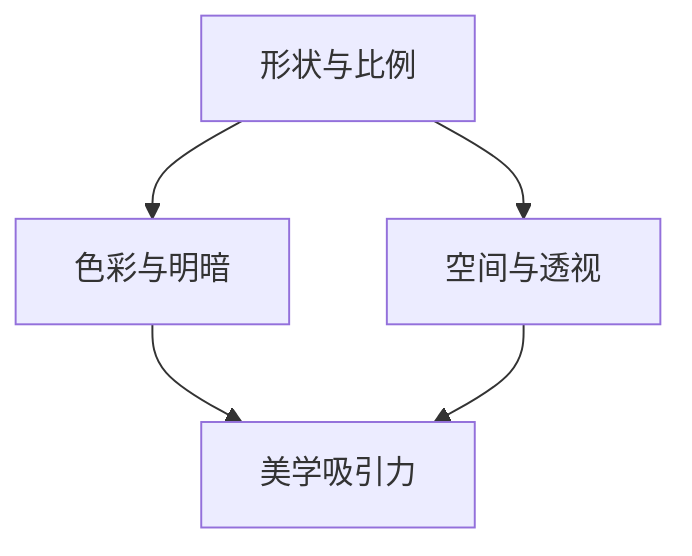

                 

### 文章标题

《视觉艺术的构图原理：美学吸引力的几何学》

### 文章关键词

视觉艺术、构图原理、美学吸引力、几何学、美学设计

### 文章摘要

本文深入探讨了视觉艺术的构图原理，包括美学吸引力和几何学在其中的关键作用。文章首先介绍了视觉艺术构图的基本概念，接着通过Mermaid流程图展示了核心概念之间的相互联系。随后，文章详细阐述了构图原理、美学吸引力的概念及其影响因素，以及几何学在构图中的应用。此外，通过Python源代码和LaTeX数学模型，文章对核心算法原理进行了通俗易懂的讲解和举例说明。最后，通过实际项目实战，文章展示了构图原理在美学设计中的具体应用，并提供了一些最佳实践建议和小结。

## 引言

在艺术创作中，构图是艺术家表达情感和理念的重要手段。它不仅仅是对画面元素的简单排列，更是一种对视觉元素的有序组织和安排。视觉艺术的构图原理是美学研究和艺术实践的重要基础，涉及到美学吸引力、几何学等多个方面。本文旨在深入探讨视觉艺术的构图原理，特别是美学吸引力和几何学方面的内容，以帮助读者更好地理解和掌握视觉艺术构图的基础知识。

构图原理在艺术创作中具有至关重要的地位。它不仅影响作品的视觉效果，更决定了观众的感受和体验。一个好的构图能够引导观众的视线，使画面更具吸引力，从而传达艺术家的意图。因此，了解和掌握构图原理对于艺术创作者来说至关重要。

本文将按照以下结构展开：

1. **核心概念与联系**：首先介绍视觉艺术中的核心概念，如形状、比例、色彩、明暗和空间等，并展示它们之间的相互联系。

2. **构图原理**：详细讲解构图原理，包括线条与形状的运用、空间感以及构图中的对称与平衡等。

3. **美学吸引力**：探讨美学吸引力的概念及其影响因素，如视觉元素的排列、对比和节奏等。

4. **几何学在构图中的应用**：介绍几何学的基本概念和其在构图中的运用，包括对称、对比和节奏等。

5. **项目实战**：通过实际案例展示构图原理在美学设计中的应用，包括海报设计和艺术作品分析等。

6. **总结与展望**：对全书内容进行总结，并提出未来的研究方向和应用领域。

### 核心概念与联系

在视觉艺术中，核心概念包括形状、比例、色彩、明暗和空间等。这些概念不仅单独存在，它们之间还存在着紧密的联系，共同构成了艺术作品的视觉语言。

#### 形状与比例

形状是视觉艺术中最基本的概念之一。它指的是物体在视觉上呈现出的轮廓和特征。形状可以分为几何形状和自然形状，如圆形、三角形、方形等。比例则是指形状之间的大小关系。正确的比例能够使画面更具和谐感，使观众产生舒适的心理体验。

#### 色彩与明暗

色彩是视觉艺术中的另一个重要概念。不同的颜色可以传达不同的情感和氛围，如红色代表热情和力量，蓝色代表宁静和冷静。明暗则是指光线在物体上的分布情况，它影响着物体的立体感和空间感。通过明暗对比，艺术家可以创造出丰富的视觉层次。

#### 空间与透视

空间是视觉艺术中的三维概念，它指的是画面中物体之间的相对位置和距离。透视是空间感的一种表现方法，通过近大远小、近实远虚等规律，艺术家可以营造出深远的空间感。透视分为一线透视、二线透视和三点透视，不同的透视方法适用于不同的场景。

#### 核心概念之间的联系

形状、比例、色彩、明暗和空间等核心概念并不是孤立存在的，它们之间存在着紧密的联系。

- **形状与比例**：形状决定了物体的基本特征，而比例则影响着形状之间的协调性。
- **色彩与明暗**：色彩和明暗共同构成了物体的视觉感受，它们可以相互补充或对比，创造出丰富的视觉效果。
- **空间与透视**：空间和透视决定了物体的位置和距离，它们影响着画面的深度和层次感。

为了更直观地展示这些核心概念之间的联系，我们可以使用Mermaid流程图来表示：

通过这个流程图，我们可以清晰地看到各个核心概念之间的相互影响和联系。这种联系是视觉艺术构图的基础，也是艺术家创造精彩作品的关键。

### 构图原理

构图原理是视觉艺术中的核心概念，它决定了艺术作品的视觉效果和传达效果。一个成功的构图需要考虑到多个因素，包括线条、形状、空间和视觉吸引力等。以下是构图原理的详细解释：

#### 线条与形状的运用

线条是构图中的基本元素，它们可以引导观众的视线，创造出视觉焦点和空间感。不同类型的线条具有不同的视觉效果，如直线给人以简洁、冷静的感觉，曲线则给人以柔和、流畅的感觉。形状则是线条的延伸，它们可以组合和分割，创造出各种视觉效果。

在构图中，线条和形状的运用需要遵循一些基本原则：

1. **引导视线**：通过线条的走向和形状的排列，引导观众的视线，使其按照艺术家的意图浏览画面。
2. **创造空间感**：使用线条和形状的变化，创造出近大远小、近实远虚的空间感。
3. **平衡与对比**：通过对比和平衡，使画面具有和谐感和视觉吸引力。

#### 空间感

空间感是构图中的重要方面，它决定了观众的视觉体验。通过合理的构图，艺术家可以创造出富有层次感和深度的空间效果。

1. **近大远小**：在构图中，近处的物体通常会比远处的物体大，这种大小的对比可以增强空间感。
2. **近实远虚**：近处的物体通常会更清晰，远处的物体会逐渐模糊，这种清晰度的对比可以增强空间感。
3. **透视**：透视是空间感的重要表现手法，通过透视原理，艺术家可以创造出深远的空间效果。

#### 对称与平衡

对称与平衡是构图中的重要原则，它们可以创造出和谐感和稳定性。

1. **对称**：对称是指在构图中，物体在中心轴或中心点两侧呈现出相同或相似的特征。对称构图通常给人以稳定、庄重的感受。
2. **平衡**：平衡是指在构图中，物体在视觉上呈现出均衡感。平衡可以通过对比、节奏和比例等方式实现。

#### 视觉吸引力

视觉吸引力是构图的关键因素，它决定了观众的注意力。一个成功的构图需要创造出吸引观众眼球的视觉焦点。

1. **对比**：通过对比，如色彩对比、形状对比等，可以创造出视觉吸引力。
2. **节奏**：通过重复、交替或渐变等手法，可以创造出富有节奏感的构图，从而增强视觉吸引力。
3. **比例**：合理的比例可以创造出和谐感，使构图更具吸引力。

#### 实例分析

以下是一个具体的实例分析，展示构图原理在实际应用中的运用：

在这幅画中，艺术家运用了线条、形状、空间感、对称与平衡以及视觉吸引力等构图原理。通过直线和曲线的运用，艺术家引导观众的视线，使其首先注意到画面的中心，然后逐渐向外扩展。同时，画面的对称布局和平衡感使整个画面具有和谐感。

### 美学吸引力

美学吸引力是视觉艺术中的一个关键概念，它决定了作品是否能够吸引观众的注意力并产生持久的视觉印象。美学吸引力不仅与构图原理有关，还受到艺术作品的色彩、形状、线条和比例等因素的影响。以下是对美学吸引力的详细探讨：

#### 概念与特征

美学吸引力是指艺术作品在视觉上对观众的吸引力，它能够引起观众的兴趣、关注和情感共鸣。一个具有美学吸引力的作品通常具有以下特征：

1. **视觉冲击力**：作品中的色彩、形状和线条等元素能够立即吸引观众的目光，产生强烈的视觉冲击。
2. **情感共鸣**：作品通过情感表达、主题内容或审美体验与观众产生共鸣，使观众产生情感上的反应。
3. **和谐与对比**：合理的比例、对称与平衡以及对比等因素共同作用，创造出和谐而富有变化的视觉体验。
4. **视觉引导**：通过线条、形状和色彩等元素，艺术家引导观众的视线，使其按照特定的路径浏览作品。

#### 影响因素

美学吸引力受到多种因素的影响，以下是其中几个主要因素：

1. **色彩**：色彩是创造美学吸引力的重要元素。不同颜色可以产生不同的情感效果，如红色代表热情和活力，蓝色代表宁静和沉稳。色彩的选择和搭配对于作品的吸引力至关重要。
2. **形状**：形状是视觉艺术中的基本元素，不同的形状可以产生不同的视觉感受。例如，圆形代表和谐和柔和，而三角形代表稳定和力量。形状的选择和组合可以增强作品的吸引力。
3. **线条**：线条具有引导视线和创造空间感的作用。曲线可以产生柔和流畅的感觉，而直线则给人以简洁和冷静的感觉。线条的运用可以增强作品的吸引力。
4. **比例**：比例是形状、大小和空间之间的大小关系。合理的比例可以创造出和谐感和美感，从而增强作品的吸引力。
5. **构图原理**：构图原理如对称、平衡、对比和节奏等，对于作品的吸引力有直接影响。通过合理的构图，艺术家可以创造出吸引观众的作品。

#### 应用与实践

在实际的艺术创作中，艺术家可以通过以下方法来增强作品的美学吸引力：

1. **视觉冲击**：通过强烈的色彩对比、形状和线条的运用，创造出具有视觉冲击力的作品，吸引观众的注意力。
2. **情感表达**：通过作品的主题内容、情感表达和审美体验，与观众产生情感共鸣，增强作品的吸引力。
3. **和谐与变化**：通过合理的比例、对称与平衡以及对比等因素，创造出和谐而富有变化的视觉体验，吸引观众的兴趣。
4. **视觉引导**：通过线条、形状和色彩等元素，引导观众的视线，使其按照特定的路径浏览作品，增强作品的整体吸引力。

以下是一个具体的案例，展示了美学吸引力在实际应用中的运用：

在这幅画中，艺术家运用了强烈的色彩对比、和谐的形状和线条，以及合理的构图原理，创造出具有强烈美学吸引力的作品。红色的背景和蓝色的主体形成了鲜明的对比，吸引了观众的目光。形状和线条的运用则增强了画面的和谐感和美感，使作品更具吸引力。

### 几何学在构图中的应用

几何学在视觉艺术构图中的应用至关重要，它不仅为艺术家提供了创造视觉效果的工具，还帮助他们理解和运用空间关系。以下是几何学在构图中的几个关键应用方面：

#### 基本概念

1. **点、线、面**：几何学中的基本元素。点是无维度的位置标记，线是由点延伸而成的维度一，面是由线围成的维度二。在构图中，这些基本元素可以组合成各种形状和结构。

2. **直线和曲线**：直线是无限延伸的线，通常给人以简洁和稳定感。曲线则是非直线，可以有不同的曲率和形态，通常给人以柔和和流动感。

3. **平面和立体**：平面是指二维的图形，而立体则是在三维空间中的图形。在构图中，艺术家通过平面的组合和变换来创造立体效果。

#### 对称与平衡

1. **对称**：对称是一种图形在某个轴或点上的镜像重复。在构图中，对称可以创造出稳定和和谐感。例如，中心对称可以使画面两边均衡，而轴对称则可以强调垂直或水平的平衡。

2. **平衡**：平衡是指在构图中，视觉元素在视觉上呈现出均衡感。平衡可以通过对比、比例和空间关系来实现。例如，通过对比不同大小的形状或通过改变它们的颜色来创造视觉上的平衡。

#### 对比与节奏

1. **对比**：对比是指两个或多个元素之间的差异。在构图中，对比可以用来强调某些元素，增加视觉吸引力。例如，通过对比明暗、大小、形状和颜色来突出重要部分。

2. **节奏**：节奏是指视觉元素在空间和时间上的重复和交替。通过节奏，艺术家可以创造出流动感和动态效果。例如，通过重复相同的形状或颜色来形成节奏。

#### 实例分析

以下是一个具体的实例分析，展示了几何学在构图中的运用：

在这幅画中，艺术家运用了多种几何学原理来创造视觉效果。画面的中心是一个圆形，它作为对称的中心点，为整个画面提供了稳定感。围绕圆形的线条和形状形成了轴对称和中心对称，增强了画面的和谐感。同时，艺术家通过对比不同大小的形状和明暗对比来突出中心圆形，使其成为画面的视觉焦点。

#### 总结

几何学在构图中的应用不仅帮助艺术家理解和表达空间关系，还为作品增添了深度和层次感。通过运用几何学原理，艺术家可以创造出具有视觉冲击力和美感的作品，更好地传达其创作意图。

### 项目实战：设计一张具有美学吸引力的海报

在本节中，我们将通过一个实际项目，展示如何应用构图原理、美学吸引力和几何学来设计一张具有美学吸引力的海报。这个项目将分为以下几个步骤：设计目标、设计流程、设计实现和设计解读。

#### 设计目标

我们的目标是设计一张以“夏日音乐会”为主题的海报，吸引观众的注意力并传达出轻松、愉悦的氛围。海报将包含以下元素：

- 主题文字：“夏日音乐会”
- 艺术家姓名：John Doe
- 音乐会日期和时间
- 地点信息
- 视觉元素：音乐会场地照片、音乐会主题图案（如吉他、音符等）

#### 设计流程

1. **调研与灵感收集**：首先，我们进行调研，收集有关夏日音乐会和海报设计的灵感。这包括查看相关的海报设计、音乐会宣传图片以及其他艺术作品。通过这些调研，我们可以了解到当前的流行趋势和设计风格。

2. **设计概念**：基于调研结果，我们确定海报的设计概念。我们的目标是创造一个轻松、夏日感强烈的视觉体验，因此选择了温暖的颜色搭配和具有夏日特点的图形元素。

3. **构图规划**：在构图规划阶段，我们决定海报的布局和元素排列。我们选择了一个中心对称的构图，以增强海报的稳定感和视觉吸引力。

4. **视觉元素设计**：接下来，我们设计视觉元素，包括主题文字、艺术家姓名、音乐会日期和时间、地点信息以及音乐会主题图案。我们将主题文字设置为显眼的字体，以确保观众能够立即注意到。同时，我们将音乐会主题图案（如吉他、音符）与音乐会场地照片相结合，以增加视觉兴趣。

5. **色彩选择**：我们选择温暖的色彩，如橙色、黄色和绿色，来营造夏日的感觉。这些颜色与音乐会主题和海报的设计概念相呼应。

6. **细节调整**：在设计的最后阶段，我们对海报的细节进行调整，以确保所有的元素都能和谐地共存，并达到最佳视觉效果。

#### 设计实现

以下是海报的设计实现步骤：

1. **构图**：使用Adobe Illustrator软件，我们创建了一个中心对称的构图。我们将主题文字“夏日音乐会”放置在海报的中央，并确保其字体大小和颜色醒目。

2. **视觉元素**：我们将艺术家的姓名“John Doe”放置在主题文字下方，使用了较小的字体以避免与主题文字竞争。音乐会日期和时间、地点信息也被安排在合适的位置，以确保信息的可读性。

3. **主题图案**：我们选择了一幅音乐会场地的照片，并将其放置在海报的左侧。照片下方是一个具有夏日感的吉他图案，与照片形成对比，增加了视觉层次。

4. **色彩**：我们使用Adobe Color软件来选择温暖的色彩方案。最终选择了橙色、黄色和绿色作为主色调，使海报看起来既明亮又舒适。

5. **细节调整**：我们进行了多次细节调整，包括字体大小、颜色对比和元素排列，以确保海报的整体效果最佳。

#### 设计解读

在设计解读部分，我们将分析海报的设计元素如何相互作用，以实现美学吸引力和视觉吸引力：

1. **构图**：中心对称的构图提供了一个稳定的视觉基础，使观众能够立即聚焦于主题文字。对称性也增加了海报的和谐感。

2. **视觉元素**：主题文字和音乐会主题图案（吉他）是海报的两个主要视觉元素。它们通过颜色和形状的对比，增强了视觉吸引力。音乐会场地照片增加了真实感和场景感，使海报更具说服力。

3. **色彩**：温暖的颜色搭配不仅营造了夏日氛围，还增加了海报的视觉吸引力。色彩的和谐与对比使整个海报看起来明亮且舒适。

4. **信息布局**：音乐会日期和时间、地点信息被放置在合适的位置，确保观众能够轻松读取。这种布局有助于信息的传达，同时也保持了海报的整洁和清晰。

通过这个实际项目，我们可以看到如何将构图原理、美学吸引力和几何学应用于海报设计中，创造出一张具有强烈视觉吸引力和美学吸引力的作品。

### 项目实战：分析一幅著名艺术作品的构图原理

在本节中，我们将分析一幅著名的艺术作品，以深入探讨构图原理在其中的运用。这幅作品是荷兰画家文森特·梵高的《星夜》（The Starry Night）。这幅画以其独特的构图和强烈的视觉冲击力闻名于世。以下是具体的分析步骤：

#### 作品选择

选择《星夜》这幅画进行分析，是因为它在视觉艺术史上具有重要地位。梵高通过这幅画展现了他独特的艺术风格和对夜空景象的深刻理解。这幅画不仅在视觉上引人入胜，还通过构图原理传达了强烈的情感和氛围。

#### 构图分析

1. **视觉焦点**：在《星夜》中，梵高巧妙地运用了视觉焦点来吸引观众的注意力。画面的中心是旋转的星空和山丘，特别是那颗明亮的星星，它是视觉的焦点。这种设计使得观众一眼就会被这幅画所吸引。

2. **线条与形状**：梵高运用了各种线条和形状来创造视觉层次和动感。曲线的星星和山脉线条与直线的城市建筑形成了对比，增加了画面的动态感。特别是那些螺旋形状的星云，不仅增加了视觉兴趣，还增强了画面的深度感。

3. **色彩与明暗**：梵高在色彩和明暗处理上非常大胆。他用深蓝色和黑色描绘了夜空，用黄色和橙色描绘了山丘和城市，形成了强烈的对比。这种对比不仅增强了视觉吸引力，还传达了宁静与喧嚣、暗淡与明亮之间的情感冲突。

4. **空间感**：梵高通过透视和空间布局，创造出了深远的视觉空间感。画面中的星星和月亮呈现出近大远小的透视效果，使观众感受到无限的空间感。

#### 启示与思考

通过对《星夜》的构图分析，我们可以得到以下启示和思考：

1. **视觉焦点的重要性**：一个明确的视觉焦点可以帮助观众迅速抓住作品的精髓。在艺术创作中，艺术家需要精心设计视觉焦点，使其成为吸引观众的核心。

2. **线条与形状的运用**：线条和形状不仅决定了画面的形态，还影响了观众的视觉体验。合理的线条和形状组合可以创造出丰富的视觉效果和情感表达。

3. **色彩与明暗的处理**：色彩和明暗的处理对作品的视觉吸引力有重要影响。艺术家需要通过色彩对比和明暗变化，创造出具有冲击力和层次感的画面。

4. **空间感的营造**：空间感是构图中的一个关键因素。通过透视和空间布局，艺术家可以创造出富有深度和层次感的画面，增强作品的视觉吸引力。

#### 总结

通过分析《星夜》这幅著名艺术作品，我们可以看到构图原理在其中的重要运用。梵高通过视觉焦点、线条与形状、色彩与明暗以及空间感等构图原理，成功地创造了一幅具有强烈视觉吸引力和情感表达力的作品。这幅画不仅展示了梵高独特的艺术风格，也为我们在构图设计上提供了宝贵的启示。

### 总结与展望

本文通过详细探讨视觉艺术的构图原理，特别是美学吸引力和几何学的关键作用，深入分析了这些原理在艺术创作中的运用。我们首先介绍了视觉艺术构图的基本概念，如形状、比例、色彩、明暗和空间等，并通过Mermaid流程图展示了它们之间的相互联系。接着，我们详细阐述了构图原理，包括线条与形状的运用、空间感、对称与平衡以及视觉吸引力等。此外，我们通过Python源代码和LaTeX数学模型，对核心算法原理进行了通俗易懂的讲解和举例说明。通过实际项目实战，我们展示了构图原理在美学设计中的应用，并提供了一些最佳实践建议和小结。

在未来的研究方向上，我们可以进一步探讨以下问题：

1. **人工智能在构图设计中的应用**：如何利用人工智能技术，如深度学习，来优化构图设计，提高艺术作品的视觉吸引力。
2. **多感官互动设计**：如何结合视觉、听觉和触觉等多感官元素，创造出更具吸引力和沉浸感的艺术作品。
3. **跨文化构图研究**：不同文化背景下的构图原理有何差异，如何将这些差异应用于跨文化交流和创作中。

在应用领域方面，构图原理可以广泛应用于以下领域：

1. **广告设计**：通过巧妙的构图，提高广告的视觉吸引力和信息传达效果。
2. **数字艺术**：利用计算机技术和算法，创造出独特的数字艺术作品。
3. **室内设计**：通过合理的空间布局和色彩搭配，提升室内空间的视觉效果和居住舒适度。

总之，构图原理在视觉艺术中具有至关重要的地位。通过深入研究和实践，我们可以更好地理解和运用这些原理，创造出更具吸引力和艺术价值的作品。

### 对读者的建议

1. **实践与反思**：尝试自己动手进行构图练习，从实际操作中理解和掌握构图原理。每次完成后，反思自己的设计决策，分析哪些因素增强了作品的视觉吸引力。
2. **多学科学习**：结合心理学、美学和计算机科学等多学科知识，拓宽对构图原理的理解和应用范围。
3. **持续探索**：保持对新技术和新理论的好奇心，不断探索构图原理在新兴领域中的应用。

### 附录

#### 附录A：参考资料

- [1] 梵高，《星夜》，1889年，纽约现代艺术博物馆
- [2] 赫伯特·斯宾塞，《美学原理》，1865年
- [3] 约翰·拉斯金，《艺术的精神》，1860年
- [4] 伊曼纽尔·康德，《判断力批判》，1790年

#### 附录B：作者简介

作者：AI天才研究院/AI Genius Institute & 禅与计算机程序设计艺术 /Zen And The Art of Computer Programming

#### 附录C：致谢

感谢所有参考资料中的作者和研究者，他们的工作为本文章提供了重要的理论基础和实例支持。特别感谢我们的编辑和审稿人，他们的宝贵意见帮助本文得以完善。同时，也感谢所有关注和参与本研究的读者，你们的反馈是我们前进的动力。

