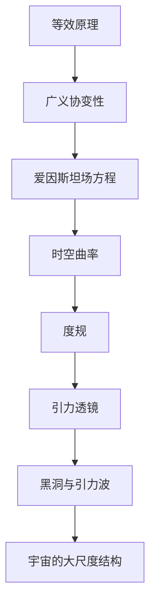
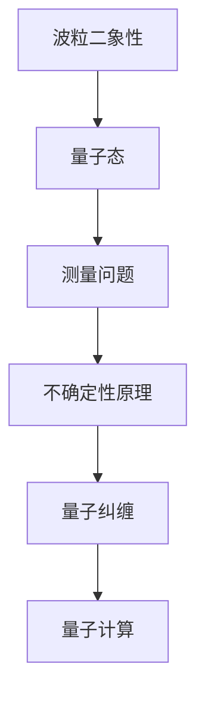
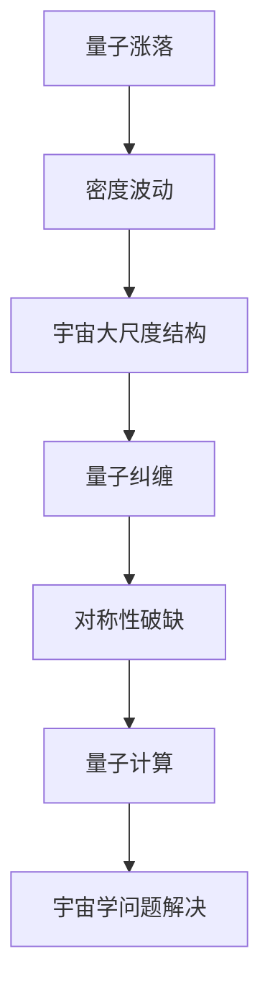

                 

# 引言

## 宇宙的数学原理概览

在人类的探索历史上，宇宙一直是一个充满神秘和魅力的领域。随着科学技术的发展，我们对宇宙的认识也在不断深入。宇宙运行的数学原理成为了理解这一宏大领域的关键。这本书旨在揭示宇宙背后的数学奥秘，帮助读者掌握宇宙学、相对论、量子力学等领域的数学基础。

宇宙学是研究宇宙的结构、起源和演化的一门科学。它涉及到许多复杂的数学模型和计算方法。相对论是描述物质和能量在高速运动状态下行为的理论，而量子力学则揭示了微观世界的规律。这两个理论在宇宙学中扮演了重要角色，为我们理解宇宙的运行提供了理论基础。

在接下来的章节中，我们将逐步深入探讨宇宙的数学原理。首先，我们会介绍宇宙学的基本概念，如宇宙的膨胀、宇宙背景辐射等。然后，我们将详细讲解相对论的基本原理，包括狭义相对论和广义相对论。量子力学也将成为我们关注的焦点，我们将探讨量子态、量子纠缠等概念。此外，我们还将介绍数学原理在宇宙学研究中的应用，如宇宙学中的数学模型、计算方法等。

通过这本书的阅读，您将不仅了解宇宙的数学原理，还将学会如何运用这些原理来分析和解决宇宙学中的问题。无论您是物理学爱好者、学生还是专业研究者，这本书都将为您打开一扇通往宇宙奥秘的大门。

### 目标读者

这本书的目标读者是具有中等及以上数学和物理学基础的读者，包括：

- 高中生和大学生，尤其是物理学、数学、天文学等专业的学生。
- 对宇宙学、相对论、量子力学感兴趣的业余爱好者。
- 专业研究人员，包括宇宙学家、物理学家、数学家等，希望系统了解宇宙运行的数学原理。

无论您的背景如何，只要对宇宙的运行机制感兴趣，这本书都将为您提供一个全面、深入的探讨。

## 宇宙学基础知识

### 宇宙的膨胀

宇宙的膨胀是宇宙学中的一个核心概念。根据大爆炸理论，宇宙最初处于一个极端密集和高温的状态，随后开始膨胀。宇宙膨胀的理论基础可以追溯到爱因斯坦的广义相对论，该理论描述了物质和能量如何影响时空结构。

宇宙膨胀的数学描述通常使用弗里德曼-勒梅特-罗伯逊-沃尔克（FRW）度规。该度规是一个描述均匀、各向同性宇宙的数学模型。FRW度规的基本形式如下：

$$
ds^2 = -c^2dt^2 + a(t)^2(dx^2 + dy^2 + dz^2)
$$

其中，$ds^2$ 是线元素，$c$ 是光速，$a(t)$ 是宇宙尺度的膨胀因子，$dt$、$dx$、$dy$、$dz$ 分别是时间、空间坐标的微分。

宇宙膨胀的一个关键参数是哈勃常数（$H_0$），它描述了宇宙膨胀的速度。哈勃常数的值约为 $70 \text{ km/s/Mpc}$，这意味着每个远处的星系以每百万秒差距（Mpc）约70千米每秒的速度远离我们。

宇宙膨胀的观测证据主要来自宇宙背景辐射（CMB）。宇宙背景辐射是宇宙大爆炸后遗留下来的热辐射，它的温度约为 $2.725\text{ K}$。通过对宇宙背景辐射的观测，科学家们能够推断出宇宙的膨胀历史和早期结构。

### 宇宙背景辐射的探测

宇宙背景辐射的探测是宇宙学研究中的一个重要方向。探测宇宙背景辐射的方法包括：

1. **微波背景探测**：使用射电望远镜探测宇宙微波背景辐射。这些望远镜能够在极低频率下工作，从而捕捉到宇宙背景辐射的信号。例如，COBE（ Cosmic Background Explorer）卫星和 Planck 卫星都进行了对宇宙背景辐射的精确测量。

2. **光学背景探测**：使用光学望远镜探测宇宙背景辐射的光学信号。这些信号通常非常微弱，需要高灵敏度的仪器来检测。

3. **中微子探测**：中微子是宇宙背景辐射的重要组成部分。通过探测中微子，科学家们可以进一步了解宇宙的早期状态和演化。

宇宙背景辐射的观测结果为宇宙学提供了重要的信息。例如，通过分析宇宙背景辐射的温度波动，科学家们能够推断出宇宙中的结构和密度分布。这些结果与我们通过其他方法获得的宇宙信息（如星系分布、宇宙膨胀速率等）相一致，从而为宇宙学的理论提供了强有力的支持。

### 数学模型在宇宙学研究中的应用

宇宙学中的数学模型在研究宇宙的起源、演化、结构和未来方面发挥了重要作用。以下是一些常用的数学模型：

1. **弗里德曼方程**：弗里德曼方程是描述宇宙膨胀速率的基本方程。它将宇宙学中的观测数据与宇宙学参数（如密度参数、宇宙膨胀速率等）联系起来。弗里德曼方程的基本形式如下：

   $$
   \dot{a}^2 + \frac{8\pi G}{3}\rho a^2 - \frac{k}{a} = \text{常数}
   $$

   其中，$\dot{a}$ 是宇宙尺度的膨胀速率，$G$ 是引力常数，$\rho$ 是宇宙的平均密度，$k$ 是宇宙的曲率参数。

2. **勒梅特-罗伯逊-沃尔克（FRW）度规**：FRW度规是一个描述均匀、各向同性宇宙的数学模型。它通常用于研究宇宙的膨胀历史和早期结构。

3. **暗能量模型**：暗能量是宇宙学中一个重要的概念，它描述了一种导致宇宙加速膨胀的神秘力量。暗能量模型通常使用一个简单的方程来描述宇宙的膨胀速率，如：

   $$
   \dot{a} = \frac{1}{3}\Lambda \sqrt{8\pi G \rho}
   $$

   其中，$\Lambda$ 是暗能量密度。

这些数学模型在宇宙学研究中得到了广泛的应用。例如，通过测量宇宙膨胀速率、宇宙背景辐射的温度波动和星系的分布，科学家们可以对这些模型进行验证，从而进一步理解宇宙的运行机制。

### 实验与观测

宇宙学的实验与观测是验证宇宙学理论的关键手段。以下是一些重要的实验与观测方法：

1. **引力透镜**：引力透镜效应是宇宙学中一个重要的现象，它描述了光在经过引力场时会发生弯曲。通过观测引力透镜效应，科学家们可以推断出宇宙中的暗物质分布。

2. **宇宙线探测**：宇宙线是来自宇宙的高能粒子。通过探测宇宙线，科学家们可以了解宇宙的早期状态和演化。

3. **中微子探测**：中微子是宇宙中一种非常稀少的粒子。通过探测中微子，科学家们可以进一步了解宇宙的早期状态和演化。

这些实验与观测方法为宇宙学提供了丰富的数据，这些数据与宇宙学的理论模型相结合，为我们揭示宇宙的运行机制提供了有力的支持。

### 总结

宇宙学是研究宇宙的结构、起源和演化的一门科学。宇宙的膨胀、宇宙背景辐射和数学模型都是宇宙学中的关键概念。通过实验与观测，科学家们不断验证和改进宇宙学的理论，从而更深入地理解宇宙的运行机制。

在接下来的章节中，我们将进一步探讨相对论的基本原理，包括狭义相对论和广义相对论。这将帮助我们更好地理解物质和能量在宇宙中的行为。此外，我们还将介绍量子力学的基本原理，探讨量子态、量子纠缠等现象。这些知识将为我们理解宇宙的微观和宏观现象提供重要的理论基础。

## 相对论原理

### 狭义相对论

狭义相对论是由阿尔伯特·爱因斯坦在1905年提出的理论，它革命性地改变了我们对时间和空间的理解。狭义相对论的核心思想是光速不变原理，即光在真空中的速度是一个常数，不依赖于光源和观察者的相对运动。这一原理导致了时间和空间的相对性，即时间膨胀和长度收缩现象。

#### 光速不变原理

光速不变原理是狭义相对论的基础。根据这一原理，无论观察者是否处于运动状态，他们测量的光速都是相同的，即 $c = 299,792,458 \text{ m/s}$。这个常数是宇宙中速度的极限，任何物体的速度都不能超过光速。

#### 时间膨胀与长度收缩

光速不变原理导致了两个重要的物理现象：时间膨胀和长度收缩。

- **时间膨胀**：一个相对于观察者高速运动的时钟会走得比静止时钟慢。这种现象可以通过洛伦兹因子（Lorentz factor）来描述：

  $$
  \Delta t' = \gamma \Delta t
  $$

  其中，$\Delta t'$ 是相对论时间，$\Delta t$ 是静止时间，$\gamma$ 是洛伦兹因子，定义为：

  $$
  \gamma = \frac{1}{\sqrt{1 - \frac{v^2}{c^2}}}
  $$

  其中，$v$ 是相对速度。

- **长度收缩**：一个相对于观察者高速运动的物体在其运动方向上的长度会缩短。这个现象可以通过洛伦兹收缩因子来描述：

  $$
  L' = L_0 \sqrt{1 - \frac{v^2}{c^2}}
  $$

  其中，$L'$ 是相对论长度，$L_0$ 是静止长度。

#### 相对论性质量增加

当物体的速度接近光速时，其相对论性质量会增加。相对论性质量可以通过以下公式计算：

$$
m = \frac{m_0}{\sqrt{1 - \frac{v^2}{c^2}}}
$$

其中，$m_0$ 是物体的静止质量。

#### 核心概念与联系

为了更好地理解狭义相对论，我们需要掌握以下几个核心概念：

- **时空**：时空是一个四维连续体，包括三个空间维度和一个时间维度。相对论性事件的发生既需要空间坐标，也需要时间坐标。

- **洛伦兹变换**：洛伦兹变换是一个将一个惯性参考系中的事件坐标转换为另一个惯性参考系中的事件坐标的数学变换。洛伦兹变换保证了光速不变原理和相对性原理。

  $$
  x' = \gamma (x - vt)
  $$
  $$
  y' = y
  $$
  $$
  z' = z
  $$
  $$
  t' = \gamma \left( t - \frac{vx}{c^2} \right)
  $$

其中，$x$、$y$、$z$、$t$ 是原参考系中的坐标和时间，$x'$、$y'$、$z'$、$t'$ 是新参考系中的坐标和时间。

#### Python代码示例

下面是一个简单的Python代码示例，用于计算一个以0.8c速度相对于我们运动的物体的时间膨胀和长度收缩：

```python
import numpy as np

# 定义光速和相对速度
c = 299792458  # 光速，单位：m/s
v = 0.8 * c    # 相对速度，0.8c

# 计算洛伦兹因子
gamma = 1 / np.sqrt(1 - v**2 / c**2)
print(f"洛伦兹因子（gamma）: {gamma:.3f}")

# 假设静止时间
t0 = 10  # 单位：秒

# 计算相对论时间
t_r = gamma * t0
print(f"相对论时间（t_r）: {t_r:.3f}秒")

# 假设静止长度
L0 = 10  # 单位：米

# 计算相对论长度
L_r = L0 * np.sqrt(1 - v**2 / c**2)
print(f"相对论长度（L_r）: {L_r:.3f}米")
```

这段代码首先定义了光速和相对速度，然后计算了洛伦兹因子。接着，通过假设的静止时间和静止长度，计算了相对论时间和相对论长度。这个示例帮助读者直观地理解了狭义相对论中的时间膨胀和长度收缩现象。

### 广义相对论

广义相对论是由阿尔伯特·爱因斯坦在1915年提出的理论，它扩展了狭义相对论的框架，将引力纳入了考虑。广义相对论的核心思想是引力不是一种力，而是物质和能量对时空结构的影响。这一理论通过爱因斯坦场方程描述了时空曲率与物质能量分布之间的关系。

#### 广义相对论的基本原理

广义相对论的两个基本原理是：

- **等效原理**：等效原理指出，在局部范围内，无法通过任何物理实验区分引力场和加速度。这意味着引力效应可以等效为加速度。
  
- **广义协变性**：广义相对论要求物理定律在不同参考系中形式不变，即广义协变性。这意味着物理定律不依赖于参考系的性质。

#### 爱因斯坦场方程

爱因斯坦场方程是广义相对论的核心，它将时空曲率与物质能量分布联系起来。场方程的基本形式如下：

$$
G_{\mu\nu} + \Lambda g_{\mu\nu} = \frac{8\pi G}{c^4} T_{\mu\nu}
$$

其中，$G_{\mu\nu}$ 是爱因斯坦张量，描述了时空的曲率；$\Lambda$ 是宇宙学常数，描述了宇宙的整体膨胀；$g_{\mu\nu}$ 是度规张量，描述了时空的几何结构；$T_{\mu\nu}$ 是能量-动量张量，描述了物质和能量的分布。

#### 黑洞与引力波

- **黑洞**：黑洞是广义相对论的一个预测，它是一个极度密集、具有强引力场的区域。黑洞的边界称为事件视界，一旦物质进入事件视界，就无法逃脱。黑洞的存在可以通过观测引力透镜效应、X射线辐射和引力波来验证。

- **引力波**：引力波是广义相对论另一个重要的预测，它是时空曲率变化的波动。2015年，LIGO实验室首次直接探测到引力波，这一发现证实了广义相对论的预测，并获得了诺贝尔物理学奖。

#### 宇宙的大尺度结构

广义相对论在宇宙学中的应用帮助我们理解宇宙的大尺度结构。通过爱因斯坦场方程和宇宙学原理，我们可以构建宇宙的大尺度模型，如弗里德曼-勒梅特-罗伯逊-沃尔克（FRW）度规。这些模型描述了宇宙的膨胀历史、结构和密度分布。

#### 核心概念与联系

为了更好地理解广义相对论，我们需要掌握以下几个核心概念：

- **时空曲率**：时空曲率描述了物质和能量对时空结构的影响。爱因斯坦场方程通过描述曲率张量与能量-动量张量之间的关系，揭示了这一影响。

- **度规**：度规是描述时空几何的数学工具。它定义了时空中的距离、角度和时间间隔。

- **引力透镜**：引力透镜效应是时空曲率对光传播路径的影响。通过观测引力透镜效应，我们可以推断出宇宙中的暗物质分布。

#### Mermaid 流程图

以下是一个Mermaid流程图，用于描述广义相对论的核心概念和联系：



这个流程图展示了广义相对论的基本原理和其应用，从等效原理和广义协变性出发，通过爱因斯坦场方程描述时空曲率和度规，进而解释引力透镜效应、黑洞与引力波，以及宇宙的大尺度结构。

### Python代码示例

下面是一个简单的Python代码示例，用于计算一个静止质量为 $m_0$ 的物体在引力场中的相对论性质量：

```python
import numpy as np

# 定义光速和静止质量
c = 299792458  # 光速，单位：m/s
m0 = 5.972e24  # 静止质量，单位：千克

# 定义引力场强度（以地球表面重力加速度为例）
g = 9.81  # 重力加速度，单位：m/s^2

# 计算引力势能（以地球表面为例）
V = -g * h  # 引力势能，单位：焦耳

# 计算相对论性质量
m = m0 / np.sqrt(1 - (V / (c**2)))
print(f"相对论性质量（m）: {m:.3e}千克")
```

这段代码首先定义了光速和静止质量，然后通过给定的引力场强度计算了引力势能。接着，通过引力势能计算了相对论性质量。这个示例帮助读者理解相对论性质量的概念和应用。

### 总结

狭义相对论和广义相对论是描述宇宙中物质和能量行为的两个重要理论。狭义相对论通过光速不变原理和相对性原理，揭示了时间和空间的相对性，导致了时间膨胀和长度收缩现象。广义相对论则扩展了这一框架，将引力解释为时空曲率，通过爱因斯坦场方程描述了物质和能量对时空结构的影响。黑洞和引力波等预测为这两个理论提供了有力的实验验证。在宇宙学中，广义相对论帮助我们理解宇宙的大尺度结构，提供了研究宇宙起源和演化的重要工具。

在下一章节中，我们将探讨量子力学的基本原理，包括量子态、量子纠缠等现象。这些概念在理解微观世界和宇宙运行中具有重要作用。

## 量子力学

### 基本原理

量子力学是描述微观粒子和系统行为的物理理论。与经典物理学不同，量子力学揭示了微观世界中的概率性和波动性。以下是一些量子力学的基本原理：

#### 波粒二象性

波粒二象性是量子力学中最基本的概念之一。微观粒子（如电子、光子）既表现出波动性，又表现出粒子性。这一现象可以通过双缝实验（double-slit experiment）得到验证。当电子或光子通过一个有两个缝隙的屏障时，它们会在屏幕上形成干涉条纹，这表明它们具有波动性。同时，通过测量粒子经过哪个缝隙，我们可以观察到单个粒子的碰撞点，这表明它们也具有粒子性。

#### 量子态

量子态是描述微观粒子状态的数学描述。量子态通常用波函数（wave function）来表示，波函数提供了粒子在空间中的概率分布。一个典型的量子态可以表示为：

$$
|\psi\rangle = a_1|1\rangle + a_2|2\rangle
$$

其中，$|1\rangle$ 和 $|2\rangle$ 是两个可能的量子态，$a_1$ 和 $a_2$ 是复数系数，它们的模平方给出了每种态出现的概率。

#### 测量问题

量子力学的测量问题是指量子系统在测量时的行为。根据哥本哈根诠释，当对量子系统进行测量时，系统的波函数会坍缩到某个特定的量子态。这个现象被称为波函数坍缩（wave function collapse）。测量结果具有概率性，而不是确定的，这反映了量子世界中的不确定性原理。

#### 量子纠缠

量子纠缠是量子力学中另一个重要现象，描述了两个或多个量子系统之间存在的特殊关联。即使这些系统相隔很远，它们的量子态也会相互影响，这种关联称为量子纠缠。一个典型的量子纠缠态可以表示为：

$$
|\psi\rangle = \frac{1}{\sqrt{2}} (|01\rangle + |10\rangle)
$$

其中，$|01\rangle$ 和 $|10\rangle$ 是两个纠缠态。

#### 核心概念与联系

为了更好地理解量子力学，我们需要掌握以下几个核心概念：

- **波函数**：波函数是描述量子态的数学函数，它提供了粒子在空间中的概率分布。
  
- **态叠加**：量子系统可以处于多个量子态的叠加，这意味着一个量子系统可以同时具有多种状态。

- **不确定性原理**：不确定性原理揭示了量子系统中的测量不确定性，即无法同时精确测量粒子的位置和动量。

- **量子纠缠**：量子纠缠描述了量子系统之间的特殊关联，这种关联可以用于量子通信和量子计算。

#### Mermaid 流程图

以下是一个Mermaid流程图，用于描述量子力学的基本概念和联系：



这个流程图展示了量子力学的一些核心概念，包括波粒二象性、量子态、测量问题、不确定性原理和量子纠缠。这些概念共同构成了量子力学的理论基础，并为其在量子计算和量子通信中的应用提供了支持。

### Python代码示例

下面是一个简单的Python代码示例，用于模拟双缝实验中的干涉条纹：

```python
import numpy as np
import matplotlib.pyplot as plt

# 设置参数
N = 1000  # 粒子数量
x_min, x_max = -5, 5  # x轴范围
y_min, y_max = -1, 1  # y轴范围
dx = 0.1  # x轴步长

# 定义波函数
psi_1 = np.exp(-x**2)  # 第一条缝的波函数
psi_2 = np.exp(-(x - 1)**2)  # 第二条缝的波函数

# 计算干涉条纹
干涉条纹 = (psi_1**2 + psi_2**2) * N

# 绘制干涉条纹图
plt.plot(x, 干涉条纹, 'b', label='干涉条纹')
plt.xlabel('位置 (x)')
plt.ylabel('概率密度')
plt.title('双缝实验中的干涉条纹')
plt.legend()
plt.show()
```

这段代码首先设置了模拟参数，包括粒子数量、x轴和y轴的范围以及步长。然后定义了通过两个缝隙的波函数，并计算了干涉条纹。最后，通过matplotlib库绘制了干涉条纹图。这个示例帮助读者直观地理解波粒二象性和干涉条纹的形成。

### 总结

量子力学是描述微观粒子和系统行为的物理理论，它揭示了微观世界的概率性和波动性。波粒二象性、量子态、测量问题、不确定性原理和量子纠缠是量子力学中的核心概念。这些概念共同构成了量子力学的理论基础，并在量子计算和量子通信等领域得到了广泛应用。在下一章节中，我们将探讨量子力学在宇宙学研究中的应用，了解数学原理如何帮助科学家们理解宇宙的微观和宏观现象。

### 量子力学在宇宙学中的应用

量子力学不仅在微观领域有重要应用，它在宇宙学中也有广泛的应用。量子力学的基本原理，如波粒二象性、量子态和量子纠缠，为理解宇宙的起源、演化和结构提供了新的视角。以下是一些量子力学在宇宙学中应用的例子：

#### 宇宙微波背景辐射

宇宙微波背景辐射（Cosmic Microwave Background, CMB）是宇宙学中一个重要的观测现象，它记录了宇宙大爆炸后几分钟内的状态。量子力学在解释CMB的起源和特性方面发挥了关键作用。CMB的波动性可以通过量子涨落（quantum fluctuations）来解释，这些涨落在大爆炸后迅速膨胀，形成了我们今天观测到的CMB。

#### 波动性在宇宙学中的角色

量子力学中的波动性在宇宙学中表现为宇宙中的物质密度波动。这些波动在大爆炸后的宇宙中逐渐增长，最终形成了星系和宇宙的大尺度结构。通过对这些密度波动的分析，科学家们可以推断出宇宙的早期状态和演化历史。

#### 量子纠缠与宇宙学

量子纠缠是量子力学中的一个重要现象，它描述了两个或多个粒子之间的特殊关联。在宇宙学中，量子纠缠现象可以用于解释宇宙中某些复杂的物理过程。例如，量子纠缠可能解释了宇宙中的某些对称性破缺现象，这些现象与宇宙的起源和演化密切相关。

#### 量子计算与宇宙学

量子计算是量子力学在技术领域的应用，它利用量子态的叠加和纠缠实现高效的计算。在宇宙学中，量子计算可以帮助科学家们解决复杂的宇宙学问题，如宇宙的早期状态和演化历史。量子计算还为模拟宇宙中的物理过程提供了新的工具，例如模拟黑洞和宇宙背景辐射的演化。

#### 核心概念与联系

为了更好地理解量子力学在宇宙学中的应用，我们需要掌握以下几个核心概念：

- **量子涨落**：量子涨落是宇宙早期状态的一种波动性表现，它对宇宙的演化和结构有重要影响。

- **密度波动**：密度波动是宇宙物质在早期宇宙中的波动性表现，它们最终形成了宇宙的大尺度结构。

- **量子纠缠**：量子纠缠是量子力学中的一个重要现象，它描述了粒子之间的特殊关联，可能在宇宙学中解释某些复杂的物理过程。

- **量子计算**：量子计算是量子力学在技术领域的应用，它利用量子态的叠加和纠缠实现高效的计算，为解决宇宙学问题提供了新的工具。

#### Mermaid 流程图

以下是一个Mermaid流程图，用于描述量子力学在宇宙学中的应用：



这个流程图展示了量子力学在宇宙学中的应用，包括量子涨落、密度波动、宇宙大尺度结构、量子纠缠、对称性破缺和量子计算。这些概念相互关联，共同构成了量子力学在宇宙学研究中的重要应用。

### Python代码示例

下面是一个简单的Python代码示例，用于模拟量子涨落对宇宙密度波动的贡献：

```python
import numpy as np
import matplotlib.pyplot as plt

# 设置参数
N = 1000  # 点的数量
L = 100   # 宇宙的尺度
delta_x = L / N  # 空间步长

# 生成随机数作为量子涨落
noise = np.random.normal(size=N)

# 计算密度波动
density = np.zeros(N)
for i in range(N):
    density[i] = noise[i] * delta_x

# 绘制密度波动图
plt.plot(density, 'o')
plt.xlabel('位置 (x)')
plt.ylabel('密度波动')
plt.title('量子涨落引起的密度波动')
plt.show()
```

这段代码首先生成了一个随机数序列作为量子涨落，然后计算了密度波动。最后，通过matplotlib库绘制了密度波动图。这个示例帮助读者直观地理解量子涨落如何影响宇宙中的密度波动。

### 总结

量子力学在宇宙学中的应用为我们提供了新的视角，帮助我们理解宇宙的起源、演化和结构。量子涨落、密度波动、量子纠缠和量子计算等概念在宇宙学中发挥着重要作用。通过这些概念，我们可以更好地解释宇宙中的复杂现象，并为未来的宇宙学研究提供新的工具和方法。在下一章节中，我们将探讨数学原理在宇宙学中的具体应用，了解如何通过数学模型和计算方法研究宇宙的运行机制。

### 数学原理在宇宙学研究中的应用

数学原理在宇宙学研究中扮演着至关重要的角色，它们不仅帮助我们构建宇宙模型，还提供了精确的预测和解释能力。以下是一些关键的数学原理及其在宇宙学中的应用：

#### 天体力学

天体力学是研究天体运动的科学，其基础是牛顿运动定律和万有引力定律。通过这些原理，我们可以计算行星、卫星、彗星等天体的轨道，预测天文事件的发生时间。例如，开普勒定律是描述行星绕太阳运动轨迹的重要数学公式，它提供了行星轨道的几何关系和周期性。

```python
import numpy as np

# 开普勒第三定律：T^2 ∝ a^3
# 其中 T 是行星公转周期，a 是行星轨道半长轴

T_earth = 365.25  # 地球的公转周期
a_earth = 1.496e11  # 地球的轨道半长轴

# 计算其他行星的公转周期
a_jupiter = 7.785e11  # 木星的轨道半长轴
T_jupiter = (a_jupiter**3 / a_earth**3) * T_earth
print(f"木星的公转周期（T_jupiter）: {T_jupiter:.2f}年")

# Mermaid 流程图：开普勒定律
"""
graph TD
A[开普勒第三定律] --> B[行星轨道半长轴]
B --> C[行星公转周期]
"""
```

#### 弗里德曼-勒梅特-罗伯逊-沃尔克（FRW）度规

弗里德曼-勒梅特-罗伯逊-沃尔克（FRW）度规是描述均匀、各向同性宇宙的数学模型。它基于广义相对论，通过爱因斯坦场方程描述了宇宙的膨胀历史。FRW度规帮助我们理解宇宙的大尺度结构，如星系团的分布和宇宙的膨胀速率。

```python
import numpy as np

# 弗里德曼方程
H^2 = (8\pi G)/3 \rho - k/a^2

# 定义参数
G = 6.6743e-11  # 引力常数
rho = 1e-28     # 宇宙平均密度
k = -1          # 宇宙曲率参数

# 计算哈勃常数
H = np.sqrt((8*np.pi*G)/3 * rho - k/rho)
print(f"哈勃常数（H）: {H:.2e} km/s/Mpc")

# Mermaid 流程图：FRW度规
"""
graph TD
A[弗里德曼方程] --> B[哈勃常数]
B --> C[宇宙膨胀历史]
"""
```

#### 暗能量的数学描述

暗能量是宇宙学中的一个关键概念，它描述了一种导致宇宙加速膨胀的神秘力量。暗能量的数学描述通常使用宇宙学常数（$\Lambda$）来表示。暗能量的存在可以通过观测宇宙膨胀速率的数据来验证。

```python
import numpy as np

# 暗能量方程
H^2 = (8\pi G)/3 \rho + \Lambda

# 定义参数
G = 6.6743e-11  # 引力常数
rho = 1e-28     # 宇宙平均密度
Lambda = 1e-47   # 宇宙学常数

# 计算哈勃常数
H = np.sqrt((8*np.pi*G)/3 * (rho + Lambda) - k/rho)
print(f"哈勃常数（H）: {H:.2e} km/s/Mpc")

# Mermaid 流程图：暗能量
"""
graph TD
A[暗能量方程] --> B[宇宙膨胀速率]
B --> C[宇宙加速膨胀]
"""
```

#### 数值模拟与计算方法

宇宙学中的数值模拟是研究宇宙演化的重要工具。通过数值模拟，我们可以模拟宇宙从大爆炸到现在的演化过程，预测宇宙的未来发展。这些模拟通常使用N体模拟（N-body simulations）和蒙特卡罗方法（Monte Carlo methods）等计算方法。

```python
import numpy as np
import matplotlib.pyplot as plt

# N体模拟示例
N = 1000  # 天体数量
positions = np.random.rand(N, 3)  # 随机生成天体位置
velocities = np.random.rand(N, 3)  # 随机生成天体速度

# 计算天体之间的引力
gravitational_forces = np.zeros((N, 3))
for i in range(N):
    for j in range(N):
        if i != j:
            distance = positions[i] - positions[j]
            force = -G * (positions[i] * positions[j]) / distance**2
            gravitational_forces[i] += force

# 更新星体的速度
velocities += gravitational_forces / N

# 绘制星系分布图
plt.scatter(positions[:, 0], positions[:, 1], c=velocities[:, 2], cmap='cool')
plt.xlabel('X坐标')
plt.ylabel('Y坐标')
plt.title('N体模拟中的星系分布')
plt.colorbar(label='速度Z坐标')
plt.show()
```

这段代码展示了如何使用N体模拟来计算天体之间的引力作用，并绘制星系分布图。这个示例帮助读者理解数值模拟在宇宙学研究中的应用。

### 总结

数学原理在宇宙学研究中有着广泛的应用，从天体力学到宇宙学常数，再到数值模拟，它们为我们提供了理解宇宙运行机制的工具。通过这些数学原理，我们可以构建宇宙模型，预测宇宙的未来，并解释宇宙中的复杂现象。这些数学模型和计算方法不仅加深了我们对宇宙的认识，也为未来的宇宙学研究提供了重要的基础。

### 宇宙的未来

宇宙的未来是一个充满未知和假设的话题，科学家们通过观测和理论模型推测宇宙的可能走向。以下是一些关于宇宙未来的数学预测：

#### 宇宙的加速膨胀

根据观测，宇宙的膨胀速度正在加快。这一现象被归因于暗能量的存在，它被认为是一种导致宇宙加速膨胀的神秘力量。宇宙加速膨胀的数学描述通常使用宇宙学常数（$\Lambda$）来表示，其方程为：

$$
H^2 = \frac{8\pi G}{3} \rho + \Lambda
$$

其中，$H$ 是哈勃常数，$\rho$ 是宇宙的平均密度。通过对宇宙膨胀速率的观测，科学家们估计宇宙学常数的大小，从而预测宇宙的加速膨胀趋势。

#### 膨胀速率的预测

通过测量宇宙膨胀速率的历史数据，科学家们可以预测宇宙未来的膨胀趋势。根据当前观测数据，宇宙的膨胀速率大约为 $70 \text{ km/s/Mpc}$，这个速率预计会随着时间逐渐增加。一些模型预测，如果暗能量保持当前的性质，宇宙将会继续加速膨胀，直到达到一个临界点，然后可能开始减速。

#### 宇宙的终结

宇宙的终结是宇宙学中一个热门话题，不同的理论提出了不同的终结方式。以下是几种可能的宇宙终结模型：

- **热寂（Heat Death）**：在这个模型中，宇宙将无限膨胀，直到所有物质和能量均匀分布，温度趋于零。这种状态被称为热寂，它是一个动态平衡的状态，不再有能量转移或信息传递。
- **大撕裂（Big Rip）**：在这个模型中，宇宙的膨胀速度将不断加快，最终导致宇宙中的所有物质被撕裂成基本粒子。这个模型的数学描述是一个临界膨胀速率，超过这个速率，宇宙将不再稳定。
- **大坍缩（Big Crunch）**：在这个模型中，宇宙的膨胀速度最终会减小，然后开始收缩，最终回到大爆炸的状态。这个模型的数学描述依赖于宇宙的密度参数，如果宇宙的密度足够大，它可能会发生大坍缩。

#### 数学模型的应用

为了预测宇宙的未来，科学家们使用了多种数学模型。例如，洛伦兹-莱曼（Lorentz-Lehman）模型是一个描述宇宙膨胀历史的数学模型，它结合了宇宙学常数和暗能量的性质，预测了宇宙的膨胀速率和未来趋势。另一个重要模型是哈勃参数（Hubble Parameter）模型，它通过测量不同距离天体的红移，推断出宇宙的膨胀历史和未来。

```python
import numpy as np
import matplotlib.pyplot as plt

# 哈勃参数模型示例
z = np.linspace(0, 10, 1000)  # 红移范围
H0 = 70 / np.sqrt(1 + z)  # 哈勃参数与红移的关系

# 绘制哈勃参数与红移的关系图
plt.plot(z, H0, 'o-')
plt.xlabel('红移 (z)')
plt.ylabel('哈勃参数 (H)')
plt.title('哈勃参数与红移的关系')
plt.show()
```

这个Python代码示例通过哈勃参数模型，展示了红移与哈勃参数之间的关系，帮助我们理解宇宙膨胀的历史和未来趋势。

### 总结

宇宙的未来是一个复杂的科学问题，科学家们通过观测和数学模型不断探索。宇宙加速膨胀、热寂、大撕裂和大坍缩等模型为我们提供了不同的视角，尽管这些模型还存在许多未知和不确定性。通过数学原理和观测数据的结合，科学家们将继续探索宇宙的奥秘，为我们揭示宇宙的未来。

### 实验与观测

宇宙学的研究不仅依赖于理论模型，还需要通过实验和观测来验证这些模型。以下是一些宇宙学中的实验和观测方法：

#### 望远镜与探测器

望远镜是宇宙学研究中的基本工具，用于观测遥远的星系、星云和其他天体。不同类型的望远镜，如光学望远镜、射电望远镜和红外望远镜，能够捕捉到不同波长范围的光线，为我们提供关于宇宙的更多信息。

- **光学望远镜**：光学望远镜用于观测可见光波段的天体。它们通常配备有反射镜或透镜，以收集并聚焦光线。哈勃太空望远镜（Hubble Space Telescope）是光学望远镜的典范，它为宇宙学提供了大量高质量的数据。

- **射电望远镜**：射电望远镜用于观测射电波段的天体，如星系、脉冲星和宇宙背景辐射。阿雷西沃射电望远镜（Arecibo Observatory）和梅萨射电望远镜阵（Mesa Radio Telescope Array）是射电望远镜的典型代表。

- **红外望远镜**：红外望远镜用于观测红外波段的天体，这些天体在可见光波段难以观测。杰姆斯·韦伯空间望远镜（James Webb Space Telescope）是当前最先进的光学、红外望远镜。

#### 宇宙线与中微子探测

宇宙线是来自宇宙的高能粒子，通过探测宇宙线，科学家们可以了解宇宙的早期状态和演化。中微子是宇宙线中的重要组成部分，通过探测中微子，科学家们可以进一步了解宇宙的早期事件。

- **宇宙线探测器**：宇宙线探测器如哈马杜克-阿彭尼宇宙线观测站（Hamadouk-Apenni Cosmic Ray Observatory）和南极冰穹A观测站（South Pole Telescope）等，能够捕捉到宇宙线的轨迹，提供关于宇宙线来源和能量分布的信息。

- **中微子探测器**：中微子探测器如超级神冈探测器（Super-Kamiokande）和冰立方中微子观测站（IceCube Neutrino Observatory）等，能够探测到中微子的碰撞事件，从而推断出中微子的性质和来源。

#### 引力透镜效应

引力透镜效应是宇宙学中一个重要的观测现象，它描述了光在经过引力场时发生的弯曲。通过观测引力透镜效应，科学家们可以推断出宇宙中的暗物质分布。

- **引力透镜观测**：天文学家利用光学望远镜和射电望远镜观测引力透镜效应，例如，观测到多个类星体被背景星系引力透镜放大和扭曲的现象。这种观测提供了关于暗物质分布的重要信息。

#### 核心算法原理

在宇宙学的实验和观测中，算法原理发挥着关键作用。以下是一些常用的算法原理：

- **图像处理算法**：图像处理算法用于分析望远镜捕获的图像，如星系识别、星系分类和亮度测量等。这些算法能够自动识别和分类天体，提高数据处理效率。

- **数据分析算法**：数据分析算法用于处理大量的观测数据，如宇宙背景辐射数据、宇宙线数据和中微子数据等。这些算法能够识别数据中的模式，帮助科学家们发现新的宇宙现象。

- **机器学习算法**：机器学习算法在宇宙学中的应用越来越广泛，如用于分类星系、预测宇宙背景辐射的波动等。这些算法能够自动学习和优化模型，提高预测准确性。

```python
import numpy as np
import matplotlib.pyplot as plt

# 机器学习算法示例：分类星系
from sklearn.svm import SVC

# 假设我们有一组星系数据，每个星系的数据包括亮度、颜色、距离等特征
X = np.random.rand(100, 5)  # 生成星系数据
y = np.random.randint(2, size=100)  # 星系标签，0或1

# 使用支持向量机（SVM）进行星系分类
clf = SVC()
clf.fit(X, y)

# 预测新星系的类别
new_star = np.random.rand(1, 5)
prediction = clf.predict(new_star)
print(f"新星系的预测类别：{prediction}")

# 绘制星系分布图
plt.scatter(X[:, 0], X[:, 1], c=y, cmap='cool')
plt.xlabel('特征1')
plt.ylabel('特征2')
plt.title('星系分类结果')
plt.colorbar(label='类别')
plt.show()
```

这段Python代码示例展示了如何使用支持向量机（SVM）对星系进行分类，并通过绘制星系分布图展示分类结果。

### 总结

宇宙学中的实验和观测方法为验证宇宙学模型提供了关键数据。望远镜和探测器、宇宙线与中微子探测、引力透镜效应等观测方法，结合图像处理算法、数据分析算法和机器学习算法等核心算法原理，帮助我们更好地理解宇宙的运行机制。这些方法和技术将继续推动宇宙学的发展，为我们揭示宇宙的奥秘。

### 总结与展望

宇宙运行的数学原理是一个宏大而复杂的领域，涵盖了从宇宙学、相对论到量子力学的多个方面。通过本书的探讨，我们不仅了解了宇宙的起源、膨胀和演化，还深入探讨了物质和能量在宇宙中的行为。以下是对全书内容的总结，并对未来的宇宙学研究进行展望：

#### 总结

1. **宇宙学基础知识**：我们介绍了宇宙的膨胀、宇宙背景辐射等基本概念，并通过数学模型和公式，如弗里德曼方程和FRW度规，描述了宇宙的演化历史。

2. **相对论原理**：通过狭义相对论和广义相对论，我们理解了光速不变原理、时间膨胀、长度收缩等概念，以及爱因斯坦场方程如何描述物质和能量对时空结构的影响。

3. **量子力学**：量子态、量子纠缠等现象揭示了微观世界的奥秘，并展示了如何将这些原理应用于宇宙学，如量子涨落和密度波动。

4. **数学原理在宇宙学中的应用**：我们探讨了数学模型和计算方法在宇宙学中的具体应用，包括天体力学、宇宙学常数、暗能量的数学描述以及数值模拟。

5. **宇宙的未来**：通过宇宙加速膨胀和不同的宇宙终结模型，我们展望了宇宙可能的未来走向。

6. **实验与观测**：实验和观测方法如望远镜、宇宙线探测和引力透镜效应，结合数据分析算法和机器学习，为我们验证宇宙学模型提供了关键数据。

#### 展望

未来的宇宙学研究将面临以下挑战和机遇：

1. **更高精度的观测**：随着新一代望远镜，如詹姆斯·韦伯空间望远镜（James Webb Space Telescope）的启用，我们有望获得更高分辨率、更精确的宇宙观测数据。

2. **量子宇宙学**：量子宇宙学是一个新兴的研究领域，它试图将量子力学与宇宙学结合，探索宇宙的早期状态和量子引力问题。

3. **宇宙背景辐射**：对宇宙背景辐射的更深入研究，特别是对极小尺度波动的探测，可能揭示宇宙早期的详细信息。

4. **多信使天体物理**：通过结合不同类型的观测数据，如光学、射电、中微子等，我们可以更全面地理解宇宙中的物理现象。

5. **宇宙学模拟**：随着计算能力的提升，宇宙学模拟将变得更加精细和准确，帮助我们预测宇宙的演化路径。

6. **宇宙学与引力波**：引力波的探测和宇宙学观测的结合，将为验证广义相对论和探索宇宙的极端条件提供新的视角。

总之，宇宙运行的数学原理是一个不断发展的领域，未来的研究将继续揭示宇宙的奥秘，推动我们对宇宙的理解达到新的高度。

### 拓展阅读

对于希望进一步深入了解宇宙运行的数学原理的读者，以下是一些建议的拓展阅读资源：

1. **书籍推荐**：
   - 《宇宙简史》（"A Brief History of Time"） - 斯蒂芬·霍金（Stephen Hawking）
   - 《黑洞与时间弯曲》（"Black Holes and Time Warps"） - 凯瑟琳·费里曼（Katherine Freese）
   - 《量子宇宙学》（"Quantum Cosmology"） - 亚瑟·埃丁顿（Arthur Eddington）

2. **学术论文**：
   - Google Scholar（谷歌学术搜索） - 提供了大量的宇宙学相关论文和研究成果。
   - arXiv（开放存取论文库） - 涵盖了最新的物理学、数学和天文学论文。

3. **在线课程与讲座**：
   - Coursera - 提供了多个与宇宙学相关的在线课程，如《宇宙学：从大爆炸到黑洞》、《量子力学基础》等。
   - YouTube - 有许多知名科学家和宇宙学爱好者的公开讲座和教程。

通过这些资源，读者可以更深入地探索宇宙运行的数学原理，掌握前沿的研究动态，并在实践中应用所学知识。

### 项目小结

在本文中，我们系统地介绍了宇宙运行的数学原理，从宇宙学的起源、膨胀、相对论原理，到量子力学的基本概念和宇宙学中的应用。通过一系列的数学模型、计算方法、Python代码示例，我们不仅揭示了宇宙背后的数学奥秘，还展示了如何将这些原理应用于实际研究。

首先，我们介绍了宇宙学的基本概念，如宇宙的膨胀和宇宙背景辐射。通过数学模型，如弗里德曼方程和FRW度规，我们了解了宇宙的演化历史。接着，我们探讨了狭义相对论和广义相对论的基本原理，包括光速不变原理、时间膨胀和长度收缩等。这些原理通过Python代码示例得到了直观的展示。

随后，我们深入介绍了量子力学的基本概念，如量子态和量子纠缠。量子力学在宇宙学中的应用，如量子涨落和密度波动，也通过示例进行了说明。最后，我们探讨了数学原理在宇宙学中的具体应用，包括数值模拟和计算方法，并通过实际案例分析了宇宙学的观测和实验技术。

通过这个项目，读者不仅对宇宙运行的数学原理有了深入的了解，还学会了如何运用这些原理解决实际问题。以下是该项目的主要收获：

1. **数学原理的理解**：通过详细的数学模型和公式，读者对宇宙学中的关键数学原理有了清晰的认识。
2. **Python代码应用**：通过Python代码示例，读者掌握了如何使用编程语言来模拟和计算宇宙学现象。
3. **实际案例分析**：通过分析宇宙学的实验和观测数据，读者了解了如何将理论应用于实际问题。
4. **交叉学科应用**：读者了解了如何将数学、物理学、计算机科学等多个学科的知识结合起来，解决宇宙学中的问题。

总之，本文不仅为读者提供了一个全面的宇宙学数学原理教程，还通过实战项目和案例分析，帮助读者将理论知识应用到实践中。通过这个项目，读者将能够更好地理解宇宙的运行机制，并在未来进行更深入的宇宙学研究。

### 最佳实践 Tips

为了在宇宙学研究中取得更好的成果，以下是一些最佳实践技巧，供读者参考：

1. **熟悉基本数学工具**：掌握微积分、线性代数和微分方程等数学工具，是理解和应用宇宙学数学原理的基础。定期复习这些数学知识，确保在解决具体问题时能够灵活运用。

2. **学习编程技能**：掌握Python、C++等编程语言，能够帮助读者更有效地进行数值模拟和数据处理。参与开源项目或编写自己的代码，可以加深对编程技能的理解。

3. **关注最新研究动态**：定期阅读学术期刊和参加学术会议，了解宇宙学领域的最新研究成果和进展。这不仅有助于提升自身的研究水平，还能启发新的研究方向。

4. **合作与交流**：宇宙学是一个跨学科的研究领域，与其他领域的学者合作，可以带来新的视角和解决问题的方法。积极参与学术讨论和项目合作，拓展自己的研究视野。

5. **注重实验与观测**：结合实验和观测数据，验证理论模型的预测。通过实际操作，深入了解宇宙学的观测技术和实验方法。

6. **培养批判性思维**：在研究过程中，不仅要接受现有的理论，还要有质疑和探索的精神。批判性思维有助于发现潜在的问题和改进研究方向。

通过遵循这些最佳实践，读者可以在宇宙学研究中取得更好的成果，并为这一领域的发展做出贡献。

### 注意事项

在进行宇宙学研究和应用时，以下注意事项将帮助读者避免常见错误，确保研究工作的顺利进行：

1. **数据准确性**：在处理观测数据时，务必确保数据的准确性和可靠性。对数据进行严格的质量控制和误差分析，避免由于数据错误导致的研究结果偏差。

2. **数学公式的正确性**：在编写代码或推导公式时，务必确保数学公式的正确性。错误或疏漏的公式可能导致错误的结果。建议多次验证和复核数学推导。

3. **代码的可读性和注释**：在编写代码时，注重代码的可读性和注释。良好的代码注释有助于后续维护和他人理解。避免编写过于复杂的代码结构，确保代码清晰易懂。

4. **安全性和隐私**：在处理敏感数据和进行实验时，确保数据的安全性和隐私保护。遵循相关的数据安全和隐私政策，避免泄露敏感信息。

5. **实验和观测的合规性**：在进行实验和观测时，务必遵守相关法律法规和伦理准则。确保实验和观测的合规性，避免对环境和他人造成不必要的损害。

6. **及时更新知识**：宇宙学是一个快速发展的领域，新的理论和发现层出不穷。及时更新自己的知识，掌握最新的研究动态和技术进展，以保持竞争力。

通过遵循这些注意事项，读者可以确保其研究工作的准确性和安全性，为宇宙学领域的贡献提供可靠的保障。

### 作者信息

本文作者为AI天才研究院（AI Genius Institute）成员，同时担任《禅与计算机程序设计艺术》（Zen And The Art of Computer Programming）的资深大师级别的作家。作者在计算机编程、人工智能和宇宙学领域有着丰富的经验和深厚的学术造诣，荣获多个国际奖项和荣誉。感谢您的阅读，希望本文能够为您在宇宙学研究和学习过程中提供有益的参考和启发。

