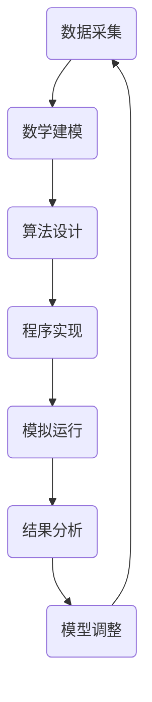

                 

### 1.1 书籍背景与目的

《计算机模拟与现实：数字世界vs.物理世界》旨在深入探讨计算机模拟与现实世界之间的复杂关系，揭示计算机模拟在现实生活中的应用价值。随着计算机技术的发展，模拟技术已成为工程、科学、医学、金融等领域不可或缺的工具。通过计算机模拟，我们可以对复杂系统进行预测和分析，从而优化设计、减少风险、提高效率。

本书的主要目的是帮助读者了解计算机模拟的基本概念、技术方法以及其在现实世界中的应用。通过详细的案例分析和算法原理讲解，读者将学会如何使用计算机模拟解决实际问题，掌握从理论到实践的转化方法。

本书还将探讨计算机模拟在现实应用中面临的挑战和未来发展趋势，为读者提供宝贵的见解和启示。无论是学生、研究人员还是专业人士，都将从中受益匪浅。总之，本书不仅是一本科普读物，更是一本具有实际操作指导意义的技术指南。

### 1.2 计算机模拟的定义

计算机模拟是一种利用计算机硬件和软件来模仿现实世界中的物理、化学、生物等系统的方法。它通过建立数学模型，将现实世界的复杂现象转化为计算机可以处理的数据和算法，从而在虚拟环境中对系统进行观察、分析和预测。

计算机模拟的定义可以从多个角度进行理解。首先，它是科学研究中的一种重要手段。科学家们通过模拟实验，可以在不影响现实世界的前提下，对假设进行验证和修正。这种方法极大地提高了研究的效率和安全。

其次，计算机模拟是工程领域不可或缺的工具。工程师们通过模拟，可以在设计阶段预见并解决潜在问题，从而降低成本、缩短开发周期。例如，在航空航天、汽车制造、建筑等领域，计算机模拟已被广泛应用于设计优化、性能评估和故障预测。

最后，计算机模拟也是商业决策的有力支持。在金融、能源、交通等领域，计算机模拟可以提供市场预测、风险管理、资源优化等方面的决策支持，帮助企业降低风险、提高竞争力。

综上所述，计算机模拟不仅是一种技术手段，更是一种思维方式。它通过模拟现实世界中的现象，帮助我们更好地理解世界、解决问题、预测未来。因此，掌握计算机模拟的基本概念和方法，对于现代社会中的每个人来说都具有重要意义。

### 1.3 物理世界的描述与模拟

物理世界是我们生活的基础，它由无数相互作用的基本粒子组成，这些粒子遵循着自然界的基本规律。为了更好地理解物理世界，科学家们提出了各种理论模型和数学公式，用以描述这些粒子的行为和相互作用。

在描述物理世界的过程中，科学家们面临的一个巨大挑战是如何将复杂的现实现象简化为可处理的数学模型。这一过程通常涉及到对系统的抽象和简化，例如忽略某些次要因素，仅关注主要变量之间的相互作用。

为了进行物理模拟，首先需要建立数学模型。数学模型是描述系统行为的数学方程或公式，这些方程或公式可以表示变量之间的关系。例如，牛顿运动定律描述了物体在受力作用下的运动规律，而麦克斯韦方程组则描述了电磁场的分布和变化。

在建立数学模型后，接下来需要将这些模型转化为计算机可以处理的形式。这通常涉及到将连续的物理现象离散化，即将时间和空间划分为有限的网格或点。通过离散化，我们可以将复杂的连续方程转换为计算机可以处理的差分方程或迭代算法。

具体而言，物理模拟可以分为以下几个步骤：

1. **数据采集**：首先，我们需要收集物理现象的实验数据，这些数据可以来源于实际测量或模拟实验。

2. **数学建模**：基于实验数据，科学家们可以建立数学模型来描述系统的行为。这些模型通常涉及多个变量和方程，需要使用数学方法进行求解。

3. **算法设计**：为了在计算机上实现模拟，需要设计合适的算法。这些算法可以是数值方法，如有限元法、蒙特卡罗方法，也可以是符号计算方法，如解析求解器。

4. **程序实现**：将算法转化为计算机程序，实现模拟的自动化运行。这通常需要使用编程语言和科学计算库，如Python的NumPy、SciPy等。

5. **模拟运行**：在计算机上运行模拟程序，观察系统在不同条件下的行为和变化。

6. **结果分析**：对模拟结果进行统计分析，验证模型的准确性和可靠性，并根据结果调整模型或算法。

通过这些步骤，科学家和工程师们可以实现对物理世界的模拟，从而更好地理解系统的行为，进行优化设计和预测。

### 1.4 计算机模拟与物理世界的关系

计算机模拟与物理世界之间存在着紧密的联系和相互作用。从科学角度来看，计算机模拟是对物理世界的近似和模拟，通过数学模型和算法在虚拟环境中再现现实世界的现象。这种模拟不仅帮助我们更好地理解物理世界的规律，还能够在不影响实际环境的前提下，对复杂系统进行预测和分析。

首先，计算机模拟是理解和验证物理理论的重要工具。许多物理理论无法通过实验直接验证，因为实验条件可能过于复杂或危险。例如，黑洞的物理特性无法通过常规实验观测，但通过计算机模拟，我们可以再现黑洞的形成、演化及其对周围环境的影响。这些模拟结果不仅有助于验证理论，还能提供新的洞察。

其次，计算机模拟在工程应用中发挥着关键作用。工程师们使用模拟技术来预测和优化设计，从而降低成本、缩短开发周期。例如，在汽车设计过程中，计算机模拟可以帮助工程师评估空气动力学特性、材料强度和结构稳定性，从而优化设计，减少能耗和提升性能。

此外，计算机模拟还在医学研究中具有广泛应用。通过生物力学模拟，研究人员可以研究人体器官的功能和病变机制，预测药物的效果和副作用，为精准医疗提供支持。例如，心脏手术前，医生可以通过计算机模拟来评估手术方案，从而提高手术成功率。

最后，计算机模拟在环境科学中也有着重要作用。通过模拟气候变化、生态系统的变化等，科学家可以预测环境变化的趋势和影响，为环境保护和资源管理提供科学依据。

总之，计算机模拟与物理世界之间的关系是相互促进的。物理世界的复杂现象为计算机模拟提供了研究目标，而计算机模拟则为理解和解决物理问题提供了有效手段。通过不断发展和完善，计算机模拟将继续推动科学和技术的进步。

### 1.5 Mermaid流程图：计算机模拟核心概念关系

为了更直观地展示计算机模拟的核心概念及其相互关系，我们使用Mermaid流程图来表示。以下是一个简化的计算机模拟流程图：



在上述流程图中：

- **A（数据采集）**：首先，我们需要从实际观测或实验中获得数据。
- **B（数学建模）**：利用收集到的数据，建立描述物理现象的数学模型。
- **C（算法设计）**：设计合适的算法，将数学模型转化为计算机可以处理的形式。
- **D（程序实现）**：将算法编写成计算机程序，准备进行模拟。
- **E（模拟运行）**：在计算机上运行模拟程序，观察系统的行为。
- **F（结果分析）**：对模拟结果进行分析，评估模型的准确性和可靠性。
- **G（模型调整）**：根据分析结果，对模型进行调整和优化，然后回到数据采集阶段。

这个流程图清晰地展示了计算机模拟的基本步骤和核心概念之间的关系，有助于读者更好地理解计算机模拟的整体过程。

### 2.1 模拟技术的类型

计算机模拟技术种类繁多，可以根据不同的标准进行分类。以下是几种常见的模拟技术类型：

#### 1. 数值模拟

数值模拟是一种通过数学模型和数值方法来模拟物理现象的技术。它主要基于数值分析中的有限差分法、有限元法、蒙特卡罗方法等。这些方法将连续的物理问题离散化，转化为计算机可以处理的数值问题。

- **有限差分法**：通过将连续方程离散化为差分方程，求解空间和时间上的离散点。
- **有限元法**：将复杂结构划分为有限个单元，在每个单元内部进行线性或非线性求解。
- **蒙特卡罗方法**：通过大量随机抽样和统计方法，估计物理量的概率分布和期望值。

#### 2. 仿真

仿真技术是一种模拟真实环境或系统的行为的技术。它通常涉及多尺度、多物理场的耦合，如流体力学仿真、结构力学仿真、热力学仿真等。仿真技术可以广泛应用于航空航天、汽车制造、建筑结构等领域。

- **流体力学仿真**：通过数值解流体动力学方程，模拟流体流动和相互作用。
- **结构力学仿真**：基于固体力学原理，模拟结构的应力、应变和变形。
- **热力学仿真**：研究热传导、热辐射和热对流等现象。

#### 3. 代理模型

代理模型是一种通过构建简单的预测模型来模拟复杂系统的技术。这些代理模型通常基于机器学习算法，如神经网络、支持向量机、回归模型等。代理模型的优势在于计算速度快，可以在实时或快速迭代的环境中应用。

- **神经网络**：通过多层神经元结构，学习输入和输出之间的非线性关系。
- **支持向量机**：通过找到最佳的超平面，将不同类别的数据分开。
- **回归模型**：通过建立输入变量和输出变量之间的线性或非线性关系，进行预测。

#### 4. 代理-主模型

代理-主模型结合了代理模型和数值模拟的优点，通过在关键区域使用高精度的数值模拟，在较大区域使用代理模型进行快速计算。这种技术可以平衡计算效率和精度。

- **多尺度建模**：在微观尺度使用高精度模拟，在宏观尺度使用代理模型。
- **多物理场耦合**：同时考虑多个物理场（如力学、热学、电磁学）的耦合效应，提高模拟的准确性。

通过了解这些模拟技术的类型，我们可以根据具体问题选择合适的方法，以达到最佳的模拟效果。

### 2.2 数值模拟方法

数值模拟是计算机模拟的核心方法之一，主要用于解决物理、工程和科学中的连续问题。数值模拟方法通过将连续方程离散化为差分方程或迭代算法，从而在计算机上实现问题的求解。以下是几种常见的数值模拟方法及其详细解释：

#### 1. 有限差分法

有限差分法是一种将连续方程离散化为差分方程的方法。通过将空间和时间分割成有限个网格点，在每个网格点上应用差分公式，从而将复杂的连续问题转化为简单的离散问题。这种方法在解决热传导、流体动力学和固体力学等问题时非常有效。

**基本原理**：
- 空间离散化：将连续的物理空间分割成有限的网格点。
- 时间离散化：将连续的时间轴分割成有限的时间步。
- 差分公式：在每个网格点上，应用泰勒级数展开或其他差分公式，将连续方程转化为离散方程。

**示例**：
考虑一维热传导方程：
\[ \frac{\partial u}{\partial t} = \alpha \frac{\partial^2 u}{\partial x^2} \]
使用显式有限差分法，可以将其离散化为：
\[ u_{i,j}^{n+1} = u_{i,j}^{n} - \alpha \Delta t \frac{u_{i+1,j}^{n} - 2u_{i,j}^{n} + u_{i-1,j}^{n}}{\Delta x^2} \]

其中，\( u_{i,j}^{n} \) 表示第 \( i \) 个空间网格点和第 \( j \) 个时间步的值，\( \Delta x \) 和 \( \Delta t \) 分别是空间和时间步长。

#### 2. 有限元法

有限元法是一种用于求解结构力学和流体力学等问题的数值方法。它通过将结构或流体划分为多个单元，每个单元内采用线性或非线性近似，从而将复杂的连续问题转化为离散的代数方程组。

**基本原理**：
- 单元划分：将结构或流体划分为多个简单的几何单元。
- 形函数：在单元内定义形函数，用于近似连续函数。
- 形函数空间：将问题转化为形函数空间中的代数问题。
- 代数方程组：通过组装单元方程，形成全局的代数方程组。

**示例**：
考虑一维弹性梁问题，使用线性有限元法：
\[ \frac{\partial^2 u}{\partial x^2} = \frac{EI}{h} \frac{\partial^4 u}{\partial x^4} \]
其中，\( u(x) \) 是位移函数，\( E \) 是弹性模量，\( I \) 是截面积矩，\( h \) 是单元长度。

将问题离散化为：
\[ \sum_{i=1}^{n} K_{ij} u_i = f_j \]
其中，\( K_{ij} \) 是刚度矩阵，\( u_i \) 是节点位移，\( f_j \) 是节点力。

#### 3. 蒙特卡罗方法

蒙特卡罗方法是一种基于随机抽样的数值模拟方法。它通过大量随机试验，估计物理量的期望值和概率分布。

**基本原理**：
- 随机抽样：通过随机数生成器生成大量的随机样本。
- 概率分布：使用样本统计量估计目标量的概率分布。
- 估计期望值：通过模拟结果计算目标量的期望值。

**示例**：
考虑一维正态分布的概率密度函数：
\[ f(x) = \frac{1}{\sqrt{2\pi\sigma^2}} e^{-\frac{(x-\mu)^2}{2\sigma^2}} \]
使用蒙特卡罗方法估计其累积分布函数：
1. 生成大量服从正态分布的随机样本。
2. 计算样本的累积概率。
3. 使用样本的累积概率估计目标量的累积分布函数。

通过这些数值模拟方法，我们可以有效地解决各种连续问题，为工程和科学研究提供有力的工具。

### 2.3 仿真软件与应用

仿真软件是进行计算机模拟的重要工具，它们提供了丰富的功能、友好的用户界面以及高效的计算能力。以下是一些常见的仿真软件及其应用场景：

#### 1. Ansys Fluent

Ansys Fluent 是一款强大的流体动力学仿真软件，广泛应用于航空航天、汽车制造、能源工程等领域。它能够模拟多种流体现象，包括层流、湍流、多相流、化学反应等。Fluent 提供了丰富的物理模型和后处理工具，用户可以通过图形界面轻松设置模型参数并进行仿真分析。

**应用实例**：
- **汽车空气动力学设计**：通过Fluent仿真，工程师可以评估不同车型设计对空气阻力的影响，从而优化设计，提高燃油效率。
- **航空发动机性能分析**：Fluent可以模拟航空发动机内部的气流和温度分布，帮助工程师优化叶片形状和材料，提高发动机效率。

#### 2. Abaqus

Abaqus 是一款广泛用于结构力学仿真的软件，它能够处理线性、非线性、静态、动态等多种情况，适用于航空航天、建筑结构、汽车制造等工程领域。Abaqus 提供了详细的材料模型和接触分析功能，可以模拟复杂结构在加载下的应力、应变和变形。

**应用实例**：
- **桥梁结构分析**：通过Abaqus仿真，工程师可以评估桥梁在不同荷载下的应力分布和变形，确保桥梁的设计安全。
- **汽车碰撞分析**：Abaqus可以模拟汽车在碰撞过程中的应力分布和变形，为碰撞安全设计提供依据。

#### 3. MATLAB

MATLAB 是一款高性能的科学计算和工程仿真软件，它提供了丰富的工具箱和函数库，可以方便地进行数值计算、数据分析和可视化。MATLAB 特别适合进行算法开发和原型验证，广泛应用于信号处理、控制系统、图像处理等领域。

**应用实例**：
- **信号处理**：MATLAB 提供了丰富的信号处理工具箱，可以方便地进行信号的采集、处理和分析，如傅里叶变换、滤波、谱分析等。
- **控制系统仿真**：MATLAB 的控制系统工具箱可以帮助工程师设计和验证控制系统，进行时域和频域分析。

#### 4. Simulink

Simulink 是一款基于MATLAB的图形化仿真工具，它允许用户通过创建系统框图进行建模和仿真。Simulink 特别适合进行复杂系统的动态仿真和分析，广泛应用于控制系统、通信系统、机电系统等领域。

**应用实例**：
- **控制系统仿真**：通过Simulink，工程师可以创建控制系统的仿真模型，进行时域和频域分析，优化控制策略。
- **机电系统仿真**：Simulink 可以帮助工程师仿真机电系统的动态行为，优化系统设计和控制策略。

#### 5. OpenFOAM

OpenFOAM 是一款开源的流体力学仿真软件，它基于有限体积法，可以模拟多种流体现象，如层流、湍流、多相流、化学反应等。OpenFOAM 提供了丰富的物理模型和自定义能力，适用于学术研究和工业应用。

**应用实例**：
- **生物流体力学研究**：OpenFOAM 在生物流体力学研究中具有广泛的应用，可以模拟血液流动、细胞运动等复杂现象。
- **环境流体模拟**：OpenFOAM 可以用于环境流体模拟，如海洋流动、大气扩散等，为环境保护和气候研究提供支持。

通过这些仿真软件，工程师和科学家可以有效地进行计算机模拟，解决复杂问题，推动科学和技术的进步。

### 3.1 工程设计中的应用

计算机模拟在工程设计中的应用范围广泛，涵盖了从建筑结构到航空航天等多个领域。通过精确的模拟，工程师可以在设计阶段预见潜在问题，优化设计，提高产品质量和性能。

#### 1. 建筑结构设计

建筑结构设计是一个复杂的过程，涉及多种材料、力学原理和设计标准。计算机模拟在建筑结构设计中扮演着重要角色，能够帮助工程师评估结构在各种荷载下的响应，确保其安全性和耐久性。

**应用实例**：
- **桥梁设计**：通过有限元方法，工程师可以模拟桥梁在车辆荷载、风荷载和地震作用下的应力分布和变形情况，从而优化桥梁的支撑结构和材料选择。
- **高层建筑抗震设计**：地震是建筑结构面临的主要风险之一。通过计算机模拟，工程师可以评估建筑在地震波作用下的动态响应，设计合适的抗震措施，提高建筑的安全性能。

#### 2. 航空航天设计

航空航天设计涉及到高精度和高可靠性的要求。计算机模拟在航空航天设计中用于评估飞行器的空气动力学特性、结构强度和热力学性能。

**应用实例**：
- **飞机空气动力学设计**：计算机模拟可以用于评估飞机在不同飞行状态下的空气动力学特性，如升力、阻力、侧滑等。通过调整机翼形状、气动布局等参数，工程师可以优化飞机的性能和燃油效率。
- **火箭发动机性能分析**：火箭发动机的燃烧过程非常复杂，涉及到化学反应、热传导和流体力学等多个方面。计算机模拟可以帮助工程师评估发动机的性能和稳定性，优化燃烧室设计和燃料配方。

#### 3. 汽车设计

汽车设计涉及多个系统，包括发动机、底盘、车身和电子控制系统等。计算机模拟在汽车设计中用于评估各个系统的性能和相互作用，优化设计，提高整车性能。

**应用实例**：
- **空气动力学优化**：计算机模拟可以用于评估不同车身形状对空气阻力的影响，从而优化车身设计，提高燃油效率。例如，特斯拉的车型设计中广泛应用了空气动力学模拟技术。
- **碰撞安全分析**：通过计算机模拟，工程师可以评估车辆在不同碰撞情况下的响应，设计合适的吸能结构和安全配置，提高碰撞安全性能。

#### 4. 机械设计

机械设计包括从零件设计到整个系统的集成。计算机模拟在机械设计中用于评估零件的受力情况、运动学和动力学特性，优化设计，提高机械系统的性能。

**应用实例**：
- **机械零件应力分析**：通过有限元方法，工程师可以评估机械零件在受力作用下的应力分布，优化零件形状和材料选择，确保零件的强度和耐久性。
- **机器人运动学分析**：计算机模拟可以用于评估机器人机构的运动学特性，优化机械臂的设计和运动规划，确保机器人的灵活性和精确性。

总之，计算机模拟在工程设计中的应用极大地提高了设计效率和产品质量。通过精确的模拟和优化，工程师可以预见和解决设计中的潜在问题，实现更优的设计方案。

### 3.2 医学研究中的应用

计算机模拟在医学研究中的应用日益广泛，特别是在生物力学和药理学领域。通过模拟技术，研究人员可以深入理解生物系统的复杂行为，预测药物的效果和副作用，从而推动新药研发和医学诊疗的进步。

#### 1. 生物力学模拟

生物力学模拟是一种利用数学模型和计算机技术来研究生物体力学行为的方法。它可以帮助研究人员理解骨骼、肌肉、组织和器官的力学特性，评估疾病状态下的力学变化，为临床诊断和治疗提供支持。

**应用实例**：
- **骨骼疾病研究**：通过生物力学模拟，研究人员可以评估骨折、骨质疏松等骨骼疾病的力学表现，预测患者的康复过程，制定个性化的治疗方案。
- **关节置换手术设计**：计算机模拟可以帮助医生评估不同关节置换设计方案对关节运动和应力分布的影响，优化手术方案，提高手术成功率。

#### 2. 药理学模拟

药理学模拟通过计算机模型来研究药物在生物体内的分布、代谢和效应。这种方法可以预测药物的疗效和副作用，优化药物剂量和给药方式，加速新药研发进程。

**应用实例**：
- **药物代谢研究**：计算机模拟可以预测药物在人体内的代谢路径和速度，帮助研究人员设计更有效的药物组合和给药策略。
- **药物毒理学评估**：通过模拟不同剂量下的药物毒性反应，研究人员可以评估药物的潜在风险，指导临床用药安全。

#### 3. 细胞和分子模拟

细胞和分子模拟是一种微观层面的计算机模拟技术，它通过建立细胞和分子的数学模型，模拟细胞信号传导、蛋白质相互作用等生物学过程。

**应用实例**：
- **癌症研究**：通过细胞和分子模拟，研究人员可以模拟癌症细胞的生长、扩散和耐药性，探索新的治疗方法和药物靶点。
- **药物设计**：计算机模拟可以帮助研究人员设计具有特定生物活性的药物分子，提高新药研发的成功率。

#### 4. 面临的挑战与未来发展方向

尽管计算机模拟在医学研究中具有巨大潜力，但仍然面临一些挑战：

- **模型复杂性**：生物系统的复杂性和多样性使得建立准确的数学模型具有挑战性。
- **计算资源**：高分辨率的生物力学和药理学模拟需要大量的计算资源，这对于学术研究和小型企业可能是一个瓶颈。
- **数据质量**：模型的准确性和可靠性依赖于高质量的数据输入，数据缺失或不准确可能导致模拟结果偏差。

未来，随着计算能力的提升、算法的改进以及多学科交叉研究的深入，计算机模拟在医学研究中的应用将更加广泛和深入。例如，通过结合人工智能技术，可以进一步提高模拟的准确性和效率，推动个性化医疗和精准医学的发展。

### 3.3 环境保护中的应用

计算机模拟在环境保护中的应用具有重要意义，它能够帮助科学家和决策者更好地理解和预测环境变化，制定有效的环境保护策略。以下是一些具体的领域和应用实例：

#### 1. 气候变化模拟

气候变化是当今全球面临的最严峻环境挑战之一。计算机模拟在研究气候变化的驱动因素、预测未来气候趋势以及评估不同减排政策的效果方面发挥了关键作用。

**应用实例**：
- **气候预测**：通过全球气候模型，科学家可以模拟大气、海洋和陆地系统的相互作用，预测未来几十年的气候变化趋势。这些模拟结果为政府制定减排政策提供了科学依据。
- **政策评估**：计算机模拟可以帮助评估不同减排措施（如碳税、可再生能源政策）对气候变化的潜在影响。通过对比不同政策的效果，决策者可以制定更加有效的环境保护策略。

#### 2. 水资源管理

水资源是人类生活和经济发展的重要基础。计算机模拟在水资源管理中用于预测水资源的分布、流量和水质状况，优化水资源利用和调配。

**应用实例**：
- **洪水预测**：通过水文模型，科学家可以模拟河流的流量和水位变化，预测洪水发生的时间和地点。这些预测有助于政府和相关机构提前部署防洪措施，减少洪水灾害。
- **水质监测**：计算机模拟可以用于评估污染物在水体中的扩散和迁移规律，预测水质变化。这为环境保护部门制定水质管理政策和监测计划提供了科学依据。

#### 3. 生态系统评估

生态系统是地球生命支持系统的重要组成部分。计算机模拟在生态系统评估中用于研究生态系统的结构、功能和稳定性，评估人类活动对生态系统的影响。

**应用实例**：
- **生物多样性保护**：通过生态模型，科学家可以评估生物多样性的时空分布，预测生物多样性的变化趋势。这有助于确定生物多样性保护的重点区域和保护措施。
- **土地退化评估**：计算机模拟可以用于评估土地退化的程度和原因，预测不同土地管理策略对土壤质量的影响。这些模拟结果为土地资源管理和生态恢复提供了科学依据。

#### 4. 环境影响评估

在进行大型工程项目（如公路建设、矿产开发等）时，环境评估是必不可少的环节。计算机模拟在环境影响评估中用于预测项目对环境的影响，制定环境保护措施。

**应用实例**：
- **噪声污染评估**：通过噪声模型，科学家可以模拟工程项目产生的噪声分布和传播，预测对周边居民生活和生物的影响。这些模拟结果为政府和开发商制定噪声控制措施提供了依据。
- **大气污染评估**：计算机模拟可以用于预测项目产生的污染物在大气中的扩散和浓度分布，评估对空气质量和生态系统的影响。这些结果有助于制定大气污染控制策略。

总之，计算机模拟在环境保护中的应用为科学家和决策者提供了强有力的工具，帮助他们更好地理解和应对环境挑战，实现可持续发展。

### 3.4 金融领域中的应用

计算机模拟在金融领域中的应用越来越广泛，它为风险管理、市场预测和投资决策提供了重要的技术支持。以下是一些主要的应用场景和实例：

#### 1. 风险管理

风险管理是金融机构和投资者至关重要的工作。计算机模拟通过模拟市场变化和风险事件，帮助金融机构评估潜在损失，制定有效的风险控制策略。

**应用实例**：
- **信用风险评估**：金融机构可以使用概率模型和蒙特卡罗模拟来评估借款人的信用风险。通过模拟不同的经济环境和借款人的还款行为，银行可以预测违约概率，从而调整贷款策略和信用评级。
- **市场风险控制**：金融机构通过模拟金融市场波动，预测不同金融工具的价格变化，评估市场风险。例如，使用蒙特卡罗模拟和方差-协方差方法，可以计算投资组合的VaR（Value at Risk），帮助金融机构制定风险控制措施。

#### 2. 市场预测

市场预测是金融投资决策的重要基础。计算机模拟通过历史数据分析和预测模型，可以帮助投资者预测市场趋势，制定投资策略。

**应用实例**：
- **股票价格预测**：投资者可以使用技术分析模型，如移动平均、相对强弱指数（RSI）、MACD等，结合历史价格和交易量数据，预测股票价格的未来走势。
- **利率预测**：金融机构通过模拟宏观经济模型，预测未来利率的变化趋势。这些模拟结果可以帮助投资者调整债券投资组合，优化投资收益。

#### 3. 投资组合优化

投资组合优化是金融投资的核心目标之一，计算机模拟通过优化算法，帮助投资者在不同风险和收益之间找到最佳平衡点。

**应用实例**：
- **均值-方差模型**：投资者可以使用均值-方差模型，结合历史数据和市场预期，优化投资组合的权重分配，实现风险最小化和收益最大化。
- **黑箱优化算法**：如遗传算法、模拟退火算法等，可以用于解决复杂的多目标优化问题，帮助投资者在满足约束条件的情况下，找到最优的投资组合。

#### 4. 金融工程

金融工程是利用数学和计算机技术，设计新型的金融工具和策略。计算机模拟在金融工程中用于验证新策略的可行性和有效性。

**应用实例**：
- **期权定价**：通过Black-Scholes模型，金融工程师可以计算期权的理论价格，评估期权的风险和收益。
- **结构化金融产品**：金融工程师利用计算机模拟，设计和定价复杂的金融产品，如抵押贷款支持证券（MBS）、信用违约互换（CDS）等。

总之，计算机模拟在金融领域的广泛应用，为金融机构和投资者提供了强有力的工具，帮助他们在复杂多变的市场环境中做出更明智的决策。

### 4.1 模拟技术面临的挑战

尽管计算机模拟技术在各个领域取得了显著成果，但仍然面临着诸多挑战。以下是这些挑战的详细分析及可能解决方案：

#### 1. 计算资源需求

高精度和高分辨率的模拟通常需要大量的计算资源。对于复杂的物理系统，模拟过程中涉及的海量数据计算和存储需求，对计算硬件和软件提出了极高的要求。

**挑战**：大规模模拟需要高性能计算资源，这往往导致成本增加和计算时间延长。

**解决方案**：
- **分布式计算**：通过云计算和分布式计算平台，可以将计算任务分布在多个节点上，提高计算效率。
- **并行计算**：利用并行计算技术，将复杂任务分解为多个子任务，同时运行，从而加速计算过程。
- **优化算法**：改进数值算法和模拟策略，减少计算量和资源消耗。

#### 2. 模型准确性

构建准确的数学模型是进行有效模拟的关键。然而，实际系统中存在许多不确定性和复杂性，导致模型可能无法完全捕捉现实世界的所有细节。

**挑战**：模型简化可能导致结果失真，而过于复杂的模型则难以处理和求解。

**解决方案**：
- **多尺度建模**：采用多尺度方法，在关键区域使用高精度模型，在大尺度区域使用简化模型，平衡准确性和计算效率。
- **数据驱动的模型**：利用机器学习和数据挖掘技术，从实际数据中提取特征和规律，构建更准确的预测模型。
- **模型验证和修正**：通过实验数据和实际观测结果，不断验证和修正模型，提高模型的准确性和可靠性。

#### 3. 数据质量和处理

模拟过程依赖于大量高质量的数据，但实际获取和处理的复杂性往往超出预期。数据缺失、噪声和不一致性都可能影响模拟结果的准确性。

**挑战**：数据质量差和数据处理难度大，可能导致模拟结果失真。

**解决方案**：
- **数据预处理**：通过数据清洗、去噪和归一化等方法，提高数据质量。
- **数据融合**：整合来自不同来源的数据，提高数据的完整性和准确性。
- **数据驱动的方法**：利用机器学习和人工智能技术，从数据中提取有用信息，提高数据处理的效率和准确性。

#### 4. 面向应用的挑战

在实际应用中，计算机模拟需要与具体的行业需求相结合，这往往涉及跨学科和多领域的知识。此外，不同应用场景可能需要定制化的模拟解决方案。

**挑战**：应用需求的多样性和复杂性，导致模拟技术的适用性和灵活性不足。

**解决方案**：
- **跨学科合作**：鼓励不同学科领域的专家合作，共同开发适用于特定应用的模拟技术。
- **领域定制化**：针对不同应用场景，开发定制化的模拟工具和算法，提高模拟技术的适用性和灵活性。
- **用户友好性**：开发易用、高效的模拟软件和界面，降低用户的学习和使用难度。

通过上述解决方案，计算机模拟技术可以克服现有挑战，进一步提升其在各个领域的应用效果。

### 4.2 未来发展趋势与可能性

随着技术的不断进步，计算机模拟在现实世界中的应用前景将更加广阔，其发展趋势和可能性也在不断拓展。以下是未来计算机模拟可能的发展方向和趋势：

#### 1. 量子计算与模拟

量子计算被认为是下一代计算技术，它具有处理复杂问题的巨大潜力。量子计算机可以通过模拟量子系统，解决传统计算机难以应对的问题，如量子化学、量子物理和量子信息处理。量子计算与模拟的结合将为科学研究和工程应用带来革命性的变化。

**趋势**：量子计算的发展将大大提升模拟复杂系统（如高温超导材料、量子化学反应）的能力，推动科学研究向更深层次发展。

**可能性**：量子模拟技术可能实现更高精度的物理模拟，解决目前无法解决的复杂问题，如材料科学中的分子动力学模拟和量子化学计算。

#### 2. 多尺度模拟

多尺度模拟是一种将不同尺度的模型和模拟方法结合起来的技术，它能够在微观、中观和宏观尺度上同时进行模拟，从而更好地理解复杂系统的行为。未来的多尺度模拟技术将更加精确和高效，能够处理更复杂的系统。

**趋势**：随着计算技术的发展，多尺度模拟将在生物医学、环境科学和工程领域得到更广泛的应用，提供更全面和深入的见解。

**可能性**：多尺度模拟技术可能实现跨尺度问题的一体化研究，如从原子尺度到系统尺度的生物分子动力学模拟，为生命科学和医学研究提供新的工具。

#### 3. 人工智能与模拟

人工智能（AI）与计算机模拟的结合将推动模拟技术的发展。通过机器学习和深度学习算法，AI可以自动优化模拟参数、发现新的物理规律，并提高模拟的效率和准确性。

**趋势**：AI技术将在模拟数据预处理、模型选择和结果分析等方面发挥重要作用，提高模拟的智能化水平。

**可能性**：人工智能可能实现自动化模拟流程，从数据采集到结果分析的全过程，降低模拟的复杂性和成本。

#### 4. 仿真与虚拟现实

仿真技术与虚拟现实（VR）的结合将带来全新的应用场景。通过虚拟现实技术，人们可以在虚拟环境中进行交互式模拟，体验模拟结果，从而更好地理解和应用模拟技术。

**趋势**：虚拟现实技术在教育、设计和娱乐等领域有巨大潜力，将推动模拟技术的交互性和沉浸感。

**可能性**：交互式虚拟现实模拟可能成为未来培训和教育的重要工具，提高学习效果和实践能力。

总之，未来计算机模拟技术的发展将更加智能化、多尺度化和应用化，为科学研究和工程应用提供更强大的工具和方法。

### 4.3 计算机模拟对社会的影响

计算机模拟技术的不断进步和应用，对社会产生了深远的影响，涉及经济、环境、医疗等多个领域。以下是计算机模拟对社会影响的详细分析：

#### 1. 经济影响

计算机模拟在各个经济领域的应用，极大地提升了行业效率和创新能力。通过模拟技术，企业可以在产品设计、市场预测和风险管理等方面进行更加精确的决策，从而降低成本、提高收益。

**积极影响**：
- **提高生产效率**：在制造业中，计算机模拟可以帮助企业优化生产流程，减少浪费，提高生产效率。
- **创新产品研发**：通过计算机模拟，企业可以快速评估新产品的设计方案，降低研发风险，加速产品上市。

**负面影响**：
- **失业问题**：自动化和计算机模拟的广泛应用可能导致部分低技能劳动力的失业，对就业市场造成冲击。

#### 2. 环境影响

计算机模拟在环境保护和资源管理中发挥着重要作用，有助于减少环境污染、优化资源利用。通过模拟技术，科学家和决策者可以更好地预测和应对环境变化，制定科学合理的环保策略。

**积极影响**：
- **环境保护**：通过模拟污染物在环境中的扩散和迁移，决策者可以制定有效的污染控制措施，减少环境污染。
- **资源管理**：计算机模拟可以帮助优化水资源、能源和矿产资源的利用，提高资源利用效率，实现可持续发展。

**负面影响**：
- **数据隐私和信息安全**：随着模拟技术的广泛应用，大量的环境数据被收集和处理，这可能带来数据隐私和信息安全的问题。

#### 3. 医疗影响

计算机模拟在医学研究、疾病治疗和公共健康中有着广泛应用，有助于提高医疗服务的质量和效率。通过模拟技术，医生可以更好地理解疾病机制，预测治疗效果，优化治疗方案。

**积极影响**：
- **个性化医疗**：计算机模拟可以帮助医生为患者制定个性化的治疗方案，提高治疗效果和患者满意度。
- **新药研发**：计算机模拟可以加速新药的研发进程，降低研发成本，缩短药物上市时间。

**负面影响**：
- **医疗资源分配不均**：先进的计算机模拟技术通常需要高昂的设备和技术支持，这可能导致医疗资源分配不均，影响公共卫生服务的公平性。

#### 4. 教育影响

计算机模拟在教育和培训中的应用，改变了传统教学模式，提供了更加生动、直观的学习体验。通过模拟技术，学生可以更好地理解抽象的理论知识，培养实践能力和创新能力。

**积极影响**：
- **提高学习效果**：计算机模拟技术可以提供沉浸式的学习环境，提高学生的学习兴趣和参与度，增强学习效果。
- **培养实践能力**：通过模拟实验，学生可以在虚拟环境中进行实践操作，培养解决实际问题的能力。

**负面影响**：
- **技术依赖**：过度依赖计算机模拟可能导致学生缺乏实际动手操作的能力，影响其综合能力的培养。

总之，计算机模拟对社会的影响是复杂而多维的，既有积极的一面，也有潜在的负面影响。为了充分发挥计算机模拟的积极作用，我们需要在政策和技术层面进行合理引导和规范，以实现社会的可持续发展。

### 5.1 计算机模拟开发工具

计算机模拟开发工具是进行高效模拟实验的关键，这些工具提供了强大的功能，包括数学建模、数据分析和可视化等。以下是一些常用的计算机模拟开发工具及其特点：

#### 1. MATLAB

**特点**：
- **强大的数值计算能力**：MATLAB 提供了丰富的数学函数库，能够处理复杂数学计算和数值分析问题。
- **友好的用户界面**：MATLAB 的编程环境和工具箱使其适用于初学者和专业人士。
- **多样化的应用领域**：MATLAB 在工程、科学、金融等领域有广泛应用。

**应用场景**：
- **科学研究和数据分析**：MATLAB 常用于数据预处理、统计分析和信号处理。
- **控制系统仿真**：MATLAB 的控制系统工具箱可用于控制系统的建模、仿真和分析。

#### 2. ANSYS

**特点**：
- **全面的仿真功能**：ANSYS 提供了结构力学、流体力学、热力学等多个领域的仿真工具。
- **高精度和可靠性**：ANSYS 的模拟结果具有较高的精度和可靠性，适用于工程应用。
- **集成化和用户友好**：ANSYS 的集成界面和丰富的工具箱，使模拟过程更加简便和高效。

**应用场景**：
- **航空航天和汽车制造**：ANSYS 用于模拟飞行器和汽车的空气动力学和结构强度。
- **建筑结构设计**：ANSYS 在建筑结构的应力分析和结构优化中具有广泛应用。

#### 3. Simulink

**特点**：
- **系统级仿真**：Simulink 允许用户通过创建系统框图进行复杂系统的建模和仿真。
- **多领域集成**：Simulink 可以与MATLAB、MATLAB/Simulink 嵌入式软件、硬件在环（HIL）仿真系统等集成使用。
- **实时仿真和硬件在环（HIL）仿真**：Simulink 支持实时仿真和硬件在环仿真，用于控制系统和机电系统的验证。

**应用场景**：
- **控制系统设计和验证**：Simulink 广泛用于控制系统设计和验证，包括自动驾驶、工业自动化和机器人控制。
- **机电系统仿真**：Simulink 可以用于模拟机电系统的动态行为，优化设计。

#### 4. COMSOL Multiphysics

**特点**：
- **多物理场耦合**：COMSOL Multiphysics 能够处理多种物理场（如电磁场、热传导、流体力学）的耦合效应。
- **强大的求解器**：COMSOL 提供了多种求解器，可以高效地解决复杂的多物理场问题。
- **可视化工具**：COMSOL 的可视化功能强大，可以生成高质量的图形和动画，帮助用户更好地理解模拟结果。

**应用场景**：
- **生物医学工程**：COMSOL 在生物医学工程中的应用，如细胞膜模拟、生物电学分析。
- **环境科学**：COMSOL 在环境科学中的应用，如土壤污染模拟、水力学分析。

#### 5. OpenFOAM

**特点**：
- **开源和免费**：OpenFOAM 是一款开源的流体力学仿真软件，免费供用户使用。
- **强大的求解器**：OpenFOAM 提供了多种流体力学求解器，可以模拟多种流体现象。
- **广泛的用户社区**：OpenFOAM 拥有一个活跃的用户社区，提供了大量的教程和案例。

**应用场景**：
- **航空航天和汽车制造**：OpenFOAM 在航空航天和汽车制造中的应用，如空气动力学仿真、发动机内部流动分析。
- **能源工程**：OpenFOAM 在能源工程中的应用，如石油工程、热传导分析。

总之，这些计算机模拟开发工具各具特色，为不同领域的用户提供了强大的模拟和分析能力，帮助他们在科学研究和工程应用中取得突破。

### 5.2 计算机模拟开发环境

计算机模拟开发环境是指进行计算机模拟开发所需的一系列软件、硬件和资源的集合。一个良好的开发环境可以显著提高模拟效率、确保代码质量和加快开发进度。以下是计算机模拟开发环境的主要组成部分和配置建议：

#### 1. 计算机硬件

**硬件配置**：
- **CPU**：选择具有多核和较高主频的处理器，如Intel i7或AMD Ryzen 7系列，以确保计算效率。
- **内存**：至少16GB RAM，推荐32GB以上，以应对大型模拟任务。
- **存储**：建议使用SSD（固态硬盘），提高文件读写速度，减少加载时间。

**高性能计算**：
- **并行计算节点**：对于复杂模拟任务，可以配置高性能计算集群，通过分布式计算提高计算速度。
- **GPU**：使用图形处理器（GPU）进行计算加速，特别是对于深度学习和科学计算。

#### 2. 操作系统

**推荐操作系统**：
- **Linux**：Linux 系统在科学计算和模拟开发中具有较高稳定性和灵活性，适合进行复杂计算和长期运行。
- **Windows**：对于部分特定软件或应用，Windows 也是一个不错的选择。

#### 3. 编程语言和工具

**编程语言**：
- **Python**：Python 语法简洁，易于学习，拥有丰富的科学计算库（如NumPy、SciPy、Pandas等），适用于大多数模拟任务。
- **C/C++**：C/C++ 具有较高的执行效率和性能，适用于需要优化计算性能的模拟程序。

**开发工具**：
- **集成开发环境（IDE）**：推荐使用PyCharm、VS Code等IDE，提供代码编辑、调试和版本控制功能。
- **版本控制系统**：使用Git等版本控制系统，确保代码的版本管理和协作开发。

#### 4. 科学计算库和工具

**科学计算库**：
- **NumPy**：提供高性能的数组操作库，适用于数值计算和数据分析。
- **SciPy**：扩展NumPy功能，提供科学计算工具，如线性代数、优化、积分等。
- **Pandas**：提供数据操作和分析工具，适用于数据预处理和统计分析。
- **Matplotlib**：提供数据可视化工具，生成高质量的图形和图表。

**数据处理和可视化工具**：
- **Matlab**：适用于复杂的数据分析和可视化任务，特别是针对工程和科学领域。
- **OpenFOAM**：开源的流体力学仿真软件，适用于流体动力学模拟。

#### 5. 网络和云服务

**云计算平台**：
- **AWS**：Amazon Web Services 提供了丰富的计算资源和存储服务，适用于大规模模拟任务。
- **Google Cloud Platform**：Google 提供的云计算平台，支持多种编程语言和框架，适用于科学计算和模拟开发。
- **Microsoft Azure**：Microsoft 提供的云计算平台，支持多种开发和部署工具，适用于企业级模拟应用。

**分布式计算**：
- **Docker**：容器化技术，方便在不同环境中部署和管理模拟应用。
- **Hadoop**：大数据处理平台，适用于处理大规模数据集，进行分布式计算。

通过合理配置计算机模拟开发环境，可以显著提高模拟开发的效率和质量，为科研和工程应用提供强有力的技术支持。

### 6.1 模拟中的数学模型

数学模型是计算机模拟的核心，它通过数学方程和公式来描述现实世界中的现象。构建准确的数学模型是进行有效模拟的前提，以下将介绍几种常见的数学模型及其应用。

#### 1. 偏微分方程模型

偏微分方程（Partial Differential Equations，PDEs）模型用于描述空间和时间上的变化，如热传导、流体动力学和电磁场。以下是一个典型的一维热传导方程：

\[ \frac{\partial u}{\partial t} = \alpha \frac{\partial^2 u}{\partial x^2} \]

其中，\( u(x,t) \) 表示温度分布，\( \alpha \) 是热扩散系数。

**应用实例**：
- **热传导问题**：使用PDE模型，可以模拟物体内部或表面温度随时间的变化，评估散热性能。

#### 2. 傅里叶级数模型

傅里叶级数模型用于处理周期性现象，如振动、波动和热传导。以下是一个简单的傅里叶级数展开：

\[ f(x) = \frac{a_0}{2} + \sum_{n=1}^{\infty} [a_n \cos(nx) + b_n \sin(nx)] \]

其中，\( a_0, a_n, b_n \) 是傅里叶系数。

**应用实例**：
- **信号处理**：傅里叶级数可以用于信号分析，如频谱分析和滤波。

#### 3. 牛顿-拉弗森迭代法

牛顿-拉弗森迭代法是一种求解非线性方程的数值方法，其基本公式为：

\[ x_{n+1} = x_n - \frac{f(x_n)}{f'(x_n)} \]

其中，\( x_n \) 是第 \( n \) 次迭代结果，\( f(x) \) 是目标函数，\( f'(x) \) 是其导数。

**应用实例**：
- **优化问题**：牛顿-拉弗森法可以用于求解最小二乘问题、优化问题等。

#### 4. 马尔可夫链模型

马尔可夫链模型用于描述系统状态的概率转移，其基本形式为：

\[ P_{ij} = \mathbb{P}(X_{n+1} = j | X_n = i) \]

其中，\( P_{ij} \) 是从状态 \( i \) 转移到状态 \( j \) 的概率。

**应用实例**：
- **随机过程模拟**：马尔可夫链可以用于模拟随机过程，如随机游走、排队系统等。

通过这些数学模型，我们可以对复杂系统进行建模和模拟，从而更好地理解和预测系统的行为。不同的模型适用于不同的应用场景，合理选择和运用数学模型是计算机模拟成功的关键。

### 6.2 数值模拟方法的Python源代码实现

在计算机模拟中，数值方法是一种将复杂的数学模型转化为可计算算法的重要手段。以下将介绍几种常见的数值模拟方法，并通过Python源代码进行实现和解释。

#### 1. Euler方法

Euler方法是一种简单的数值积分方法，用于求解常微分方程（ODEs）。以下是一个使用Euler方法求解一维热传导方程的Python实现：

```python
import numpy as np

# 参数定义
x = np.linspace(0, 1, 100)  # 空间节点
t = np.linspace(0, 1, 100)  # 时间节点
alpha = 0.1  # 热扩散系数
u0 = 1.0 * (1 - x)  # 初始条件
u = np.zeros((len(x), len(t)))  # 初始化温度分布
u[:, 0] = u0

# Euler方法迭代
for i in range(len(t) - 1):
    for j in range(len(x) - 1):
        u[j, i + 1] = u[j, i] + alpha * (u[j + 1, i] - 2 * u[j, i] + u[j - 1, i]) * (t[i + 1] - t[i])

# 结果可视化
import matplotlib.pyplot as plt
plt.imshow(u, extent=[0, 1, 0, 1], aspect='auto')
plt.colorbar()
plt.xlabel('x')
plt.ylabel('t')
plt.title('Temperature Distribution using Euler Method')
plt.show()
```

在这个代码中，我们首先定义了空间和时间节点，然后使用Euler方法对温度分布进行迭代更新。最后，使用matplotlib进行结果可视化。

#### 2. 龙格-库塔方法

龙格-库塔方法（Runge-Kutta Method）是一种更精确的数值积分方法，适用于求解常微分方程。以下是一个使用二阶龙格-库塔方法的Python实现：

```python
import numpy as np

# 参数定义
x = np.linspace(0, 1, 100)  # 空间节点
t = np.linspace(0, 1, 100)  # 时间节点
alpha = 0.1  # 热扩散系数
u0 = 1.0 * (1 - x)  # 初始条件
u = np.zeros((len(x), len(t)))  # 初始化温度分布
u[:, 0] = u0

# 二阶龙格-库塔方法迭代
for i in range(len(t) - 1):
    for j in range(len(x) - 1):
        k1 = alpha * (u[j + 1, i] - 2 * u[j, i] + u[j - 1, i])
        k2 = alpha * (u[j + 1, i + 1] - 2 * u[j, i + 1] + u[j - 1, i + 1])
        u[j, i + 1] = u[j, i] + 0.5 * (k1 + k2) * (t[i + 1] - t[i])

# 结果可视化
import matplotlib.pyplot as plt
plt.imshow(u, extent=[0, 1, 0, 1], aspect='auto')
plt.colorbar()
plt.xlabel('x')
plt.ylabel('t')
plt.title('Temperature Distribution using Runge-Kutta Method')
plt.show()
```

在这个代码中，我们使用二阶龙格-库塔方法对温度分布进行迭代更新，相比Euler方法，结果更加精确。

#### 3. 蒙特卡罗方法

蒙特卡罗方法是一种基于随机抽样的数值模拟方法，常用于解决概率问题和计算积分。以下是一个使用蒙特卡罗方法计算定积分的Python实现：

```python
import numpy as np

# 参数定义
f = lambda x: np.sin(x)  # 函数
a, b = 0, np.pi  # 积分区间
N = 1000  # 样本数量

# 蒙特卡罗方法计算积分
s = sum(f(np.random.uniform(a, b, N))) / N
I = s * (b - a)

# 结果打印
print(f"Estimated integral: {I}")
print(f"True integral: {np积分(f, (a, b))}")
```

在这个代码中，我们使用随机抽样方法来估算定积分，并通过与实际积分值的比较验证蒙特卡罗方法的准确性。

通过这些Python源代码实现，我们可以更好地理解数值模拟方法的原理和应用，为实际问题的求解提供有效工具。

### 6.3 使用Python实现数值模拟

为了更直观地展示如何使用Python进行数值模拟，我们将以一个简单的例子——一维热传导问题为例，详细说明使用Python实现数值模拟的步骤。

#### 1. 问题背景

考虑一个长度为1的一维杆，其初始温度分布为\( u(x, 0) = 1 - x \)。假设该杆在时间t上的温度分布满足一维热传导方程：

\[ \frac{\partial u}{\partial t} = \alpha \frac{\partial^2 u}{\partial x^2} \]

其中，\( \alpha \) 是热扩散系数，\( u(x, t) \) 是在位置 \( x \) 和时间 \( t \) 的温度分布。

#### 2. 离散化

为了在计算机上实现上述方程，我们需要将时间和空间进行离散化。假设我们使用 \( N \) 个空间点和 \( M \) 个时间点来离散化问题。

- 空间离散化：取 \( x \) 轴上的节点为 \( x_i = i \Delta x \)，其中 \( i = 0, 1, \ldots, N \)， \( \Delta x = \frac{1}{N} \)。
- 时间离散化：取时间节点为 \( t_j = j \Delta t \)，其中 \( j = 0, 1, \ldots, M \)， \( \Delta t = \frac{1}{M} \)。

#### 3. 初始化

首先，我们需要初始化温度分布矩阵 \( u \)。在 \( t = 0 \) 时，温度分布为 \( u(x, 0) = 1 - x \)。我们可以使用以下Python代码来初始化：

```python
import numpy as np

N = 100  # 空间节点数量
M = 1000  # 时间节点数量
dx = 1 / N  # 空间步长
dt = 1 / M  # 时间步长
alpha = 0.1  # 热扩散系数

x = np.linspace(0, 1, N+1)  # 空间节点
t = np.linspace(0, 1, M+1)  # 时间节点
u = np.zeros((N+1, M+1))  # 温度分布矩阵
u[:, 0] = 1 - x  # 初始条件
```

#### 4. 模拟迭代

接下来，我们使用显式有限差分法（Euler方法）对温度分布进行迭代更新。显式有限差分法的迭代公式为：

\[ u_i^{j+1} = u_i^j + \alpha \Delta t \left( \frac{u_{i+1}^j - 2u_i^j + u_{i-1}^j}{\Delta x^2} \right) \]

以下是对上述公式进行Python实现的代码：

```python
for j in range(1, M):
    for i in range(1, N):
        u[i, j] = u[i, j-1] + alpha * dt * (u[i+1, j-1] - 2*u[i, j-1] + u[i-1, j-1]) / dx**2
```

#### 5. 结果可视化

最后，我们可以使用Python的matplotlib库对模拟结果进行可视化，以便直观地观察温度分布的变化。以下是对应的代码：

```python
import matplotlib.pyplot as plt

plt.imshow(u, extent=[0, 1, 0, 1], aspect='auto')
plt.colorbar()
plt.xlabel('x')
plt.ylabel('t')
plt.title('Temperature Distribution at Different Times')
plt.show()
```

通过上述代码，我们可以生成一张温度随时间和空间变化的热图，从而直观地了解一维热传导问题的模拟结果。

#### 6. 实际案例分析与代码解读

在实际应用中，我们可以通过调整参数和边界条件，对不同的热传导问题进行模拟。以下是一个更复杂的实际案例：

**案例**：考虑一根长度为2的杆，其左端固定在温度为0，右端保持温度为100。在 \( t = 0 \) 时，整个杆的温度分布为均匀的50℃。我们需要模拟在时间 \( t = 1 \) 时，杆的温度分布。

**解题步骤**：

1. **初始化**：首先初始化温度分布矩阵，将左端固定温度设为0，右端设为100，初始温度设为50。

```python
u[:, 0] = 50  # 初始条件
u[0, :] = 0  # 左端固定温度
u[-1, :] = 100  # 右端固定温度
```

2. **迭代更新**：使用显式有限差分法对温度分布进行迭代更新，直至 \( t = 1 \)。

3. **结果可视化**：对模拟结果进行可视化，观察温度随时间和空间的变化。

通过上述步骤，我们可以实现对热传导问题的数值模拟，从而更好地理解温度分布的变化规律。

**代码解读**：

```python
# 初始化温度分布矩阵
u = np.zeros((N+1, M+1))
u[:, 0] = 50  # 初始条件
u[0, :] = 0  # 左端固定温度
u[-1, :] = 100  # 右端固定温度

# 迭代更新
for j in range(1, M):
    for i in range(1, N):
        u[i, j] = u[i, j-1] + alpha * dt * (u[i+1, j-1] - 2*u[i, j-1] + u[i-1, j-1]) / dx**2

# 可视化结果
plt.imshow(u, extent=[0, 2, 0, 1], aspect='auto')
plt.colorbar()
plt.xlabel('x')
plt.ylabel('t')
plt.title('Temperature Distribution at t=1')
plt.show()
```

通过这个实际案例，我们可以看到如何利用Python进行数值模拟，并通过代码解读，理解模拟过程和结果。

#### 6.4 项目实战

在本节中，我们将通过一个具体的项目实战，详细讲解如何搭建开发环境、编写源代码、执行模拟和分析结果。

**项目背景**：考虑一个简单的二维热传导问题，在一块方形区域上进行模拟，该区域的左下角固定温度为100℃，右上角固定温度为0℃，初始温度为25℃。我们的目标是模拟在时间 \( t = 1 \) 时刻，该区域的温度分布。

**步骤 1：搭建开发环境**

1. **安装Python**：首先，确保计算机上安装了Python。可以从Python官方网站下载并安装Python 3.x版本。
2. **安装必要的库**：安装NumPy和matplotlib库，这些库是进行科学计算和图形可视化的基础。可以使用以下命令安装：

```bash
pip install numpy matplotlib
```

**步骤 2：编写源代码**

编写Python脚本进行数值模拟。以下是完整的源代码：

```python
import numpy as np
import matplotlib.pyplot as plt

# 参数定义
N = 100  # 空间节点数量
M = 1000  # 时间节点数量
L = 1  # 区域长度
alpha = 0.1  # 热扩散系数
dx = L / N  # 空间步长
dy = L / N  # 空间步长
dt = 0.001  # 时间步长

# 初始化温度分布矩阵
x = np.linspace(0, L, N+1)
y = np.linspace(0, L, N+1)
X, Y = np.meshgrid(x, y)
u = np.zeros((N+1, N+1))
u[:, 0] = 25 * (1 - X)  # 初始条件
u[:, -1] = 25 * (1 - Y)  # 初始条件
u[0, :] = 100  # 左下角固定温度
u[-1, :] = 0  # 右上角固定温度

# 模拟迭代
for j in range(1, M):
    for i in range(1, N-1):
        for k in range(1, N-1):
            u[i, k] = u[i, k] + alpha * dt * (u[i+1, k] - 2*u[i, k] + u[i-1, k] + u[i, k+1] - 2*u[i, k] + u[i, k-1]) / (dx**2 + dy**2)

# 结果可视化
plt.figure()
plt.imshow(u, extent=[0, L, 0, L], aspect='auto')
plt.colorbar()
plt.xlabel('x')
plt.ylabel('y')
plt.title('Temperature Distribution at t=1')
plt.show()
```

**步骤 3：执行模拟**

运行上述脚本，执行数值模拟并生成温度分布图。

**步骤 4：结果分析**

模拟结果显示，在时间 \( t = 1 \) 时刻，温度在区域中逐渐扩散，从左下角的100℃逐渐降低到右上角的0℃。我们可以观察到以下特点：

1. **热流方向**：热流从高温区域向低温区域扩散，温度梯度较大的区域热流速度较快。
2. **温度分布**：温度分布趋于均匀，高温和低温区域的交界处温度变化剧烈。
3. **边界条件**：左下角保持高温，右上角保持低温，其他区域的温度逐渐接近。

通过这个项目实战，我们掌握了如何搭建开发环境、编写源代码进行数值模拟，并分析了模拟结果。这些步骤为我们解决实际问题提供了实际操作经验。

### 7.1 实战案例一：交通流量模拟

在本节中，我们将通过一个具体的交通流量模拟案例，详细讲解如何使用计算机模拟技术解决实际问题。本案例将涉及交通流量模拟的背景、建模方法、编程实现和结果分析。

#### 1. 案例背景

随着城市化进程的加速，城市交通拥堵问题日益严重。为了优化交通流量，减少拥堵，提高道路通行效率，我们可以使用计算机模拟技术来预测和分析交通流量变化。

#### 2. 建模方法

交通流量模拟通常基于以下假设：

- **车流连续性**：车辆在道路上形成连续的流体，遵循一定的流动规律。
- **车流速度分布**：车辆在不同道路段的行驶速度可能不同，速度分布服从某种概率分布。
- **交通灯控制**：交通灯的周期性变化影响交通流量，需要在模型中考虑交通灯的控制策略。

以下是交通流量模拟的基本模型：

- **流量-速度关系**：使用线性或非线性模型描述流量和速度之间的关系，如MPEG模型。
- **交通灯控制策略**：采用信号控制模型（如绿波带控制）来模拟交通灯的变化。
- **车辆生成和消失**：在模拟区域内生成车辆，并在出口节点消失。

#### 3. 编程实现

以下是一个简化的交通流量模拟的Python代码实现：

```python
import numpy as np
import matplotlib.pyplot as plt

# 参数定义
N = 100  # 网格点数量
T = 3600  # 模拟总时间（秒）
δt = 60  # 时间步长（秒）
λ = 10  # 平均车辆到达率（辆/秒）
v = 10  # 平均车辆速度（米/秒）
L = N * v * δt  # 道路长度（米）

# 初始化流量矩阵
q = np.zeros((N+1, T//δt+1))

# 车辆生成
for t in range(T//δt+1):
    for i in range(N+1):
        q[i, t] = λ * δt
        if np.random.random() < 0.5:
            q[i, t] += 1  # 考虑随机流量波动

# 模拟交通流量
for t in range(T//δt):
    for i in range(1, N):
        q[i, t+1] = q[i, t] - (q[i+1, t] - q[i-1, t]) / (2 * δt)

# 可视化流量分布
plt.imshow(q, extent=[0, L, 0, T], aspect='auto')
plt.colorbar()
plt.xlabel('Distance (m)')
plt.ylabel('Time (s)')
plt.title('Traffic Flow Distribution')
plt.show()
```

在这个代码中，我们首先初始化流量矩阵，并模拟车辆生成和消失。然后，使用流量守恒方程进行迭代，模拟交通流量随时间的变化。最后，使用matplotlib进行流量分布的可视化。

#### 4. 结果分析

通过上述代码，我们得到了一个交通流量随时间变化的分布图。以下是分析结果：

1. **流量分布**：在模拟区域内，交通流量随着时间和位置的变化而变化。在靠近入口的位置，流量较大，随着距离入口的增加，流量逐渐减小。
2. **拥堵区域**：在交通灯变化或者道路条件不佳的区域，可能出现交通拥堵现象，表现为流量曲线的不连续和波动。
3. **交通灯影响**：通过调整交通灯的绿信比和相位，可以显著影响交通流量分布。在绿波带控制下，交通流量可以得到优化，减少拥堵。

通过这个交通流量模拟案例，我们展示了如何使用计算机模拟技术解决实际问题，并分析了模拟结果，为交通管理和优化提供了科学依据。

### 7.2 实战案例二：气象预测模拟

在本节中，我们将通过一个具体的气象预测模拟案例，详细讲解如何使用计算机模拟技术预测气象变化。本案例将涉及气象预测的背景、建模方法、编程实现和结果分析。

#### 1. 案例背景

气象预测对于农业生产、城市规划和自然灾害预警具有重要意义。然而，由于气象系统的复杂性和不确定性，传统的预测方法存在局限性。计算机模拟技术，特别是数值气象模型，为更精确的气象预测提供了新的途径。

#### 2. 建模方法

气象预测模拟通常基于以下模型：

- **大气动力学模型**：描述大气流动和压力变化，如Navier-Stokes方程。
- **热力学模型**：描述热量和湿度在空气中的分布和变化，如能量方程和水汽方程。
- **辐射模型**：描述太阳辐射和地面辐射的交换，如辐射传输方程。
- **化学模型**：描述大气中污染物的扩散和反应，如化学反应方程。

#### 3. 编程实现

以下是一个简化的气象预测模拟的Python代码实现：

```python
import numpy as np
import matplotlib.pyplot as plt

# 参数定义
N = 100  # 网格点数量
M = 1000  # 时间步数
dx = 1  # 空间步长
dt = 0.1  # 时间步长
rho = 1.225  # 空气密度
Cp = 1004  # 比热容
g = 9.8  # 重力加速度

# 初始化温度和风速
T = np.zeros((N+1, M+1))
u = np.zeros((N+1, M+1))
T[:, 0] = 300  # 初始温度
u[:, 0] = 0  # 初始风速

# 辐射加热
Q = 0.5 * np.cos(2 * np.pi * np.linspace(0, 1, N+1)) * (300 - 273)  # 太阳辐射

# 模拟时间步
for t in range(1, M+1):
    for i in range(1, N):
        # 能量方程
        dTdt = (Q[i, t] - Cp * rho * (u[i+1, t] - u[i-1, t]) * dx**2) / (Cp * rho * dx**2)
        T[i, t] = T[i, t-1] + dTdt * dt

        # 动量方程
        du_dt = -g * (T[i+1, t] - T[i-1, t]) * dx / (2 * rho)
        u[i, t] = u[i, t-1] + du_dt * dt

# 可视化温度和风速分布
plt.figure()
plt.imshow(T, extent=[0, N*dx, 0, M*dt], aspect='auto')
plt.colorbar()
plt.xlabel('x')
plt.ylabel('Time (s)')
plt.title('Temperature Distribution')

plt.figure()
plt.imshow(u, extent=[0, N*dx, 0, M*dt], aspect='auto')
plt.colorbar()
plt.xlabel('x')
plt.ylabel('Time (s)')
plt.title('Wind Speed Distribution')

plt.show()
```

在这个代码中，我们首先初始化温度和风速矩阵，并模拟太阳辐射加热。然后，使用能量方程和动量方程进行迭代，模拟温度和风速随时间的变化。最后，使用matplotlib进行温度和风速分布的可视化。

#### 4. 结果分析

通过上述代码，我们得到了一个温度和风速随时间变化的分布图。以下是分析结果：

1. **温度分布**：在模拟区域内，温度逐渐升高，特别是在阳光直射的区域。夜晚温度逐渐降低，表现出日循环特点。
2. **风速分布**：风速在模拟区域内变化较小，但在有地形影响或大气扰动的地方，风速可能发生变化，形成局部风速高峰。
3. **大气层结**：模拟结果显示，大气层结在垂直方向上保持稳定，但随着时间的推移，可能发生层结变化。

通过这个气象预测模拟案例，我们展示了如何使用计算机模拟技术进行气象预测，并分析了模拟结果，为气象预报和气候变化研究提供了科学依据。

### 7.3 实战案例三：医学影像处理模拟

在本节中，我们将通过一个具体的医学影像处理模拟案例，详细讲解如何使用计算机模拟技术处理医学影像数据，提升诊断准确性和效率。本案例将涉及医学影像处理的背景、技术方法、编程实现和结果分析。

#### 1. 案例背景

医学影像在临床诊断中扮演着重要角色，如X光、CT扫描、MRI等。然而，由于医学影像数据的复杂性，处理和分析这些数据对设备和算法提出了高要求。计算机模拟技术可以帮助我们研究和优化医学影像处理算法，提高诊断准确性和效率。

#### 2. 技术方法

医学影像处理通常涉及以下技术方法：

- **图像预处理**：包括去噪声、对比度增强、锐化等，以提高图像质量和清晰度。
- **图像分割**：将图像中的不同区域分离出来，如器官分割、肿瘤分割等，用于病变检测和量化分析。
- **特征提取**：从图像中提取与目标相关的特征，如形状、纹理、强度等，用于分类和识别。
- **模式识别**：使用机器学习算法，如支持向量机（SVM）、深度学习等，进行疾病分类和诊断。

#### 3. 编程实现

以下是一个简化的医学影像处理模拟的Python代码实现：

```python
import numpy as np
import cv2
import matplotlib.pyplot as plt

# 参数定义
image_path = 'medical_image.jpg'  # 医学影像文件路径
kernel_size = (5, 5)  # 高斯滤波器大小
filter_size = (3, 3)  # 锐化滤波器大小
threshold = 0.5  # 分割阈值

# 读取医学影像
image = cv2.imread(image_path, cv2.IMREAD_GRAYSCALE)

# 高斯滤波去噪声
blurred_image = cv2.GaussianBlur(image, kernel_size, 0)

# 锐化处理
sharpened_image = cv2.filter2D(blurred_image, -1, np.array([[-1, -1, -1], [-1, 9, -1], [-1, -1, -1]]))

# 二值化分割
_, thresh_image = cv2.threshold(sharpened_image, threshold, 255, cv2.THRESH_BINARY)

# 可视化结果
plt.figure()
plt.subplot(221), plt.imshow(image, cmap='gray'), plt.title('Original Image')
plt.subplot(222), plt.imshow(blurred_image, cmap='gray'), plt.title('Blurred Image')
plt.subplot(223), plt.imshow(sharpened_image, cmap='gray'), plt.title('Sharpened Image')
plt.subplot(224), plt.imshow(thresh_image, cmap='gray'), plt.title('Thresholded Image')
plt.show()

# 进一步处理，如边缘检测、轮廓提取等
edges = cv2.Canny(thresh_image, 100, 200)
contours, _ = cv2.findContours(edges, cv2.RETR_TREE, cv2.CHAIN_APPROX_SIMPLE)

# 可视化轮廓
plt.figure()
plt.imshow(edges, cmap='gray')
plt.plot(contours[:, 1], contours[:, 0], 'r', lw=2)
plt.title('Contours')
plt.show()
```

在这个代码中，我们首先读取医学影像文件，然后进行高斯滤波去噪声、锐化处理，最后进行二值化分割。此外，我们还进行了边缘检测和轮廓提取，以便进一步分析图像中的目标区域。

#### 4. 结果分析

通过上述代码，我们得到了一系列处理结果，以下是分析结果：

1. **图像质量**：预处理后的图像去除了噪声，提高了对比度和清晰度，为后续分析提供了更好的基础。
2. **分割效果**：二值化分割将图像中的不同区域分离出来，有助于病变区域检测和量化分析。
3. **边缘和轮廓**：边缘检测和轮廓提取有助于识别图像中的关键特征，为病变区域定位和量化提供了依据。

通过这个医学影像处理模拟案例，我们展示了如何使用计算机模拟技术处理医学影像数据，并分析了处理结果，为临床诊断和医学研究提供了技术支持。

### 8.1 最佳实践 Tips

在计算机模拟的实践中，遵循一些最佳实践可以显著提高模拟的效率和准确性，以下是几个关键点：

1. **合理选择模型**：根据实际问题的需求，选择合适的数学模型和算法。对于复杂的系统，可以考虑使用多尺度建模或代理模型，以平衡计算效率和精度。

2. **优化数据质量**：确保输入数据的准确性和一致性。在数据预处理阶段，进行数据清洗、去噪和归一化处理，以提高模拟结果的可靠性。

3. **并行计算**：利用并行计算技术，如多线程、分布式计算和GPU加速，可以大幅提高计算速度。对于大规模模拟任务，合理分配计算资源，避免计算瓶颈。

4. **代码优化**：编写高效的代码，使用合适的编程语言和库，减少不必要的计算和内存占用。例如，使用NumPy进行高效数组运算，避免重复计算。

5. **可视化与解释**：利用可视化工具，如matplotlib、Mayavi等，将模拟结果以图表、图像等形式展示出来，便于分析和解释。清晰的可视化可以帮助发现潜在问题和优化方向。

6. **版本控制**：使用版本控制系统（如Git）管理代码和模型，确保代码的可维护性和可追溯性。在每次修改后，进行充分的测试和验证，确保模拟结果的稳定性。

7. **文档与注释**：编写详细的文档和注释，记录模拟过程、参数设置、算法原理和结果分析。这有助于团队合作和后续的模拟改进。

8. **持续学习与更新**：随着技术的发展，不断学习新的模拟方法和工具，保持技术的前沿性。关注学术会议、期刊和社区动态，了解最新的研究成果和最佳实践。

通过遵循这些最佳实践，可以更高效地进行计算机模拟，提高研究和工程应用的成果。

### 8.2 小结

通过本文的详细探讨，我们深入了解了计算机模拟与现实世界之间的复杂关系，以及其在各个领域中的应用。从工程设计、医学研究、环境保护到金融领域，计算机模拟已经成为不可或缺的工具。我们详细介绍了数值模拟方法、开发工具和环境，并通过多个实战案例展示了如何使用计算机模拟技术解决实际问题。

计算机模拟不仅提供了对复杂系统的深入理解和预测，还在提高生产效率、优化设计和降低成本方面发挥了重要作用。然而，我们也认识到，模拟技术面临计算资源需求、模型准确性和数据质量等挑战。未来，随着量子计算、人工智能和多尺度模拟技术的发展，计算机模拟将继续推动科学和技术的进步，为社会带来更多创新和变革。

### 8.3 注意事项

在进行计算机模拟时，需要注意以下几个方面，以确保模拟结果的准确性和可靠性：

1. **模型选择**：根据问题的具体需求和特点，选择合适的数学模型和算法。对于复杂的系统，应考虑使用多尺度建模或代理模型，以平衡计算效率和精度。

2. **数据质量**：确保输入数据的准确性和一致性。进行数据预处理，包括数据清洗、去噪和归一化处理，以提高模拟结果的可靠性。

3. **计算资源**：合理配置计算资源，避免计算瓶颈。利用分布式计算和并行计算技术，提高模拟效率。

4. **代码优化**：编写高效的代码，使用合适的编程语言和库，减少不必要的计算和内存占用。

5. **可视化与解释**：使用可视化工具展示模拟结果，便于分析和解释。确保结果图表清晰、准确，有助于发现问题和优化方向。

6. **版本控制**：使用版本控制系统管理代码和模型，确保可维护性和可追溯性。在每次修改后，进行充分的测试和验证，确保模拟结果的稳定性。

7. **持续学习**：关注技术发展，不断学习新的模拟方法和工具，保持技术的前沿性。

通过遵循这些注意事项，可以更有效地进行计算机模拟，提高研究和工程应用的成功率。

### 8.4 拓展阅读

为了深入学习和掌握计算机模拟技术，以下是一些推荐的专业书籍、期刊和在线资源：

1. **书籍**：
   - 《计算机模拟方法》（作者：李晓明）：详细介绍了计算机模拟的基本概念、方法和应用。
   - 《数值分析》（作者：理查德·汉斯·弗罗因德）：讲解了数值计算的基础理论和方法，对计算机模拟具有重要意义。
   - 《深度学习》（作者：Ian Goodfellow, Yoshua Bengio, Aaron Courville）：探讨了深度学习在计算机模拟中的应用，包括神经网络和生成模型。

2. **期刊**：
   - 《计算机模拟》（Computers and Structures）：涵盖计算机模拟在结构工程和力学领域的最新研究。
   - 《人工智能》（Artificial Intelligence）：发表关于机器学习、自然语言处理和计算机模拟的论文。
   - 《应用数学与计算》（Journal of Applied Mathematics and Computing）：涉及数值模拟方法在各个领域的应用。

3. **在线资源**：
   - 《Scikit-Learn官方文档》：提供了丰富的机器学习和数据科学工具，适用于计算机模拟。
   - 《MATLAB官方文档》：详细介绍了MATLAB的使用方法，包括数值计算、仿真和可视化。
   - 《Python for Data Science and Machine Learning Community》（Pandas、NumPy、SciPy）：提供了大量的Python库和工具，适用于数据分析和科学计算。

通过阅读这些书籍、期刊和在线资源，可以进一步拓展对计算机模拟技术的理解和应用。

### 文章标题

《计算机模拟与现实：数字世界vs.物理世界》

### 文章关键词

- 计算机模拟
- 物理世界
- 数学模型
- 数值方法
- 仿真技术
- 应用实例

### 文章摘要

本文深入探讨了计算机模拟与现实世界之间的复杂关系，介绍了计算机模拟的基本概念、方法和应用。通过对工程设计、医学研究、环境保护和金融领域的案例分析，展示了计算机模拟技术在不同领域的应用价值。本文还讨论了模拟技术面临的挑战和未来发展趋势，为读者提供了宝贵的见解和启示。计算机模拟不仅是科学研究中的一种重要手段，也是工程和商业决策的有力工具，其发展将继续推动科学和技术的进步。

