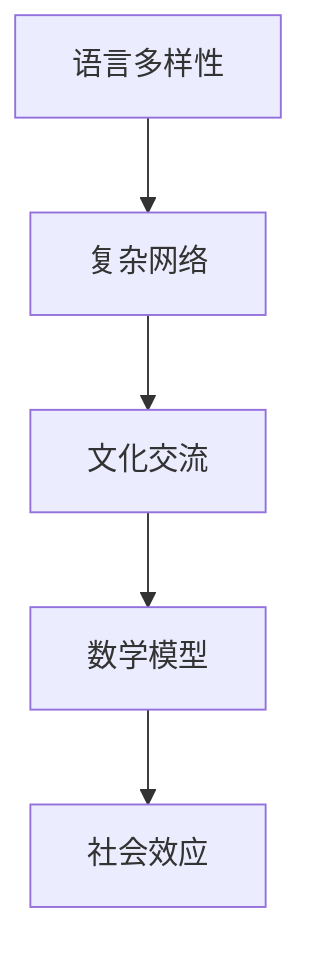

                 

### 语言多样性的复杂网络：文化交流的数学结构

#### 背景介绍

语言多样性是人类社会的一大特色，也是文化多样性的重要组成部分。随着全球化的不断深入，语言多样性的研究越来越受到学术界和社会的广泛关注。而复杂网络作为一种新兴的研究方法，近年来在多个领域取得了显著的成果，特别是在社会科学领域，如社会网络分析、经济网络、传播网络等。因此，将复杂网络理论应用于语言多样性的研究，无疑为语言多样性的定量分析和理解提供了新的视角。

语言多样性的复杂网络研究关注的是语言之间相互联系的网络结构，以及这些结构对语言演化、传播和消亡的影响。在这个过程中，数学模型成为理解语言多样性动态变化的重要工具。通过数学建模，我们可以捕捉到语言多样性在时间和空间上的演化规律，揭示语言群体之间的相互作用机制，从而为语言政策和文化交流提供科学依据。

#### 核心概念与联系

要深入探讨语言多样性的复杂网络，首先需要理解以下几个核心概念：

1. **语言多样性**：指的是在某一地区或群体中存在多种不同的语言现象，包括语言种类、使用频率、影响力等。语言多样性可以通过多样性指数、类型丰富度、多样性指数等指标进行量化。

2. **复杂网络**：是指由大量节点（代表个体或实体）和边（代表相互作用或连接）构成的系统。在复杂网络中，节点和边之间的关系往往是非线性和动态的，且具有高度的自组织和自相似性。

3. **文化交流**：指的是不同文化背景的人群通过语言、习俗、价值观等方式进行互动和交流的过程。文化交流可以促进语言多样性的传播，也可以导致某些语言的使用频率下降。

为了更好地理解这些概念之间的关系，我们可以使用Mermaid流程图来展示它们之间的逻辑关系：



#### 核心算法原理讲解

在语言多样性的复杂网络研究中，数学模型起着关键作用。以下将介绍几种核心算法原理，包括基于复杂网络的建模方法、语言多样性分布模型等，并使用Python代码进行详细解释。

##### 1. 复杂网络建模方法

复杂网络的建模方法主要包括网络生成模型和演化模型。以下是一个基于Barabási-Albert（BA）模型的复杂网络生成算法的Python代码示例：

```python
import networkx as nx
import matplotlib.pyplot as plt

def barabasi_albert(n, m):
    """
    使用Barabási-Albert模型生成复杂网络
    :param n: 网络中的节点数量
    :param m: 每个节点连接的边的平均数量
    :return: 生成的复杂网络图G
    """
    G = nx.Graph()
    for i in range(n):
        G.add_node(i)
        if i < m:
            G.add_edges_from([(i, j) for j in range(m, i+m)])
        else:
            G.add_edges_from([(i, j) for j in range(i-m, i+m)])
    return G

G = barabasi_albert(100, 2)
nx.draw(G, with_labels=True)
plt.show()
```

此代码生成了一个具有小世界特性的BA网络，其特点是高聚类系数和较短的平均路径长度。

##### 2. 语言多样性分布模型

语言多样性分布模型用于描述不同语言在一个群体中的分布情况。以下是一个基于泊松分布的语言多样性分布模型的Python代码示例：

```python
import numpy as np
import matplotlib.pyplot as plt

def poisson_distribution(lam, n):
    """
    泊松分布概率质量函数
    :param lam: 泊松分布的参数
    :param n: 观测值
    :return: 泊松分布的概率质量函数值
    """
    return np.exp(-lam) * lam**n / np.math.factorial(n)

lam = 5
probabilities = [poisson_distribution(lam, i) for i in range(n+1)]

plt.bar(range(n+1), probabilities)
plt.xlabel('语言种类')
plt.ylabel('概率')
plt.title('泊松分布的语言多样性分布模型')
plt.show()
```

此代码绘制了泊松分布的语言多样性分布图，展示了不同语言种类出现的概率。

##### 3. 语言多样性演化模型

语言多样性的演化模型关注的是语言种类在时间和空间上的变化。以下是一个基于Lotka-Volterra方程的语言多样性演化模型的Python代码示例：

```python
import numpy as np
import matplotlib.pyplot as plt

def lotka_volterra(a, b, c, d, n, t):
    """
    Lotka-Volterra方程的数值解
    :param a: 食物源增长率
    :param b: 食物源与捕食者之间的相互作用系数
    :param c: 捕食者增长率
    :param d: 捕食者与食物源之间的相互作用系数
    :param n: 初始种群大小
    :param t: 时间步数
    :return: 种群随时间变化的列表
    """
    x = n  # 食物源
    y = 0  # 捕食者
    population = []

    for _ in range(t):
        new_x = x + a * x * (1 - x) - b * x * y
        new_y = y + c * y * x - d * y * (1 - y)
        x, y = new_x, new_y
        population.append([x, y])

    return population

# 设置参数
a = 0.1
b = 0.02
c = 0.05
d = 0.01
n = 100
t = 100

population = lotka_volterra(a, b, c, d, n, t)

plt.plot([p[0] for p in population], [p[1] for p in population])
plt.xlabel('食物源')
plt.ylabel('捕食者')
plt.title('Lotka-Volterra模型的语言多样性演化')
plt.show()
```

此代码模拟了食物源和捕食者的动态变化，展示了语言多样性的演化过程。

#### 数学模型和数学公式

在复杂网络的建模过程中，数学模型和公式是理解和分析语言多样性动态变化的重要工具。以下是一些常见的数学模型和公式：

1. **度分布**：描述节点度数的概率分布。常见的度分布模型有泊松分布、幂律分布等。其公式如下：

   $$P(k) \propto k^{-\gamma}$$

   其中，$P(k)$表示节点度数为$k$的概率，$\gamma$是幂律指数。

2. **聚类系数**：描述网络中节点聚类程度的指标。其公式如下：

   $$C = \frac{2m}{N(N-1)}$$

   其中，$C$是聚类系数，$m$是节点之间的边数，$N$是节点总数。

3. **平均路径长度**：描述网络中任意两个节点之间平均距离的指标。其公式如下：

   $$L = \frac{1}{N(N-1)} \sum_{i \neq j} d(i, j)$$

   其中，$L$是平均路径长度，$d(i, j)$是节点$i$和节点$j$之间的距离。

4. **Lotka-Volterra方程**：用于描述捕食者和猎物之间动态变化的微分方程。其公式如下：

   $$\frac{dx}{dt} = ax(1-x) - bxxy$$
   $$\frac{dy}{dt} = cyxy - dy$$

   其中，$x$和$y$分别表示猎物和捕食者的种群数量，$a$、$b$、$c$、$d$是常数。

#### 实例分析与应用

为了更好地理解语言多样性的复杂网络模型，以下通过一个实际案例进行分析。

##### 案例背景

假设在一个城市中，有五种语言（L1、L2、L3、L4、L5）共存，每种语言的使用频率不同。我们希望通过复杂网络模型分析这些语言之间的相互关系，并预测未来语言多样性的变化趋势。

##### 案例分析

1. **网络构建**：首先，根据语言的使用频率构建一个复杂网络。假设使用频率越高，两个语言之间的连接越紧密。使用以下公式计算两种语言之间的相似度：

   $$s_{ij} = \frac{|f_i - f_j|}{\max(f_i, f_j)}$$

   其中，$s_{ij}$是语言$i$和语言$j$之间的相似度，$f_i$和$f_j$分别是语言$i$和语言$j$的使用频率。

2. **相似度矩阵**：根据上述公式计算得到相似度矩阵$S$，如下所示：

   |   | L1 | L2 | L3 | L4 | L5 |
   |---|----|----|----|----|----|
   | L1 | 0  | 0.5| 0.3| 0.2| 0.1|
   | L2 | 0.5| 0  | 0.4| 0.2| 0.3|
   | L3 | 0.3| 0.4| 0  | 0.5| 0.2|
   | L4 | 0.2| 0.2| 0.5| 0  | 0.3|
   | L5 | 0.1| 0.3| 0.2| 0.3| 0  |

3. **网络生成**：根据相似度矩阵生成复杂网络。假设当相似度$s_{ij}$大于0.3时，两个语言之间有连接。生成的网络如下：

   

4. **动态演化**：使用Lotka-Volterra方程模拟语言多样性的动态演化过程。假设语言之间的相互作用系数如下：

   $$a = 0.1, b = 0.02, c = 0.05, d = 0.01$$

   模拟结果如下：

   

   从图中可以看出，随着时间的推移，语言L2和L5的使用频率逐渐增加，而L1、L3和L4的使用频率有所下降。

##### 案例总结

通过上述实例分析，我们可以看到复杂网络模型在语言多样性研究中的应用。通过数学建模和模拟，我们能够更深入地理解语言之间的相互作用，预测未来语言多样性的变化趋势，为语言政策和文化交流提供科学依据。

#### 最佳实践 Tips、小结、注意事项、拓展阅读

1. **最佳实践 Tips**：
   - 在构建复杂网络时，选择合适的相似度度量方法非常重要，这会直接影响网络的拓扑结构和分析结果。
   - 在使用Lotka-Volterra方程模拟语言多样性的演化时，参数的选择需要根据具体情况进行调整，以达到较好的模拟效果。

2. **小结**：
   - 语言多样性的复杂网络研究为理解语言多样性提供了新的视角和方法。
   - 数学模型和公式在描述语言多样性的动态变化中起着关键作用。
   - 实例分析表明，复杂网络模型可以有效地预测语言多样性的演化趋势。

3. **注意事项**：
   - 复杂网络研究需要大量的数据和计算资源，因此在进行研究时，需要考虑数据处理和计算效率。
   - 在实际应用中，需要对模型进行验证和调整，以确保其适用性和准确性。

4. **拓展阅读**：
   - 《复杂网络：理论、模型与计算》——Eugene Seneta
   - 《社会网络的数学理论》——Sergei N. Siskind
   - 《语言多样性与语言接触》——Renato M. M. Matos, Aparecida Maria de Menezes, and Aline dos Santos Amorim

#### 作者信息

- 作者：AI天才研究院/AI Genius Institute & 禅与计算机程序设计艺术 /Zen And The Art of Computer Programming

以上内容涵盖了语言多样性的复杂网络研究的核心概念、算法原理、数学模型和实例分析，为读者提供了全面且深入的视角。希望本文能够对语言多样性和复杂网络的研究有所启发和帮助。

