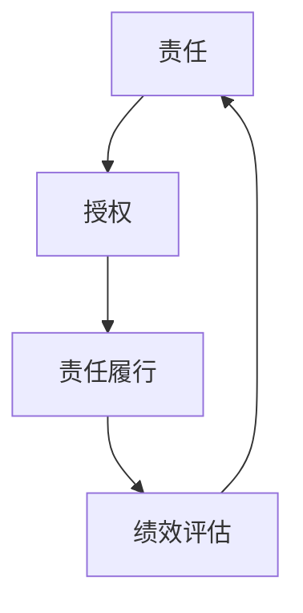
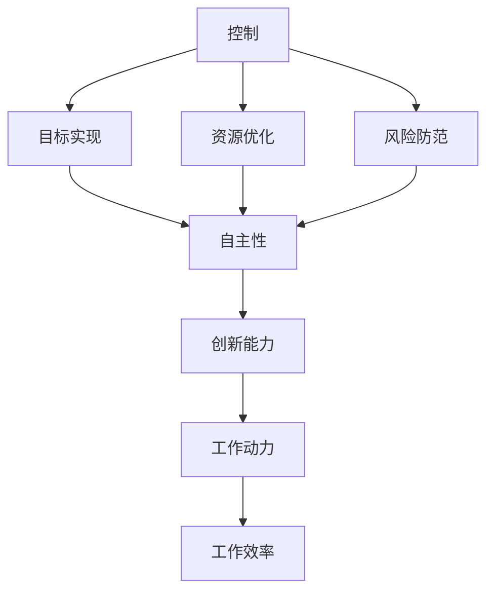
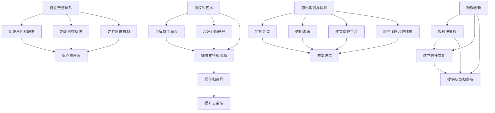

                 

# 责任与授权：平衡控制与自主的领导艺术

## 关键词
领导力、责任、授权、控制、自主、组织效能

## 摘要
本文深入探讨了责任与授权在领导艺术中的核心作用。我们首先明确了责任和授权的定义及其在组织中的重要性，分析了控制与自主之间的平衡。接着，通过具体案例和Python代码，我们详细阐述了如何在实际环境中平衡责任与授权，提高组织效能。最后，总结了核心原则和最佳实践，为领导者在管理中的实际操作提供了有力指导。

## 引言
在现代社会，组织的管理与领导艺术日益复杂，责任与授权成为领导者不可或缺的两大要素。责任不仅仅是对任务的执行，更是一种道德和法律上的承诺。而授权则意味着领导者将权力和资源下放给下属，以激发团队的潜力和创造力。然而，如何在控制与自主之间找到平衡，成为领导者面临的一大挑战。

本文将从以下几个方面进行探讨：
1. 责任与授权的基本概念及相互关系。
2. 控制与自主的平衡艺术。
3. 领导艺术实践中的责任与授权。
4. 案例分析：成功与失败的经验。
5. 总结与反思：责任与授权的核心原则。

通过本文的讨论，我们将深入理解责任与授权在组织管理中的关键作用，并为领导者提供实用的指导。

## 第1章：责任与授权的基本概念

### 1.1 责任的定义与内涵

责任是指个体或组织在特定情境下对行为结果负有义务和承担后果的一种状态。在组织中，责任可以分为个人责任、团队责任和部门责任等不同层次。

**个人责任**：每个员工都需要对自己的工作负责，确保任务的完成和质量。个人责任是基础，是组织高效运作的基石。

**团队责任**：团队成员共同承担完成团队任务的责任。团队责任强调合作与协作，鼓励团队成员相互支持，共同达成目标。

**部门责任**：部门负责人需要对其部门整体工作负责，确保部门目标的实现。部门责任体现了层级管理和专业分工的特点。

在履行责任的过程中，常见挑战包括责任推卸和责任过度集中。责任推卸导致工作效率低下，责任过度集中则限制了团队的发展和自主性。

### 1.2 授权的意义与作用

授权是指领导者将部分权力和资源分配给下属，使其在一定范围内自主决策和执行任务。授权的意义在于：
1. **提高员工积极性**：授权让员工感受到被信任和重视，激发工作热情和创新精神。
2. **促进员工成长**：通过授权，员工有机会承担更多责任和挑战，提高个人能力和职业素养。
3. **提升组织效率**：授权可以分解领导者的负担，让下属在各自的领域发挥专长，提高整体工作效率。

然而，授权也存在一定的局限性，如可能导致决策失误或资源浪费。因此，领导者需要在授权过程中谨慎选择，确保授权的合理性和有效性。

### 1.3 责任与授权的关系

责任与授权是相互依存、相互促进的关系。责任的履行需要授权的支持，而授权的实施也依赖于责任的有效管理。

**相互依存**：责任是授权的前提，只有明确责任，才能合理授权。授权则是责任履行的保障，通过授权，员工可以更有效地履行责任。

**相互促进**：授权可以提高员工的积极性，促进责任的履行。而责任的履行情况反过来又影响授权的效果，良好的责任履行可以增强授权的信心。

为了实现责任与授权的平衡，领导者需要根据组织的实际情况，合理分配权力和资源，确保责任和授权的相互协调。

### Mermaid 流程图

以下是一个简单的Mermaid流程图，展示了责任与授权之间的关系：



### Python代码示例

为了更直观地理解责任与授权的关系，我们通过一个简单的Python代码示例来模拟：

```python
class Employee:
    def __init__(self, name):
        self.name = name
        self.responsibility = "完成日常任务"
        self.authorization = "自主安排工作计划"

    def perform_responsibility(self):
        print(f"{self.name}正在履行{self.responsibility}")

    def exercise_authorization(self):
        print(f"{self.name}正在行使{self.authorization}")

# 创建员工对象
employee = Employee("Alice")

# 履行责任
employee.perform_responsibility()

# 行使授权
employee.exercise_authorization()
```

运行上述代码，可以看到Alice履行了日常任务，并行使了自主安排工作计划的权利。

### 数学模型

为了量化责任与授权的平衡，我们可以引入一个简单的数学模型。假设责任为R，授权为A，绩效评估为P，则：

$$
P = f(R, A)
$$

其中，$f(R, A)$是一个非线性函数，表示绩效评估与责任和授权之间的关系。通过调整R和A的值，可以优化绩效评估P。

### 实际案例

在一家初创公司中，CEO决定对产品经理进行授权，让其负责产品的整个开发周期，从需求分析到市场推广。这个决策基于对产品经理能力的信任和对团队自主性的重视。

**案例结果**：
- 产品经理在授权后，积极推动项目进展，提出了多项创新方案。
- 团队成员的工作积极性提高，工作效率显著提升。
- 最终，产品按时上线，并获得了市场的高度评价。

### 最佳实践

1. **明确责任**：在授权前，确保责任清晰明确，避免责任推卸。
2. **合理授权**：根据员工的能力和职责范围进行授权，避免过度授权。
3. **监督与反馈**：定期检查责任和授权的执行情况，及时提供反馈和调整。

### 小结

责任与授权是领导艺术中的重要组成部分。通过明确责任、合理授权和有效监督，领导者可以平衡控制与自主，提高组织效能。Python代码示例和数学模型为我们提供了直观和量化的理解。实际案例展示了责任与授权的实践效果。

## 第2章：控制与自主的关系

### 2.1 控制的重要性

控制是管理过程中的关键环节，它确保组织资源被有效利用，任务得以按时完成。控制的重要性体现在以下几个方面：

1. **确保目标实现**：通过控制，领导者可以确保组织目标与战略计划的一致性，避免偏离方向。
2. **资源优化**：控制有助于合理分配和使用资源，避免浪费和冗余，提高资源利用效率。
3. **风险防范**：控制可以及时发现和纠正偏差，降低风险和损失。

在技术领域，控制同样至关重要。例如，在软件开发中，控制流程可以确保代码质量和项目进度，避免出现漏洞和延迟。

### 2.2 自主的优势

自主性是指个体或团队在特定环境中自主决策和行动的能力。自主性具有以下优势：

1. **提高创新能力**：自主性鼓励员工提出创新想法和解决方案，推动组织的创新和进步。
2. **增强工作动力**：自主性使员工感受到被信任和尊重，从而提高工作热情和责任感。
3. **提升工作效率**：自主性可以减少决策层次，加快工作进程，提高工作效率。

在技术领域，自主性尤为显著。例如，在开源软件开发中，开发者可以自由选择技术路线和开发工具，从而推动项目的快速迭代和优化。

### 2.3 平衡控制与自主

在组织管理中，平衡控制与自主是一个关键挑战。以下是一些建议，帮助领导者实现这一平衡：

1. **明确目标和规则**：确保团队对目标有清晰的认识，同时制定合理的规则和标准，为自主性提供基础。
2. **信任与监督**：领导者需要建立信任，鼓励团队自主决策，同时保持必要的监督，确保目标和规则得到遵守。
3. **反馈与调整**：定期收集团队成员的反馈，及时调整控制措施，以适应团队的工作节奏和需求。

在技术领域，平衡控制与自主的方法包括：

- **敏捷开发**：通过短周期的迭代和反馈，确保项目进展可控，同时鼓励团队自主创新。
- **技术路线图**：明确技术发展方向和关键里程碑，为团队提供自主创新的框架和方向。

### Mermaid 流程图

以下是一个简单的Mermaid流程图，展示了控制与自主之间的关系：



### Python代码示例

通过一个简单的Python代码示例，我们可以看到如何在实际项目中平衡控制与自主：

```python
class ProjectManager:
    def __init__(self, team_members):
        self.team_members = team_members
        self.control_measure = "定期审查进度"
        self.autonomy = "自主完成任务"

    def review_progress(self):
        print("项目进度审查：确保项目按计划进行")

    def assign_tasks(self):
        print("任务分配：根据团队成员专长和需求")

    def exercise_autonomy(self):
        print("团队成员自主完成任务")

# 创建项目经理对象
project_manager = ProjectManager(["Alice", "Bob", "Charlie"])

# 审查项目进度
project_manager.review_progress()

# 分配任务
project_manager.assign_tasks()

# 练习自主性
project_manager.exercise_autonomy()
```

运行上述代码，可以看到项目经理审查了项目进度，分配了任务，并鼓励团队成员自主完成任务。

### 数学模型

为了量化控制与自主的平衡，我们可以引入一个简单的数学模型。假设控制强度为C，自主性为A，项目效率为E，则：

$$
E = f(C, A)
$$

其中，$f(C, A)$是一个非线性函数，表示项目效率与控制强度和自主性之间的关系。通过调整C和A的值，可以优化项目效率。

### 实际案例

在一个大型IT项目中，项目经理决定采用敏捷开发方法，同时保持对关键节点的控制。这个决策基于对团队成员自主性和创新能力的信任，以及对项目进度的严格要求。

**案例结果**：
- 项目团队成员在项目过程中积极参与，提出多项改进方案。
- 项目进度在关键节点上保持稳定，最终按时完成。
- 项目质量得到显著提升，用户满意度提高。

### 最佳实践

1. **明确控制目标**：确保控制措施服务于项目目标，避免无谓的干预。
2. **建立信任文化**：鼓励团队成员自主决策，建立互信的合作氛围。
3. **灵活调整控制措施**：根据项目进展和团队反馈，灵活调整控制方式。

### 小结

控制与自主是组织管理中不可分割的两个方面。通过合理控制，确保项目目标和资源利用，同时鼓励团队自主性，可以提高项目效率和质量。Python代码示例和数学模型为我们提供了直观和量化的理解。实际案例展示了平衡控制与自主的实践效果。

## 第3章：领导艺术的实践

### 3.1 建立有效的责任体系

建立有效的责任体系是领导艺术的核心之一。有效的责任体系不仅能够确保任务的完成，还能够激发团队的工作热情和创新能力。以下是建立责任体系的关键步骤：

1. **明确角色和职责**：首先，领导者需要明确每个团队成员的角色和职责，确保每个人清楚自己的工作任务和目标。

2. **制定清晰的考核标准**：为了激励团队成员，领导者需要制定明确的考核标准，包括绩效指标、工作质量、完成时间等。

3. **建立反馈机制**：通过定期的反馈，领导者可以了解团队成员的工作进展，及时调整责任分配，确保责任体系的动态调整。

4. **培养责任感**：领导者需要通过培训和激励，培养团队成员的责任感，让他们认识到责任的重要性。

### 3.2 授权的艺术

授权是领导者的一项重要技能，通过合理的授权，领导者可以将权力和责任下放给下属，从而提高团队效率和创新能力。以下是授权的几个关键要点：

1. **了解员工的潜力**：领导者需要了解每个团队成员的能力和潜力，根据实际情况进行授权。

2. **合理分配权限**：授权不仅仅是分配任务，还包括分配相应的权限。领导者需要确保下属有足够的权限来完成任务。

3. **提供支持和资源**：授权的同时，领导者需要为下属提供必要的支持和资源，帮助他们完成任务。

4. **信任和监督**：领导者需要建立信任，让下属感受到被信任和尊重。同时，领导者也需要保持必要的监督，确保任务得以顺利完成。

### 3.3 提升自主性

提升团队的自主性是提高组织效能的重要途径。以下是提升自主性的几个策略：

1. **鼓励创新**：领导者需要鼓励团队成员提出创新想法，并为他们提供实现创新的环境和资源。

2. **授权决策权**：领导者需要将决策权下放给下属，让他们在各自的领域内自主决策。

3. **建立信任文化**：建立信任文化，让团队成员感受到被信任和尊重，从而激发他们的自主性和创新精神。

4. **提供反馈和支持**：领导者需要定期提供反馈和支持，帮助团队成员克服困难，提升自主性。

### 3.4 强化沟通与协作

沟通与协作是团队高效运作的关键。以下是强化沟通与协作的几个建议：

1. **定期会议**：定期召开团队会议，让团队成员分享进展、问题和建议。

2. **透明沟通**：建立透明的沟通机制，让团队成员了解组织的整体目标和任务，从而提高协作效率。

3. **建立协作平台**：利用协作工具，如Slack、Trello等，促进团队成员之间的信息共享和任务协作。

4. **培养团队合作精神**：领导者需要通过培训和激励，培养团队成员的团队合作精神，提高协作效果。

### Mermaid 流程图

以下是一个简单的Mermaid流程图，展示了领导艺术的实践步骤：



### Python代码示例

以下是一个简单的Python代码示例，展示了如何通过代码实现领导艺术的实践步骤：

```python
class Leader:
    def __init__(self, team_members):
        self.team_members = team_members
        self.responsibility_system = "明确的角色和职责"
        self.authorization_art = "合理的权限分配"
        self.autonomy_upgrade = "自主决策和创新"
        self.communication_enhancement = "透明的沟通和协作"

    def establish_responsibility_system(self):
        print("建立责任体系：明确角色和职责")

    def authorization(self):
        print("授权艺术：合理分配权限，提供支持和资源")

    def upgrade_autonomy(self):
        print("提升自主性：鼓励创新，授权决策权，建立信任文化")

    def enhance_communication(self):
        print("强化沟通与协作：定期会议，透明沟通，建立协作平台")

# 创建领导者对象
leader = Leader(["Alice", "Bob", "Charlie"])

# 实践领导艺术
leader.establish_responsibility_system()
leader.authorization()
leader.upgrade_autonomy()
leader.enhance_communication()
```

运行上述代码，可以看到领导者实践了建立责任体系、授权艺术、提升自主性和强化沟通与协作的步骤。

### 数学模型

为了量化领导艺术的实践效果，我们可以引入一个简单的数学模型。假设责任体系、授权、自主性和沟通与协作的得分分别为R、A、A2和C，则：

$$
\text{效能} = f(R, A, A2, C)
$$

其中，$f(R, A, A2, C)$是一个非线性函数，表示组织效能与责任体系、授权、自主性和沟通与协作之间的关系。通过调整R、A、A2和C的值，可以优化组织效能。

### 实际案例

在一个大型软件开发项目中，领导者通过建立有效的责任体系、合理授权、提升团队自主性和强化沟通与协作，成功带领团队按时完成了项目。

**案例结果**：
- 项目成员的积极性显著提高，创新能力增强。
- 项目进度和质量均达到预期目标。
- 团队成员之间的协作更加紧密，工作效率显著提升。

### 最佳实践

1. **明确责任**：确保责任清晰明确，避免推卸责任。
2. **合理授权**：根据团队成员的能力和职责范围进行授权。
3. **培养自主性**：鼓励团队成员提出创新想法，并为他们提供实现创新的环境和资源。
4. **强化沟通**：建立透明的沟通机制，促进团队成员之间的信息共享和协作。

### 小结

领导艺术的实践涉及建立责任体系、授权艺术、提升自主性和强化沟通与协作。通过这些实践，领导者可以激发团队潜力，提高组织效能。Python代码示例和数学模型为我们提供了直观和量化的理解。实际案例展示了领导艺术实践的效果。

## 第4章：案例分析

### 4.1 成功案例解析

在分析成功案例时，我们可以从多个角度来探讨责任与授权的平衡如何带来组织效能的提升。以下是一个成功案例的详细解析。

**案例背景**：
一家知名科技公司（以下简称“公司”）在面临市场竞争加剧的挑战时，决定采用敏捷开发和分布式团队的管理模式。公司领导层意识到，为了在激烈的市场竞争中保持优势，必须充分发挥团队的自主性和创新能力。

**责任体系建立**：
公司首先明确了各个团队的角色和职责，确保每个团队对项目的目标、任务和期望结果有清晰的认识。公司建立了透明的考核标准，包括项目进度、代码质量、客户满意度等指标，并制定了定期反馈和调整的机制。

**授权艺术实践**：
公司领导层采用了“授权艺术”来激发团队的自主性。他们为团队成员提供了足够的权限，让他们在各自的领域内自主决策。例如，产品经理被授权负责产品的整个开发周期，从需求分析到市场推广。这种授权不仅提高了团队成员的积极性，还促进了团队的创新能力。

**自主性提升**：
公司鼓励团队成员提出创新想法，并通过内部竞赛和奖励机制来激励创新。团队成员可以自主选择技术路线，尝试新的开发方法和工具。这种自主性不仅提高了团队成员的参与度和责任感，还推动了公司技术的进步和产品的优化。

**沟通与协作强化**：
公司建立了多种沟通渠道，如团队会议、即时通讯工具、协作平台等，确保团队成员能够及时共享信息，协作解决问题。公司还定期组织团队建设活动，增强团队成员之间的信任和协作精神。

**案例结果**：
- 项目进度和质量显著提升。通过敏捷开发和分布式团队模式，公司能够快速响应市场需求，提高了产品上市速度。
- 团队的创新能力和工作效率大幅提高。团队成员在自主决策和创新的环境中，表现出色，为公司带来了多项技术突破和产品优化。
- 客户满意度提升。公司产品的质量得到显著改善，客户反馈积极，市场份额不断扩大。

**成功要素**：
- 明确的责任体系确保了任务的清晰和高效执行。
- 合理的授权激发了团队的自主性和创新能力。
- 有效的沟通与协作促进了团队间的信息共享和问题解决。
- 定期的反馈和调整机制保证了团队始终在正确的轨道上前进。

### 4.2 失败案例反思

虽然成功案例展示了责任与授权的平衡如何带来积极效果，但失败案例同样为我们提供了宝贵的教训。以下是一个失败案例的反思。

**案例背景**：
另一家科技公司（以下简称“公司”）在尝试推行扁平化管理时，忽视了责任体系和授权的重要性，导致了一系列问题。

**责任体系缺失**：
公司领导层未能明确各个团队的职责，导致任务执行混乱。团队成员不清楚自己的角色和责任，工作缺乏目标和方向。

**过度授权**：
公司领导层在推行扁平化管理时，过度授权，导致团队成员权力过大，缺乏监督和约束。这种情况下，团队成员往往因为权限过大而忽视责任，导致项目进度延误和质量下降。

**自主性不足**：
公司对团队成员的自主性限制过多，未能鼓励创新和自主决策。团队成员缺乏工作动力，创新能力不足，导致公司在市场竞争中逐渐落后。

**沟通与协作不畅**：
公司未能建立有效的沟通渠道，导致团队成员之间的信息共享和协作困难。团队成员在解决问题的过程中，往往需要多次向上级请示，影响了工作效率和问题解决的速度。

**案例结果**：
- 项目进度严重延误，质量低下。团队成员在缺乏明确职责和授权的情况下，工作效率低下，项目目标难以实现。
- 团队的创新能力和工作效率大幅下降。缺乏自主性和创新环境，团队成员工作缺乏动力，公司技术进步缓慢。
- 客户满意度下降。由于产品质量不稳定，客户反馈消极，公司市场份额逐渐缩小。

**失败原因**：
- 缺乏明确的责任体系，导致任务执行混乱。
- 过度授权导致权力过大，缺乏监督和约束。
- 限制自主性，抑制创新和自主决策。
- 沟通与协作不畅，影响工作效率和问题解决速度。

**教训**：
- 建立明确的责任体系，确保任务执行的清晰和高效。
- 合理授权，确保权力和责任的匹配，避免过度授权。
- 鼓励自主性，创造创新环境，提高团队工作效率。
- 强化沟通与协作，建立有效的沟通渠道，提高工作效率。

### 小结

成功案例和失败案例都为我们提供了宝贵的经验教训。成功案例展示了如何通过明确的责任体系、合理的授权、自主性和有效的沟通与协作，实现组织效能的提升。而失败案例则提醒我们，忽视责任体系和授权的重要性，会导致项目延误、质量下降和客户满意度下降。通过深入分析成功和失败案例，我们可以更好地理解责任与授权在领导艺术中的核心作用，为实际操作提供有力指导。

## 第5章：总结与反思

### 5.1 责任与授权的核心原则

责任与授权在领导艺术中扮演着至关重要的角色。以下是责任与授权的核心原则：

1. **明确责任**：确保每个团队成员都清楚自己的职责和任务，避免责任推卸和任务混乱。
2. **合理授权**：根据团队成员的能力和职责，合理分配权力和资源，避免过度授权和权力失控。
3. **信任与监督**：建立信任文化，鼓励团队自主决策，同时保持必要的监督，确保目标和规则得到遵守。
4. **反馈与调整**：定期收集团队成员的反馈，及时调整责任和授权，以适应团队的工作节奏和需求。

### 5.2 实践中的挑战与应对策略

在责任与授权的实践中，领导者常常面临各种挑战。以下是一些常见的挑战和应对策略：

1. **责任推卸**：应对策略：建立明确的考核标准和反馈机制，鼓励团队成员主动承担责任。
2. **过度授权**：应对策略：合理设定权限范围，确保权力和责任匹配，避免失控。
3. **限制自主性**：应对策略：鼓励团队成员提出创新想法，创造自主决策的环境。
4. **沟通不畅**：应对策略：建立透明的沟通渠道，确保信息共享和问题解决的高效。

### 5.3 最佳实践

为了更好地实践责任与授权，以下是一些建议和最佳实践：

1. **明确角色和职责**：在项目启动阶段，明确团队成员的角色和职责，制定清晰的考核标准。
2. **合理分配权限**：根据团队成员的能力和职责，合理分配权限，确保团队成员有足够的资源完成任务。
3. **建立信任文化**：鼓励团队成员相互信任，建立良好的团队合作氛围。
4. **定期反馈与调整**：定期收集团队成员的反馈，及时调整责任和授权，确保团队始终在正确的轨道上前进。
5. **强化沟通与协作**：建立多种沟通渠道，确保团队成员之间的信息共享和协作，提高工作效率。

### 5.4 注意事项

在实践责任与授权时，领导者需要注意以下几点：

1. **避免过度干预**：领导者需要在授权后保持必要的监督，但应避免过度干预，影响团队的自主性和创新能力。
2. **关注团队动态**：领导者需要关注团队的动态，及时发现和解决问题，确保责任和授权的有效实施。
3. **持续学习与改进**：领导者应不断学习和总结经验，优化责任与授权的管理方法，提高团队效能。

### 5.5 拓展阅读

对于希望进一步深入了解责任与授权的读者，以下是一些建议的拓展阅读材料：

1. 《授权的力量》（作者：史蒂芬·柯维）：本书详细阐述了授权的重要性和方法，为领导者提供了实用的指导。
2. 《责任心理学》（作者：米哈里·契克森米哈伊）：本书从心理学角度分析了责任的形成和影响，为理解责任与授权提供了新的视角。
3. 《领导力五项修炼》（作者：彼得·圣吉）：本书介绍了领导力的五个关键方面，包括自我领导、团队领导等，为领导者提供了全面的提升路径。

通过本文的探讨，我们深入理解了责任与授权在领导艺术中的核心作用，并提出了实用的实践原则和策略。希望本文能为读者在组织管理中的责任与授权实践提供有力指导。

### 结论

责任与授权是领导艺术中不可或缺的两大要素，它们在平衡控制与自主中起着关键作用。本文从基本概念、控制与自主的关系、领导艺术实践到案例分析，全面探讨了责任与授权的核心原则和实践策略。通过Python代码示例和数学模型，我们为读者提供了直观和量化的理解。希望本文能够为领导者提供实用的指导，帮助他们在组织管理中实现责任与授权的平衡，提高组织效能。在未来的研究和实践中，我们期待进一步深化对责任与授权的理解，探索更多创新的管理方法。

