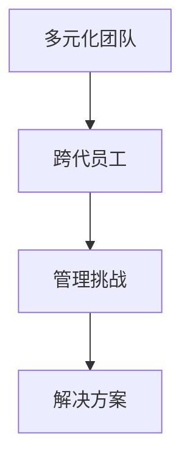
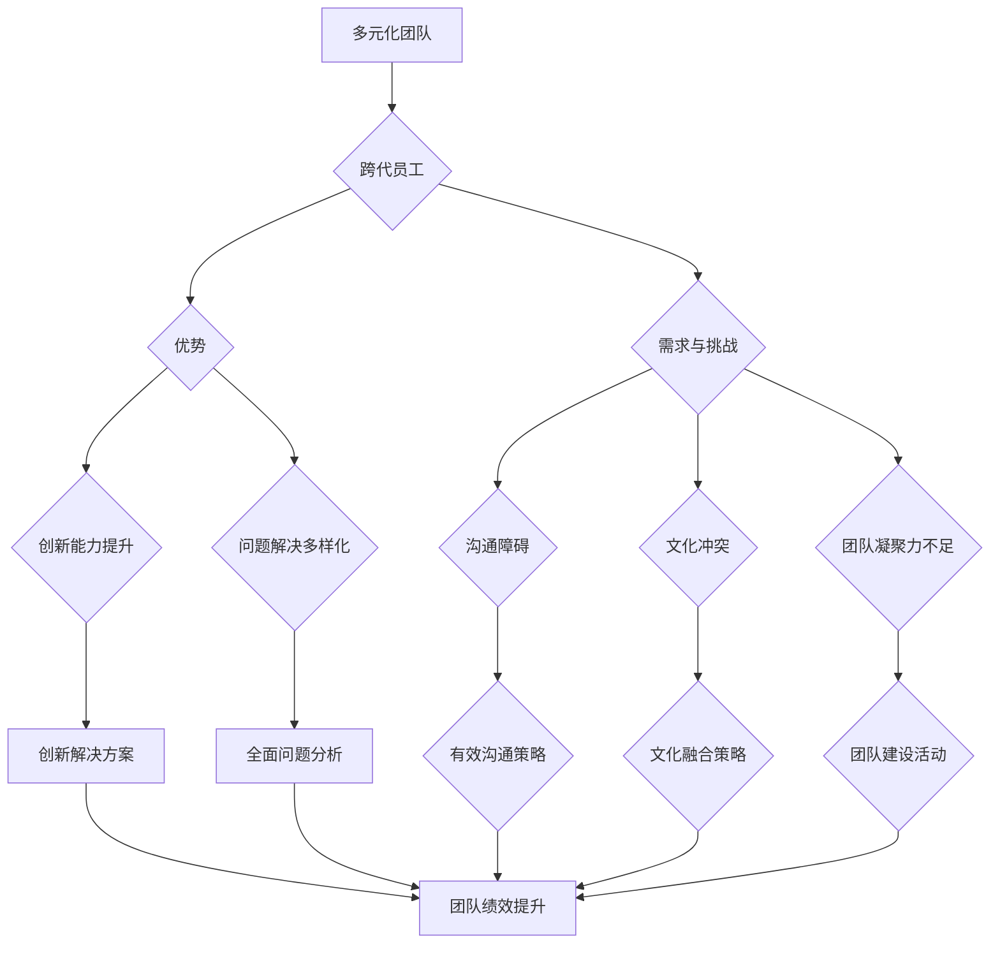

                 

### 引言

在当今快速发展的科技时代，企业面临的挑战和机遇前所未有。多元化团队，特别是跨代员工的管理，已成为企业持续发展和创新的关键因素。随着不同年龄段、文化背景和专业技能的员工在企业中共同工作，如何有效地管理这样的团队，成为了每一个企业领导者必须面对的问题。

#### **背景介绍**

随着全球化和信息化的发展，企业不仅需要适应国内市场的变化，还要面对国际市场的激烈竞争。在这个过程中，多元化团队展现出了其独特的优势。不同代际的员工能够带来不同的思维方式和技能，从而为企业注入新鲜活力。然而，这也带来了新的管理挑战，如沟通障碍、文化冲突和工作风格差异等。

#### **核心概念与联系**

为了更好地理解多元化团队管理，我们需要先明确几个核心概念：

- **多元化团队**：指由不同年龄、性别、文化背景、教育程度和专业技能的员工组成的团队。
- **跨代员工**：指来自不同年代、具有不同价值观和工作方式的员工。

这两者之间的关系可以简化为以下Mermaid流程图：



从图中我们可以看出，多元化团队中包含了跨代员工，而跨代员工的存在又带来了管理上的挑战，这些挑战需要通过有效的解决方案来应对。

#### **重要性**

有效的跨代员工管理不仅能提高团队的整体效率，还能促进创新和员工满意度。对于企业来说，这意味着更高的生产力和竞争力。而对于员工来说，良好的管理可以提供职业发展的平台，增强工作满意度和忠诚度。

#### **目标**

本文的目标是提供一个全面且实用的跨代员工管理指南，帮助企业和团队领导者应对多元化团队的管理挑战。我们将通过以下几个部分详细探讨：

1. **多元化团队的概念与重要性**
2. **跨代员工的特点与需求**
3. **多元化团队管理策略**
4. **实践案例与未来趋势**

通过这些内容的逐步分析，我们希望读者能够深入了解多元化团队管理的核心要点，并在实际工作中运用这些策略和工具。

### 摘要

本文旨在探讨如何有效地管理多元化团队中的跨代员工，以应对当前企业面临的复杂挑战和机遇。首先，我们介绍了多元化团队和跨代员工的基本概念，并分析了它们之间的关系。接着，本文详细探讨了多元化团队管理的核心策略，包括建立有效的沟通机制、激发跨代员工的潜力、促进团队协作以及冲突管理和团队凝聚力提升。通过具体案例和未来趋势的分析，我们提供了实用的指导和建议，帮助企业和团队领导者更好地应对多元化团队的管理挑战。

---

> 关键词：多元化团队，跨代员工管理，沟通机制，团队协作，冲突管理，未来趋势。

---

## 第一部分：多元化团队概述

在全球化和信息化日益深入的今天，多元化团队已经成为许多企业成功的关键因素之一。本部分将详细探讨多元化团队的概念、跨代员工的特点以及他们在团队中的作用，帮助读者更好地理解这一复杂但至关重要的管理领域。

### 第1章：多元化团队的概念与重要性

#### 1.1 多元化团队的定义

多元化团队指的是由具有不同背景、经验、知识和技能的员工组成的团队。这些背景包括但不限于年龄、性别、种族、文化、教育水平、工作经验等。多元化团队的核心在于其多样性，这种多样性为团队带来了多元化的视角和观点，从而增加了创新和问题解决的能力。

#### 1.2 多元化团队的优势

多元化团队的优势主要体现在以下几个方面：

1. **创新能力的提升**：多元化的团队成员能够从不同的角度看待问题，这有助于激发新的创意和创新的解决方案。
2. **问题解决的多样化**：在面对复杂问题时，多元化的团队往往能够更全面地分析和应对。
3. **员工满意度和忠诚度**：多元化环境能够提供更多的职业发展机会和培训，从而提高员工的工作满意度和忠诚度。
4. **组织适应性**：多元化团队能够更好地适应多变的市场环境和挑战，提高企业的竞争力。

#### 1.3 多元化团队的挑战

尽管多元化团队具有许多优势，但也面临着一些挑战：

1. **沟通障碍**：由于团队成员背景差异，沟通可能会变得复杂，导致误解和冲突。
2. **文化冲突**：不同的文化背景可能会引发价值观和工作方式的冲突。
3. **团队凝聚力不足**：多元化的团队成员可能在价值观和目标上存在差异，导致团队凝聚力不足。
4. **领导和管理难度增加**：管理者需要具备更高的管理技能，以应对多元化的挑战。

#### 1.4 多元化团队的现状

目前，多元化团队在许多行业中已经成为主流。一些领先企业，如谷歌、微软等，已经通过有效的多元化管理策略取得了显著的成功。然而，仍有不少企业尚未充分认识到多元化团队的重要性，或者缺乏有效的管理方法。

#### 1.5 多元化团队的未来趋势

随着全球化和技术的不断发展，多元化团队将继续成为企业竞争力的关键。未来的多元化团队管理将更加注重跨文化沟通、个性化培训和员工参与度。此外，随着人工智能和自动化技术的发展，多元化团队将在创新和决策过程中发挥更加重要的作用。

### 第2章：跨代员工的特点与需求

#### 2.1 跨代员工的定义

跨代员工是指来自不同代际的员工，通常包括婴儿潮一代、X一代、Y一代和Z一代等。每一代员工在价值观、工作态度、技术接受度等方面都有显著差异，这使得他们在团队中扮演着不同的角色。

#### 2.2 跨代员工的优势

跨代员工的优势主要体现在以下几个方面：

1. **丰富的经验和知识**：老员工通常拥有丰富的行业经验和专业知识，可以为团队提供宝贵的指导和建议。
2. **创新的思维**：年轻员工往往具有开放和创新的思维方式，能够带来新的想法和解决方案。
3. **多样性的技能**：跨代员工在技能和知识方面具有多样性，可以满足不同项目的需求。
4. **协作与沟通能力**：跨代员工在合作和沟通方面表现出色，能够促进团队的整体效率。

#### 2.3 跨代员工的需求与挑战

跨代员工的需求和挑战主要表现在以下几个方面：

1. **职业发展机会**：跨代员工普遍渴望职业发展机会，特别是年轻员工，他们希望在短时间内实现职业晋升。
2. **培训与支持**：跨代员工需要定期的培训和支持，以适应不断变化的工作环境和技术。
3. **工作与生活平衡**：跨代员工，尤其是年轻员工，更加重视工作与生活的平衡，企业需要提供灵活的工作安排。
4. **文化认同**：跨代员工希望在企业中感受到文化认同，特别是那些在多元文化环境中成长的员工。

#### 2.4 跨代员工在团队中的角色

跨代员工在团队中的角色各不相同，但通常可以概括为：

1. **导师与教练**：老员工可以作为新员工的导师和教练，帮助他们快速适应工作。
2. **创新推动者**：年轻员工可以作为创新的推动者，带来新的想法和技术。
3. **团队合作者**：所有跨代员工都是团队合作者，他们共同完成任务，实现团队目标。

通过本部分内容的探讨，我们希望读者能够对多元化团队和跨代员工有更深入的理解，从而更好地应对管理中的挑战，充分利用多元化团队的优势，提高团队的整体绩效。

### **核心概念与联系：多元化团队与跨代员工管理的关系架构**

为了更清晰地展示多元化团队与跨代员工管理之间的关系，我们可以使用以下Mermaid流程图：



从图中可以看出，多元化团队通过引入不同代际的员工（跨代员工），带来了各种优势（如创新能力提升和问题解决多样化）以及挑战（如沟通障碍和文化冲突）。有效的跨代员工管理策略（如有效沟通、文化融合和团队建设活动）可以帮助团队克服这些挑战，最终实现团队绩效的提升。

### **核心概念与联系：多元化团队与跨代员工管理的关系架构**

为了更清晰地展示多元化团队与跨代员工管理之间的关系，我们可以使用以下Mermaid流程图：


从图中可以看出，多元化团队通过引入不同代际的员工（跨代员工），带来了各种优势（如创新能力提升和问题解决多样化）以及挑战（如沟通障碍和文化冲突）。有效的跨代员工管理策略（如有效沟通、文化融合和团队建设活动）可以帮助团队克服这些挑战，最终实现团队绩效的提升。

### **核心算法原理讲解：多元化团队管理的数学模型**

在多元化团队管理中，我们可以使用数学模型来描述和管理团队绩效。以下是一个简化的数学模型，用于说明如何通过多元化团队管理提升团队绩效。

#### **1. 模型假设**

我们假设团队由N个成员组成，其中每名成员的绩效可以由以下因素决定：

- **个人技能（S）**：代表成员的技能水平。
- **团队协作（C）**：代表成员之间的协作效率。
- **沟通效果（M）**：代表团队成员之间的沟通效果。
- **文化融合（F）**：代表团队成员的文化背景融合程度。

#### **2. 绩效函数**

团队的总绩效（P）可以表示为：

\[ P = f(S, C, M, F) \]

其中，\( f \) 是一个综合函数，用来衡量个人技能、团队协作、沟通效果和文化融合对团队绩效的影响。

#### **3. 参数分析**

为了具体分析每个参数对团队绩效的影响，我们分别考虑以下公式：

1. **个人技能（S）**：每名成员的技能水平对团队绩效的影响可以通过以下公式表示：

\[ S_i = a \cdot (E_i + P_i) \]

其中，\( S_i \) 表示第i名成员的技能水平，\( E_i \) 表示第i名成员的教育水平，\( P_i \) 表示第i名成员的专业经验。

2. **团队协作（C）**：团队成员之间的协作效率对团队绩效的影响可以通过以下公式表示：

\[ C = b \cdot (T_{avg} + P_{avg}) \]

其中，\( C \) 表示团队协作效率，\( T_{avg} \) 表示团队成员的平均工作时间，\( P_{avg} \) 表示团队成员的平均绩效。

3. **沟通效果（M）**：团队成员之间的沟通效果对团队绩效的影响可以通过以下公式表示：

\[ M = c \cdot (R_{avg} + C_{avg}) \]

其中，\( M \) 表示沟通效果，\( R_{avg} \) 表示团队成员的平均沟通能力，\( C_{avg} \) 表示团队成员的平均文化背景相似度。

4. **文化融合（F）**：团队成员的文化背景融合程度对团队绩效的影响可以通过以下公式表示：

\[ F = d \cdot (D_{avg} + I_{avg}) \]

其中，\( F \) 表示文化融合程度，\( D_{avg} \) 表示团队成员的平均文化差异度，\( I_{avg} \) 表示团队成员的平均文化融合度。

#### **4. 综合函数**

综合函数 \( f \) 可以通过以下公式表示：

\[ f(S, C, M, F) = w_1 \cdot S + w_2 \cdot C + w_3 \cdot M + w_4 \cdot F \]

其中，\( w_1, w_2, w_3, w_4 \) 分别是权重系数，用于衡量每个参数对团队绩效的影响程度。

#### **5. Python实现**

以下是一个简单的Python代码示例，用于计算团队绩效：

```python
import numpy as np

# 参数设置
a = 1.2
b = 0.8
c = 0.7
d = 0.9
w1 = 0.3
w2 = 0.2
w3 = 0.2
w4 = 0.3

# 成员技能水平
E = [8, 9, 7, 8]
P = [5, 6, 4, 5]

# 平均工作时间
T_avg = 40

# 平均绩效
P_avg = 4.5

# 平均沟通能力
R_avg = 6

# 平均文化背景相似度
C_avg = 0.8

# 平均文化差异度
D_avg = 0.3

# 平均文化融合度
I_avg = 0.7

# 计算个人技能
S = [a * (E_i + P_i) for E_i, P_i in zip(E, P)]

# 计算团队协作
C = b * (T_avg + P_avg)

# 计算沟通效果
M = c * (R_avg + C_avg)

# 计算文化融合
F = d * (D_avg + I_avg)

# 计算团队绩效
P = w1 * S + w2 * C + w3 * M + w4 * F

print("团队绩效：", P)
```

通过这个模型，我们可以定量地分析多元化团队管理对团队绩效的影响，从而制定更有效的管理策略。

### **项目实战：多元化团队管理的实际应用**

#### **1. 开发环境搭建**

在进行多元化团队管理项目之前，我们需要搭建一个适合开发的平台和环境。以下是基本的开发环境搭建步骤：

1. **操作系统**：选择一个适合的操作系统，如Windows、macOS或Linux。
2. **集成开发环境（IDE）**：安装一个IDE，如Visual Studio Code、PyCharm或Eclipse。
3. **版本控制工具**：使用Git进行版本控制，确保代码的安全和协作。
4. **数据库**：选择一个数据库管理系统，如MySQL、PostgreSQL或MongoDB。
5. **服务器**：搭建一个服务器，用于部署和管理应用程序。

#### **2. 源代码详细实现和代码解读**

在实现多元化团队管理项目时，我们需要编写多个模块，以支持团队协作、绩效评估和冲突管理等功能。以下是一个简单的Python代码示例，用于实现团队协作模块：

```python
# team协作模块

class Team:
    def __init__(self, members):
        self.members = members

    def add_member(self, member):
        self.members.append(member)

    def remove_member(self, member):
        self.members.remove(member)

    def get_members(self):
        return self.members

    def collaborate(self, task):
        for member in self.members:
            member.work_on_task(task)

# 成员类

class Member:
    def __init__(self, name, skills, experience):
        self.name = name
        self.skills = skills
        self.experience = experience

    def work_on_task(self, task):
        print(f"{self.name} 正在处理任务：{task}")

# 测试代码

team = Team([Member("Alice", 8, 5), Member("Bob", 9, 6), Member("Charlie", 7, 4)])
team.collaborate("项目报告")
```

在这段代码中，我们定义了两个类：`Team` 和 `Member`。`Team` 类用于管理团队中的成员，包括添加、删除和获取成员等功能。`Member` 类用于表示团队成员，包括姓名、技能和经验等信息，并定义了处理任务的方法 `work_on_task`。

#### **3. 代码应用解读与分析**

在实际应用中，我们可以在一个项目中创建多个团队，并为每个团队成员分配任务。以下是一个示例：

```python
# 创建团队

project_management_team = Team([Member("Alice", 8, 5), Member("Bob", 9, 6)])
development_team = Team([Member("Alice", 8, 5), Member("Charlie", 7, 4)])

# 分配任务

project_management_team.collaborate("项目报告")
development_team.collaborate("软件开发")

# 处理任务

alice = Member("Alice", 8, 5)
alice.work_on_task("市场调研")
bob = Member("Bob", 9, 6)
bob.work_on_task("用户反馈分析")
charlie = Member("Charlie", 7, 4)
charlie.work_on_task("代码审查")
```

通过这个示例，我们可以看到如何创建团队、分配任务以及团队成员如何协作完成任务。在实际项目中，我们还可以扩展这个基础框架，添加更多的功能，如绩效评估、冲突管理和沟通工具等。

#### **4. 实际案例分析和详细讲解剖析**

为了更好地理解多元化团队管理在现实中的应用，我们可以分析一个实际案例：一家科技公司如何通过多元化团队管理提升项目成功率。

**案例背景：**

该公司正在开发一款新产品，涉及多个领域的专业知识，如软件开发、市场调研、用户体验设计等。为了高效完成项目，公司决定组建一个多元化团队，包括不同背景和技能的员工。

**案例步骤：**

1. **团队组建**：公司从不同部门选拔了具有不同背景和技能的员工，组建了一个多元化团队。团队成员包括软件开发工程师、市场调研员、用户体验设计师等。

2. **任务分配**：根据团队成员的技能和兴趣，项目经理为每个成员分配了具体的任务。例如，软件开发工程师负责代码编写，市场调研员负责市场调研，用户体验设计师负责用户界面设计。

3. **协作与沟通**：为了确保团队协作和沟通效果，公司引入了多个沟通工具，如Slack、Zoom和JIRA等。团队成员定期召开会议，讨论项目进展和解决遇到的问题。

4. **绩效评估**：公司定期对团队成员的绩效进行评估，包括任务完成情况、团队协作效果和创新能力等。根据评估结果，对团队成员进行奖励和晋升。

5. **冲突管理**：在团队协作过程中，难免会出现冲突。公司通过定期的团队建设活动和冲突解决研讨会，帮助团队成员学会处理冲突，提高团队凝聚力。

**案例结果：**

通过多元化团队管理，该公司在项目中取得了显著的成果。团队成员之间的协作和沟通效果显著提高，项目进度和完成质量也得到了保证。此外，团队成员的工作满意度和忠诚度也有所提升，为公司创造了更高的价值。

#### **5. 项目小结**

通过这个实际案例，我们可以看到多元化团队管理在项目成功中的重要作用。有效的团队管理和沟通策略，不仅提高了项目的成功率，还增强了团队凝聚力和成员的工作满意度。未来，企业应继续探索多元化团队管理的最佳实践，以应对不断变化的业务环境。

### **最佳实践 Tips**

#### **1. 确保透明和开放的沟通**

透明和开放的沟通是多元化团队成功的关键。确保所有团队成员都有机会表达自己的观点，并鼓励开放式的对话，以减少误解和冲突。

#### **2. 定期进行团队建设活动**

团队建设活动有助于增强团队成员之间的信任和凝聚力。定期组织团队建设活动，如团队拓展训练、文化体验活动等，可以增强团队的协作精神。

#### **3. 提供个性化的培训和发展机会**

根据不同团队成员的需求，提供个性化的培训和发展机会。这不仅有助于提升团队成员的技能，还能增强他们的职业满意度。

#### **4. 建立明确的绩效评估机制**

建立明确的绩效评估机制，定期评估团队成员的表现，并根据评估结果进行奖励和晋升。这有助于激励团队成员，提高整体团队绩效。

### **小结**

多元化团队管理是一个复杂但至关重要的任务。通过理解多元化团队的概念、跨代员工的特点以及管理策略，企业可以更好地应对多元化团队带来的挑战，发挥其优势，实现团队和企业的共同发展。未来，随着技术的不断进步和全球化的发展，多元化团队管理将继续成为企业竞争力的重要组成部分。

### **注意事项**

#### **1. 尊重差异**

尊重团队成员的差异是多元化团队管理的基础。避免偏见和歧视，确保每个成员都能在平等的环境中工作。

#### **2. 避免过度依赖特定成员**

尽管某些成员可能在特定领域具有特殊技能，但过度依赖这些成员可能会导致其他成员感到不被重视。应确保所有成员都能有机会参与重要项目。

#### **3. 定期审查和调整管理策略**

多元化团队管理不是一成不变的，应根据团队的表现和外部环境的变化，定期审查和调整管理策略。

### **拓展阅读**

#### **1. "The Diversity Advantage: Fixing Gender Inequality in the Workplace" by Dr. M. Susan Linamen**
#### **2. "Diversity & Inclusion: Success on Every Front" by Catalyst**
#### **3. "The Collaboration Imperative: Leading Your Team to Innovation and a Higher Purpose" by Jason Epstein and Michael S. Bechky**

---

> 作者：AI天才研究院/AI Genius Institute & 禅与计算机程序设计艺术 /Zen And The Art of Computer Programming

