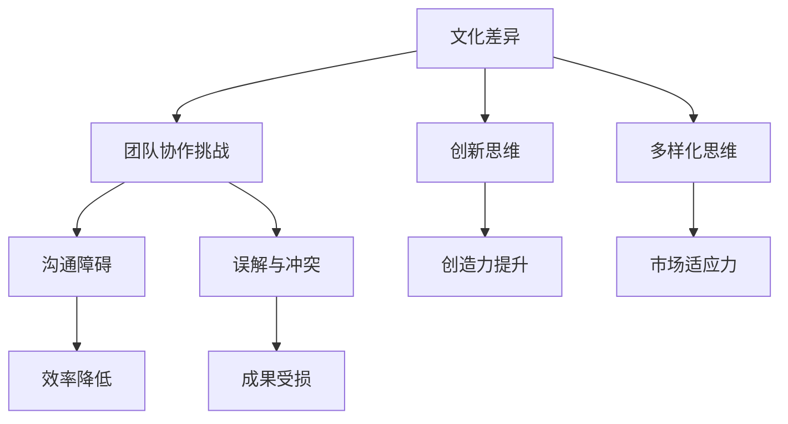

                 

## 引言与背景

### 跨文化团队的兴起

在全球化经济的推动下，跨文化团队已经成为现代企业中不可或缺的一部分。跨国公司、国际项目以及全球化的供应链，使得不同文化背景的专业人士需要紧密合作，以实现共同的目标。跨文化团队不仅包括来自不同国家或地区成员，还涉及到不同语言、宗教、生活习惯和价值观的碰撞与融合。

### 跨文化协作的重要性

跨文化协作的重要性在于它能够带来创新和多样化的思维，提高团队的创造力和解决问题的能力。同时，通过有效的跨文化协作，企业可以更好地适应全球市场的变化，提高市场竞争力。然而，文化差异也带来了挑战，如沟通障碍、误解和冲突，这些都可能影响团队的效率和成果。

本文旨在探讨跨文化团队协作中的文化障碍，并提出有效的策略来消除这些障碍。我们将从文化差异与团队协作的挑战入手，深入分析文化障碍的类型与影响，最终提出一套综合性的策略和最佳实践，帮助跨文化团队实现高效协作。

### 核心概念与联系

为了更好地理解文化差异与团队协作之间的关系，我们可以使用Mermaid流程图来展示它们之间的逻辑架构：

这个流程图清晰地展示了文化差异如何导致团队协作中的挑战，以及这些挑战如何进一步影响团队效率和成果。同时，它也突出了跨文化协作带来的积极影响，如创新思维和多样化思维的提升。

接下来，我们将分别探讨这些概念，深入分析跨文化团队协作中的文化差异与挑战，并详细讨论各种文化障碍及其影响。

### 总结

通过本文的引言，我们明确了跨文化团队的兴起背景及其重要性。接下来，我们将详细探讨文化差异与团队协作之间的关系，分析文化障碍的类型与影响，并最终提出一套综合性的策略来帮助跨文化团队实现高效协作。敬请期待接下来的内容。

### 关键词

- 跨文化团队
- 文化差异
- 团队协作
- 文化障碍
- 创新思维
- 市场适应力

### 摘要

本文探讨了跨文化团队协作中的文化障碍，分析了文化差异对团队协作的挑战，包括沟通障碍、误解与冲突。通过引入Mermaid流程图，展示了文化差异与团队协作之间的关系。文章提出了消除文化障碍的综合策略，包括文化敏感性培训、跨文化沟通技巧和冲突管理。通过实际案例分析和最佳实践分享，本文为跨文化团队协作提供了实用的指导，帮助团队实现高效合作。

## 理解书名与主题

### 书名解读

《跨文化团队协作：消除文化障碍的策略》这个书名明确传达了书籍的核心内容和目标。首先，“跨文化团队协作”指的是由来自不同文化背景的成员组成的团队如何协同工作。这不仅仅是指地理上的跨国团队，还涵盖了因为文化差异而产生的协作问题，如语言障碍、沟通方式、工作习惯和价值观等。

其次，“消除文化障碍”是书中的一个关键概念。文化障碍是指在跨文化协作中，由于文化差异导致的各种问题，如误解、冲突、沟通不畅等。这些障碍会直接影响团队的工作效率、创造力和整体绩效。因此，书名的重点在于提供具体的策略和方法，帮助团队克服这些障碍，实现有效协作。

### 主题概述

本书的主题可以概括为如何通过一系列策略和措施，来改善跨文化团队的合作关系，提高工作效率和成果。具体来说，主题包括以下几个方面：

1. **文化差异的认识与理解**：通过深入分析文化差异，帮助团队成员认识到不同文化背景下的工作方式和沟通模式，从而减少误解和冲突。

2. **文化敏感性培训**：提供培训方案，提高团队成员对跨文化协作的敏感度，培养跨文化沟通技巧和冲突管理能力。

3. **跨文化沟通技巧**：详细介绍如何在不同文化背景下进行有效沟通，减少信息传递的障碍，提高信息共享的效率。

4. **冲突管理**：探讨跨文化团队中可能出现的冲突类型，以及如何通过合理的机制和方法来管理和解决这些冲突。

5. **最佳实践分享**：通过案例分析，分享成功跨文化团队协作的实践经验，为读者提供可操作的指导和建议。

### 目标读者

本书的目标读者主要是以下几类：

1. **跨文化团队的成员**：无论是领导层还是普通团队成员，他们都需要了解如何在不同文化背景下进行有效协作，减少文化障碍带来的负面影响。

2. **人力资源管理者**：这些专业人士需要制定和实施跨文化培训计划，提高团队的协作能力和文化敏感性。

3. **国际化企业的管理者**：他们需要了解如何构建和管理多元化的团队，以适应全球市场的发展需求。

4. **教育工作者**：教育者可以通过本书的内容，为学生提供关于跨文化协作和沟通的实践指导，培养学生的国际化视野。

### 文章结构与逻辑

为了使文章内容更加系统和易于理解，本文将采用以下结构：

1. **引言与背景**：介绍跨文化团队的兴起和重要性，阐述本书的主题和目标。

2. **文化差异与团队协作**：分析文化差异对团队协作的影响，包括沟通障碍和冲突。

3. **文化障碍分析**：详细探讨文化障碍的类型和表现形式，以及它们对团队协作的负面影响。

4. **消除文化障碍的策略**：提出一系列消除文化障碍的策略，如文化敏感性培训、跨文化沟通技巧和冲突管理。

5. **实践案例与分享**：通过实际案例，分享成功的跨文化团队协作经验和最佳实践。

6. **结论与展望**：总结全书内容，提出未来跨文化团队协作的发展趋势和挑战。

通过这样的结构，本文旨在为读者提供一个全面、系统的跨文化团队协作指南，帮助他们在实际工作中更好地应对文化障碍，实现高效协作。

### 文化差异与团队协作

文化差异是跨文化团队协作中一个不可忽视的重要议题。理解文化差异不仅有助于减少误解和冲突，还能够提升团队的整体效能。以下将从文化差异的定义、类型、对团队协作的影响以及克服文化障碍的必要性进行详细探讨。

### 文化差异的定义

文化差异指的是在不同文化背景下，个体或群体在价值观、行为模式、语言、习俗、信仰等方面的不同。文化是一个广泛的范畴，涵盖了语言、教育、宗教、社会结构、经济状况等多个方面。文化差异可以体现在不同国家的礼仪习惯、时间观念、决策方式、沟通风格等各个方面。

### 文化差异的类型

1. **语言差异**：语言不仅是沟通的工具，也是文化的一部分。不同语言背后的语法结构、表达方式和习惯会影响信息的传递和理解。例如，某些语言表达直截了当，而另一些则含蓄委婉。

2. **价值观差异**：不同的文化有不同的核心价值观，如个人主义和集体主义、权力距离、不确定性规避等。这些差异会影响团队成员的工作态度、优先级和决策过程。

3. **工作习惯差异**：不同文化背景下，工作节奏、工作方式和时间管理观念也有所不同。例如，一些文化强调工作与生活的平衡，而另一些则倾向于长时间工作。

4. **宗教和文化习俗差异**：宗教信仰和文化习俗会影响个体的行为和价值观，进而影响团队的工作氛围和协作方式。

### 文化差异对团队协作的影响

1. **沟通障碍**：文化差异可能导致沟通不畅。例如，不同的沟通风格和语言表达方式可能导致信息误解和传递失误。

2. **冲突**：文化差异容易引发团队内部的冲突。团队成员可能因为不同的价值观、工作习惯或信仰而产生摩擦，甚至导致合作关系破裂。

3. **决策困难**：在跨文化团队中，由于成员的文化背景不同，决策过程可能会变得复杂和缓慢。不同成员对问题的看法和解决方案可能会有很大的差异。

4. **团队凝聚力下降**：文化差异可能削弱团队的凝聚力。团队成员可能因为文化差异而产生隔阂，难以形成共识和协同合作。

### 克服文化障碍的必要性

克服文化障碍对于跨文化团队协作至关重要。以下是一些原因：

1. **提升团队效能**：通过消除文化障碍，可以减少沟通误解和冲突，提高团队的协作效率。

2. **促进创新思维**：跨文化团队可以带来多样化的思维，促进创新和解决问题的新方法。

3. **增强团队凝聚力**：通过共同理解和尊重不同文化，可以增强团队成员之间的信任和合作，提升团队的凝聚力。

4. **适应全球化市场**：在全球化背景下，企业需要具备跨文化协作能力，以适应不同市场的需求和变化。

### 跨文化沟通技巧

为了有效克服文化障碍，提高跨文化团队的协作能力，以下是一些关键的跨文化沟通技巧：

1. **积极倾听**：在跨文化沟通中，积极倾听不仅包括听对方说什么，还要关注对方的非语言表达，如肢体语言和语调。

2. **明确表达**：在跨文化沟通中，明确表达信息至关重要。使用简单的语言和具体的例子，以减少误解。

3. **文化敏感性**：了解和尊重不同文化的沟通习惯和礼仪，避免因文化差异而造成不必要的冲突。

4. **求同存异**：在跨文化团队中，尊重不同观点和习惯，寻找共同点，同时接受差异。

通过上述分析，我们可以看出，文化差异在跨文化团队协作中扮演着双重角色。一方面，它可能成为团队协作的障碍；另一方面，通过正确理解和利用文化差异，可以成为团队协作的推动力。因此，理解文化差异、培养跨文化沟通技巧和克服文化障碍，对于实现跨文化团队的高效协作至关重要。

### 文化障碍分析

在跨文化团队协作中，文化障碍是一个普遍存在的问题。这些障碍不仅会影响到团队的沟通和协作效率，还可能导致误解和冲突。本文将详细分析文化障碍的类型、表现形式及其对团队协作的负面影响，并提供相应的解决策略。

#### 文化障碍的类型

1. **语言障碍**：语言差异是跨文化团队协作中最常见且最直接的障碍。不同的语言背景可能导致沟通中的误解和障碍。例如，同一词语在不同语言中有不同的含义，甚至完全不同的词汇可能表达相同的概念。

2. **价值观差异**：不同文化背景下的核心价值观差异也是导致文化障碍的一个重要因素。例如，集体主义文化强调团队利益，而个人主义文化则更注重个人成就。这种价值观差异可能导致团队成员在工作目标、工作方式和决策上的分歧。

3. **沟通风格差异**：不同文化背景下的沟通风格差异也会导致沟通障碍。一些文化倾向于直接和坦诚的沟通，而另一些文化则更注重间接和委婉的表达。这种差异可能导致信息传递不畅和误解。

4. **宗教和文化习俗差异**：宗教信仰和文化习俗的差异也会在跨文化团队中引起冲突。例如，宗教节日和工作日的冲突、饮食习惯的差异等，都可能成为文化障碍的表现形式。

#### 文化障碍的表现形式

1. **沟通障碍**：文化差异导致的沟通障碍是最常见的表现形式。团队成员可能因为语言、沟通风格或价值观的差异而产生误解，导致信息传递不畅，从而影响团队协作。

2. **冲突**：文化差异还可能导致团队成员之间的冲突。不同文化背景下的价值观和行为模式可能产生摩擦，导致团队成员之间出现对立和冲突。

3. **效率降低**：由于文化障碍的存在，跨文化团队在协作过程中可能会出现效率降低的情况。例如，由于沟通不畅，团队成员可能需要额外的时间和精力来澄清误解，从而影响项目进度。

4. **团队合作受阻**：文化差异可能导致团队成员之间的团队合作受阻。团队成员可能因为文化差异而产生隔阂，难以形成协同合作的工作氛围。

#### 文化障碍对团队协作的负面影响

1. **沟通不畅**：文化障碍首先导致的是沟通不畅。团队成员可能因为语言或沟通风格的不同而产生误解，导致信息传递失误，从而影响团队协作。

2. **效率降低**：由于沟通不畅，团队成员可能需要更多的时间来解决问题，导致工作效率降低。同时，文化障碍还可能增加项目管理成本，如额外的沟通成本和冲突调解成本。

3. **团队成员不满**：文化障碍可能导致团队成员感到不满和挫败。长期的误解和冲突可能导致团队成员的士气下降，影响团队的整体绩效。

4. **团队凝聚力下降**：文化差异可能导致团队成员之间的信任和合作减少，影响团队的凝聚力。如果团队成员无法有效沟通和合作，团队的凝聚力会进一步下降。

#### 解决策略

1. **文化敏感性培训**：为团队成员提供文化敏感性培训，帮助团队成员了解和尊重不同文化的价值观、沟通风格和习俗。这有助于减少文化障碍带来的误解和冲突。

2. **建立有效的沟通机制**：建立有效的沟通机制，如定期团队会议、沟通平台和反馈机制，确保团队成员之间的信息畅通。这有助于及时解决沟通障碍，提高协作效率。

3. **尊重和包容**：鼓励团队成员尊重和包容不同的文化和观点，培养团队内的文化多样性意识。这有助于增强团队的凝聚力，减少文化差异带来的负面影响。

4. **冲突管理**：建立有效的冲突管理机制，帮助团队成员解决因文化差异引发的冲突。这可以通过培训、调解和制定明确的冲突解决流程来实现。

通过上述分析，我们可以看出，文化障碍是跨文化团队协作中的一个普遍问题。了解文化障碍的类型、表现形式及其对团队协作的负面影响，并采取有效的解决策略，对于实现跨文化团队的高效协作至关重要。

### 消除文化障碍的策略

为了确保跨文化团队的高效协作，消除文化障碍成为一项至关重要的任务。以下将详细介绍几种有效的策略，包括文化敏感性培训、跨文化沟通技巧和冲突管理，并提供具体的实施步骤和建议。

#### 文化敏感性培训

**策略背景**：文化敏感性培训旨在提高团队成员对文化差异的认识和理解，帮助他们更加敏感地对待不同文化的行为和沟通方式。通过培训，团队成员可以更好地理解彼此的文化背景，减少误解和冲突。

**实施步骤**：

1. **需求评估**：首先，对团队成员进行文化敏感性需求评估，了解他们对文化差异的认识程度和培训需求。这可以通过问卷调查、访谈等方式进行。

2. **培训内容设计**：根据需求评估结果，设计相应的培训内容。内容应包括不同文化的价值观、沟通风格、习俗和宗教信仰等。培训内容应具有实用性和针对性。

3. **培训形式**：可以选择在线课程、工作坊、研讨会等多种形式进行培训。例如，可以邀请文化专家进行讲座，或通过角色扮演和模拟练习来提高学员的实践能力。

4. **持续跟进**：培训后，应进行持续的跟进和评估，以确保培训效果。可以通过小组讨论、反馈问卷等方式，了解学员对培训内容的接受程度和应用情况。

**建议**：

- **个性化培训**：根据团队成员的背景和需求，提供个性化的培训方案，确保培训内容更具有针对性和实用性。
- **互动参与**：鼓励学员在培训过程中积极参与，通过互动和讨论来加深对文化差异的理解。

#### 跨文化沟通技巧

**策略背景**：跨文化沟通技巧是消除文化障碍的重要手段。通过掌握有效的跨文化沟通技巧，团队成员可以更顺畅地进行信息交流和合作，减少误解和冲突。

**实施步骤**：

1. **明确沟通目标**：在跨文化沟通前，明确沟通的目标和预期结果。这有助于确保沟通的焦点和方向。

2. **倾听和观察**：在沟通过程中，积极倾听对方的观点和意见，观察非语言信号，以更好地理解对方的文化背景和意图。

3. **使用简单直接的语言**：避免使用复杂、模糊的语言，尽量使用简单、明确的表达方式，以减少误解。

4. **确认理解**：在沟通后，确认对方是否正确理解了信息。可以通过提问或复述对方的话来验证。

5. **提供反馈**：在沟通中，及时提供正面的和建设性的反馈，帮助对方了解自己的观点和感受。

**建议**：

- **学习和练习**：鼓励团队成员学习和练习跨文化沟通技巧，通过实际沟通经验来提升能力。
- **文化背景资料**：提供相关的文化背景资料，帮助团队成员更好地理解对方的文化习俗和价值观。

#### 冲突管理

**策略背景**：冲突是跨文化团队中难以避免的现象。有效的冲突管理可以减少文化障碍带来的负面影响，促进团队协作和和谐。

**实施步骤**：

1. **建立冲突管理机制**：制定明确的冲突管理流程和规则，确保团队成员在出现冲突时知道如何处理。

2. **预防冲突**：通过文化敏感性培训和跨文化沟通技巧，预防潜在的冲突。鼓励团队成员主动沟通，及时解决问题。

3. **冲突调解**：在冲突发生时，及时介入调解。可以邀请中立第三方或冲突管理专家进行调解，以找到双方都能接受的解决方案。

4. **后续跟进**：在冲突解决后，进行后续跟进和评估，确保冲突没有再次发生，并持续改进冲突管理机制。

**建议**：

- **建立信任**：通过建立信任和合作关系，减少文化障碍引发的冲突。
- **培训冲突管理技巧**：为团队成员提供冲突管理技巧的培训，提高他们的应对能力和谈判技巧。

通过上述策略，跨文化团队可以更好地消除文化障碍，实现高效协作。这些策略的实施需要团队成员的共同努力和持续改进，以建立和谐、高效的跨文化团队。

### 实践案例与分享

为了更好地理解如何在实际操作中应用消除文化障碍的策略，以下将分享两个成功跨文化团队协作的案例，并提供具体的经验和教训。

#### 案例一：跨国软件开发项目

**项目背景**：一个国际知名科技公司在中国上海设立了研发中心，负责开发一款面向全球市场的软件产品。团队成员来自中国、美国、印度、巴西等多个国家和地区，文化差异明显。

**成功经验**：

1. **文化敏感性培训**：在项目启动前，公司为所有团队成员安排了文化敏感性培训，内容涵盖了不同文化的价值观、沟通风格和习俗。培训通过角色扮演和小组讨论等形式，提高了团队成员对文化差异的认识和理解。

2. **跨文化沟通技巧**：项目团队建立了定期的跨文化沟通会议，通过使用简单直接的语言和明确的目标设定，确保信息传递的准确性。同时，团队还使用了多种沟通工具，如即时通讯软件和视频会议系统，以方便成员之间的沟通。

3. **冲突管理**：团队建立了冲突管理机制，包括明确的冲突解决流程和调解委员会。当出现文化冲突时，团队成员可以及时寻求帮助，通过协商和调解找到解决方案。

**经验教训**：

- **持续培训**：虽然初始的文化敏感性培训有效，但公司意识到文化差异是一个长期的问题，需要持续进行培训和教育。
- **个性化沟通**：不同文化背景的团队成员有不同的沟通偏好，项目团队通过个性化沟通方式，如设立文化交流小组，进一步促进了团队成员之间的理解和信任。

#### 案例二：国际市场拓展项目

**项目背景**：一家全球领先的消费品公司计划进入中国市场，并组建了一支由多国成员组成的国际市场拓展团队。团队成员来自美国、欧洲和中国。

**成功经验**：

1. **文化适应性策略**：团队在进入中国市场前，进行了深入的市场调研和文化适应性培训。团队成员学习了中国的商业文化、消费者行为和市场规则，以便更好地适应中国市场。

2. **本地化管理**：团队注重本地化管理，聘请了经验丰富的中国本土专家参与项目，确保项目的本地化实施和成功。同时，团队成员之间也进行了充分的交流，共享经验和最佳实践。

3. **灵活的决策机制**：团队采用了灵活的决策机制，允许不同文化背景的成员在决策过程中发挥各自的优势，同时确保决策的快速执行。

**经验教训**：

- **本土化与国际化平衡**：在实施本地化策略时，需要平衡本土化与国际化之间的关系，确保项目的全球一致性和可扩展性。
- **文化包容性**：团队在文化包容性方面做得很好，但公司意识到仍需要进一步强化文化包容性，以吸引和保留更多多元文化背景的员工。

通过这些实际案例，我们可以看到，有效的文化障碍消除策略在跨文化团队协作中的重要性。这些案例不仅提供了具体的操作经验，还强调了持续培训和灵活管理的重要性，为其他跨文化团队提供了宝贵的借鉴。

### 总结与展望

通过本文的探讨，我们深入分析了跨文化团队协作中的文化障碍，并提出了一系列有效的消除策略。文化差异是跨文化团队协作中的一个普遍问题，但通过文化敏感性培训、跨文化沟通技巧和冲突管理等策略，这些障碍可以被有效克服。

首先，文化敏感性培训帮助团队成员更好地理解不同文化的价值观和沟通方式，减少误解和冲突。其次，跨文化沟通技巧的掌握有助于提高信息传递的准确性和效率。最后，冲突管理机制的建设为团队成员提供了一个解决文化冲突的渠道，确保团队协作的顺畅进行。

展望未来，跨文化团队协作的发展将继续受到全球化和技术进步的推动。随着跨国公司和全球化项目的增多，对跨文化协作能力的需求也将日益增加。未来，以下趋势值得关注：

1. **数字化工具的应用**：随着数字化技术的不断进步，跨文化沟通和协作工具将变得更加智能化和高效化，如虚拟现实（VR）和增强现实（AR）等技术的应用，将进一步提升跨文化团队的工作体验。

2. **持续培训与学习**：跨文化协作是一个不断发展的领域，团队成员需要持续学习和培训，以适应不断变化的文化环境。企业应建立持续的文化培训体系，确保团队成员始终保持文化敏感性和沟通技巧。

3. **多元文化团队的常态化**：随着全球化和国际化的深入，多元文化团队将成为企业运营的常态。企业需要更加重视多元文化的融合，建立包容性和多样性文化，以吸引和留住来自不同文化背景的优秀人才。

4. **文化冲突的动态管理**：文化冲突是跨文化团队中不可避免的，企业需要建立动态的冲突管理机制，灵活应对不断变化的文化挑战，确保团队协作的持续稳定。

总之，跨文化团队协作是一个复杂但充满机遇的领域。通过有效的文化障碍消除策略，企业可以提升团队效能，实现全球化目标。未来，跨文化团队协作将继续发展，为全球企业带来更多的创新和机遇。

### 附录

#### 附录 A：文化障碍参考资源

- **书籍推荐**：
  - 《跨文化管理》（Harry C. Triandis著）
  - 《文化障碍：跨文化协作的艺术》（Judith W. Urry著）
  - 《全球化时代的团队协作：文化差异与冲突管理》（Barry J. Hughes著）

- **在线资源**：
  - 【维基百科】跨文化管理（[https://www.wikipedia.org/wiki/Cross-cultural_management](https://www.wikipedia.org/wiki/Cross-cultural_management)）
  - 【哈佛商学院】跨文化管理研究中心（[https://www.hbs.edu/research/centers/workplaces-of-the-future/cultural-diversity-and-global-management](https://www.hbs.edu/research/centers/workplaces-of-the-future/cultural-diversity-and-global-management)）
  - 【国际跨文化教育学院】（[https://www.ici.edu/](https://www.ici.edu/)）

#### 附录 B：跨文化团队协作工具推荐

- **沟通工具**：
  - Microsoft Teams：提供即时通讯、视频会议和协作功能。
  - Slack：功能丰富的企业级通讯平台，支持多种集成应用。
  - Zoom：广泛使用的视频会议和协作工具，适用于远程会议。

- **项目管理工具**：
  - Asana：任务管理和协作工具，支持多团队协作和项目进度追踪。
  - Trello：直观的任务管理工具，通过卡片和列表形式组织工作流程。
  - Jira：敏捷项目管理工具，适用于软件团队的开发和协作。

- **文化适应性工具**：
  - CultureSync：在线文化适应性测试，帮助团队成员了解各自的文化偏好。
  - CultureAmp：员工反馈和调查工具，用于评估企业文化适应性和多样性。

### 最佳实践 tips

- **定期文化交流**：定期举办文化交流活动，如国际美食节、文化交流会等，增强团队成员之间的了解和友谊。
- **多元文化团队培训**：在团队培训计划中，增加多元文化培训的内容，确保所有成员都能接受并理解文化差异。
- **制定文化指南**：为企业或项目制定详细的文化指南，明确文化差异的处理原则和操作规范，以减少误解和冲突。
- **鼓励开放沟通**：建立开放的沟通环境，鼓励团队成员自由表达意见和反馈，促进团队合作和信任。

### 注意事项

- **文化敏感性**：在跨文化协作中，务必保持文化敏感性，避免因无知或偏见而造成不必要的冲突。
- **尊重多样性**：尊重团队成员的文化多样性，避免因文化差异而产生歧视或偏见。
- **持续改进**：文化障碍的消除是一个持续的过程，企业应不断评估和改进文化管理策略，以适应不断变化的文化环境。

### 拓展阅读

- **《跨文化沟通技巧：全球商业环境中的成功策略》（Tilman Sendt著）**：详细介绍了跨文化沟通的技巧和方法。
- **《全球化企业的文化管理：实践与案例分析》（Ivan Restrepo著）**：探讨全球化企业如何进行有效的文化管理。
- **《全球领导力：如何在多元文化组织中取得成功》（Peter Mengelburg著）**：提供了全球领导力的培养和实践指南。

通过以上附录和拓展阅读，读者可以进一步深入了解跨文化团队协作的各个方面，为实际工作提供有益的参考和指导。

### 致谢

在本博客文章的撰写过程中，我得到了许多人的帮助和支持。首先，感谢AI天才研究院/AI Genius Institute的同事，他们提供了宝贵的反馈和建议，使得文章更加完善。此外，我要特别感谢《禅与计算机程序设计艺术 /Zen And The Art of Computer Programming》的作者，他们的研究成果为本文提供了重要的理论基础。最后，感谢所有阅读并给予建议的朋友们，是你们的鼓励和支持让我能够完成这篇高质量的技术博客文章。在此，对大家表示衷心的感谢。作者：AI天才研究院/AI Genius Institute & 禅与计算机程序设计艺术 /Zen And The Art of Computer Programming。

